# Calculus

> [01—Mathematics](./README.md)

---

## What is it?

Calculus is the mathematics of **change** and **accumulation**. It answers two questions:

1. **How fast is something changing right now?** (Differential Calculus)
2. **How much has accumulated over time?** (Integral Calculus)

## Why do we need it?

Every time a machine learning model "learns," it is using calculus to figure out which direction to adjust its internal numbers to reduce error. Every physics simulation in a video game uses calculus to compute motion. Every signal processing system (audio, video compression) relies on calculus-based transforms.

## Real-world analogy

Imagine you're driving a car.

- Your **speedometer** shows how fast your position is changing _right now_ — that's a **derivative**.
- Your **odometer's total distance** is the accumulation of all the tiny movements you made — that's an **integral**.

```text
Position over time:  ______/‾‾‾‾\______
                          ^        ^
                     speeding up  slowing down
                     (positive     (negative
                      derivative)   derivative)
```

## Historical background

- Ideas of infinitesimal change existed in ancient Greece (Archimedes' method for area of a circle, ~250 BCE) and in medieval India and the Islamic world.
- Modern Calculus was independently developed in the 1660s–1670s by **Isaac Newton** (England) and **Gottfried Wilhelm Leibniz** (Germany) — leading to a famous, bitter priority dispute.
- Leibniz's notation (`dy/dx`, `∫`) is the notation still used worldwide today.
- In the 20th century, calculus became essential to control theory, signal processing, and eventually to the backpropagation algorithm that trains neural networks.

## Mathematical foundation

**Level 1 — Explain it to a 15-year-old:**

Picture a hill. If you're standing on the hill, "how steep is it right here?" is the derivative question. "How much dirt is in the whole hill?" is the integral question. Calculus is just a precise way to answer "how steep" and "how much total" for any curve, not just simple shapes.

**Level 2 — Engineering Level:**

The derivative of a function `f(x)` at a point measures its instantaneous rate of change, defined via a limit:

```
f'(x) = lim (h→0) [f(x+h) - f(x)] / h
```

The integral `∫f(x)dx` measures the accumulated area under the curve of `f(x)`.

**Level 3 — Industry Level:**

In machine learning, we compute the **gradient** — the vector of partial derivatives of a loss function with respect to every model parameter — and use it to update parameters via gradient descent. This exact idea (calculus at scale, computed automatically) is called **automatic differentiation**, and it's the engine behind PyTorch and TensorFlow.

**Level 4 — Research Level:**

Research studies higher-order derivatives (Hessians) for faster optimization methods, continuous-time neural networks (Neural ODEs) that treat network depth as a continuous variable governed by a differential equation, and the mathematics of diffusion models in generative AI (which are literally built from stochastic calculus).

## Formal definition

**Derivative** of `f` at point `a`:

```
f'(a) = lim (h→0) [f(a+h) - f(a)] / h
```

**Definite integral** of `f` from `a` to `b` (Riemann sum definition):

```
∫[a to b] f(x) dx = lim (n→∞) Σ f(xᵢ) · Δx
```

## Core concepts

- **Limit** — the value a function approaches as input approaches some point
- **Derivative** — instantaneous rate of change / slope of the tangent line
- **Partial derivative** — rate of change with respect to one variable, holding others fixed
- **Gradient** — vector of all partial derivatives; points toward steepest increase
- **Chain Rule** — how to differentiate a function composed of other functions
- **Integral** — accumulated area under a curve
- **Taylor Series** — approximating a function using an infinite sum of polynomial terms

## Internal working

When a neural network trains, it computes a **loss** (a number describing how wrong it is), then uses the **chain rule** repeatedly, layer by layer, backward through the network, to find how much each internal weight contributed to the error. This process is called **backpropagation**, and it is nothing but the chain rule applied millions of times, automatically.

## Step-by-step explanation

**How gradient descent works, step by step:**

1. Start with random values for the model's parameters.
2. Compute the loss (how wrong the model currently is).
3. Compute the gradient of the loss with respect to each parameter (using derivatives).
4. Move each parameter slightly in the _opposite_ direction of its gradient (because the gradient points "uphill," and we want to go "downhill" to minimize loss).
5. Repeat until the loss stops improving.

## Visual diagram

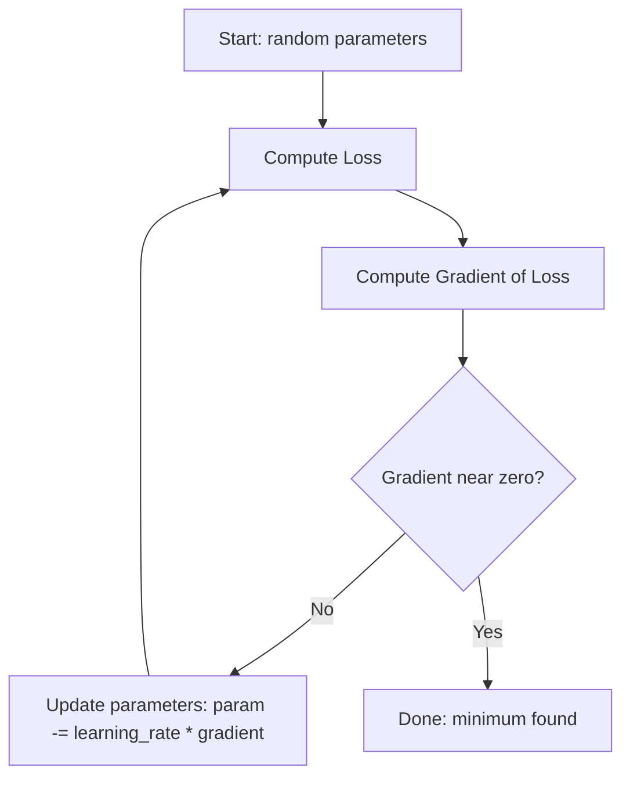

## Architecture diagram

```text
Function landscape (loss surface), viewed from the side:

Loss
 |        *
 |       * *
 |      *   *
 |     *     *
 |    *       *___
 |   *            \___
 |__*_________________\___________  parameter value
        ^ steep            ^ flat (minimum, gradient ≈ 0)
     (big gradient)     (gradient descent stops here)
```

## Flowchart

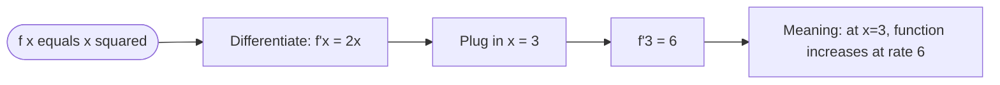

## Example

Find the derivative of `f(x) = x²` using the limit definition:

```
f'(x) = lim (h→0) [(x+h)² - x²] / h
      = lim (h→0) [x² + 2xh + h² - x²] / h
      = lim (h→0) [2xh + h²] / h
      = lim (h→0) [2x + h]
      = 2x
```

So the "shortcut rule" `d/dx(xⁿ) = n·xⁿ⁻¹` is not magic — it comes directly from this limit process.

## Dry run

Trace gradient descent minimizing `f(x) = x²`, starting at `x = 10`, learning rate `= 0.1`:

| Step | x       | f'(x) = 2x | New x = x - 0.1·f'(x)         |
| :--- | :------ | :--------- | :---------------------------- |
| 0    | 10      | 20         | 10 - 2.0 = 8.0                |
| 1    | 8.0     | 16         | 8.0 - 1.6 = 6.4               |
| 2    | 6.4     | 12.8       | 6.4 - 1.28 = 5.12             |
| 3    | 5.12    | 10.24      | 5.12 - 1.024 = 4.096          |
| 4    | 4.096   | 8.192      | 4.096 - 0.8192 = 3.2768       |
| 5    | 3.2768  | 6.5536     | 3.2768 - 0.65536 = 2.62144    |
| 6    | 2.62144 | 5.24288    | 2.62144 - 0.524288 = 2.097152 |
| ...  | ...     | ...        | ...                           |
| 10   | 1.07374 | 2.14748    | 1.07374 - 0.21475 = 0.85899   |
| 20   | 0.11529 | 0.23058    | 0.11529 - 0.02306 = 0.09223   |
| ∞    | 0       | 0          | approaching 0                 |

Notice `x` keeps shrinking toward `0`, the true minimum of `f(x) = x²`.

## Multiple examples

## Example 1 — Constant Function`f(x) = 5` → `f'(x) = 0` (constants don't change)

## Definition

A **constant function** always returns the **same value**, regardless of the input.

In this example,

\[
f(x)=5
\]

No matter what value of `x` you choose, the output is always `5`.

| x   | f(x) |
| --- | ---- |
| -10 | 5    |
| -2  | 5    |
| 0   | 5    |
| 3   | 5    |
| 100 | 5    |

---

## Function Visualization

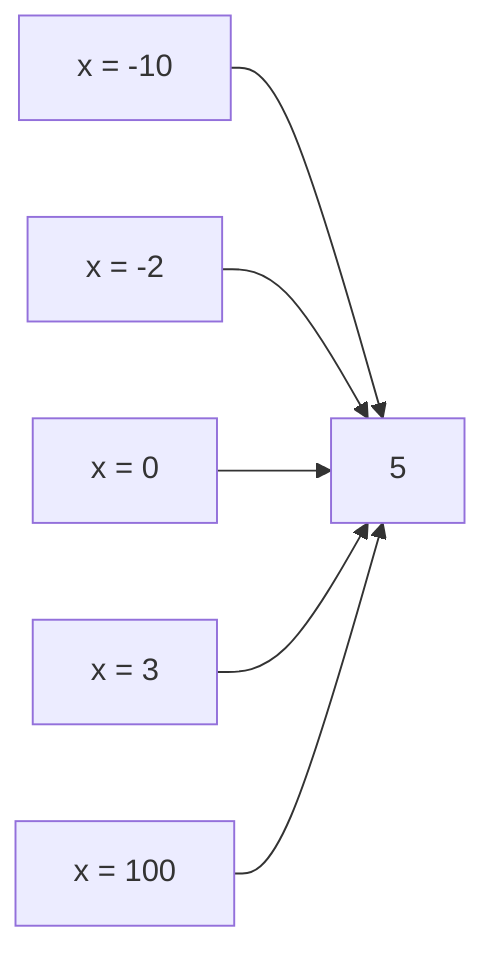

Every input maps to the **same output**.

---

## Graph of the Function

The graph is a **horizontal line**.

```text
y
↑
8 |
7 |
6 |
5 |────────────────────────────────────────────
4 |
3 |
2 |
1 |
0 +--------------------------------------------→ x
```

The height of the graph never changes.

---

## Derivative of a Constant Function

The derivative measures the **rate of change** (or slope).

For

\[
f(x)=5
\]

the graph is perfectly horizontal.

A horizontal line has **zero slope everywhere**.

Therefore,

\[
\boxed{f'(x)=0}
\]

---

## Why?

Suppose you move from

- \(x=1\) to \(x=100\)

The output is still

```
5 → 5
```

Change in output

```
Δy = 5 - 5 = 0
```

Change in input

```
Δx = 100 - 1 = 99
```

Slope

\[
\frac{\Delta y}{\Delta x}
=
\frac{0}{99}
=
0
\]

No matter where you move,

- output never changes
- slope remains zero

---

## Intuition

Imagine walking on a perfectly flat road.

```text
────────────────────────────────────────
```

No uphill.

No downhill.

Just flat.

The slope is

```
0
```

---

## Flow Diagram

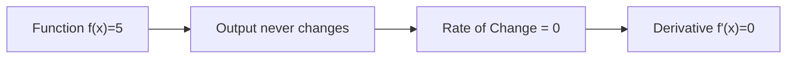

---

## Mathematical Rule

For **any constant** \(c\),

\[
\boxed{\frac{d}{dx}(c)=0}
\]

Examples:

| Function     | Derivative |
| ------------ | ---------- |
| \(f(x)=5\)   | \(0\)      |
| \(f(x)=100\) | \(0\)      |
| \(f(x)=-8\)  | \(0\)      |
| \(f(x)=\pi\) | \(0\)      |
| \(f(x)=e\)   | \(0\)      |

---

# Why is this Important for Machine Learning?

In neural networks and gradient descent, learning depends on the **derivative (gradient)**.

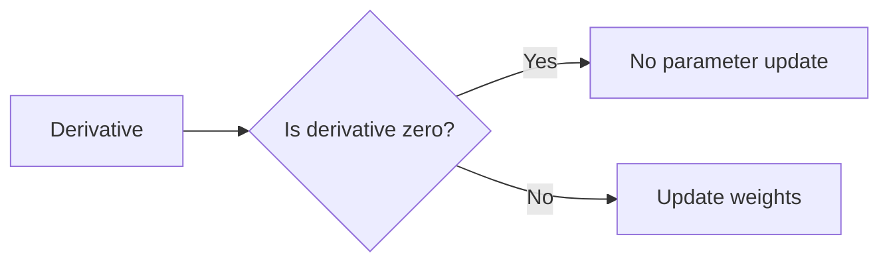

If the derivative is **0**, gradient descent computes

\[
\begin{aligned}
\text{New Weight} &= \text{Weight} - \eta \times 0 \\
&= \text{Weight}
\end{aligned}
\]

Nothing changes because there is **no slope** to follow.

---

## Key Takeaways

- A constant function always returns the same value.
- Its graph is a horizontal line.
- Horizontal lines have zero slope.
- Therefore,

\[
\boxed{f'(x)=0}
\]

- Gradient descent cannot move using a zero gradient because there is no direction of steepest descent.

## Example 2 — Linear Function `f(x) = 3x + 2` → `f'(x) = 3` (constant rate of change)

## Definition

A **linear function** is a function whose graph is a **straight line**.

In this example,

\[
f(x)=3x+2
\]

where:

- **3** → slope (rate of change)
- **2** → y-intercept (starting value when \(x=0\))

---

## Function Breakdown

```text
f(x) = 3x + 2
       │     │
       │     └── y-intercept
       └──────── slope
```

---

## Sample Values

| x   | f(x)=3x+2 |
| --- | --------: |
| -2  |        -4 |
| -1  |        -1 |
| 0   |         2 |
| 1   |         5 |
| 2   |         8 |
| 3   |        11 |

Notice that every time **x increases by 1**, the output increases by **3**.

---

## Input → Output

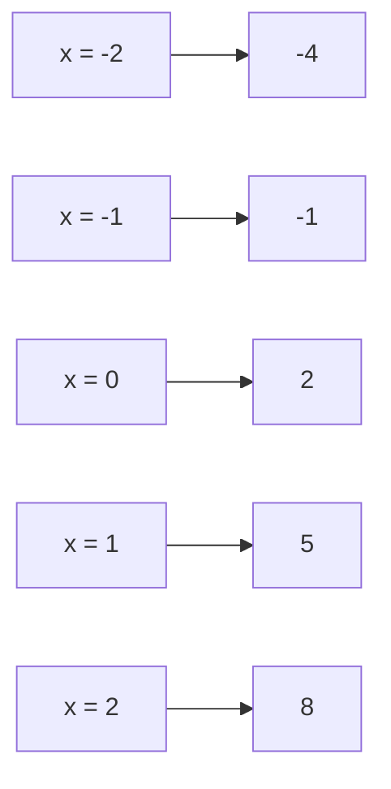

---

# Graph of the Function

The graph is a straight line.

```text
y
↑
12 |                            •
11 |                         •
10 |
 9 |
 8 |                      •
 7 |
 6 |
 5 |                   •
 4 |
 3 |
 2 |                •
 1 |
 0 +----------------------------------------→ x
     -2  -1   0   1   2   3
```

The line always rises at the same angle.

---

# Derivative of a Linear Function

The derivative measures the **rate of change (slope)**.

For

\[
f(x)=3x+2
\]

the derivative is

\[
\boxed{f'(x)=3}
\]

---

## Why?

Let's compare two nearby points.

Suppose

| x   | f(x) |
| --- | ---- |
| 1   | 5    |
| 2   | 8    |

Change in output

```
Δy = 8 − 5 = 3
```

Change in input

```
Δx = 2 − 1 = 1
```

Slope

\[
\frac{\Delta y}{\Delta x}
=
\frac{3}{1}
=
3
\]

Now try another pair.

| x   | f(x) |
| --- | ---- |
| 4   | 14   |
| 5   | 17   |

\[
\frac{17-14}{5-4}
=
\frac{3}{1}
=
3
\]

Still **3**.

The slope never changes.

---

## Why is the Derivative Constant?

Every time x increases by **1**

```text
x : 0 → 1 → 2 → 3 → 4
```

the output increases by **3**

```text
2 → 5 → 8 → 11 → 14
```

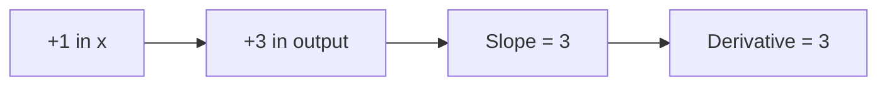

---

# Differentiation Rule

For

\[
f(x)=3x+2
\]

Differentiate term by term.

### Step 1

Derivative of

\[
3x
\]

is

\[
3
\]

because

\[
\frac{d}{dx}(ax)=a
\]

---

### Step 2

Derivative of

\[
2
\]

is

\[
0
\]

because constants never change.

---

### Final Answer

\[
f'(x)
=
3+0
=
\boxed{3}
\]

---

## General Rule

For any linear function

\[
f(x)=mx+c
\]

the derivative is

\[
\boxed{f'(x)=m}
\]

where

- \(m\) = slope
- \(c\) = constant (disappears after differentiation)

Examples

| Function   | Derivative |
| ---------- | ---------- |
| \(2x+5\)   | \(2\)      |
| \(7x-4\)   | \(7\)      |
| \(-3x+10\) | \(-3\)     |
| \(100x+1\) | \(100\)    |

---

## Intuition

Imagine climbing a staircase where every step has exactly the same height.

```text
          •
        •
      •
    •
  •
•____________________________→ x
```

Every step forward raises you by exactly **3 units**.

The steepness never changes.

Therefore,

```
Slope = 3
Derivative = 3
```

---

## Why is this Important for Machine Learning?

During gradient descent, the derivative tells us **how much to update the parameter**.

If the loss function were

\[
f(x)=3x+2
\]

then the gradient is always

\[
3
\]

Every update becomes

\[
x\_{\text{new}}
=
x-\eta(3)
\]

where

- \(\eta\) = learning rate.

Since the gradient never changes, **every optimization step has the same size**.

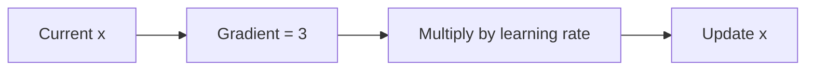

---

## Comparison with a Constant Function

| Function      | Graph           | Derivative |
| ------------- | --------------- | ---------- |
| \(f(x)=5\)    | Horizontal line | 0          |
| \(f(x)=3x+2\) | Straight line   | 3          |

---

# Key Takeaways

- A linear function has a straight-line graph.
- The coefficient of **x** is called the **slope**.
- The slope never changes.
- The derivative of a linear function is always its slope.

\[
\boxed{\frac{d}{dx}(mx+c)=m}
\]

For this example,

\[
\boxed{\frac{d}{dx}(3x+2)=3}
\]

## Example 3 — Chain Rule

` f(x) = (2x + 1)³` →

`f'(x) = 3(2x+1)² · 2= `→

`6(2x+1)²`

## Definition

The **Chain Rule** is used when one function is **inside another function** (a **composite function**).

In this example,

\[
f(x)=(2x+1)^3
\]

Notice there are **two functions**:

- **Outer function:** \(u^3\)
- **Inner function:** \(u=2x+1\)

The Chain Rule says:

\[
\boxed{\frac{d}{dx}[f(g(x))]=f'(g(x))\cdot g'(x)}
\]

Simply remember:

> **Derivative of the outer function × Derivative of the inner function**

---

## Visualizing the Function

Think of the function as two layers.

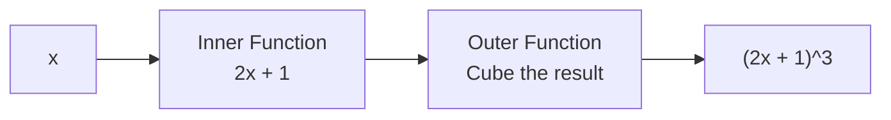

The input passes through **two transformations**.

---

# Step 1 — Identify the Inner Function

The expression inside the parentheses is

\[
u=2x+1
\]

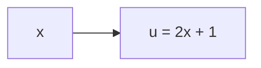

---

# Step 2 — Identify the Outer Function

The outer function is

\[
u^3
\]

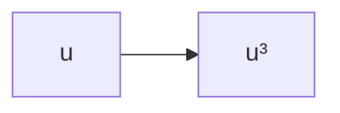

---

# Step 3 — Differentiate the Outer Function

Treat the inside as a single variable.

Suppose

\[
y=u^3
\]

Differentiate:

\[
\frac{dy}{du}=3u^2
\]

Now replace \(u\) back.

\[
3(2x+1)^2
\]

Notice we **did not differentiate the inside yet.**

---

# Step 4 — Differentiate the Inner Function

The inner function is

\[
2x+1
\]

Differentiate:

\[
\frac{d}{dx}(2x+1)=2
\]

because

- derivative of \(2x\) is **2**
- derivative of **1** is **0**

So

\[
2+0=2
\]

---

# Step 5 — Apply the Chain Rule

Multiply both derivatives.

Outer derivative

\[
3(2x+1)^2
\]

×

Inner derivative

\[
2
\]

Result

\[
3(2x+1)^2\times2
\]

Simplify

\[
\boxed{6(2x+1)^2}
\]

---

# Complete Differentiation

```text
f(x) = (2x+1)³

        │
        ▼
Differentiate outside
        │
        ▼
3(2x+1)²

        │
Multiply by derivative
of inside

        ▼
× 2

        ▼
6(2x+1)²
```

---

# Flow of the Chain Rule

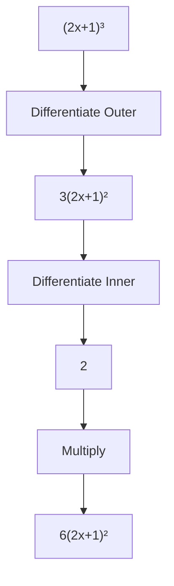

---

# Verify Using Expansion (Optional)

Expand first.

\[
(2x+1)^3
\]

Using

\[
(a+b)^3
=
a^3+3a^2b+3ab^2+b^3
\]

gives

\[
8x^3+12x^2+6x+1
\]

Differentiate term by term.

\[
24x^2+24x+6
\]

Now compare with the Chain Rule result.

\[
6(2x+1)^2
\]

Expand.

\[
6(4x^2+4x+1)
\]

\[
24x^2+24x+6
\]

Both methods give exactly the same answer.

Chain Rule is much faster.

---

# Numerical Example

Suppose

\[
x=2
\]

Function value

\[
f(2)
=
(2(2)+1)^3
=
5^3
=
125
\]

Derivative

\[
f'(2)
=
6(5)^2
=
6(25)
=
150
\]

At \(x=2\), the slope of the curve is **150**.

---

# Why Do We Multiply?

Imagine a factory.

The input passes through **two machines**.

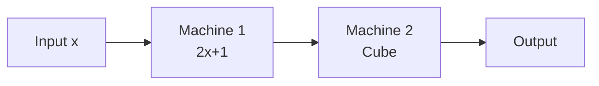

If the first machine changes faster,

and the second machine also changes,

their effects combine.

That's why we **multiply** the derivatives.

---

# General Chain Rule

If

\[
y=[g(x)]^n
\]

then

\[
\boxed{
\frac{dy}{dx}
=
n[g(x)]^{n-1}\cdot g'(x)
}
\]

Examples

| Function       | Derivative                     |
| -------------- | ------------------------------ |
| \((3x+1)^2\)   | \(2(3x+1)\cdot3=6(3x+1)\)      |
| \((5x-4)^4\)   | \(4(5x-4)^3\cdot5=20(5x-4)^3\) |
| \((x^2+1)^5\)  | \(5(x^2+1)^4\cdot2x\)          |
| \((\sin x)^6\) | \(6(\sin x)^5\cos x\)          |

---

# Why is the Chain Rule Important in Machine Learning?

Neural networks are **nested functions**.

For example,

```text
Input
   │
   ▼
Linear Layer
   │
   ▼
ReLU
   │
   ▼
Linear Layer
   │
   ▼
Sigmoid
   │
   ▼
Loss
```

Each layer receives the output of the previous layer.

During **backpropagation**, gradients are computed using the **Chain Rule**.

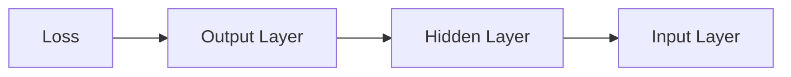

Each layer multiplies its local derivative with the gradient coming from the next layer.

Without the Chain Rule, **backpropagation—the learning algorithm behind neural networks—would not be possible.**

---

# Key Takeaways

- The **Chain Rule** is used for **composite (nested) functions**.
- Differentiate the **outer function first**.
- Then differentiate the **inner function**.
- Multiply the two derivatives.

\[
\boxed{
\frac{d}{dx}[f(g(x))]
=
f'(g(x))
\times
g'(x)
}
\]

For this example,

\[
f(x)=(2x+1)^3
\]

\[
\boxed{
f'(x)=6(2x+1)^2
}
\]

**Memory Trick:**

> **Outer first → Inner next → Multiply**

## Advantages

- Enables precise modeling of continuous, real-world change (physics, economics, biology).
- Forms the mathematical basis of nearly all modern machine learning training.
- Provides tools (Taylor series) to approximate complex functions with simple polynomials.

## Disadvantages

- Requires functions to be differentiable — not every real-world function is smooth (e.g., functions with sharp corners).
- Numerical differentiation (used inside computers) can suffer from floating-point precision errors.
- Gradient-based optimization can get stuck in "local minima" that aren't the true best answer.

## Complexity

| Operation                                                 | Typical Computational Cost                              |
| --------------------------------------------------------- | ------------------------------------------------------- |
| Symbolic differentiation of simple function               | O(size of expression)                                   |
| Numerical gradient (finite differences), n parameters     | O(n) function evaluations                               |
| Automatic differentiation (backpropagation), n parameters | O(1) times the cost of a forward pass (very efficient!) |

## Memory usage

Automatic differentiation frameworks (like PyTorch's autograd) must store intermediate values from the "forward pass" in memory so they can be reused during the "backward pass" — this is why training large neural networks needs large amounts of GPU memory.

## Time complexity

Backpropagation's brilliance is that it computes gradients for _all_ parameters in roughly the same time as a single forward pass — not by doing a separate slow calculation for every parameter individually.

## Best practices

- Always understand _what_ a derivative or gradient represents physically/geometrically before applying formulas blindly.
- When implementing gradient descent, tune the **learning rate** carefully — too large causes divergence, too small is painfully slow.
- Use automatic differentiation libraries in production; do not hand-derive gradients for complex models.

## Common mistakes

- Confusing "derivative equals zero" with "this is the global minimum" — it may be a local minimum, local maximum, or saddle point.
- Forgetting the chain rule when differentiating nested/composed functions.
- Mixing up `dy/dx` (a derivative) with `Δy/Δx` (an average rate of change over a finite interval) — they are only equal in the limit.

## Interview questions

1. What is the geometric meaning of a derivative?
2. Explain gradient descent in plain English.
3. Why do we use the chain rule in backpropagation?
4. What is the difference between a local minimum and a global minimum?
5. What happens if the learning rate is too high?

## University questions

1. Derive the derivative of `sin(x)` from the limit definition.
2. Evaluate `∫(2x + 3)dx`.
3. Find the critical points of `f(x) = x³ - 3x` and classify them.
4. State and prove the chain rule.

## Coding examples

### Pseudocode

```text
FUNCTION gradientDescent(f, f_derivative, start_x, learning_rate, iterations):
    x = start_x
    FOR i FROM 1 TO iterations:
        gradient = f_derivative(x)
        x = x - learning_rate * gradient
    RETURN x
```

### Python implementation

```python
def f(x):
    return x ** 2

def f_derivative(x):
    return 2 * x

def gradient_descent(start_x, learning_rate=0.1, iterations=50):
    x = start_x
    for _ in range(iterations):
        grad = f_derivative(x)
        x = x - learning_rate * grad
    return x

result = gradient_descent(start_x=10)
print(f"Minimum found near x = {result:.4f}")  # close to 0
```

### C implementation

```c
#include <stdio.h>

double f_derivative(double x) {
    return 2 * x;
}

double gradientDescent(double startX, double learningRate, int iterations) {
    double x = startX;
    for (int i = 0; i < iterations; i++) {
        double grad = f_derivative(x);
        x = x - learningRate * grad;
    }
    return x;
}

int main() {
    double result = gradientDescent(10.0, 0.1, 50);
    printf("Minimum found near x = %.4f\n", result);
    return 0;
}
```

### C++ implementation

```cpp
#include <iostream>
using namespace std;

double fDerivative(double x) {
    return 2 * x;
}

double gradientDescent(double startX, double learningRate, int iterations) {
    double x = startX;
    for (int i = 0; i < iterations; i++) {
        double grad = fDerivative(x);
        x -= learningRate * grad;
    }
    return x;
}

int main() {
    double result = gradientDescent(10.0, 0.1, 50);
    cout << "Minimum found near x = " << result << endl;
}
```

### Java implementation

```java
public class GradientDescent {
    static double fDerivative(double x) {
        return 2 * x;
    }

    static double gradientDescent(double startX, double learningRate, int iterations) {
        double x = startX;
        for (int i = 0; i < iterations; i++) {
            double grad = fDerivative(x);
            x -= learningRate * grad;
        }
        return x;
    }

    public static void main(String[] args) {
        double result = gradientDescent(10.0, 0.1, 50);
        System.out.printf("Minimum found near x = %.4f%n", result);
    }
}
```

## Visualization

```text
Gradient descent path on f(x) = x^2:

x:  10 ---> 8.0 ---> 6.4 ---> 5.12 ---> 4.096 ---> ... ---> ~0

Each step gets smaller as we approach the minimum,
because the gradient (slope) itself gets smaller near x = 0.
```

## Industry use

- **Deep Learning**: every model (image recognition, ChatGPT-style language models, recommendation engines) is trained using gradient-based optimization powered by calculus.
- **Physics engines in games**: calculate velocity and acceleration (derivatives of position) every frame.
- **Signal processing**: audio/video compression uses integral-transform techniques (Fourier Transform) rooted in calculus.
- **Robotics**: motion planning uses derivatives (velocity, acceleration, jerk) for smooth trajectories.

## Research relevance

Ongoing research includes Neural Ordinary Differential Equations (treating a neural network's depth as continuous, governed by calculus), diffusion-based generative models (built on stochastic calculus), and second-order optimization methods that use curvature information (the Hessian matrix) for faster convergence.

## Related concepts

- Linear Algebra (gradients are vectors, Hessians are matrices)
- Optimization (calculus is the primary tool for finding minima/maxima)
- Probability (expectation is defined via integration)

## Practice problems

1. Differentiate `f(x) = 3x⁴ - 5x² + 7`.
2. Compute `∫(4x³)dx`.
3. Find the second derivative of `f(x) = x⁵` and explain what it represents.
4. Write code that numerically estimates the derivative of any given function using the limit definition with a small `h`.

## Advanced concepts

- **Partial derivatives** and **multivariable calculus** — needed when a function has many inputs (like a neural network with millions of weights).
- **Jacobian matrix** — the matrix of all first-order partial derivatives of a vector-valued function.
- **Hessian matrix** — the matrix of second-order partial derivatives, describing curvature, used in advanced optimization.
- **Taylor Series** — approximating any smooth function as a polynomial, foundational to numerical methods.

## Summary

Calculus gives us precise tools to measure change (derivatives) and accumulation (integrals). In computer science, its most important modern application is training machine learning models via gradient-based optimization — a direct, large-scale application of the chain rule.

## Key takeaways

- A derivative measures instantaneous rate of change (slope).
- An integral measures accumulated area/total.
- Gradient descent uses derivatives to iteratively find the minimum of a function.
- Backpropagation in neural networks is the chain rule, applied automatically and efficiently.
- Not every "slope = 0" point is the best answer — check for local vs. global minima.

## References

- Stewart, J. _Calculus_.
- 3Blue1Brown, _Essence of Calculus_ video series.
- Goodfellow, Bengio, Courville. _Deep Learning_, Chapter 4 (Numerical Computation).
- Robbins, H., Monro, S. (1951). _A Stochastic Approximation Method_.

---

⬅ Back to [Phase 01 — Mathematics README](./README.md)
