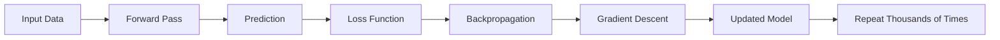
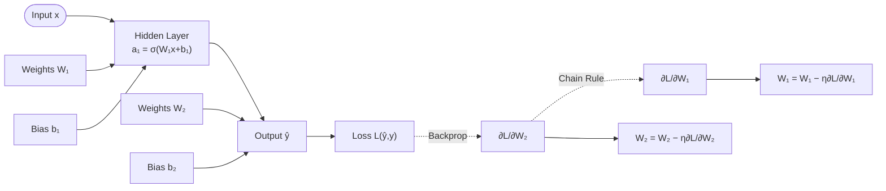
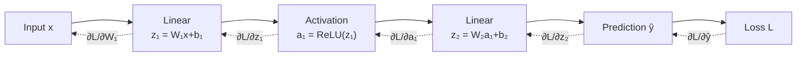
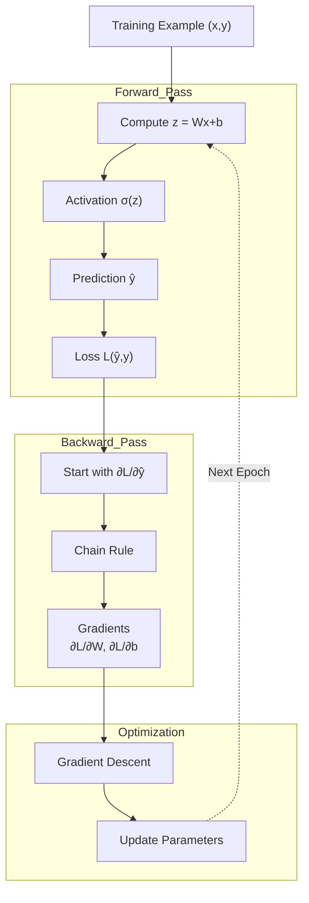

# Differentiation (Backpropagation) in Neural Networks

> [01—Mathematics](./README.md)

---

# The Big Picture



The entire training process consists of two phases:

1. **Forward Pass** → Make a prediction.
2. **Backward Pass (Backpropagation)** → Learn from the error.

---

# Diagram 1 — High-Level Backpropagation



---

## Step 1 — Input Layer

The network receives training data.

Example:

```text
x = [5, 2]
```

This could represent:

- Height & Weight
- Pixels of an image
- Sensor readings
- Stock prices

The neural network knows **nothing** yet—it only receives numerical values.

---

## Step 2 — Hidden Layer

The first layer performs a **linear transformation**:

\[
z_1=W_1x+b_1
\]

where:

- (W_1) = weights
- (x) = input
- (b_1) = bias

The output then passes through an activation function:

\[
a_1=\sigma(z_1)
\]

Examples of activation functions:

- ReLU
- Sigmoid
- Tanh

### Why?

Without activation functions, the network can only learn **linear relationships**.

The hidden layer extracts useful features from the input.

Think of it as asking:

> **"What important patterns exist in this data?"**

---

## Step 3 — Output Layer

The next layer computes

\[
z_2=W_2a_1+b_2
\]

which produces the prediction

\[
\hat y
\]

Example:

```text
Prediction = Cat
```

---

## Step 4 — Loss Function

The prediction is compared with the correct answer.

Example:

```text
Prediction = Cat

Actual = Dog
```

The loss function measures the error.

Common examples:

### Mean Squared Error

\[
L=(\hat y-y)^2
\]

### Cross Entropy

Used for classification tasks.

The loss answers:

> **"How wrong is the prediction?"**

Higher loss means poorer predictions.

---

## Step 5 — Backpropagation Begins

Now calculus enters the picture.

We compute the gradient

\[
\frac{\partial L}{\partial W_2}
\]

This means:

> **"If W₂ changes slightly, how much will the loss change?"**

This derivative tells us whether each weight should increase or decrease.

---

## Step 6 — Chain Rule

The hidden layer affects the loss **indirectly**.

```text
W₁
 ↓
Hidden Layer
 ↓
Output
 ↓
Loss
```

Because of this dependency chain, calculus applies the **Chain Rule**:

\[
\frac{\partial L}{\partial W_1}
===============================

\frac{\partial L}{\partial \hat y}
\cdot
\frac{\partial \hat y}{\partial a_1}
\cdot
\frac{\partial a_1}{\partial W_1}
\]

Each derivative measures one small relationship.

Multiplying them together gives the overall effect of changing (W_1).

This is the mathematical foundation of **Backpropagation**.

---

## Step 7 — Update Weights

Finally, Gradient Descent updates every weight:

\[
W=W-\eta\frac{\partial L}{\partial W}
\]

where

\[ (W) = current weight\]

\[ (\eta) = learning rate \]

\[ (\frac{\partial L}{\partial W}) = gradient \]

If the gradient is positive, the weight decreases.

If the gradient is negative, the weight increases.

The goal is always:

> **Reduce the loss.**

---

# What Diagram 1 Teaches

```text
Forward Pass
      ↓
Prediction
      ↓
Loss
      ↓
Backpropagation
      ↓
Gradient
      ↓
Weight Update
```

Diagram 1 gives the **big-picture workflow** of neural network training.

---

# Diagram 2 — Chain Rule Visualization



---

# Forward Pass

Information flows from **left to right**.

```text
Input
 ↓
Linear Layer
 ↓
Activation
 ↓
Linear Layer
 ↓
Prediction
 ↓
Loss
```

---

## Linear Layer

Each neuron computes

\[
z=Wx+b
\]

This is simply a **weighted sum** of the inputs.

---

## Activation Function

Examples:

```text
ReLU(x)=max(0,x)
```

or

```text
Sigmoid(x)
```

The activation introduces **non-linearity**.

Without activation functions,

multiple neural network layers collapse into one linear transformation.

---

## Prediction

The network outputs

\[
\hat y
\]

---

## Loss

The prediction is compared against the ground truth.

The resulting error becomes the starting point of learning.

---

# Backward Pass

Notice the arrows now move **backwards**.

Each arrow represents one derivative.

Instead of sending information,

the network sends **error signals**.

---

## First Derivative

\[
\frac{\partial L}{\partial \hat y}
\]

Meaning:

> **How sensitive is the loss to the prediction?**

---

## Second Derivative

\[
\frac{\partial L}{\partial z_2}
\]

The error continues moving into the previous layer.

---

## Continue Backward

Eventually we compute

\[
\frac{\partial L}{\partial W_1}
\]

Every layer contributes one derivative.

These derivatives are multiplied together using the **Chain Rule**.

---

# What Diagram 2 Teaches

Instead of explaining the whole training process,

Diagram 2 focuses specifically on

> **How derivatives flow backward through each layer.**

This is the essence of **Backpropagation**.

---

# Diagram 3 — Complete Training Pipeline



---

# Stage 1 — Forward Pass

The network predicts an output.

```text
Input
 ↓
Linear
 ↓
Activation
 ↓
Prediction
 ↓
Loss
```

At this stage,

**no learning occurs.**

The network only performs computations.

---

# Stage 2 — Backward Pass

Differentiation now begins.

The network computes

```text
∂L/∂Output
      ↓
∂L/∂Layer2
      ↓
∂L/∂Layer1
      ↓
∂L/∂Weights
```

These values are called **gradients**.

Gradients tell us

- which direction to move
- how much to change each parameter

---

# Stage 3 — Optimization

Gradient Descent updates every parameter.

Example:

```text
Old Weight = 0.80

Gradient = +0.12

Learning Rate = 0.10

New Weight

0.80 − 0.10 × 0.12

= 0.788
```

Notice the loss should become slightly smaller.

---

# Repeat

Training repeats this process thousands of times.

```text
Epoch 1
   ↓
Epoch 2
   ↓
Epoch 3
   ↓
...
   ↓
Loss becomes smaller
```

Eventually the model learns parameters that minimize the loss.

---

# Summary Table

| Diagram       | Purpose             | Main Concept                                                                                                                             |
| ------------- | ------------------- | ---------------------------------------------------------------------------------------------------------------------------------------- |
| **Diagram 1** | High-level view     | Shows the complete training workflow: forward pass, loss computation, backpropagation, and weight updates.                               |
| **Diagram 2** | Chain Rule          | Demonstrates how derivatives propagate backward through each layer using the Chain Rule.                                                 |
| **Diagram 3** | End-to-End Pipeline | Combines forward propagation, backpropagation, gradient computation, optimization, and repeated epochs into one complete learning cycle. |

---

# Key Takeaways

- A neural network first performs a **Forward Pass** to generate predictions.

- A **Loss Function** measures how incorrect those predictions are.

- **Backpropagation** uses differentiation to compute gradients for every parameter.

- The **Chain Rule** allows gradients to flow backward through multiple layers.

- **Gradient Descent** updates weights in the direction that reduces the loss.

- Repeating this cycle over many epochs gradually improves the model until it makes accurate predictions.

---

> **One-Sentence Summary**
>
> **Forward propagation makes predictions, backpropagation uses calculus to compute gradients, and gradient descent updates the weights so the neural network learns from its mistakes.**
