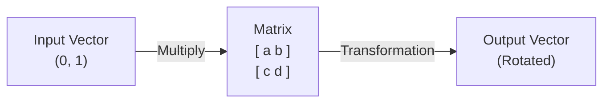
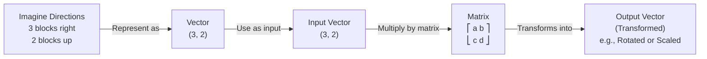
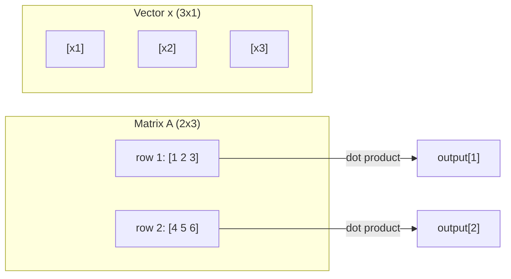
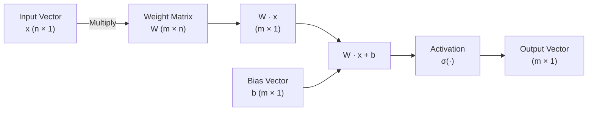
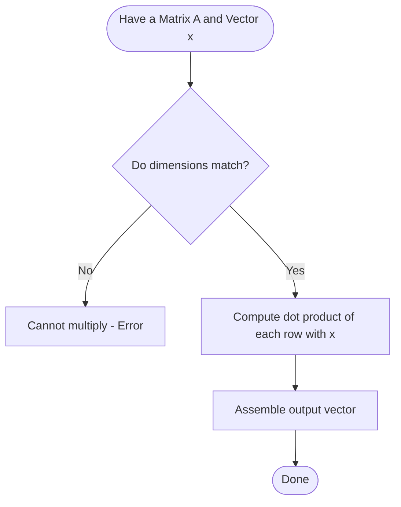
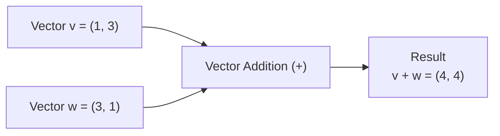

# Linear Algebra

> Part of [01—Mathematics](./README.md)

---

## What is it?

Linear Algebra is the branch of mathematics that studies **vectors**, **matrices**, and the **transformations** you can do with them.

In the simplest terms: Linear Algebra is the mathematics of **organized lists of numbers**, and the rules for combining and transforming those lists.

## Why do we need it?

Every image on your screen is a grid of numbers (pixels). Every 3D character in a video game is a list of coordinates. Every machine learning model is, underneath, a giant collection of numbers being multiplied together. Linear Algebra gives us the tools to manipulate all of this efficiently and correctly.

Without Linear Algebra:

- Computer graphics could not rotate, scale, or move objects.
- Search engines could not rank billions of web pages.
- Machine learning models could not exist in their current form.
- Image compression (like JPEG) would not work.

## Real-world analogy

Think of a **vector** as an arrow giving instructions: "walk 3 steps east, then 4 steps north." It has a direction and a length (magnitude).

Think of a **matrix** as a _machine_ that takes an arrow as input and outputs a new, transformed arrow — it might stretch it, rotate it, flip it, or squash it flat.



**Level 1 — Explain it to a 15-year-old:**

Imagine you're giving directions on a map: "3 blocks right, 2 blocks up." That's a vector: `(3, 2)`. If you have two sets of directions, you can add them together to get a combined direction. That's it — vectors are just organized directions, and we have rules for combining them.



**Level 2 — Engineering Level:**

A vector `v ∈ ℝⁿ` is an ordered tuple of `n` real numbers. A matrix `A ∈ ℝᵐˣⁿ` is a rectangular array of numbers with `m` rows and `n` columns, and it represents a **linear transformation** from `ℝⁿ` to `ℝᵐ`.

**Level 3 — Industry Level:**

In production ML systems, vectors and matrices are stored as tensors (n-dimensional arrays) and operations are executed on GPUs using highly optimized libraries (BLAS, cuBLAS) because matrix multiplication is the single most repeated operation in deep learning — a modern neural network layer is just `output = activation(W·x + b)`.

**Level 4 — Research Level:**

Research explores structured matrices (sparse, low-rank, Toeplitz) to make massive models computationally feasible, and studies the geometry of high-dimensional vector spaces to understand why deep learning generalizes.

## Formal definition

A **vector space** `V` over a field `𝔽` (usually the real numbers `ℝ`) is a set equipped with two operations — vector addition and scalar multiplication — satisfying eight axioms (closure, associativity, commutativity of addition, existence of a zero vector, existence of additive inverses, and compatibility/distributivity of scalar multiplication).

A **matrix** `A ∈ ℝᵐˣⁿ` represents a linear map `T: ℝⁿ → ℝᵐ` such that `T(x) = Ax`, and linearity means:

```

T(u + v) = T(u) + T(v)
T(c·u) = c·T(u)

```

## Core concepts

- **Scalar** — a single number (e.g., `5`)
- **Vector** — an ordered list of numbers, e.g. `[2, 5, -1]`
- **Matrix** — a 2D grid of numbers
- **Dot product** — measures how much two vectors point in the same direction
- **Matrix multiplication** — combines two transformations into one
- **Determinant** — a single number describing how much a matrix scales area/volume
- **Eigenvalues / Eigenvectors** — special directions that a matrix only stretches, never rotates
- **Rank** — the number of independent directions a matrix's output can reach

## Internal working

When you multiply matrix `A` by vector `x`, each entry of the output is the dot product of a row of `A` with `x`. This is literally a "weighted sum" repeated for every row — which is why matrix multiplication is central to neural networks: each neuron output is a weighted sum of its inputs.

## Step-by-step explanation

**How matrix multiplication works, step by step:**

1. Check that the number of columns of `A` equals the number of rows of `B`.
2. For each output cell `(i, j)`, take row `i` from `A` and column `j` from `B`.
3. Multiply corresponding entries and add them up (this is a dot product).
4. Place the result in cell `(i, j)` of the output matrix.
5. Repeat for every cell.

## Visual diagram



## Architecture diagram

Neural Network Layer as Linear Algebra:



## Flowchart



## Example

Multiply matrix `A` by vector `x`:

```
A = [1  2]      x = [5]
    [3  4]          [6]

Row 1: (1*5) + (2*6) = 5 + 12 = 17
Row 2: (3*5) + (4*6) = 15 + 24 = 39

Result = [17]
         [39]
```

## Dry run

Let's trace `A·x` where `A = [[2,0],[1,3]]`, `x = [4,1]`:

| Step  | Operation                    | Result   |
| ----- | ---------------------------- | -------- |
| 1     | Row 1 · x = (2 * 4)+(0*1)    | 8        |
| 2     | Row 2 · x = (1 \* 4)+(3 \*1) | 7        |
| Final | Output vector                | `[8, 7]` |

## Multiple examples

**Example 1 — Identity matrix** (does nothing):

```
[1 0]   [x]   [x]
[0 1] * [y] = [y]
```

**Example 2 — Scaling matrix** (doubles both directions):

```
[2 0]   [x]   [2x]
[0 2] * [y] = [2y]
```

**Example 3 — Rotation matrix** (rotates by angle θ):

```
[cosθ  -sinθ]   [x]
[sinθ   cosθ] * [y]
```

## Advantages

- Extremely efficient on modern hardware (GPUs are matrix-multiplication machines).
- Provides a compact way to represent huge systems of equations.
- Generalizes cleanly to any number of dimensions.

## Disadvantages

- Can become computationally expensive: multiplying two `n x n` matrices naively costs `O(n³)`.
- High-dimensional intuition is hard for humans — we can visualize 2D and 3D, not 500D.
- Numerical instability can occur with very large or very small numbers (floating-point error).

## Complexity

| Operation                        | Time Complexity                              | Real-Life Application                  | In Depth                                                                                                            |
| -------------------------------- | -------------------------------------------- | -------------------------------------- | ------------------------------------------------------------------------------------------------------------------- |
| Vector addition (size _n_)       | **O(n)**                                     | Combining two lists of values          | Updating GPS coordinates, combining feature vectors, gradient updates in machine learning                           |
| Dot product (size _n_)           | **O(n)**                                     | Computing the output of a neuron in AI | Calculating similarity (cosine similarity), neuron computation in neural networks, recommendation systems           |
| Matrix-vector multiply (_m × n_) | **O(m·n)**                                   | Making predictions in machine learning | Forward pass of a neural network layer, image transformations, linear regression predictions                        |
| Matrix-matrix multiply (_n × n_) | **O(n³)** (naive), **O(n^2.37)** theoretical | Training deep learning models          | Training deep learning models, computer graphics, scientific simulations, robotics, 3D transformations              |
| Matrix inverse (_n × n_)         | **O(n³)**                                    | Solving systems of equations           | Solving systems of linear equations, Kalman filters, control systems, statistical modeling, engineering simulations |

## Memory usage

An `n x n` matrix of floating-point numbers (8 bytes each) uses `8·n²` bytes. A 1000x1000 matrix uses 8 MB. This is why sparse <b>matrix formats exist</b> — storing only non-zero values when most entries are zero.

## Time complexity

See the table above — the key takeaway for engineers: **matrix multiplication is O(n³)**, so doubling matrix size makes multiplication roughly 8x slower. This directly explains why training huge AI models needs GPU/TPU hardware.

## Best practices

- Use established libraries (NumPy, BLAS, LAPACK) rather than writing your own matrix math for production code — they are heavily optimized.
- Watch out for shape mismatches; always sanity-check matrix dimensions before multiplying.
- Normalize/scale your data before feeding it into linear algebra-heavy algorithms (like PCA) to avoid one feature dominating due to scale.

## Common mistakes

- Confusing `A·B` with `B·A` — **matrix multiplication is not commutative** in general.
- Forgetting that the dot product of two vectors is a single number (scalar), not a vector.
- Assuming every matrix has an inverse (only square, non-singular matrices do).

## Interview Questions

### 1. What is the difference between a vector and a matrix?

A **vector** is a one-dimensional collection of numbers that represents a magnitude and direction or a list of values.

Example:

\[
\mathbf{v} =
\begin{bmatrix}
2 \\
5 \\
7
\end{bmatrix}
\]

A **matrix** is a two-dimensional collection of numbers arranged in rows and columns.

Example:

\[
A =
\begin{bmatrix}
1 & 2 \\
3 & 4
\end{bmatrix}
\]

**In simple terms:**

- **Vector:** A single row or column of numbers.
- **Matrix:** A table of numbers.

---

### 2. Why is matrix multiplication not commutative?

Matrix multiplication depends on the order of multiplication.

In general,

\[
AB \neq BA
\]

because each multiplication combines the **rows of the first matrix** with the **columns of the second matrix**. Changing the order changes which rows and columns interact, producing a different result or sometimes making multiplication impossible due to incompatible dimensions.

**Example:**

\[
A=
\begin{bmatrix}
1&2\\
3&4
\end{bmatrix},
\quad
B=
\begin{bmatrix}
5&6\\
7&8
\end{bmatrix}
\]

Here,

\[
AB \neq BA
\]

**Real-world analogy:** Wearing **socks then shoes** is different from wearing **shoes then socks**.

---

### 3. What does the determinant of a matrix tell you?

The **determinant** is a single number that describes important properties of a square matrix.

It tells you:

- Whether the matrix is **invertible**.
- How much the matrix **scales area or volume**.
- Whether a transformation **flips** the orientation.

**Interpretation:**

- **det(A) = 0:** Matrix cannot be inverted.
- **det(A) > 0:** Orientation is preserved.
- **det(A) < 0:** Orientation is reversed.

---

### 4. Explain eigenvectors in simple terms.

An **eigenvector** is a special vector whose **direction does not change** after a linear transformation.

Only its length changes by a value called the **eigenvalue**.

Mathematically,

\[
A\mathbf{v}=\lambda\mathbf{v}
\]

where:

- **A** = matrix
- **v** = eigenvector
- **λ** = eigenvalue

**Simple analogy:** Imagine stretching a rubber sheet. Most arrows change both **length and direction**, but an eigenvector only **stretches or shrinks** while pointing in the same direction.

---

### 5. How is linear algebra used in PageRank / recommendation systems?

#### PageRank

Google's PageRank represents web pages as a graph using matrices.

- Each webpage is a node.
- Hyperlinks form a matrix.
- Repeated matrix multiplication computes the importance score of every webpage.
- The final ranking is based on the dominant eigenvector of the link matrix.

#### Recommendation Systems

Recommendation systems use matrices where:

- Rows represent users.
- Columns represent items (movies, books, products).
- Entries represent ratings or interactions.

Linear algebra techniques such as **matrix multiplication**, **matrix factorization**, and **embeddings** help predict what a user is most likely to enjoy.

**Examples:**

- Netflix movie recommendations
- Amazon product recommendations
- Spotify music suggestions
- YouTube video recommendations

## University questions

1. Prove that matrix multiplication is associative.
2. Find the eigenvalues and eigenvectors of a given 2x2 matrix.
3. Determine whether a given set of vectors is linearly independent.
4. Compute the rank of a matrix using row reduction.

## Coding examples

### Pseudocode

```text
FUNCTION matrixMultiply(A, B):
    IF columns(A) != rows(B): ERROR
    result = new matrix of size rows(A) x columns(B)
    FOR i FROM 0 TO rows(A):
        FOR j FROM 0 TO columns(B):
            sum = 0
            FOR k FROM 0 TO columns(A):
                sum += A[i][k] * B[k][j]
            result[i][j] = sum
    RETURN result
```

### Python implementation

```python
def matrix_multiply(A, B):
    rows_A, cols_A = len(A), len(A[0])
    rows_B, cols_B = len(B), len(B[0])
    if cols_A != rows_B:
        raise ValueError("Incompatible dimensions")

    result = [[0] * cols_B for _ in range(rows_A)]
    for i in range(rows_A):
        for j in range(cols_B):
            total = 0
            for k in range(cols_A):
                total += A[i][k] * B[k][j]
            result[i][j] = total
    return result

A = [[1, 2], [3, 4]]
B = [[5, 6], [7, 8]]
print(matrix_multiply(A, B))  # [[19, 22], [43, 50]]
```

### C implementation

```c
#include <stdio.h>

void matrixMultiply(int A[2][2], int B[2][2], int result[2][2]) {
    for (int i = 0; i < 2; i++) {
        for (int j = 0; j < 2; j++) {
            result[i][j] = 0;
            for (int k = 0; k < 2; k++) {
                result[i][j] += A[i][k] * B[k][j];
            }
        }
    }
}

int main() {
    int A[2][2] = {{1, 2}, {3, 4}};
    int B[2][2] = {{5, 6}, {7, 8}};
    int result[2][2];

    matrixMultiply(A, B, result);

    for (int i = 0; i < 2; i++) {
        for (int j = 0; j < 2; j++) {
            printf("%d ", result[i][j]);
        }
        printf("\n");
    }
    return 0;
}
```

### C++ implementation

```cpp
#include <iostream>
#include <vector>
using namespace std;

vector<vector<int>> matrixMultiply(vector<vector<int>>& A, vector<vector<int>>& B) {
    int rowsA = A.size(), colsA = A[0].size(), colsB = B[0].size();
    vector<vector<int>> result(rowsA, vector<int>(colsB, 0));

    for (int i = 0; i < rowsA; i++)
        for (int j = 0; j < colsB; j++)
            for (int k = 0; k < colsA; k++)
                result[i][j] += A[i][k] * B[k][j];

    return result;
}

int main() {
    vector<vector<int>> A = {{1, 2}, {3, 4}};
    vector<vector<int>> B = {{5, 6}, {7, 8}};
    auto result = matrixMultiply(A, B);

    for (auto& row : result) {
        for (int val : row) cout << val << " ";
        cout << endl;
    }
}
```

### Java implementation

```java
public class MatrixMultiply {
    static int[][] multiply(int[][] A, int[][] B) {
        int rowsA = A.length, colsA = A[0].length, colsB = B[0].length;
        int[][] result = new int[rowsA][colsB];

        for (int i = 0; i < rowsA; i++)
            for (int j = 0; j < colsB; j++)
                for (int k = 0; k < colsA; k++)
                    result[i][j] += A[i][k] * B[k][j];

        return result;
    }

    public static void main(String[] args) {
        int[][] A = {{1, 2}, {3, 4}};
        int[][] B = {{5, 6}, {7, 8}};
        int[][] result = multiply(A, B);

        for (int[] row : result) {
            for (int val : row) System.out.print(val + " ");
            System.out.println();
        }
    }
}
```

## Visualization

```text
Vector addition, visually:

   v = (1, 3)         w = (3, 1)        v + w = (4, 4)

        ^                   ^                  ^
        |  v                |                  |     v+w
        |                   |  w               |    /
        +---->              +---->              +---->
```



## Industry use

- **Google PageRank**: the entire web is modeled as a giant matrix, and the "importance" of each page is an eigenvector of that matrix.
- **Computer Graphics (games, movies)**: every rotation, scale, and camera movement is a matrix multiplication.
- **Recommendation systems** (Netflix, Amazon): use matrix factorization to predict what you'll like.
- **Deep Learning**: every layer of a neural network is fundamentally `W·x + b`.

## Research relevance

Current research uses linear algebra to understand _why_ deep neural networks generalize well (loss landscape geometry), to compress massive language models (low-rank approximation, quantization), and to design faster hardware (matrix multiplication accelerators / TPUs).

## Related concepts

- Calculus (gradients are vectors; the Jacobian is a matrix of derivatives)
- Probability (covariance matrices)
- Graph Theory (adjacency matrices)
- Computer Graphics (transformation matrices)

## Practice problems

### 1. Compute the dot product of `[2, -1, 4]` and `[3, 0, 1]`

#### Formula

For two vectors:

\[
\mathbf{A} \cdot \mathbf{B} = a_1b_1 + a_2b_2 + a_3b_3
\]

#### Calculation

Given:

- **A** = `[2, -1, 4]`
- **B** = `[3, 0, 1]`

\[
(2 \times 3) + (-1 \times 0) + (4 \times 1)
\]

\[
= 6 + 0 + 4
\]

\[
= 10
\]

#### Answer

**Dot Product = 10**

---

### 2. Find the transpose of `[[1,2,3],[4,5,6]]`

#### Original Matrix

\[
\begin{bmatrix}
1 & 2 & 3\\
4 & 5 & 6
\end{bmatrix}
\]

#### Transpose

Swap rows and columns.

\[
\begin{bmatrix}
1 & 4\\
2 & 5\\
3 & 6
\end{bmatrix}
\]

#### Answer

```python
[
    [1, 4],
    [2, 5],
    [3, 6]
]
```

---

### 3. Given a 2×2 matrix, calculate its determinant and state whether it's invertible

Consider the matrix:

\[
A=
\begin{bmatrix}
2 & 3\\
1 & 4
\end{bmatrix}
\]

### Formula

For a matrix

\[
\begin{bmatrix}
a & b\\
c & d
\end{bmatrix}
\]

the determinant is

\[
\text{det}(A)=ad-bc
\]

### Calculation

\[
(2 \times 4) - (3 \times 1)
\]

\[
=8-3
\]

\[
=5
\]

### Is it invertible?

A matrix is **invertible** if

\[
\det(A) \neq 0
\]

Since

\[
\det(A)=5
\]

the matrix **is invertible**.

### Answer

- **Determinant = 5**
- **Invertible = Yes**

---

### 4. Write code to check if two vectors are orthogonal (dot product = 0)

#### Python (Using NumPy)

```python
import numpy as np

vector1 = np.array([1, 2, -1])
vector2 = np.array([2, -1, 0])

dot_product = np.dot(vector1, vector2)

print("Dot Product:", dot_product)

if dot_product == 0:
    print("The vectors are orthogonal.")
else:
    print("The vectors are not orthogonal.")
```

#### Example Output

```text
Dot Product: 0
The vectors are orthogonal.
```

**Explanation:** Two vectors are **orthogonal (perpendicular)** if their **dot product equals zero**.

## Advanced concepts

- **Singular Value Decomposition (SVD)** — decomposes any matrix into rotation-scale-rotation, used in image compression and recommendation systems.
- **Eigendecomposition** — used in Principal Component Analysis (PCA) for dimensionality reduction.
- **Tensor operations** — generalizing matrices to more than 2 dimensions, the backbone of deep learning frameworks (PyTorch, TensorFlow).

## Summary

Linear Algebra gives us vectors (organized data) and matrices (transformations of that data), plus a toolbox (dot products, determinants, eigenvectors) to understand and manipulate them efficiently — at massive scale, on real hardware.

## Key takeaways

- A vector is a list of numbers with direction and magnitude.
- A matrix transforms vectors — rotates, scales, projects them.
- Matrix multiplication is O(n³) and not commutative.
- Eigenvectors are directions a matrix stretches but does not rotate.
- Nearly all of machine learning is linear algebra plus nonlinear activation functions.

## References

- Strang, G. _Linear Algebra and Its Applications_.
- MIT OCW 18.06 Linear Algebra (Gilbert Strang's lectures).
- 3Blue1Brown, _Essence of Linear Algebra_ video series.
- Deisenroth, Faisal, Ong. _Mathematics for Machine Learning_, Chapter 2.

---

⬅ Back to [Phase 01 — Mathematics README](./README.md)

```

```
