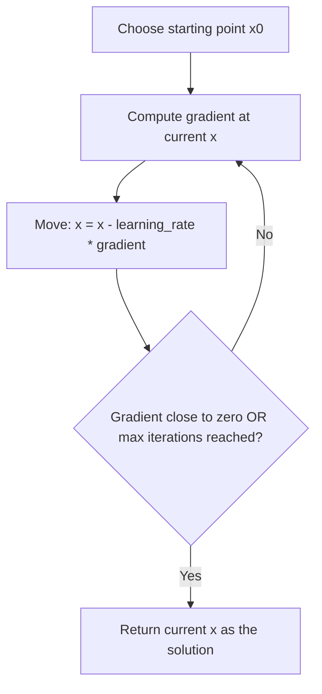
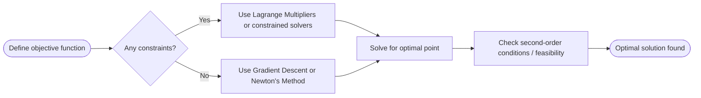

# Optimization

> Part of [Phase 01 — Mathematics](./README.md)

---

## What is it?

Optimization is the mathematics of finding the **best possible answer** among many options — <b>the smallest cost, the shortest route, the highest accuracy, the least wasted material</b> — subject to whatever real-world limits (**constraints**) apply.

## Why do we need it?

Nearly every interesting computing problem is secretly an optimization problem: training a machine learning model is "find the parameters that minimize error." Routing a delivery truck is "find the path that minimizes distance/time." Allocating cloud servers is "find the assignment that minimizes cost while meeting demand." Optimization gives us the formal language and tools to solve all of these.

## Real-world analogy

Imagine you're hiking down from a mountain in thick fog, trying to reach the lowest point in the valley, but you can only feel the slope right under your feet. A sensible strategy: always step in the direction that goes downhill the fastest. Keep doing that until the ground feels flat. That is _exactly_ what gradient descent — the most common optimization algorithm in machine learning — does.

```text
Fog-covered mountain, you can only feel local slope:

        You are here
             |
             v
        *
       * *
      *   *
     *     *___
    *           \___
   *________________\____________  <- valley floor (the minimum)
```

## Historical background

- Optimization ideas trace back to the **calculus of variations** (Euler, Lagrange, 18th century), which asked "what shape/path minimizes some quantity?" (e.g., the shape of a hanging chain, or the fastest descent curve).
- **Joseph-Louis Lagrange** (1788) introduced **Lagrange multipliers**, a technique for optimization under constraints.
- **George Dantzig** (1947) invented the **Simplex Method** for Linear Programming — one of the most impactful algorithms of the 20th century, used to plan military logistics and later, nearly all supply chains.
- **Herbert Robbins & Sutton Monro** (1951) introduced **stochastic approximation**, the mathematical ancestor of stochastic gradient descent, now the workhorse of deep learning.

## Mathematical foundation

**Level 1 — Explain it to a 15-year-old:**

Imagine you're trying to find the lowest point in a valley while blindfolded. You feel the ground under your feet — if it slopes down to the left, you step left. You keep doing this, taking smaller steps as the ground gets flatter, until you can't find anywhere lower nearby. That's optimization.

**Level 2 — Engineering Level:**

Optimization means finding `x*` that minimizes (or maximizes) an **objective function** `f(x)`, possibly subject to **constraints** `g(x) ≤ 0` and `h(x) = 0`. When `f` is **convex** (bowl-shaped, with a single minimum), gradient-based methods are guaranteed to find the true global minimum.

**Level 3 — Industry Level:**

Training a neural network is optimization: minimize a **loss function** (how wrong the model is) over millions or billions of parameters, using **Stochastic Gradient Descent (SGD)** or refinements like **Adam**. Real production systems use mini-batches of data (not the whole dataset at once) to make each optimization step computationally feasible.

**Level 4 — Research Level:**

Research explores the geometry of **non-convex loss landscapes** (most deep learning problems are NOT convex, yet gradient descent still works surprisingly well — an active area of theoretical study), second-order optimization methods that use curvature information for faster convergence, and optimization under adversarial or distributed settings (federated learning).

## Formal definition

**General optimization problem:**

```
minimize   f(x)
subject to g_i(x) ≤ 0,  i = 1...m
           h_j(x) = 0,  j = 1...p
```

**Convexity:** a function `f` is convex if, for any two points `x1, x2` and any `t ∈ [0,1]`:

```
f(t·x1 + (1-t)·x2) ≤ t·f(x1) + (1-t)·f(x2)
```

(informally: a line segment between any two points on the curve never dips below the curve — it's "bowl-shaped.")

## Core concepts

- **Objective function** — the thing you're trying to minimize or maximize
- **Constraint** — a rule that limits which solutions are allowed
- **Feasible region** — the set of all points satisfying all constraints
- **Local minimum vs. Global minimum** — a "best nearby" answer vs. the "best overall" answer
- **Convex optimization** — problems with a bowl-shape, guaranteeing a unique global minimum
- **Gradient Descent** — an iterative algorithm that follows the negative gradient downhill
- **Lagrange Multipliers** — a technique for solving constrained optimization problems
- **Linear Programming** — optimization where the objective and constraints are all linear

## Internal working

**Stochastic Gradient Descent (SGD)**, used to train nearly every modern neural network, works by: taking a small random batch of training examples, computing the gradient of the loss with respect to model parameters using just that batch (much faster than using the whole dataset), and nudging parameters slightly in the opposite direction. Repeating this millions of times, using different random batches, gradually converges toward a good (though not necessarily globally optimal) solution.

## Step-by-step explanation

**How Gradient Descent solves an optimization problem, step by step:**

1. Choose a starting point (often random).
2. Compute the gradient (direction of steepest increase) of the objective function at that point.
3. Move a small step in the _opposite_ direction of the gradient (the "learning rate" controls step size).
4. Recompute the gradient at the new point.
5. Repeat until the gradient is close to zero (a "flat" point — a candidate minimum) or a maximum number of iterations is reached.

## Visual diagram



## Architecture diagram

```text
Convex vs Non-Convex Optimization Landscapes:

CONVEX (bowl-shaped) - gradient descent ALWAYS finds the global minimum:

  \                       /
   \                     /
    \                   /
     \_________________/
              ^
       (single global minimum)


NON-CONVEX (bumpy) - gradient descent can get stuck in a LOCAL minimum:

  \    __        __         /
   \  /  \      /  \       /
    \/    \    /    \     /
           \  /      \___/
            \/           ^
      (local min)   (global min, might be missed!)
```

## Flowchart



## Example

Minimize `f(x) = x² - 4x + 7` using calculus (setting derivative to zero):

```
f'(x) = 2x - 4
Set f'(x) = 0:
2x - 4 = 0
x = 2

f(2) = 4 - 8 + 7 = 3

So the minimum value is 3, occurring at x = 2.
```

## Dry run

Trace gradient descent minimizing `f(x) = x² - 4x + 7`, starting at `x = 0`, learning rate `= 0.2`:

| Step | x     | f'(x) = 2x - 4 | New x = x - 0.2·f'(x)                |
| ---- | ----- | -------------- | ------------------------------------ |
| 0    | 0     | -4             | 0 - 0.2(-4) = 0.8                    |
| 1    | 0.8   | -2.4           | 0.8 - 0.2(-2.4) = 1.28               |
| 2    | 1.28  | -1.44          | 1.28 + 0.288 = 1.568                 |
| 3    | 1.568 | -0.864         | 1.568 + 0.173 = 1.741                |
| ...  | ...   | ...            | approaching x = 2 (the true minimum) |

## Multiple examples

**Example 1 — Linear Programming:** A factory wants to maximize profit `3x + 5y`, subject to `x + 2y ≤ 100` and `x, y ≥ 0`. This is solved using the Simplex Method or corner-point analysis.

**Example 2 — Constrained optimization with Lagrange Multipliers:** Minimize `f(x,y) = x² + y²` subject to `x + y = 10`. Set up `L = x² + y² - λ(x + y - 10)`, take partial derivatives, and solve — giving `x = y = 5`.

**Example 3 — Shortest path (a discrete optimization problem):** Dijkstra's Algorithm (covered in the Algorithms phase) is optimization over graphs — minimizing total path cost.

## Advantages

- Provides a universal framework: nearly any "find the best X" problem can be phrased as optimization.
- Gradient-based methods scale to problems with millions or billions of variables (as in deep learning).
- Convex optimization comes with strong theoretical guarantees — you know you've found the true best answer.

## Disadvantages

- Most real-world problems (including deep learning) are non-convex, so gradient descent can get stuck in local minima or saddle points.
- Choosing hyperparameters (like learning rate) is often more art than science, and a poor choice can prevent convergence entirely.
- Some optimization problems (e.g., many combinatorial ones) are NP-hard — no known efficient algorithm guarantees the exact best answer at scale.

## Complexity

| Method                                         | Typical Complexity                              |
| ---------------------------------------------- | ----------------------------------------------- |
| Gradient Descent (per iteration), n parameters | O(n)                                            |
| Newton's Method (per iteration), n parameters  | O(n²) to O(n³) (needs the Hessian matrix)       |
| Simplex Method (Linear Programming)            | Polynomial in practice, exponential worst-case  |
| Exhaustive search over discrete choices        | O(2ⁿ) or worse — usually infeasible for large n |

## Memory usage

Gradient Descent only needs to store the current parameters and gradient — O(n) memory. Newton's Method needs the full Hessian matrix — O(n²) memory — which becomes impossible for models with billions of parameters, explaining why simpler first-order methods (SGD, Adam) dominate large-scale deep learning.

## Time complexity

The choice between first-order methods (gradient descent — cheap per step, needs many steps) and second-order methods (Newton's Method — expensive per step, needs fewer steps) is a fundamental engineering trade-off in optimization, directly shaping which algorithms are practical at different problem scales.

## Best practices

- Always check whether your problem is convex — if so, you're guaranteed to find the true optimum; if not, be prepared for local minima.
- Use adaptive learning rate methods (Adam, RMSProp) in practice rather than a fixed learning rate for complex problems.
- Normalize/scale your input features — poorly scaled inputs distort the shape of the optimization landscape and slow convergence dramatically.
- Monitor convergence with a validation metric, not just the training objective, to avoid overfitting.

## Common mistakes

- Assuming gradient descent always finds the global minimum (only guaranteed for convex problems).
- Setting a learning rate too high (causes divergence/oscillation) or too low (painfully slow convergence).
- Forgetting to check constraint feasibility — an "optimal" answer that violates real-world constraints is useless.
- Confusing a local minimum with the actual best possible solution.

## Interview questions

1. What is the difference between a local minimum and a global minimum?
2. Explain gradient descent and why the learning rate matters.
3. What makes an optimization problem convex, and why does that matter?
4. How does Linear Programming differ from general nonlinear optimization?
5. Why do we use Stochastic Gradient Descent instead of full-batch gradient descent in deep learning?

## University questions

1. Use Lagrange Multipliers to minimize `f(x,y) = x² + y²` subject to `x + y = 4`.
2. Formulate and solve a simple Linear Programming problem using the graphical method.
3. Prove that the sum of two convex functions is convex.
4. Explain the difference between constrained and unconstrained optimization with examples.

## Coding examples

### Pseudocode

```text
FUNCTION gradientDescent(gradientFunction, startX, learningRate, iterations):
    x = startX
    FOR i FROM 1 TO iterations:
        grad = gradientFunction(x)
        x = x - learningRate * grad
    RETURN x
```

### Python implementation

```python
def gradient_of_f(x):
    # f(x) = x^2 - 4x + 7  ->  f'(x) = 2x - 4
    return 2 * x - 4

def gradient_descent(start_x, learning_rate=0.2, iterations=50):
    x = start_x
    for _ in range(iterations):
        grad = gradient_of_f(x)
        x = x - learning_rate * grad
    return x

optimal_x = gradient_descent(start_x=0)
print(f"Optimal x found near: {optimal_x:.4f}")  # close to 2
```

### C implementation

```c
#include <stdio.h>

double gradient(double x) {
    return 2 * x - 4;
}

double gradientDescent(double startX, double learningRate, int iterations) {
    double x = startX;
    for (int i = 0; i < iterations; i++) {
        double grad = gradient(x);
        x = x - learningRate * grad;
    }
    return x;
}

int main() {
    double result = gradientDescent(0.0, 0.2, 50);
    printf("Optimal x found near: %.4f\n", result);
    return 0;
}
```

### C++ implementation

```cpp
#include <iostream>
using namespace std;

double gradient(double x) {
    return 2 * x - 4;
}

double gradientDescent(double startX, double learningRate, int iterations) {
    double x = startX;
    for (int i = 0; i < iterations; i++) {
        double grad = gradient(x);
        x -= learningRate * grad;
    }
    return x;
}

int main() {
    double result = gradientDescent(0.0, 0.2, 50);
    cout << "Optimal x found near: " << result << endl;
}
```

### Java implementation

```java
public class GradientDescentOptimizer {
    static double gradient(double x) {
        return 2 * x - 4;
    }

    static double gradientDescent(double startX, double learningRate, int iterations) {
        double x = startX;
        for (int i = 0; i < iterations; i++) {
            double grad = gradient(x);
            x -= learningRate * grad;
        }
        return x;
    }

    public static void main(String[] args) {
        double result = gradientDescent(0.0, 0.2, 50);
        System.out.printf("Optimal x found near: %.4f%n", result);
    }
}
```

## Visualization

```text
Gradient descent path converging to x = 2 on f(x) = x^2 - 4x + 7:

x: 0 --> 0.8 --> 1.28 --> 1.568 --> 1.741 --> ... --> ~2.0

Each step gets smaller as the slope (gradient) flattens
near the true minimum.
```

## Industry use

- **Training all machine learning / deep learning models** — the loss function is minimized via gradient-based optimization.
- **Logistics and supply chain** — Linear Programming optimizes shipping routes, warehouse stock, and production schedules (UPS's ORION system, airline crew scheduling).
- **Finance** — portfolio optimization (Markowitz Mean-Variance Optimization) balances risk and return.
- **Chip design & compilers** — optimization algorithms minimize power usage, chip area, or code execution time.
- **Cloud computing** — optimization decides how to allocate servers/resources to minimize cost while meeting demand.

## Research relevance

Research actively studies why non-convex optimization (as in deep learning) works so well in practice despite lacking convexity guarantees, develops faster and more memory-efficient optimizers (Adam, AdamW, Lion), and explores optimization under distributed and privacy-preserving settings (federated learning), as well as combinatorial optimization using quantum computing.

## Related concepts

- Calculus (the primary tool: derivatives and gradients)
- Linear Algebra (gradients are vectors; Hessians are matrices)
- Algorithms (many classic algorithms, like Dijkstra's shortest path, are optimization in disguise)
- Machine Learning (training = optimization of a loss function)

## Practice problems

1. Minimize `f(x) = 3x² - 12x + 5` using calculus.
2. Use gradient descent (by hand, a few iterations) to approximate the minimum of `f(x) = (x-3)²`.
3. Set up (but don't necessarily solve) a Linear Programming problem for a simple resource-allocation scenario.
4. Implement gradient descent in code for a 2-variable function, e.g., `f(x,y) = x² + y²`.

## Advanced concepts

- **Convex Optimization theory** — a rich mathematical field guaranteeing efficient, provably-optimal solutions for a huge class of practical problems.
- **Stochastic Gradient Descent variants** (Momentum, Adam, RMSProp) — practical refinements that dramatically speed up and stabilize training of large models.
- **Constrained optimization via KKT (Karush-Kuhn-Tucker) conditions** — a generalization of Lagrange Multipliers for inequality constraints.
- **Combinatorial optimization** (e.g., the Traveling Salesman Problem) — optimization over discrete structures, often NP-hard.

## Summary

Optimization is the mathematics of "finding the best," and it is the direct engine behind machine learning training, logistics planning, financial modeling, and countless other real-world computing problems. Calculus tells us _which way is downhill_; optimization tells us _how to systematically walk there_ — even across millions of dimensions.

## Key takeaways

- Optimization = minimizing or maximizing an objective function, possibly under constraints.
- Convex problems guarantee finding the true global optimum; non-convex problems (like deep learning) do not.
- Gradient Descent is the workhorse algorithm behind training modern AI models.
- Real-world optimization always involves trade-offs: speed vs. accuracy, memory vs. computation, exact vs. approximate answers.

## References

- Boyd, S., Vandenberghe, L. _Convex Optimization_ (free PDF from Stanford).
- Nocedal, J., Wright, S. _Numerical Optimization_.
- Robbins, H., Monro, S. (1951). _A Stochastic Approximation Method_.
- Kingma, D., Ba, J. (2014). _Adam: A Method for Stochastic Optimization_.

---

⬅ Back to [Phase 01 — Mathematics README](./README.md)
