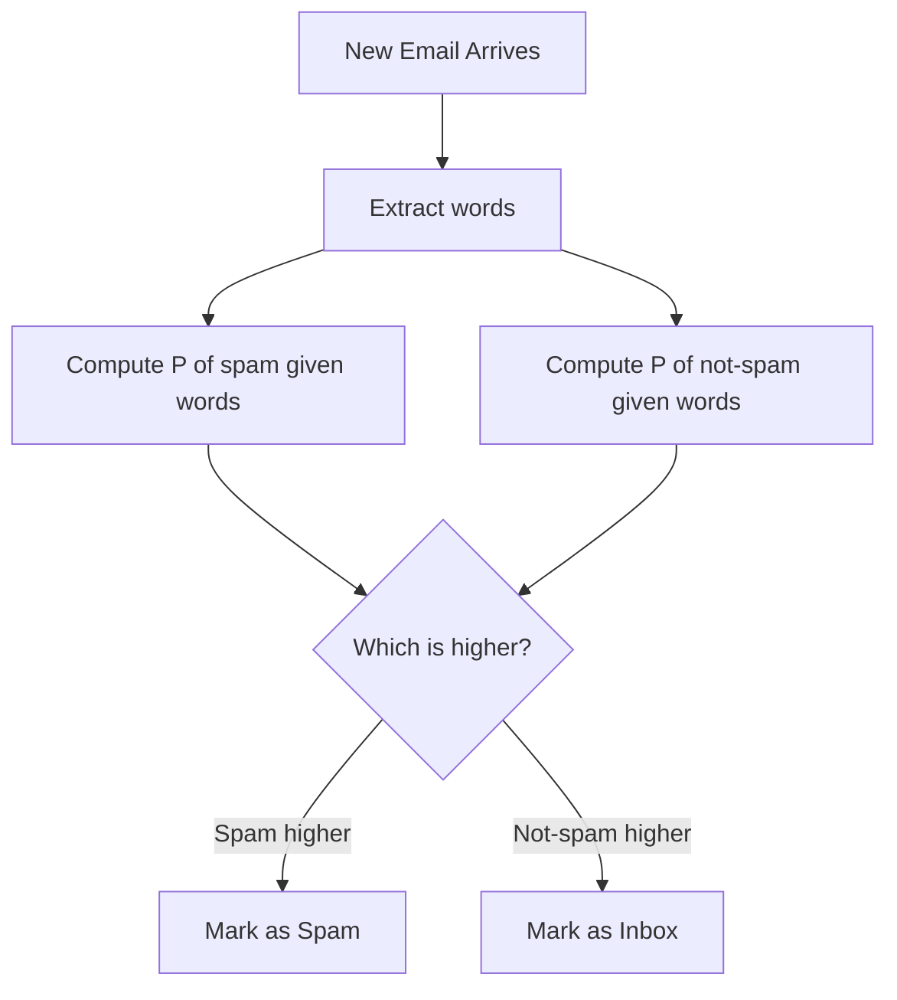
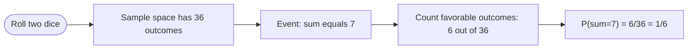

# Probability

> [Phase 01 — Mathematics](./README.md)

---

## What is it?

Probability is the mathematics of **uncertainty**. It gives us a precise, numerical way to talk about how likely something is to happen, using a number between `0` (impossible) and `1` (certain).

## Why do we need it?

Computers constantly deal with uncertain, noisy, or incomplete information: Is this email spam? Will this user click this ad? Is this network packet an attack? Probability gives us the mathematical language to reason correctly about these questions instead of guessing.

## Real-world analogy

Think of probability like a **weather forecast**. "70% chance of rain" doesn't mean it will definitely rain, and it doesn't mean it definitely won't — it's a precise statement about likelihood, based on patterns in past data (this is exactly how spam filters and recommendation systems think).

## Historical background

- Probability theory began in the 1650s, when gamblers asked mathematicians **Blaise Pascal** and **Pierre de Fermat** to solve disputes about fairly splitting stakes in interrupted games of chance.
- **Jacob Bernoulli** (1713) formalized the Law of Large Numbers.
- **Thomas Bayes** (1763, published posthumously) introduced what we now call **Bayes' Theorem** — one of the most important ideas in modern AI.
- **Andrey Kolmogorov** (1933) gave probability its modern, rigorous axiomatic foundation.

## Mathematical foundation

**Level 1 — Explain it to a 15-year-old:**

If you flip a fair coin, there are 2 equally likely outcomes: heads or tails. The probability of heads is "1 out of 2," written as `1/2` or `0.5`. Probability is just counting: how many ways can the thing I care about happen, divided by how many things could happen in total.

**Level 2 — Engineering Level:**

A **sample space** `Ω` is the set of all possible outcomes. An **event** `A` is a subset of `Ω`. The probability function `P` assigns a number in `[0,1]` to each event, following Kolmogorov's axioms: `P(Ω) = 1`, `P(A) ≥ 0`, and for mutually exclusive events, probabilities add.

**Level 3 — Industry Level:**

Spam filters compute `P(spam | words in email)` using Bayes' Theorem (this is the classic **Naive Bayes classifier**). Recommendation engines model `P(user clicks | user history)`. A/B testing frameworks use probability distributions to decide if a change is a real improvement or just random noise.

**Level 4 — Research Level:**

Modern generative AI models (like diffusion models and large language models) are fundamentally probability distributions over possible outputs — a language model literally computes `P(next word | previous words)`. Research explores Bayesian deep learning (modeling uncertainty in a network's own predictions) and probabilistic graphical models.

## Formal definition

Kolmogorov's Axioms of Probability, for sample space `Ω` and event `A ⊆ Ω`:

1. `P(A) ≥ 0` for every event `A`
2. `P(Ω) = 1`
3. If `A` and `B` are mutually exclusive, `P(A ∪ B) = P(A) + P(B)`

**Bayes' Theorem:**

```
P(A | B) = [P(B | A) · P(A)] / P(B)
```

## Core concepts

- **Sample space** — the set of all possible outcomes
- **Event** — a specific outcome or set of outcomes we care about
- **Random variable** — a variable whose value depends on the outcome of a random process
- **Probability distribution** — a description of how probability is spread across possible outcomes
- **Independence** — two events where one doesn't affect the other's probability
- **Conditional probability** — the probability of an event, given that another event already happened
- **Bayes' Theorem** — a formula for updating beliefs given new evidence
- **Expectation** — the long-run average value of a random variable

## Internal working

A spam classifier "internally" works by comparing two probabilities: `P(spam | this email's words)` versus `P(not spam | this email's words)`. Using Bayes' Theorem, it converts this into something it CAN measure from training data: how often certain words appear in spam vs. non-spam emails.

## Step-by-step explanation

**How Naive Bayes spam detection works:**

1. Collect a labeled dataset of emails (spam / not spam).
2. Count how often each word appears in spam emails vs. non-spam emails.
3. For a new email, compute `P(spam | words)` using Bayes' Theorem, assuming words are independent ("naive" assumption).
4. Do the same for `P(not spam | words)`.
5. Whichever probability is higher, classify the email as that category.

## Visual diagram



## Architecture diagram

```text
Bayes' Theorem visualized as an "update machine":

  Prior Belief P(A)                Evidence P(B|A)
        |                                |
        v                                v
   +---------------------------------------------+
   |           Bayes' Theorem Machine             |
   +---------------------------------------------+
                        |
                        v
              Updated Belief P(A|B)
              ("posterior probability")
```

## Flowchart



## Example

**Medical test example (classic Bayes' Theorem application):**

A disease affects 1% of people. A test is 99% accurate (both for detecting it when present, and correctly clearing it when absent). If you test positive, what's the actual probability you have the disease?

```
P(Disease) = 0.01
P(No Disease) = 0.99
P(Positive | Disease) = 0.99
P(Positive | No Disease) = 0.01   (false positive rate)

P(Positive) = P(Positive|Disease)*P(Disease) + P(Positive|No Disease)*P(No Disease)
            = (0.99 * 0.01) + (0.01 * 0.99)
            = 0.0099 + 0.0099 = 0.0198

P(Disease | Positive) = [P(Positive|Disease) * P(Disease)] / P(Positive)
                       = 0.0099 / 0.0198
                       = 0.5  (only 50%!)
```

This surprising result (only 50%, not 99%) is why Bayes' Theorem is famous — it corrects a very common human intuition mistake.

## Dry run

Trace the Naive Bayes calculation for a tiny spam filter with vocabulary `{"free", "meeting"}`:

| Word    | P(word\|spam) | P(word\|not spam) |
| ------- | ------------- | ----------------- |
| free    | 0.8           | 0.1               |
| meeting | 0.1           | 0.7               |

Email = "free free": `P(email|spam) = 0.8 * 0.8 = 0.64`, `P(email|not spam) = 0.1 * 0.1 = 0.01`. Spam wins overwhelmingly.

## Multiple examples

**Example 1 — Independent events:**
`P(coin=heads AND die=6) = P(heads) * P(die=6) = 0.5 * (1/6) = 1/12`

**Example 2 — Complementary events:**
`P(not raining) = 1 - P(raining)`

**Example 3 — Conditional probability:**
In a deck of 52 cards, `P(King | card is a face card) = 4/12 = 1/3`

## Advantages

- Provides a rigorous, principled way to handle uncertainty (instead of guessing).
- Bayes' Theorem allows beliefs to be updated systematically as new evidence arrives.
- Forms the theoretical foundation for statistics and machine learning.

## Disadvantages

- Requires knowing (or estimating) probabilities accurately — garbage estimates produce garbage conclusions.
- Human intuition about probability is frequently wrong (e.g., the medical test example above), leading to real-world misinterpretation.
- "Naive" independence assumptions (as in Naive Bayes) are often technically false, though useful in practice.

## Complexity

| Task                                                                | Complexity                                                                      |
| ------------------------------------------------------------------- | ------------------------------------------------------------------------------- |
| Computing probability of a single event from sample space of size n | O(n)                                                                            |
| Naive Bayes classification with v vocabulary words                  | O(v) per prediction                                                             |
| Estimating a full joint probability distribution over n variables   | O(2ⁿ) in the worst case (this is why we simplify with independence assumptions) |

## Memory usage

Storing a full joint probability distribution over `n` binary variables requires `2ⁿ` numbers — this grows so explosively that real systems always use simplifying assumptions (like independence) or compact representations (like Bayesian networks).

## Time complexity

See Complexity table above — a key engineering lesson: **naive full-joint-distribution approaches are computationally impossible for large problems**, which is exactly why Naive Bayes (an approximation) is so widely used in practice.

## Best practices

- Always be explicit about your assumptions (e.g., independence) — they materially change the answer.
- Use log-probabilities in code instead of raw probabilities to avoid numerical underflow when multiplying many small numbers.
- Validate probabilistic models against real outcomes, not just theoretical elegance.

## Common mistakes

- The "gambler's fallacy": believing that past independent random events affect future ones (e.g., "the coin is due for tails").
- Confusing `P(A|B)` with `P(B|A)` — these are generally NOT equal (this is exactly the medical test trap above).
- Forgetting to check whether events are actually independent before multiplying their probabilities.

## Interview questions

1. Explain Bayes' Theorem with a real-world example.
2. What is the difference between independent and mutually exclusive events?
3. How does a Naive Bayes spam filter work?
4. What is the Monty Hall problem, and why is the answer counterintuitive?
5. What's the difference between probability and statistics?

## University questions

1. State and prove Bayes' Theorem.
2. A box contains 5 red and 3 blue balls. Find the probability of drawing 2 red balls without replacement.
3. Define and differentiate discrete and continuous random variables.
4. Compute the expected value of a fair six-sided die roll.

## Coding examples

### Pseudocode

```text
FUNCTION naiveBayesClassify(email_words, spam_word_probs, ham_word_probs, p_spam, p_ham):
    spam_score = p_spam
    ham_score = p_ham
    FOR word IN email_words:
        spam_score *= spam_word_probs[word]
        ham_score  *= ham_word_probs[word]
    IF spam_score > ham_score:
        RETURN "SPAM"
    ELSE:
        RETURN "NOT SPAM"
```

### Python implementation

```python
def naive_bayes_classify(words, spam_probs, ham_probs, p_spam=0.5, p_ham=0.5):
    spam_score = p_spam
    ham_score = p_ham
    for word in words:
        spam_score *= spam_probs.get(word, 0.5)
        ham_score *= ham_probs.get(word, 0.5)
    return "SPAM" if spam_score > ham_score else "NOT SPAM"

spam_probs = {"free": 0.8, "meeting": 0.1}
ham_probs = {"free": 0.1, "meeting": 0.7}

print(naive_bayes_classify(["free", "free"], spam_probs, ham_probs))  # SPAM
print(naive_bayes_classify(["meeting"], spam_probs, ham_probs))       # NOT SPAM
```

### C implementation

```c
#include <stdio.h>
#include <string.h>

double getProb(const char* word, const char* keys[], double probs[], int n, double defaultVal) {
    for (int i = 0; i < n; i++) {
        if (strcmp(word, keys[i]) == 0) return probs[i];
    }
    return defaultVal;
}

int main() {
    const char* words[] = {"free", "free"};
    const char* keys[] = {"free", "meeting"};
    double spamProbs[] = {0.8, 0.1};
    double hamProbs[] = {0.1, 0.7};

    double spamScore = 0.5, hamScore = 0.5;
    for (int i = 0; i < 2; i++) {
        spamScore *= getProb(words[i], keys, spamProbs, 2, 0.5);
        hamScore  *= getProb(words[i], keys, hamProbs, 2, 0.5);
    }

    printf(spamScore > hamScore ? "SPAM\n" : "NOT SPAM\n");
    return 0;
}
```

### C++ implementation

```cpp
#include <iostream>
#include <unordered_map>
#include <vector>
#include <string>
using namespace std;

string naiveBayesClassify(vector<string>& words, unordered_map<string,double>& spamProbs,
                           unordered_map<string,double>& hamProbs) {
    double spamScore = 0.5, hamScore = 0.5;
    for (auto& word : words) {
        spamScore *= spamProbs.count(word) ? spamProbs[word] : 0.5;
        hamScore  *= hamProbs.count(word)  ? hamProbs[word]  : 0.5;
    }
    return spamScore > hamScore ? "SPAM" : "NOT SPAM";
}

int main() {
    unordered_map<string,double> spamProbs = {{"free", 0.8}, {"meeting", 0.1}};
    unordered_map<string,double> hamProbs  = {{"free", 0.1}, {"meeting", 0.7}};
    vector<string> words = {"free", "free"};

    cout << naiveBayesClassify(words, spamProbs, hamProbs) << endl;
}
```

### Java implementation

```java
import java.util.*;

public class NaiveBayes {
    static String classify(List<String> words, Map<String, Double> spamProbs, Map<String, Double> hamProbs) {
        double spamScore = 0.5, hamScore = 0.5;
        for (String word : words) {
            spamScore *= spamProbs.getOrDefault(word, 0.5);
            hamScore *= hamProbs.getOrDefault(word, 0.5);
        }
        return spamScore > hamScore ? "SPAM" : "NOT SPAM";
    }

    public static void main(String[] args) {
        Map<String, Double> spamProbs = Map.of("free", 0.8, "meeting", 0.1);
        Map<String, Double> hamProbs = Map.of("free", 0.1, "meeting", 0.7);
        List<String> words = Arrays.asList("free", "free");

        System.out.println(classify(words, spamProbs, hamProbs));
    }
}
```

## Visualization

```text
Probability distribution of a fair 6-sided die:

Outcome:  1    2    3    4    5    6
P:       1/6  1/6  1/6  1/6  1/6  1/6

Bar chart:
1 |####
2 |####
3 |####
4 |####
5 |####
6 |####
   (all equal - "uniform distribution")
```

## Industry use

- **Spam filters** (Gmail, Outlook) — Naive Bayes and related probabilistic models.
- **Recommendation systems** — probability of a user liking an item given past behavior.
- **A/B Testing** — probability that an observed difference is statistically real, not random chance.
- **Autonomous vehicles** — probabilistic sensor fusion (Kalman filters) to estimate true position despite noisy sensors.
- **Large Language Models** — literally predict `P(next token | context)`.

## Research relevance

Bayesian methods are central to modern AI research: Bayesian neural networks model _uncertainty_ in predictions (important for safety-critical systems like medical diagnosis and self-driving cars), and probabilistic graphical models (Bayesian networks, Markov Random Fields) formalize complex dependency structures.

## Related concepts

- Statistics (uses probability theory to draw conclusions from data)
- Information Theory (entropy is defined via probability)
- Machine Learning (many models are literally probability distributions)

## Advanced concepts

- **Markov Chains** — systems where the future state depends only on the current state, not the full history.
- **Bayesian Networks** — graphs representing conditional dependencies among many random variables.
- **Monte Carlo methods** — using random sampling to estimate answers to problems too complex to solve exactly.

## Summary

Probability gives computer science a rigorous language for uncertainty. From spam filters to self-driving cars to modern generative AI, "reasoning under uncertainty" is probability theory in action — and Bayes' Theorem is its single most important tool.

## Key takeaways

- Probability is always between 0 and 1.
- Independent events multiply; mutually exclusive events add.
- Bayes' Theorem lets us update beliefs given new evidence — and often gives counterintuitive, correct answers.
- Real-world systems (spam filters, recommenders, LLMs) are built directly on probability theory.

## References

- Blitzstein, J., Hwang, J. _Introduction to Probability_.
- Ross, S. _A First Course in Probability_.
- Bayes, T. (1763). _An Essay towards solving a Problem in the Doctrine of Chances_.
- Kolmogorov, A. (1933). _Foundations of the Theory of Probability_.

---

⬅ Back to [Phase 01 — Mathematics README](./README.md)
