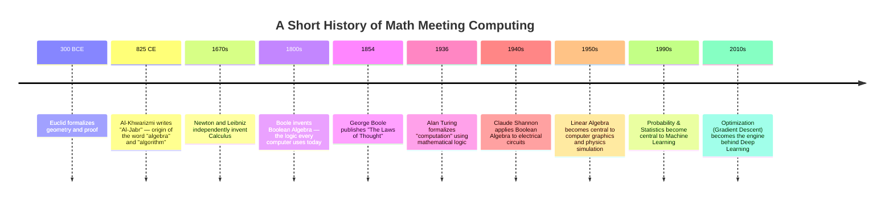
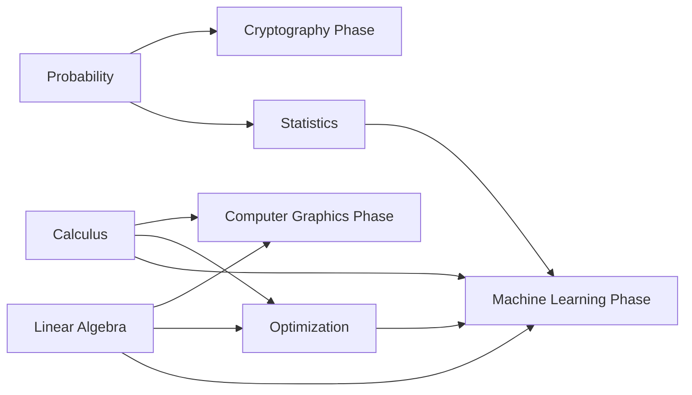

# Mathematics for Computer Science

> "Computer Science is not about computers, and it is not really about science either. It is about mathematics wearing a machine's clothes." — a professor's honest confession, on day one.

---

## Table of Contents

- [Introduction](#introduction)
- [Why This Subject Exists](#why-this-subject-exists)
- [Historical Background](#historical-background)
- [Importance](#importance)
- [Applications](#applications)
- [Industries Using It](#industries-using-it)
- [Career Relevance](#career-relevance)
- [Prerequisites](#prerequisites)
- [Roadmap](#roadmap)
- [Complete Syllabus](#complete-syllabus)
- [Learning Objectives](#learning-objectives)
- [How This Connects to Previous Phases](#how-this-connects-to-previous-phases)
- [How This Connects to Later Phases](#how-this-connects-to-later-phases)
- [Recommended Study Order](#recommended-study-order)
- [Estimated Study Time](#estimated-study-time)
- [Books](#books)
- [Research Papers](#research-papers)
- [Reference Websites](#reference-websites)
- [Practice Resources](#practice-resources)
- [Projects](#projects)
- [Interview Importance](#interview-importance)
- [University Exam Importance](#university-exam-importance)
- [Common Mistakes](#common-mistakes)
- [Cheat Sheet](#cheat-sheet)
- [Summary](#summary)
- [Next Steps](#next-steps)

---

## Introduction

Imagine you want to build a house. Before you touch a single brick, you need to understand **gravity**, **weight**, **balance**, and **geometry**. You don't need to be a physicist, but if you ignore these ideas completely, your house falls down.

Mathematics is the "gravity and geometry" of computer science. You don't need to be a professional mathematician to be a great programmer, but if you ignore mathematics completely, your understanding of _why_ things work eventually collapses. You will be able to copy code, but not create it. You will be able to use an algorithm, but not know when it will fail, or how to make a better one.

This phase covers five pillars:

| File                | Subject        | One-line description                             |
| ------------------- | -------------- | ------------------------------------------------ |
| `Calculus.md`       | Calculus       | The mathematics of change and accumulation.      |
| `Linear-Algebra.md` | Linear Algebra | The mathematics of vectors, matrices, and space. |
| `Probability.md`    | Probability    | The mathematics of uncertainty and randomness.   |
| `Statistics.md`     | Statistics     | The mathematics of learning from data.           |
| `Optimization.md`   | Optimization   | The mathematics of finding the "best" answer.    |

---

## Why This Subject Exists

Mathematics was not invented for computers — computers were invented because of mathematics.

Long before electronic computers existed, mathematicians needed a precise, unambiguous language to describe patterns, quantities, change, and logic. That language turned out to be exactly what was needed to describe **algorithms** — step-by-step procedures for solving problems. When engineers built the first computers, they were literally building machines that execute mathematics.

So the honest answer to "why do we need math for CS" is: **computer science is applied mathematics, executed at high speed, by a machine that never gets tired or bored.**

---

## Historical Background

Notice the pattern: nearly every major leap in computing was preceded by a mathematical idea that had already existed, sometimes for centuries, waiting for a machine fast enough to use it.

---

## Importance

Mathematics gives a computer scientist three superpowers:

1. **Prediction** — You can predict how a program will behave _before_ you run it (this is what complexity analysis, in the Algorithms phase, is built on).
2. **Precision** — You can describe a problem so exactly that there is no ambiguity about what "correct" means.
3. **Transferability** — A mathematical idea learned once (e.g., a matrix) reappears in graphics, machine learning, cryptography, and networking. Learn it once, use it everywhere.

---

## Applications

| Math Area      | Real Application                                                                                |
| -------------- | ----------------------------------------------------------------------------------------------- |
| Calculus       | Training neural networks (gradient descent), physics engines in games, signal processing        |
| Linear Algebra | Computer graphics (3D rotation), image compression, search engines (PageRank), machine learning |
| Probability    | Spam filters, recommendation systems, randomized algorithms, cryptography                       |
| Statistics     | A/B testing, data science, quality assurance, scientific research                               |
| Optimization   | Google Maps route finding, resource scheduling, training AI models, logistics                   |

---

## Industries Using It

- **Big Tech** (Google, Meta, Microsoft, Amazon) — search ranking, recommendation, ad auctions
- **Finance** — algorithmic trading, risk modeling, fraud detection
- **Gaming** — physics engines, 3D rendering, AI opponents
- **Healthcare** — medical imaging, drug discovery, diagnosis models
- **Robotics & Autonomous Vehicles** — motion planning, sensor fusion
- **Cybersecurity** — cryptography, anomaly detection

---

## Career Relevance

| Role                      | Math You Will Use Daily                             |
| ------------------------- | --------------------------------------------------- |
| Software Engineer         | Discrete math, basic probability, complexity        |
| Data Scientist            | Statistics, probability, linear algebra             |
| Machine Learning Engineer | Calculus, linear algebra, probability, optimization |
| Game Developer            | Linear algebra, calculus (physics)                  |
| Security Engineer         | Number theory, probability                          |
| Research Scientist        | All of the above, deeply                            |

---

## Prerequisites

None. This phase assumes only **school-level arithmetic** (addition, multiplication, fractions). Everything else is built from scratch, first at the "explain it to a 15-year-old" level, then upward.

---

## Roadmap

---

## Complete Syllabus

1. **Calculus** — Limits, Derivatives, Integrals, Partial Derivatives, Gradients, Chain Rule, Taylor Series
2. **Linear Algebra** — Vectors, Matrices, Matrix Operations, Determinants, Eigenvalues/Eigenvectors, Vector Spaces, Linear Transformations
3. **Probability** — Sample Spaces, Random Variables, Distributions, Bayes' Theorem, Expectation, Variance
4. **Statistics** — Descriptive Statistics, Inferential Statistics, Hypothesis Testing, Regression, Correlation
5. **Optimization** — Convexity, Gradient Descent, Constrained Optimization, Lagrange Multipliers, Linear Programming

---

## Learning Objectives

By the end of this phase, you will be able to:

- Explain _why_ a machine learning model "learns" using calculus and optimization.
- Represent and manipulate data using vectors and matrices, by hand and in code.
- Reason correctly about uncertain events using probability.
- Draw honest conclusions from data using statistics, and recognize misleading statistics.
- Understand what "the best possible answer" means mathematically, and how to search for it.

---

## How It Connects to Later Phases

- **Data Structures & Algorithms** uses growth rates, which are best understood after Calculus (limits) and Discrete Math.
- **Machine Learning / AI** is essentially Linear Algebra + Calculus + Probability + Optimization, applied to data.
- **Computer Graphics** uses Linear Algebra (transformations) and Calculus (motion, lighting) extensively.
- **Cryptography** leans on Probability and Number Theory.

---

## Recommended Study Order

1. Linear Algebra (build geometric intuition first)
2. Calculus (build the idea of change and rate)
3. Probability (build the idea of uncertainty)
4. Statistics (apply probability to real data)
5. Optimization (combine everything to find "the best" answer)

---

## Estimated Time

| Topic          | Beginner Pace | Fast Pace      |
| -------------- | ------------- | -------------- |
| Linear Algebra | 3 weeks       | 1 week         |
| Calculus       | 4 weeks       | 1.5 weeks      |
| Probability    | 2 weeks       | 1 week         |
| Statistics     | 2 weeks       | 1 week         |
| Optimization   | 2 weeks       | 1 week         |
| **Total**      | **~13 weeks** | **~5.5 weeks** |

---

## Books

- _Linear Algebra and Its Applications_ — Gilbert Strang
- _Calculus_ — James Stewart
- _Introduction to Probability_ — Blitzstein & Hwang
- _All of Statistics_ — Larry Wasserman
- _Convex Optimization_ — Boyd & Vandenberghe (free PDF from Stanford)
- _Mathematics for Machine Learning_ — Deisenroth, Faisal, Ong (free PDF)

## Research Papers

- Rosenblatt, F. (1958). _The Perceptron: A Probabilistic Model for Information Storage and Organization in the Brain._
- Robbins, H. & Monro, S. (1951). _A Stochastic Approximation Method_ — the mathematical root of gradient descent-based learning.
- Page, L., Brin, S. et al. (1999). _The PageRank Citation Ranking_ — a beautiful real-world use of Linear Algebra.

## Reference Websites

- [MIT OpenCourseWare — 18.06 Linear Algebra](https://ocw.mit.edu)
- [3Blue1Brown — Essence of Linear Algebra / Calculus (YouTube)](https://www.3blue1brown.com)
- [Khan Academy](https://www.khanacademy.org)
- [Stanford CS229 Math Notes](https://cs229.stanford.edu)

## Practice Resources

- Khan Academy practice exercises
- Brilliant.org interactive problems
- GATE previous year papers (Engineering Mathematics section)
- Paul's Online Math Notes (practice problems with solutions)

## Projects

1. Build a simple **linear regression** model from scratch using only Linear Algebra + Calculus (no libraries).
2. Implement **gradient descent** to minimize a function, and visualize the descent path.
3. Build a **spam classifier** using Bayes' Theorem, by hand, on a tiny dataset.
4. Simulate a **dice game** to empirically verify probability theory (Law of Large Numbers).
5. Analyze a real dataset (e.g., CSV of exam scores) using descriptive statistics.

## Interview Importance

⭐⭐⭐☆☆ (Moderate-High)

Pure math questions are rare in coding interviews, but math _thinking_ is everywhere: probability puzzles ("what's the chance two people share a birthday in a room of 30?"), optimization framing ("this is a shortest-path problem"), and ML interviews are almost entirely built on this phase.

## University Exam Importance

⭐⭐⭐⭐⭐ (Very High)

Engineering Mathematics is a core, heavily-weighted subject in nearly every BSc/MSc Computer Science curriculum and is explicitly tested in GATE and UGC NET.

## Common Mistakes

- Memorizing formulas without understanding _why_ they exist.
- Skipping the geometric/visual intuition and going straight to symbols.
- Treating math as "a separate subject" instead of the language the rest of CS is written in.
- Avoiding practice problems because "I understood the video."

## Cheat Sheet

| Concept         | One-Line Meaning                                            |
| --------------- | ----------------------------------------------------------- |
| Derivative      | Instantaneous rate of change                                |
| Integral        | Accumulated total / area under a curve                      |
| Vector          | A quantity with direction and magnitude                     |
| Matrix          | A grid of numbers representing a transformation             |
| Eigenvector     | A direction that a transformation does not rotate away from |
| Probability     | A number between 0 and 1 measuring belief in an event       |
| Expectation     | The long-run average outcome                                |
| Gradient        | The direction of steepest increase of a function            |
| Convex Function | A function shaped like a bowl — has one lowest point        |

## Summary

Mathematics is the invisible skeleton underneath every visible piece of software. This phase builds that skeleton from the ground up — no shortcuts, no unexplained symbols, no assumed prior knowledge.

## Next Steps

Proceed in this order:

1. Open [`Linear-Algebra.md`](./Linear-Algebra.md)
2. Then [`Calculus.md`](./Calculus.md)
3. Then [`Probability.md`](./Probability.md)
4. Then [`Statistics.md`](./Statistics.md)
5. Then [`Optimization.md`](./Optimization.md)
