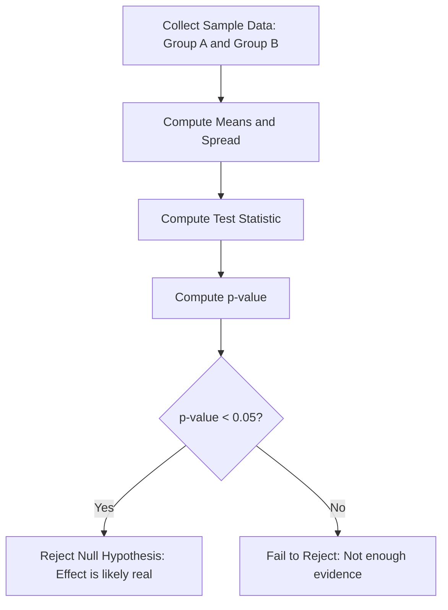
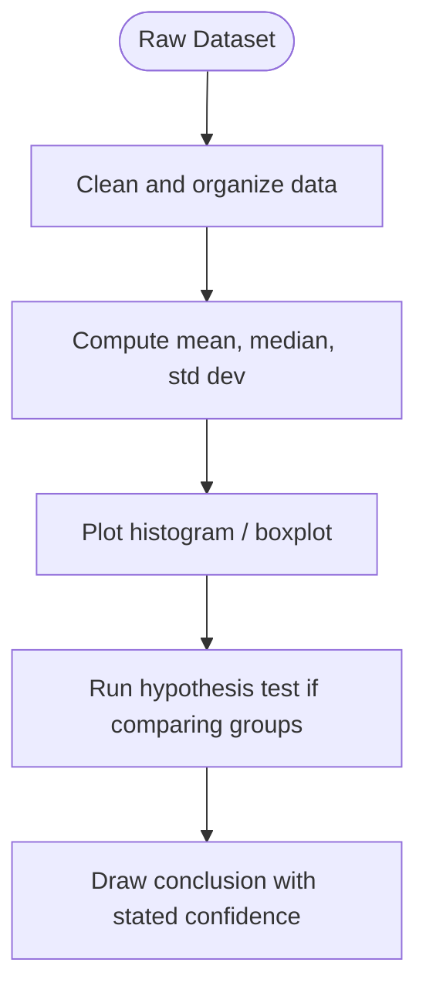

# Statistics

> Part of [Phase 01 — Mathematics](./README.md)

---

## What is it?

Statistics is the science of **collecting, organizing, analyzing, and drawing conclusions from data**. Where Probability starts from known rules and predicts outcomes, Statistics starts from _observed_ outcomes and tries to work backward to understand the rules (or decide if a pattern is real or just noise).

## Why do we need it?

Every dataset a computer scientist touches — user logs, sensor readings, experiment results, model performance metrics — is noisy and incomplete. Statistics gives us the tools to separate **real signal** from **random noise**, and to make honest, defensible decisions from imperfect data.

## Real-world analogy

Imagine tasting one spoonful of soup to judge the whole pot. If you stir well and taste a small spoonful (a **sample**), you can reasonably guess how the whole pot (the **population**) tastes — without drinking it all. Statistics is the mathematics of <b>"how much can I trust this spoonful?"</b>

## Historical background

- The word "statistics" comes from the Latin _status_ (state), because early statistics were literally about counting a nation's population and resources.
- **John Graunt** (1662) pioneered demographic statistics using London's death records.
- **Ronald Fisher** (1920s-30s) formalized modern statistical methods: hypothesis testing, analysis of variance, and experimental design — largely motivated by agricultural experiments.
- **Karl Pearson** developed correlation coefficients and the chi-squared test.
- In the internet era, statistics became the backbone of A/B testing, data science, and quality control at massive scale.

## Mathematical foundation

**Level 1 — Explain it to a 15-year-old:**

If your friend flips a coin 10 times and gets 8 heads, is the coin unfair, or was that just bad luck? Statistics gives you a principled way to answer that question — instead of just guessing.

**Level 2 — Engineering Level:**

We distinguish **descriptive statistics** (summarizing data: mean, median, standard deviation) from **inferential statistics** (drawing conclusions about a population from a sample, using tools like confidence intervals and hypothesis tests).

**Level 3 — Industry Level:**

Companies run **A/B tests**: show version A of a website to half the users and version B to the other half, then use a statistical test (e.g., a t-test) to decide, with a stated confidence level, whether B is genuinely better — or whether the difference could just be random noise.

**Level 4 — Research Level:**

Modern research grapples with the **replication crisis** (many published statistical findings don't hold up when re-tested), and develops more robust methods: Bayesian statistics (which treats parameters themselves as uncertain and updatable), and multiple-hypothesis-testing corrections for large-scale data mining.

## Formal definition

**Mean (average):**

```
μ = (Σxᵢ) / n
```

**Variance** (average squared distance from the mean):

```
σ² = Σ(xᵢ - μ)² / n
```

**Standard deviation:** `σ = √(σ²)` — variance, brought back to the original units.

## Example

### From Raw Test Scores to Mean, Variance, and Standard Deviation

Here is a step-by-step walkthrough showing how **raw test scores** lead directly to a mean of $75$, a variance of $100\text{ points}^2$, and a standard deviation of $10\text{ points}$.

### The Raw Data

Suppose **5 students** take an exam scored out of 100. Their scores are:

$$
\text{Scores: } 60,; 70,; 75,; 80,; 90
$$

### Step 1: Calculate the Mean ($\mu$)

Add all the scores together and divide by the number of students ($N = 5$):

$$
\mu = \frac{60 + 70 + 75 + 80 + 90}{5}
= \frac{375}{5}
= \mathbf{75\text{ points}}
$$

### Step 2: Calculate Deviations and Square Them

Subtract the mean ($75$) from each score to see how far it sits from the average, then square that distance so positive and negative values don't cancel each other out:

| **Student** | **Score ($x_i$)** | **Distance from Mean ($x_i-\mu$)** | **Squared Distance $(x_i-\mu)^2$** |
| ----------- | ----------------: | ---------------------------------: | ---------------------------------: |
| **A**       |              $60$ |                    $60 - 75 = -15$ |           $(-15)^2 = \mathbf{225}$ |
| **B**       |              $70$ |                     $70 - 75 = -5$ |             $(-5)^2 = \mathbf{25}$ |
| **C**       |              $75$ |                      $75 - 75 = 0$ |               $(0)^2 = \mathbf{0}$ |
| **D**       |              $80$ |                      $80 - 75 = 5$ |              $(5)^2 = \mathbf{25}$ |
| **E**       |              $90$ |                     $90 - 75 = 15$ |            $(15)^2 = \mathbf{225}$ |
| **Total**   |                   |        $\sum = 0$ _(cancels out!)_ |                    **Sum = $500$** |

### Step 3: Compute the Variance ($\sigma^2$)

Take the average of those squared distances:

$$
\sigma^2
= \frac{\text{Sum of squared distances}}{N}
= \frac{500}{5}
= \mathbf{100\text{ points}^2}
$$

> **Notice the unit:** The variance is $100\text{ points}^2$ (squared points). Because tests aren't measured in "squared points," this metric is hard to interpret on its own.

### Step 4: Compute Standard Deviation ($\sigma$)

Take the square root of the variance to convert the unit back to standard **points**:

$$
\sigma
= \sqrt{\sigma^2}
= \sqrt{100\text{ points}^2}
= \mathbf{10\text{ points}}
$$

### Interpretation

- **Mean ($\mu = 75$):** The average score of the class.
- **Standard Deviation ($\sigma = 10$):** On average, a student's score deviates from the average by about **$10\text{ points}$**.

  ## Core concepts

- **Population vs. Sample** — the whole group vs. a subset we actually measure
- **Mean, Median, Mode** — measures of central tendency ("typical" value)
- **Variance & Standard Deviation** — measures of spread
- **Correlation** — how strongly two variables move together
- **Hypothesis Testing** — a formal procedure to decide if an observed effect is likely real
- **p-value** — the probability of seeing a result this extreme (or more) if there were truly no effect
- **Confidence Interval** — a range likely to contain the true population value
- **Regression** — modeling the relationship between variables to predict one from another

## Internal working

An A/B test internally works by: computing the mean outcome (e.g., click rate) for group A and group B, computing how much natural variation exists within each group, and then asking, "is the difference between A and B large compared to the natural noise?" If yes, we call it "statistically significant."

## Step-by-step explanation

**How a basic hypothesis test (t-test) works, step by step:**

1. Define a **null hypothesis** (e.g., "there is no difference between version A and version B").
2. Collect sample data from both groups.
3. Compute a **test statistic** that measures how different the two samples are, relative to their variability.
4. Compute a **p-value**: how likely is a difference this large (or larger), if the null hypothesis were actually true?
5. If the p-value is below a chosen threshold (commonly 0.05), reject the null hypothesis — the effect is likely real.

## Visual diagram



## Architecture diagram

```text
Normal Distribution (the "bell curve") — the most common data shape in nature:

                    ___
                 __/   \__
              __/         \__
           __/               \__
        __/                     \__
     __/                           \__
  __/                                 \__
 /_______________________________________\
  -3σ   -2σ   -1σ    μ    +1σ   +2σ   +3σ

~68% of data falls within 1 standard deviation of the mean.
~95% of data falls within 2 standard deviations of the mean.
~99.7% of data falls within 3 standard deviations of the mean.
(This is the "68-95-99.7 rule")
```

## Flowchart



## Example

Dataset of exam scores: `[60, 70, 70, 80, 90]`

```
Mean   = (60+70+70+80+90) / 5 => 370 / 5 = 74
Median = 70  (middle value when sorted)
Mode   = 70  (most frequent value)

Variance = [(60-74)² + (70-74)² + (70-74)² + (80-74)² + (90-74)²] / 5
         = [196 + 16 + 16 + 36 + 256] / 5
         = 520 / 5 = 104

Standard Deviation = √104 ≈ 10.2
```

## Dry run

Trace computing a confidence interval for a sample mean of `74` with standard deviation `10.2` and sample size `5` (using a rough z-approximation for illustration):

| Step                 | Calculation        | Result         |
| -------------------- | ------------------ | -------------- |
| Standard Error       | σ / √n = 10.2 / √5 | ≈ 4.56         |
| Margin (95%, z≈1.96) | 1.96 × 4.56        | ≈ 8.94         |
| Confidence Interval  | 74 ± 8.94          | [65.06, 82.94] |

Interpretation: we are roughly 95% confident the _true_ average score lies between 65.06 and 82.94.

## Multiple examples

**Example 1 — Correlation:** Ice cream sales and drowning incidents both rise in summer — they're correlated, but ice cream doesn't _cause_ drowning (a classic "correlation ≠ causation" trap; the real cause is hot weather).

**Example 2 — Sampling bias:** Surveying only people at a gym about "how often do you exercise" will overestimate the general population's exercise habits.

**Example 3 — Regression:** Predicting house price from square footage using a best-fit line through historical sales data.

## Advantages

- Turns messy, noisy real-world data into defensible, quantified conclusions.
- Provides tools (confidence intervals, p-values) to express _how sure_ we are, not just a single guess.
- Forms the backbone of the scientific method and evidence-based decision-making.

## Disadvantages

- <b>Misused or misunderstood</b> statistics can produce confidently wrong conclusions ("lying with statistics").
- p-values are frequently misinterpreted (a p-value is NOT "the probability the null hypothesis is true").
- Small sample sizes can produce misleadingly strong-looking results by chance.

## Complexity

| Task                                                     | Time Complexity                  | Space Complexity |
| -------------------------------------------------------- | -------------------------------- | ---------------- |
| Computing mean of $n$ data points                        | $O(n)$                           | $O(1)$           |
| Computing variance of $n$ data points                    | $O(n)$                           | $O(1)$           |
| Computing standard deviation (SD) of $n$ data points     | $O(n)$                           | $O(1)$           |
| Sorting data for median (naive)                          | $O(n\log n)$                     | $O(1)$–$O(n)$\*  |
| Computing correlation between two variables ($n$ points) | $O(n)$                           | $O(1)$           |
| Linear regression ($n$ points, one feature)              | $O(n)$ using closed-form formula | $O(1)$           |

- Depends on the sorting algorithm and implementation.

## Memory usage

Descriptive statistics (mean, variance) can be computed in a "streaming" fashion using constant memory (O(1)) — you don't need to store the entire dataset at once, which matters enormously for processing huge, continuous data streams (e.g., real-time sensor data).

## Time complexity

Most basic statistical summaries are linear-time, O(n), making them cheap even on huge datasets — this is why they're computed constantly in production dashboards and monitoring systems.

## Best practices

- Always visualize your data (histograms, scatter plots) before trusting a summary number — a single average can hide wildly different distributions (see "Anscombe's Quartet").
- Be explicit about assumptions your statistical test requires (e.g., normal distribution, independent samples).
- Report confidence intervals, not just single point estimates, to communicate uncertainty honestly.

## Common mistakes

- Confusing correlation with causation.
- Treating a p-value of `0.049` as fundamentally different from `0.051` — the 0.05 threshold is a convention, not a law of nature.
- Ignoring sample size when interpreting results — small samples produce noisy, unreliable statistics.
- "p-hacking" — running many tests until one happens to be "significant" by chance.

## Interview questions

1. What is the difference between mean, median, and mode? When would each be misleading?
2. Explain p-value in simple terms.
3. What is the difference between correlation and causation?
4. How would you design an A/B test for a new website feature?
5. What is a confidence interval, and how do you interpret it correctly?

## University questions

1. Compute the mean, variance, and standard deviation for a given dataset.
2. Explain Type I and Type II errors in hypothesis testing.
3. Derive the formula for the least-squares regression line.
4. What is the Central Limit Theorem, and why is it important?

## Coding examples

### Pseudocode

```text
FUNCTION mean(data):
    RETURN sum(data) / length(data)

FUNCTION variance(data):
    m = mean(data)
    RETURN sum((x - m)^2 for x in data) / length(data)

FUNCTION standardDeviation(data):
    RETURN sqrt(variance(data))
```

### Python implementation

```python
import math

def mean(data):
    return sum(data) / len(data)

def variance(data):
    m = mean(data)
    return sum((x - m) ** 2 for x in data) / len(data)

def std_dev(data):
    return math.sqrt(variance(data))

scores = [60, 70, 70, 80, 90]
print(f"Mean: {mean(scores)}")
print(f"Variance: {variance(scores)}")
print(f"Std Dev: {std_dev(scores):.2f}")
```

### C implementation

```c
#include <stdio.h>
#include <math.h>

double mean(double data[], int n) {
    double sum = 0;
    for (int i = 0; i < n; i++) sum += data[i];
    return sum / n;
}

double variance(double data[], int n) {
    double m = mean(data, n);
    double sum = 0;
    for (int i = 0; i < n; i++) sum += (data[i] - m) * (data[i] - m);
    return sum / n;
}

int main() {
    double scores[] = {60, 70, 70, 80, 90};
    int n = 5;

    double m = mean(scores, n);
    double v = variance(scores, n);

    printf("Mean: %.2f\n", m);
    printf("Variance: %.2f\n", v);
    printf("Std Dev: %.2f\n", sqrt(v));
    return 0;
}
```

### C++ implementation

```cpp
#include <iostream>
#include <vector>
#include <cmath>
using namespace std;

double mean(vector<double>& data) {
    double sum = 0;
    for (double x : data) sum += x;
    return sum / data.size();
}

double variance(vector<double>& data) {
    double m = mean(data);
    double sum = 0;
    for (double x : data) sum += (x - m) * (x - m);
    return sum / data.size();
}

int main() {
    vector<double> scores = {60, 70, 70, 80, 90};

    double m = mean(scores);
    double v = variance(scores);

    cout << "Mean: " << m << endl;
    cout << "Variance: " << v << endl;
    cout << "Std Dev: " << sqrt(v) << endl;
}
```

### Java implementation

```java
public class Statistics {
    static double mean(double[] data) {
        double sum = 0;
        for (double x : data) sum += x;
        return sum / data.length;
    }

    static double variance(double[] data) {
        double m = mean(data);
        double sum = 0;
        for (double x : data) sum += (x - m) * (x - m);
        return sum / data.length;
    }

    public static void main(String[] args) {
        double[] scores = {60, 70, 70, 80, 90};

        double m = mean(scores);
        double v = variance(scores);

        System.out.printf("Mean: %.2f%n", m);
        System.out.printf("Variance: %.2f%n", v);
        System.out.printf("Std Dev: %.2f%n", Math.sqrt(v));
    }
}
```

## Visualization

```text
Boxplot of exam scores [60, 70, 70, 80, 90]:

  60          70    74     80          90
  |-----------[=====|=====]-----------|
 Min       Q1  Median  Q3            Max
                (approx, illustrative)
```

## Industry use

- **A/B Testing** at every major tech company (Google, Amazon, Netflix) to validate product changes.
- **Quality control** in manufacturing — statistical process control charts detect defects early.
- **Data Science / Analytics** — nearly every business dashboard is built on descriptive statistics.
- **Machine Learning evaluation** — accuracy, precision, recall, and confidence intervals on model performance are all statistics.

## Research relevance

Statistics underlies the entire scientific method: every published research paper claiming an effect is real relies on statistical hypothesis testing. Current research addresses the "replication crisis," develops more robust methods for high-dimensional data (where the number of variables can exceed the number of samples), and increasingly favors Bayesian approaches for more nuanced uncertainty quantification.

## Related concepts

- Probability (the theoretical foundation Statistics builds on)
- Machine Learning (model evaluation is applied statistics)
- Linear Algebra (regression is solved using matrix operations)

## Practice problems

1. Compute the mean and standard deviation of `[5, 10, 15, 20, 25]`.
2. Explain, in your own words, why a small sample size makes a statistical test less trustworthy.
3. Find the correlation (qualitatively: positive, negative, or none) between hours studied and exam scores, given a small dataset.
4. Implement a function that computes the linear regression line (slope and intercept) for a small dataset.

## Advanced concepts

- **Central Limit Theorem** — the average of many independent samples tends toward a normal distribution, regardless of the original distribution's shape — this is _why_ so many statistical methods work in practice.
- **Bayesian Statistics** — treats unknown parameters as random variables with their own probability distributions, updated using Bayes' Theorem as data arrives.
- **Multiple hypothesis testing correction** (e.g., Bonferroni correction) — needed when testing many hypotheses at once, to avoid false positives from pure chance.

## Summary

Statistics is how we responsibly go from raw, noisy data to trustworthy conclusions. It complements probability: probability predicts data from known rules, statistics infers rules from observed data — and both are essential to every data-driven system in modern computing.

## Key takeaways

- Descriptive statistics summarize data; inferential statistics draw conclusions about a wider population.
- Correlation does not imply causation.
- A p-value tells you how surprising your data would be under the null hypothesis — not the probability the null hypothesis is true.
- Always report uncertainty (confidence intervals), not just point estimates.
- The Central Limit Theorem is _why_ so many practical statistical shortcuts work.

## References

- Wasserman, L. _All of Statistics_.
- Fisher, R.A. (1925). _Statistical Methods for Research Workers_.
- Ioannidis, J. (2005). _Why Most Published Research Findings Are False_.
- Anscombe, F.J. (1973). _Graphs in Statistical Analysis_ (source of "Anscombe's Quartet").

---

⬅ Back to [Phase 01 — Mathematics README](./README.md)
