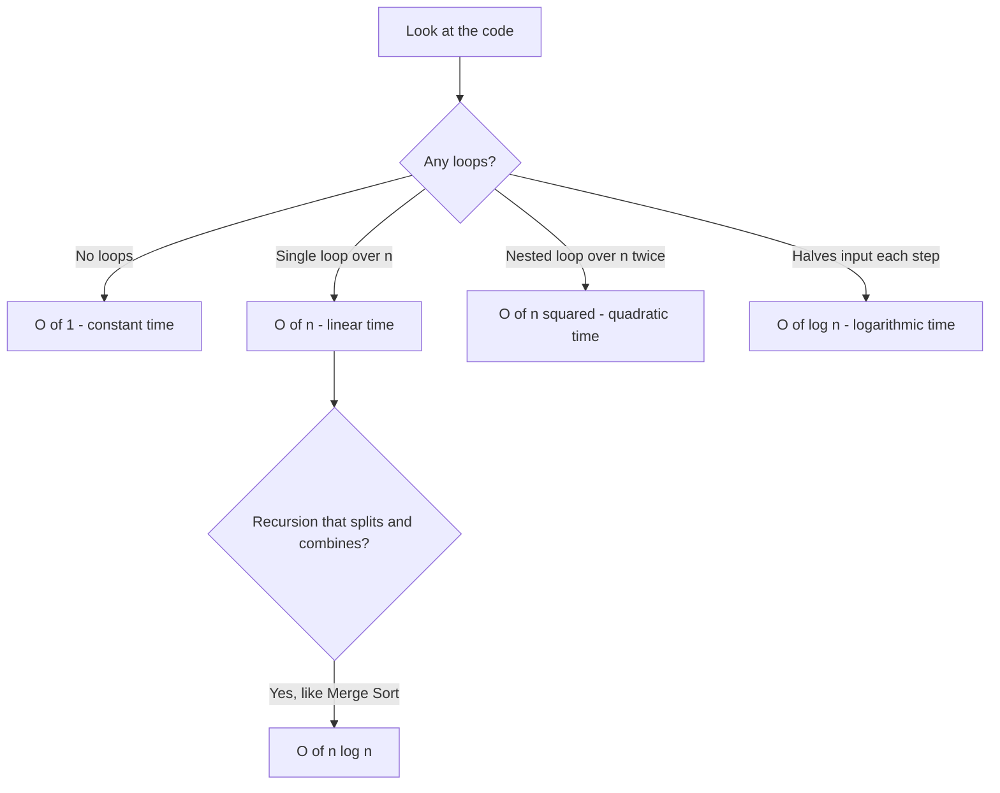
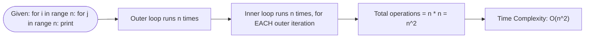

# Complexity (Big-O Analysis)

> Part of [Phase 02 — Data Structures and Algorithms](./README.md)

---

## What is it?

Complexity analysis is a way to describe **how the running time or memory usage of an algorithm grows** as the size of its input grows — _without_ depending on the specific computer, programming language, or compiler running it.

## Why do we need it?

Two programs can produce the exact same correct output, yet one finishes in a millisecond and the other takes a year, simply because they scale differently as input grows. Complexity analysis lets us predict this **before** writing or running code — it's the <b>difference between engineering and guessing.</b>

## Real-world analogy

Imagine two ways to find a name in a phone book:

1. **Linear search**: start on page 1, read every single name until you find it.
2. **Binary search**: open to the middle, decide if your name is earlier or later alphabetically, and repeat on half the book each time.

Both eventually find the name. But for a phone book with a million entries, method 1 might take up to a million checks, while method 2 takes about 20. Complexity analysis is the formal language for describing _exactly_ this kind of difference.

## Historical background

- The formal "Big-O" notation originated in **number theory**, introduced by German mathematician **Paul Bachmann** in 1894, and popularized by **Edmund Landau**.
- **Donald Knuth** brought Big-O notation into computer science in the 1970s as the standard tool for algorithm analysis, in _The Art of Computer Programming_.
- Complexity theory grew into its own deep field, eventually producing the famous **P vs. NP** question, one of the most important unsolved problems in mathematics and computer science.

## Mathematical foundation

**Level 1 — Explain it to a 15-year-old:**

If I give you a bigger stack of homework, how much longer does it take you? If it takes exactly twice as long for twice the homework, that's "linear." If it takes four times as long for twice the homework, that's "quadratic" — and it gets painful fast as the pile grows.

**Level 2 — Engineering Level:**

Big-O notation `O(f(n))` describes an **upper bound** on an algorithm's growth rate as input size `n` grows to infinity, ignoring constant factors and lower-order terms. It answers: "in the worst case, how does runtime scale?"

**Level 3 — Industry Level:**

Engineers use complexity analysis to decide which data structure/algorithm to use at scale: an `O(n²)` algorithm might be perfectly fine for 100 users, but will crash and burn (or time out) at 100 million users. Production systems are frequently redesigned specifically to move from `O(n²)` or `O(n log n)` to `O(n)` or `O(1)` as they scale.

**Level 4 — Research Level:**

Complexity theory research studies the boundaries of what is efficiently computable at all — the **P vs. NP problem** asks whether every problem whose solution can be _verified_ quickly can also be _solved_ quickly. This remains one of the seven Millennium Prize Problems, unsolved as of today.

## Formal definition

**Big-O (upper bound / worst case):**

```
f(n) = O(g(n))  if there exist constants c > 0 and n₀ such that
                 f(n) ≤ c · g(n)  for all n ≥ n₀
```

**Big-Omega (lower bound / best case):**

```
f(n) = Ω(g(n))  if there exist constants c > 0 and n₀ such that
                 f(n) ≥ c · g(n)  for all n ≥ n₀
```

**Big-Theta (tight bound):**

```
f(n) = Θ(g(n))  if f(n) = O(g(n)) AND f(n) = Ω(g(n))
```

## Core concepts

- **Time Complexity** — how runtime scales with input size
- **Space Complexity** — how memory usage scales with input size
- **Best, Average, Worst Case** — different scenarios an algorithm might face
- **Big-O** — worst-case upper bound (most commonly used in practice)
- **Amortized Complexity** — average cost per operation over a sequence of operations (e.g., dynamic array resizing)
- **Asymptotic Analysis** — analyzing behavior as `n` approaches infinity, ignoring constants

## Internal working

When we analyze an algorithm, we count the number of "basic operations" (comparisons, assignments, arithmetic operations) as a function of input size `n`, then simplify by dropping constants and lower-order terms — because for _large enough_ `n`, only the dominant term matters.

## Step-by-step explanation

**How to analyze the time complexity of code, step by step:**

1. Identify the input size variable (usually called `n`).
2. Count how many times the innermost operation executes, as a function of `n`.
3. Identify loops: a single loop over `n` items is `O(n)`; nested loops are typically `O(n²)`, `O(n³)`, etc.
4. Identify "divide the problem in half" patterns (e.g., binary search) — these are typically `O(log n)`.
5. Drop constants and lower-order terms, <b>keeping only the dominant term.</b>

## Visual diagram



## Architecture diagram

```text
Growth rate comparison (how fast each complexity class grows):

Time
 |                                          O(n^2)  (quadratic - gets bad fast)
 |                                      /
 |                                  /
 |                              /
 |                          /          O(n log n) (very good, most efficient sorts)
 |                      /         __--
 |                  /        __--
 |              /       __--          O(n) (linear - proportional)
 |          /      __--
 |      /     __--                O(log n) (barely grows - binary search)
 |  /    __--        _______________________
 |/__--_________________________________________ O(1) (constant - flat line)
 +------------------------------------------------> Input size n
```

## Flowchart



## Example

Analyze this code:

```python
def sum_array(arr):        # n = len(arr)
    total = 0               # O(1) - runs once
    for x in arr:            # runs n times
        total += x            # O(1) work each time
    return total             # O(1) - runs once

# Total: O(1) + n * O(1) + O(1) = O(n)
```

## Dry run

Trace the operation count for `sum_array([3, 7, 1, 9])` (n = 4):

| Step | Operation  | Running Total |
| ---- | ---------- | ------------- |
| Init | total = 0  | 0             |
| i=0  | total += 3 | 3             |
| i=1  | total += 7 | 10            |
| i=2  | total += 1 | 11            |
| i=3  | total += 9 | 20            |

4 additions for 4 elements → confirms `O(n)`: work scales directly with input size.

## Multiple examples

**Example 1 — O(1):** Accessing `arr[5]` directly — no matter how big the array is, this takes the same time.

**Example 2 — O(n²):** Bubble Sort — comparing every element to every other element (nested loops).

**Example 3 — O(log n):** Binary Search — each step eliminates half the remaining search space.

**Example 4 — O(n log n):** Merge Sort — split the array (log n levels), and merge at each level costs O(n).

**Example 5 — O(2ⁿ):** Naive recursive Fibonacci — each call spawns two more calls, doubling work at every level.

## Advantages

- Gives an objective, hardware-independent way to compare algorithms.
- Helps predict scalability problems before they happen in production.
- Provides a shared vocabulary used universally in interviews, papers, and engineering discussions.

## Disadvantages

- Ignores constant factors — an `O(n)` algorithm with a huge constant can be slower than an `O(n log n)` algorithm for realistic input sizes.
- Worst-case analysis can be overly pessimistic for algorithms that perform well in typical/average cases (e.g., Quicksort).
- Doesn't capture real-world factors like cache locality, memory hierarchy, or parallelism.

## Complexity

_(This topic IS the complexity table — see the Cheat Sheet in the [phase README](./README.md).)_

| Class      | Name         | Example                          |
| ---------- | ------------ | -------------------------------- |
| O(1)       | Constant     | Array index access               |
| O(log n)   | Logarithmic  | Binary search                    |
| O(n)       | Linear       | Simple loop                      |
| O(n log n) | Linearithmic | Merge Sort, Quick Sort (average) |
| O(n²)      | Quadratic    | Bubble Sort, nested loops        |
| O(2ⁿ)      | Exponential  | Naive recursive Fibonacci        |
| O(n!)      | Factorial    | Brute-force Traveling Salesman   |

## Memory usage

Space complexity follows the same notation. An algorithm using a fixed number of extra variables regardless of input size is `O(1)` space ("in-place"). An algorithm that creates a new array proportional to input size is `O(n)` space.

## Time complexity

The whole point of this chapter — see the table above. The critical engineering skill is recognizing these patterns instantly by reading code structure (loops, recursion, halving).

## Best practices

- Always state the _worst-case_ complexity unless explicitly asked for average or best case.
- Analyze both time AND space complexity — many real interviews and systems care about both.
- When in doubt, count nested loop depth (each level of nesting over the input typically multiplies complexity).
- For recursive algorithms, use the **Master Theorem** or draw a **recursion tree** to determine complexity systematically.

## Common mistakes

- Assuming more lines of code means slower algorithm (it's about growth rate, not code length).
- Confusing `O(n)` (loop over input once) with `O(n²)` (nested loop, comparing pairs).
- Forgetting that string/array concatenation inside a loop can silently turn an `O(n)` algorithm into `O(n²)` (because each concatenation itself takes time proportional to current length).
- Ignoring the complexity of built-in functions (e.g., `sort()` is O(n log n), not free).

## Interview questions

1. What is the time complexity of binary search, and why?
2. Explain the difference between Big-O, Big-Omega, and Big-Theta.
3. What is amortized time complexity? Give an example (e.g., dynamic array `append`).
4. Why is Quicksort's worst case O(n²) but its average case O(n log n)?
5. What is the time and space complexity of your solution, and can you improve it?

## University questions

1. Derive the time complexity of Merge Sort using the recurrence relation `T(n) = 2T(n/2) + O(n)`.
2. Define Big-O, Big-Omega, and Big-Theta formally.
3. Compare the time complexities of Linear Search and Binary Search, and state their prerequisites.
4. Explain amortized analysis with the example of dynamic array doubling.

## Coding examples

### Pseudocode

```text
FUNCTION analyzeGrowth(n):
    // O(1) example
    x = n + 1

    // O(n) example
    FOR i FROM 1 TO n:
        print(i)

    // O(n^2) example
    FOR i FROM 1 TO n:
        FOR j FROM 1 TO n:
            print(i, j)

    // O(log n) example
    x = n
    WHILE x > 1:
        x = x / 2
```

### Python implementation

```python
import time

def linear_search(arr, target):   # O(n)
    for i, val in enumerate(arr):
        if val == target:
            return i
    return -1

def binary_search(arr, target):    # O(log n) - requires sorted array
    low, high = 0, len(arr) - 1
    while low <= high:
        mid = (low + high) // 2
        if arr[mid] == target:
            return mid
        elif arr[mid] < target:
            low = mid + 1
        else:
            high = mid - 1
    return -1

data = list(range(1_000_000))
print(binary_search(data, 999_999))  # very fast even for 1 million elements
```

### C implementation

```c
#include <stdio.h>

int linearSearch(int arr[], int n, int target) {   // O(n)
    for (int i = 0; i < n; i++) {
        if (arr[i] == target) return i;
    }
    return -1;
}

int binarySearch(int arr[], int n, int target) {    // O(log n)
    int low = 0, high = n - 1;
    while (low <= high) {
        int mid = low + (high - low) / 2;
        if (arr[mid] == target) return mid;
        else if (arr[mid] < target) low = mid + 1;
        else high = mid - 1;
    }
    return -1;
}

int main() {
    int arr[] = {1, 3, 5, 7, 9, 11};
    printf("Found at index: %d\n", binarySearch(arr, 6, 7));
    return 0;
}
```

### C++ implementation

```cpp
#include <iostream>
#include <vector>
using namespace std;

int binarySearch(vector<int>& arr, int target) {   // O(log n)
    int low = 0, high = arr.size() - 1;
    while (low <= high) {
        int mid = low + (high - low) / 2;
        if (arr[mid] == target) return mid;
        else if (arr[mid] < target) low = mid + 1;
        else high = mid - 1;
    }
    return -1;
}

int main() {
    vector<int> arr = {1, 3, 5, 7, 9, 11};
    cout << "Found at index: " << binarySearch(arr, 7) << endl;
}
```

### Java implementation

```java
public class ComplexityDemo {
    static int binarySearch(int[] arr, int target) {   // O(log n)
        int low = 0, high = arr.length - 1;
        while (low <= high) {
            int mid = low + (high - low) / 2;
            if (arr[mid] == target) return mid;
            else if (arr[mid] < target) low = mid + 1;
            else high = mid - 1;
        }
        return -1;
    }

    public static void main(String[] args) {
        int[] arr = {1, 3, 5, 7, 9, 11};
        System.out.println("Found at index: " + binarySearch(arr, 7));
    }
}
```

## Visualization

```text
Binary Search narrowing down on target = 7 in [1,3,5,7,9,11,13]:

Step 1: [1, 3, 5, 7, 9, 11, 13]   mid = 7   -> FOUND (1 step!)

Compare to Linear Search on the same array looking for 13:
Step 1: check 1   Step 2: check 3   Step 3: check 5
Step 4: check 7   Step 5: check 9   Step 6: check 11   Step 7: check 13 -> FOUND (7 steps)
```

## Industry use

- **Database query planners** choose between full table scans (O(n)) and index lookups (O(log n) via B-Trees) based on complexity estimates.
- **Search engines** rely on data structures with O(1) or O(log n) lookup to serve billions of queries per day.
- **Interview processes** at nearly every software company explicitly ask candidates to state Big-O for their solutions.
- **Performance engineering teams** profile production code specifically to catch accidental O(n²) or worse behavior hiding in loops.

## Research relevance

Complexity theory is a deep academic field on its own: the **P vs. NP problem** asks whether problems that are easy to _verify_ are also easy to _solve_ — with a $1,000,000 Millennium Prize still unclaimed. Research also explores **approximation algorithms** for NP-hard problems, and **fine-grained complexity** (proving precise lower bounds, not just upper bounds).

## Related concepts

- Calculus (Big-O is formally defined using limiting behavior)
- Recursion and the Master Theorem (for analyzing divide-and-conquer algorithms)
- Every other file in this phase — complexity is the shared measuring stick

## Practice problems

1. State the time complexity of a function with three sequential (not nested) loops, each running `n` times.
2. What is the time complexity of checking if a string is a palindrome?
3. Given `T(n) = 2T(n/2) + n`, what is the resulting time complexity? (Hint: this is Merge Sort's recurrence.)
4. Write code for an `O(n)` algorithm that finds the maximum value in an unsorted array, and explain why it can't be done faster in the general case.

## Advanced concepts

- **Master Theorem** — a formula for directly solving recurrence relations of the form `T(n) = aT(n/b) + f(n)`, common in divide-and-conquer analysis.
- **Amortized Analysis** (Aggregate, Accounting, Potential methods) — formally proving average-case cost per operation over a sequence.
- **NP-Completeness** — the theory of problems believed to have no efficient (polynomial-time) solution.

## Summary

Complexity analysis is the measuring stick of computer science — it lets us predict, compare, and reason about algorithms mathematically, before ever running a single line of code. Every data structure and algorithm in the rest of this phase will be evaluated using exactly this language.

## Key takeaways

- Big-O describes the worst-case growth rate of time or space as input size grows.
- Constants and lower-order terms are dropped — only the dominant term matters at scale.
- Nested loops over `n` typically indicate `O(n²)`; halving-based algorithms typically indicate `O(log n)`.
- Complexity analysis is hardware-independent and forms the shared language of algorithm design.

## References

- Cormen, Leiserson, Rivest, Stein. _Introduction to Algorithms_ (CLRS), Chapter 3.
- Knuth, D. _The Art of Computer Programming_, Volume 1.
- Sipser, M. _Introduction to the Theory of Computation_ (for P vs NP background).

---

⬅ Back to [Phase 02 — Data Structures and Algorithms README](./README.md)
