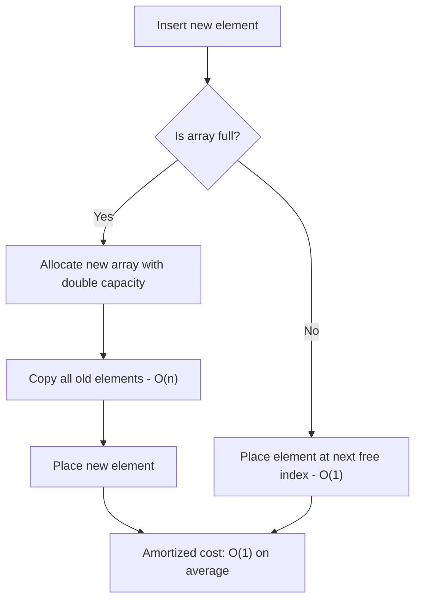
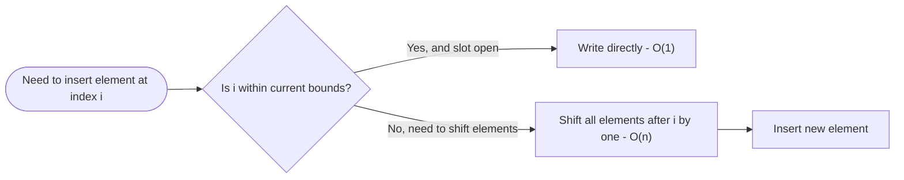

# Arrays

> Part of [Phase 02 — Data Structures and Algorithms](./README.md)

---

## What is it?

An array is a collection of elements, **all of the same type**, stored in **contiguous (back-to-back) memory locations**, and accessed using an index number.

## Why do we need it?

We almost always need to store more than one value — a list of student grades, pixels in an image, or scores in a game. Arrays are the simplest, most fundamental way to group many values together while still being able to instantly jump to any specific one.

## Real-world analogy

Think of an array like a row of numbered mailboxes in an apartment building. Every mailbox is the same size, they sit right next to each other, and if you know the box number (the index), you can walk directly to it — you don't have to check every box along the way.

```text
Mailboxes (Array):
[ 0 ] [ 1 ] [ 2 ] [ 3 ] [ 4 ]
  10    25    7     42   99
```

## Historical background

- Arrays are one of the oldest data structures, present in the earliest programming languages (Fortran, 1957) because they map directly onto how computer memory itself is physically organized — a flat, numbered sequence of storage cells.
- The concept mirrors mathematical **matrices** and **vectors**, which predate computing by centuries (see [`Linear-Algebra.md`](../01-Mathematics/Linear-Algebra.md) in Phase 1).
- Dynamic arrays (like Python's `list` or Java's `ArrayList`) emerged later as a convenience layer that automatically resizes an underlying fixed-size array.

## Mathematical foundation

**Level 1 — Explain it to a 15-year-old:**

Imagine a street of houses, all numbered starting from 0. If someone tells you "go to house number 5," you walk directly there — you don't need to pass every house first. That's exactly how an array works in a computer's memory.

**Level 2 — Engineering Level:**

An array of `n` elements, each of size `s` bytes, occupies `n × s` contiguous bytes in memory. Accessing element `i` uses the formula `address = base_address + (i × s)`, computed directly — which is why array access is `O(1)`, regardless of array size.

**Level 3 — Industry Level:**

Dynamic arrays (Python lists, Java `ArrayList`, C++ `vector`) automatically grow by allocating a new, larger block (typically doubling in size) and copying old elements over when full. This "amortized doubling" strategy keeps average insertion cost at `O(1)`, even though any single resize operation costs `O(n)`.

**Level 4 — Research Level:**

Research explores **cache-oblivious data structures** that are optimized for how modern CPU memory hierarchies (L1/L2/L3 cache, RAM) actually behave — arrays are the gold standard here because contiguous memory access is extremely cache-friendly, unlike pointer-chasing structures like linked lists.

## Formal definition

An array `A` of size `n` is a mapping from index set `{0, 1, ..., n-1}` to a set of values, such that each index maps to exactly one value, and any value can be retrieved in constant time given its index: `A[i] = value at position i`.

## Core concepts

- **Static Array** — fixed size, determined at creation time
- **Dynamic Array** — resizable array that grows/shrinks automatically (Python list, Java ArrayList, C++ vector)
- **Index** — the position of an element, usually starting at 0 ("zero-indexed")
- **Contiguous memory** — elements stored back-to-back, enabling O(1) random access
- **Multidimensional arrays** — arrays of arrays (2D grids, 3D volumes)
- **Amortized resizing** — the strategy dynamic arrays use to grow efficiently over time

## Internal working

When you write `arr[i]`, the computer does NOT search through the array. It directly computes a memory address using simple arithmetic (`base_address + i * element_size`) and jumps straight there — this is why array access is one of the fastest operations in computing, `O(1)`.

## Step-by-step explanation

**How dynamic array resizing (doubling) works, step by step:**

1. Start with a small fixed-size array (e.g., capacity 4).
2. Insert elements one by one; each insert is `O(1)` as long as there's free capacity.
3. When the array is full and a new element is inserted, allocate a NEW array with double the capacity (e.g., capacity 8).
4. Copy all existing elements from the old array into the new array — this single operation costs `O(n)`.
5. Add the new element. Continue as before.
6. Because doubling happens rarely (less and less often as the array grows), the _average_ cost per insertion, over many insertions, works out to `O(1)` — this is called **amortized O(1)**.

## Visual diagram



## Architecture diagram

```text
Memory layout of an array of 5 integers (4 bytes each):

Address:   1000   1004   1008   1012   1016
          +------+------+------+------+------+
Array:    |  10  |  25  |   7  |  42  |  99  |
          +------+------+------+------+------+
Index:       0      1      2      3      4

Accessing arr[3]:
address = 1000 + (3 * 4) = 1012   -> directly jumps here, O(1)
```

## Flowchart



## Example

Insert `50` at index `2` in `[10, 20, 30, 40]`:

```
Before: [10, 20, 30, 40]
Shift elements from index 2 onward to the right:
        [10, 20, _, 30, 40]
Insert 50 at index 2:
        [10, 20, 50, 30, 40]
```

## Dry run

Trace `append()` on a dynamic array with initial capacity 2, inserting `1, 2, 3, 4, 5`:

| Step | Action    | Array                                            | Capacity |
| ---- | --------- | ------------------------------------------------ | -------- |
| 1    | append(1) | [1]                                              | 2        |
| 2    | append(2) | [1,2]                                            | 2 (full) |
| 3    | append(3) | RESIZE to 4, copy [1,2], add 3 → [1,2,3]         | 4        |
| 4    | append(4) | [1,2,3,4]                                        | 4 (full) |
| 5    | append(5) | RESIZE to 8, copy [1,2,3,4], add 5 → [1,2,3,4,5] | 8        |

Notice: resizing (the expensive O(n) copy) happens only twice across 5 insertions — this is the essence of amortized analysis.

## Multiple examples

**Example 1 — 1D array:** `[3, 6, 9, 12]` — exam scores for 4 students.

**Example 2 — 2D array (matrix):**

```
[[1, 2, 3],
 [4, 5, 6],
 [7, 8, 9]]
```

A grid, e.g., representing a tic-tac-toe board or an image's pixel intensities.

**Example 3 — Array of strings:** `["Alice", "Bob", "Charlie"]` — a class roster.

## Advantages

- `O(1)` random access to any element by index.
- Extremely cache-friendly due to contiguous memory — very fast in practice, not just in theory.
- Simple, predictable memory layout.

## Disadvantages

- Insertion/deletion in the middle requires shifting elements — `O(n)` worst case.
- Static arrays have a fixed size decided upfront; resizing (in languages that support it) requires copying.
- Wastes memory if allocated larger than needed, or requires costly resizing if too small.

## Complexity

| Operation                                | Time Complexity |
| ---------------------------------------- | --------------- |
| Access by index                          | O(1)            |
| Search (unsorted)                        | O(n)            |
| Search (sorted, using binary search)     | O(log n)        |
| Insert at end (dynamic array, amortized) | O(1) amortized  |
| Insert at beginning/middle               | O(n)            |
| Delete at end                            | O(1)            |
| Delete at beginning/middle               | O(n)            |

## Memory usage

A static array of `n` elements of size `s` bytes uses exactly `n × s` bytes — no overhead. A dynamic array typically over-allocates (e.g., keeping capacity larger than current size) to support amortized O(1) growth, trading some memory for speed.

## Time complexity

See the table above. The single most important number to remember: **array access is O(1)** — this is the property that makes arrays the default choice whenever fast random access matters more than fast insertion/deletion.

## Best practices

- Prefer arrays/dynamic arrays when you need frequent random access and appends, and rarely need to insert/delete from the middle or beginning.
- Pre-allocate capacity if you know the approximate final size, to avoid unnecessary resizing.
- Be mindful of "off-by-one" errors — always double check whether indexing is 0-based or 1-based.

## Common mistakes

- Off-by-one errors (using `<=` instead of `<` in a loop bound, or vice versa).
- Accessing an index outside the array's bounds ("index out of range" errors).
- Assuming insertion at an arbitrary position is `O(1)` — it's `O(n)` due to shifting.
- Forgetting that array size in low-level languages (like C) is fixed once created.

## Interview questions

1. What is the time complexity of accessing an array element by index, and why?
2. How does a dynamic array (e.g., Java's ArrayList) grow internally?
3. Why is inserting at the beginning of an array O(n)?
4. Explain the difference between a static array and a dynamic array.
5. Given a rotated sorted array, how would you search for an element efficiently?

## University questions

1. Derive the address formula for accessing an element in a 2D array (row-major order).
2. Explain amortized analysis for dynamic array doubling with a mathematical proof/argument.
3. Compare arrays and linked lists in terms of memory usage and operation complexity.
4. Write pseudocode to reverse an array in place.

## Coding examples

### Pseudocode

```text
FUNCTION insertAt(array, index, value, size):
    FOR i FROM size DOWN TO index + 1:
        array[i] = array[i - 1]
    array[index] = value
    RETURN array with size + 1
```

### Python implementation

```python
def insert_at(arr, index, value):
    arr.insert(index, value)  # Python lists handle shifting internally
    return arr

def reverse_in_place(arr):
    left, right = 0, len(arr) - 1
    while left < right:
        arr[left], arr[right] = arr[right], arr[left]
        left += 1
        right -= 1
    return arr

data = [10, 20, 30, 40]
print(insert_at(data, 2, 50))     # [10, 20, 50, 30, 40]
print(reverse_in_place([1,2,3,4])) # [4, 3, 2, 1]
```

### C implementation

```c
#include <stdio.h>

void insertAt(int arr[], int *size, int index, int value) {
    for (int i = *size; i > index; i--) {
        arr[i] = arr[i - 1];
    }
    arr[index] = value;
    (*size)++;
}

int main() {
    int arr[10] = {10, 20, 30, 40};
    int size = 4;

    insertAt(arr, &size, 2, 50);

    for (int i = 0; i < size; i++) printf("%d ", arr[i]);
    printf("\n");
    return 0;
}
```

### C++ implementation

```cpp
#include <iostream>
#include <vector>
using namespace std;

void insertAt(vector<int>& arr, int index, int value) {
    arr.insert(arr.begin() + index, value);   // std::vector handles shifting
}

int main() {
    vector<int> arr = {10, 20, 30, 40};
    insertAt(arr, 2, 50);

    for (int val : arr) cout << val << " ";
    cout << endl;
}
```

### Java implementation

```java
import java.util.ArrayList;

public class ArraysDemo {
    public static void main(String[] args) {
        ArrayList<Integer> arr = new ArrayList<>();
        arr.add(10);
        arr.add(20);
        arr.add(30);
        arr.add(40);

        arr.add(2, 50);  // insert at index 2

        System.out.println(arr);  // [10, 20, 50, 30, 40]
    }
}
```

## Visualization

```text
Inserting 50 at index 2 in [10, 20, 30, 40]:

Step 1 (before):  [10, 20, 30, 40, __]
Step 2 (shift):   [10, 20, __, 30, 40]   <- elements from index 2 onward moved right
Step 3 (insert):  [10, 20, 50, 30, 40]
```

## Industry use

- **Image processing**: images are stored as 2D (or 3D, with color channels) arrays of pixel values.
- **Databases**: columnar storage engines use arrays for extremely fast scanning of a single column.
- **Numerical computing / Machine Learning**: NumPy arrays and PyTorch/TensorFlow tensors are, at their core, highly-optimized multidimensional arrays.
- **Game development**: game boards, sprite sheets, and collision grids are commonly represented as arrays.

## Research relevance

Research into **cache-oblivious algorithms** and **SIMD (Single Instruction, Multiple Data) vectorization** specifically exploits the contiguous memory layout of arrays to achieve massive real-world speedups on modern CPUs and GPUs — this is a major reason arrays remain foundational even in cutting-edge high-performance computing research.

## Related concepts

- Linked Lists (the main alternative linear structure, with opposite trade-offs)
- Hashing (hash tables are often implemented using an underlying array)
- Dynamic Programming (many DP solutions use arrays/tables to store subproblem results)
- Linear Algebra, Phase 1 (matrices are 2D arrays)

## Practice problems

1. Write a function to find the maximum and minimum values in an array in a single pass.
2. Rotate an array to the right by `k` positions.
3. Find the missing number in an array containing `n-1` distinct numbers from `1` to `n`.
4. Implement a dynamic array from scratch (with manual resizing) in a language of your choice.

## Advanced concepts

- **Sparse arrays** — memory-efficient representations for arrays that are mostly empty/zero.
- **Circular arrays / ring buffers** — arrays that wrap around, used to implement efficient queues.
- **Multi-dimensional array memory layouts** — row-major (C, Python) vs. column-major (Fortran, MATLAB) ordering, which significantly affects cache performance.

## Summary

Arrays are the simplest and most fundamental data structure: a contiguous block of same-type elements offering blazing-fast `O(1)` access by index, at the cost of expensive insertion/deletion in the middle. Nearly every other data structure in this phase either builds on arrays internally (hash tables, heaps) or exists specifically to solve a weakness of arrays (linked lists).

## Key takeaways

- Arrays offer O(1) access but O(n) insertion/deletion in the middle.
- Dynamic arrays achieve amortized O(1) append using a doubling strategy.
- Contiguous memory layout makes arrays extremely cache-friendly — fast in practice, not just in theory.
- Nearly all higher-level data structures (hash tables, heaps, stacks, queues) are commonly implemented on top of arrays.

## References

- Cormen, Leiserson, Rivest, Stein. _Introduction to Algorithms_ (CLRS), Chapter 10.
- Sedgewick, R., Wayne, K. _Algorithms_, 4th Edition.
- Python official documentation — `list` object internals.

---

⬅ Back to [Phase 02 — Data Structures and Algorithms README](./README.md)
