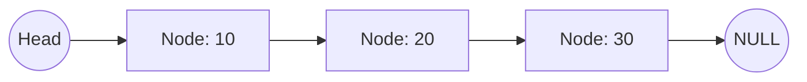
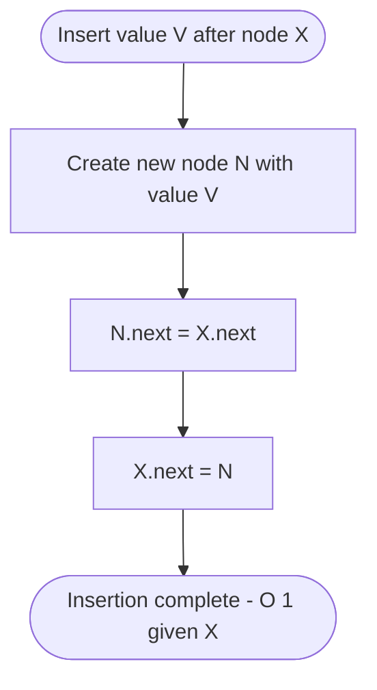
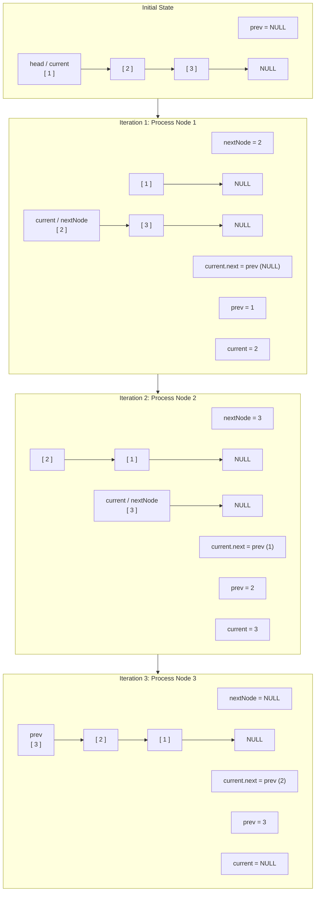
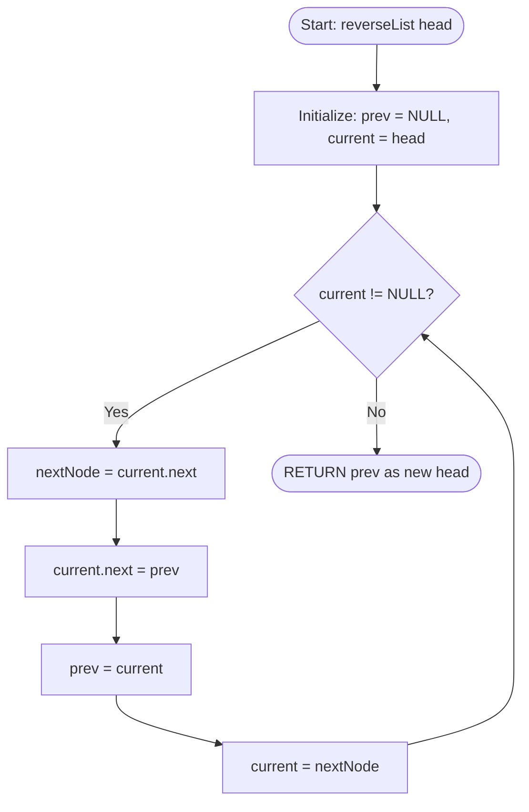

# Linked Lists

> Part of [Phase 02 — Data Structures and Algorithms](./README.md)

---

## What is it?

A linked list is a linear data structure where elements (called **nodes**) are NOT stored in contiguous memory. Instead, each node stores its value plus a **pointer/reference** to the next node, forming a chain.

## Why do we need it?

Arrays are fast to access but expensive to insert/delete in the middle, because elements must be shifted. Linked lists solve exactly this weakness: inserting or deleting a node (once you're at the right place) costs only `O(1)`, because you just re-point a few pointers — no shifting required.

## Real-world analogy

Think of a linked list like a **treasure hunt**: each clue (node) tells you the treasure's value AND gives you directions to the next clue. You can't jump straight to clue #7 — you must follow the chain from clue #1, one step at a time.

```text
[10 | next] -> [20 | next] -> [30 | next] -> [40 | NULL]
```

## Historical background

- Linked lists were introduced in 1955–56 by **Allen Newell, Cliff Shaw, and Herbert Simon** as part of the IPL (Information Processing Language), used for early AI programs like the Logic Theorist.
- They became a core structure in **LISP** (1958), one of the earliest high-level programming languages, where the "linked list" (as `cons` cells) is the fundamental data structure the entire language is built around.
- Linked lists remain foundational in operating system design (e.g., process scheduling queues, free memory lists).

## Mathematical foundation

**Level 1 — Explain it to a 15-year-old:**

Imagine a scavenger hunt where each note tells you the next hiding spot. You don't know where note #5 is until you've read notes #1 through #4. That's a linked list — you must "walk" through it step by step; you can't skip ahead.

**Level 2 — Engineering Level:**

A linked list node is a composite structure `{data, next_pointer}`. The list itself is represented by a reference to the first node (the **head**). Traversal requires following `next` pointers sequentially, giving `O(n)` access but `O(1)` insertion/deletion at a known position.

**Level 3 — Industry Level:**

Linked lists underlie the implementation of many higher-level structures: an **LRU (Least Recently Used) cache** commonly uses a doubly linked list (for O(1) reordering) combined with a hash map (for O(1) lookup). Operating systems use linked lists to manage free memory blocks and process queues.

**Level 4 — Research Level:**

Research into **lock-free / concurrent linked lists** addresses how to safely insert and delete nodes across multiple threads simultaneously without traditional locks, a critical topic for high-performance concurrent systems and databases.

## Formal definition

A singly linked list is a sequence of nodes `n₁, n₂, ..., nₖ` such that each node `nᵢ` stores a value and a pointer `next(nᵢ) = nᵢ₊₁`, with `next(nₖ) = NULL`. The list is fully identified by a reference to `n₁` (the head).

## Core concepts

- **Node** — a unit containing data and a pointer to the next (and possibly previous) node
- **Head** — reference to the first node in the list
- **Tail** — the last node, whose `next` pointer is `NULL`
- **Singly Linked List** — each node points only to the next node
- **Doubly Linked List** — each node points to both the next AND the previous node
- **Circular Linked List** — the tail's `next` pointer points back to the head, forming a loop
- **Traversal** — visiting each node in sequence, starting from the head

## Internal working

Unlike arrays, linked list nodes can live anywhere in memory — they are connected purely through pointers, not physical adjacency. This flexibility is what makes insertion/deletion cheap (no shifting), but it also means you lose the ability to "jump" to an arbitrary position — you must always start from the head (or tail, for doubly linked lists) and follow pointers.

## Step-by-step explanation

**How inserting a node in the middle of a linked list works, step by step:**

1. Traverse the list from the head until you reach the node just BEFORE the desired insertion point (this part is `O(n)`).
2. Create a new node containing the desired value.
3. Set the new node's `next` pointer to point to the current node's `next` (the node that will come after it).
4. Update the current node's `next` pointer to point to the new node.
5. Done — no shifting of other elements was required (this final re-pointing step is `O(1)`).

## Visual diagram



## Architecture diagram

```text
Singly Linked List:
HEAD -> [10|*] -> [20|*] -> [30|*] -> [40|NULL]

Doubly Linked List:
NULL <- [10|*|*] <-> [20|*|*] <-> [30|*|*] -> NULL
              ^prev/next pointers in both directions

Inserting 25 between 20 and 30 (singly linked list):

Before:  [20|*] --------------------> [30|*]
                     (next pointer)

After:   [20|*] -> [25|*] -> [30|*]
             (re-pointed)  (new node's next)
```

## Flowchart



## Example

Delete the node with value `20` from `10 -> 20 -> 30 -> NULL`:

```
Before: 10 -> 20 -> 30 -> NULL

Step 1: Find the node BEFORE 20 (that's node 10)
Step 2: Re-point node 10's "next" to skip 20 and point directly to 30

After:  10 -> 30 -> NULL
        (node 20 is now unreachable, and will be garbage collected)
```

## Dry run

Trace traversal to find the value `30` in `10 -> 20 -> 30 -> 40 -> NULL`:

| Step | Current Node | Value | Found?                |
| ---- | ------------ | ----- | --------------------- |
| 1    | Node 1       | 10    | No, move to next      |
| 2    | Node 2       | 20    | No, move to next      |
| 3    | Node 3       | 30    | Yes! Return this node |

3 steps for a list of 4 — confirms `O(n)` search, since there's no way to "jump" ahead.

## Multiple examples

**Example 1 — Singly linked list:** `A -> B -> C -> NULL` — simplest form, one-directional traversal.

**Example 2 — Doubly linked list:** `NULL <- A <-> B <-> C -> NULL` — supports traversal in both directions, used in browser history (back/forward).

**Example 3 — Circular linked list:** `A -> B -> C -> (back to A)` — used in round-robin CPU scheduling, where after the last process, control loops back to the first.

## Advantages

- `O(1)` insertion/deletion once you're at the correct position (no shifting needed, unlike arrays).
- Dynamic size — grows and shrinks naturally without needing to pre-allocate or resize.
- Efficient for implementing stacks, queues, and certain graph representations (adjacency lists).

## Disadvantages

- `O(n)` access/search — no random access; must traverse from the head.
- Extra memory overhead per node for storing pointer(s).
- Poor cache locality (nodes scattered in memory) makes it slower in _practice_ than arrays for many workloads, despite better theoretical complexity for insertion.

## Complexity

| Operation                          | Singly Linked List | Doubly Linked List |
| ---------------------------------- | ------------------ | ------------------ |
| Access by index                    | O(n)               | O(n)               |
| Search                             | O(n)               | O(n)               |
| Insert at head                     | O(1)               | O(1)               |
| Insert at tail (with tail pointer) | O(1)               | O(1)               |
| Insert at known position           | O(1)               | O(1)               |
| Delete at known position           | O(n)\*             | O(1)               |

\*Singly linked lists need `O(n)` to find the PREVIOUS node before deletion, unless a previous-node reference is already held.

## Memory usage

Each node uses extra memory beyond its data value: one pointer (singly linked list) or two pointers (doubly linked list). On a 64-bit system, each pointer typically costs 8 bytes — meaningful overhead compared to a plain array, especially for small data values.

## Time complexity

The key engineering trade-off versus arrays: linked lists sacrifice `O(1)` random access for `O(1)` insertion/deletion at known positions — the opposite trade-off arrays make. Choosing between them depends entirely on your workload's access pattern.

## Best practices

- Use a doubly linked list when you need to delete a node given only a reference to it (without knowing its predecessor).
- Maintain a **tail pointer** if you frequently insert at the end, to avoid an unnecessary `O(n)` traversal.
- Prefer arrays over linked lists when random access is common; prefer linked lists when frequent insertion/deletion at arbitrary positions dominates.

## Common mistakes

- Forgetting to update the `head` pointer when inserting/deleting at the very beginning of the list.
- Losing the reference to the rest of the list by overwriting a `next` pointer before saving it.
- Not handling `NULL`/empty list edge cases (deleting from an empty list, inserting into an empty list).
- Creating a memory leak by removing a node without properly freeing/dereferencing it (relevant in manually memory-managed languages like C/C++).

## Interview questions

1. How do you reverse a singly linked list?
2. How do you detect a cycle in a linked list? (Floyd's Cycle Detection / "tortoise and hare")
3. What is the difference between a singly and doubly linked list?
4. How would you find the middle node of a linked list in a single pass?
5. When would you prefer a linked list over an array, and vice versa?

## University questions

1. Write pseudocode to reverse a singly linked list iteratively and recursively.

# Reversing a Singly Linked List

Reversing a linked list in-place relies on maintaining three pointers during iteration:

- `prev`: Tracks the node that will become the new `.next` of the current node (starts at `NULL`).
- `current`: Tracks the node currently being processed (starts at `head`).
- `nextNode`: Temporarily stores `current.next` before the pointer is reversed so traversal isn't lost.

---

## Pointer Evolution per Iteration

Here is the step-by-step state of a sample linked list `1 -> 2 -> 3 -> NULL` through each loop execution until `current == NULL`.



---

## Control Flow Execution Diagram



2. Explain the algorithm to detect and remove a cycle in a linked list.
3. Compare the space complexity of arrays vs. singly vs. doubly linked lists.
4. Describe how a circular linked list can be used to implement round-robin scheduling.

## Coding examples

### Pseudocode

```text
STRUCTURE Node:
    data
    next

FUNCTION reverseList(head):
    prev = NULL
    current = head
    WHILE current != NULL:
        nextNode = current.next
        current.next = prev
        prev = current
        current = nextNode
    RETURN prev   // new head
```

### Python implementation

```python
class Node:
    def __init__(self, data):
        self.data = data
        self.next = None

class LinkedList:
    def __init__(self):
        self.head = None

    def insert_at_head(self, data):
        new_node = Node(data)
        new_node.next = self.head
        self.head = new_node

    def reverse(self):
        prev = None
        current = self.head
        while current:
            next_node = current.next
            current.next = prev
            prev = current
            current = next_node
        self.head = prev

    def print_list(self):
        current = self.head
        while current:
            print(current.data, end=" -> ")
            current = current.next
        print("NULL")

ll = LinkedList()
for val in [30, 20, 10]:
    ll.insert_at_head(val)
ll.print_list()      # 10 -> 20 -> 30 -> NULL
ll.reverse()
ll.print_list()      # 30 -> 20 -> 10 -> NULL
```

### C implementation

```c
#include <stdio.h>
#include <stdlib.h>

struct Node {
    int data;
    struct Node* next;
};

struct Node* insertAtHead(struct Node* head, int data) {
    struct Node* newNode = (struct Node*)malloc(sizeof(struct Node));
    newNode->data = data;
    newNode->next = head;
    return newNode;
}

struct Node* reverseList(struct Node* head) {
    struct Node* prev = NULL;
    struct Node* current = head;
    while (current != NULL) {
        struct Node* nextNode = current->next;
        current->next = prev;
        prev = current;
        current = nextNode;
    }
    return prev;
}

void printList(struct Node* head) {
    while (head != NULL) {
        printf("%d -> ", head->data);
        head = head->next;
    }
    printf("NULL\n");
}

int main() {
    struct Node* head = NULL;
    head = insertAtHead(head, 30);
    head = insertAtHead(head, 20);
    head = insertAtHead(head, 10);

    printList(head);              // 10 -> 20 -> 30 -> NULL
    head = reverseList(head);
    printList(head);              // 30 -> 20 -> 10 -> NULL
    return 0;
}
```

### C++ implementation

```cpp
#include <iostream>
using namespace std;

struct Node {
    int data;
    Node* next;
    Node(int val) : data(val), next(nullptr) {}
};

Node* insertAtHead(Node* head, int data) {
    Node* newNode = new Node(data);
    newNode->next = head;
    return newNode;
}

Node* reverseList(Node* head) {
    Node* prev = nullptr;
    Node* current = head;
    while (current != nullptr) {
        Node* nextNode = current->next;
        current->next = prev;
        prev = current;
        current = nextNode;
    }
    return prev;
}

void printList(Node* head) {
    while (head != nullptr) {
        cout << head->data << " -> ";
        head = head->next;
    }
    cout << "NULL" << endl;
}

int main() {
    Node* head = nullptr;
    head = insertAtHead(head, 30);
    head = insertAtHead(head, 20);
    head = insertAtHead(head, 10);

    printList(head);
    head = reverseList(head);
    printList(head);
}
```

### Java implementation

```java
class Node {
    int data;
    Node next;
    Node(int data) { this.data = data; }
}

public class LinkedListDemo {
    static Node insertAtHead(Node head, int data) {
        Node newNode = new Node(data);
        newNode.next = head;
        return newNode;
    }

    static Node reverseList(Node head) {
        Node prev = null;
        Node current = head;
        while (current != null) {
            Node nextNode = current.next;
            current.next = prev;
            prev = current;
            current = nextNode;
        }
        return prev;
    }

    static void printList(Node head) {
        while (head != null) {
            System.out.print(head.data + " -> ");
            head = head.next;
        }
        System.out.println("NULL");
    }

    public static void main(String[] args) {
        Node head = null;
        head = insertAtHead(head, 30);
        head = insertAtHead(head, 20);
        head = insertAtHead(head, 10);

        printList(head);
        head = reverseList(head);
        printList(head);
    }
}
```

## Visualization

```text
Reversing 10 -> 20 -> 30 -> NULL, step by step:

Step 0: prev=NULL          current=10 -> 20 -> 30 -> NULL
Step 1: prev=10->NULL      current=20 -> 30 -> NULL
Step 2: prev=20->10->NULL  current=30 -> NULL
Step 3: prev=30->20->10->NULL   current=NULL (done)

Final: 30 -> 20 -> 10 -> NULL
```

## Industry use

- **Browser history** (back/forward navigation) — doubly linked list.
- **Music player "next/previous track"** — doubly or circular linked list.
- **Operating system process scheduling** (round-robin) — circular linked list.
- **LRU Cache implementations** (Redis, application caches) — doubly linked list + hash map combo.
- **Undo/Redo systems** in text editors — often modeled with linked structures.

## Research relevance

Concurrent and lock-free linked list designs are an active systems-research area, essential for building thread-safe data structures that scale across many CPU cores without becoming a bottleneck — directly relevant to high-performance databases and in-memory data stores.

## Related concepts

- Stacks and Queues (frequently implemented using linked lists)
- Arrays (the primary alternative, with opposite performance trade-offs)
- Graphs (adjacency lists are, literally, arrays of linked lists)
- Trees (a tree is conceptually a linked structure with multiple "next" pointers per node)

## Practice problems

1. Detect whether a linked list contains a cycle.
2. Find the middle element of a linked list in one pass (using the "slow and fast pointer" technique).
3. Merge two sorted linked lists into one sorted linked list.
4. Remove the nth node from the end of a linked list in a single traversal.

## Advanced concepts

- **Floyd's Cycle Detection Algorithm** ("Tortoise and Hare") — detects cycles in O(n) time, O(1) space.
- **Skip Lists** — a probabilistic data structure built from multiple layers of linked lists, achieving O(log n) search while remaining simpler to implement than balanced trees.
- **XOR Linked Lists** — a memory-optimization technique combining `prev` and `next` pointers into a single field using bitwise XOR.

## Summary

Linked lists trade away the fast random access of arrays in exchange for cheap, flexible insertion and deletion. They are the structural backbone for stacks, queues, adjacency lists in graphs, and many real-world systems like LRU caches and browser history.

## Key takeaways

- Linked lists provide O(1) insertion/deletion at a known position, but O(n) access/search.
- Singly linked lists traverse forward only; doubly linked lists traverse both directions.
- Circular linked lists are ideal for round-robin style repeating processes.
- Always carefully manage pointers during insertion/deletion to avoid losing access to the rest of the list.

## References

- Cormen, Leiserson, Rivest, Stein. _Introduction to Algorithms_ (CLRS), Chapter 10.
- Sedgewick, R., Wayne, K. _Algorithms_, 4th Edition.
- Knuth, D. _The Art of Computer Programming_, Volume 1, Section 2.2 (Linear Lists).

---

⬅ Back to [Phase 02 — Data Structures and Algorithms README](./README.md)
