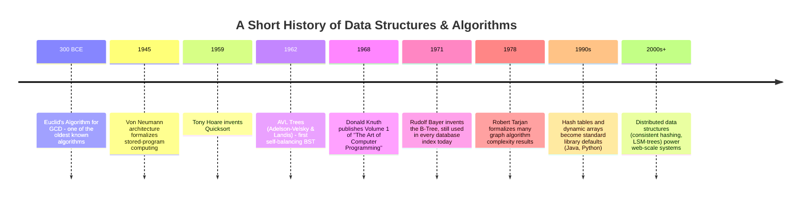
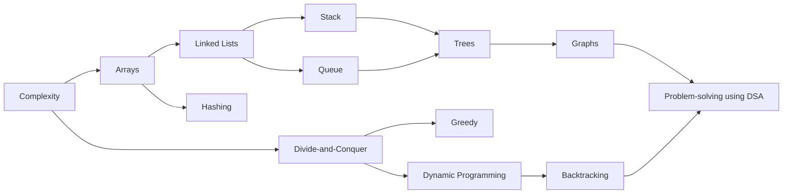

# Data Structures and Algorithms

> "Algorithms are the recipes. Data structures are the kitchen organization that decides whether cooking is fast or a nightmare." — a professor's honest confession, day one of DSA.

This is **Phase 2** of the `msc-computer-science` repository. If Phase 1 (Mathematics) gave you the language to reason about change, uncertainty, and "the best answer," Phase 2 gives you the language to reason about **how to organize information** (data structures) and **how to process it efficiently** (algorithms). This is the single most interview-tested phase in all of computer science.

---

## Table of Contents

- [Introduction](#introduction)
- [Why This Subject Exists](#why-this-subject-exists)
- [Historical Background](#historical-background)
- [Importance](#importance)
- [Applications](#applications)
- [Industries Using It](#industries-using-it)
- [Career Relevance](#career-relevance)
- [Prerequisites](#prerequisites)
- [Roadmap](#roadmap)
- [Complete Syllabus](#complete-syllabus)
- [Learning Objectives](#learning-objectives)
- [How This Connects to Previous Phases](#how-this-connects-to-previous-phases)
- [How This Connects to Later Phases](#how-this-connects-to-later-phases)
- [Recommended Study Order](#recommended-study-order)
- [Estimated Study Time](#estimated-study-time)
- [Books](#books)
- [Research Papers](#research-papers)
- [Reference Websites](#reference-websites)
- [Practice Resources](#practice-resources)
- [Projects](#projects)
- [Interview Importance](#interview-importance)
- [University Exam Importance](#university-exam-importance)
- [Common Mistakes](#common-mistakes)
- [Cheat Sheet](#cheat-sheet)
- [Summary](#summary)
- [Next Steps](#next-steps)

---

## Introduction

Imagine a library with a million books thrown in one giant pile versus a library where books are organized by genre, author, and a catalog index. Both libraries contain the same information — but finding a book takes seconds in one, and hours in the other.

**Data structures** are the organizational systems (the shelves, catalogs, indexes) for information inside a program. **Algorithms** are the step-by-step procedures (the "how do I find this book fastest") that operate on that organization. Together, they determine whether your software runs in milliseconds or minutes, and whether it can handle ten users or ten million.

This phase covers thirteen files, roughly grouped as:

| Group                      | Files                                                                             |
| -------------------------- | --------------------------------------------------------------------------------- |
| Foundations                | `Complexity.md`, `Problem-solving-using-DSA.md`                                   |
| Linear Data Structures     | `Arrays.md`, `Linked-Lists.md`, `Stack.md`, `Queue.md`                            |
| Non-Linear Data Structures | `Trees.md`, `Graphs.md`, `Hashing.md`                                             |
| Algorithmic Paradigms      | `Divide-and-Conquer.md`, `Greedy.md`, `Dynamic-Programming.md`, `Backtracking.md` |

---

## Why This Subject Exists

Every computer has finite memory and finite processing speed. As data grows from hundreds of records to billions, the _way_ you organize and process that data stops being a minor detail and becomes the single biggest factor in whether your software works at all.

Data Structures and Algorithms (DSA) exists to answer one core engineering question, over and over, in every new context: **"Given these limits on memory and time, what is the smartest way to store and process this data?"**

---

## Historical Background

Notice a pattern: nearly every data structure was invented to solve one specific, painful, real bottleneck — and decades later, it silently powers a piece of technology you use every day (B-Trees are still inside almost every database on Earth).

---

## Importance

Data Structures and Algorithms matter because they determine:

1. **Speed** — the difference between a search taking 1 millisecond (hash table) versus 1 hour (unsorted linear scan) on huge datasets.
2. **Scalability** — whether your system still works when your user base grows from 1,000 to 1,000,000,000.
3. **Correctness under constraints** — many real systems (embedded devices, high-frequency trading) have hard memory/time budgets that only the right data structure can meet.
4. **Interview readiness** — DSA is the single most common technical interview topic at software companies worldwide.

---

## Applications

| Data Structure / Algorithm | Real Application                                                                          |
| -------------------------- | ----------------------------------------------------------------------------------------- |
| Arrays                     | Image pixel grids, <b>matrices</b>, contiguous memory buffers                             |
| Linked Lists               | Undo/redo history, music playlists, memory allocators                                     |
| Stacks                     | Function call management, undo operations, expression parsing, browser back button        |
| Queues                     | Task scheduling, print spoolers, message brokers (Kafka, RabbitMQ)                        |
| Hashing                    | Databases indexes, caches, password storage, deduplication                                |
| Trees                      | File systems, databases (B-Trees), autocomplete (Tries), decision-making (Decision Trees) |
| Graphs                     | Social networks, maps/navigation, network routing, recommendation systems                 |
| Divide-and-Conquer         | Sorting (Merge Sort, Quick Sort), Fast Fourier Transform                                  |
| Greedy                     | Huffman coding (file compression), scheduling, network routing (Dijkstra)                 |
| Dynamic Programming        | Route optimization, DNA sequence alignment, resource allocation                           |
| Backtracking               | Sudoku solvers, puzzle solving, constraint satisfaction                                   |

---

## Industries Using It

- **Big Tech** — search engines, social graphs, ranking systems all live and die by DSA choices.
- **Finance** — order-matching engines and fraud detection need microsecond-level data structure performance.
- **Gaming** — spatial data structures (quad-trees, graphs for pathfinding) drive real-time game worlds.
- **Databases & Infrastructure** — B-Trees, hash indexes, and LSM-trees are the literal internals of every database.
- **Networking** — routing algorithms are graph algorithms in disguise.

---

## Career Relevance

| Role                            | DSA You Will Use Daily                                                              |
| ------------------------------- | ----------------------------------------------------------------------------------- |
| Software Engineer (any domain)  | Arrays, Hashing, Trees — constantly                                                 |
| Backend Engineer                | Queues, Graphs (for service dependency, caching)                                    |
| Data Engineer                   | Hashing, Trees (indexes), Graphs (data lineage)                                     |
| ML Engineer                     | Arrays/Tensors, Graphs (computation graphs), Trees (decision trees, random forests) |
| Interview Candidate (any level) | All of it — DSA is the default interview language worldwide                         |

---

## Prerequisites

- Phase 1 (Mathematics) — particularly the notion of a function and basic logical reasoning.
- Basic familiarity with any one programming language (this phase provides Pseudocode, Python, C, C++, and Java for every topic, so no single language is a strict prerequisite).

---

## Roadmap

---

## Complete Syllabus

1. **Complexity** — Big-O, Big-Theta, Big-Omega, time vs. space trade-offs
2. **Arrays** — static/dynamic arrays, multidimensional arrays, operations
3. **Linked Lists** — singly, doubly, circular linked lists
4. **Stack** — LIFO principle, applications (expression evaluation, recursion)
5. **Queue** — FIFO principle, circular queues, priority queues, deques
6. **Hashing** — hash functions, collision handling, load factor
7. **Trees** — binary trees, BSTs, balanced trees (AVL, Red-Black), heaps, tries
8. **Graphs** — representation, traversal (BFS/DFS), shortest paths, MST
9. **Divide-and-Conquer** — Merge Sort, Quick Sort, Binary Search, Karatsuba
10. **Greedy** — Huffman Coding, Activity Selection, Dijkstra's Algorithm
11. **Dynamic Programming** — memoization, tabulation, classic DP problems
12. **Backtracking** — N-Queens, Sudoku, subset generation
13. **Problem-solving using DSA** — pattern recognition, choosing the right structure

---

## Learning Objectives

By the end of this phase, you will be able to:

- Analyze any algorithm's time and space complexity using Big-O notation.
- Choose the correct data structure for a given problem, and justify why.
- Implement every core data structure from scratch in multiple languages.
- Recognize and apply the four major algorithmic paradigms (Divide-and-Conquer, Greedy, DP, Backtracking).
- Solve typical DSA interview and competitive programming problems confidently.

---

## How This Connects to Previous Phases

- **Complexity analysis** directly uses the idea of **limits** from Calculus (Big-O is defined using limiting behavior as input size grows to infinity).
- **Hashing** and **randomized algorithms** (e.g., randomized Quicksort) use **Probability** from Mathematics.
- **Dynamic Programming** overlaps conceptually with **Optimization** — both are about finding a best answer, systematically.

## How This Connects to Later Phases

- **Databases** — B-Trees, hashing, and query optimization are direct extensions of this phase.
- **Operating Systems** — process scheduling uses queues; memory management uses trees and linked lists.
- **Machine Learning** — decision trees, k-d trees (nearest neighbor search), and graph neural networks build on this phase.
- **Compilers** — parsing uses stacks and trees (abstract syntax trees) extensively.
- **Distributed Systems** — consistent hashing and distributed graphs are direct extensions of hashing and graph theory.

---

## Recommended Study Order

1. Complexity (learn to _measure_ before you learn to _build_)
2. Arrays → Linked Lists → Stack → Queue (linear structures, in increasing abstraction)
3. Hashing (a huge, standalone superpower)
4. Trees → Graphs (non-linear structures, increasing complexity)
5. Divide-and-Conquer → Greedy → Dynamic Programming → Backtracking (algorithmic paradigms, roughly increasing difficulty)
6. Problem-solving using DSA (capstone — tie it all together)

---

## Estimated Study Time

| Topic                              | Beginner Pace | Fast Pace    |
| ---------------------------------- | ------------- | ------------ |
| Complexity                         | 3 days        | 1 day        |
| Arrays, Linked Lists, Stack, Queue | 2 weeks       | 4 days       |
| Hashing                            | 1 week        | 2 days       |
| Trees                              | 2 weeks       | 4 days       |
| Graphs                             | 2 weeks       | 4 days       |
| Divide-and-Conquer, Greedy         | 1.5 weeks     | 3 days       |
| Dynamic Programming                | 2 weeks       | 5 days       |
| Backtracking                       | 1 week        | 2 days       |
| Problem-solving using DSA          | ongoing       | ongoing      |
| **Total**                          | **~12 weeks** | **~4 weeks** |

---

## Books

- _Introduction to Algorithms_ (CLRS) — Cormen, Leiserson, Rivest, Stein
- _The Algorithm Design Manual_ — Steven Skiena
- _Data Structures and Algorithms in Java_ — Goodrich, Tamassia, Goldwasser
- _Cracking the Coding Interview_ — Gayle Laakmann McDowell
- _Competitive Programmer's Handbook_ — Antti Laaksonen (free PDF)

## Research Papers

- Hoare, C.A.R. (1961). _Algorithm 64: Quicksort_.
- Bayer, R., McCreight, E. (1972). _Organization and Maintenance of Large Ordered Indices_ (origin of the B-Tree).
- Tarjan, R. (1972). _Depth-First Search and Linear Graph Algorithms_.
- Cormen, Leiserson, Rivest, Stein. _Introduction to Algorithms_ (the canonical DSA reference, technically a textbook but treated as foundational literature).

## Reference Websites

- [GeeksforGeeks](https://www.geeksforgeeks.org)
- [LeetCode](https://leetcode.com)
- [VisuAlgo — Algorithm Visualizations](https://visualgo.net)
- [MIT OpenCourseWare — 6.006 Introduction to Algorithms](https://ocw.mit.edu)

## Practice Resources

- LeetCode (interview-style problems, categorized by data structure)
- Codeforces (competitive programming, algorithmic depth)
- HackerRank (structured practice tracks)
- GATE previous year papers (Algorithms & Data Structures section)

## Projects

1. Build a **text editor's undo/redo system** using two stacks.
2. Build an **autocomplete engine** using a Trie.
3. Implement a **social network friend-suggestion feature** using BFS on a graph.
4. Build a **file compression tool** using Huffman Coding (Greedy algorithm).
5. Implement a **route planner** (like a simplified Google Maps) using Dijkstra's Algorithm.
6. Build a **LRU cache** using a hash map + doubly linked list.

## Interview Importance

(Extremely High)

DSA is, by a wide margin, the most heavily tested subject in software engineering interviews worldwide — at every company size, from startups to Big Tech.

## University Exam Importance

(Very High)

Core, heavily-weighted subject in every BSc/MSc Computer Science curriculum, and a major component of GATE and UGC NET computer science papers.

## Common Mistakes

- Memorizing solutions instead of understanding the underlying pattern.
- Ignoring space complexity and only optimizing for time (or vice versa).
- Not tracing through examples by hand before writing code.
- Jumping straight to code without first choosing the right data structure.
- Treating Big-O as "the number of lines of code" instead of "how runtime scales with input size."

## Cheat Sheet

| Structure     | Access   | Search   | Insert   | Delete   |
| ------------- | -------- | -------- | -------- | -------- |
| Array         | O(1)     | O(n)     | O(n)     | O(n)     |
| Linked List   | O(n)     | O(n)     | O(1)\*   | O(1)\*   |
| Stack / Queue | O(n)     | O(n)     | O(1)     | O(1)     |
| Hash Table    | —        | O(1) avg | O(1) avg | O(1) avg |
| Balanced BST  | O(log n) | O(log n) | O(log n) | O(log n) |
| Heap          | —        | O(n)     | O(log n) | O(log n) |

\*at a known position

| Paradigm            | Core Idea                                                        |
| ------------------- | ---------------------------------------------------------------- |
| Divide-and-Conquer  | Break into independent subproblems, solve, combine               |
| Greedy              | Make the locally best choice at each step                        |
| Dynamic Programming | Break into overlapping subproblems, reuse solutions              |
| Backtracking        | Try, and undo if it doesn't work ("trial and error with memory") |

## Summary

Data Structures and Algorithms is the craft of organizing information and processing it efficiently. It is the most practically tested subject in computer science, and the foundation for databases, operating systems, machine learning, and virtually every large-scale system in production today.

## Next Steps

Proceed in this order:

1. [`Complexity.md`](./Complexity.md)
2. [`Arrays.md`](./Arrays.md) → [`Linked-Lists.md`](./Linked-Lists.md) → [`Stack.md`](./Stack.md) → [`Queue.md`](./Queue.md)
3. [`Hashing.md`](./Hashing.md)
4. [`Trees.md`](./Trees.md) → [`Graphs.md`](./Graphs.md)
5. [`Divide-and-Conquer.md`](./Divide-and-Conquer.md) → [`Greedy.md`](./Greedy.md) → [`Dynamic-Programming.md`](./Dynamic-Programming.md) → [`Backtracking.md`](./Backtracking.md)
6. [`Problem-solving-using-DSA.md`](./Problem-solving-using-DSA.md)

After finishing this phase, proceed to **Phase 3 — (next phase in your roadmap, e.g., Operating Systems, Databases, or Discrete Mathematics)**.
