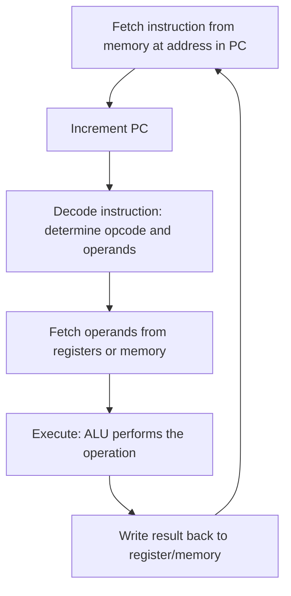
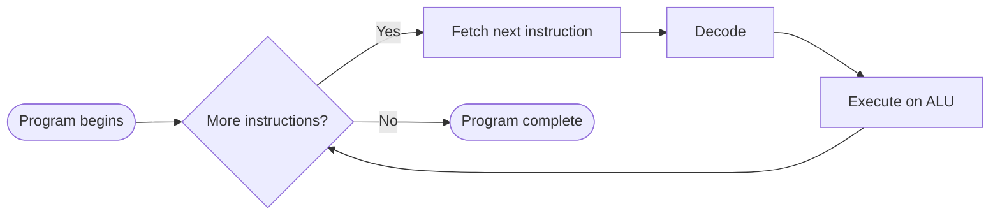

# The CPU (Central Processing Unit)

> Part of [Phase 04 — Computer Architecture](./README.md)

---

## What is it?

The CPU (Central Processing Unit) is the hardware component that actually EXECUTES instructions — repeatedly fetching an instruction from memory, decoding what it means, executing it, and moving to the next one, millions to billions of times per second.

## Why do we need it?

Every other concept in computer science — every algorithm, every line of code — is ultimately meaningless without something to actually CARRY IT OUT. The CPU is that "something": a physical piece of hardware, built from billions of transistors, that turns a stored sequence of binary instructions into real, observable computation.

## Real-world analogy

Think of a CPU like an extremely fast, tireless clerk working through a to-do list one item at a time: read the next task (FETCH), figure out exactly what it's asking for (DECODE), do it (EXECUTE), then immediately move to the next task — repeating this cycle billions of times per second, without ever getting tired or making an unintended mistake.

```text
FETCH   -> "What's the next instruction?"
DECODE  -> "What does this instruction mean? Which registers/values does it need?"
EXECUTE -> "Actually perform the operation (add, load, branch, etc.)"
        -> move to the next instruction, repeat
```

## Historical background

- **John von Neumann's 1945 report**, _"First Draft of a Report on the EDVAC,"_ described the STORED-PROGRAM concept: a single memory holding BOTH instructions and data, with a central processing unit executing them sequentially — the "von Neumann architecture" that remains foundational to virtually all general-purpose computers today.
- The **Intel 4004 (1971)**, the first commercially available microprocessor, packed an entire CPU onto a single chip for the first time, launching the microprocessor revolution.
- Through the 1980s-2000s, CPU design evolved dramatically in COMPLEXITY (pipelining, superscalar execution, out-of-order execution) while the fundamental fetch-decode-execute cycle described by von Neumann remained conceptually unchanged.

## Mathematical foundation

**Level 1 — Explain it to a 15-year-old:**

Imagine reading a recipe one instruction at a time: "read step 3" (fetch), "understand that step 3 means crack two eggs" (decode), "actually crack the eggs" (execute), then move to step 4. A CPU does exactly this with program instructions, just billions of times per second instead of a few times while cooking.

**Level 2 — Engineering Level:**

A CPU consists of a **datapath** (the ALU, registers, and buses that actually move and transform data) and a **control unit** (which generates the signals telling the datapath what to do for each instruction). Performance is commonly measured using: `Execution Time = Instruction Count × CPI × Clock Cycle Time`, where **CPI (Cycles Per Instruction)** is the average number of clock cycles each instruction requires.

**Level 3 — Industry Level:**

Modern CPUs achieve high performance not just through raw clock speed, but through **superscalar execution** (executing MULTIPLE instructions per clock cycle, using multiple parallel execution units), **out-of-order execution** (reordering instructions internally to avoid stalling on a slow dependency, while preserving the ILLUSION of in-order execution to software), and multiple CPU CORES (running genuinely independent instruction streams in parallel) — all while remaining, at the architectural/software-visible level, compatible with the simpler fetch-decode-execute model.

**Level 4 — Research Level:**

Research into CPU **microarchitecture** continues to push performance through techniques like advanced branch prediction (guessing which way a conditional branch will go, to keep the pipeline full — see [`Pipeline.md`](./Pipeline.md)), speculative execution (executing instructions before knowing for certain they're needed), and, more recently, security research into side-channel vulnerabilities (like Spectre and Meltdown) that exploit these SAME performance optimizations to leak sensitive data across supposedly-isolated execution contexts.

## Formal definition

The CPU's basic performance is formally captured by the **CPU Performance Equation**:

```
CPU Time = Instruction Count (IC) × Cycles Per Instruction (CPI) × Clock Cycle Time (T)

Equivalently, since Clock Rate = 1 / Clock Cycle Time:
CPU Time = (IC × CPI) / Clock Rate
```

## Core concepts

- **Datapath** — the hardware components (ALU, registers, buses) that perform the actual computation
- **Control Unit** — generates the control signals directing the datapath's behavior for each instruction
- **Register** — a small, extremely fast storage location directly inside the CPU
- **Fetch-Decode-Execute Cycle** — the fundamental repeating process by which a CPU runs a program
- **Clock Cycle** — the basic unit of time in a CPU, determined by the clock rate (e.g., a 3 GHz CPU has a clock cycle of 1/3,000,000,000 seconds)
- **CPI (Cycles Per Instruction)** — the average number of clock cycles required to execute one instruction
- **Program Counter (PC)** — a register holding the memory address of the NEXT instruction to fetch

## Internal working

During FETCH, the CPU reads the instruction at the address held in the Program Counter (PC), and increments the PC to point to the next instruction. During DECODE, the control unit interprets the instruction's opcode (operation code) and determines which registers/values it needs, generating the appropriate control signals. During EXECUTE, the ALU (Arithmetic Logic Unit) performs the actual computation (e.g., addition), possibly reading from or writing to registers or memory, before the cycle repeats for the next instruction.

## Step-by-step explanation

**How the fetch-decode-execute cycle processes a single instruction, step by step:**

1. **Fetch**: read the instruction located at the address in the Program Counter (PC), from memory into the CPU's instruction register.
2. **Increment PC**: update the Program Counter to point to the next sequential instruction (unless this instruction is itself a branch/jump, which will override this).
3. **Decode**: the control unit interprets the fetched instruction's opcode, determining what operation to perform and which operands (registers, memory addresses, immediate values) it needs.
4. **Fetch Operands**: read any needed values from registers (extremely fast) or memory (much slower — see [`Memory.md`](./Memory.md) and [`Cache.md`](./Cache.md)).
5. **Execute**: the ALU performs the actual operation (arithmetic, logic, address calculation, or comparison for a branch).
6. **Write Back**: if the instruction produces a result (like an addition), write it back to the destination register (or memory).
7. Repeat the ENTIRE cycle for the next instruction.

---

## Worked Examples: CPU Performance Calculations

CPI and execution time calculations are among the most frequently tested numeric question types in GATE/UGC NET Computer Organization papers.

### Worked Example 1 — Basic execution time calculation

**Given:** a program has 50,000 instructions, an average CPI of 4, and runs on a CPU with a clock rate of 2 GHz. Find the total execution time.

```
Clock Cycle Time = 1 / Clock Rate = 1 / (2 x 10^9) = 0.5 x 10^-9 seconds = 0.5 ns

CPU Time = Instruction Count x CPI x Clock Cycle Time
         = 50,000 x 4 x 0.5 x 10^-9 seconds
         = 100,000 x 0.5 x 10^-9
         = 50,000 x 10^-9 seconds
         = 50 microseconds (50 x 10^-6 s)
```

### Worked Example 2 — Mixed instruction types, weighted average CPI

**Given:** a program consists of 3 instruction types with the following counts and individual CPIs:

| Instruction Type | Count  | CPI |
| ---------------- | ------ | --- |
| Arithmetic       | 50,000 | 1   |
| Load/Store       | 30,000 | 4   |
| Branch           | 20,000 | 2   |

Find the average (weighted) CPI and total execution time, given a clock rate of 1 GHz.

```
Total Instructions = 50,000 + 30,000 + 20,000 = 100,000

Total Cycles = (50,000 x 1) + (30,000 x 4) + (20,000 x 2)
             = 50,000 + 120,000 + 40,000
             = 210,000 cycles

Average CPI = Total Cycles / Total Instructions = 210,000 / 100,000 = 2.1

Clock Cycle Time = 1 / (1 x 10^9) = 1 ns

CPU Time = Total Cycles x Clock Cycle Time = 210,000 x 1 ns = 210,000 ns = 210 microseconds

(Note: this can ALSO be computed directly as Total Cycles x Clock Cycle Time,
without needing the average CPI at all - the average CPI is mainly useful
for COMPARISON purposes, e.g., against a different instruction mix or CPU.)
```

### Worked Example 3 — Comparing two CPU designs (a classic "which is faster" question)

**Given:** Two CPU designs run the SAME program (100,000 instructions total).

- CPU A: Clock rate = 3 GHz, CPI = 1.5
- CPU B: Clock rate = 2 GHz, CPI = 0.8

Which CPU is faster, and by what factor?

```
CPU A Time = IC x CPI x Clock Cycle Time
           = 100,000 x 1.5 x (1 / 3x10^9)
           = 150,000 x 0.333x10^-9
           = 50,000 x 10^-9 seconds = 50 microseconds

CPU B Time = 100,000 x 0.8 x (1 / 2x10^9)
           = 80,000 x 0.5x10^-9
           = 40,000 x 10^-9 seconds = 40 microseconds

CPU B is FASTER, despite having a LOWER clock rate!
Speedup factor = CPU A Time / CPU B Time = 50 / 40 = 1.25x

This is a critical, frequently-tested lesson: clock rate ALONE
does not determine performance - CPI matters just as much,
and a lower-clocked CPU with a sufficiently better (lower) CPI
can outperform a higher-clocked one.
```

### Worked Example 4 — Effect of an instruction mix change (compiler optimization scenario)

**Given:** A compiler optimization changes a program from using 40,000 Load/Store instructions (CPI=4) to only 25,000 Load/Store instructions (CPI=4) by keeping more values in registers, while all other instruction counts remain unchanged (60,000 Arithmetic instructions, CPI=1). Clock rate = 2.5 GHz. Compute the execution time BEFORE and AFTER, and the speedup achieved.

```
BEFORE:
Total Cycles = (60,000 x 1) + (40,000 x 4) = 60,000 + 160,000 = 220,000 cycles
Clock Cycle Time = 1/(2.5x10^9) = 0.4 ns
Time_before = 220,000 x 0.4 ns = 88,000 ns = 88 microseconds

AFTER:
Total Cycles = (60,000 x 1) + (25,000 x 4) = 60,000 + 100,000 = 160,000 cycles
Time_after = 160,000 x 0.4 ns = 64,000 ns = 64 microseconds

Speedup = Time_before / Time_after = 88 / 64 = 1.375x

This demonstrates a real, common optimization: REDUCING the number
of expensive (high-CPI) instructions, even without changing clock
rate at all, directly and measurably improves performance -
exactly what "keep more values in registers" compiler optimizations
(register allocation) achieve in practice.
```

---

## Visual diagram



## Architecture diagram

```text
Simplified CPU Datapath:

  +----------------+      +-----------------+
  | Program Counter| ---> | Instruction      |
  | (PC)           |      | Memory           |
  +----------------+      +-----------------+
                                  |
                                  v
                         +-----------------+
                         | Control Unit     |  <- decodes opcode,
                         | (generates       |     generates signals
                         |  control signals)|
                         +-----------------+
                                  |
                                  v
  +----------------+      +-----------------+      +----------------+
  | Register File   | <--> |      ALU        | <--> | Data Memory     |
  +----------------+      +-----------------+      +----------------+
```

## Flowchart



## Example

Trace a single ADD instruction through the cycle:

```
Instruction: ADD R1, R2, R3   (meaning: R1 = R2 + R3)

FETCH:   read this instruction from memory at address in PC; increment PC
DECODE:  opcode = ADD; operands = R2, R3 (sources), R1 (destination)
EXECUTE: ALU computes R2 + R3
WRITE BACK: store the ALU's result into register R1

Next cycle: fetch the instruction now at the (incremented) PC
```

## Dry run

Trace CPU Time computation with intermediate values shown explicitly, for IC=200,000, CPI=2.5, Clock Rate=4 GHz:

| Step | Calculation                                                    | Value                         |
| ---- | -------------------------------------------------------------- | ----------------------------- |
| 1    | Clock Cycle Time = 1 / (4 x 10^9)                              | 0.25 ns                       |
| 2    | Total Cycles = IC x CPI = 200,000 x 2.5                        | 500,000 cycles                |
| 3    | CPU Time = Total Cycles x Clock Cycle Time = 500,000 x 0.25 ns | 125,000 ns = 125 microseconds |

## Multiple examples

**Example 1 — Higher clock rate, same CPI:** doubling clock rate (with everything else unchanged) exactly HALVES execution time — a direct, linear relationship.

**Example 2 — Lower CPI via pipelining:** pipelining (see [`Pipeline.md`](./Pipeline.md)) aims to reduce EFFECTIVE CPI toward 1 by overlapping instruction stages, directly improving performance per the CPU Performance Equation.

**Example 3 — Instruction count reduction via better algorithms:** an algorithmic improvement (Phase 2) that reduces the total number of executed instructions directly reduces CPU Time, showing how algorithm design and computer architecture performance considerations connect directly.

## Advantages

- The CPU Performance Equation (`IC × CPI × Clock Cycle Time`) provides a clean, decomposable framework for understanding EXACTLY where performance gains or losses come from.
- Modern CPU design techniques (pipelining, superscalar execution, multiple cores) have delivered exponential real-world performance gains over decades.
- Understanding the fetch-decode-execute cycle demystifies what "running a program" actually, physically means.

## Disadvantages

- Real CPU performance is influenced by many additional factors (cache behavior, branch prediction accuracy, memory bandwidth) beyond the simplified CPU Performance Equation.
- Chasing ever-higher clock rates alone hits diminishing returns and severe power/heat constraints — this is exactly why modern CPU design has shifted toward multiple cores and architectural efficiency (lower CPI) rather than raw clock speed increases.
- Advanced performance techniques (speculative execution) have introduced serious, hard-to-fully-fix security vulnerabilities (Spectre/Meltdown-class attacks).

## Complexity

| Metric                                     | Formula                                    |
| ------------------------------------------ | ------------------------------------------ |
| Clock Cycle Time                           | 1 / Clock Rate                             |
| CPU Time                                   | Instruction Count × CPI × Clock Cycle Time |
| Average CPI (mixed instructions)           | Total Cycles / Total Instructions          |
| MIPS (Millions of Instructions Per Second) | Clock Rate / (CPI × 10^6)                  |

## Memory usage

_(Not directly applicable to the CPU itself — the CPU's own storage is its register file, a very small number of extremely fast storage locations; the broader memory hierarchy is covered in [`Memory.md`](./Memory.md) and [`Cache.md`](./Cache.md).)_

## Time complexity

The single most important practical lesson from this chapter's worked examples: **clock rate alone does NOT determine performance — CPI matters equally, and comparing CPUs (or optimizations) requires considering BOTH factors together**, exactly as demonstrated in Worked Example 3.

## Best practices

- When comparing CPU or compiler performance claims, always ask about BOTH clock rate AND CPI (or overall benchmarked execution time) — clock rate alone is an incomplete, sometimes misleading metric.
- Understand that reducing instruction COUNT (via algorithmic or compiler improvements) is just as valid a performance lever as increasing clock rate or reducing CPI.
- When solving CPI-based numeric problems, compute Total Cycles first (a weighted sum across instruction types) before deriving average CPI or execution time — this avoids common weighted-average calculation errors.

## Common mistakes

- Averaging CPI values ACROSS instruction types WITHOUT weighting by each type's instruction COUNT (a simple, unweighted average is usually wrong).
- Confusing clock RATE (cycles per second, e.g., GHz) with clock cycle TIME (seconds per cycle) — they are reciprocals of each other, and mixing them up is a common unit-conversion error.
- Assuming a higher clock rate always means better performance, ignoring CPI differences (directly contradicted by Worked Example 3).
- Forgetting to convert units consistently (GHz to Hz, nanoseconds to seconds) during multi-step calculations.

## Interview questions

1. Explain the fetch-decode-execute cycle.
2. Write and explain the CPU Performance Equation, and what each term represents.
3. Why can a CPU with a lower clock rate sometimes outperform one with a higher clock rate?
4. What is CPI, and how do you compute a weighted average CPI for a program with mixed instruction types?
5. What is the difference between the datapath and the control unit?

## University questions

1. Given instruction counts and CPIs for multiple instruction types, compute the average CPI and total execution time.
2. Compare two CPU designs with different clock rates and CPIs, and determine which is faster and by what factor.
3. Explain the role of the Program Counter in the fetch-decode-execute cycle.
4. Derive the CPU Performance Equation from first principles (instruction count, cycles per instruction, cycle time).

## Coding examples

### Pseudocode

```text
FUNCTION computeCPUTime(instructionCounts, cpis, clockRateHz):
    totalCycles = 0
    totalInstructions = 0
    FOR i FROM 0 TO length(instructionCounts) - 1:
        totalCycles += instructionCounts[i] * cpis[i]
        totalInstructions += instructionCounts[i]

    clockCycleTime = 1 / clockRateHz
    cpuTime = totalCycles * clockCycleTime
    avgCPI = totalCycles / totalInstructions
    RETURN (cpuTime, avgCPI)
```

### Python implementation

```python
def compute_cpu_time(instruction_counts, cpis, clock_rate_hz):
    total_cycles = sum(count * cpi for count, cpi in zip(instruction_counts, cpis))
    total_instructions = sum(instruction_counts)
    clock_cycle_time = 1 / clock_rate_hz
    cpu_time = total_cycles * clock_cycle_time
    avg_cpi = total_cycles / total_instructions
    return cpu_time, avg_cpi

# Worked Example 2 reproduced
counts = [50000, 30000, 20000]
cpis = [1, 4, 2]
cpu_time, avg_cpi = compute_cpu_time(counts, cpis, 1e9)
print(f"Average CPI: {avg_cpi}")               # 2.1
print(f"CPU Time: {cpu_time * 1e6:.1f} microseconds")  # 210.0 microseconds
```

### C implementation

```c
#include <stdio.h>

double computeCPUTime(int counts[], double cpis[], int n, double clockRateHz, double* avgCPI) {
    double totalCycles = 0;
    long totalInstructions = 0;
    for (int i = 0; i < n; i++) {
        totalCycles += counts[i] * cpis[i];
        totalInstructions += counts[i];
    }
    double clockCycleTime = 1.0 / clockRateHz;
    *avgCPI = totalCycles / totalInstructions;
    return totalCycles * clockCycleTime;
}

int main() {
    int counts[] = {50000, 30000, 20000};
    double cpis[] = {1, 4, 2};
    double avgCPI;
    double cpuTime = computeCPUTime(counts, cpis, 3, 1e9, &avgCPI);

    printf("Average CPI: %.2f\n", avgCPI);                    // 2.10
    printf("CPU Time: %.1f microseconds\n", cpuTime * 1e6);   // 210.0
    return 0;
}
```

### C++ implementation

```cpp
#include <iostream>
#include <vector>
#include <numeric>
using namespace std;

pair<double, double> computeCPUTime(vector<long>& counts, vector<double>& cpis, double clockRateHz) {
    double totalCycles = 0;
    long totalInstructions = 0;
    for (size_t i = 0; i < counts.size(); i++) {
        totalCycles += counts[i] * cpis[i];
        totalInstructions += counts[i];
    }
    double clockCycleTime = 1.0 / clockRateHz;
    double avgCPI = totalCycles / totalInstructions;
    return {totalCycles * clockCycleTime, avgCPI};
}

int main() {
    vector<long> counts = {50000, 30000, 20000};
    vector<double> cpis = {1, 4, 2};

    auto [cpuTime, avgCPI] = computeCPUTime(counts, cpis, 1e9);
    cout << "Average CPI: " << avgCPI << endl;                      // 2.1
    cout << "CPU Time: " << cpuTime * 1e6 << " microseconds" << endl; // 210
}
```

### Java implementation

```java
public class CPUPerformanceDemo {
    static double[] computeCPUTime(long[] counts, double[] cpis, double clockRateHz) {
        double totalCycles = 0;
        long totalInstructions = 0;
        for (int i = 0; i < counts.length; i++) {
            totalCycles += counts[i] * cpis[i];
            totalInstructions += counts[i];
        }
        double clockCycleTime = 1.0 / clockRateHz;
        double avgCPI = totalCycles / totalInstructions;
        double cpuTime = totalCycles * clockCycleTime;
        return new double[]{cpuTime, avgCPI};
    }

    public static void main(String[] args) {
        long[] counts = {50000, 30000, 20000};
        double[] cpis = {1, 4, 2};

        double[] result = computeCPUTime(counts, cpis, 1e9);
        System.out.println("Average CPI: " + result[1]);                       // 2.1
        System.out.println("CPU Time: " + (result[0] * 1e6) + " microseconds"); // 210.0
    }
}
```

## Visualization

```text
CPU Performance Equation, visualized as three independent "knobs":

CPU Time = Instruction Count  x  CPI  x  Clock Cycle Time
              (algorithm/       (architecture/    (fabrication/
               compiler          pipelining        clock speed
               choice)           efficiency)       engineering)

Improving ANY of the three knobs improves performance -
this is exactly why algorithm design (Phase 2), compiler
optimization, AND hardware engineering all matter independently.
```

## Industry use

- **Every CPU manufacturer's performance marketing** (Intel, AMD, ARM, Apple) is fundamentally reporting some combination of these exact metrics (clock rate, IPC — the inverse of CPI — and benchmark execution times).
- **Compiler optimization** (register allocation, instruction selection) directly targets reducing instruction count and/or CPI, as shown in Worked Example 4.
- **Performance engineering teams** at software companies routinely profile code specifically to identify whether a bottleneck is instruction-count-bound, CPI-bound (e.g., excessive cache misses), or fundamentally clock-rate-limited.

## Research relevance

Research into CPU microarchitecture continues to explore new ways to reduce EFFECTIVE CPI (via deeper pipelines, better branch prediction, wider superscalar execution) and, increasingly, to address the SECURITY implications of these same performance techniques (speculative execution vulnerabilities like Spectre/Meltdown), representing an active tension between performance and security in modern CPU design.

## Related concepts

- Instruction Set Architecture (defines WHAT instructions the CPU can execute — see [`Instruction-Set.md`](./Instruction-Set.md))
- Pipelining (a technique for reducing EFFECTIVE CPI by overlapping instruction execution — see [`Pipeline.md`](./Pipeline.md))
- Memory and Cache (operand fetch/write-back steps depend heavily on memory system performance — see [`Memory.md`](./Memory.md) and [`Cache.md`](./Cache.md))
- Complexity Analysis, Phase 2 (Big-O analysis assumes a simplified cost model that this phase complicates with real hardware effects)

## Practice problems

1. A program has 80,000 instructions with an average CPI of 3, running on a 2.5 GHz CPU. Compute the execution time.
2. Given three instruction types with different counts and CPIs, compute the weighted average CPI and total execution time.
3. Compare two CPUs with different clock rates and CPIs (as in Worked Example 3) for a NEW set of numbers, determining which is faster and by what factor.
4. Explain, using the CPU Performance Equation, why a compiler optimization that reduces instruction count might sometimes be preferable to hardware changes that reduce CPI.

## Advanced concepts

- **Superscalar Execution** — executing MULTIPLE instructions per clock cycle using multiple parallel execution units, effectively achieving a CPI below 1.
- **Out-of-Order Execution** — dynamically reordering instruction execution internally (while preserving apparent in-order results) to avoid stalling on slow dependencies.
- **Amdahl's Law** — a formula (see also multi-core/parallel computing contexts) describing the theoretical speedup limit when only PART of a system/program is improved, directly relevant when only some instruction types benefit from an architectural improvement.

## Summary

The CPU is the physical engine that executes every program, cycle by cycle, through the fetch-decode-execute cycle. Its performance is precisely captured by the CPU Performance Equation (`Instruction Count × CPI × Clock Cycle Time`), and understanding this equation — including its historically counterintuitive lesson that clock rate alone doesn't determine performance — is fundamental to Computer Architecture and essential for genuine performance engineering.

## Key takeaways

- The fetch-decode-execute cycle is the fundamental, repeating process by which a CPU runs a program.
- CPU Time = Instruction Count × CPI × Clock Cycle Time — memorize this exact formula.
- Average CPI must be computed as a WEIGHTED average across instruction types, weighted by their individual instruction counts.
- A CPU with a lower clock rate can outperform one with a higher clock rate if its CPI is sufficiently better — clock rate alone is an incomplete performance metric.
- Modern CPUs achieve high performance through superscalar and out-of-order execution, alongside multiple cores, not just raw clock speed.

## References

- von Neumann, J. (1945). _First Draft of a Report on the EDVAC_.
- Patterson, D., Hennessy, J. _Computer Organization and Design_, Chapter 4.
- Hennessy, J., Patterson, D. _Computer Architecture: A Quantitative Approach_, Chapter 1.

---

⬅ Back to [Phase 04 — Computer Architecture README](./README.md)
