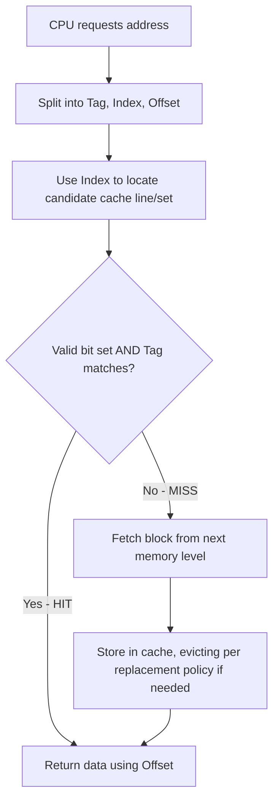
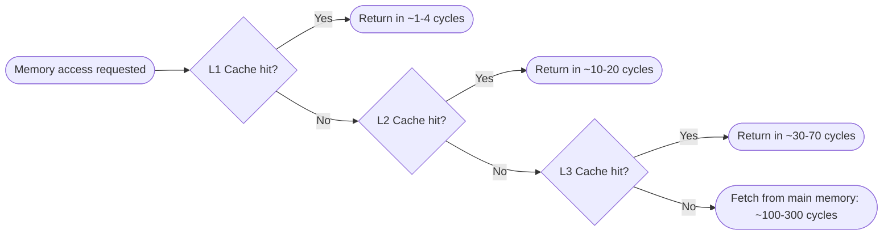

# Cache Memory

> Part of [Phase 04 — Computer Architecture](./README.md)

---

## What is it?

Cache memory is a small, extremely fast layer of memory sitting between the CPU and main memory (see [`Memory.md`](./Memory.md)), automatically storing copies of RECENTLY or FREQUENTLY accessed data — dramatically reducing the average time the CPU spends waiting for data, by exploiting temporal and spatial locality.

## Why do we need it?

As established in [`Memory.md`](./Memory.md), main memory (RAM) access can take hundreds of CPU cycles — during which a multi-billion-cycle-per-second CPU sits essentially idle. Cache exists specifically to close this gap: a small, fast memory that can usually satisfy a memory request in just a handful of cycles, PROVIDED the requested data happens to already be there (a "hit") — and the whole discipline of cache design is about maximizing how often that happens.

## Real-world analogy

Think of cache like the few books you keep on your actual desk while writing a research paper, versus the hundreds of other books in the library. You don't keep EVERY book on your desk (not enough room), so you keep the ones you've used RECENTLY or expect to need again SOON. If you need a book still on your desk, you grab it instantly (a cache HIT). If it's not there, you have to walk to the library shelves (a cache MISS) — much slower, but you then bring that book back to your desk too, in case you need it again soon.

```text
CPU requests data
       |
       v
  Is it in Cache? --YES--> HIT: return quickly (a few cycles)
       |
       NO
       |
       v
  Fetch from main memory (MISS: much slower, ~100+ cycles)
  ALSO store a copy in cache, in case it's needed again soon
```

## Historical background

- The cache concept was introduced in the **IBM System/360 Model 85 (1968)**, one of the first commercial computers to include a dedicated cache memory, specifically to address the growing gap between CPU and main memory speeds even then.
- Through the 1980s-90s, as this CPU-memory speed gap ("the memory wall," see [`Memory.md`](./Memory.md)) continued widening, MULTI-LEVEL cache hierarchies (L1, L2, and eventually L3 cache) became standard in general-purpose CPUs, each level trading some speed for more capacity.
- **Andrew J. Smith's 1982 survey paper**, _"Cache Memories,"_ remains a foundational, comprehensive treatment of cache design principles, many of which remain directly relevant to modern CPU cache design.

## Mathematical foundation

**Level 1 — Explain it to a 15-year-old:**

Imagine you're studying for an exam, and you keep your MOST-USED flashcards in your pocket (super fast to grab), the REST of your flashcards in your backpack (a bit slower to dig out), and any flashcards you don't currently have with you would need a trip back home (very slow). Cache is exactly this "keep the most useful stuff closest" strategy, applied automatically by the computer to memory data.

**Level 2 — Engineering Level:**

A cache is organized into fixed-size **cache lines** (or "blocks"), each holding a small chunk of contiguous memory (exploiting SPATIAL locality — see [`Memory.md`](./Memory.md)). A given memory address maps to a specific cache location using one of three schemes: **direct-mapped** (each address maps to EXACTLY one possible cache line), **fully associative** (any address can go in ANY cache line), or **set-associative** (a middle ground — each address maps to a small SET of possible lines).

**Level 3 — Industry Level:**

Real CPU performance is commonly summarized using **AMAT (Average Memory Access Time)**: `AMAT = Hit Time + (Miss Rate × Miss Penalty)`. Modern multi-level cache hierarchies (L1/L2/L3) extend this recursively — an L1 miss looks in L2, an L2 miss looks in L3, and only an L3 miss finally goes to main memory — with each level's "miss penalty" being the AMAT of the NEXT level down.

**Level 4 — Research Level:**

Research into cache design continues to explore better REPLACEMENT policies (deciding what to EVICT when the cache is full — connecting directly to Phase 5's page replacement algorithms: FIFO, LRU, and their refinements), and research into **cache side-channel attacks** (exploiting measurable TIMING differences between cache hits and misses to infer secret information, like cryptographic keys, from a victim process) represents an active, security-critical area at the intersection of computer architecture and cybersecurity.

## Formal definition

Given a cache with **hit time** `H`, **miss rate** `m` (fraction of accesses that are misses), and **miss penalty** `P` (extra time to service a miss, beyond the hit time), the **Average Memory Access Time** is:

```
AMAT = H + (m × P)
```

For a multi-level cache hierarchy, this recursively extends:

```
AMAT = H₁ + m₁ × (H₂ + m₂ × (H₃ + m₃ × P_main_memory))
```

## Core concepts

- **Cache Line (Block)** — the fixed-size unit of data transferred between cache and main memory
- **Cache Hit / Miss** — whether requested data IS or IS NOT currently present in the cache
- **Hit Rate / Miss Rate** — the fraction of memory accesses that result in a hit / miss, respectively (they sum to 1)
- **Hit Time** — the time to access data already in the cache
- **Miss Penalty** — the ADDITIONAL time required when data is NOT in the cache (must be fetched from a slower level)
- **Direct-Mapped Cache** — each memory address maps to exactly ONE specific cache line
- **Set-Associative Cache** — each memory address maps to a small SET of possible cache lines (a compromise between direct-mapped and fully associative)
- **Fully Associative Cache** — any memory address can be placed in ANY cache line
- **AMAT (Average Memory Access Time)** — the expected average time per memory access, accounting for hit/miss behavior

## Internal working

For a DIRECT-MAPPED cache, a memory address is split into three fields: a **tag** (identifies WHICH specific block of memory is currently stored there), an **index** (determines WHICH cache line this address maps to), and an **offset** (identifies the specific byte WITHIN that cache line). On a memory access, the hardware uses the INDEX to locate the corresponding cache line, compares its stored TAG against the requested address's tag — if they MATCH, it's a hit; if not, it's a miss, and the correct data must be fetched from a lower memory level (evicting whatever was previously in that line).

## Step-by-step explanation

**How a direct-mapped cache handles a memory access, step by step:**

1. Split the requested memory address into TAG, INDEX, and OFFSET fields.
2. Use the INDEX to directly locate the ONE possible cache line this address could occupy.
3. Check the VALID bit for that line — if not valid (never used, or explicitly invalidated), it's automatically a MISS.
4. If valid, compare the line's stored TAG against the requested address's TAG.
5. If they MATCH: it's a HIT — return the requested byte(s), located via the OFFSET, directly from this cache line.
6. If they DON'T match: it's a MISS — fetch the entire containing block from the next memory level, OVERWRITE this cache line with the new block and its tag, then return the requested data.

---

## Worked Examples: AMAT and Cache Mapping Calculations

AMAT and cache-mapping numeric problems are among the most consistently tested question types in GATE/UGC NET Computer Organization papers.

### Worked Example 1 — Basic single-level AMAT calculation

**Given:** a cache has a hit time of 2 cycles, a miss rate of 8%, and a miss penalty of 100 cycles. Compute the AMAT.

```
AMAT = Hit Time + (Miss Rate x Miss Penalty)
     = 2 + (0.08 x 100)
     = 2 + 8
     = 10 cycles

Interpretation: even though 92% of accesses take just 2 cycles,
the RELATIVELY RARE 8% that miss (at 100 cycles each) still
contribute the MAJORITY of the average cost (8 out of 10 total
cycles) - illustrating exactly why minimizing miss rate matters
so disproportionately.
```

### Worked Example 2 — Two-level cache hierarchy AMAT

**Given:** L1 cache: hit time = 1 cycle, miss rate = 10%. L2 cache: hit time = 8 cycles, miss rate = 25% (of L1 misses that reach L2). Main memory access time = 150 cycles. Compute the overall AMAT.

```
Step 1: Compute L2's own local AMAT (as experienced when L1 misses):
AMAT_L2 = HitTime_L2 + (MissRate_L2 x MainMemoryTime)
        = 8 + (0.25 x 150)
        = 8 + 37.5
        = 45.5 cycles

Step 2: Compute overall AMAT, treating AMAT_L2 as L1's "miss penalty":
AMAT_overall = HitTime_L1 + (MissRate_L1 x AMAT_L2)
             = 1 + (0.10 x 45.5)
             = 1 + 4.55
             = 5.55 cycles

This demonstrates precisely why adding an L2 cache helps: WITHOUT it,
an L1 miss would cost the full 150-cycle main memory penalty; WITH
L2 absorbing 75% of those misses (only 25% reach main memory),
the EFFECTIVE penalty for an L1 miss drops to 45.5 cycles instead
of 150 - directly reducing overall AMAT.
```

### Worked Example 3 — Direct-mapped cache address breakdown

**Given:** a direct-mapped cache has 256 lines (blocks), each holding 64 bytes, and the system uses 32-bit addresses. Find the number of bits for the tag, index, and offset fields.

```
Offset bits = log2(block size) = log2(64) = 6 bits
Index bits  = log2(number of lines) = log2(256) = 8 bits
Tag bits    = total address bits - index bits - offset bits
            = 32 - 8 - 6 = 18 bits

Address breakdown: [ 18 bits: Tag | 8 bits: Index | 6 bits: Offset ] = 32 bits total

Verification: 2^8 = 256 lines (matches), 2^6 = 64 bytes per line (matches).
```

### Worked Example 4 — Comparing direct-mapped vs. fully associative behavior (a classic "thrashing" scenario)

**Given:** a direct-mapped cache has 4 lines. A program repeatedly accesses memory blocks 0, 4, 8, 0, 4, 8, ... in a loop, where blocks 0, 4, and 8 all map to the SAME index (index = block number MOD 4 = 0 for all three, since 0 MOD 4=0, 4 MOD 4=0, 8 MOD 4=0). Compare direct-mapped versus fully associative cache behavior for this access pattern.

```
DIRECT-MAPPED (4 lines), access sequence 0,4,8,0,4,8,...:
Access 0: index 0 empty -> MISS, load block 0 into line 0
Access 4: index 0 has block 0 (tag mismatch) -> MISS, EVICT block 0, load block 4
Access 8: index 0 has block 4 (tag mismatch) -> MISS, EVICT block 4, load block 8
Access 0: index 0 has block 8 (tag mismatch) -> MISS, EVICT block 8, load block 0 AGAIN
... EVERY SINGLE ACCESS IS A MISS, despite the cache having 4 lines
    and only needing to hold 3 blocks - this pathological pattern
    is called "cache thrashing due to conflict misses."

FULLY ASSOCIATIVE (4 lines), same access sequence:
Access 0: any empty line -> MISS, load block 0 (line A)
Access 4: any empty line -> MISS, load block 4 (line B)
Access 8: any empty line -> MISS, load block 8 (line C)
Access 0: block 0 is STILL in line A (no forced eviction!) -> HIT!
Access 4: block 4 is STILL in line B -> HIT!
Access 8: block 8 is STILL in line C -> HIT!
... only the FIRST 3 accesses miss; everything after is a HIT.

This dramatic difference (all misses vs. mostly hits, for the
EXACT SAME cache SIZE) is exactly why set-associative caches
(a practical middle ground between direct-mapped's simplicity/speed
and fully-associative's flexibility) are used in most real CPUs -
they significantly reduce this "conflict miss" pathology without
fully associative's higher hardware cost/complexity.
```

---

## Visual diagram



## Architecture diagram

```text
Direct-Mapped Cache address breakdown (from Worked Example 3):

32-bit address:
+--------------------+------------+----------+
|   Tag (18 bits)     | Index (8b) | Offset(6b)|
+--------------------+------------+----------+

Cache structure (256 lines):
Line 0: [Valid][Tag][----- 64 bytes of data -----]
Line 1: [Valid][Tag][----- 64 bytes of data -----]
...
Line 255: [Valid][Tag][----- 64 bytes of data -----]

On access: INDEX picks the line directly (no searching needed);
TAG comparison confirms whether it's the CORRECT block or a
stale/different one occupying that line.
```

## Flowchart



## Example

Illustrate a set-associative cache resolving Worked Example 4's thrashing problem:

```
2-way set-associative cache, 2 sets (4 lines total, 2 lines per set):
Blocks 0, 4, 8 all map to SET 0 (same as before), but now
SET 0 has ROOM FOR 2 blocks simultaneously, not just 1.

Access 0: Set 0 has room -> MISS, load block 0
Access 4: Set 0 has room (1 of 2 slots used) -> MISS, load block 4
Access 8: Set 0 is FULL (2 of 2 slots used) -> MISS, evict ONE
          (e.g., block 0, if using LRU replacement), load block 8
Access 0: block 0 was evicted -> MISS again, evict block 4, reload block 0
Access 4: block 4 was evicted -> MISS again...

Still not perfect (only 2 slots for 3 competing blocks), but
BETTER than fully direct-mapped for many realistic access
patterns - this illustrates why associativity is a TUNABLE
trade-off, not an all-or-nothing choice.
```

## Dry run

Trace AMAT sensitivity to miss rate, using Worked Example 1's hit time (2 cycles) and miss penalty (100 cycles), varying miss rate:

| Miss Rate | AMAT = 2 + (rate × 100) |
| --------- | ----------------------- |
| 10%       | 2 + 10 = 12 cycles      |
| 5%        | 2 + 5 = 7 cycles        |
| 1%        | 2 + 1 = 3 cycles        |
| 0.1%      | 2 + 0.1 = 2.1 cycles    |

This table makes vivid exactly how sensitive AMAT is to miss rate — halving the miss rate roughly halves the miss-related overhead, which is why even small improvements in cache design (better associativity, better replacement policy) can yield measurable, real performance gains.

## Multiple examples

**Example 1 — Compulsory (cold) misses:** the very FIRST access to any given block is ALWAYS a miss, regardless of cache design, since it's never been loaded before — unavoidable, but a one-time cost per block.

**Example 2 — Capacity misses:** even a FULLY ASSOCIATIVE cache will suffer misses if the program's actual WORKING SET (see Phase 5's Virtual Memory chapter) is simply larger than the cache's total capacity — no mapping scheme can fix a cache that's just too small.

**Example 3 — Conflict misses:** exactly the pathology demonstrated in Worked Example 4 — misses caused by the MAPPING SCHEME (direct-mapped or limited-associativity) forcing evictions that a fully associative cache of the SAME size wouldn't have needed.

## Advantages

- Dramatically reduces AMAT compared to accessing main memory for every request, directly improving real-world CPU performance.
- Multi-level cache hierarchies (L1/L2/L3) let designers balance speed (favoring smaller, faster caches) against effective capacity (favoring larger, slower caches).
- Set-associative designs meaningfully reduce conflict misses compared to direct-mapped caches, without the full hardware cost of true fully-associative caches.

## Disadvantages

- Cache behavior is somewhat unpredictable from a pure algorithmic standpoint — the SAME code can perform very differently depending on cache size, associativity, and access pattern (as shown in Worked Example 4).
- Higher associativity improves hit rate but increases hardware complexity, power consumption, and sometimes hit TIME itself (more comparisons needed per access).
- Cache side-channel attacks exploit measurable timing differences between hits and misses to leak sensitive information across process boundaries — a serious, ongoing security concern.

## Complexity

| Cache Type              | Search Cost per Access                                            | Conflict Miss Risk                              |
| ----------------------- | ----------------------------------------------------------------- | ----------------------------------------------- |
| Direct-Mapped           | O(1) — exactly one line to check                                  | Highest                                         |
| Set-Associative (k-way) | O(k) — check k lines in the target set                            | Moderate, decreases as k increases              |
| Fully Associative       | O(n) — must check ALL n lines (usually done in parallel hardware) | Lowest (only capacity/compulsory misses remain) |

## Memory usage

Each cache line requires extra storage BEYOND the actual data: a valid bit, a tag field, and (for set-associative/fully-associative designs) additional bookkeeping for the replacement policy (e.g., LRU tracking) — this overhead is a genuine, non-trivial fraction of a cache's total silicon area, especially for higher-associativity designs.

## Time complexity

The single most important formula in this entire chapter, worth memorizing exactly: **AMAT = Hit Time + (Miss Rate × Miss Penalty)** — and its recursive extension to multi-level hierarchies, exactly as demonstrated in Worked Example 2, where an L2 cache dramatically reduces the EFFECTIVE penalty an L1 miss actually incurs.

## Best practices

- When writing performance-critical code, favor access patterns with strong spatial and temporal locality (e.g., iterate arrays in memory order, reuse recently-touched data before moving on) to maximize real cache hit rates.
- When analyzing or designing a cache, always compute AMAT using the exact formula, and for multi-level hierarchies, work from the INNERMOST level (main memory) outward, exactly as shown in Worked Example 2.
- Understand the THREE causes of cache misses (compulsory, capacity, conflict) since each suggests a DIFFERENT mitigation (compulsory: unavoidable; capacity: need a bigger cache; conflict: need better associativity or a better replacement policy).

## Common mistakes

- Forgetting that AMAT weights the miss penalty by the MISS RATE, not simply adding hit time and miss penalty directly.
- Confusing miss RATE (a fraction, e.g., 0.08) with miss PERCENTAGE (8) — a common unit/scaling error in calculations.
- Assuming a LARGER cache is always strictly better — a larger but poorly-associative cache can still suffer significant conflict misses (as in Worked Example 4), while a smaller but well-associative cache might perform better for certain access patterns.
- Forgetting, in multi-level AMAT calculations, that each level's "miss penalty" is actually the AMAT of the NEXT level down, not simply that next level's raw hit time.

## Interview questions

1. Explain the AMAT formula and compute it for a given hit time, miss rate, and miss penalty.
2. What is the difference between direct-mapped, set-associative, and fully associative caches?
3. Explain the three types of cache misses (compulsory, capacity, conflict) with examples.
4. Given a cache's total size, line size, and associativity, compute the number of tag/index/offset bits.
5. Why might a program suffer from "cache thrashing," and how does associativity help address it?

## University questions

1. Given hit time, miss rate, and miss penalty, compute AMAT for both a single-level and a two-level cache hierarchy.
2. Given a cache configuration (size, line size, associativity, address width), compute the tag, index, and offset bit widths.
3. Explain and illustrate a conflict miss scenario using a direct-mapped cache, and explain how set-associativity mitigates it.
4. Compare the search cost and conflict-miss behavior of direct-mapped, set-associative, and fully associative caches.

## Coding examples

### Pseudocode

```text
FUNCTION computeAMAT(hitTime, missRate, missPenalty):
    RETURN hitTime + (missRate * missPenalty)

FUNCTION computeMultiLevelAMAT(levels, mainMemoryTime):
    // levels: list of (hitTime, missRate), from L1 outward
    effectivePenalty = mainMemoryTime
    FOR level FROM last TO first (i.e., process innermost first):
        effectivePenalty = level.hitTime + (level.missRate * effectivePenalty)
    RETURN effectivePenalty
```

### Python implementation

```python
def compute_amat(hit_time, miss_rate, miss_penalty):
    return hit_time + (miss_rate * miss_penalty)

# Worked Example 1
print(compute_amat(2, 0.08, 100))  # 10.0

def compute_multilevel_amat(levels, main_memory_time):
    # levels: list of (hit_time, miss_rate) from L1 to innermost cache level
    effective_penalty = main_memory_time
    for hit_time, miss_rate in reversed(levels):
        effective_penalty = hit_time + (miss_rate * effective_penalty)
    return effective_penalty

# Worked Example 2: L1=(1, 0.10), L2=(8, 0.25), main memory = 150
amat = compute_multilevel_amat([(1, 0.10), (8, 0.25)], 150)
print(f"{amat:.2f}")  # 5.55
```

### C implementation

```c
#include <stdio.h>

double computeAMAT(double hitTime, double missRate, double missPenalty) {
    return hitTime + (missRate * missPenalty);
}

int main() {
    // Worked Example 1
    printf("AMAT (single level): %.2f cycles\n", computeAMAT(2, 0.08, 100));  // 10.00

    // Worked Example 2 (computed manually via nested calls)
    double amatL2 = computeAMAT(8, 0.25, 150);         // 45.5
    double amatOverall = computeAMAT(1, 0.10, amatL2); // 5.55
    printf("AMAT (two-level): %.2f cycles\n", amatOverall);
    return 0;
}
```

### C++ implementation

```cpp
#include <iostream>
#include <vector>
using namespace std;

double computeAMAT(double hitTime, double missRate, double missPenalty) {
    return hitTime + (missRate * missPenalty);
}

double computeMultiLevelAMAT(vector<pair<double,double>>& levels, double mainMemoryTime) {
    double effectivePenalty = mainMemoryTime;
    for (auto it = levels.rbegin(); it != levels.rend(); ++it) {
        effectivePenalty = computeAMAT(it->first, it->second, effectivePenalty);
    }
    return effectivePenalty;
}

int main() {
    cout << "AMAT (single level): " << computeAMAT(2, 0.08, 100) << endl;  // 10

    vector<pair<double,double>> levels = {{1, 0.10}, {8, 0.25}};
    cout << "AMAT (two-level): " << computeMultiLevelAMAT(levels, 150) << endl;  // 5.55
}
```

### Java implementation

```java
import java.util.*;

public class CacheDemo {
    static double computeAMAT(double hitTime, double missRate, double missPenalty) {
        return hitTime + (missRate * missPenalty);
    }

    static double computeMultiLevelAMAT(List<double[]> levels, double mainMemoryTime) {
        double effectivePenalty = mainMemoryTime;
        for (int i = levels.size() - 1; i >= 0; i--) {
            double[] level = levels.get(i);
            effectivePenalty = computeAMAT(level[0], level[1], effectivePenalty);
        }
        return effectivePenalty;
    }

    public static void main(String[] args) {
        System.out.println("AMAT (single level): " + computeAMAT(2, 0.08, 100));  // 10.0

        List<double[]> levels = List.of(new double[]{1, 0.10}, new double[]{8, 0.25});
        System.out.println("AMAT (two-level): " + computeMultiLevelAMAT(levels, 150));  // 5.55
    }
}
```

## Visualization

```text
AMAT breakdown for Worked Example 1 (hit time=2, miss rate=8%, penalty=100):

Total AMAT = 10 cycles
  |-- Hit Time contribution:        2 cycles (20% of total)
  |-- Miss contribution (0.08x100): 8 cycles (80% of total)

Despite misses being RARE (only 8% of accesses),
they dominate the AVERAGE cost - the core lesson
of why cache miss rate optimization matters so much.
```

## Industry use

- **Every modern CPU** implements a multi-level cache hierarchy (L1/L2/L3) as a standard, essential performance feature.
- **CPU benchmarking and marketing** frequently cites cache sizes and associativity as key performance differentiators between chip models.
- **High-performance software engineering** (game engines, databases, scientific computing) routinely profiles and optimizes for cache behavior explicitly, often achieving larger real-world speedups than algorithmic Big-O improvements alone.
- **Security researchers** actively study cache side-channel attacks (like Spectre-adjacent techniques) that exploit cache timing differences to leak sensitive data.

## Research relevance

Research into cache REPLACEMENT policies continues to refine beyond simple LRU (Least Recently Used, see Phase 5's [`Memory-Management.md`](../05-Operating-Systems/Memory-Management.md) for the general algorithm), exploring machine-learning-informed and access-pattern-aware policies for modern workloads. Research into **cache side-channel security** remains an active, critical area, exploring both new attack techniques and hardware/software mitigations that don't sacrifice cache's substantial performance benefits.

## Related concepts

- Memory (the broader hierarchy cache is the fast intermediate layer within — see [`Memory.md`](./Memory.md))
- CPU (cache directly determines real-world CPI/performance beyond the idealized CPU Performance Equation — see [`CPU.md`](./CPU.md))
- Page Replacement Algorithms, Phase 5 (FIFO/LRU/Optimal — the SAME conceptual problem as cache line replacement, applied to memory pages instead of cache lines — see [`Memory-Management.md`](../05-Operating-Systems/Memory-Management.md))
- Arrays vs. Linked Lists, Phase 2 (a direct, practical illustration of why cache-friendly (array) access patterns outperform cache-unfriendly (linked list) ones)

## Practice problems

1. Given a hit time of 1 cycle, miss rate of 5%, and miss penalty of 120 cycles, compute the AMAT.
2. Given a 3-level cache hierarchy with specified hit times and miss rates at each level, plus a main memory access time, compute the overall AMAT.
3. Given a cache with 512 lines of 32 bytes each and 32-bit addresses, compute the tag, index, and offset bit widths for a direct-mapped design.
4. Design an access pattern that causes severe conflict misses in a direct-mapped cache but performs well in a 2-way set-associative cache of the same total size.

## Advanced concepts

- **Write Policies (Write-Through vs. Write-Back)** — determining WHEN a cache write is propagated to the next memory level: immediately (write-through, simpler but more memory traffic) or only when the line is evicted (write-back, more complex but less memory traffic).
- **Cache Coherence** — in multi-core systems, ensuring that all cores see a CONSISTENT view of memory despite each having its own private cache — a significant, actively-researched challenge in multi-core CPU design.
- **Cache Side-Channel Attacks** — exploiting measurable timing differences between cache hits and misses to infer secret information (like cryptographic keys) from a victim process's memory access patterns.

## Summary

Cache memory bridges the enormous CPU-memory speed gap by keeping small, recently/frequently-used subsets of data extremely close to the CPU, exploiting temporal and spatial locality. The AMAT formula — `Hit Time + (Miss Rate × Miss Penalty)` — precisely quantifies cache effectiveness, and cache mapping schemes (direct-mapped, set-associative, fully associative) represent a fundamental trade-off between hardware simplicity/speed and resistance to conflict misses, as vividly demonstrated by the thrashing scenario in this chapter's worked examples.

## Key takeaways

- AMAT = Hit Time + (Miss Rate × Miss Penalty) — memorize this exact formula, and its recursive extension to multi-level hierarchies.
- Direct-mapped caches are fast and simple but prone to conflict misses; fully associative caches minimize conflict misses but are expensive; set-associative caches are the practical middle ground used in most real CPUs.
- The three causes of cache misses are compulsory (unavoidable, first access), capacity (cache too small for the working set), and conflict (mapping scheme forces unnecessary evictions).
- Cache-aware algorithm and data structure design can produce dramatic real-world performance differences invisible to Big-O analysis alone.
- Cache timing differences (hit vs. miss) can be exploited as a security side-channel, an active area of both attack and defense research.

## References

- Smith, A.J. (1982). _Cache Memories_.
- Patterson, D., Hennessy, J. _Computer Organization and Design_, Chapter 5.
- Hennessy, J., Patterson, D. _Computer Architecture: A Quantitative Approach_, Chapter 2.

---

⬅ Back to [Phase 04 — Computer Architecture README](./README.md)

---
