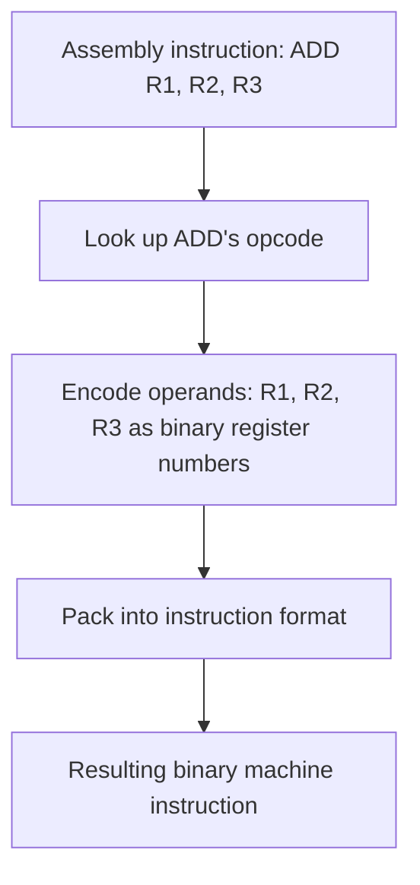

# Instruction Set Architecture (ISA)

> Part of [Phase 04 — Computer Architecture](./README.md)

---

## What is it?

An Instruction Set Architecture (ISA) is the complete VOCABULARY of operations a CPU understands — every addition, comparison, memory load, and jump the hardware is capable of executing — forming the precise CONTRACT between hardware and software: anything compiled for a given ISA will run correctly on any CPU implementing that same ISA, regardless of the underlying physical design.

## Why do we need it?

Software needs a STABLE target to compile against, and hardware designers need FREEDOM to improve the internal implementation (faster circuits, better pipelining, more cache) without breaking every program ever written for that CPU family. The ISA is the abstraction boundary that makes both possible simultaneously — it's WHY a program compiled for x86 in 2010 still runs correctly on a brand-new x86 CPU today, even though the internal hardware has changed dramatically.

## Real-world analogy

Think of an ISA like the standard layout of a car's pedals and steering wheel. Whether you're driving a 1990s sedan or a brand-new electric car, the STEERING WHEEL turns the car, the BRAKE pedal slows it down, the ACCELERATOR speeds it up — the "interface" is standardized, even though the actual mechanisms underneath (mechanical linkages vs. electronic drive-by-wire) are completely different. Software is like a driver who only needs to know the STANDARD interface, not the specific engineering underneath.

```text
Software's view:      "ADD R1, R2, R3" means "add R2 and R3, store in R1"
                       (this MEANING never changes across CPU generations)

Hardware's view:      HOW this addition is physically computed (circuit design,
                       pipelining depth, etc.) can change dramatically between
                       CPU generations, invisibly to software
```

## Historical background

- Early computers each had a completely UNIQUE, incompatible instruction set — software written for one machine simply couldn't run on another.
- **IBM's System/360 (1964)** was revolutionary specifically because it introduced a SINGLE, unified ISA across an entire FAMILY of computers with vastly different price points and performance levels — establishing the principle that hardware and software could evolve somewhat independently.
- The **RISC vs. CISC debate** emerged prominently in the early 1980s: researchers **David Patterson and Carlo Sequin** (Berkeley) and **John Hennessy** (Stanford) argued that SIMPLER instruction sets (RISC) could be implemented more efficiently in hardware (especially for pipelining) than the increasingly complex instruction sets (CISC) exemplified by Intel's x86 and DEC's VAX architectures of that era.
- Today's landscape reflects a partial CONVERGENCE: x86 (CISC in its instruction set) internally translates complex instructions into simpler, RISC-like "micro-operations" for execution, while ARM (a RISC architecture) has become dominant in mobile and increasingly competitive in high-performance computing (Apple Silicon).

## Mathematical foundation

**Level 1 — Explain it to a 15-year-old:**

Imagine two toolboxes: one has just a hammer, a screwdriver, and a wrench (simple, general-purpose tools you combine to do complex jobs); the other has dozens of highly specialized single-purpose tools (each doing one complex job directly, but the toolbox itself is heavier and more complicated to manufacture). RISC is like the first toolbox — simple tools, more steps needed per job, but each tool is easy and fast to make well. CISC is like the second — fewer steps per job, but each tool is more complex to build efficiently.

**Level 2 — Engineering Level:**

**RISC (Reduced Instruction Set Computer)** uses a small set of SIMPLE, fixed-length instructions, each typically executing in one clock cycle, with a strict "load-store" design (only specific `LOAD`/`STORE` instructions can access memory; all arithmetic operates on REGISTERS only). **CISC (Complex Instruction Set Computer)** uses a larger set of more POWERFUL, variable-length instructions, some of which can directly perform complex operations (like a single instruction that loads from memory, performs arithmetic, AND stores the result) — trading instruction COUNT for instruction COMPLEXITY.

**Level 3 — Industry Level:**

Modern x86 CPUs (Intel, AMD) are CISC at the software-visible ISA level, but internally DECODE complex x86 instructions into simpler, RISC-like micro-operations that the actual execution hardware (pipeline, out-of-order engine) processes — meaning the RISC-vs-CISC distinction has become less about raw hardware efficiency and more about instruction ENCODING and software compatibility. ARM's RISC design, with its simpler decode logic and historically lower power consumption, has become dominant in battery-constrained mobile devices, and Apple's M-series chips have demonstrated ARM's viability even for high-performance laptop/desktop computing.

**Level 4 — Research Level:**

Research into ISA design continues with efforts like **RISC-V**, a completely OPEN-SOURCE, royalty-free ISA (unlike proprietary x86 or ARM), enabling academic research, custom chip design, and specialized hardware accelerators without licensing costs or restrictions — an active and increasingly commercially significant development in computer architecture.

## Formal definition

An ISA formally specifies: the set of available INSTRUCTIONS (each with a defined opcode, operands, and semantics), the available REGISTERS (their count, size, and purpose), the supported DATA TYPES, the ADDRESSING MODES (ways to specify a memory location), and the INSTRUCTION FORMAT (how instructions are encoded as binary).

## Core concepts

- **Opcode** — the portion of an instruction specifying WHICH operation to perform
- **Operand** — the values or locations (registers, memory addresses, immediate constants) an instruction operates on
- **Addressing Mode** — the method used to specify an operand's location (immediate, register, direct, indirect, indexed)
- **RISC (Reduced Instruction Set Computer)** — simple, fixed-length, single-cycle instructions; load-store architecture
- **CISC (Complex Instruction Set Computer)** — richer, variable-length instructions, some directly accessing memory during arithmetic operations
- **Instruction Format** — the specific binary layout of an instruction (which bits represent the opcode, which represent operands)

## Internal working

When a CPU decodes an instruction, it examines the OPCODE field to determine which operation to perform, then extracts the OPERAND fields according to that instruction's specific FORMAT — different instruction TYPES (arithmetic, memory access, branch) often use different formats, since they need different combinations of register/address/immediate information encoded into the same fixed (RISC) or variable (CISC) number of bits.

## Step-by-step explanation

**How an assembler translates assembly code into machine code (binary instructions), step by step:**

1. Parse the assembly instruction's MNEMONIC (e.g., `ADD`) to determine the corresponding OPCODE.
2. Parse the instruction's OPERANDS (e.g., register names `R1, R2, R3`) and convert each to its binary register number.
3. Determine the appropriate INSTRUCTION FORMAT for this opcode (e.g., a 3-register arithmetic format vs. a memory-access format with an address offset).
4. Pack the opcode and operand fields into their designated BIT POSITIONS within the fixed (RISC) or variable-length (CISC) instruction word.
5. Output the resulting binary instruction, ready to be loaded into memory and later fetched and executed by the CPU.

## Visual diagram



## Architecture diagram

```text
Example RISC-style instruction format (simplified, 32-bit, R-type):

|  Opcode  |  Rs (source 1) |  Rt (source 2) |  Rd (destination) |  unused  |
|  6 bits  |     5 bits      |     5 bits      |      5 bits        | 11 bits |

Example CISC-style instruction (x86-like, variable length):

| Prefix(es) | Opcode | ModR/M | SIB | Displacement | Immediate |
| 0-4 bytes  | 1-3B   | 0-1B   | 0-1B|   0-4 bytes   | 0-4 bytes |

RISC: every instruction is the SAME fixed length -> simple, fast decode
CISC: instructions VARY in length -> more compact code, but more complex decode
```

## Flowchart


## Example

Compare how the SAME high-level operation (`C = A + B`, where A and B are in memory) might be expressed differently under RISC vs. CISC:

```
RISC (load-store architecture, multiple simple instructions):
    LOAD  R1, A       ; load A from memory into register R1
    LOAD  R2, B       ; load B from memory into register R2
    ADD   R3, R1, R2  ; R3 = R1 + R2 (registers only)
    STORE R3, C       ; store R3 back to memory location C

CISC (a single, more powerful instruction, e.g., x86-style):
    ADD  C, A, B      ; a SINGLE instruction directly reads A and B
                       ; from memory, adds them, and stores to C

RISC needs 4 simple instructions; CISC could do it in 1 complex instruction -
this exact trade-off (instruction COUNT vs instruction COMPLEXITY)
is the heart of the RISC vs CISC design philosophy difference.
```

## Dry run

Trace decoding a hypothetical 16-bit RISC instruction `0001 010 011 100000`:

| Bit Field           | Value  | Meaning                 |
| ------------------- | ------ | ----------------------- |
| Opcode (bits 15-12) | `0001` | ADD operation           |
| Rd (bits 11-9)      | `010`  | Destination register R2 |
| Rs (bits 8-6)       | `011`  | Source register R3      |
| Rt (bits 5-3)       | `100`  | Source register R4      |
| Unused (bits 2-0)   | `000`  | Padding/reserved        |

Decoded instruction: `ADD R2, R3, R4` (meaning R2 = R3 + R4)

## Multiple examples

**Example 1 — Immediate addressing:** `ADD R1, R2, #5` — the operand `5` is encoded DIRECTLY in the instruction itself (an "immediate" value), no memory or register lookup needed for that operand.

**Example 2 — Register addressing:** `ADD R1, R2, R3` — all operands are REGISTERS, the fastest possible operand access (no memory access needed at all).

**Example 3 — Indirect addressing:** `LOAD R1, (R2)` — the VALUE in register R2 is itself treated as a MEMORY ADDRESS, and the value AT that address is loaded into R1 — useful for pointer-based data structures (directly connecting to Phase 2's Linked Lists and Trees, which rely on exactly this addressing pattern).

## Advantages

**RISC advantages:**

- Simple, fixed-length instructions are easier to pipeline efficiently (see [`Pipeline.md`](./Pipeline.md)) and decode quickly.
- Generally lower power consumption, a major reason RISC (ARM) dominates mobile/battery-powered devices.

**CISC advantages:**

- More compact code (fewer, more powerful instructions can mean smaller overall program size), historically valuable when memory was expensive and scarce.
- Can directly map more naturally onto certain high-level language constructs, potentially simplifying compiler design for those cases.

## Disadvantages

**RISC disadvantages:**

- Requires MORE instructions to accomplish the same high-level task, which can mean larger compiled program size.

**CISC disadvantages:**

- Variable-length, complex instructions are harder to pipeline and decode efficiently.
- Modern CISC CPUs must expend extra hardware effort (and power) to internally translate complex instructions into simpler micro-operations for efficient execution.

## Complexity

| Aspect                     | RISC                             | CISC                                             |
| -------------------------- | -------------------------------- | ------------------------------------------------ |
| Instruction length         | Fixed                            | Variable                                         |
| Instructions per operation | More                             | Fewer                                            |
| Decode complexity          | Simple                           | Complex                                          |
| Typical CPI                | Close to 1 (simple instructions) | Variable, can be higher for complex instructions |
| Memory access              | Only via explicit LOAD/STORE     | Can be embedded within arithmetic instructions   |

## Memory usage

CISC's more compact, variable-length instruction encoding can result in SMALLER compiled program size compared to RISC's fixed-length instructions for the same logical program — though modern memory abundance has made this historical advantage far less significant than it once was.

## Time complexity

The core practical lesson, connecting directly to [`CPU.md`](./CPU.md)'s Performance Equation: **RISC tends to REDUCE CPI (simpler instructions execute faster and pipeline better) while potentially INCREASING instruction count; CISC tends to REDUCE instruction count while potentially increasing average CPI** — the RISC vs. CISC debate is fundamentally a debate about where to make this exact trade-off.

## Best practices

- When designing or choosing an ISA (or evaluating one for a specific application), consider the FULL performance equation (instruction count AND CPI), not just instruction "power" or count in isolation.
- Understand that modern CISC processors (x86) achieve competitive performance specifically by internally adopting RISC-like execution principles (micro-operations), showing the two philosophies have partially converged in practice.
- For embedded/power-constrained applications, RISC architectures (ARM) are typically the industry-default choice given their power efficiency advantages.

## Common mistakes

- Assuming RISC and CISC are still as sharply distinct in PRACTICE today as they were philosophically in the 1980s — modern implementations of both have converged significantly at the microarchitectural level.
- Confusing an ISA (the software-visible instruction vocabulary) with the MICROARCHITECTURE (the actual internal hardware implementation) — these are related but distinct concepts (the SAME ISA can have many different microarchitectural implementations).
- Assuming fewer, more powerful instructions (CISC) always means better performance — it depends on the resulting CPI and how efficiently those complex instructions can actually be implemented in hardware.

## Interview questions

1. Explain the key differences between RISC and CISC architectures.
2. Why do RISC architectures typically pipeline more efficiently than CISC architectures?
3. What is an addressing mode, and give three examples with use cases.
4. Why might a modern x86 (CISC) CPU internally use RISC-like micro-operations?
5. What is RISC-V, and why is its open-source nature significant?

## University questions

1. Compare RISC and CISC design philosophies, including at least three distinguishing characteristics each.
2. Explain immediate, register, direct, and indirect addressing modes with examples.
3. Given a fixed instruction format, decode a binary instruction into its opcode and operands.
4. Explain why the same high-level operation might require more instructions under RISC than CISC, using a concrete example.

## Coding examples

### Pseudocode

```text
FUNCTION decodeInstruction(binaryInstruction, format):
    opcode = extractBits(binaryInstruction, format.opcodeRange)
    operands = []
    FOR each field IN format.operandFields:
        operands.append(extractBits(binaryInstruction, field.range))
    RETURN (opcode, operands)
```

### Python implementation

```python
def extract_bits(instruction, start, length):
    mask = (1 << length) - 1
    return (instruction >> start) & mask

def decode_r_type(instruction):
    opcode = extract_bits(instruction, 26, 6)
    rs = extract_bits(instruction, 21, 5)
    rt = extract_bits(instruction, 16, 5)
    rd = extract_bits(instruction, 11, 5)
    return {"opcode": opcode, "rs": rs, "rt": rt, "rd": rd}

# Example: encode ADD R2, R3, R4 (fictional opcode=1) as a 32-bit instruction, then decode it
instruction = (1 << 26) | (3 << 21) | (4 << 16) | (2 << 11)
decoded = decode_r_type(instruction)
print(decoded)  # {'opcode': 1, 'rs': 3, 'rt': 4, 'rd': 2}
```

### C implementation

```c
#include <stdio.h>

unsigned int extractBits(unsigned int instruction, int start, int length) {
    unsigned int mask = (1 << length) - 1;
    return (instruction >> start) & mask;
}

int main() {
    unsigned int instruction = (1 << 26) | (3 << 21) | (4 << 16) | (2 << 11);

    printf("Opcode: %u\n", extractBits(instruction, 26, 6));  // 1
    printf("Rs: %u\n", extractBits(instruction, 21, 5));      // 3
    printf("Rt: %u\n", extractBits(instruction, 16, 5));      // 4
    printf("Rd: %u\n", extractBits(instruction, 11, 5));      // 2
    return 0;
}
```

### C++ implementation

```cpp
#include <iostream>
using namespace std;

unsigned int extractBits(unsigned int instruction, int start, int length) {
    unsigned int mask = (1u << length) - 1;
    return (instruction >> start) & mask;
}

int main() {
    unsigned int instruction = (1u << 26) | (3u << 21) | (4u << 16) | (2u << 11);

    cout << "Opcode: " << extractBits(instruction, 26, 6) << endl;  // 1
    cout << "Rs: " << extractBits(instruction, 21, 5) << endl;      // 3
    cout << "Rt: " << extractBits(instruction, 16, 5) << endl;      // 4
    cout << "Rd: " << extractBits(instruction, 11, 5) << endl;      // 2
}
```

### Java implementation

```java
public class InstructionSetDemo {
    static int extractBits(int instruction, int start, int length) {
        int mask = (1 << length) - 1;
        return (instruction >> start) & mask;
    }

    public static void main(String[] args) {
        int instruction = (1 << 26) | (3 << 21) | (4 << 16) | (2 << 11);

        System.out.println("Opcode: " + extractBits(instruction, 26, 6));  // 1
        System.out.println("Rs: " + extractBits(instruction, 21, 5));      // 3
        System.out.println("Rt: " + extractBits(instruction, 16, 5));      // 4
        System.out.println("Rd: " + extractBits(instruction, 11, 5));      // 2
    }
}
```

## Visualization

```text
Same operation (C = A + B, memory-resident), instruction count comparison:

RISC:  [LOAD][LOAD][ADD][STORE]      <- 4 simple instructions
CISC:  [ADD C, A, B]                  <- 1 complex instruction

RISC instructions are simpler and typically execute in fewer cycles EACH,
but there are MORE of them - the actual total time depends on
both instruction count AND per-instruction cost (CPI), exactly as
established in CPU.md's Performance Equation.
```

## Industry use

- **ARM** (RISC) dominates mobile devices (virtually all smartphones) and has become increasingly competitive in laptops/desktops (Apple Silicon) and servers, driven by power efficiency.
- **x86/x86-64** (CISC at the ISA level) remains dominant in traditional desktop, laptop, and server markets (Intel, AMD), though internally implemented using RISC-like micro-operations.
- **RISC-V** is gaining significant traction as a free, open-source ISA for custom silicon, academic research, and specialized accelerators, unconstrained by licensing costs.
- **Compiler teams** must generate ISA-specific machine code, making ISA knowledge directly essential to compiler engineering.

## Research relevance

Research into **RISC-V** as an open, extensible ISA continues to drive innovation in custom accelerator design (since companies can freely extend the ISA for specialized hardware, like AI accelerators, without licensing restrictions), and ongoing research into ISA design more broadly explores how to best balance code density, decode simplicity, and power efficiency for emerging workloads (AI/ML acceleration, edge computing).

## Related concepts

- CPU (the hardware that IMPLEMENTS a given ISA — see [`CPU.md`](./CPU.md))
- Pipeline (RISC's simple, fixed-length instructions are specifically easier to pipeline efficiently — see [`Pipeline.md`](./Pipeline.md))
- Memory (addressing modes directly determine how instructions reference memory — see [`Memory.md`](./Memory.md))
- Mathematics, Phase 1 (binary number representation underlies all instruction encoding)

## Practice problems

1. Given a high-level operation like `D = (A + B) * C`, write out the equivalent RISC-style assembly (load-store architecture) instruction sequence.
2. Design a simple 16-bit instruction format supporting an opcode, two source registers, and one destination register, and encode a sample instruction.
3. Explain, with an example, the difference between direct and indirect addressing modes.
4. Research and explain one specific way RISC-V's openness has enabled a real-world hardware innovation.

## Advanced concepts

- **Micro-operations (micro-ops)** — the simpler, RISC-like internal instructions that modern CISC CPUs (x86) decode their complex instructions into for actual execution.
- **VLIW (Very Long Instruction Word)** — an alternative ISA philosophy packing MULTIPLE independent operations into a single very wide instruction, relying on the COMPILER (rather than hardware) to identify parallelism.
- **RISC-V Extensions** — RISC-V's modular design allows optional instruction set EXTENSIONS (e.g., for vector processing, atomic operations) to be added without bloating the base ISA for simpler implementations.

## Summary

The Instruction Set Architecture is the precise contract between hardware and software, defining every operation a CPU can perform. The historical RISC vs. CISC debate — simple, numerous instructions vs. complex, fewer instructions — has partially converged in modern implementations (CISC CPUs internally using RISC-like micro-operations), but the underlying trade-off (instruction count vs. instruction complexity, directly feeding into the CPU Performance Equation) remains a foundational concept in computer architecture.

## Key takeaways

- An ISA is the stable, software-visible contract defining a CPU's instruction vocabulary, independent of the underlying hardware implementation.
- RISC uses simple, fixed-length, single-cycle instructions with a strict load-store design; CISC uses richer, variable-length instructions that can directly access memory during arithmetic.
- Modern CISC CPUs (x86) internally translate complex instructions into simpler, RISC-like micro-operations — the two philosophies have significantly converged in practice.
- Addressing modes (immediate, register, direct, indirect) determine how an instruction specifies where its operands actually are.
- RISC-V's open-source nature is driving significant innovation in custom silicon design, free from licensing constraints.

## References

- Patterson, D., Ditzel, D. (1980). _The Case for the Reduced Instruction Set Computer_.
- Patterson, D., Hennessy, J. _Computer Organization and Design_, Chapter 2.
- RISC-V Foundation, official ISA specification.

---

⬅ Back to [Phase 04 — Computer Architecture README](./README.md)
 
