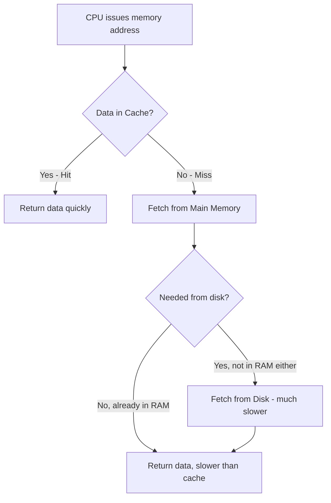
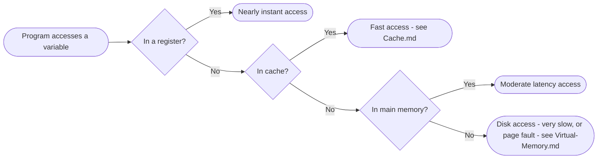

# Memory Systems

> Part of [Phase 04 — Computer Architecture](./README.md)

---

## What is it?

Memory is where a computer stores both the INSTRUCTIONS a program consists of and the DATA it operates on — organized not as a single uniform storage type, but as a **hierarchy** of progressively larger, slower, and cheaper storage layers (registers, cache, main memory, disk), each trading capacity for speed.

## Why do we need it?

A CPU (see [`CPU.md`](./CPU.md)) can compute billions of operations per second, but this speed is USELESS if it constantly waits for data to arrive from storage. Ideally, we'd want memory that is simultaneously huge, instantly fast, and cheap — but physics and economics make this combination impossible. The memory hierarchy is the practical engineering compromise: use a SMALL amount of extremely fast (and expensive) storage close to the CPU, backed by progressively larger, slower, and cheaper storage further away.

## Real-world analogy

Think of the memory hierarchy like your own workspace habits. The papers on your DESK (registers) are instantly accessible but few in number. Papers in a drawer BESIDE your desk (cache) take a moment longer to reach but hold much more. Papers in a filing cabinet ACROSS the room (main memory/RAM) take even longer but hold vastly more. And documents in an off-site STORAGE UNIT (disk) take the longest to retrieve but can hold nearly unlimited amounts. You naturally keep your MOST frequently needed papers closest, exactly mirroring how the memory hierarchy is managed.

```text
Registers (few, instant)      <- inside the CPU itself
    |
Cache (small, very fast)       <- see Cache.md
    |
Main Memory / RAM (large, fast) <- typical working memory
    |
Disk / SSD (huge, slower)       <- persistent storage
```

## Historical background

- **John von Neumann's 1945 stored-program concept** established the foundational idea of a single addressable memory holding both instructions and data.
- Early computers used various now-obsolete memory technologies (mercury delay lines, magnetic core memory) before the development of **semiconductor RAM** in the late 1960s-70s, which dramatically improved speed, density, and cost.
- The MEMORY HIERARCHY concept — using progressively faster, smaller, more expensive storage closer to the CPU — emerged as CPU speeds began outpacing main memory speeds through the 1980s-90s, directly motivating dedicated CACHE memory (see [`Cache.md`](./Cache.md)) as an essential intermediate layer.
- This CPU-memory speed gap (sometimes called the "memory wall") has only widened over subsequent decades, making the memory hierarchy's design an increasingly critical determinant of real-world computer performance.

## Mathematical foundation

**Level 1 — Explain it to a 15-year-old:**

Imagine your phone's contacts: the few people you text CONSTANTLY are practically memorized (registers). Your "recent contacts" list is one tap away (cache). Your full contacts list needs a bit of scrolling (main memory). And old messages you've archived to the cloud take the longest to retrieve (disk). You don't store EVERYTHING with the same speed/access trade-off — you naturally organize by how OFTEN you need something, exactly like the memory hierarchy.

**Level 2 — Engineering Level:**

Memory is organized as a linear array of ADDRESSABLE BYTES (or words), where the CPU specifies a numerical ADDRESS to read from or write to. The memory hierarchy exploits two empirical patterns in real program behavior: **temporal locality** (recently accessed data is likely to be accessed again soon) and **spatial locality** (data near a recently accessed address is likely to be accessed soon too) — both of which justify keeping small, recently/nearby-used subsets of data in faster memory layers.

**Level 3 — Industry Level:**

Real systems also use **memory-mapped I/O**, where certain memory ADDRESSES don't correspond to actual RAM at all, but instead to device REGISTERS (for a graphics card, network interface, etc.) — reading or writing to these addresses directly communicates with hardware, letting device drivers use ordinary load/store instructions instead of needing entirely separate I/O instructions. **Virtual memory** (covered in depth in Phase 5's [`Virtual-Memory.md`](../05-Operating-Systems/Virtual-Memory.md)) adds yet another layer of indirection, letting the OS present each process with the illusion of a large, private, contiguous address space regardless of physical memory's actual layout.

**Level 4 — Research Level:**

Research into new memory technologies (like **persistent/non-volatile memory**, which retains data without power while offering speeds much closer to RAM than traditional disk) explores reshaping the classical memory hierarchy entirely — blurring the traditionally sharp line between "fast, volatile RAM" and "slow, persistent disk storage," with significant implications for both hardware and operating system design (directly connecting to ongoing research mentioned in Phase 5's Virtual Memory and File System chapters).

## Formal definition

Memory is modeled as a function `M: Address → Value`, where an `n`-bit address space can address `2ⁿ` distinct locations. The **memory hierarchy** is characterized, at each level `i`, by its capacity `Cᵢ`, access time `Tᵢ`, and cost per byte `$ᵢ`, with the defining property that `C₀ < C₁ < C₂ < ...` (capacity increases) while `T₀ < T₁ < T₂ < ...` (access time also increases) moving AWAY from the CPU.

## Core concepts

- **Address** — a numerical identifier specifying a particular memory location
- **Word** — the natural unit of data a CPU operates on at once (e.g., 32 bits or 64 bits)
- **Temporal Locality** — recently accessed memory is likely to be accessed again soon
- **Spatial Locality** — memory NEAR a recently accessed address is likely to be accessed soon too
- **Memory Hierarchy** — the layered organization of registers, cache, main memory, and disk, trading capacity for speed
- **Memory-Mapped I/O** — using ordinary memory addresses to communicate with hardware devices
- **RAM (Random Access Memory)** — memory where any address can be accessed in roughly constant time, regardless of location (as opposed to older sequential-access storage)

## Internal working

When a CPU issues a memory READ, it places the desired ADDRESS on the memory bus; the memory system decodes this address to select the specific storage cell(s), and returns the stored VALUE back over the data bus — for a WRITE, the CPU additionally places the value to be stored on the data bus, and the memory system updates the addressed location accordingly. The exact same interface (address in, data in/out) is used regardless of which hierarchy LEVEL actually services the request, though the LATENCY varies enormously (see [`Cache.md`](./Cache.md) for exactly how much).

## Step-by-step explanation

**How temporal and spatial locality justify the memory hierarchy's design, step by step:**

1. Observe empirically that real programs exhibit TEMPORAL locality: a loop's body, executed many times, repeatedly accesses the SAME instructions and often the same variables.
2. Observe that real programs ALSO exhibit SPATIAL locality: array processing accesses CONSECUTIVE memory addresses; instructions themselves are typically fetched sequentially.
3. Because of these two patterns, a SMALL, fast memory (cache) holding only recently/nearby-accessed data can satisfy the VAST MAJORITY of memory accesses, even though it's far smaller than main memory.
4. This justifies the ENTIRE hierarchy's economic design: pay for a small amount of very expensive, very fast memory (satisfying most accesses), backed by progressively larger, cheaper, slower memory for the remainder.
5. The specific mechanics of exploiting this — deciding what to cache, and how — are the subject of [`Cache.md`](./Cache.md).

## Visual diagram



## Architecture diagram

```text
The Memory Hierarchy Pyramid:

                /\
               /  \      Registers    (bytes, ~0 delay)
              /----\
             /      \    Cache (L1/L2/L3)  (KB to MB, ~1-20 cycles)
            /--------\
           /          \  Main Memory (RAM)  (GB, ~100-300 cycles)
          /------------\
         /              \ Disk / SSD  (TB, ~10,000-1,000,000+ cycles)
        /----------------\

Moving DOWN the pyramid: capacity increases, speed decreases,
cost per byte decreases.
```

## Flowchart



## Example

Illustrate spatial locality with array traversal:

```
int arr[1000];
for (int i = 0; i < 1000; i++) {
    sum += arr[i];
}

Each array element is stored at a CONSECUTIVE memory address.
When arr[0] is accessed, the memory system (exploiting spatial
locality) typically loads an entire CACHE LINE (e.g., 64 bytes,
covering arr[0] through arr[15] for 4-byte integers) - meaning
arr[1] through arr[15] are ALREADY in the fast cache by the
time the loop reaches them, even though only arr[0] was
explicitly requested.

This is EXACTLY why array traversal in memory order is
so much faster in practice than accessing the same data
in a scattered, random order.
```

## Dry run

Trace which memory hierarchy level services a sequence of accesses, illustrating temporal locality:

| Step | Access                                                               | Likely Serviced By       | Reason                                                          |
| ---- | -------------------------------------------------------------------- | ------------------------ | --------------------------------------------------------------- |
| 1    | Variable `x` (first access)                                          | Main Memory              | Not yet cached                                                  |
| 2    | Variable `x` (accessed again, moments later)                         | Cache                    | Temporal locality — recently used, now cached                   |
| 3    | Variable `y`, stored right next to `x`                               | Cache                    | Spatial locality — likely loaded in the same cache line as `x`  |
| 4    | Variable `x` (accessed again, much later, after many OTHER accesses) | Main Memory (cache miss) | May have been evicted from cache by other, more recent activity |

## Multiple examples

**Example 1 — Registers:** a CPU typically has only 16-32 general-purpose registers, but accessing them takes effectively ZERO extra cycles — the fastest possible "memory."

**Example 2 — Memory-mapped I/O:** writing to a specific memory address might not store a value in RAM at all, but instead send a command directly to a graphics card or network card — from the CPU's instruction perspective, it's an ordinary memory write.

**Example 3 — Virtual memory (previewed, detailed in Phase 5):** a process can be given the illusion of a full, contiguous address space far larger than physical RAM, with the OS transparently managing which parts are actually resident in RAM versus swapped to disk.

## Advantages

- The memory hierarchy provides the ILLUSION of memory that is simultaneously fast (like registers/cache) and large (like disk), which no single, uniform memory technology could achieve.
- Exploiting temporal and spatial locality means a relatively SMALL, expensive fast-memory investment (cache) can satisfy the vast majority of real program memory accesses.
- Memory-mapped I/O simplifies device communication by reusing the CPU's existing load/store instruction machinery.

## Disadvantages

- The hierarchy's effectiveness depends entirely on programs actually EXHIBITING locality — memory access patterns that are highly random/scattered don't benefit nearly as much, and can perform far worse than Big-O analysis alone would suggest.
- Managing the hierarchy (deciding what to cache, when to evict, when to fetch) adds real hardware complexity and, in the case of virtual memory, software complexity (see Phase 5).
- The growing gap between CPU speed and main memory speed (the "memory wall") means POORLY-optimized, cache-unfriendly code can leave enormous CPU performance completely unused, waiting on memory.

## Complexity

| Memory Level      | Typical Capacity           | Typical Access Latency                                 |
| ----------------- | -------------------------- | ------------------------------------------------------ |
| Registers         | Bytes (a few dozen values) | ~0 cycles (effectively instant)                        |
| L1 Cache          | 32-64 KB                   | ~1-4 cycles                                            |
| L2 Cache          | 256 KB - 1 MB              | ~10-20 cycles                                          |
| L3 Cache          | Several MB to tens of MB   | ~30-70 cycles                                          |
| Main Memory (RAM) | GBs                        | ~100-300 cycles                                        |
| SSD               | Hundreds of GB to TBs      | ~10,000+ cycles (still much faster than spinning disk) |
| Hard Disk (HDD)   | TBs                        | ~1,000,000+ cycles                                     |

## Memory usage

_(This entire chapter IS about memory usage/organization.)_ The key quantitative principle: EACH level of the hierarchy is roughly one to two orders of magnitude LARGER, and one to two orders of magnitude SLOWER, than the level immediately above it — a design pattern repeated consistently across virtually all modern computer systems.

## Time complexity

The critical practical lesson, directly connecting to Phase 2's complexity analysis: **the "RAM model" assumption that memory access is O(1) and uniformly fast is a SIMPLIFICATION that ignores the memory hierarchy entirely** — in reality, the SAME O(1) "array access" operation can take anywhere from ~1 cycle (cache hit) to over 1,000,000 cycles (disk access), a six-order-of-magnitude difference invisible to pure Big-O analysis.

## Best practices

- Design data structures and access patterns to exploit spatial locality wherever possible (e.g., prefer arrays/contiguous structures over pointer-chasing structures like linked lists, when cache performance matters — see Phase 2's [`Arrays.md`](../02-Data-Structures-and-Algorithms/Arrays.md) vs. [`Linked-Lists.md`](../02-Data-Structures-and-Algorithms/Linked-Lists.md) trade-off discussion).
- Be aware that algorithms with identical Big-O complexity can have very different REAL performance due to differing cache/locality behavior.
- Understand memory-mapped I/O when working with low-level device drivers or embedded systems programming.

## Common mistakes

- Assuming Big-O analysis alone fully predicts real-world performance — memory hierarchy effects (cache hits/misses) can dominate actual running time for memory-intensive programs.
- Writing code with poor spatial locality (e.g., traversing a 2D array column-by-column when it's stored row-major) without realizing the real performance cost.
- Confusing memory CAPACITY trade-offs with SPEED trade-offs — the hierarchy exists specifically because you cannot have maximum capacity AND maximum speed simultaneously, at any given cost point.

## Interview questions

1. Explain the memory hierarchy and why it exists.
2. What is the difference between temporal and spatial locality, with examples of each?
3. Why can two algorithms with the same Big-O complexity have very different real-world performance?
4. What is memory-mapped I/O, and how does it simplify device communication?
5. Why does array traversal typically outperform linked list traversal for the same logical sequence of elements, in terms of real (not Big-O) performance?

## University questions

1. Draw and explain the memory hierarchy pyramid, including typical capacity and latency at each level.
2. Define temporal and spatial locality, and explain how each justifies specific memory hierarchy design choices.
3. Explain memory-mapped I/O and compare it to a separate, dedicated I/O instruction approach.
4. Explain why the "memory wall" (growing CPU-memory speed gap) motivated the development of multi-level cache hierarchies.

## Coding examples

### Pseudocode

```text
FUNCTION accessMemory(address, hierarchy):
    FOR level IN hierarchy:   // registers, cache, RAM, disk, in order
        IF level.contains(address):
            RETURN level.read(address), level.latency
    RETURN ERROR "address not found in any level"
```

### Python implementation

```python
# Illustrative: simulate looking up an address across hierarchy levels
class MemoryLevel:
    def __init__(self, name, latency, contents):
        self.name = name
        self.latency = latency
        self.contents = contents  # simplified: a dict of address -> value

    def access(self, address):
        if address in self.contents:
            return self.contents[address], self.latency
        return None, None

hierarchy = [
    MemoryLevel("Register", 0, {}),
    MemoryLevel("Cache", 4, {0x1000: 42}),
    MemoryLevel("RAM", 200, {0x2000: 99}),
    MemoryLevel("Disk", 1_000_000, {0x3000: 7}),
]

def access_memory(address):
    for level in hierarchy:
        value, latency = level.access(address)
        if value is not None:
            return level.name, value, latency
    return None, None, None

print(access_memory(0x1000))  # ('Cache', 42, 4)
print(access_memory(0x3000))  # ('Disk', 7, 1000000)
```

### C implementation

```c
#include <stdio.h>

struct MemoryLevel {
    const char* name;
    long latency;
};

// Simplified illustration: which level services a given address
struct MemoryLevel classifyAccess(int cacheHit, int ramHit) {
    if (cacheHit) {
        struct MemoryLevel l = {"Cache", 4};
        return l;
    } else if (ramHit) {
        struct MemoryLevel l = {"RAM", 200};
        return l;
    } else {
        struct MemoryLevel l = {"Disk", 1000000};
        return l;
    }
}

int main() {
    struct MemoryLevel result = classifyAccess(1, 0);
    printf("Serviced by: %s, latency: %ld cycles\n", result.name, result.latency);
    return 0;
}
```

### C++ implementation

```cpp
#include <iostream>
#include <unordered_map>
#include <string>
#include <optional>
using namespace std;

struct MemoryLevel {
    string name;
    long latency;
    unordered_map<int, int> contents;
};

pair<string, int> accessMemory(int address, vector<MemoryLevel>& hierarchy) {
    for (auto& level : hierarchy) {
        if (level.contents.count(address)) {
            return {level.name, level.contents[address]};
        }
    }
    return {"NOT FOUND", -1};
}

int main() {
    vector<MemoryLevel> hierarchy = {
        {"Cache", 4, {{0x1000, 42}}},
        {"RAM", 200, {{0x2000, 99}}},
        {"Disk", 1000000, {{0x3000, 7}}},
    };

    auto [level, value] = accessMemory(0x1000, hierarchy);
    cout << "Serviced by: " << level << ", value: " << value << endl;
}
```

### Java implementation

```java
import java.util.*;

public class MemoryDemo {
    static class MemoryLevel {
        String name; long latency; Map<Integer, Integer> contents;
        MemoryLevel(String n, long l, Map<Integer, Integer> c) { name=n; latency=l; contents=c; }
    }

    static Object[] accessMemory(int address, List<MemoryLevel> hierarchy) {
        for (MemoryLevel level : hierarchy) {
            if (level.contents.containsKey(address)) {
                return new Object[]{level.name, level.contents.get(address)};
            }
        }
        return new Object[]{"NOT FOUND", -1};
    }

    public static void main(String[] args) {
        List<MemoryLevel> hierarchy = List.of(
            new MemoryLevel("Cache", 4, Map.of(0x1000, 42)),
            new MemoryLevel("RAM", 200, Map.of(0x2000, 99)),
            new MemoryLevel("Disk", 1000000, Map.of(0x3000, 7))
        );

        Object[] result = accessMemory(0x1000, hierarchy);
        System.out.println("Serviced by: " + result[0] + ", value: " + result[1]);
    }
}
```

## Visualization

```text
Latency comparison across the memory hierarchy (log scale, illustrative):

Register:  |  (essentially 0)
L1 Cache:  |#
L2 Cache:  |#####
RAM:       |###############################
Disk:      |################################################################...
           (this bar would need to be ~5000x longer to be to scale)
```

## Industry use

- **Every general-purpose computer** (phones, laptops, servers, supercomputers) implements some form of the multi-level memory hierarchy described in this chapter.
- **Database systems** (Phase 6) explicitly design around this hierarchy — indexes and buffer pools exist specifically to keep frequently-accessed data in faster memory layers.
- **High-performance computing and game engines** obsess over cache-friendly data layout (e.g., "Structure of Arrays" vs "Array of Structures" design patterns) specifically to exploit spatial locality.
- **Embedded systems engineers** must often reason EXPLICITLY about memory-mapped I/O when writing device drivers.

## Research relevance

Research into **persistent/non-volatile memory** technologies explores collapsing the traditional sharp boundary between fast, volatile RAM and slow, persistent disk storage, with significant implications for both operating system design (Phase 5) and database system design (Phase 6). Research into **memory disaggregation** in datacenters explores treating memory as a POOLED, network-accessible resource shared across many machines, rather than being strictly local to each server.

## Related concepts

- Cache (the fast layer bridging the CPU-memory speed gap in detail — see [`Cache.md`](./Cache.md))
- CPU (the consumer of memory data, whose performance is deeply affected by memory latency — see [`CPU.md`](./CPU.md))
- Virtual Memory, Phase 5 (extends this chapter's memory addressing concepts with OS-managed address translation — see [`Virtual-Memory.md`](../05-Operating-Systems/Virtual-Memory.md))
- Arrays vs. Linked Lists, Phase 2 (a direct, practical illustration of spatial locality's real-world performance impact)

## Practice problems

1. Explain why iterating over a 2D array in ROW-major order is typically faster than COLUMN-major order, for a row-major-stored array.
2. Given typical latency figures for each memory hierarchy level, estimate the real-world time cost difference between an all-cache-hit workload and an all-disk-access workload for 1,000 memory operations.
3. Explain how memory-mapped I/O might be used to read a sensor's current value in an embedded system.
4. Research and explain one way persistent memory technology could change traditional memory hierarchy assumptions.

## Advanced concepts

- **Non-Uniform Memory Access (NUMA)** — in multi-processor systems, memory access latency can depend on WHICH processor is making the request relative to WHERE the memory is physically attached, an important consideration for large server systems.
- **Memory Bandwidth vs. Latency** — two DISTINCT performance metrics (how MUCH data can move per second, vs. how LONG a single access takes), both independently important and not always correlated.
- **Persistent Memory (NVDIMM)** — memory technology offering RAM-like speed with disk-like persistence (data survives power loss), blurring the traditional hierarchy's sharp boundaries.

## Summary

Memory is organized as a hierarchy trading capacity for speed — registers, cache, main memory, and disk — specifically to exploit real programs' temporal and spatial locality, letting a small amount of expensive, fast storage satisfy the vast majority of memory accesses. This hierarchy fundamentally complicates the simplified "O(1) memory access" assumption underlying most algorithmic complexity analysis, making real-world, cache-aware performance engineering a genuinely distinct skill from asymptotic algorithm design.

## Key takeaways

- The memory hierarchy trades capacity for speed: registers (fastest, smallest) → cache → main memory → disk (slowest, largest).
- Temporal locality (reuse of recent data) and spatial locality (use of nearby data) are the empirical patterns justifying the entire hierarchy's design.
- Memory-mapped I/O lets ordinary load/store instructions communicate with hardware devices.
- Big-O analysis assumes uniform O(1) memory access, but real access latency varies by orders of magnitude depending on which hierarchy level services a given request.
- Cache-aware data structure and algorithm design can produce dramatic real-world performance differences invisible to asymptotic analysis alone.

## References

- von Neumann, J. (1945). _First Draft of a Report on the EDVAC_.
- Patterson, D., Hennessy, J. _Computer Organization and Design_, Chapter 5.
- Hennessy, J., Patterson, D. _Computer Architecture: A Quantitative Approach_, Chapter 2.

---

⬅ Back to [Phase 04 — Computer Architecture README](./README.md)
