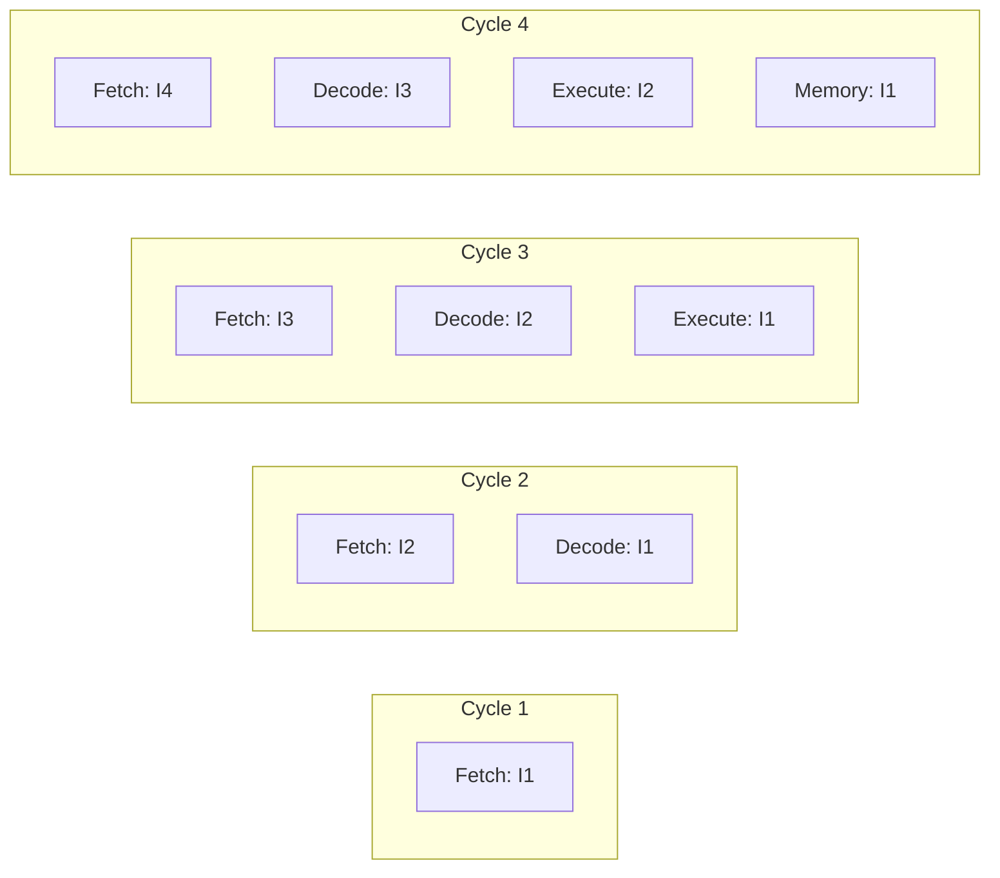
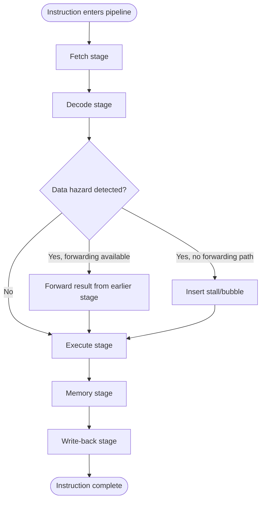

# Pipelining

> Part of [Phase 04 — Computer Architecture](./README.md)

---

## What is it?

Pipelining is a CPU design technique that OVERLAPS the execution of multiple instructions — while one instruction is being executed, the NEXT instruction is simultaneously being decoded, and the one AFTER that is simultaneously being fetched — dramatically increasing instruction THROUGHPUT without needing to speed up any individual instruction's circuitry.

## Why do we need it?

Without pipelining, a CPU would have to fully complete one instruction (fetch, decode, execute, and write back) before even STARTING the next one — leaving most of the CPU's hardware sitting idle at any given moment (the fetch circuitry does nothing while the ALU is executing, for instance). Pipelining exploits this wasted idle hardware by keeping every stage BUSY simultaneously on DIFFERENT instructions, similar to how a factory assembly line dramatically increases output without making any single worker faster.

## Real-world analogy

Think of pipelining like a car wash with distinct stations: soap, scrub, rinse, dry. WITHOUT overlapping, one car goes through all four stations completely before the next car even starts — slow. WITH pipelining, car 1 moves to "scrub" while car 2 starts "soap" — every station is busy at once, and the car wash can output a FINISHED car nearly every "station time," even though each individual car still takes the same total time to go through all four stations.

```text
WITHOUT pipelining (one instruction at a time):
[F1][D1][E1][W1]                              <- instruction 1 completes
                [F2][D2][E2][W2]                <- THEN instruction 2 starts

WITH pipelining (overlapped):
[F1][D1][E1][W1]
    [F2][D2][E2][W2]
        [F3][D3][E3][W3]
            [F4][D4][E4][W4]
```

## Historical background

- Pipelining as a computing concept dates back to the **IBM Stretch (1961)** and became more widely adopted through the 1960s-70s in high-performance mainframes and supercomputers (like the Control Data Corporation's CDC 6600).
- Pipelining became a MAINSTREAM, essential feature of general-purpose microprocessors with the rise of RISC architectures in the 1980s — RISC's simple, fixed-length, single-cycle instructions were specifically designed to be EASY to pipeline efficiently (see [`Instruction-Set.md`](./Instruction-Set.md)).
- Modern CPUs have extended pipelining dramatically — some historically reaching 20+ pipeline stages (Intel's Pentium 4 "NetBurst" architecture) in pursuit of higher clock speeds, though this created its own trade-offs (worse penalties for pipeline hazards, particularly branch mispredictions).

## Mathematical foundation

**Level 1 — Explain it to a 15-year-old:**

Imagine a school cafeteria line with 4 stations: get a tray, get the main dish, get a drink, pay. If everyone waited for ONE person to go through ALL 4 stations before the NEXT person could even start at station 1, the line would move painfully slowly. Instead, as soon as person 1 moves from "get a tray" to "get the main dish," person 2 can START at "get a tray" — everyone moves in a staggered, OVERLAPPING pattern, and the whole line moves through much faster overall, even though each individual person still needs to visit all 4 stations.

**Level 2 — Engineering Level:**

A classic pipeline divides instruction execution into discrete STAGES (commonly 5 for a simple RISC pipeline: Fetch, Decode, Execute, Memory access, Write-back), with dedicated hardware for each stage, allowing `n` DIFFERENT instructions to be in `n` different stages SIMULTANEOUSLY. In an IDEAL pipeline with `k` stages, running `n` instructions takes `(k + n - 1)` cycles instead of `k × n` cycles for fully sequential (non-pipelined) execution — a substantial theoretical speedup for large `n`.

**Level 3 — Industry Level:**

Real pipelines suffer from **hazards** that prevent achieving this ideal speedup: **structural hazards** (two instructions needing the SAME hardware resource simultaneously), **data hazards** (an instruction needs a result that a PREVIOUS, still-in-flight instruction hasn't produced yet), and **control hazards** (a branch instruction's outcome isn't known yet, so the pipeline doesn't know WHICH instruction to fetch next). Real CPUs use **forwarding/bypassing** (routing a result directly from one stage to another, skipping the register file) and **branch prediction** (guessing the branch outcome to keep fetching, correcting later if wrong) to minimize these hazards' performance impact.

**Level 4 — Research Level:**

Research into branch prediction algorithms (increasingly sophisticated, sometimes machine-learning-inspired approaches) continues to push prediction accuracy well above 95% in modern high-performance CPUs, since a MISPREDICTED branch requires FLUSHING the entire pipeline of incorrectly-fetched instructions — a costly penalty that grows with pipeline depth, directly connecting to the security research into speculative execution vulnerabilities (Spectre-class attacks) mentioned in [`CPU.md`](./CPU.md).

## Formal definition

For an ideal `k`-stage pipeline executing `n` instructions with no hazards or stalls, the total execution time is `(k + n - 1)` clock cycles (compared to `k × n` cycles for fully sequential execution). **Pipeline speedup** is defined as:

```
Speedup = (Non-pipelined time) / (Pipelined time) = (k × n) / (k + n - 1)
```

As `n → ∞`, this speedup approaches `k` (the number of pipeline stages) — the theoretical maximum.

## Core concepts

- **Pipeline Stage** — a discrete step in instruction processing (e.g., Fetch, Decode, Execute, Memory, Write-back)
- **Pipeline Register** — hardware storing the intermediate results passed between adjacent pipeline stages
- **Structural Hazard** — two instructions need the SAME hardware resource at the same time
- **Data Hazard** — an instruction depends on a result not yet produced by a still-in-flight PRIOR instruction
- **Control Hazard** — a branch instruction's target isn't known yet, creating uncertainty about which instruction to fetch next
- **Forwarding (Bypassing)** — routing a computed result DIRECTLY to a stage that needs it, without waiting for it to be written back to the register file first
- **Branch Prediction** — guessing a branch's outcome in advance to keep the pipeline full, with a mechanism to correct/flush if the guess is wrong
- **Pipeline Stall (Bubble)** — deliberately pausing/inserting a "do nothing" cycle to resolve a hazard when forwarding/prediction isn't sufficient

## Internal working

When a data hazard occurs (e.g., instruction 2 needs a value that instruction 1, still in the Execute stage, hasn't finished computing yet), the pipeline hardware has two options: **stall** (insert a bubble, delaying instruction 2 until the needed value is ready) or **forward** (route instruction 1's result directly from its Execute stage's output to instruction 2's Execute stage input, the moment it becomes available, bypassing the slower register-file write/read path entirely) — forwarding is almost always the FASTER solution when the hardware supports it.

## Step-by-step explanation

**How a 5-stage RISC pipeline processes instructions with a data hazard, resolved via forwarding, step by step:**

1. Instruction 1 (`ADD R1, R2, R3`) enters the pipeline: Fetch (cycle 1), Decode (cycle 2), Execute (cycle 3) — its result (new value of R1) becomes available at the END of cycle 3.
2. Instruction 2 (`SUB R4, R1, R5`) enters the pipeline one cycle behind: Fetch (cycle 2), Decode (cycle 3) — but it NEEDS R1's new value, which won't normally be written back to the register file until instruction 1 completes its Write-back stage (cycle 5).
3. WITHOUT forwarding, instruction 2 would need to STALL for 2 cycles, waiting for instruction 1's Write-back to complete before it can correctly read R1 in its own Decode stage.
4. WITH forwarding, hardware detects this dependency and ROUTES instruction 1's Execute-stage result DIRECTLY to instruction 2's Execute stage (cycle 4), just in time, completely eliminating the need to stall.
5. This forwarding path is exactly why well-designed RISC pipelines can often achieve CPI very close to 1, despite frequent data dependencies between adjacent instructions.

---

## Worked Examples: Pipeline Speedup and Hazard Analysis

### Worked Example 1 — Basic pipeline speedup calculation

**Given:** a 5-stage pipeline (Fetch, Decode, Execute, Memory, Write-back) executes 100 instructions with NO hazards or stalls. Compare total execution time to non-pipelined execution, and compute the speedup.

```
Non-pipelined time = k x n cycles = 5 x 100 = 500 cycles
Pipelined time      = (k + n - 1) cycles = (5 + 100 - 1) = 104 cycles

Speedup = 500 / 104 = 4.81x

(Approaching, but not quite reaching, the theoretical maximum
of k=5, since n=100 is finite - the "+k-1" overhead for filling
and draining the pipeline becomes proportionally less significant
as n grows larger.)
```

### Worked Example 2 — Speedup as instruction count grows

**Given:** the same 5-stage pipeline, but now executing 1,000,000 instructions. Compute the new speedup and compare to Worked Example 1.

```
Pipelined time = (5 + 1,000,000 - 1) = 1,000,004 cycles
Non-pipelined time = 5 x 1,000,000 = 5,000,000 cycles

Speedup = 5,000,000 / 1,000,004 ≈ 4.99998x

As n grows very large, speedup approaches the theoretical
maximum of exactly k=5 - confirming the formula's limiting
behavior established in the Formal Definition section.
```

### Worked Example 3 — Impact of pipeline stalls on effective speedup

**Given:** the same 5-stage pipeline executing 100 instructions, but 20% of instructions cause a 2-cycle stall (due to unresolved data hazards). Compute the actual pipelined execution time and resulting speedup.

```
Number of stalling instructions = 0.20 x 100 = 20 instructions
Total stall cycles = 20 x 2 = 40 extra cycles

Pipelined time (with stalls) = (k + n - 1) + total stall cycles
                              = (5 + 100 - 1) + 40
                              = 104 + 40 = 144 cycles

Non-pipelined time = 5 x 100 = 500 cycles (unchanged - stalls don't
                                            affect non-pipelined execution,
                                            since there's no pipeline to stall)

Speedup = 500 / 144 ≈ 3.47x

Compare to Worked Example 1's hazard-free speedup of 4.81x -
hazards MEASURABLY reduce real-world pipeline speedup below
the theoretical ideal, exactly as the chapter's core lesson predicts.
```

### Worked Example 4 — Branch misprediction penalty

**Given:** a 5-stage pipeline has a branch misprediction penalty of 3 cycles (the number of incorrectly-fetched instructions that must be flushed). If 15% of a 200-instruction program's instructions are branches, and the branch predictor is 90% accurate, compute the total misprediction penalty cycles.

```
Number of branch instructions = 0.15 x 200 = 30 branches
Number of MISPREDICTED branches = 30 x (1 - 0.90) = 30 x 0.10 = 3 mispredictions

Total misprediction penalty cycles = 3 mispredictions x 3 cycles each = 9 extra cycles

Total pipelined time = (5 + 200 - 1) + 9 = 204 + 9 = 213 cycles

This demonstrates precisely why branch prediction ACCURACY matters
so much: even a modest 10% misprediction rate on a moderate fraction
of branch instructions adds real, measurable overhead - and this
penalty GROWS with pipeline depth (deeper pipelines = more
instructions to flush per misprediction), a direct trade-off
between clock speed (favoring deeper pipelines) and misprediction
cost (favoring shallower ones).
```

---

## Visual diagram



## Architecture diagram

```text
5-stage pipeline diagram, 4 instructions, NO hazards:

Cycle:      1    2    3    4    5    6    7    8
Instr 1:   [F]  [D]  [E]  [M]  [W]
Instr 2:        [F]  [D]  [E]  [M]  [W]
Instr 3:             [F]  [D]  [E]  [M]  [W]
Instr 4:                  [F]  [D]  [E]  [M]  [W]

Total cycles = 8 = (5 + 4 - 1), exactly matching the formula.
Compare to non-pipelined: 4 instructions x 5 stages = 20 cycles.
```

## Flowchart



## Example

Illustrate a control hazard and its resolution via branch prediction:

```
Instructions:
  100: BEQ R1, R2, 200   ; branch if R1 == R2, jump to address 200
  104: ADD R3, R4, R5    ; the "fall-through" instruction if branch NOT taken
  ...
  200: SUB R6, R7, R8    ; the branch TARGET, if branch IS taken

WITHOUT branch prediction: the pipeline must STALL after fetching
the BEQ instruction, until its outcome is known (typically at the
Execute stage), wasting several cycles every single branch.

WITH branch prediction: the pipeline GUESSES (e.g., "predict not taken")
and speculatively continues fetching instruction 104 immediately.
If the guess is CORRECT, zero cycles are wasted. If WRONG, the
speculatively-fetched instructions must be FLUSHED and the correct
target (200) fetched instead - the misprediction penalty from
Worked Example 4.
```

## Dry run

Trace a 3-instruction sequence with a data hazard, showing where forwarding kicks in:

| Cycle | Instr 1 (ADD R1,R2,R3)    | Instr 2 (SUB R4,R1,R5)           | Instr 3 (AND R6,R4,R7)           |
| ----- | ------------------------- | -------------------------------- | -------------------------------- |
| 1     | Fetch                     |                                  |                                  |
| 2     | Decode                    | Fetch                            |                                  |
| 3     | Execute (R1 ready at end) | Decode                           | Fetch                            |
| 4     | Memory                    | Execute (forwarded R1 used here) | Decode                           |
| 5     | Write-back                | Memory                           | Execute (forwarded R4 used here) |

Both dependencies (Instr 2 needs R1 from Instr 1; Instr 3 needs R4 from Instr 2) are resolved via FORWARDING, with zero stall cycles needed — this is exactly the kind of back-to-back dependency chain real pipelined CPUs are specifically engineered to handle efficiently.

## Multiple examples

**Example 1 — Structural hazard:** if a CPU has only ONE memory port, an instruction's Memory stage and a DIFFERENT instruction's Fetch stage (which ALSO needs to access memory, to fetch the next instruction) can collide — resolved by using SEPARATE instruction and data caches/memory ports (see [`Cache.md`](./Cache.md)), a very common real design choice specifically to avoid this hazard.

**Example 2 — Load-use data hazard:** even WITH forwarding, a `LOAD` instruction's result isn't available until AFTER its Memory stage — if the VERY NEXT instruction needs that loaded value in ITS Execute stage, even forwarding can't deliver it in time, requiring at least a 1-cycle stall (the "load-use hazard," a well-known specific case forwarding alone cannot fully eliminate).

**Example 3 — Deeper pipelines, higher clock speed, higher misprediction cost:** a CPU with a 20-stage pipeline can run at a much HIGHER clock rate (each stage does less work, so each stage completes faster) but suffers a MUCH larger misprediction penalty (up to 20 cycles of flushed work) — directly illustrating the clock-speed-vs-hazard-cost trade-off mentioned in the Historical Background.

## Advantages

- Dramatically increases instruction THROUGHPUT (instructions completed per unit time) without requiring faster individual circuits.
- Effectively reduces average CPI toward 1 (or even below 1, with superscalar designs), directly improving performance per the CPU Performance Equation (see [`CPU.md`](./CPU.md)).
- The underlying principle (overlapping independent stages of work) generalizes well beyond CPUs, into software pipeline patterns and hardware design more broadly.

## Disadvantages

- Does NOT reduce the LATENCY of any single instruction — an individual instruction still takes the same number of stages/cycles to fully complete.
- Hazards (structural, data, control) introduce real stalls/bubbles that prevent achieving the theoretical maximum speedup.
- Deeper pipelines (chasing higher clock speeds) suffer larger misprediction penalties, a genuine engineering trade-off with no free lunch.

## Complexity

| Metric                                                    | Formula                                                        |
| --------------------------------------------------------- | -------------------------------------------------------------- |
| Ideal pipelined execution time (k stages, n instructions) | k + n - 1 cycles                                               |
| Ideal speedup                                             | (k × n) / (k + n - 1), approaching k as n → ∞                  |
| Effective time with stalls                                | (k + n - 1) + total stall cycles                               |
| Branch misprediction overhead                             | (number of branches) × (misprediction rate) × (penalty cycles) |

## Memory usage

Pipeline registers (the hardware storing intermediate values BETWEEN adjacent stages) add real hardware/silicon cost proportional to pipeline depth — deeper pipelines require more of these registers, a genuine hardware resource trade-off alongside the misprediction-penalty trade-off already discussed.

## Time complexity

The core practical lesson, worth repeating: **pipelining improves THROUGHPUT, not individual instruction LATENCY** — a common and important distinction; and real-world speedup is always LESS than the theoretical maximum of `k`, precisely to the extent that hazards force stalls, exactly as quantified in Worked Examples 3 and 4.

## Best practices

- Compilers can help REDUCE data hazard stalls through INSTRUCTION SCHEDULING — reordering independent instructions to be placed between a value's computation and its use, giving the pipeline "something useful to do" instead of stalling.
- Branch-heavy code benefits disproportionately from strong branch prediction; profiling and minimizing unpredictable branches (or using branch-free alternatives where reasonable) can measurably improve real-world performance.
- Understand the load-use hazard specifically — even a well-forwarded pipeline may need a MINIMUM 1-cycle stall immediately after a load whose result is used immediately.

## Common mistakes

- Confusing pipelining's THROUGHPUT benefit with reducing any single instruction's total latency (it does NOT do this — every instruction still passes through all k stages).
- Forgetting that hazards (data, structural, control) prevent real pipelines from reaching their theoretical maximum speedup of exactly k.
- Assuming deeper pipelines are unconditionally better — deeper pipelines increase clock speed potential but ALSO increase misprediction penalty, a genuine trade-off, not a free improvement.
- Miscalculating pipelined execution time by forgetting the "+k-1" fill/drain overhead, or forgetting to ADD stall cycles on top of the ideal formula.

## Interview questions

1. Explain instruction pipelining and why it improves throughput without making any single instruction faster.
2. What are the three types of pipeline hazards, and give an example of each?
3. What is forwarding (bypassing), and what specific hazard scenario can it NOT fully solve?
4. Explain the trade-off between pipeline depth, clock speed, and branch misprediction penalty.
5. Given a pipeline depth and instruction count, calculate the ideal execution time and speedup.

## University questions

1. Derive the formula for ideal pipelined execution time and speedup for a k-stage pipeline running n instructions.
2. Explain data, structural, and control hazards with concrete instruction sequence examples.
3. Explain how forwarding resolves certain data hazards, and describe the "load-use hazard" it cannot fully resolve.
4. Given a branch misprediction rate and penalty, compute the total performance impact for a given program.

## Coding examples

### Pseudocode

```text
FUNCTION pipelineSpeedup(stages, instructionCount, stallCycles):
    idealTime = stages + instructionCount - 1
    actualTime = idealTime + stallCycles
    nonPipelinedTime = stages * instructionCount
    speedup = nonPipelinedTime / actualTime
    RETURN (actualTime, speedup)
```

### Python implementation

```python
def pipeline_speedup(stages, instruction_count, stall_cycles=0):
    ideal_time = stages + instruction_count - 1
    actual_time = ideal_time + stall_cycles
    non_pipelined_time = stages * instruction_count
    speedup = non_pipelined_time / actual_time
    return actual_time, speedup

# Worked Example 1: no stalls
time1, speedup1 = pipeline_speedup(5, 100)
print(f"No stalls: time={time1}, speedup={speedup1:.2f}")  # time=104, speedup=4.81

# Worked Example 3: 20 instructions each stalling 2 cycles
time3, speedup3 = pipeline_speedup(5, 100, stall_cycles=40)
print(f"With stalls: time={time3}, speedup={speedup3:.2f}")  # time=144, speedup=3.47
```

### C implementation

```c
#include <stdio.h>

void pipelineSpeedup(int stages, int instructionCount, int stallCycles,
                      int* actualTime, double* speedup) {
    int idealTime = stages + instructionCount - 1;
    *actualTime = idealTime + stallCycles;
    int nonPipelinedTime = stages * instructionCount;
    *speedup = (double)nonPipelinedTime / *actualTime;
}

int main() {
    int actualTime;
    double speedup;

    pipelineSpeedup(5, 100, 0, &actualTime, &speedup);
    printf("No stalls: time=%d, speedup=%.2f\n", actualTime, speedup);  // 104, 4.81

    pipelineSpeedup(5, 100, 40, &actualTime, &speedup);
    printf("With stalls: time=%d, speedup=%.2f\n", actualTime, speedup);  // 144, 3.47
    return 0;
}
```

### C++ implementation

```cpp
#include <iostream>
using namespace std;

pair<int, double> pipelineSpeedup(int stages, int instructionCount, int stallCycles = 0) {
    int idealTime = stages + instructionCount - 1;
    int actualTime = idealTime + stallCycles;
    int nonPipelinedTime = stages * instructionCount;
    double speedup = (double)nonPipelinedTime / actualTime;
    return {actualTime, speedup};
}

int main() {
    auto [time1, speedup1] = pipelineSpeedup(5, 100);
    cout << "No stalls: time=" << time1 << ", speedup=" << speedup1 << endl;

    auto [time3, speedup3] = pipelineSpeedup(5, 100, 40);
    cout << "With stalls: time=" << time3 << ", speedup=" << speedup3 << endl;
}
```

### Java implementation

```java
public class PipelineDemo {
    static double[] pipelineSpeedup(int stages, int instructionCount, int stallCycles) {
        int idealTime = stages + instructionCount - 1;
        int actualTime = idealTime + stallCycles;
        int nonPipelinedTime = stages * instructionCount;
        double speedup = (double) nonPipelinedTime / actualTime;
        return new double[]{actualTime, speedup};
    }

    public static void main(String[] args) {
        double[] result1 = pipelineSpeedup(5, 100, 0);
        System.out.printf("No stalls: time=%.0f, speedup=%.2f%n", result1[0], result1[1]);

        double[] result3 = pipelineSpeedup(5, 100, 40);
        System.out.printf("With stalls: time=%.0f, speedup=%.2f%n", result3[0], result3[1]);
    }
}
```

## Visualization

```text
Speedup approaching the theoretical maximum (k=5) as instruction count grows:

n=10:        speedup ≈ 3.57x
n=100:       speedup ≈ 4.81x
n=1,000:     speedup ≈ 4.98x
n=1,000,000: speedup ≈ 5.00x (essentially the theoretical maximum)

The "startup cost" of filling the pipeline (k-1 extra cycles)
matters LESS and LESS as a proportion of total time, the
longer the program runs - exactly why pipelining is so
effective for real, long-running programs.
```

## Industry use

- **Every modern general-purpose CPU** (x86, ARM, RISC-V) uses pipelining as a fundamental, essential performance technique.
- **Compiler instruction schedulers** actively reorder generated machine code specifically to minimize pipeline stalls from data hazards.
- **GPU architectures** use extremely deep and wide pipelining (combined with massive parallelism) to achieve the throughput needed for graphics and machine learning workloads.
- **CPU performance benchmarking and marketing** frequently references pipeline depth and branch prediction accuracy as key differentiators between chip generations.

## Research relevance

Research into more accurate BRANCH PREDICTION algorithms (including neural/machine-learning-inspired predictors in some modern high-performance CPUs) continues to push misprediction rates lower, directly improving real-world pipeline efficiency. Research into **speculative execution security** (following the Spectre/Meltdown vulnerability disclosures) explores how to preserve pipelining's performance benefits while closing the side-channel vulnerabilities these SAME speculative techniques introduced.

## Related concepts

- CPU (pipelining is a technique for effectively reducing CPI within the CPU Performance Equation — see [`CPU.md`](./CPU.md))
- Instruction Set Architecture (RISC's simple, fixed-length instructions are specifically designed to pipeline well — see [`Instruction-Set.md`](./Instruction-Set.md))
- Cache (structural hazards around memory access are often resolved using separate instruction/data caches — see [`Cache.md`](./Cache.md))

## Practice problems

1. Given a 4-stage pipeline executing 50 instructions with no hazards, compute the ideal execution time and speedup.
2. Given a pipeline where 10% of 500 instructions cause a 3-cycle stall, compute the actual execution time and speedup.
3. Given a branch misprediction rate of 5% on 12% of a 1000-instruction program's instructions, with a 4-cycle penalty per misprediction, compute total misprediction overhead.
4. Explain, with a concrete instruction sequence, a load-use hazard that even forwarding cannot fully eliminate.

## Advanced concepts

- **Superscalar Pipelining** — issuing and executing MULTIPLE instructions per pipeline stage per cycle, using multiple parallel execution units, achieving CPI below 1.
- **Out-of-Order Execution** — dynamically reordering instruction execution within the pipeline to avoid stalling on a dependency, while preserving the illusion of in-order results to software.
- **Speculative Execution and Its Security Implications** — executing instructions before their necessity is confirmed (e.g., past an unresolved branch), a major performance technique that also introduced the Spectre/Meltdown class of security vulnerabilities.

## Summary

Pipelining overlaps the execution of multiple instructions across dedicated hardware stages, dramatically improving instruction throughput without speeding up any individual instruction — approaching but never quite reaching a theoretical maximum speedup equal to the pipeline's depth, due to structural, data, and control hazards that force real stalls. Techniques like forwarding and branch prediction exist specifically to minimize these hazards' real-world performance cost.

## Key takeaways

- Pipelining improves instruction THROUGHPUT, not individual instruction LATENCY.
- Ideal pipelined time for k stages and n instructions is (k + n - 1) cycles, with speedup approaching k as n grows large.
- The three hazard types are structural (resource conflict), data (dependency on an unready result), and control (unknown branch outcome).
- Forwarding resolves most data hazards without stalling, but cannot fully eliminate the load-use hazard.
- Branch misprediction penalty grows with pipeline depth — a direct trade-off against the higher clock speeds deeper pipelines enable.

## References

- Patterson, D., Hennessy, J. _Computer Organization and Design_, Chapter 4.
- Hennessy, J., Patterson, D. _Computer Architecture: A Quantitative Approach_, Chapter 3.
- Smith, J.E. (1981). _A Study of Branch Prediction Strategies_.

---

⬅ Back to [Phase 04 — Computer Architecture README](./README.md)
