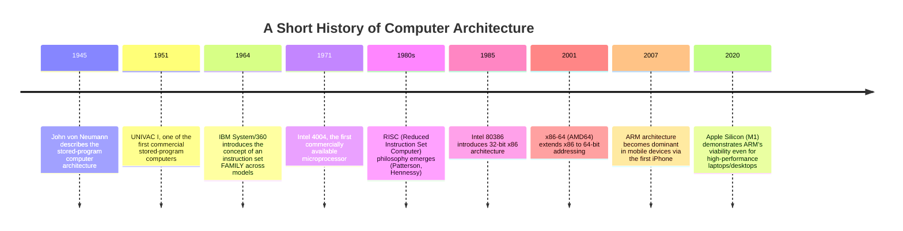
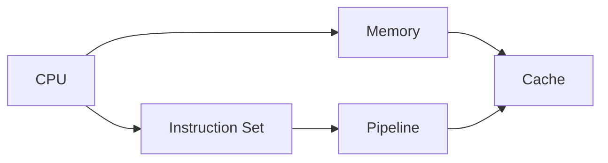

# Phase 04 — Computer Architecture

> "Every abstraction you've studied so far — algorithms, data structures, operating systems, even a single SQL query — eventually bottoms out in a physical chip flipping billions of transistors a second. This phase is where we finally look at that chip." — a professor's honest confession, day one of Computer Architecture.

This is **Phase 4** of the `msc-computer-science` repository, filling the gap between Phase 3 (Theory of Computation) and Phase 5 (Operating Systems). Where Theory of Computation studies what is computable IN PRINCIPLE, Computer Architecture studies how a REAL machine actually executes instructions — cycle by cycle, instruction by instruction, byte by byte in memory — and why the specific hardware design choices made here directly explain performance behavior you'll see in every later phase (why some algorithms are fast in practice despite similar Big-O, why context switches cost what they cost, why cache-friendly code matters).

---

## Table of Contents

- [Introduction](#introduction)
- [Why This Subject Exists](#why-this-subject-exists)
- [Historical Background](#historical-background)
- [Importance](#importance)
- [Applications](#applications)
- [Industries Using It](#industries-using-it)
- [Career Relevance](#career-relevance)
- [Prerequisites](#prerequisites)
- [Roadmap](#roadmap)
- [Complete Syllabus](#complete-syllabus)
- [Learning Objectives](#learning-objectives)
- [How This Connects to Previous Phases](#how-this-connects-to-previous-phases)
- [How This Connects to Later Phases](#how-this-connects-to-later-phases)
- [Recommended Study Order](#recommended-study-order)
- [Estimated Study Time](#estimated-study-time)
- [Books](#books)
- [Research Papers](#research-papers)
- [Reference Websites](#reference-websites)
- [Practice Resources](#practice-resources)
- [Projects](#projects)
- [Interview Importance](#interview-importance)
- [University Exam Importance](#university-exam-importance)
- [Common Mistakes](#common-mistakes)
- [Cheat Sheet](#cheat-sheet)
- [Summary](#summary)
- [Next Steps](#next-steps)

---

## Introduction

Every program you have ever run — from a "Hello World" script to the largest AI model — ultimately becomes a sequence of extremely simple instructions (add these two numbers, load this value from memory, jump to this address) executed by a physical CPU. Computer Architecture studies exactly how that CPU is built and organized: how it fetches and executes instructions, how it overlaps multiple instructions for speed (pipelining), how it bridges the enormous speed gap between the CPU and memory (caching), and how the instruction set itself is designed to be both expressive for compilers and efficient for hardware.

This phase covers five files:

| File                 | Topic                        | One-line description                                                                       |
| -------------------- | ---------------------------- | ------------------------------------------------------------------------------------------ |
| `README.md`          | Phase overview               | This file                                                                                  |
| `CPU.md`             | The CPU                      | The core execution engine — datapath, control unit, the fetch-decode-execute cycle         |
| `Instruction-Set.md` | Instruction Set Architecture | The "vocabulary" a CPU understands — RISC vs. CISC, addressing modes                       |
| `Pipeline.md`        | Pipelining                   | Overlapping instruction execution for dramatic speedup, and the hazards that complicate it |
| `Memory.md`          | Memory Systems               | The memory hierarchy, addressing, and how a CPU actually reads/writes data                 |
| `Cache.md`           | Cache Memory                 | The small, fast memory layer bridging the CPU-memory speed gap                             |

---

## Why This Subject Exists

Software engineers can write correct, elegant algorithms that are nevertheless catastrophically slow in practice — and just as often, two algorithms with identical Big-O complexity can differ by 10x or more in real wall-clock time. Computer Architecture exists to explain this gap: WHY memory access isn't "free" the way Big-O analysis often implicitly assumes, WHY branch-heavy code can be slower than branch-free code even with fewer total operations, and WHY understanding the physical machine underneath your code is essential for genuinely high-performance software engineering.

---

## Historical Background

Notice the recurring theme: the fundamental von Neumann architecture (a single memory holding both instructions and data, executed sequentially by a CPU) proposed in 1945 remains, in its essential structure, the foundation of virtually every general-purpose computer built since — even as clock speeds, transistor counts, and instruction sets have evolved by many orders of magnitude.

---

## Importance

Computer Architecture matters because it determines:

1. **Real-world performance** — why identical Big-O algorithms can have wildly different actual running times (cache behavior, pipeline stalls).
2. **Hardware-software co-design** — how compilers, operating systems, and even algorithm design must account for real hardware behavior to be genuinely efficient.
3. **The limits of "free" abstraction** — understanding exactly where and why abstractions (like Big-O notation, or even the "RAM model" of computation) diverge from physical reality.
4. **Career-critical intuition** — for performance engineering, embedded systems, compiler design, and low-level optimization work, this is foundational, non-optional knowledge.

---

## Applications

| Architecture Concept         | Real Application                                                                             |
| ---------------------------- | -------------------------------------------------------------------------------------------- |
| CPU / Fetch-Decode-Execute   | The literal execution engine behind every running program                                    |
| Instruction Set Architecture | Compiler design, assembly programming, cross-platform software compatibility                 |
| Pipelining                   | Nearly every modern CPU, from smartphones to supercomputers                                  |
| Memory Hierarchy             | Explains real-world performance differences invisible to Big-O analysis                      |
| Cache Memory                 | Cache-aware algorithm and data structure design (e.g., cache-friendly matrix multiplication) |

---

## Industries Using It

- **Chip design companies** (Intel, AMD, ARM, Apple, NVIDIA) — this phase IS their core discipline.
- **High-performance computing / scientific computing** — squeezing maximum performance from hardware requires deep architectural understanding.
- **Embedded systems and IoT** — resource-constrained devices demand careful, architecture-aware engineering.
- **Compiler and systems software teams** — compilers must generate code that works WITH the underlying architecture (pipelining, cache behavior), not against it.
- **Game development and graphics** — performance-critical code routinely requires cache-aware and pipeline-aware optimization.

---

## Career Relevance

| Role                          | Architecture Relevance                                                                                           |
| ----------------------------- | ---------------------------------------------------------------------------------------------------------------- |
| Performance/Systems Engineer  | Cache-aware and pipeline-aware optimization is a core, daily skill                                               |
| Embedded/Firmware Engineer    | Direct, hands-on hardware-level programming and constraints                                                      |
| Compiler Engineer             | Must generate code that respects instruction sets, pipelining, and memory hierarchy                              |
| Hardware/Chip Design Engineer | This phase IS the foundational subject matter of the entire career                                               |
| Any Software Engineer         | Understanding WHY code is slow (cache misses, branch mispredictions) is a widely valuable, differentiating skill |

---

## Prerequisites

- Phase 1 (Mathematics) — binary number representation and basic logic are used throughout.
- Phase 2 (Data Structures and Algorithms) — complexity analysis provides essential context for understanding when architectural effects matter most.
- Phase 3 (Theory of Computation) — the Turing Machine's abstract model provides useful contrast with a REAL machine's concrete constraints.

---

## Roadmap

---

## Complete Syllabus

1. **CPU** — datapath, control unit, registers, the fetch-decode-execute cycle, clock cycles and CPI
2. **Instruction Set Architecture** — RISC vs. CISC, addressing modes, instruction formats
3. **Pipelining** — the five-stage pipeline, hazards (structural, data, control), speedup calculations
4. **Memory** — the memory hierarchy, addressing, memory-mapped I/O
5. **Cache Memory** — cache mapping techniques, hit/miss behavior, Average Memory Access Time (AMAT)

---

## Learning Objectives

By the end of this phase, you will be able to:

- Explain the fetch-decode-execute cycle and compute basic CPU performance metrics (CPI, clock cycles, execution time).
- Compare RISC and CISC design philosophies and their trade-offs.
- Explain instruction pipelining and identify/resolve structural, data, and control hazards.
- Compute pipeline speedup and understand why hazards prevent achieving the theoretical maximum.
- Explain the memory hierarchy and why it exists.
- Compute cache hit rates, miss penalties, and Average Memory Access Time (AMAT) for a given cache configuration.

---

## How This Connects to Previous Phases

- **Phase 1 (Mathematics)**: binary/hexadecimal number systems and Boolean logic directly underlie instruction encoding and the CPU's arithmetic logic unit (ALU).
- **Phase 2 (DSA)**: complexity analysis assumes a simplified "RAM model" where memory access is O(1) — this phase reveals exactly where and why that assumption breaks down in real hardware (cache misses).
- **Phase 3 (Theory of Computation)**: the Turing Machine's idealized, infinite-tape model contrasts directly with a real CPU's finite registers and hierarchical, finite memory — a useful "theory vs. practice" comparison.

## How This Connects to Later Phases

- **Operating Systems** (Phase 5) — context switching, virtual memory, and interrupts are all implemented using specific CPU hardware features (registers, the MMU) introduced conceptually in this phase.
- **Compiler Design** (a likely later phase) — instruction selection, register allocation, and pipeline-aware instruction scheduling are direct, practical applications of this phase's material.
- **Computer Networks** (Phase 7) — network interface hardware and high-performance packet processing rely on architectural concepts like caching and pipelining.

---

## Recommended Study Order

1. CPU (the foundational execution engine)
2. Instruction Set Architecture (what the CPU actually understands)
3. Pipeline (how modern CPUs achieve speed through overlap)
4. Memory (the broader hierarchy the CPU operates within)
5. Cache (the critical fast layer bridging CPU and memory speeds)

---

## Estimated Study Time

| Topic                        | Beginner Pace | Fast Pace      |
| ---------------------------- | ------------- | -------------- |
| CPU                          | 1 week        | 2 days         |
| Instruction Set Architecture | 1 week        | 2 days         |
| Pipeline                     | 1.5 weeks     | 3 days         |
| Memory                       | 4 days        | 1 day          |
| Cache                        | 1 week        | 2 days         |
| **Total**                    | **~5 weeks**  | **~1.5 weeks** |

---

## Books

- _Computer Organization and Design_ — Patterson & Hennessy (the "RISC-V edition" or classic MIPS edition)
- _Computer Architecture: A Quantitative Approach_ — Hennessy & Patterson
- _Computer Organization and Architecture_ — William Stallings
- _Structured Computer Organization_ — Andrew Tanenbaum

## Research Papers

- Patterson, D., Ditzel, D. (1980). _The Case for the Reduced Instruction Set Computer_.
- Amdahl, G. (1967). _Validity of the Single Processor Approach to Achieving Large Scale Computing Capabilities_ (Amdahl's Law).
- Smith, A.J. (1982). _Cache Memories_ (a foundational survey of cache design).

## Reference Websites

- [Patterson & Hennessy companion resources](https://www.elsevier.com/books/computer-organization-and-design-risc-v-edition/patterson/978-0-12-820331-6)
- [GeeksforGeeks — Computer Organization and Architecture section](https://www.geeksforgeeks.org)
- [Ryan's Tutorials / Onlamp architecture primers](https://www.tutorialspoint.com/computer_logical_organization/)

## Practice Resources

- GATE previous year papers (Computer Organization and Architecture section — CPI, pipeline hazard, and cache/AMAT calculations are extremely common)
- Logisim or similar digital logic simulators for hands-on datapath/control unit exploration

## Projects

1. Build a simple CPU simulator in software, implementing fetch-decode-execute for a tiny custom instruction set.
2. Simulate a 5-stage pipeline with hazard detection and forwarding, visualizing stalls.
3. Write a cache simulator supporting direct-mapped, set-associative, and fully-associative configurations, and compare hit rates on a sample memory access trace.
4. Benchmark cache-friendly versus cache-unfriendly matrix multiplication implementations and measure the real performance difference.

## Interview Importance

(Moderate)

Less commonly asked directly than DSA, but foundational for performance engineering, embedded, and systems-level interviews — and "why is this code slow" discussions often trace back to cache/pipeline behavior.

## University Exam Importance

(Very High)

Computer Organization and Architecture is a core, heavily-weighted subject in every BSc/MSc Computer Science curriculum, and CPI/AMAT/pipeline numeric problems are among the most consistently tested GATE and UGC NET question types.

## Common Mistakes

- Assuming memory access is uniformly "O(1) and free," as Big-O analysis often implicitly assumes — in reality, access time varies dramatically depending on cache hits/misses.
- Confusing pipelining's THROUGHPUT improvement (more instructions completed per unit time) with reducing any SINGLE instruction's latency (which pipelining does NOT do).
- Forgetting that pipeline hazards (data, control, structural) prevent real pipelines from achieving their theoretical maximum speedup.
- Miscalculating AMAT by forgetting to correctly weight hit time against miss penalty using the hit/miss RATE, not just adding them.

## Cheat Sheet

| Concept  | One-Line Meaning                                                             |
| -------- | ---------------------------------------------------------------------------- |
| CPU      | The hardware that fetches, decodes, and executes instructions                |
| CPI      | Cycles Per Instruction — average clock cycles needed per instruction         |
| RISC     | Reduced Instruction Set Computer — simple, fixed-length instructions         |
| CISC     | Complex Instruction Set Computer — richer, variable-length instructions      |
| Pipeline | Overlapping multiple instructions' execution stages for higher throughput    |
| Hazard   | A condition preventing the next pipeline stage from executing as planned     |
| Cache    | Small, fast memory storing recently/frequently used data close to the CPU    |
| AMAT     | Average Memory Access Time — accounts for cache hit/miss rates and penalties |

## Summary

Computer Architecture reveals the real, physical machine underneath every abstraction studied elsewhere in this repository — how a CPU actually executes instructions, how pipelining overlaps work for speed (at the cost of hazards), how the memory hierarchy and caching bridge an enormous CPU-memory speed gap, and why understanding all of this is essential for writing genuinely high-performance software.

## Next Steps

Proceed in this order:

1. [`CPU.md`](./CPU.md)
2. [`Instruction-Set.md`](./Instruction-Set.md)
3. [`Pipeline.md`](./Pipeline.md)
4. [`Memory.md`](./Memory.md)
5. [`Cache.md`](./Cache.md)

After finishing this phase, proceed to **Phase 05 — Operating Systems**, where concepts like registers, interrupts, and the MMU introduced here become the hardware foundation for process management, context switching, and virtual memory.
