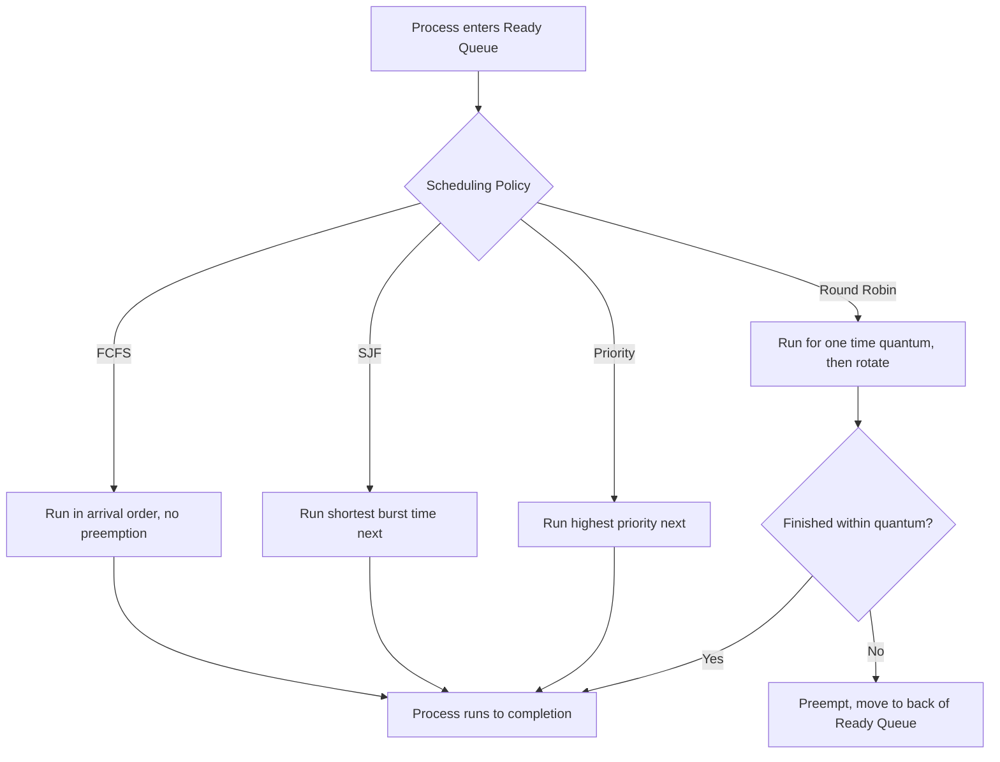
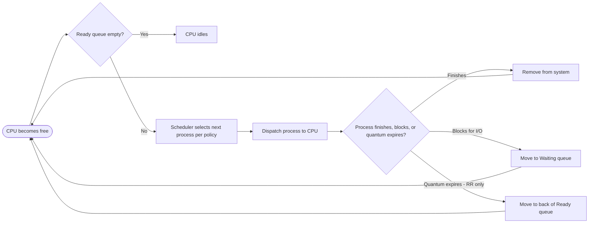

# CPU Scheduling

> Part of [Phase 05 — Operating Systems](./README.md)

---

## What is it?

CPU Scheduling is the OS mechanism that decides **which of the many Ready processes gets to run on the CPU next**, and for how long — the referee constantly deciding whose turn it is on a shared, scarce resource (the processor).

## Why do we need it?

With far more processes wanting to run than there are CPU cores, the OS must make a decision, many times per second, about who runs next. This decision directly determines system responsiveness, fairness, and overall throughput — a poor scheduling policy can leave some processes waiting unacceptably long while others hog the CPU.

## Real-world analogy

Think of CPU scheduling like a single doctor (the CPU) working through a waiting room full of patients (processes). Should the doctor see patients in the order they arrived (FCFS)? Prioritize whoever has the quickest, simplest issue first (Shortest Job First)? Give everyone a fixed, small time slot and rotate through the room repeatedly (Round Robin)? Each policy has different fairness and efficiency trade-offs — exactly the decisions a CPU scheduler must make.

```text
Ready Queue:  [P1] [P2] [P3] [P4]   <- who goes next? Scheduling policy decides.
                 |
                 v
              [ CPU ]
```

## Historical background

- Early **batch processing systems** (1950s) had no real scheduling — jobs simply ran to completion, one after another (equivalent to FCFS).
- **Time-sharing systems** of the 1960s (CTSS, Multics) introduced the need for FAIR, responsive scheduling among multiple interactive users, driving the development of Round Robin and priority-based scheduling.
- **Multilevel Feedback Queue scheduling**, developed through the 1960s-70s, allowed a scheduler to dynamically adapt its treatment of a process based on its OBSERVED behavior (CPU-bound vs. I/O-bound), rather than requiring this to be known in advance.
- Modern schedulers (Linux's **Completely Fair Scheduler**, introduced in 2007) continue evolving these classical ideas to balance fairness, throughput, and low latency at massive scale.

## Mathematical foundation

**Level 1 — Explain it to a 15-year-old:**

Imagine a checkout line at a grocery store. Should the cashier serve people strictly in line order (FCFS), even if someone with just 1 item is stuck behind someone with a full cart? Or should whoever has the FEWEST items go first (Shortest Job First), so more people are served quickly overall, even if it's not perfectly "fair" to the person with a full cart? CPU scheduling is choosing between exactly these kinds of trade-offs, but for programs instead of shoppers.

**Level 2 — Engineering Level:**

Scheduling algorithms are evaluated using standard metrics: **Waiting Time** (time spent in the Ready queue, not running), **Turnaround Time** (total time from arrival to completion), **Response Time** (time from arrival to FIRST time getting the CPU), and **Throughput** (processes completed per unit time). Different algorithms optimize different combinations of these, and NO single algorithm is best for every metric simultaneously.

**Level 3 — Industry Level:**

Real production schedulers (Linux CFS, Windows scheduler) use sophisticated, adaptive, priority-based, and often multi-level algorithms that dynamically adjust based on observed process behavior — favoring I/O-bound (interactive) processes with quick response times while still ensuring CPU-bound (batch) processes eventually make progress, all while balancing fairness across users and processes.

**Level 4 — Research Level:**

Research into scheduling for modern multi-core, heterogeneous hardware (e.g., ARM's big.LITTLE architecture, mixing fast and power-efficient cores) explores how to schedule not just WHEN a process runs, but WHICH core it should run on — a genuinely harder, higher-dimensional version of the classical scheduling problem, with direct implications for mobile device battery life and datacenter energy efficiency.

## Formal definition

Given a set of processes `{P₁, ..., Pₙ}`, each with an arrival time `Aᵢ` and burst time (CPU time needed) `Bᵢ`, a scheduling algorithm determines an order (and, for preemptive algorithms, possibly INTERLEAVING) of CPU allocation. Key derived metrics per process: `Completion Time (CT)`, `Turnaround Time (TAT) = CT - Aᵢ`, `Waiting Time (WT) = TAT - Bᵢ`.

## Core concepts

- **Burst Time** — the amount of CPU time a process needs to complete (or complete its current CPU phase)
- **Arrival Time** — when a process enters the Ready queue
- **Preemptive vs. Non-preemptive** — whether a running process can be interrupted and moved back to Ready before it voluntarily gives up the CPU
- **Waiting Time / Turnaround Time / Response Time** — the standard metrics used to evaluate and compare scheduling algorithms
- **Context Switch Overhead** — the (non-zero!) cost of switching between processes, which every scheduling decision must account for
- **Starvation** — when a process waits indefinitely because the scheduler always prioritizes other processes

## Internal working

The OS scheduler maintains a **Ready Queue** of all processes waiting for CPU time. Whenever the CPU becomes free (a process finishes, blocks for I/O, or its time slice expires), the scheduler consults its policy (FCFS order, shortest burst, highest priority, etc.) to pick the next process from this queue, then performs a context switch to start running it.

## Step-by-step explanation

**How Round Robin scheduling works, step by step:**

1. Maintain the Ready queue as a strict FIFO queue, plus a fixed **time quantum** (e.g., 4 ms).
2. Take the process at the front of the queue and let it run for AT MOST one time quantum.
3. If the process finishes before its quantum expires, remove it (completed) and move to the next process.
4. If the process is STILL running when its quantum expires, preempt it (pause it), move it to the BACK of the Ready queue, and move on to the next process at the front.
5. Repeat until all processes have completed.

---

## Worked Examples: FCFS, SJF, Priority, and Round Robin

This is one of the most heavily tested numeric question types in GATE and UGC NET. All four examples below use the SAME process set for direct comparison.

**Process set** (all arrive at time 0, for simplicity in the first three algorithms):

| Process | Burst Time | Priority (lower number = higher priority) |
| ------- | ---------- | ----------------------------------------- |
| P1      | 6 ms       | 3                                         |
| P2      | 8 ms       | 1                                         |
| P3      | 7 ms       | 4                                         |
| P4      | 3 ms       | 2                                         |

### FCFS (First-Come, First-Served)

**Rule:** processes run strictly in arrival order, non-preemptive.

```
Gantt Chart (order: P1, P2, P3, P4):
| P1(6) | P2(8) | P3(7) | P4(3) |
0       6      14      21      24

Completion Times: P1=6, P2=14, P3=21, P4=24
Turnaround Time (TAT = CT - Arrival, arrival=0 for all):  P1=6, P2=14, P3=21, P4=24
Waiting Time (WT = TAT - Burst):  P1=0, P2=6, P3=14, P4=21

Average Waiting Time = (0+6+14+21)/4 = 41/4 = 10.25 ms
Average Turnaround Time = (6+14+21+24)/4 = 65/4 = 16.25 ms
```

**Key weakness demonstrated:** P4, despite needing only 3 ms, waits 21 ms simply because it arrived last — this is the classic **"convoy effect"** that motivates Shortest Job First.

### SJF (Shortest Job First, non-preemptive)

**Rule:** always pick the Ready process with the SMALLEST burst time next.

```
Order by burst time: P4(3), P1(6), P3(7), P2(8)

Gantt Chart:
| P4(3) | P1(6) | P3(7) | P2(8) |
0       3       9      16      24

Completion Times: P4=3, P1=9, P3=16, P2=24
Turnaround Time: P4=3, P1=9, P3=16, P2=24
Waiting Time: P4=0, P1=3, P3=9, P2=16

Average Waiting Time = (0+3+9+16)/4 = 28/4 = 7.0 ms
Average Turnaround Time = (3+9+16+24)/4 = 52/4 = 13.0 ms
```

**Key result:** SJF achieves a LOWER average waiting time (7.0 ms) than FCFS (10.25 ms) for the exact same process set — SJF is PROVABLY OPTIMAL for minimizing average waiting time (given all processes are available at time 0), a frequently tested theoretical fact.

### Priority Scheduling (non-preemptive)

**Rule:** always pick the Ready process with the HIGHEST priority (lowest priority number) next.

```
Order by priority (lower number = higher priority): P2(pri 1), P4(pri 2), P1(pri 3), P3(pri 4)

Gantt Chart:
| P2(8) | P4(3) | P1(6) | P3(7) |
0       8      11      17      24

Completion Times: P2=8, P4=11, P1=17, P3=24
Turnaround Time: P2=8, P4=11, P1=17, P3=24
Waiting Time: P2=0, P4=8, P1=11, P3=17

Average Waiting Time = (0+8+11+17)/4 = 36/4 = 9.0 ms
Average Turnaround Time = (8+11+17+24)/4 = 60/4 = 15.0 ms
```

**Key weakness demonstrated:** P3, despite being ready the whole time, waits until last simply because of low priority — if new high-priority processes kept arriving, P3 could wait indefinitely (**starvation**), a classic priority-scheduling problem usually solved with **aging** (gradually increasing the priority of processes that have waited a long time).

### Round Robin (preemptive, time quantum = 4 ms)

**Rule:** each process gets AT MOST 4 ms per turn, then is preempted and moved to the back of the queue if not finished.

```
Ready queue order: P1, P2, P3, P4 (initial arrival order)

Gantt Chart:
| P1(4) | P2(4) | P3(4) | P4(3) | P1(2) | P2(4) | P3(3) |
0       4       8      12      15      17      21      24

Trace of remaining burst time after each slice:
P1: 6 -> 2 (after first 4ms) -> 0 (after final 2ms)      Completes at t=17
P2: 8 -> 4 (after first 4ms) -> 0 (after final 4ms)      Completes at t=21
P3: 7 -> 3 (after first 4ms) -> 0 (after final 3ms)      Completes at t=24
P4: 3 -> 0 (finishes within its first slice, only needs 3ms) Completes at t=15

Completion Times: P1=17, P2=21, P3=24, P4=15
Turnaround Time: P1=17, P2=21, P3=24, P4=15
Waiting Time (TAT - Burst): P1=17-6=11, P2=21-8=13, P3=24-7=17, P4=15-3=12

Average Waiting Time = (11+13+17+12)/4 = 53/4 = 13.25 ms
Average Turnaround Time = (17+21+24+15)/4 = 77/4 = 19.25 ms
```

**Key trade-off demonstrated:** Round Robin has WORSE average waiting time than FCFS or SJF here, but it provides something they don't: a bounded, predictable **response time** — no process waits more than `(n-1) × quantum` before getting SOME CPU time, making it far better for interactive, responsive systems even though its average waiting/turnaround numbers look worse on paper.

### Comparison summary table

| Algorithm         | Avg Waiting Time | Avg Turnaround Time | Preemptive? | Key Strength                  | Key Weakness                                                         |
| ----------------- | ---------------- | ------------------- | ----------- | ----------------------------- | -------------------------------------------------------------------- |
| FCFS              | 10.25 ms         | 16.25 ms            | No          | Simple, fair in arrival order | Convoy effect                                                        |
| SJF               | 7.0 ms           | 13.0 ms             | No          | Optimal average waiting time  | Requires knowing burst times in advance; can starve long jobs        |
| Priority          | 9.0 ms           | 15.0 ms             | No          | Reflects process importance   | Starvation of low-priority processes                                 |
| Round Robin (q=4) | 13.25 ms         | 19.25 ms            | Yes         | Bounded, fair response time   | Higher average waiting time; overhead from frequent context switches |

---

## Visual diagram



## Architecture diagram

```text
Round Robin Ready Queue rotation (time quantum = 4):

Initial:  [P1][P2][P3][P4]
                |
                v  (P1 runs 4ms, still has 2ms left)
        [P2][P3][P4][P1]
                |
                v  (P2 runs 4ms, still has 4ms left)
        [P3][P4][P1][P2]
                |
               ... continues rotating until all complete
```

## Flowchart



## Advantages

- Well-designed scheduling maximizes CPU utilization and system throughput.
- Different algorithms let system designers explicitly trade off fairness, responsiveness, and efficiency based on the system's actual goals (batch processing vs. interactive use).
- Preemptive algorithms (Round Robin, Priority with preemption) prevent any single process from monopolizing the CPU indefinitely.

## Disadvantages

- No single algorithm is optimal for every metric simultaneously — SJF minimizes average waiting time but can starve long processes and requires knowing burst times in advance (rarely true in practice).
- Preemptive scheduling introduces real context-switching overhead — too small a time quantum in Round Robin can hurt performance MORE than it helps.
- Priority-based scheduling risks starvation without additional mechanisms like aging.

## Complexity

| Algorithm        | Time Complexity (per scheduling decision)                  |
| ---------------- | ---------------------------------------------------------- |
| FCFS             | O(1) — simple queue dequeue                                |
| SJF (naive)      | O(n) to find shortest job, or O(log n) with a min-heap     |
| Priority (naive) | O(n) to find highest priority, or O(log n) with a min-heap |
| Round Robin      | O(1) — simple queue rotation                               |

## Memory usage

Scheduling data structures themselves are lightweight (a queue or priority queue of PCBs/PCB pointers), but the choice of algorithm indirectly affects overall system memory pressure — e.g., algorithms that let many processes remain "Ready" simultaneously (rather than quickly completing and freeing resources) increase peak memory demand.

## Time complexity

The practical engineering lesson: **using a min-heap (priority queue, see Phase 2) rather than a linear scan reduces SJF/Priority scheduling decisions from O(n) to O(log n)** — directly relevant for real schedulers managing large numbers of concurrently ready processes.

## Best practices

- Use Round Robin (or a multilevel feedback queue derived from it) for interactive, responsive systems where response time matters most.
- Use SJF (or an approximation, like using past burst time as a PREDICTOR of future burst time) when average waiting time matters most and burst times are reasonably predictable.
- Always pair priority scheduling with an aging mechanism in production systems to prevent starvation.
- Tune the Round Robin time quantum carefully: too small causes excessive context-switch overhead; too large degrades toward FCFS-like behavior.

## Common mistakes

- Forgetting that SJF requires KNOWING burst times in advance — in practice, this is usually only an ESTIMATE (often based on past behavior), not a certainty.
- Miscalculating waiting time as "time until first run" instead of the FORMAL definition `Turnaround Time - Burst Time` (total time NOT running, across the whole process's lifetime, especially important for preemptive algorithms like Round Robin).
- Forgetting to account for PREEMPTION correctly in Round Robin Gantt charts — a common source of numeric errors in exams.
- Assuming Round Robin's fairness makes it universally "better" — it typically has WORSE average waiting/turnaround time than SJF, a frequently tested comparison.

## Interview questions

1. Compare FCFS, SJF, Priority, and Round Robin scheduling in terms of fairness and efficiency.
2. Why is SJF provably optimal for minimizing average waiting time, and why is it still not always used in practice?
3. What is starvation, and how does aging address it?
4. How does the choice of time quantum affect Round Robin's performance?
5. Given a set of processes with arrival and burst times, compute the average waiting time under a given algorithm.

## University questions

1. Given a set of processes (arrival time, burst time), draw the Gantt chart and compute average waiting/turnaround time under FCFS, SJF, and Round Robin.
2. Prove that SJF minimizes average waiting time among non-preemptive scheduling algorithms.
3. Explain the convoy effect and which algorithm(s) it affects.
4. Compare preemptive and non-preemptive scheduling with examples.

## Coding examples

### Pseudocode

```text
FUNCTION fcfsSchedule(processes):  // processes sorted by arrival time
    currentTime = 0
    FOR p IN processes:
        p.completionTime = currentTime + p.burstTime
        p.waitingTime = currentTime - p.arrivalTime
        currentTime = p.completionTime
    RETURN processes

FUNCTION sjfSchedule(processes):
    sort processes by burstTime ascending
    RETURN fcfsSchedule(processes)  // then run in that (new) order
```

### Python implementation

```python
def fcfs_schedule(processes):
    # processes: list of (name, arrival, burst), assumed pre-sorted by arrival
    current_time = 0
    results = []
    for name, arrival, burst in processes:
        start = max(current_time, arrival)
        completion = start + burst
        turnaround = completion - arrival
        waiting = turnaround - burst
        results.append((name, completion, turnaround, waiting))
        current_time = completion
    return results

def sjf_schedule(processes):
    sorted_procs = sorted(processes, key=lambda p: p[2])  # sort by burst time
    return fcfs_schedule(sorted_procs)

procs = [("P1", 0, 6), ("P2", 0, 8), ("P3", 0, 7), ("P4", 0, 3)]

print("FCFS:", fcfs_schedule(procs))
print("SJF:", sjf_schedule(procs))

avg_wt = sum(r[3] for r in sjf_schedule(procs)) / len(procs)
print(f"SJF Average Waiting Time: {avg_wt}")  # 7.0
```

### C implementation

```c
#include <stdio.h>

struct Process { char name[5]; int burst, waiting, turnaround; };

void fcfsSchedule(struct Process procs[], int n) {
    int currentTime = 0;
    for (int i = 0; i < n; i++) {
        procs[i].waiting = currentTime;
        currentTime += procs[i].burst;
        procs[i].turnaround = procs[i].waiting + procs[i].burst;
    }
}

int main() {
    struct Process procs[] = {{"P1",6},{"P2",8},{"P3",7},{"P4",3}};
    fcfsSchedule(procs, 4);

    float totalWT = 0;
    for (int i = 0; i < 4; i++) {
        printf("%s: waiting=%d, turnaround=%d\n", procs[i].name, procs[i].waiting, procs[i].turnaround);
        totalWT += procs[i].waiting;
    }
    printf("Average Waiting Time: %.2f\n", totalWT / 4);  // 10.25
    return 0;
}
```

### C++ implementation

```cpp
#include <iostream>
#include <vector>
#include <algorithm>
using namespace std;

struct Process { string name; int burst, waiting, turnaround; };

void fcfsSchedule(vector<Process>& procs) {
    int currentTime = 0;
    for (auto& p : procs) {
        p.waiting = currentTime;
        currentTime += p.burst;
        p.turnaround = p.waiting + p.burst;
    }
}

int main() {
    vector<Process> procs = {{"P1",6},{"P2",8},{"P3",7},{"P4",3}};
    // SJF: sort by burst time first
    sort(procs.begin(), procs.end(), [](Process& a, Process& b) { return a.burst < b.burst; });
    fcfsSchedule(procs);

    double totalWT = 0;
    for (auto& p : procs) {
        cout << p.name << ": waiting=" << p.waiting << ", turnaround=" << p.turnaround << endl;
        totalWT += p.waiting;
    }
    cout << "Average Waiting Time (SJF): " << totalWT / procs.size() << endl;  // 7.0
}
```

### Java implementation

```java
import java.util.*;

public class SchedulingDemo {
    static class Process {
        String name; int burst, waiting, turnaround;
        Process(String n, int b) { name = n; burst = b; }
    }

    static void fcfsSchedule(List<Process> procs) {
        int currentTime = 0;
        for (Process p : procs) {
            p.waiting = currentTime;
            currentTime += p.burst;
            p.turnaround = p.waiting + p.burst;
        }
    }

    public static void main(String[] args) {
        List<Process> procs = new ArrayList<>(List.of(
            new Process("P1", 6), new Process("P2", 8),
            new Process("P3", 7), new Process("P4", 3)
        ));
        procs.sort(Comparator.comparingInt(p -> p.burst));  // SJF order
        fcfsSchedule(procs);

        double totalWT = 0;
        for (Process p : procs) {
            System.out.println(p.name + ": waiting=" + p.waiting + ", turnaround=" + p.turnaround);
            totalWT += p.waiting;
        }
        System.out.println("Average Waiting Time (SJF): " + (totalWT / procs.size()));  // 7.0
    }
}
```

## Visualization

```text
Average waiting time comparison for the same 4-process set:

FCFS:      ██████████▎  (10.25 ms)
SJF:       ███████      (7.0 ms)   <- provably optimal
Priority:  █████████    (9.0 ms)
Round Robin: █████████████▎ (13.25 ms)

Lower is better for average waiting time - but remember,
Round Robin still wins decisively on RESPONSE TIME fairness.
```

## Industry use

- **Linux Completely Fair Scheduler (CFS)** — a sophisticated modern descendant of these classical ideas, aiming to give every process a fair share of CPU time proportional to its priority ("nice" value).
- **Real-time operating systems** (automotive, medical devices) use priority-based preemptive scheduling with strict guarantees, directly building on the priority scheduling concepts here.
- **Cloud/container orchestration** (Kubernetes CPU scheduling, VM hypervisor schedulers) apply these same fundamental trade-offs at a larger, multi-tenant scale.

## Research relevance

Research into **energy-aware scheduling** for heterogeneous multi-core processors (e.g., ARM big.LITTLE) extends classical scheduling theory to also consider power consumption, not just time-based fairness metrics — directly relevant to mobile battery life and datacenter energy costs at scale.

## Related concepts

- Process (the entity being scheduled — see [`Process.md`](./Process.md))
- Thread (kernel-level threads are also scheduled using these same algorithms — see [`Thread.md`](./Thread.md))
- Queue, Phase 2 (the Ready queue's underlying data structure; Priority Queue/Heap for SJF and Priority scheduling)
- Synchronization (scheduling decisions interact closely with when processes block/unblock for shared resources — see [`Synchronization.md`](./Synchronization.md))

## Practice problems

1. Given processes with different ARRIVAL times (not all zero), compute the Gantt chart and average waiting time under FCFS and SJF.
2. Compute the average waiting time for the example process set under Round Robin with a time quantum of 2 ms instead of 4 ms, and compare the result.
3. Design a Preemptive SJF (Shortest Remaining Time First) trace for a process set where a shorter process arrives WHILE a longer one is already running.
4. Explain how a Multilevel Feedback Queue could combine the strengths of SJF and Round Robin.

## Advanced concepts

- **Shortest Remaining Time First (SRTF)** — the preemptive version of SJF, where a newly arriving process with a shorter remaining burst can preempt the currently running process.
- **Multilevel Feedback Queue** — multiple Ready queues with different priorities and time quantums, where processes move between queues based on their OBSERVED behavior (e.g., demoted after using a full time quantum, indicating CPU-bound behavior).
- **Completely Fair Scheduler (CFS)** — Linux's modern scheduler, which models "fairness" using a red-black tree (see Phase 2, Trees) ordered by each process's accumulated "virtual runtime."

## Summary

CPU Scheduling determines which Ready process runs next on the CPU, directly shaping system responsiveness, fairness, and throughput. FCFS is simple but suffers the convoy effect; SJF is provably optimal for average waiting time but requires foreknowledge of burst times and risks starving long processes; Priority scheduling reflects process importance but also risks starvation; Round Robin guarantees fair, bounded response time at the cost of higher average waiting time — no single algorithm wins on every metric.

## Key takeaways

- Waiting Time = Turnaround Time - Burst Time; Turnaround Time = Completion Time - Arrival Time — memorize these exact formulas.
- SJF is provably optimal for minimizing average waiting time (given all processes ready simultaneously), but is impractical without knowing burst times in advance.
- Round Robin trades higher average waiting time for excellent, BOUNDED response time — crucial for interactive systems.
- Priority scheduling risks starvation without an aging mechanism.
- Real production schedulers (Linux CFS) blend these classical ideas into adaptive, multi-level designs.

## References

- Silberschatz, A., Galvin, P., Gagne, G. _Operating System Concepts_, Chapter 5.
- Arpaci-Dusseau, R., Arpaci-Dusseau, A. _Operating Systems: Three Easy Pieces_, "Scheduling" chapters.
- Tanenbaum, A. _Modern Operating Systems_, Chapter 2.

---

⬅ Back to [Phase 05 — Operating Systems README](./README.md)
