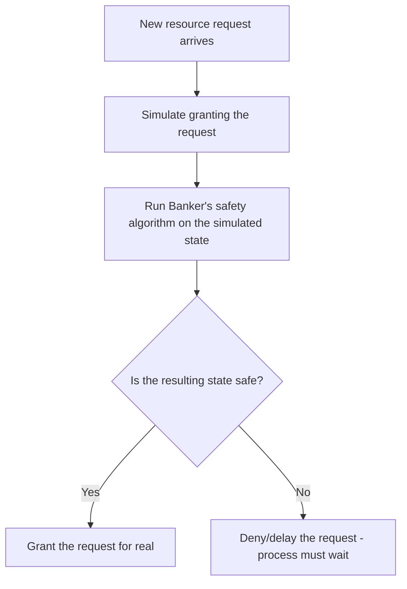
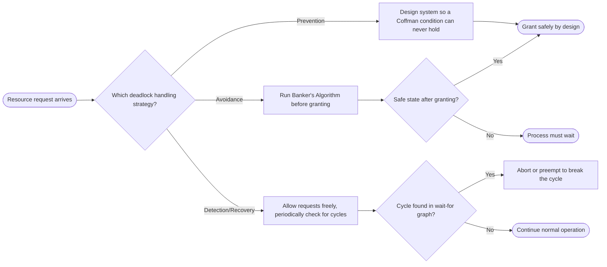

# Deadlocks

> Part of [Phase 05 — Operating Systems](./README.md)

---

## What is it?

A deadlock is a situation where a group of processes are **each waiting for a resource held by another process in the same group**, forming a cycle of waiting that can NEVER resolve itself — every process is stuck forever, holding what it has and waiting for something that will never come.

## Why do we need it?

Synchronization (locks, semaphores) prevents race conditions, but it introduces a new risk: if processes acquire multiple shared resources in an uncoordinated way, they can end up in a permanent standoff. Understanding deadlock's causes, and the strategies to prevent, avoid, or recover from it, is essential for building any system where multiple processes compete for limited resources — from operating systems to databases to distributed systems.

## Real-world analogy

Think of deadlock like two cars meeting on a single-lane bridge from opposite directions, each having already driven halfway across. Neither can go forward (the other car blocks the way) and neither wants to reverse. Both cars sit there, forever, unless some outside intervention (a driver backs up) breaks the standoff.

```text
Car A -->  [bridge, one lane]  <-- Car B
       (both stuck, neither can proceed, neither will reverse)
```

## Historical background

- Deadlock as a formal problem was recognized early in the development of **multiprogramming operating systems** in the 1960s, as systems began allowing multiple processes to hold and request resources concurrently.
- **Edsger Dijkstra** introduced the famous **Dining Philosophers Problem** in 1965, a canonical illustration of both synchronization and deadlock.
- The **Banker's Algorithm**, also developed by Dijkstra, provided the first rigorous method for DEADLOCK AVOIDANCE — deciding, before granting a resource request, whether doing so could ever lead to deadlock.
- Formal characterization of deadlock's four necessary conditions (Coffman et al., 1971) remains the standard framework used to reason about deadlock prevention to this day.

## Mathematical foundation

**Level 1 — Explain it to a 15-year-old:**

Imagine two kids each holding one puzzle piece the OTHER kid needs to finish their own puzzle. Kid A says "I'll trade you my piece once you give me yours," and Kid B says the exact same thing back. Neither will give up their piece first, so neither puzzle ever gets finished — that's a deadlock.

**Level 2 — Engineering Level:**

Deadlock can be modeled using a **Resource Allocation Graph**: processes and resources are nodes; an edge from a process to a resource means the process is REQUESTING it; an edge from a resource to a process means the resource is currently ALLOCATED to it. A deadlock exists (for single-instance resource types) if and only if this graph contains a CYCLE.

**Level 3 — Industry Level:**

Database systems face deadlock constantly when transactions lock multiple rows/tables in different orders. Production systems typically use **deadlock DETECTION** (periodically scanning for cycles in a wait-for graph) combined with **recovery** (aborting and rolling back one of the deadlocked transactions) rather than the more restrictive (and often impractical) prevention or avoidance strategies — since real database workloads rarely know their full resource needs in advance.

**Level 4 — Research Level:**

Research into deadlock detection and recovery for **distributed systems** is significantly harder than the single-machine case, since no single node has a complete, up-to-date view of the global wait-for graph — requiring distributed algorithms (e.g., the Chandy-Misra-Haas algorithm) that can correctly detect deadlocks spanning multiple machines despite network delays and partial failures.

## Formal definition

A deadlock exists among a set of processes `{P₁, ..., Pₙ}` if each process `Pᵢ` is waiting for a resource held by another process `Pⱼ` in the set, forming a cycle: `P₁ → P₂ → ... → Pₙ → P₁`, where `Pᵢ → Pⱼ` means `Pᵢ` is waiting for a resource held by `Pⱼ`. **Coffman's Conditions** state that ALL FOUR of the following must hold SIMULTANEOUSLY for deadlock to be possible:

```
1. Mutual Exclusion    : at least one resource must be held in a non-shareable mode
2. Hold and Wait       : a process holding at least one resource is waiting to acquire more
3. No Preemption       : resources cannot be forcibly taken away; only voluntarily released
4. Circular Wait       : a cycle exists in the wait-for relationships among processes
```

## Core concepts

- **Coffman's Four Conditions** — the necessary (and jointly sufficient) conditions for deadlock to be possible
- **Resource Allocation Graph** — a graphical model of process-resource requests and allocations, used to detect deadlock visually
- **Deadlock Prevention** — designing the system so at least one of Coffman's conditions can NEVER hold
- **Deadlock Avoidance** — dynamically checking, BEFORE granting a resource request, whether doing so could lead to deadlock (e.g., the Banker's Algorithm)
- **Deadlock Detection and Recovery** — allowing deadlock to occur, but periodically checking for it and taking corrective action (aborting a process, preempting a resource)
- **Safe State** — a system state from which there EXISTS some ordering of process completions that avoids deadlock

## Internal working

The Banker's Algorithm internally works by simulating, for each resource request, whether granting it would leave the system in a **safe state** — meaning there's still SOME sequence in which every process could eventually obtain all resources it might need and complete. If no such safe sequence would exist after granting the request, the algorithm makes the process WAIT instead, even though resources might currently be available — proactively avoiding deadlock rather than just detecting it after the fact.

## Step-by-step explanation

**How the Banker's Algorithm determines a safe state, step by step:**

1. Compute the `Need` matrix: `Need[i][j] = Max[i][j] - Allocation[i][j]` (how much MORE of each resource type process `i` might still request).
2. Start with the current `Available` vector (resources not currently allocated to anyone).
3. Find any process `i` (not yet marked finished) whose `Need[i]` can be fully satisfied by the current `Available` vector.
4. If found, PRETEND this process runs to completion and releases all its resources: add `Allocation[i]` back to `Available`, and mark process `i` as finished.
5. Repeat steps 3–4 until either ALL processes are marked finished (the state IS safe, and a safe sequence exists) or NO remaining process can be satisfied (the state is UNSAFE — deadlock risk).

## Visual diagram



## Architecture diagram

```text
Resource Allocation Graph showing a deadlock (single-instance resources):

  P1 ---requests---> R1 ---allocated to---> P2
   ^                                          |
   |                                          |
   '------------ allocated to ---- R2 <--- requests

Cycle: P1 -> R1 -> P2 -> R2 -> P1   -> DEADLOCK DETECTED
(P1 holds R2, wants R1; P2 holds R1, wants R2 - neither can proceed)
```

## Flowchart



---

## Worked Example: Banker's Algorithm

**Given:** a system with 3 resource types (A, B, C), 5 processes (P0–P4), and the following state:

**Allocation Matrix** (currently allocated to each process):

| Process | A   | B   | C   |
| ------- | --- | --- | --- |
| P0      | 0   | 1   | 0   |
| P1      | 2   | 0   | 0   |
| P2      | 3   | 0   | 2   |
| P3      | 2   | 1   | 1   |
| P4      | 0   | 0   | 2   |

**Max Matrix** (maximum each process might ever request):

| Process | A   | B   | C   |
| ------- | --- | --- | --- |
| P0      | 7   | 5   | 3   |
| P1      | 3   | 2   | 2   |
| P2      | 9   | 0   | 2   |
| P3      | 2   | 2   | 2   |
| P4      | 4   | 3   | 3   |

**Total resources in the system:** A=10, B=5, C=7

**Step 1 — Compute Available:**

```
Available = Total - Sum(Allocation)
Sum of Allocation column A = 0+2+3+2+0 = 7   -> Available[A] = 10-7 = 3
Sum of Allocation column B = 1+0+0+1+0 = 2   -> Available[B] = 5-2 = 3
Sum of Allocation column C = 0+0+2+1+2 = 5   -> Available[C] = 7-5 = 2

Available = (3, 3, 2)
```

**Step 2 — Compute Need matrix (Need = Max - Allocation):**

| Process | A     | B     | C     |
| ------- | ----- | ----- | ----- |
| P0      | 7-0=7 | 5-1=4 | 3-0=3 |
| P1      | 3-2=1 | 2-0=2 | 2-0=2 |
| P2      | 9-3=6 | 0-0=0 | 2-2=0 |
| P3      | 2-2=0 | 2-1=1 | 2-1=1 |
| P4      | 4-0=4 | 3-0=3 | 3-2=1 |

**Step 3 — Run the Safety Algorithm:**

```
Available = (3, 3, 2)

Check P0: Need=(7,4,3). Is (7,4,3) <= (3,3,2)? NO (7>3) -> P0 must wait, skip for now.
Check P1: Need=(1,2,2). Is (1,2,2) <= (3,3,2)? YES!
    -> P1 can finish. Release its allocation: Available += (2,0,0) = (5,3,2)
    -> Safe sequence so far: [P1]

Check P0: Need=(7,4,3). Is (7,4,3) <= (5,3,2)? NO -> still must wait.
Check P2: Need=(6,0,0). Is (6,0,0) <= (5,3,2)? NO (6>5) -> must wait.
Check P3: Need=(0,1,1). Is (0,1,1) <= (5,3,2)? YES!
    -> P3 can finish. Release: Available += (2,1,1) = (7,4,3)
    -> Safe sequence so far: [P1, P3]

Check P0: Need=(7,4,3). Is (7,4,3) <= (7,4,3)? YES!
    -> P0 can finish. Release: Available += (0,1,0) = (7,5,3)
    -> Safe sequence so far: [P1, P3, P0]

Check P2: Need=(6,0,0). Is (6,0,0) <= (7,5,3)? YES!
    -> P2 can finish. Release: Available += (3,0,2) = (10,5,5)
    -> Safe sequence so far: [P1, P3, P0, P2]

Check P4: Need=(4,3,1). Is (4,3,1) <= (10,5,5)? YES!
    -> P4 can finish. Release: Available += (0,0,2) = (10,5,7)
    -> Safe sequence so far: [P1, P3, P0, P2, P4]

ALL processes finished -> the system IS in a SAFE STATE.
Safe sequence found: <P1, P3, P0, P2, P4>
```

**Interpretation:** because a complete safe sequence exists, the current state is safe, and the system can guarantee ALL processes can eventually complete without deadlock, no matter what order they actually request their remaining `Need` in — this is precisely what the Banker's Algorithm checks before granting EVERY new resource request.

**Testing a NEW request (a very common exam follow-up):** Suppose P1 now requests 1 additional unit of A, 0 of B, 2 of C — i.e., requests `(1,0,2)`.

```
Step 1: Check request <= Need[P1]? Need[P1] = (1,2,2). Is (1,0,2) <= (1,2,2)? YES, valid request.
Step 2: Check request <= Available? Available = (3,3,2). Is (1,0,2) <= (3,3,2)? YES, enough available.
Step 3: PRETEND to grant it:
    Available = (3,3,2) - (1,0,2) = (2,3,0)
    Allocation[P1] = (2,0,0) + (1,0,2) = (3,0,2)
    Need[P1] = (1,2,2) - (1,0,2) = (0,2,0)

Step 4: Re-run the Safety Algorithm on this NEW hypothetical state...
    (following the same process as above, a safe sequence like <P1, P3, P0, P2, P4> still exists)

Result: the request CAN be safely granted.
```

---

## Example

Illustrate the four Coffman conditions using the classic two-process deadlock:

```
Process A: holds Resource 1, requests Resource 2
Process B: holds Resource 2, requests Resource 1

Mutual Exclusion:  YES - each resource can only be held by one process at a time
Hold and Wait:     YES - both processes hold one resource while waiting for another
No Preemption:     YES - neither resource can be forcibly taken away
Circular Wait:     YES - A waits for B, B waits for A -> a cycle

ALL FOUR conditions hold simultaneously -> DEADLOCK
```

## Dry run

Trace a deadlock DETECTION scan over a wait-for graph with processes `P1, P2, P3`:

| Step | Edge Checked                                  | Action                             |
| ---- | --------------------------------------------- | ---------------------------------- |
| 1    | P1 waits for P2                               | add edge P1→P2                     |
| 2    | P2 waits for P3                               | add edge P2→P3                     |
| 3    | P3 waits for P1                               | add edge P3→P1                     |
| 4    | Run cycle detection (DFS, see Phase 2 Graphs) | Cycle found: P1→P2→P3→P1           |
| 5    | Conclusion                                    | DEADLOCK detected among P1, P2, P3 |

## Multiple examples

**Example 1 — Dining Philosophers:** five philosophers each pick up their LEFT fork, then all simultaneously try to pick up their RIGHT fork (held by their neighbor) — a circular wait forms, and everyone starves, holding one fork each, waiting forever for the other.

**Example 2 — Database transaction deadlock:** Transaction A locks Row 1, then wants Row 2; Transaction B locks Row 2, then wants Row 1 — a classic, extremely common real-world database deadlock scenario.

**Example 3 — Deadlock prevention via resource ordering:** if ALL processes are required to always request resources in a fixed global order (e.g., always Resource 1 before Resource 2), circular wait becomes IMPOSSIBLE, preventing deadlock entirely by construction.

## Advantages

_(of understanding and correctly handling deadlock)_

- Prevents entire systems from silently freezing, which can otherwise be extremely difficult to diagnose in production.
- The Banker's Algorithm and similar avoidance techniques provide mathematically rigorous guarantees against deadlock, not just heuristics.
- Deadlock detection combined with automatic recovery (as used in most databases) allows systems to remain flexible while still recovering gracefully from rare deadlock events.

## Disadvantages

- Deadlock PREVENTION (eliminating a Coffman condition entirely) often severely restricts resource utilization and system flexibility.
- Deadlock AVOIDANCE (Banker's Algorithm) requires knowing each process's MAXIMUM possible resource need in advance — often unrealistic in real systems.
- Deadlock DETECTION and RECOVERY requires periodically running (potentially expensive) cycle-detection algorithms, and recovery (aborting a process) has real costs (lost work, rollback).

## Complexity

| Task                                                       | Time Complexity                                                  |
| ---------------------------------------------------------- | ---------------------------------------------------------------- |
| Banker's Algorithm safety check                            | O(n² × m), where n=processes, m=resource types                   |
| Cycle detection in a Resource Allocation Graph (DFS-based) | O(V + E), same as standard graph cycle detection (see Phase 2)   |
| Deadlock recovery (choosing a victim to abort)             | Varies by policy — often O(n) to select based on cost heuristics |

## Memory usage

The Banker's Algorithm requires storing `Allocation`, `Max`, and `Need` matrices, each of size `n × m` (processes × resource types) — modest for typical system sizes, but the requirement to KNOW `Max` in advance is a bigger practical obstacle than the memory cost itself.

## Time complexity

The critical engineering trade-off across all three strategies: **Prevention is cheap to check but restrictive; Avoidance (Banker's Algorithm) is more flexible but computationally costlier (O(n²m) per request) and requires advance knowledge; Detection/Recovery is the most flexible but allows deadlock to actually occur before responding** — real systems (like databases) most often choose detection/recovery specifically because advance resource knowledge is rarely available in practice.

## Best practices

- In systems where resource needs are NOT known in advance (most real-world systems), prefer deadlock DETECTION and RECOVERY over avoidance.
- Where possible, enforce a CONSISTENT GLOBAL ORDER for acquiring multiple locks/resources — this alone prevents circular wait, and thus prevents deadlock, at very low cost.
- Use TIMEOUTS on lock acquisition attempts as a pragmatic, simple defense — if a lock can't be acquired within a reasonable time, back off, release held resources, and retry.
- In database systems, let the database's built-in deadlock detector handle it — manually reasoning about transaction lock ordering across a large application is extremely error-prone.

## Common mistakes

- Confusing deadlock PREVENTION (structural, guarantees no deadlock ever) with AVOIDANCE (dynamic, checks each request) with DETECTION (reactive, finds deadlock after it occurs) — these are three genuinely distinct strategies, frequently confused on exams.
- Forgetting that ALL FOUR Coffman conditions must hold SIMULTANEOUSLY for deadlock — eliminating even ONE condition prevents deadlock entirely.
- Incorrectly computing the `Need` matrix (a common numeric slip: `Need = Max - Allocation`, NOT `Max - Available` or other variations).
- Assuming a cycle in a MULTI-INSTANCE resource allocation graph automatically means deadlock — for resources with MULTIPLE instances, a cycle is NECESSARY but not always SUFFICIENT for deadlock (unlike the single-instance case).

## Interview questions

1. What are the four necessary conditions for deadlock (Coffman's conditions)?
2. Explain the difference between deadlock prevention, avoidance, and detection/recovery.
3. Walk through how the Banker's Algorithm determines whether a state is safe.
4. Given a resource allocation graph, how do you determine if a deadlock exists?
5. Why is deadlock avoidance (Banker's Algorithm) rarely used in real production systems?

## University questions

1. State and explain Coffman's four necessary conditions for deadlock.
2. Given Allocation and Max matrices, compute the Need matrix and determine if the system is in a safe state using the Banker's Algorithm.
3. Explain how eliminating each of the four Coffman conditions individually can prevent deadlock, with examples.
4. Describe the Resource Allocation Graph and how it's used for deadlock detection.

## Coding examples

### Pseudocode

```text
FUNCTION isSafeState(available, maxMatrix, allocation, n, m):
    need = maxMatrix - allocation   // elementwise, for every process/resource
    finished = array of false, size n
    work = copy of available
    safeSequence = []

    REPEAT n times:
        found = false
        FOR i FROM 0 TO n-1:
            IF NOT finished[i] AND need[i] <= work (elementwise):
                work += allocation[i]
                finished[i] = true
                safeSequence.append(i)
                found = true
        IF NOT found: BREAK

    IF all finished: RETURN true, safeSequence
    ELSE: RETURN false, []
```

### Python implementation

```python
def is_safe_state(available, max_matrix, allocation):
    n = len(allocation)       # number of processes
    m = len(available)        # number of resource types
    need = [[max_matrix[i][j] - allocation[i][j] for j in range(m)] for i in range(n)]
    finished = [False] * n
    work = available[:]
    safe_sequence = []

    for _ in range(n):
        found = False
        for i in range(n):
            if not finished[i] and all(need[i][j] <= work[j] for j in range(m)):
                for j in range(m):
                    work[j] += allocation[i][j]
                finished[i] = True
                safe_sequence.append(i)
                found = True
        if not found:
            break

    return (all(finished), safe_sequence)

allocation = [[0,1,0],[2,0,0],[3,0,2],[2,1,1],[0,0,2]]
max_matrix = [[7,5,3],[3,2,2],[9,0,2],[2,2,2],[4,3,3]]
available = [3,3,2]

safe, sequence = is_safe_state(available, max_matrix, allocation)
print(f"Safe: {safe}, Sequence: {sequence}")  # Safe: True, Sequence: [1, 3, 0, 2, 4]
```

### C implementation

```c
#include <stdio.h>
#include <stdbool.h>

#define N 5
#define M 3

bool isSafeState(int available[M], int maxMatrix[N][M], int allocation[N][M]) {
    int need[N][M], work[M];
    bool finished[N] = {false};

    for (int i = 0; i < N; i++)
        for (int j = 0; j < M; j++)
            need[i][j] = maxMatrix[i][j] - allocation[i][j];
    for (int j = 0; j < M; j++) work[j] = available[j];

    int completed = 0;
    while (completed < N) {
        bool found = false;
        for (int i = 0; i < N; i++) {
            if (finished[i]) continue;
            bool canRun = true;
            for (int j = 0; j < M; j++) if (need[i][j] > work[j]) canRun = false;
            if (canRun) {
                for (int j = 0; j < M; j++) work[j] += allocation[i][j];
                finished[i] = true;
                completed++;
                found = true;
            }
        }
        if (!found) return false;
    }
    return true;
}

int main() {
    int allocation[N][M] = {{0,1,0},{2,0,0},{3,0,2},{2,1,1},{0,0,2}};
    int maxMatrix[N][M] = {{7,5,3},{3,2,2},{9,0,2},{2,2,2},{4,3,3}};
    int available[M] = {3,3,2};

    printf("Safe: %s\n", isSafeState(available, maxMatrix, allocation) ? "true" : "false");
    return 0;
}
```

### C++ implementation

```cpp
#include <iostream>
#include <vector>
using namespace std;

pair<bool, vector<int>> isSafeState(vector<int> available, vector<vector<int>>& maxMatrix,
                                      vector<vector<int>>& allocation) {
    int n = allocation.size(), m = available.size();
    vector<vector<int>> need(n, vector<int>(m));
    for (int i = 0; i < n; i++)
        for (int j = 0; j < m; j++)
            need[i][j] = maxMatrix[i][j] - allocation[i][j];

    vector<bool> finished(n, false);
    vector<int> work = available;
    vector<int> safeSequence;

    for (int count = 0; count < n; count++) {
        bool found = false;
        for (int i = 0; i < n; i++) {
            if (finished[i]) continue;
            bool canRun = true;
            for (int j = 0; j < m; j++) if (need[i][j] > work[j]) canRun = false;
            if (canRun) {
                for (int j = 0; j < m; j++) work[j] += allocation[i][j];
                finished[i] = true;
                safeSequence.push_back(i);
                found = true;
            }
        }
        if (!found) return {false, {}};
    }
    return {true, safeSequence};
}

int main() {
    vector<vector<int>> allocation = {{0,1,0},{2,0,0},{3,0,2},{2,1,1},{0,0,2}};
    vector<vector<int>> maxMatrix = {{7,5,3},{3,2,2},{9,0,2},{2,2,2},{4,3,3}};
    vector<int> available = {3,3,2};

    auto [safe, sequence] = isSafeState(available, maxMatrix, allocation);
    cout << "Safe: " << (safe ? "true" : "false") << endl;
    cout << "Sequence: ";
    for (int p : sequence) cout << "P" << p << " ";
    cout << endl;
}
```

### Java implementation

```java
import java.util.*;

public class BankersAlgorithmDemo {
    static boolean[] finished;

    static List<Integer> isSafeState(int[] available, int[][] maxMatrix, int[][] allocation) {
        int n = allocation.length, m = available.length;
        int[][] need = new int[n][m];
        for (int i = 0; i < n; i++)
            for (int j = 0; j < m; j++)
                need[i][j] = maxMatrix[i][j] - allocation[i][j];

        finished = new boolean[n];
        int[] work = available.clone();
        List<Integer> safeSequence = new ArrayList<>();

        for (int count = 0; count < n; count++) {
            boolean found = false;
            for (int i = 0; i < n; i++) {
                if (finished[i]) continue;
                boolean canRun = true;
                for (int j = 0; j < m; j++) if (need[i][j] > work[j]) canRun = false;
                if (canRun) {
                    for (int j = 0; j < m; j++) work[j] += allocation[i][j];
                    finished[i] = true;
                    safeSequence.add(i);
                    found = true;
                }
            }
            if (!found) return null;  // unsafe state
        }
        return safeSequence;
    }

    public static void main(String[] args) {
        int[][] allocation = {{0,1,0},{2,0,0},{3,0,2},{2,1,1},{0,0,2}};
        int[][] maxMatrix = {{7,5,3},{3,2,2},{9,0,2},{2,2,2},{4,3,3}};
        int[] available = {3,3,2};

        List<Integer> sequence = isSafeState(available, maxMatrix, allocation);
        System.out.println("Safe: " + (sequence != null));
        System.out.println("Sequence: " + sequence);  // [1, 3, 0, 2, 4]
    }
}
```

## Visualization

```text
Banker's Algorithm safe sequence discovery:

Available: (3,3,2)
   |
   v
Try P1 (Need 1,2,2 <= 3,3,2? YES) -> finish P1 -> Available: (5,3,2)
   |
   v
Try P3 (Need 0,1,1 <= 5,3,2? YES) -> finish P3 -> Available: (7,4,3)
   |
   v
Try P0 (Need 7,4,3 <= 7,4,3? YES) -> finish P0 -> Available: (7,5,3)
   |
   v
Try P2 (Need 6,0,0 <= 7,5,3? YES) -> finish P2 -> Available: (10,5,5)
   |
   v
Try P4 (Need 4,3,1 <= 10,5,5? YES) -> finish P4 -> Available: (10,5,7)

SAFE SEQUENCE: P1 -> P3 -> P0 -> P2 -> P4
```

## Industry use

- **Database Management Systems** (MySQL, PostgreSQL, Oracle) implement deadlock DETECTION as a standard feature, automatically rolling back one transaction (the "victim") when a deadlock cycle is detected among competing transactions.
- **Distributed systems and microservices**: distributed transaction managers must detect deadlocks spanning multiple services/machines, a significantly harder problem than the single-machine case.
- **Operating system kernels**: careful, consistent lock-ordering discipline is used throughout kernel code to prevent deadlock among internal kernel data structure locks.
- **Concurrent programming frameworks**: many provide built-in deadlock detection tools (e.g., Java's `ThreadMXBean` can detect deadlocked threads) to aid debugging.

## Research relevance

Research into **distributed deadlock detection** (e.g., the Chandy-Misra-Haas algorithm) addresses how to correctly detect deadlocks spanning multiple machines despite network delays, partial failures, and the lack of a single global view — directly relevant to modern distributed databases and microservice architectures. Research into deadlock-free CONCURRENT DATA STRUCTURE design (often using lock-free techniques) aims to sidestep the problem entirely rather than detect/recover from it.

## Related concepts

- Synchronization (deadlock is a specific FAILURE MODE that can arise from synchronization primitives used incorrectly — see [`Synchronization.md`](./Synchronization.md))
- Graphs, Phase 2 (the Resource Allocation Graph and cycle detection directly reuse graph traversal algorithms)
- Process (deadlocked processes remain stuck in the Waiting state indefinitely — see [`Process.md`](./Process.md))

## Practice problems

1. Given a different Allocation/Max/Available scenario, run the Banker's Algorithm by hand to determine if the state is safe.
2. Draw a Resource Allocation Graph for three processes and two single-instance resources that results in a deadlock, and one that does not.
3. Explain how enforcing a strict global lock-acquisition order prevents deadlock, using Coffman's conditions.
4. Research and explain the Chandy-Misra-Haas distributed deadlock detection algorithm at a high level.

## Advanced concepts

- **Wait-Die and Wound-Wait Schemes** — timestamp-based deadlock PREVENTION techniques commonly used in database systems, using transaction age to decide whether a requesting transaction should wait or be aborted.
- **Chandy-Misra-Haas Algorithm** — a distributed deadlock detection algorithm for systems where no single machine has a complete view of the resource allocation state.
- **Livelock** — a related but DISTINCT failure mode where processes continuously change state in response to each other WITHOUT making progress (unlike deadlock, where processes are simply stuck/blocked) — a common point of confusion worth understanding precisely.

## Summary

Deadlock is a permanent standstill arising when Coffman's four conditions (mutual exclusion, hold-and-wait, no preemption, circular wait) hold simultaneously. Systems handle this risk via prevention (structurally eliminating a condition), avoidance (the Banker's Algorithm, dynamically checking safety before granting requests), or detection and recovery (allowing deadlock but responding when it's found) — with real-world systems, like databases, most often favoring detection and recovery due to the impracticality of knowing resource needs in advance.

## Key takeaways

- Deadlock requires ALL FOUR Coffman conditions simultaneously: mutual exclusion, hold-and-wait, no preemption, circular wait.
- The Banker's Algorithm determines a SAFE state by simulating whether some ordering of process completions exists — memorize the `Need = Max - Allocation` formula and the iterative safety-check procedure.
- Prevention, avoidance, and detection/recovery are three genuinely distinct strategies with different trade-offs — real systems (databases) usually favor detection/recovery.
- A cycle in a single-instance Resource Allocation Graph guarantees deadlock; for multi-instance resources, a cycle is necessary but not always sufficient.

## References

- Coffman, E.G., Elphick, M., Shoshani, A. (1971). _System Deadlocks_.
- Dijkstra, E.W. — origin of the Banker's Algorithm.
- Silberschatz, A., Galvin, P., Gagne, G. _Operating System Concepts_, Chapter 8.
- Chandy, K.M., Misra, J., Haas, L.M. (1983). _Distributed Deadlock Detection_.

---

⬅ Back to [Phase 05 — Operating Systems README](./README.md)
