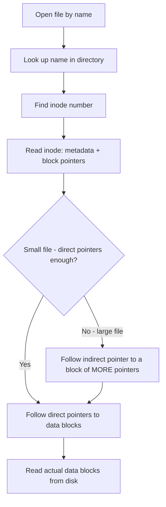
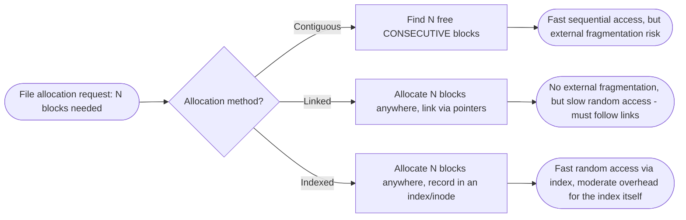

# File System

> Part of [Phase 05 — Operating Systems](./README.md)

---

## What is it?

A File System is the part of the operating system responsible for **organizing, naming, storing, and retrieving data on persistent storage** (hard drives, SSDs) — providing the abstraction of named "files" and "directories" on top of the raw, low-level array of storage blocks a physical disk actually presents.

## Why do we need it?

Physical storage devices are just enormous arrays of numbered blocks — they have no inherent concept of "files," "folders," names, or permissions. Without a file system, every program would need to manually track which raw disk blocks belong to which piece of data, with no naming, no organization, and no protection from other programs overwriting the same blocks. File systems provide the essential organizing structure, naming, and safety guarantees that make persistent storage usable at all.

## Real-world analogy

Think of raw disk storage like an enormous warehouse of identical, numbered storage bins with NOTHING written on them to indicate what's inside. A file system is like the warehouse's inventory management system: it assigns meaningful names to groups of bins ("Alice's Tax Documents"), tracks exactly which bins belong to which named item, organizes related items into labeled sections (directories/folders), and prevents two people from unknowingly using the same bins for different things.

```text
Raw Disk (just numbered blocks):        File System's View:
[Block 0][Block 1][Block 2]...          /home/alice/notes.txt  -> blocks 5, 12, 33
                                          /home/alice/photo.jpg  -> blocks 8, 9, 10, 41
```

## Historical background

- Early computers (1950s) had NO file systems at all — data was manually managed on punch cards or magnetic tape in raw, sequential form.
- The **CTSS (Compatible Time-Sharing System, MIT, 1961)** introduced one of the first hierarchical file systems, with the important innovation of separate directories for each user.
- **Unix (1969–73)** introduced an elegantly simple, highly influential file system design: everything is either a "regular file" or a "directory" (itself just a special file listing name-to-inode mappings), a philosophy ("everything is a file") that extended even to devices and interprocess communication.
- **Journaling file systems** (introduced widely through the 1990s, e.g., ext3, NTFS) added crash-recovery guarantees by logging planned changes before actually making them, dramatically improving reliability after unexpected power loss or crashes.

## Mathematical foundation

**Level 1 — Explain it to a 15-year-old:**

Imagine a library where every book is chopped into individual pages, and those pages are scattered randomly across many different shelves — but the librarian keeps a master catalog card for each book, listing EXACTLY which shelf and position holds each of its pages. That catalog card is like an "inode" — it doesn't hold the book's actual content, just the map showing where all its pieces really are.

**Level 2 — Engineering Level:**

A file system must solve the **allocation problem**: how to map a logical file (a sequence of bytes) onto the PHYSICAL blocks of a storage device, which are typically NOT contiguous (due to fragmentation over time from files being created, resized, and deleted). Common solutions include contiguous allocation, linked allocation, and indexed allocation (using an **inode**, a per-file data structure listing its block locations).

**Level 3 — Industry Level:**

Production file systems (ext4, NTFS, APFS) use **journaling** to guarantee crash consistency: before making a change to the file system's actual structure, the intended change is first written to a sequential log ("journal"). If the system crashes mid-operation, the journal allows the file system to either complete or cleanly roll back the interrupted operation upon reboot, avoiding corruption.

**Level 4 — Research Level:**

Research into file systems for modern hardware (SSDs, persistent memory) explores how to redesign traditional disk-oriented file system structures (optimized for spinning magnetic disks, where sequential access is much faster than random access) for storage media with very different performance characteristics — SSDs, for instance, have no seek-time penalty for random access but suffer from limited write endurance, motivating techniques like log-structured file systems and wear leveling.

## Formal definition

A file system maps a hierarchical namespace of directories and file names to underlying storage blocks, maintaining for each file: its data blocks, metadata (size, permissions, timestamps), and a mechanism to locate all its blocks (direct pointers, indirect pointers, or an equivalent indexing structure, typically stored in an **inode**).

## Core concepts

- **File** — a named collection of related data, treated as a single logical unit
- **Directory** — a special file mapping names to other files/directories, forming a hierarchical namespace
- **Inode** — a data structure storing a file's metadata and the locations of its data blocks (used in Unix-style file systems)
- **File Allocation Methods** — contiguous, linked, and indexed allocation, each with different trade-offs
- **Journaling** — logging intended changes before making them, to guarantee crash recovery consistency
- **Free Space Management** — tracking which disk blocks are currently unused and available for new allocations

## Internal working

When a Unix-style file system opens a file, it looks up the file's NAME in the relevant directory to find its **inode number**, then reads that inode to find the file's metadata and the list (or index structure) of physical blocks holding its actual data — separating the human-readable NAME (in the directory) from the underlying physical STORAGE LOCATION (in the inode), which is exactly what allows features like hard links (multiple names pointing to the same inode).

## Step-by-step explanation

**How indexed allocation (inode-based) resolves a file read, step by step:**

1. The OS looks up the file's name in its containing directory, finding the corresponding inode number.
2. The OS reads the inode, which contains direct pointers to the file's first several data blocks, plus (for larger files) an indirect pointer to a block that itself contains MORE pointers (and potentially double/triple indirect pointers for very large files).
3. To read a specific byte offset within the file, the OS calculates which block contains that offset, and follows the appropriate direct/indirect pointer chain to locate it.
4. The OS reads the actual data block(s) from disk into memory (often via the virtual memory / page cache system — see [`Virtual-Memory.md`](./Virtual-Memory.md)) and returns the requested data to the application.

## Visual diagram



## Architecture diagram

```text
Inode structure (simplified Unix-style):

Inode:
  metadata: size, permissions, owner, timestamps
  direct pointers:   [block 5] [block 12] [block 33] [block 8] ... (up to ~12 direct)
  single indirect:   --------> [points to a block full of MORE block pointers]
  double indirect:   --------> [points to a block of pointers to blocks of pointers]

Small files: fully covered by direct pointers, very fast access.
Large files: require following indirect pointer chains, one extra disk read per level.
```

## Flowchart



## Example

Compare the three classic file allocation methods for a file needing 4 blocks:

```
CONTIGUOUS ALLOCATION:
File occupies blocks 10,11,12,13 (consecutive)
+ Fast sequential AND random access (just compute: start_block + offset)
- Suffers external fragmentation over time as files are created/deleted (see Memory-Management.md)

LINKED ALLOCATION:
File occupies blocks 7 -> 15 -> 3 -> 22 (scattered, each block points to the next)
+ No external fragmentation - any free block can be used
- Slow random access (must follow the chain from the start every time)
- Reliability risk: a single corrupted pointer breaks the rest of the chain

INDEXED ALLOCATION (inode-based):
File's inode directly lists: [block 7, block 15, block 3, block 22]
+ Fast random access (look up the Nth block directly in the index)
+ No external fragmentation
- Small overhead: the index itself takes some space (though usually minor for typical files)
```

## Dry run

Trace journaling recovering from a crash mid-write:

| Step | Action                                                                      | Journal State                         |
| ---- | --------------------------------------------------------------------------- | ------------------------------------- |
| 1    | Begin transaction: "move file X from dir A to dir B"                        | Journal: [transaction started]        |
| 2    | Write INTENDED changes to journal (not yet applied to real structures)      | Journal: [remove from A, add to B]    |
| 3    | Mark transaction as committed in journal                                    | Journal: [committed]                  |
| 4    | **CRASH occurs right here, before real structures are updated**             | —                                     |
| 5    | On reboot: OS scans journal, finds committed-but-unapplied transaction      | Journal: [committed, not yet applied] |
| 6    | OS REPLAYS the transaction: applies the change to real directory structures | File successfully moved, consistent   |

Because the transaction was marked "committed" in the journal BEFORE the crash, the OS knows it's safe (and necessary) to complete it on reboot — this exact mechanism is what prevents file system corruption after unexpected power loss.

## Multiple examples

**Example 1 — Hard links:** two different file NAMES (in possibly different directories) can point to the SAME inode — meaning the same underlying data — demonstrating the separation between naming (directory) and storage (inode).

**Example 2 — File deletion:** deleting a file typically just removes its directory entry and decrements a reference count on its inode; the actual data blocks aren't necessarily overwritten immediately, which is why "deleted" files can sometimes be recovered by specialized tools.

**Example 3 — Directory as a special file:** a directory is itself just a file whose CONTENTS are a list of (filename, inode number) pairs — directories are not a fundamentally different kind of object, just a specially-interpreted file.

## Advantages

- Provides a clean, human-usable abstraction (names, hierarchy) over raw, meaningless disk blocks.
- Indexed allocation (inodes) provides fast random access AND avoids external fragmentation, combining the best properties of contiguous and linked allocation.
- Journaling provides strong crash-consistency guarantees, protecting data integrity even after unexpected power loss.

## Disadvantages

- File system metadata (inodes, directory structures, journal) itself consumes disk space and adds processing overhead.
- Even with journaling, file systems can still suffer performance overhead from the extra journal writes on every metadata-changing operation.
- Fragmentation (both internal, from block-size allocation granularity, and in some allocation schemes, external) remains an ongoing concern requiring periodic maintenance in some systems.

## Complexity

| Operation                | Contiguous                                   | Linked                               | Indexed (Inode)                                              |
| ------------------------ | -------------------------------------------- | ------------------------------------ | ------------------------------------------------------------ |
| Sequential access        | O(1) per block (just increment)              | O(1) per block (follow next pointer) | O(1) per block (follow index)                                |
| Random access to block N | O(1) (direct calculation)                    | O(N) (must follow chain from start)  | O(1) (direct index lookup, or O(levels) for indirect blocks) |
| File growth              | Difficult (may need to relocate entire file) | Easy (just link a new block)         | Easy (add to index, may need new indirect block)             |

## Memory usage

Inodes themselves consume a small, fixed amount of storage per file (independent of file size), while the OS typically caches recently-used inodes and directory entries in RAM (via the page cache/buffer cache) to avoid repeated slow disk reads for frequently accessed files.

## Time complexity

The critical practical lesson: **indexed allocation (inodes) is the industry-standard choice precisely because it achieves O(1) random block access (like contiguous allocation) WITHOUT suffering external fragmentation (like linked allocation)** — this is why virtually every modern general-purpose file system (ext4, NTFS, APFS) uses some form of indexed allocation.

## Best practices

- Use journaling (or copy-on-write file systems like ZFS/Btrfs) in any system where data integrity after a crash matters — which is nearly always.
- Understand the difference between hard links (same inode, same underlying data) and symbolic links (a separate file just containing a PATH string) when designing systems that reference files by multiple names.
- Periodically monitor and, if needed, defragment file systems that are still susceptible to fragmentation, especially on spinning disks (SSDs are far less sensitive to fragmentation due to lacking mechanical seek time).

## Common mistakes

- Confusing a file's NAME (stored in a directory entry) with the file's actual DATA/identity (represented by its inode) — this distinction is exactly what makes hard links possible and is a frequent source of confusion.
- Assuming file deletion immediately and securely erases data — in most file systems, deletion just removes the directory entry/reference, leaving actual data recoverable until overwritten.
- Forgetting that linked allocation has POOR random access performance (must traverse from the start) despite having no external fragmentation.
- Treating journaling as making a file system "crash-proof" — it protects METADATA consistency, but doesn't necessarily guarantee no data loss for changes that were in-flight but not yet journaled/committed.

## Interview questions

1. Explain the difference between contiguous, linked, and indexed file allocation methods.
2. What is an inode, and what does it store?
3. How does journaling protect a file system from corruption after a crash?
4. What is the difference between a hard link and a symbolic link?
5. Why do modern file systems generally prefer indexed allocation over the alternatives?

## University questions

1. Compare contiguous, linked, and indexed allocation in terms of access time and fragmentation.
2. Explain the role of direct, single indirect, and double indirect pointers in an inode.
3. Describe how journaling file systems recover from a crash during a metadata update.
4. Explain the difference between a file and a directory in a Unix-style file system.

## Coding examples

### Pseudocode

```text
FUNCTION readFileBlock(inode, logicalBlockNumber):
    IF logicalBlockNumber < NUM_DIRECT_POINTERS:
        RETURN inode.directPointers[logicalBlockNumber]
    ELSE:
        remaining = logicalBlockNumber - NUM_DIRECT_POINTERS
        indirectBlock = readBlock(inode.singleIndirectPointer)
        RETURN indirectBlock.pointers[remaining]
```

### Python implementation

```python
class Inode:
    def __init__(self, direct_pointers, indirect_block=None):
        self.direct_pointers = direct_pointers   # e.g., 12 direct block pointers
        self.indirect_block = indirect_block      # list of pointers, if file is large

def read_file_block(inode, logical_block_number):
    num_direct = len(inode.direct_pointers)
    if logical_block_number < num_direct:
        return inode.direct_pointers[logical_block_number]
    else:
        remaining = logical_block_number - num_direct
        if inode.indirect_block is None or remaining >= len(inode.indirect_block):
            raise IndexError("Block number out of range for this file")
        return inode.indirect_block[remaining]

# Small file: 3 direct blocks
small_file = Inode(direct_pointers=[101, 102, 103])
print(read_file_block(small_file, 1))  # 102

# Large file: 2 direct + indirect block with 3 more
large_file = Inode(direct_pointers=[201, 202], indirect_block=[301, 302, 303])
print(read_file_block(large_file, 3))  # 302 (index 1 in the indirect block)
```

### C implementation

```c
#include <stdio.h>

#define NUM_DIRECT 4

struct Inode {
    int directPointers[NUM_DIRECT];
    int indirectBlock[10];
    int indirectCount;
};

int readFileBlock(struct Inode* inode, int logicalBlockNumber) {
    if (logicalBlockNumber < NUM_DIRECT) {
        return inode->directPointers[logicalBlockNumber];
    } else {
        int remaining = logicalBlockNumber - NUM_DIRECT;
        if (remaining >= inode->indirectCount) return -1;  // out of range
        return inode->indirectBlock[remaining];
    }
}

int main() {
    struct Inode file = {
        .directPointers = {101, 102, 103, 104},
        .indirectBlock = {201, 202, 203},
        .indirectCount = 3
    };

    printf("Block 2: %d\n", readFileBlock(&file, 2));  // 103 (direct)
    printf("Block 5: %d\n", readFileBlock(&file, 5));  // 202 (indirect)
    return 0;
}
```

### C++ implementation

```cpp
#include <iostream>
#include <vector>
using namespace std;

struct Inode {
    vector<int> directPointers;
    vector<int> indirectBlock;
};

int readFileBlock(Inode& inode, int logicalBlockNumber) {
    int numDirect = inode.directPointers.size();
    if (logicalBlockNumber < numDirect) {
        return inode.directPointers[logicalBlockNumber];
    }
    int remaining = logicalBlockNumber - numDirect;
    if (remaining >= (int)inode.indirectBlock.size()) return -1;
    return inode.indirectBlock[remaining];
}

int main() {
    Inode file = {{101, 102, 103, 104}, {201, 202, 203}};

    cout << "Block 2: " << readFileBlock(file, 2) << endl;  // 103
    cout << "Block 5: " << readFileBlock(file, 5) << endl;  // 202
}
```

### Java implementation

```java
import java.util.*;

public class FileSystemDemo {
    static class Inode {
        List<Integer> directPointers;
        List<Integer> indirectBlock;
        Inode(List<Integer> direct, List<Integer> indirect) {
            directPointers = direct;
            indirectBlock = indirect;
        }
    }

    static int readFileBlock(Inode inode, int logicalBlockNumber) {
        int numDirect = inode.directPointers.size();
        if (logicalBlockNumber < numDirect) {
            return inode.directPointers.get(logicalBlockNumber);
        }
        int remaining = logicalBlockNumber - numDirect;
        if (inode.indirectBlock == null || remaining >= inode.indirectBlock.size()) return -1;
        return inode.indirectBlock.get(remaining);
    }

    public static void main(String[] args) {
        Inode file = new Inode(List.of(101, 102, 103, 104), List.of(201, 202, 203));

        System.out.println("Block 2: " + readFileBlock(file, 2));  // 103
        System.out.println("Block 5: " + readFileBlock(file, 5));  // 202
    }
}
```

## Visualization

```text
Inode block resolution for a file with 4 direct pointers + indirect block:

Logical Block:  0    1    2    3    4    5    6
Pointer Source: D0   D1   D2   D3   I0   I1   I2
                <---direct--->    <---indirect--->

Reading logical block 5:
  5 >= 4 (num direct) -> look in indirect block at position (5-4)=1 -> I1
```

## Industry use

- **ext4** (Linux's default file system for many years) — a journaling, inode-based file system directly implementing the concepts in this chapter.
- **NTFS** (Windows) — uses a Master File Table (conceptually similar to inodes) plus journaling for crash consistency.
- **APFS** (Apple's modern file system) and **ZFS/Btrfs** — use copy-on-write techniques (an alternative to traditional journaling) for even stronger crash consistency and features like instant snapshots.
- **Cloud object storage** (Amazon S3, etc.) — while not a traditional hierarchical file system, borrows conceptually from these ideas (naming, metadata) while trading strict hierarchy for massive horizontal scalability.

## Research relevance

Research into file systems for **SSDs and persistent memory** explores how to redesign traditional disk-optimized structures (built assuming slow random access, common in spinning disks) for storage media with very different performance profiles — including log-structured file systems, wear-leveling for limited-write-cycle flash storage, and file systems designed to exploit byte-addressable persistent memory directly.

## Related concepts

- Memory Management (the OS page/buffer cache caches file data in RAM using the same underlying memory management machinery — see [`Memory-Management.md`](./Memory-Management.md))
- Virtual Memory (memory-mapped files bridge file systems and virtual memory directly — see [`Virtual-Memory.md`](./Virtual-Memory.md))
- Trees, Phase 2 (directory hierarchies and B-Tree-based file system indexes directly reuse tree concepts)

## Practice problems

1. Compare the maximum file size supported by an inode with 12 direct pointers, 1 single indirect pointer, and 1 double indirect pointer, given a block size of 4 KB and 4-byte pointers (this is a classic, calculation-heavy exam question).
2. Explain, step by step, how journaling recovers a file system after a crash occurring mid-write.
3. Design a simple directory structure (as a tree) for a small file system with 3 users, each having a home directory.
4. Research and explain the difference between journaling and copy-on-write approaches to crash consistency.

## Advanced concepts

- **Copy-on-Write File Systems** (ZFS, Btrfs, APFS) — never overwrite data in place; instead, write changes to NEW blocks and atomically update pointers, providing strong crash consistency and enabling instant, space-efficient snapshots.
- **Log-Structured File Systems** — treat the ENTIRE disk as a sequential log, writing all changes sequentially (never overwriting in place), particularly well-suited to flash storage's write characteristics.
- **Distributed File Systems** (HDFS, Google File System) — extend file system concepts across many machines, adding replication and fault tolerance for massive-scale, fault-prone commodity hardware.

## Summary

File systems provide the essential organizing abstraction — named files and hierarchical directories — over the raw block storage a physical disk actually presents, using inodes (or similar indexed structures) to efficiently locate a file's data, and journaling (or copy-on-write) to guarantee consistency even after unexpected crashes. Indexed allocation's combination of fast random access and freedom from external fragmentation is exactly why it dominates modern file system design.

## Key takeaways

- File systems separate NAMING (directories) from actual DATA LOCATION (inodes) — this separation is what enables features like hard links.
- Indexed allocation (inodes) combines the best properties of contiguous (fast random access) and linked (no external fragmentation) allocation.
- Journaling logs intended changes before applying them, allowing safe recovery after a crash.
- Direct, single indirect, and double indirect pointers let a fixed-size inode support both small and very large files efficiently.

## References

- Silberschatz, A., Galvin, P., Gagne, G. _Operating System Concepts_, Chapters 11–12.
- Ritchie, D., Thompson, K. (1974). _The UNIX Time-Sharing System_.
- Rosenblum, M., Ousterhout, J. (1992). _The Design and Implementation of a Log-Structured File System_.
- Arpaci-Dusseau, R., Arpaci-Dusseau, A. _Operating Systems: Three Easy Pieces_, "Persistence" chapters.

---

⬅ Back to [Phase 05 — Operating Systems README](./README.md)
