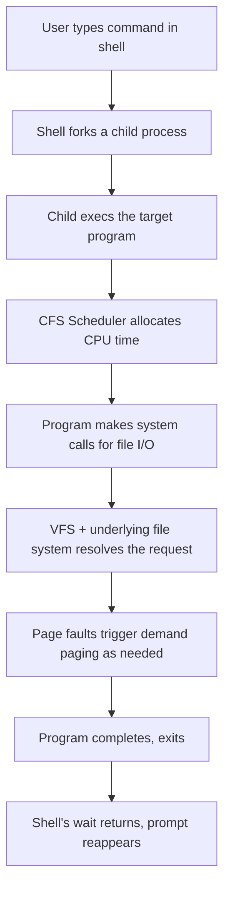
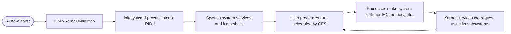

# Linux

> Part of [Phase 05 — Operating Systems](./README.md)

---

## What is it?

Linux is a free, open-source, Unix-like operating system **kernel**, originally created by **Linus Torvalds in 1991**, that has grown into the dominant operating system for servers, cloud infrastructure, supercomputers, and (via Android) mobile devices. This chapter is the **capstone** of Phase 5 — not a new abstract concept, but a demonstration of how every idea covered so far (processes, threads, scheduling, synchronization, deadlocks, memory management, virtual memory, file systems) is implemented and directly observable in a single, real, massively-used production operating system.

## Why do we need it?

All the theory in this phase is only half the value — the other half is seeing it made REAL. Linux is uniquely valuable for this because it is both open-source (its actual implementation is fully readable) and dominant in the real world (understanding it directly translates to practical, employable systems knowledge). This chapter closes the loop between "here's the theory" and "here's exactly how it looks when you run `ps aux` on your own machine."

## Real-world analogy

If the rest of this phase was like studying the blueprints and engineering principles behind bridges in general, this chapter is like walking across an actual, specific, famous bridge — pointing at real physical girders and cables and saying "THIS is the tension member we discussed, THIS is the load-bearing arch" — turning abstract engineering theory into something you can directly see, touch, and verify with your own commands.

## Historical background

- **Linus Torvalds**, a Finnish computer science student, began writing Linux in **1991** as a personal project, inspired by MINIX (a small teaching Unix-like OS) and frustrated by its licensing restrictions.
- Linux was released under the **GNU General Public License (GPL)**, combining with the pre-existing **GNU Project's** (started 1983 by Richard Stallman) userland tools to form a complete, free operating system — often more precisely called "GNU/Linux."
- Through the 1990s-2000s, Linux grew from a hobbyist project into the dominant operating system for web servers, and later, cloud infrastructure (AWS, Google Cloud, Azure run overwhelmingly on Linux).
- **Android** (2008), built on the Linux kernel, made Linux — indirectly — the most widely deployed operating system kernel on Earth by device count.

## Mathematical foundation

**Level 1 — Explain it to a 15-year-old:**

Every abstract idea we've discussed in this phase — processes, scheduling, memory paging, file systems — isn't just theory invented for textbooks. Linux is a REAL, working implementation of all of it, running on billions of devices right now, including quite possibly the servers that delivered this very document to you. This chapter is where "textbook OS" meets "actual OS you can open a terminal and poke at."

**Level 2 — Engineering Level:**

The Linux kernel implements: a **process/thread model** (via the unified `task_struct`, where threads are essentially processes that share certain resources), the **Completely Fair Scheduler (CFS)** for CPU scheduling, a rich set of **synchronization primitives** (mutexes, spinlocks, RCU), **demand-paged virtual memory** with its own page replacement heuristics, and support for numerous **file systems** (ext4, XFS, Btrfs) through a unified Virtual File System (VFS) abstraction layer.

**Level 3 — Industry Level:**

Understanding Linux's process/resource model directly explains modern infrastructure: **containers** (Docker) are built from Linux **namespaces** (isolating what a process can SEE — its own process list, network interfaces, filesystem view) and **cgroups** (limiting what a process can USE — CPU, memory, I/O bandwidth) — NOT full virtual machines, which is exactly why containers are so much lighter-weight and faster to start than VMs.

**Level 4 — Research Level:**

Linux remains a major platform for OS research: new scheduling algorithms, memory management techniques (like transparent huge pages), and file systems (Btrfs, bcachefs) are frequently prototyped and evaluated directly within or alongside the Linux kernel, given its massive real-world deployment provides both a rigorous testing ground and immediate practical impact for successful research.

## Formal definition

The Linux kernel is a **monolithic kernel** (with loadable module support) that provides, as a single privileged program, ALL core OS services — process/memory/file management, device drivers, and networking — running in a privileged CPU mode ("kernel space"), distinct from ordinary user programs ("user space"), which must request kernel services via **system calls**.

## Core concepts

- **Kernel Space vs. User Space** — the privileged mode where the kernel runs, versus the restricted mode ordinary programs run in
- **System Call** — the controlled interface through which user programs request kernel services (e.g., `read()`, `write()`, `fork()`)
- **`task_struct`** — the Linux kernel's unified data structure representing both processes and threads (the PCB/TCB concept made concrete)
- **Completely Fair Scheduler (CFS)** — Linux's default CPU scheduler, using a red-black tree to efficiently track and select the process with the least accumulated "virtual runtime"
- **Namespaces** — kernel mechanisms providing per-process ISOLATED views of system resources (process IDs, network interfaces, mount points), foundational to containers
- **cgroups (Control Groups)** — kernel mechanisms LIMITING and accounting for a process group's resource usage (CPU, memory, I/O)
- **Virtual File System (VFS)** — a unified abstraction layer allowing Linux to support many different underlying file systems (ext4, XFS, NTFS, etc.) through one consistent interface

## Internal working

When a user-space program needs a kernel service — say, reading a file — it doesn't access the disk directly (this would break both security and abstraction). Instead, it executes a **system call** instruction, which triggers a controlled transition from user space to kernel space; the kernel performs the requested operation (using its process, memory, and file system machinery, exactly as covered throughout this phase) and returns control (and results) back to user space.

## Step-by-step explanation

**How a shell command like `ls -l /home` actually executes on Linux, tying together this entire phase, step by step:**

1. The shell (already a running PROCESS — see [`Process.md`](./Process.md)) parses the command and calls `fork()` to create a child process.
2. The child process calls `execve()` to replace its memory image with the `ls` program's code.
3. The kernel's CPU **scheduler** (CFS — see [`CPU-Scheduling.md`](./CPU-Scheduling.md)) allocates CPU time slices to this new process among all other currently runnable processes on the system.
4. `ls` makes a system call (`openat()`, then `getdents()`) to read the CONTENTS of the `/home` directory — this reaches into the **file system** layer (see [`File-System.md`](./File-System.md)), which consults the relevant inode(s) to find directory entries.
5. As `ls`'s code and data are accessed, any pages not already resident trigger **page faults**, pulled in via **demand paging** (see [`Virtual-Memory.md`](./Virtual-Memory.md) and [`Memory-Management.md`](./Memory-Management.md)).
6. `ls` prints its output and calls `exit()`, terminating; the shell (which called `wait()`) resumes, having collected the child's exit status (see [`Process.md`](./Process.md)).

## Visual diagram



## Architecture diagram

```text
Linux System Architecture:

+---------------------------------------------------------+
|  User Space: shells, applications, libraries (glibc)      |
+---------------------------------------------------------+
                     |  system calls  |
+---------------------------------------------------------+
|  Kernel Space:                                             |
|   +-----------+  +-----------+  +-----------+  +--------+ |
|   | Process/  |  | Memory    |  | File      |  | Network| |
|   | Scheduler |  | Management|  | Systems   |  | Stack  | |
|   | (CFS)     |  | (paging)  |  | (VFS)     |  |        | |
|   +-----------+  +-----------+  +-----------+  +--------+ |
+---------------------------------------------------------+
                     |  device drivers  |
+---------------------------------------------------------+
|  Hardware: CPU, RAM, Disk, Network Interface                |
+---------------------------------------------------------+
```

## Flowchart



## Example

Trace observing process states directly on a real Linux system:

```
$ ps aux | head -5
USER   PID  %CPU %MEM    VSZ   RSS TTY  STAT START   TIME COMMAND
root     1   0.0  0.1  169728 11832 ?    Ss   09:03   0:02 /sbin/init
root   842   0.0  0.0       0     0 ?    S    09:03   0:00 [kworker/0:1]
alice 5231   2.1  1.5  892340 61200 pts/0 R+  10:15   0:08 firefox

The STAT column directly shows PROCESS STATES from Process.md:
  R = Running (or Ready, runnable)
  S = Sleeping (interruptible wait - our "Waiting" state)
  D = Uninterruptible sleep (usually waiting on I/O)
  Z = Zombie (terminated, but parent hasn't called wait() yet)
  T = Stopped (e.g., by a signal)
```

## Dry run

Trace how `top` reveals memory management concepts directly:

| Field in `top`/`free -h`                     | Corresponds to (this phase's concept)                                                                  |
| -------------------------------------------- | ------------------------------------------------------------------------------------------------------ |
| `RES` (resident memory)                      | Physical frames currently allocated to this process — [`Memory-Management.md`](./Memory-Management.md) |
| `VIRT` (virtual memory size)                 | The process's full virtual address space size — [`Virtual-Memory.md`](./Virtual-Memory.md)             |
| `SWAP` used                                  | Pages evicted to swap space — [`Virtual-Memory.md`](./Virtual-Memory.md)                               |
| Page faults (visible via `/proc/[pid]/stat`) | Direct count of page fault events — [`Memory-Management.md`](./Memory-Management.md)                   |

## Multiple examples

**Example 1 — Observing scheduling:** the `nice` and `renice` commands directly adjust a process's scheduling PRIORITY, influencing how the CFS scheduler allocates CPU time — a live, hands-on demonstration of [`CPU-Scheduling.md`](./CPU-Scheduling.md) concepts.

**Example 2 — Observing deadlock-adjacent behavior:** the `strace` tool can reveal a process stuck in a blocking system call (e.g., waiting on a lock or resource) — useful for diagnosing real synchronization issues discussed in [`Synchronization.md`](./Synchronization.md) and [`Deadlocks.md`](./Deadlocks.md).

**Example 3 — Observing the file system:** the `stat` command shows a file's inode number, block count, and metadata directly — a live view of the inode structure discussed in [`File-System.md`](./File-System.md).

## Advantages

- Open-source: the ENTIRE kernel source code is publicly available, letting anyone verify, learn from, and modify exactly how these OS concepts are really implemented.
- Extremely widely deployed — skills learned here transfer directly to the overwhelming majority of real-world server, cloud, and embedded systems work.
- Highly configurable and modular — supports everything from tiny embedded devices to massive supercomputers, using the SAME core kernel design.

## Disadvantages

- The kernel's real-world complexity (tens of millions of lines of code) is far beyond any single textbook chapter — this chapter can only be a starting point, not a complete kernel education.
- Being a MONOLITHIC kernel (as opposed to a microkernel), a bug in one kernel subsystem can, in principle, affect the whole system's stability — a genuine, long-debated architectural trade-off in OS design.
- Backward compatibility and the sheer diversity of hardware/use-cases it must support add substantial engineering complexity.

## Complexity

| Linux Subsystem                           | Corresponding Phase 5 Chapter                    |
| ----------------------------------------- | ------------------------------------------------ |
| `task_struct`, `fork()`/`exec()`/`wait()` | [`Process.md`](./Process.md)                     |
| Kernel threads, `pthread` support         | [`Thread.md`](./Thread.md)                       |
| Completely Fair Scheduler (CFS)           | [`CPU-Scheduling.md`](./CPU-Scheduling.md)       |
| Mutexes, spinlocks, semaphores, RCU       | [`Synchronization.md`](./Synchronization.md)     |
| Deadlock detection tools (`lockdep`)      | [`Deadlocks.md`](./Deadlocks.md)                 |
| Page tables, `kswapd` page reclaim        | [`Memory-Management.md`](./Memory-Management.md) |
| Demand paging, swap, `OOM killer`         | [`Virtual-Memory.md`](./Virtual-Memory.md)       |
| VFS, ext4/XFS/Btrfs, inodes               | [`File-System.md`](./File-System.md)             |

## Memory usage

Linux's memory management subsystem (building directly on [`Memory-Management.md`](./Memory-Management.md) and [`Virtual-Memory.md`](./Virtual-Memory.md)) includes the **OOM (Out-Of-Memory) Killer** — a last-resort mechanism that, when the system is critically low on memory (potentially thrashing), selects and forcibly terminates a process (using a heuristic "badness" score) to free memory and keep the overall system alive.

## Time complexity

The **Completely Fair Scheduler (CFS)**, Linux's default CPU scheduler since 2007, tracks each runnable process's accumulated "virtual runtime" in a **red-black tree** (a self-balancing binary search tree — see [`Trees.md`](../02-Data-Structures-and-Algorithms/Trees.md) in Phase 2), always selecting the LEFTMOST node (the process with the least accumulated runtime) to run next — achieving `O(log n)` scheduling decisions, a direct, real-world application of the tree data structures studied in Phase 2.

## Best practices

- Use `ps`, `top`/`htop`, and `/proc` directly to build real, hands-on intuition for the abstract concepts in this phase — theory clicks far better once observed live.
- Understand the distinction between containers (namespace/cgroup-based, lightweight) and virtual machines (full hardware virtualization, heavier) when designing deployment architectures.
- Learn to read `strace` and `dmesg` output for diagnosing real process, synchronization, and resource issues in production systems.

## Common mistakes

- Assuming Linux and "the Linux kernel" are the same thing — strictly, "Linux" refers to the KERNEL; a complete usable OS ("a Linux distribution," like Ubuntu or Fedora) combines the kernel with the GNU userland tools, a desktop environment, package managers, etc.
- Confusing containers with virtual machines — containers share the HOST kernel (isolated via namespaces/cgroups) while VMs run entirely separate kernels atop virtualized hardware, a fundamentally different and heavier isolation model.
- Assuming kernel-space and user-space code have the same capabilities — kernel code runs with FULL hardware privileges, while user-space code is deliberately restricted and must go through system calls for anything requiring elevated access.

## Interview questions

1. What is the difference between the Linux kernel and a Linux distribution?
2. Explain how Linux containers achieve isolation differently from virtual machines.
3. What does Linux's `nice` value control, and how does it relate to CPU scheduling?
4. Explain the purpose of the OOM Killer.
5. What is a system call, and why can't user-space programs directly access hardware or kernel memory?

## University questions

1. Describe the Linux process model and how `task_struct` unifies the representation of processes and threads.
2. Explain how the Completely Fair Scheduler works, including its use of a red-black tree.
3. Compare Linux namespaces and cgroups, and explain their combined role in container technology.
4. Describe the Virtual File System (VFS) abstraction and its benefit for supporting multiple file system types.

## Coding examples

### Pseudocode

```text
// Conceptual illustration of what happens when you run a shell command,
// tying every subsystem in this phase together
FUNCTION runShellCommand(command):
    childPid = fork()                          // Process.md
    IF childPid == 0:
        execve(command)                         // Process.md
    ELSE:
        scheduler.addToReadyQueue(childPid)      // CPU-Scheduling.md
        WHILE childProcess.state != TERMINATED:
            IF childProcess.needsMemoryPage():
                handlePageFault(childProcess)     // Memory-Management.md, Virtual-Memory.md
            IF childProcess.requestsFileIO():
                vfs.resolveRequest(childProcess)  // File-System.md
        wait(childPid)                           // Process.md
```

### Python implementation

```python
import subprocess
import os

# Demonstrate directly observing real OS concepts via Linux's /proc filesystem
def inspect_process(pid):
    with open(f"/proc/{pid}/status") as f:
        for line in f:
            if line.startswith(("State:", "VmSize:", "VmRSS:", "Threads:")):
                print(line.strip())

# Fork a real child process and inspect it (Linux-only)
pid = os.fork()
if pid == 0:
    os._exit(0)  # child exits immediately
else:
    print(f"Spawned child PID {pid}")
    os.waitpid(pid, 0)

# Inspect our own process's memory and thread info
inspect_process(os.getpid())
```

### C implementation

```c
#include <stdio.h>
#include <unistd.h>
#include <sys/wait.h>

int main() {
    // Directly demonstrates fork(), exec(), wait() - the Process.md lifecycle,
    // now actually running on a real Linux kernel
    pid_t pid = fork();

    if (pid == 0) {
        printf("Child: PID=%d, about to exec 'uname -a'\n", getpid());
        execlp("uname", "uname", "-a", NULL);
    } else {
        int status;
        waitpid(pid, &status, 0);
        printf("Parent: child exited with status %d\n", WEXITSTATUS(status));
    }
    return 0;
}
```

### C++ implementation

```cpp
#include <iostream>
#include <fstream>
#include <sstream>
using namespace std;

// Read directly from /proc to observe real Linux scheduling/memory info
void printProcSelfStatus() {
    ifstream file("/proc/self/status");
    string line;
    while (getline(file, line)) {
        if (line.find("State:") == 0 || line.find("VmRSS:") == 0 || line.find("Threads:") == 0) {
            cout << line << endl;
        }
    }
}

int main() {
    cout << "Live process info from the Linux kernel's /proc filesystem:" << endl;
    printProcSelfStatus();
}
```

### Java implementation

```java
import java.io.*;

public class LinuxDemo {
    public static void main(String[] args) throws IOException {
        // Read directly from /proc/self/status to observe live kernel-reported info
        BufferedReader reader = new BufferedReader(new FileReader("/proc/self/status"));
        String line;
        while ((line = reader.readLine()) != null) {
            if (line.startsWith("State:") || line.startsWith("VmRSS:") || line.startsWith("Threads:")) {
                System.out.println(line);
            }
        }
        reader.close();
    }
}
```

## Visualization

```text
The /proc filesystem: Linux's live, file-based window into kernel data structures
(a beautiful real-world tie-in to File-System.md's "everything is a file" philosophy):

/proc/[pid]/status   -> process state, memory usage, thread count (Process.md, Thread.md)
/proc/[pid]/maps     -> the process's virtual memory layout (Virtual-Memory.md)
/proc/meminfo        -> system-wide memory and swap statistics (Memory-Management.md)
/proc/[pid]/fd/      -> the process's open file descriptors (File-System.md)
/proc/loadavg        -> system load, reflecting CPU scheduling pressure (CPU-Scheduling.md)

Every abstract concept in this phase has a LIVE, directly-readable
file under /proc on any running Linux system.
```

## Industry use

- **Cloud infrastructure**: AWS, Google Cloud, and Azure run the overwhelming majority of their compute infrastructure on Linux.
- **Containers and orchestration**: Docker and Kubernetes are built directly on Linux kernel primitives (namespaces, cgroups) — understanding this phase is directly foundational to modern DevOps/SRE work.
- **Android**: built on the Linux kernel, making it the most widely deployed kernel on Earth by device count.
- **Supercomputing**: essentially all of the world's fastest supercomputers (per the TOP500 list) run Linux.
- **Embedded systems**: Linux (in stripped-down forms) powers everything from routers to smart TVs to automotive systems.

## Research relevance

Linux remains a leading platform for practical OS research, given its combination of open-source transparency and massive real-world deployment — new scheduling algorithms, memory management strategies, and file system designs are routinely prototyped as Linux kernel patches or loadable modules, allowing research ideas to be evaluated (and sometimes directly adopted) at genuinely enormous scale.

## Related concepts

- Every other file in this phase — this chapter is explicitly the "show, don't just tell" capstone tying Process, Thread, CPU-Scheduling, Synchronization, Deadlocks, Memory-Management, Virtual-Memory, and File-System together in one real system
- Trees, Phase 2 (the CFS scheduler's red-black tree is a direct, load-bearing application of Phase 2's tree structures)
- Graphs, Phase 2 (Linux's `lockdep` deadlock-detection subsystem models lock dependencies as a graph)

## Practice problems

1. On a Linux machine (or a cloud shell), run `ps aux` and identify the process state letters, mapping them back to the states covered in [`Process.md`](./Process.md).
2. Use `top` or `htop` to observe `RES` and `VIRT` memory columns for a running application, and relate them to concepts from [`Memory-Management.md`](./Memory-Management.md) and [`Virtual-Memory.md`](./Virtual-Memory.md).
3. Research and explain how `docker run` uses Linux namespaces and cgroups under the hood to create an isolated container.
4. Explore `/proc/[pid]/status` for a running process on your own machine and identify at least five fields, explaining what OS concept each corresponds to.

## Advanced concepts

- **eBPF (extended Berkeley Packet Filter)** — a modern Linux kernel technology allowing safe, sandboxed custom code to run directly inside the kernel for advanced observability, security, and networking — without needing to write and load full custom kernel modules.
- **Real-Time Linux (PREEMPT_RT)** — a patch set (increasingly mainlined) that transforms Linux's scheduling guarantees to meet strict, bounded real-time latency requirements, relevant to robotics and industrial control.
- **io_uring** — a modern, high-performance Linux I/O interface designed to dramatically reduce system call overhead for I/O-intensive applications, an active area of kernel development.

## Summary

Linux is where every concept in this phase — processes, threads, scheduling, synchronization, deadlocks, memory management, virtual memory, and file systems — stops being abstract theory and becomes directly observable, running code, powering the overwhelming majority of the world's servers, cloud infrastructure, and mobile devices. Understanding Linux's real implementation of these ideas is both the capstone of this phase and one of the most practically valuable, employable skills in all of computer science.

## Key takeaways

- Linux is a kernel, not a full OS by itself — a "distribution" combines it with userland tools, package managers, and more.
- Nearly every abstract concept from this phase has a directly observable, real counterpart in Linux: `task_struct` (processes/threads), CFS (scheduling), page tables (memory), inodes (file systems).
- Containers (Docker/Kubernetes) are built from Linux namespaces (isolation) and cgroups (resource limiting) — NOT full virtual machines, making them dramatically lighter-weight.
- The `/proc` filesystem provides a live, file-based window directly into kernel data structures — an excellent hands-on learning tool for everything covered in this phase.
- Linux's massive real-world deployment makes it both an outstanding teaching tool and a directly employable, practical skill.

## References

- Torvalds, L. (1991). Original Linux kernel announcement (comp.os.minix newsgroup).
- Bovet, D., Cesati, M. _Understanding the Linux Kernel_.
- Love, R. _Linux Kernel Development_.
- Kerrisk, M. _The Linux Programming Interface_.
- Silberschatz, A., Galvin, P., Gagne, G. _Operating System Concepts_, Chapter 20 ("The Linux System" case study).

---

⬅ Back to [Phase 05 — Operating Systems README](./README.md)

---

🎉 **This completes Phase 05 — Operating Systems.** You've now covered process and thread management, CPU scheduling, synchronization, deadlocks, memory management, virtual memory, file systems, and seen every one of these concepts made concrete in a real, production operating system. Proceed to the next phase in your roadmap when ready.
