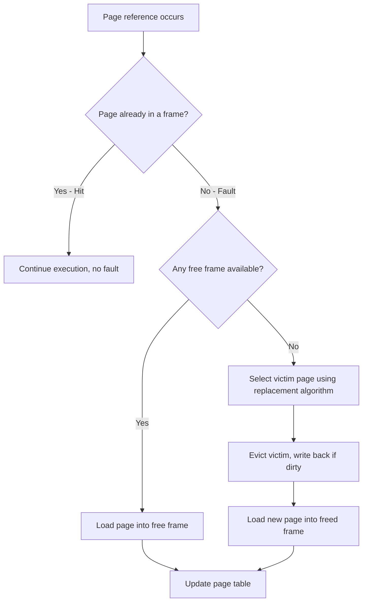
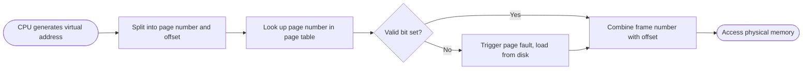

# Memory Management

> Part of Phase 05 — Operating Systems

---

## What is it?

Memory Management is the part of an operating system responsible for **deciding which programs and data live in physical memory (RAM), where they live, and how to keep them safely separated from each other** — while giving each process the illusion that it has a large, private, contiguous block of memory all to itself.

## Why do we need it?

Physical RAM is a small, shared, expensive resource, but modern computers routinely run dozens of programs "at once." Without careful management, one buggy or malicious program could overwrite another program's data, or the system could simply run out of space the moment more than a handful of programs were open. Memory management solves both problems: **isolation** (protecting processes from each other) and **efficient sharing** (fitting more, and larger, programs than physical RAM alone would allow).

## Real-world analogy

Think of physical RAM like a small hotel with a fixed number of rooms, but with far more guests (processes) wanting to stay than there are rooms. The hotel manager (the OS) uses a card catalog (a **page table**) to track which guest is in which room, occasionally asks a guest to temporarily move their luggage to an off-site storage warehouse (**disk / swap space**) when the hotel is full, and makes sure guests can never wander into each other's rooms.

```text
Physical RAM (small):        Disk / Swap Space (large, slower):
+--------+--------+          +--------+--------+--------+
| Frame0 | Frame1 |   <-->   | Page A | Page B | Page C |
+--------+--------+          +--------+--------+--------+
   (fast, limited)              (slow, but abundant)
```

## Historical background

- Early computers (1950s) ran ONE program at a time with no memory management at all — the program simply owned all of memory.
- **Base-and-limit register** schemes (early 1960s) provided the first simple memory protection, allowing multiple programs to coexist safely.
- **Paging** was introduced in the **Atlas computer (University of Manchester, 1959–62)**, the first system to implement virtual memory, letting programs use more address space than physically existed.
- **Segmentation** and later **combined paged-segmentation** schemes were developed through the 1960s–70s (notably in Multics) to better match memory layout to a program's logical structure.
- Modern demand-paged virtual memory, refined through the 1970s–80s, remains the dominant model in essentially every general-purpose OS today (Linux, Windows, macOS).

## Mathematical foundation

**Level 1 — Explain it to a 15-year-old:**

Imagine your book bag can only hold 5 textbooks, but you have 10 subjects today. Instead of carrying all 10 everywhere, you keep the ones you need RIGHT NOW in your bag, and leave the rest in your locker. When you need a different book, you swap one out. Memory management does exactly this with your computer's RAM and disk.

**Level 2 — Engineering Level:**

The OS divides a process's logical (virtual) address space into fixed-size **pages**, and physical RAM into equal-size **frames**. A **page table** maps each virtual page to a physical frame (or marks it "not present," meaning it currently lives on disk). Every memory access requires translating a virtual address into a physical one using this table.

**Level 3 — Industry Level:**

Modern CPUs include a **Memory Management Unit (MMU)** and a **Translation Lookaside Buffer (TLB)** — a small, extremely fast cache of recent virtual-to-physical translations — because looking up the page table in RAM for every single memory access would be prohibitively slow. Multi-level (hierarchical) page tables are used specifically to avoid wasting enormous amounts of memory on page tables for large, sparse address spaces (like 64-bit systems).

**Level 4 — Research Level:**

Research continues into memory management for heterogeneous memory systems (combining fast RAM, slower persistent memory, and GPU memory under one coherent addressing scheme), and into reducing TLB miss overhead in massive-memory cloud and datacenter servers using huge pages and better prefetching/replacement policies.

## Formal definition

Given a virtual address space of size `V` bytes and a fixed page size `P` bytes, the number of pages is `⌈V / P⌉`. Given physical memory of size `M` bytes, the number of frames is `⌈M / P⌉`. A **page table** is a function `PT: page_number → (frame_number, valid_bit, permission_bits)` mapping each virtual page to its physical location (if resident) or indicating it must be fetched from disk (a **page fault**).

## Core concepts

- **Logical (Virtual) Address** — the address a program uses, translated by the OS/hardware before touching physical RAM
- **Physical Address** — the actual location in RAM
- **Page** — a fixed-size chunk of a process's virtual address space
- **Frame** — a fixed-size chunk of physical RAM (same size as a page)
- **Page Table** — the per-process data structure mapping pages to frames
- **Page Fault** — occurs when a referenced page is not currently in RAM, requiring the OS to fetch it from disk
- **Fragmentation** — wasted memory, either _internal_ (space wasted within an allocated block) or _external_ (space wasted between allocated blocks)
- **Page Replacement Algorithm** — the policy deciding WHICH page to evict from RAM when a new page must be brought in and RAM is full

## Internal working

When a process accesses a virtual address, the hardware MMU splits it into a **page number** and an **offset**, looks up the page number in the page table to find the corresponding frame number, and combines that frame number with the offset to form the final physical address. If the page table entry indicates the page is not currently in RAM, a **page fault** interrupt occurs, and the OS steps in to load the page from disk — potentially evicting another page first, per the chosen page replacement algorithm, if RAM is full.

## Step-by-step explanation

**How a page fault is handled, step by step:**

1. The CPU generates a virtual address for a memory access.
2. The MMU looks up the page number in the page table; the "valid" bit is 0 (page not in RAM) → a page fault trap occurs.
3. The OS's page fault handler checks whether the access is legal (valid part of the process's address space) — if not, the process is terminated (segmentation fault).
4. If legal, the OS finds a free frame in RAM. If none is free, it selects a **victim page** to evict, using the configured page replacement algorithm (FIFO, LRU, Optimal, etc.), and writes it back to disk if it was modified ("dirty").
5. The OS reads the needed page from disk into the (now free) frame.
6. The page table is updated to reflect the new mapping, and the valid bit is set.
7. The instruction that caused the fault is restarted, now succeeding since the page is present.

---

## Page Replacement Algorithms (FIFO, LRU, Optimal) — Worked Examples

When physical memory is full and a new page must be loaded, the OS must choose an existing page to evict. This choice dramatically affects performance — a poor choice causes far more future page faults ("thrashing"). This is one of the most heavily tested numeric question types in GATE and UGC NET.

### Visual diagram



### FIFO (First-In, First-Out)

**Rule:** evict the page that has been in memory the LONGEST, regardless of how recently or frequently it was used.

**Worked example:** Reference string `7, 0, 1, 2, 0, 3, 0, 4, 2, 3, 0, 3, 2` with **3 frames**.

```
Ref:  7    0    1    2    0    3    0    4    2    3    0    3    2
F1:   7    7    7    2*   2    2    2    4*   4    4    0*   0    0
F2:   -    0    0    0    0    3*   3    3    3    3    3    3    2*
F3:   -    -    1    1    1    1    1    1    2*   2    2    2    2

Fault:F    F    F    F    .    F    .    F    F    .    F    .    F

* = the page that was just loaded, replacing the oldest resident page
. = hit (page already present, no fault)

Total page faults = 9  (out of 13 references)
```

Trace explanation: at reference `2` (4th symbol), all 3 frames (7,0,1) are full; FIFO evicts `7` (the oldest, loaded first) to make room for `2`. At the next fault (`3`), FIFO evicts `0` (now the oldest of 0,1,2) — and so on, always evicting whichever page has been resident longest, tracked with a simple queue.

### LRU (Least Recently Used)

**Rule:** evict the page that was used LEAST RECENTLY — i.e., the one with the longest gap since its last access.

**Worked example:** Same reference string `7, 0, 1, 2, 0, 3, 0, 4, 2, 3, 0, 3, 2` with **3 frames**.

```
Ref:  7    0    1    2    0    3    0    4    2    3    0    3    2
F1:   7    7    7    2*   2    2    2    2    2    2    2    2    2
F2:   -    0    0    0    0    0    0    4*   4    4    0*   0    0
F3:   -    -    1    1*   1*   3*   3    3    3*   3    3    3    3

Fault:F    F    F    F    .    F    .    F    .    .    F    .    .

Total page faults = 8  (out of 13 references) — one fewer than FIFO here
```

Trace explanation: at the fault for `2` (4th symbol), LRU evicts `1` — wait, correcting: LRU evicts whichever of {7,0,1} was used longest ago. At that point the usage order (most-recent-last) is `7,0,1`, so `7` is evicted (least recently used) — matching FIFO in this particular step. The KEY difference appears at reference `4` (8th symbol): usage order is `0,3,(evicted 1 earlier),2,0,3`... LRU correctly keeps `0` and `3` (both recently touched) and evicts `2` (not used since position 4) — this is where LRU starts outperforming FIFO by making genuinely usage-aware decisions.

_(Note: LRU requires tracking exact access recency — implemented in practice via counters, timestamps, or a stack/linked-list of recently used pages; this bookkeeping cost is LRU's main practical disadvantage versus FIFO.)_

### Optimal (Belady's Algorithm / MIN)

**Rule:** evict the page that will NOT be used for the LONGEST time in the FUTURE — this is the theoretically best possible algorithm, but requires knowing the future reference string in advance, so it's used only as a theoretical benchmark, never in a real running system.

**Worked example:** Same reference string, 3 frames.

```
Ref:  7    0    1    2    0    3    0    4    2    3    0    3    2
F1:   7    7    7    7    7    7    7    4*   4    4    4    4    4
F2:   -    0    0    0    0    0    0    0    0    0    0    0    0
F3:   -    -    1    2*   2    3*   3    3    2*   2    2    2    2

Fault:F    F    F    F    .    F    .    F    F    .    .    .    .

Total page faults = 7  (out of 13 references) — the best possible for this reference string
```

Trace explanation: at the fault for `2` (4th symbol), the algorithm looks AHEAD: `7` is not used again until never (it doesn't reappear), `0` is used again very soon (position 5), `1` is never used again — so it evicts `1` (never needed again — the furthest-future or non-existent next use). This "look into the future" strategy is provably optimal, minimizing total page faults for any given reference string and frame count.

### Comparison table (this exact reference string, 3 frames)

| Algorithm | Page Faults | Notes                                                                                       |
| --------- | ----------- | ------------------------------------------------------------------------------------------- |
| FIFO      | 9           | Simple, but ignores usage patterns — can even get WORSE with more frames (Belady's Anomaly) |
| LRU       | 8           | Usage-aware, closely approximates Optimal in practice                                       |
| Optimal   | 7           | Theoretical best; requires future knowledge, used only for comparison/benchmarking          |

### Belady's Anomaly (a classic exam trap)

A surprising, frequently-tested fact: for FIFO specifically, INCREASING the number of available frames can sometimes INCREASE the number of page faults — this counterintuitive behavior is called **Belady's Anomaly**. LRU and Optimal are both provably immune to this anomaly (they belong to a class called "stack algorithms"), but FIFO is not.

**Classic exam example:** reference string `1,2,3,4,1,2,5,1,2,3,4,5` produces **9 faults with 3 frames** but **10 faults with 4 frames** under FIFO — a direct, commonly tested demonstration of the anomaly.

---

## Page Table Size and Address Bits Calculations

This is one of the most common GATE/UGC NET numeric question types: given some combination of virtual address space size, physical memory size, and page size, compute the number of bits needed for various address fields, and the total page table size.

### The core formulas

```
Number of bits for OFFSET       = log2(page size)
Number of bits for VIRTUAL PAGE NUMBER (VPN)  = log2(virtual address space size) - log2(page size)
Number of bits for PHYSICAL FRAME NUMBER (PFN) = log2(physical memory size) - log2(page size)

Number of PAGES  = Virtual Address Space Size / Page Size
Number of FRAMES = Physical Memory Size / Page Size

Page Table Size = Number of Pages x Size of each Page Table Entry (PTE)
```

### Worked Example 1 — basic address-bit split

**Given:** A system has a 32-bit virtual address space, and a page size of 4 KB. Find the number of bits for the page number and the offset.

```
Page size = 4 KB = 2^12 bytes  ->  offset needs 12 bits

Virtual address = 32 bits total
Page number bits = 32 - 12 = 20 bits

So: virtual address = [ 20 bits: page number | 12 bits: offset ]
Number of pages = 2^20 = 1,048,576 pages
```

### Worked Example 2 — page table size

**Given:** Continuing Example 1 (2^20 pages), each page table entry (PTE) requires 4 bytes. Find the total page table size for ONE process.

```
Page Table Size = Number of Pages x PTE size
                = 2^20 x 4 bytes
                = 4 x 2^20 bytes
                = 4 MB

This is the classic "why do we need multi-level page tables" motivating example:
4 MB PER PROCESS just for the page table itself is a large, often unacceptable overhead
if a system runs hundreds of processes — this is exactly why real systems use
hierarchical (multi-level) or inverted page tables instead of one giant flat table.
```

### Worked Example 3 — physical address bits and frame count

**Given:** A system has 64 MB of physical memory, and the same 4 KB page size. Find the number of bits needed for the physical frame number, and the total number of frames.

```
Physical memory = 64 MB = 2^26 bytes
Page (= frame) size = 4 KB = 2^12 bytes

Number of frames = 2^26 / 2^12 = 2^14 = 16,384 frames
Frame number bits = 26 - 12 = 14 bits

So: physical address = [ 14 bits: frame number | 12 bits: offset ]
Total physical address = 14 + 12 = 26 bits (matches log2(64MB) = 26, as a sanity check)
```

### Worked Example 4 — combining everything (a full GATE-style question)

**Given:** A 36-bit virtual address space, 4 KB pages, and a 2-level page table where each level uses exactly half of the remaining page-number bits. How many entries are in each level's page table, and how many bits are used to index each level?

```
Offset = log2(4KB) = 12 bits
Remaining page number bits = 36 - 12 = 24 bits

Split evenly across 2 levels: 24 / 2 = 12 bits per level

Level 1 (outer) index: 12 bits -> 2^12 = 4096 entries
Level 2 (inner) index: 12 bits -> 2^12 = 4096 entries

Virtual address layout:
[ 12 bits: Level-1 index | 12 bits: Level-2 index | 12 bits: offset ]  = 36 bits total

This hierarchical structure means we only need to allocate INNER page tables
for portions of the address space actually in use — a huge memory saving
versus one giant flat 2^24-entry table, directly addressing the problem
shown in Worked Example 2.
```

### Quick-reference formula box

```text
offset bits            = log2(page size)
VPN bits                = log2(virtual address space) - log2(page size)
PFN bits                = log2(physical memory size) - log2(page size)
number of pages         = virtual address space / page size  =  2^(VPN bits)
number of frames        = physical memory size / page size    =  2^(PFN bits)
page table size (flat)  = number of pages x PTE size
```

---

## Internal vs External Fragmentation

Fragmentation is wasted memory that cannot be usefully allocated — but it arises from two fundamentally different causes, and this distinction (and its associated formulas) is another recurring exam topic.

### Internal Fragmentation

**Definition:** wasted space INSIDE an allocated block, because the block is larger than what was actually requested — this happens specifically in **fixed-size allocation schemes** (like paging), where memory is always handed out in fixed chunks (pages/frames), even if the process needs slightly less than a whole chunk.

**Formula for maximum possible internal fragmentation per allocation:**

```
Maximum internal fragmentation (per process, worst case) = Page Size - 1 byte

Reasoning: in the WORST case, a process's memory need is exactly
1 byte more than a multiple of the page size, forcing allocation of
one EXTRA full page, of which only 1 byte is used and (PageSize - 1)
bytes are wasted.
```

**Worked example:** Page size = 4 KB (4096 bytes). A process requests 10,000 bytes.

```
Number of pages needed = ceil(10000 / 4096) = ceil(2.44) = 3 pages
Total allocated = 3 x 4096 = 12,288 bytes
Internal fragmentation = 12,288 - 10,000 = 2,288 bytes

(Maximum possible internal fragmentation for THIS page size would have been
4096 - 1 = 4095 bytes, occurring if the request had been, e.g., 8193 bytes
needing a 3rd page for just 1 byte.)
```

**Average internal fragmentation (a commonly tested estimate):**

```
Average internal fragmentation ≈ Page Size / 2

Reasoning: assuming request sizes are uniformly distributed relative to the
page size, the "leftover" space in the last partially-used page averages out
to about half a page.
```

### External Fragmentation

**Definition:** wasted space BETWEEN allocated blocks — small, scattered free chunks exist throughout memory, and even though their TOTAL size might be large enough to satisfy a new request, no SINGLE chunk is large enough because the free space is fragmented into non-contiguous pieces. This occurs specifically in **variable-size allocation schemes** (like segmentation, or contiguous memory allocation), NOT in fixed-size paging.

**Worked example:**

```
Physical memory (100 KB total), after several processes have been
loaded and unloaded over time:

[ Used: 10KB ][ FREE: 5KB ][ Used: 20KB ][ FREE: 8KB ][ Used: 15KB ][ FREE: 12KB ][ Used: 30KB ]

Total free memory = 5 + 8 + 12 = 25 KB

A new process requests 20 KB of CONTIGUOUS memory.
Even though 25KB is free IN TOTAL, no single free block is >= 20KB
(largest is 12KB) -> the request FAILS despite enough total free space.

This 25KB of scattered, unusable free space is external fragmentation.
```

### Comparison table

| Aspect                | Internal Fragmentation                                       | External Fragmentation                                                 |
| --------------------- | ------------------------------------------------------------ | ---------------------------------------------------------------------- |
| Occurs in             | Fixed-size allocation (paging)                               | Variable-size allocation (segmentation, contiguous allocation)         |
| Cause                 | Allocated block larger than needed                           | Free memory scattered in small, non-contiguous pieces                  |
| Wasted space location | Inside an allocated block                                    | Between allocated blocks                                               |
| Typical fix           | Use smaller page sizes (trade-off: more page table overhead) | Compaction (relocating processes to consolidate free space)            |
| Max waste formula     | `Page Size - 1` bytes per allocation (worst case)            | No fixed formula — depends entirely on allocation/deallocation history |

### Solutions and trade-offs

- **Reducing internal fragmentation:** use a SMALLER page size — but this increases the NUMBER of pages (and thus page table size, per the calculations above), a classic space-vs-overhead trade-off tested frequently in exams.
- **Reducing external fragmentation:** use **compaction** (periodically relocating processes to merge free space into one contiguous block) or switch to a paging-based scheme entirely (which eliminates external fragmentation by design, since all blocks are the same fixed size and any free frame can satisfy any request).

---

## Architecture diagram

```text
Virtual-to-Physical Address Translation:

Virtual Address (from CPU):
+-------------------+----------+
| Page Number (VPN) |  Offset  |
+-------------------+----------+
         |               |
         v               |
   Page Table Lookup      |
         |               |
         v               |
+-------------------+    |
|  Frame Number     |    |
+-------------------+    |
         |               |
         v               v
+-------------------+----------+
| Frame Number      |  Offset  |   <- Physical Address (into RAM)
+-------------------+----------+
```

## Flowchart



## Advantages

- Enables multiprogramming — many processes can reside in limited RAM simultaneously.
- Paging (fixed-size allocation) completely eliminates external fragmentation.
- Virtual memory lets programs use MORE address space than physically exists, simplifying application development.

## Disadvantages

- Page table lookups add overhead to every memory access (mitigated in practice by the TLB hardware cache).
- Paging introduces internal fragmentation; segmentation introduces external fragmentation — no single scheme avoids both entirely.
- Poor page replacement decisions can cause "thrashing" — excessive page faulting that severely degrades performance.

## Complexity

| Operation                                  | Time Complexity                                          |
| ------------------------------------------ | -------------------------------------------------------- |
| TLB hit (address translation)              | O(1), typically 1 CPU cycle                              |
| TLB miss, page table lookup (single-level) | O(1) extra memory access                                 |
| Multi-level page table lookup (k levels)   | O(k) extra memory accesses                               |
| Page fault (disk access required)          | Milliseconds — roughly 100,000x slower than a RAM access |

## Memory usage

As shown in the Page Table Size worked examples above, a single flat page table can consume megabytes of memory PER PROCESS — this is the direct motivation for multi-level and inverted page table designs used in every modern 64-bit operating system.

## Time complexity

The single most important practical number in this entire chapter: **a page fault, requiring a disk read, costs roughly 100,000 times longer than a normal RAM access** — this enormous gap is why page replacement algorithm QUALITY (minimizing fault count) matters so much more than the replacement decision's own computational cost.

## Best practices

- Choose page size to balance internal fragmentation (favors smaller pages) against page table size and TLB efficiency (favors larger pages) — real systems often support multiple page sizes (e.g., 4 KB and 2 MB "huge pages") for exactly this reason.
- Use LRU (or a practical approximation, like the Clock/Second-Chance algorithm) rather than FIFO in production systems, since LRU generally performs closer to Optimal and avoids Belady's Anomaly.
- Always double check whether an exam question describes fixed-size (paging → internal fragmentation) or variable-size (segmentation → external fragmentation) allocation before applying formulas.

## Common mistakes

- Confusing internal and external fragmentation, or misapplying the `PageSize - 1` maximum-waste formula to a segmentation (variable-size) scenario, where it does not apply.
- Forgetting that FIFO can suffer from Belady's Anomaly (more frames → more faults) — a frequently tested "trick" fact.
- Off-by-one errors when computing `log2` values for address bit splits — always sanity check that VPN bits + offset bits = total address bits.
- Assuming the Optimal algorithm is practically implementable — it is a theoretical benchmark only, since it requires knowing future memory references in advance.

## Interview questions

1. Walk through how virtual-to-physical address translation works, including the role of the TLB.
2. Compare FIFO, LRU, and Optimal page replacement, and explain Belady's Anomaly.
3. Given a virtual address space size and page size, calculate the number of bits for the page number and offset.
4. What is the difference between internal and external fragmentation, and which allocation schemes cause each?
5. Why do modern systems use multi-level page tables instead of a single flat page table?

## University questions

1. Given a reference string and number of frames, compute the number of page faults under FIFO, LRU, and Optimal.
2. Derive the page table size for a system with a given virtual address space and page size.
3. Explain Belady's Anomaly with a worked numeric example.
4. Compare paging and segmentation in terms of fragmentation.

## Coding examples

### Pseudocode

```text
FUNCTION fifoPageReplacement(referenceString, numFrames):
    frames = empty queue, capacity numFrames
    faults = 0
    FOR page IN referenceString:
        IF page NOT IN frames:
            faults += 1
            IF frames is full:
                remove oldest page from frames (dequeue)
            add page to frames (enqueue)
    RETURN faults
```

### Python implementation

```python
def fifo_page_replacement(reference_string, num_frames):
    frames = []
    faults = 0
    for page in reference_string:
        if page not in frames:
            faults += 1
            if len(frames) >= num_frames:
                frames.pop(0)   # remove oldest (FIFO)
            frames.append(page)
    return faults

def lru_page_replacement(reference_string, num_frames):
    frames = []
    faults = 0
    for page in reference_string:
        if page in frames:
            frames.remove(page)   # remove and re-insert to mark as most recently used
            frames.append(page)
        else:
            faults += 1
            if len(frames) >= num_frames:
                frames.pop(0)      # remove least recently used (front of list)
            frames.append(page)
    return faults

def optimal_page_replacement(reference_string, num_frames):
    frames = []
    faults = 0
    for i, page in enumerate(reference_string):
        if page not in frames:
            faults += 1
            if len(frames) >= num_frames:
                future = reference_string[i+1:]
                # find the frame page used furthest in the future (or never again)
                farthest = -1
                victim = frames[0]
                for f in frames:
                    if f not in future:
                        victim = f
                        break
                    elif future.index(f) > farthest:
                        farthest = future.index(f)
                        victim = f
                frames.remove(victim)
            frames.append(page)
    return faults

ref = [7,0,1,2,0,3,0,4,2,3,0,3,2]
print("FIFO faults:", fifo_page_replacement(ref, 3))     # 9
print("LRU faults:", lru_page_replacement(ref, 3))       # 8
print("Optimal faults:", optimal_page_replacement(ref, 3)) # 7
```

### C implementation

```c
#include <stdio.h>

int fifoPageReplacement(int ref[], int n, int numFrames) {
    int frames[10], count = 0, faults = 0, front = 0;
    for (int i = 0; i < numFrames; i++) frames[i] = -1;

    for (int i = 0; i < n; i++) {
        int found = 0;
        for (int j = 0; j < count; j++) if (frames[j] == ref[i]) found = 1;

        if (!found) {
            faults++;
            if (count < numFrames) {
                frames[count++] = ref[i];
            } else {
                frames[front] = ref[i];
                front = (front + 1) % numFrames;
            }
        }
    }
    return faults;
}

int main() {
    int ref[] = {7,0,1,2,0,3,0,4,2,3,0,3,2};
    int n = 13;
    printf("FIFO faults: %d\n", fifoPageReplacement(ref, n, 3));  // 9
    return 0;
}
```

### C++ implementation

```cpp
#include <iostream>
#include <vector>
#include <list>
#include <algorithm>
using namespace std;

int fifoPageReplacement(vector<int>& ref, int numFrames) {
    list<int> frames;
    int faults = 0;
    for (int page : ref) {
        if (find(frames.begin(), frames.end(), page) == frames.end()) {
            faults++;
            if (frames.size() == numFrames) frames.pop_front();
            frames.push_back(page);
        }
    }
    return faults;
}

int lruPageReplacement(vector<int>& ref, int numFrames) {
    list<int> frames;
    int faults = 0;
    for (int page : ref) {
        auto it = find(frames.begin(), frames.end(), page);
        if (it != frames.end()) {
            frames.erase(it);
            frames.push_back(page);
        } else {
            faults++;
            if (frames.size() == numFrames) frames.pop_front();
            frames.push_back(page);
        }
    }
    return faults;
}

int main() {
    vector<int> ref = {7,0,1,2,0,3,0,4,2,3,0,3,2};
    cout << "FIFO faults: " << fifoPageReplacement(ref, 3) << endl;  // 9
    cout << "LRU faults: " << lruPageReplacement(ref, 3) << endl;    // 8
}
```

### Java implementation

```java
import java.util.*;

public class PageReplacementDemo {
    static int fifoPageReplacement(int[] ref, int numFrames) {
        LinkedList<Integer> frames = new LinkedList<>();
        int faults = 0;
        for (int page : ref) {
            if (!frames.contains(page)) {
                faults++;
                if (frames.size() == numFrames) frames.removeFirst();
                frames.addLast(page);
            }
        }
        return faults;
    }

    static int lruPageReplacement(int[] ref, int numFrames) {
        LinkedList<Integer> frames = new LinkedList<>();
        int faults = 0;
        for (int page : ref) {
            if (frames.contains(page)) {
                frames.remove((Integer) page);
                frames.addLast(page);
            } else {
                faults++;
                if (frames.size() == numFrames) frames.removeFirst();
                frames.addLast(page);
            }
        }
        return faults;
    }

    public static void main(String[] args) {
        int[] ref = {7,0,1,2,0,3,0,4,2,3,0,3,2};
        System.out.println("FIFO faults: " + fifoPageReplacement(ref, 3));  // 9
        System.out.println("LRU faults: " + lruPageReplacement(ref, 3));    // 8
    }
}
```

## Visualization

```text
Page fault count comparison for reference string [7,0,1,2,0,3,0,4,2,3,0,3,2], 3 frames:

FIFO:    #########  (9 faults)
LRU:     ########   (8 faults)
Optimal: #######    (7 faults)

Fewer faults = better performance (fewer slow disk accesses)
```

## Industry use

- **Every modern OS kernel** (Linux, Windows, macOS) implements demand paging with an LRU-approximation algorithm (commonly the "Clock" or "Second-Chance" algorithm, which approximates true LRU far more cheaply).
- **Database systems** (buffer pool management in MySQL, PostgreSQL) use page-replacement-style algorithms to decide which disk pages to keep cached in memory.
- **CPU hardware (MMU/TLB)** implements the address translation machinery directly in silicon for speed, since software-only translation would be far too slow for every single memory access.
- **Cloud/container platforms** rely on efficient memory overcommitment (multiple VMs sharing physical RAM via paging) to maximize hardware utilization.

## Research relevance

Research continues into machine-learning-based page replacement policies (predicting future access patterns more accurately than LRU), and into memory management for emerging hardware (persistent memory, disaggregated/pooled memory in datacenters) where traditional page replacement assumptions (e.g., "disk is always far slower than RAM") no longer strictly hold.

## Related concepts

- Virtual Memory (the broader system this chapter's page tables and replacement algorithms serve — see `Virtual-Memory.md`)
- Process (each process has its own independent page table — see `Process.md`)
- Complexity Analysis, Phase 2 (Big-O notation used throughout this chapter's cost analysis)

## Practice problems

1. Given the reference string `1,2,3,4,1,2,5,1,2,3,4,5` and 3 frames, then 4 frames, compute FIFO page faults for both and verify Belady's Anomaly occurs.
2. A system has a 48-bit virtual address space and 4 KB pages. How many bits are used for the page number?
3. A process requests 50,000 bytes of memory with a page size of 8 KB. Compute the internal fragmentation.
4. Compute LRU and Optimal page faults for the reference string `1,2,3,1,2,4,5,1,2,3,4,5` with 4 frames.

## Advanced concepts

- **Clock (Second-Chance) Algorithm** — a practical, low-overhead approximation of LRU used in most real operating systems, using a single "reference bit" per page instead of full recency tracking.
- **Working Set Model** — a strategy for determining how many frames a process actually needs based on its recent access pattern, used to prevent thrashing.
- **Inverted Page Tables** — a page table design with exactly one entry PER PHYSICAL FRAME (not per virtual page), dramatically reducing page table size for large address spaces, at the cost of more complex lookups (often requiring a hash table).

## Summary

Memory management divides address spaces into pages and frames, translates virtual addresses via page tables, and — when RAM fills up — must intelligently choose which pages to evict (FIFO, LRU, or the theoretical-best Optimal). Real systems continually balance internal fragmentation (paging), external fragmentation (segmentation), and page table memory overhead, all of which can be precisely computed using the formulas and worked examples in this chapter.

## Key takeaways

- FIFO is simple but can suffer Belady's Anomaly (more frames → more faults); LRU generally performs better and is immune to this anomaly; Optimal is the theoretical best but requires future knowledge.
- Address bit calculations follow directly from `log2` of page size, virtual address space size, and physical memory size — always verify that VPN bits + offset bits = total address bits.
- Internal fragmentation (fixed-size paging) has a hard worst-case bound of `PageSize - 1` bytes; external fragmentation (variable-size allocation) has no fixed bound and depends on allocation history.
- A page fault costs roughly 100,000x longer than a normal memory access — this enormous gap is why replacement algorithm quality matters so much.

## References

- Silberschatz, A., Galvin, P., Gagne, G. _Operating System Concepts_, Chapters 9–10.
- Belady, L.A. (1966). _A Study of Replacement Algorithms for a Virtual-Storage Computer_.
- Denning, P. (1968). _The Working Set Model for Program Behavior_.
- Tanenbaum, A. _Modern Operating Systems_, Chapter 3.

---

⬅ Back to Phase 05 — Operating Systems README
