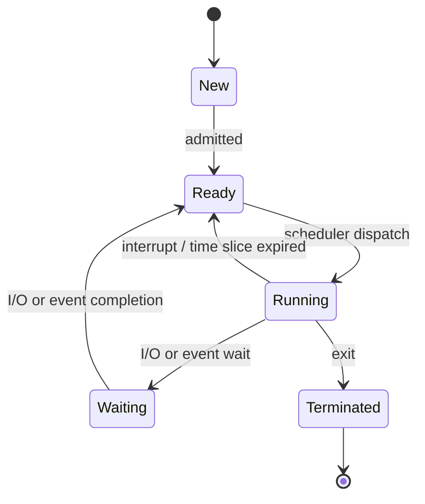
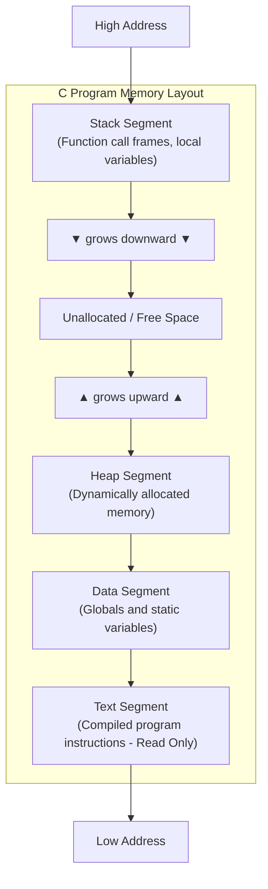
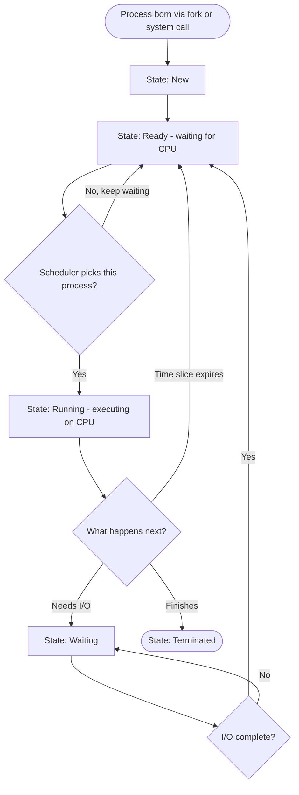

# Process

> Part of [Phase 05 — Operating Systems](./README.md)

---

## What is it?

A process is a **program in execution** — not just the static code sitting on disk, but the dynamic, running instance of it: its current instructions, its own private memory, its open files, and everything the operating system needs to track to pause it, resume it, and keep it safely separated from every other running program.

## Why do we need it?

A computer runs many programs "simultaneously" on a small number of CPU cores. The OS needs a clean, well-defined unit to represent "one running program" — something it can pause, resume, isolate from other programs, and schedule fairly. The process is exactly this unit, and it's the foundational concept that everything else in this phase builds on.

## Real-world analogy

Think of a process like a chef actively cooking a specific recipe in a shared professional kitchen. The RECIPE (the program code) is just a static piece of paper — but the CHEF actively cooking it, with their own set of ingredients laid out (memory), their current step in the recipe (the program counter), and their own knives and pans (open resources), is the "process." Multiple chefs can cook the SAME recipe simultaneously, each as a completely separate process with their own ingredients and progress.

```text
Program (static, on disk):  "recipe.exe"

Process 1: chef A, cooking recipe.exe, currently on step 5, own ingredients
Process 2: chef B, cooking recipe.exe, currently on step 2, own ingredients
              (same recipe, but two completely independent, isolated processes)
```

## Historical background

- The process concept emerged from **early 1960s time-sharing systems** (like CTSS at MIT and later Multics), which needed a way to let multiple users run programs "simultaneously" on one expensive shared mainframe.
- **Unix (1969–73)**, developed by Ken Thompson and Dennis Ritchie at Bell Labs, formalized the `fork()` system call — a remarkably elegant way to create new processes by cloning an existing one — a design so influential it remains essentially unchanged in Unix-like systems (Linux, macOS) today.
- Modern OS process models (Windows, Linux) have since added increasingly lightweight variants (threads) to address the overhead of full process creation for tasks that don't need complete isolation.

## Mathematical foundation

**Level 1 — Explain it to a 15-year-old:**

Imagine you're reading a book (the "program"), and someone is tracking exactly which page and line you're on, plus a stack of sticky notes with your personal progress and reminders. If you get interrupted and come back an hour later, that tracking lets you pick up EXACTLY where you left off. That tracking information — "where am I, what do I have, what have I done" — is what the OS keeps for every process.

**Level 2 — Engineering Level:**

A process consists of several distinct memory regions: the **text segment** (the program's compiled code), the **data segment** (global/static variables), the **heap** (dynamically allocated memory), and the **stack** (function call frames, local variables). The OS maintains a **Process Control Block (PCB)** for each process, recording its state, program counter, CPU registers, memory info, and more.

**Level 3 — Industry Level:**

Real operating systems use `fork()`/`exec()` (Unix/Linux) or `CreateProcess()` (Windows) to spawn new processes. Process creation is relatively EXPENSIVE (a full new address space, memory copying/mapping, a new PCB) — this cost is exactly why high-performance servers often prefer threads or process pools over spawning a brand-new process per request.

**Level 4 — Research Level:**

Research into **containers** (Docker, etc.) and lightweight virtualization explores how to achieve strong process isolation with much LOWER overhead than traditional full virtual machines, using OS-level primitives like Linux namespaces and cgroups — essentially re-engineering the classical process isolation model for the cloud-native era.

## Formal definition

A process is formally represented by the OS as a **Process Control Block (PCB)**, containing: `(process_id, state, program_counter, cpu_registers, memory_management_info, list_of_open_files, scheduling_info, parent_process_id)`. The process's execution is fully determined at any moment by its PCB plus its allocated memory regions.

## Core concepts

- **Process Control Block (PCB)** — the OS data structure storing all information about a process
- **Process States** — New, Ready, Running, Waiting/Blocked, Terminated
- **Program Counter (PC)** — tracks which instruction the process will execute next
- **Context Switch** — saving the currently running process's state and loading another's
- **Process Creation** (`fork`, `exec`) — spawning new processes, often by cloning an existing one
- **Process Termination** (`exit`) — cleanly ending a process and reclaiming its resources
- **Parent/Child Processes** — the hierarchical relationship formed when one process creates another

## Internal working

When the OS switches from running Process A to running Process B (a **context switch**), it saves Process A's current CPU register values, program counter, and other state into A's PCB, then loads Process B's previously saved state from B's PCB into the CPU — resuming B exactly where it left off. This entire save/restore operation is pure overhead (no useful work is done during it), which is why minimizing unnecessary context switches matters for performance.

## Step-by-step explanation

**How a Unix-style process is created via `fork()` + `exec()`, step by step:**

1. A running process (the parent) calls `fork()`.
2. The OS creates a new process (the child) that is initially an almost-exact COPY of the parent — same code, same variable values, same open files — but with its own new process ID and its own separate memory space (often using a "copy-on-write" optimization, so actual memory copying is deferred until either process modifies it).
3. `fork()` returns TWICE: once in the parent (returning the child's process ID) and once in the child (returning 0) — this is how each process's code can tell which one it is.
4. If the child process wants to run a DIFFERENT program (not just a copy of the parent), it calls `exec()`, which replaces its own memory image entirely with a new program's code and data.
5. The parent can optionally `wait()` for the child to finish, retrieving its exit status.

## Visual diagram



## Architecture diagram

A process's memory layout (typical, address space grows this way):



## Flowchart



## Example

Trace a simple `fork()` scenario in pseudocode:

```
pid = fork()

IF pid == 0:
    // this branch runs in the CHILD process
    print("I am the child")
ELSE:
    // this branch runs in the PARENT process
    print("I am the parent, my child's PID is", pid)
    wait(pid)   // parent waits for child to finish

Output (order between the two print statements may vary,
since parent and child run concurrently):
"I am the child"
"I am the parent, my child's PID is 4821"
```

## Dry run

Trace process state transitions for a single process from creation to completion:

| Step | Event                         | State Before | State After |
| ---- | ----------------------------- | ------------ | ----------- |
| 1    | Process created               | —            | New         |
| 2    | Admitted to ready queue       | New          | Ready       |
| 3    | Scheduler dispatches it       | Ready        | Running     |
| 4    | Requests disk I/O             | Running      | Waiting     |
| 5    | I/O completes                 | Waiting      | Ready       |
| 6    | Scheduler dispatches it again | Ready        | Running     |
| 7    | Process calls exit()          | Running      | Terminated  |

## Multiple examples

**Example 1 — Web browser:** each browser tab may run as a SEPARATE process (as in Chrome's multi-process architecture) specifically so that one tab crashing doesn't bring down the entire browser — a direct, practical application of process isolation.

**Example 2 — Shell command:** typing `ls` in a terminal causes the shell to `fork()` a child process, which then `exec()`s the `ls` program; the shell (parent) waits for it to complete before showing the next prompt.

**Example 3 — Zombie process:** if a child process terminates but its parent hasn't yet called `wait()` to collect its exit status, the child becomes a "zombie" — technically terminated, but still occupying a PCB entry until the parent acknowledges it.

## Advantages

- Provides strong isolation — a bug or crash in one process cannot (under normal circumstances) corrupt another process's memory.
- Gives the OS a clean, well-defined unit for scheduling, resource accounting, and security permissions.
- The parent-child model (`fork`/`exec`) provides an elegant, composable way to build complex systems from simple programs (the foundation of Unix shell pipelines).

## Disadvantages

- Process creation and context switching are relatively EXPENSIVE (new address space, memory setup, PCB management) compared to lighter-weight alternatives like threads.
- Inter-process communication (IPC) is more complex than sharing memory directly within a single process, since processes are deliberately isolated from each other.
- Excessive process creation (e.g., forking a new process per network request) can become a real performance bottleneck at scale.

## Complexity

| Operation                                                      | Typical Cost                                        |
| -------------------------------------------------------------- | --------------------------------------------------- |
| Context switch (same process's threads only — see `Thread.md`) | Lower overhead                                      |
| Context switch (between different processes)                   | Higher overhead (full memory mapping/TLB flush)     |
| `fork()` (with copy-on-write optimization)                     | Relatively fast — actual memory copying is deferred |
| Process creation WITHOUT copy-on-write (naive full copy)       | O(process memory size)                              |

## Memory usage

Each process requires its own independent memory space — page tables, a PCB, and (unless using copy-on-write sharing) potentially duplicated memory content — making processes significantly more memory-heavy than threads, which share their parent process's memory space entirely.

## Time complexity

The critical engineering fact: **process creation and full context switches are orders of magnitude more expensive than simple function calls or thread switches** — this cost differential is precisely why modern high-performance systems (web servers, browsers) carefully choose between process-based and thread-based (or event-driven) architectures based on their isolation vs. performance needs.

## Best practices

- Always properly `wait()` for child processes to avoid leaving zombie processes accumulating in the system.
- Prefer threads (see [`Thread.md`](./Thread.md)) over full processes when tasks need to share data frequently and don't require strong isolation.
- Use process-level isolation deliberately when security/stability isolation matters more than raw performance (e.g., running untrusted code, browser tab isolation).

## Common mistakes

- Confusing a process with a program — a program is static code on disk; a process is a specific, running, stateful INSTANCE of that code.
- Forgetting that `fork()` duplicates almost everything (including open file descriptors) — a common source of subtle bugs in Unix systems programming.
- Not distinguishing between process states precisely — "Ready" (waiting for CPU) and "Waiting/Blocked" (waiting for I/O or an event) are NOT the same state, and mixing them up leads to incorrect scheduling analysis.

## Interview questions

1. What is the difference between a process and a program?
2. Explain what happens, step by step, when `fork()` is called.
3. What information is stored in a Process Control Block?
4. What is a zombie process, and how does it arise?
5. Why is process creation more expensive than thread creation?

## University questions

1. Draw and explain the process state transition diagram.
2. Explain the `fork()`-`exec()`-`wait()` process creation model used in Unix.
3. Describe the contents and purpose of a Process Control Block.
4. Compare the cost of context switching between processes versus between threads of the same process.

## Coding examples

### Pseudocode

```text
FUNCTION createChildProcess():
    pid = fork()
    IF pid == 0:
        // child process branch
        exec("some_program")
    ELSE:
        // parent process branch
        wait(pid)
        print("Child finished")
```

### Python implementation

```python
import os

pid = os.fork()

if pid == 0:
    # This code runs in the CHILD process
    print(f"Child process, PID={os.getpid()}, parent PID={os.getppid()}")
    os._exit(0)
else:
    # This code runs in the PARENT process
    print(f"Parent process, PID={os.getpid()}, child PID={pid}")
    os.waitpid(pid, 0)
    print("Child has finished, parent continuing")
```

### C implementation

```c
#include <stdio.h>
#include <unistd.h>
#include <sys/wait.h>

int main() {
    pid_t pid = fork();

    if (pid == 0) {
        // Child process
        printf("Child process, PID=%d, parent PID=%d\n", getpid(), getppid());
        execlp("echo", "echo", "Hello from exec'd program", NULL);
    } else if (pid > 0) {
        // Parent process
        printf("Parent process, PID=%d, child PID=%d\n", getpid(), pid);
        wait(NULL);
        printf("Child has finished, parent continuing\n");
    } else {
        perror("fork failed");
    }
    return 0;
}
```

### C++ implementation

```cpp
#include <iostream>
#include <unistd.h>
#include <sys/wait.h>
using namespace std;

int main() {
    pid_t pid = fork();

    if (pid == 0) {
        cout << "Child process, PID=" << getpid() << ", parent PID=" << getppid() << endl;
        _exit(0);
    } else if (pid > 0) {
        cout << "Parent process, PID=" << getpid() << ", child PID=" << pid << endl;
        wait(NULL);
        cout << "Child has finished, parent continuing" << endl;
    } else {
        perror("fork failed");
    }
}
```

### Java implementation

```java
public class ProcessDemo {
    public static void main(String[] args) throws Exception {
        // Java has no direct fork() equivalent; it spawns a new OS process instead
        ProcessBuilder pb = new ProcessBuilder("echo", "Hello from a new process");
        pb.inheritIO();
        Process child = pb.start();

        System.out.println("Parent waiting for child process...");
        int exitCode = child.waitFor();
        System.out.println("Child finished with exit code: " + exitCode);
    }
}
```

## Visualization

```text
Parent-child process tree after a shell runs a pipeline "cat file | grep word":

           shell (parent)
           /            \
     cat process      grep process
     (child 1)         (child 2)
       |                  |
   reads file        filters output
       |                  |
       '----> pipe ------>'
```

## Industry use

- **Web browsers** (Chrome, Firefox) use multi-process architectures for tab and plugin isolation, directly improving crash resilience and security sandboxing.
- **Web servers** (older Apache "prefork" model) spawn a process per connection for strong isolation, though many modern servers favor threads or event loops for better performance at scale.
- **Container platforms** (Docker, Kubernetes) build on OS process isolation primitives (Linux namespaces, cgroups) to provide lightweight, application-level virtualization.
- **Shell pipelines** (`|` in Unix) are a direct, elegant application of the process model — independent processes connected via pipes.

## Research relevance

Research into **lightweight virtualization** (containers, microVMs like Firecracker) explores achieving process-like isolation with much lower overhead than traditional processes or full virtual machines — directly relevant to cloud computing efficiency at massive scale. Research into **language-based isolation** (e.g., WebAssembly sandboxing) explores achieving process-like safety guarantees WITHOUT relying on OS-level process boundaries at all.

## Related concepts

- Thread (a lighter-weight execution unit within a process — see [`Thread.md`](./Thread.md))
- CPU Scheduling (decides which Ready process runs next — see [`CPU-Scheduling.md`](./CPU-Scheduling.md))
- Memory Management (each process's isolated address space is managed via paging — see [`Memory-Management.md`](./Memory-Management.md))
- Queue, Phase 2 (the Ready queue is a direct application of the Queue data structure)

## Practice problems

1. Trace the process state diagram for a process that performs two rounds of I/O before terminating.
2. Explain, step by step, what happens in both parent and child after a call to `fork()`.
3. Research and explain the difference between a zombie process and an orphan process.
4. Write pseudocode for a shell that forks a child, execs a command, and waits for it to complete.

## Advanced concepts

- **Copy-on-Write (COW)** — an optimization where `fork()` initially shares memory pages between parent and child, only actually copying a page when either process modifies it — dramatically reducing fork's real-world cost.
- **Process Migration** — moving a running process from one machine to another in a distributed system, preserving its full state.
- **Namespaces and cgroups (Linux)** — kernel mechanisms providing process-level isolation of resources (network, filesystem view, resource limits), the foundation of container technology.

## Summary

A process is the OS's fundamental unit of an independently running, isolated program — tracked via a Process Control Block, moving through well-defined states (New, Ready, Running, Waiting, Terminated), and created/destroyed via system calls like `fork()`, `exec()`, and `exit()`. Understanding the process model is the essential foundation for everything else in this phase: scheduling, synchronization, and memory management all operate on processes (and their lighter-weight cousins, threads).

## Key takeaways

- A process is a running INSTANCE of a program, with its own private memory and OS-tracked state (the PCB).
- Processes move through five main states: New, Ready, Running, Waiting, Terminated.
- `fork()` creates a near-identical child process; `exec()` replaces a process's memory image with a new program; `wait()` lets a parent retrieve a child's exit status.
- Process creation and context switching carry real, measurable overhead — a key reason threads exist as a lighter-weight alternative.

## References

- Silberschatz, A., Galvin, P., Gagne, G. _Operating System Concepts_, Chapter 3.
- Ritchie, D., Thompson, K. (1974). _The UNIX Time-Sharing System_.
- Arpaci-Dusseau, R., Arpaci-Dusseau, A. _Operating Systems: Three Easy Pieces_, "Process" chapters.

---

⬅ Back to [Phase 05 — Operating Systems README](./README.md)
