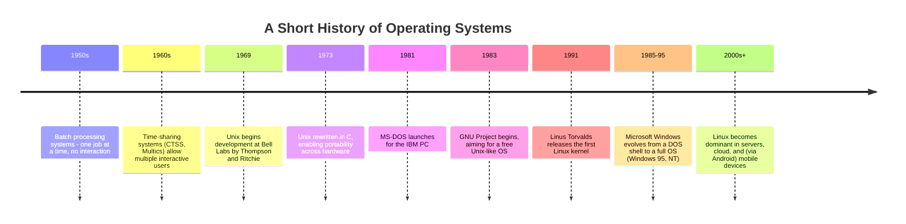
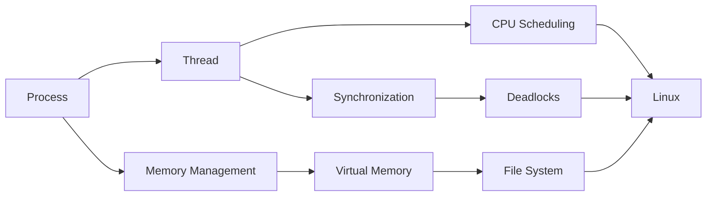

# Phase 05 — Operating Systems

> "An operating system's job is to lie to every program convincingly: to tell each one it owns the whole machine, while secretly sharing that same machine among a hundred other liars at once." — a professor's honest confession, day one of OS.

This is **Phase 5** of the `msc-computer-science` repository. Where Phase 3 (Theory of Computation) taught the mathematical limits of computation, and Phase 2 (DSA) taught how to organize and process data efficiently, Phase 5 teaches how a real computer **shares itself** — safely, fairly, and efficiently — among many competing programs, users, and pieces of hardware, all at once.

---

## Table of Contents

- [Introduction](#introduction)
- [Why This Subject Exists](#why-this-subject-exists)
- [Historical Background](#historical-background)
- [Importance](#importance)
- [Applications](#applications)
- [Industries Using It](#industries-using-it)
- [Career Relevance](#career-relevance)
- [Prerequisites](#prerequisites)
- [Roadmap](#roadmap)
- [Complete Syllabus](#complete-syllabus)
- [Learning Objectives](#learning-objectives)
- [How This Connects to Previous Phases](#how-this-connects-to-previous-phases)
- [How This Connects to Later Phases](#how-this-connects-to-later-phases)
- [Recommended Study Order](#recommended-study-order)
- [Estimated Study Time](#estimated-study-time)
- [Books](#books)
- [Research Papers](#research-papers)
- [Reference Websites](#reference-websites)
- [Practice Resources](#practice-resources)
- [Projects](#projects)
- [Interview Importance](#interview-importance)
- [University Exam Importance](#university-exam-importance)
- [Common Mistakes](#common-mistakes)
- [Cheat Sheet](#cheat-sheet)
- [Summary](#summary)
- [Next Steps](#next-steps)

---

## Introduction

Every time you open a browser tab, play music, and compile code simultaneously on a laptop with just one CPU (or a handful of cores), something remarkable is happening: dozens of programs are being convinced they each have exclusive, uninterrupted access to the processor, to memory, and to your files — when in reality, the **Operating System (OS)** is furiously juggling all of them, switching between tasks many times per second, allocating and reclaiming memory, and mediating every single request for a shared resource.

This phase studies exactly how that juggling act works: how a program becomes a **process**, how processes are chopped into lighter-weight **threads**, how the CPU decides **who runs next** (scheduling), how concurrent programs avoid stepping on each other (**synchronization**), how the system avoids getting permanently stuck (**deadlocks**), how memory is shared and virtualized, how data survives on disk (**file systems**), and how all of this looks in a real, production operating system (**Linux**).

This phase covers nine files:

| File                   | Topic             | One-line description                                                       |
| ---------------------- | ----------------- | -------------------------------------------------------------------------- |
| `README.md`            | Phase overview    | This file                                                                  |
| `Process.md`           | Processes         | A running program, and everything the OS tracks about it                   |
| `Thread.md`            | Threads           | Lightweight units of execution within a process                            |
| `CPU-Scheduling.md`    | CPU Scheduling    | Deciding which process/thread runs next, and for how long                  |
| `Synchronization.md`   | Synchronization   | Coordinating concurrent processes/threads safely                           |
| `Deadlocks.md`         | Deadlocks         | When processes wait for each other forever — causes, prevention, avoidance |
| `Memory-Management.md` | Memory Management | Paging, page replacement, fragmentation _(completed separately)_           |
| `Virtual-Memory.md`    | Virtual Memory    | Giving every process the illusion of vast, private memory                  |
| `File-System.md`       | File Systems      | How data is organized and persisted on disk                                |
| `Linux.md`             | Linux             | A real-world case study tying every concept to an actual production OS     |

---

## Why This Subject Exists

Hardware resources (CPU cores, RAM, disk, network) are finite and shared, but the demand for them — from users, programs, and system services — is effectively unlimited. Operating Systems exist to solve this fundamental tension: **multiplexing** scarce hardware across many competing consumers, while providing each one a clean, simplified, and (mostly) safe abstraction, so application programmers never have to personally manage physical memory addresses or hardware interrupts.

---

## Historical Background

Notice the through-line: nearly every core OS concept in this phase (processes, scheduling, virtual memory) was developed to solve real resource-contention problems from the 1960s-70s time-sharing era — and those same concepts, refined but fundamentally unchanged, run inside every phone, laptop, and cloud server today.

---

## Importance

Operating Systems matter because they determine:

1. **Performance** — scheduling and memory management decisions directly determine how responsive and efficient a system feels.
2. **Correctness under concurrency** — synchronization bugs (race conditions, deadlocks) are among the hardest bugs in all of software engineering, and understanding this phase is the only real defense.
3. **Reliability and persistence** — file systems must guarantee your data survives crashes, power loss, and hardware failures.
4. **Security and isolation** — the OS is the primary boundary protecting processes (and users) from each other.

---

## Applications

| OS Concept         | Real Application                                                                                    |
| ------------------ | --------------------------------------------------------------------------------------------------- |
| Process Management | Every running application, from your browser to background services                                 |
| Threads            | Responsive UIs (one thread handles clicks while another loads data), parallel computation           |
| CPU Scheduling     | Ensuring fair, responsive multitasking on shared hardware                                           |
| Synchronization    | Databases, web servers, and any concurrent software avoiding data corruption                        |
| Deadlock Handling  | Database transaction systems, distributed resource managers                                         |
| Virtual Memory     | Running programs larger than physical RAM, process isolation                                        |
| File Systems       | Every file you've ever saved, from photos to source code                                            |
| Linux              | Powers the majority of web servers, cloud infrastructure, and embedded/mobile devices (via Android) |

---

## Industries Using It

- **Cloud infrastructure** (AWS, Azure, Google Cloud) — runs almost entirely on Linux, with virtualization built directly on OS-level process/memory isolation concepts.
- **Mobile** — Android is built on the Linux kernel; iOS shares deep architectural roots with Unix (via Darwin/BSD).
- **Embedded systems** — real-time operating systems (RTOS) apply the same scheduling and synchronization theory under strict timing guarantees (automotive, medical devices, industrial control).
- **Databases** — transaction concurrency control directly reuses OS synchronization theory (locks, deadlock detection).
- **Game development** — multi-threaded engines rely directly on this phase's synchronization and scheduling concepts.

---

## Career Relevance

| Role                       | OS Relevance                                                                                              |
| -------------------------- | --------------------------------------------------------------------------------------------------------- |
| Systems/Backend Engineer   | Process management, threading, and file I/O are daily concerns                                            |
| DevOps/SRE/Cloud Engineer  | Deep Linux knowledge, process/resource management at scale                                                |
| Embedded/Firmware Engineer | Scheduling, synchronization, and memory management under tight constraints                                |
| Database Engineer          | Concurrency control directly builds on synchronization/deadlock theory                                    |
| Security Engineer          | Process isolation, privilege levels, and memory protection are core concerns                              |
| Interview Candidate        | OS concepts (especially threading, synchronization, virtual memory) are extremely common interview topics |

---

## Prerequisites

- Phase 2 (Data Structures and Algorithms) — queues (used in scheduling), graphs (used in deadlock detection), and complexity analysis are used throughout.
- Phase 3 (Theory of Computation) — helpful background, though not strictly required.
- Basic familiarity with at least one programming language and the command line is helpful for the practical/Linux-focused material.

---

## Roadmap

---

## Complete Syllabus

1. **Process** — process states, PCB, process creation/termination, context switching
2. **Thread** — user vs. kernel threads, multithreading models, thread vs. process trade-offs
3. **CPU Scheduling** — FCFS, SJF, Priority, Round Robin, Multilevel Queue; scheduling metrics
4. **Synchronization** — critical section problem, locks, semaphores, monitors, classic problems
5. **Deadlocks** — necessary conditions, prevention, avoidance (Banker's Algorithm), detection/recovery
6. **Memory Management** — paging, segmentation, page replacement, fragmentation _(completed separately)_
7. **Virtual Memory** — demand paging, thrashing, copy-on-write
8. **File System** — file allocation methods, directory structures, inodes, journaling
9. **Linux** — the kernel, process/memory/file management in a real production OS

---

## Learning Objectives

By the end of this phase, you will be able to:

- Explain the process lifecycle and what information the OS tracks for each process.
- Compare threading models and explain their performance/complexity trade-offs.
- Compute scheduling metrics (waiting time, turnaround time) for common CPU scheduling algorithms.
- Identify and solve the classic synchronization problems using locks, semaphores, and monitors.
- Detect, prevent, and recover from deadlocks, including applying the Banker's Algorithm.
- Explain how virtual memory and demand paging let programs run larger than physical RAM.
- Compare file allocation methods and explain how journaling protects against crashes.
- Relate every theoretical concept in this phase to real, observable behavior in Linux.

---

## How This Connects to Previous Phases

- **Phase 2 (DSA)**: Queues directly implement scheduling ready-queues; Graphs directly implement deadlock detection (resource-allocation graphs); Trees/Hashing underlie file system directory structures.
- **Phase 3 (Theory of Computation)**: process scheduling and synchronization protocols can be modeled and verified using finite-state and automata-based reasoning; the general notion of "computability limits" informs why certain scheduling/deadlock problems are provably hard.

## How This Connects to Later Phases

- **Computer Networks** — network I/O is deeply tied to process/thread models (e.g., one-thread-per-connection vs. event-driven servers).
- **Databases** — transaction concurrency control is OS synchronization theory applied to data consistency.
- **Distributed Systems** — distributed consensus and coordination problems are direct generalizations of this phase's single-machine synchronization and deadlock theory.
- **Computer Architecture** — scheduling and memory management are deeply intertwined with how real CPU hardware (caches, MMUs, interrupts) is designed.

---

## Recommended Study Order

1. Process (the fundamental unit the OS manages)
2. Thread (a lighter-weight refinement of the process concept)
3. CPU Scheduling (deciding who runs, given processes/threads exist)
4. Synchronization (coordinating concurrent execution safely)
5. Deadlocks (the failure mode synchronization can lead to)
6. Memory Management _(completed separately)_ → Virtual Memory (building on it)
7. File System (persistent storage, a mostly independent but equally essential OS service)
8. Linux (capstone — see all of the above in a real, working system)

---

## Estimated Study Time

| Topic             | Beginner Pace     | Fast Pace      |
| ----------------- | ----------------- | -------------- |
| Process           | 4 days            | 1 day          |
| Thread            | 4 days            | 1 day          |
| CPU Scheduling    | 1 week            | 2 days         |
| Synchronization   | 1.5 weeks         | 3 days         |
| Deadlocks         | 1 week            | 2 days         |
| Memory Management | 1 week            | 2 days         |
| Virtual Memory    | 1 week            | 2 days         |
| File System       | 1 week            | 2 days         |
| Linux             | ongoing, hands-on | ongoing        |
| **Total**         | **~9 weeks**      | **~2.5 weeks** |

---

## Books

- _Operating System Concepts_ — Silberschatz, Galvin, Gagne (the "Dinosaur Book")
- _Modern Operating Systems_ — Andrew Tanenbaum
- _Operating Systems: Three Easy Pieces_ — Remzi & Andrea Arpaci-Dusseau (free online, exceptionally clear)
- _The Linux Programming Interface_ — Michael Kerrisk
- _Advanced Programming in the UNIX Environment_ — W. Richard Stevens

## Research Papers

- Dijkstra, E.W. (1965). _Solution of a Problem in Concurrent Programming Control_ (the origin of semaphores).
- Belady, L.A. (1966). _A Study of Replacement Algorithms for a Virtual-Storage Computer_.
- Ritchie, D., Thompson, K. (1974). _The UNIX Time-Sharing System_.
- Lamport, L. (1978). _Time, Clocks, and the Ordering of Events in a Distributed System_.

## Reference Websites

- [Operating Systems: Three Easy Pieces (free textbook)](https://pages.cs.wisc.edu/~remzi/OSTEP/)
- [The Linux Kernel documentation](https://www.kernel.org/doc/html/latest/)
- [GeeksforGeeks — Operating Systems section](https://www.geeksforgeeks.org)
- [MIT OpenCourseWare — 6.828 Operating System Engineering](https://ocw.mit.edu)

## Practice Resources

- GATE previous year papers (Operating Systems section)
- xv6 (a small, teaching-oriented Unix-like OS from MIT, widely used for hands-on OS coursework)
- Linux command-line practice (process management commands: `ps`, `top`, `kill`, `nice`)

## Projects

1. Build a **CPU scheduling simulator** that computes waiting/turnaround time for FCFS, SJF, Priority, and Round Robin given a set of processes.
2. Implement the classic **Producer-Consumer problem** using semaphores or condition variables in a language of your choice.
3. Implement the **Banker's Algorithm** to check whether a given system state is safe.
4. Build a simple **page replacement simulator** comparing FIFO, LRU, and Optimal (ties directly to `Memory-Management.md`).
5. Write a shell script exploring Linux process management (`ps`, `top`, signals) and document your findings.

## Interview Importance

(High)

Threading, synchronization (deadlocks, race conditions), and virtual memory are extremely common interview topics, especially for backend, systems, and infrastructure roles.

## University Exam Importance

(Very High)

Operating Systems is a core, heavily-weighted subject in every BSc/MSc Computer Science curriculum, and a major, numerically-intensive component of GATE and UGC NET (scheduling and page replacement calculations are especially common).

## Common Mistakes

- Confusing a process with a thread — a process has its own memory space; threads within a process SHARE memory, which is exactly why synchronization becomes necessary.
- Treating deadlock prevention, avoidance, and detection as the same strategy — they are three distinct approaches with different trade-offs.
- Forgetting that context switching itself has real overhead — more frequent switching (e.g., very short scheduling quantum) isn't automatically "better."
- Assuming more physical memory always helps performance — thrashing can occur even with abundant memory if the working set genuinely exceeds available frames.

## Cheat Sheet

| Concept        | One-Line Meaning                                                                |
| -------------- | ------------------------------------------------------------------------------- |
| Process        | A program in execution, with its own address space                              |
| Thread         | A lightweight execution unit sharing a process's address space                  |
| PCB            | Process Control Block — the OS's per-process bookkeeping structure              |
| Context Switch | Saving one process/thread's state and loading another's                         |
| Race Condition | Incorrect behavior arising from unsynchronized concurrent access to shared data |
| Semaphore      | A synchronization primitive using a counter and atomic wait/signal operations   |
| Deadlock       | A cycle of processes each waiting for a resource held by another                |
| Page Fault     | Occurs when a referenced page isn't currently in physical memory                |
| Thrashing      | Excessive paging activity that severely degrades performance                    |
| Inode          | A data structure storing a file's metadata and block locations                  |

## Summary

Operating Systems teach how a computer safely and efficiently shares its finite hardware among many competing programs — via processes and threads, scheduled fairly, synchronized safely, protected from deadlock, given the illusion of abundant memory, and backed by durable file storage. Every concept here is directly observable, right now, in the device you're reading this on.

## Next Steps

Proceed in this order:

1. [`Process.md`](./Process.md)
2. [`Thread.md`](./Thread.md)
3. [`CPU-Scheduling.md`](./CPU-Scheduling.md)
4. [`Synchronization.md`](./Synchronization.md)
5. [`Deadlocks.md`](./Deadlocks.md)
6. [`Memory-Management.md`](./Memory-Management.md)
7. [`Virtual-Memory.md`](./Virtual-Memory.md)
8. [`File-System.md`](./File-System.md)
9. [`Linux.md`](./Linux.md)

After finishing this phase, proceed to **Phase 6 — (next phase in your roadmap, e.g., Computer Networks, Database Systems, or Computer Architecture)**.
