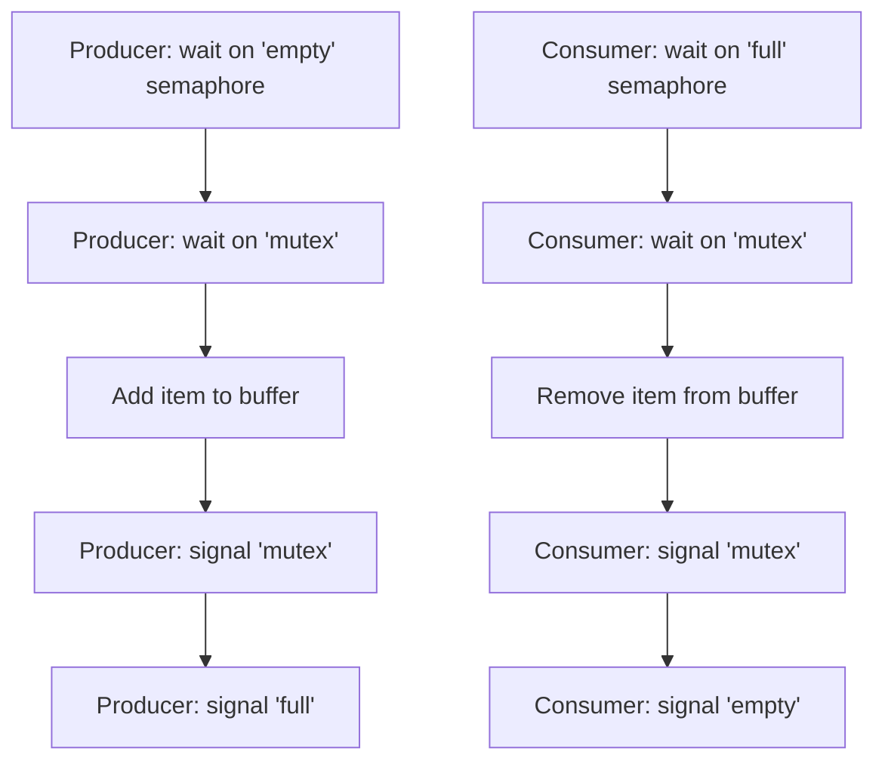
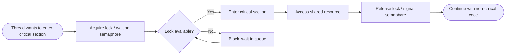

# Synchronization

> Part of [Phase 05 — Operating Systems](./README.md)

---

## What is it?

Synchronization is the set of techniques operating systems and concurrent programs use to **coordinate access to shared resources**, ensuring that multiple processes or threads accessing the same data at the same time don't corrupt it or produce incorrect results.

## Why do we need it?

As established in [`Thread.md`](./Thread.md), threads (and, via shared memory or files, even processes) can access the SAME data concurrently. Without careful coordination, this leads to **race conditions** — bugs where the final result depends unpredictably on the exact timing of execution, producing incorrect (and often maddeningly hard-to-reproduce) behavior.

## Real-world analogy

Think of synchronization like a single-lane bridge with a traffic light. Multiple cars (threads) want to cross, but only ONE can safely be on the bridge (the "critical section," the shared resource) at a time. The traffic light (a lock/mutex) ensures cars take turns — without it, two cars entering from opposite ends simultaneously would collide.

```text
   Cars (threads) waiting          Single-lane bridge (critical section)
   [Car A] [Car B] [Car C]  --->  [ 🚦 only ONE car crosses at a time ]
```

## Historical background

- **Edsger Dijkstra** introduced the **semaphore** in **1965**, in his paper _"Solution of a Problem in Concurrent Programming Control,"_ providing the first rigorous, general-purpose synchronization primitive.
- The classic synchronization problems (**Producer-Consumer, Readers-Writers, Dining Philosophers**) were formalized through the late 1960s-70s as standard benchmarks for evaluating new synchronization techniques — the Dining Philosophers problem, in particular, was introduced by Dijkstra in 1965.
- **Monitors**, a higher-level, easier-to-use synchronization construct built on top of locks and condition variables, were proposed by **C.A.R. Hoare (1974)** and **Per Brinch Hansen**, and remain the basis for `synchronized` blocks in Java and similar constructs in many modern languages.

## Mathematical foundation

**Level 1 — Explain it to a 15-year-old:**

Imagine two people trying to update the same shared shopping list app at the exact same moment — both read "3 items," both add one item, and both save "4 items" — but the TRUE correct answer should have been 5 items (since two separate additions happened). One update got silently lost because neither person knew about the other's simultaneous change. Synchronization is the set of rules that prevents this kind of lost update.

**Level 2 — Engineering Level:**

The **Critical Section Problem** asks: how do we ensure that when one thread is executing code that accesses shared data (the "critical section"), no other thread can simultaneously execute ITS critical section accessing the same data? A correct solution must guarantee three properties: **Mutual Exclusion** (only one thread in the critical section at a time), **Progress** (if no thread is in the critical section, a waiting thread must eventually be allowed in), and **Bounded Waiting** (a thread cannot be forced to wait forever, i.e., no starvation).

**Level 3 — Industry Level:**

Real systems use a hierarchy of synchronization tools: **mutexes/locks** (simple mutual exclusion), **semaphores** (a generalized counter-based primitive, useful for limiting access to N instances of a resource), **condition variables** (letting a thread efficiently wait for a specific condition to become true, instead of wasting CPU cycles repeatedly checking), and **monitors** (a higher-level, language-supported abstraction bundling a lock with condition variables, as in Java's `synchronized`).

**Level 4 — Research Level:**

Research into **lock-free and wait-free data structures** explores achieving correct concurrent behavior WITHOUT traditional locks at all, using atomic hardware instructions (compare-and-swap) directly — critical for high-performance systems where lock contention becomes a bottleneck. Research into **formal verification of concurrent programs** (model checking, linearizability proofs) addresses the notorious difficulty of proving concurrent code correct, given the astronomically large number of possible thread interleavings.

## Formal definition

A solution to the **Critical Section Problem** for `n` processes must satisfy:

```
1. Mutual Exclusion : no two processes may execute in their critical section simultaneously
2. Progress         : if no process is in its critical section, one of the processes wishing
                       to enter must be able to do so, in finite time
3. Bounded Waiting   : there exists a bound on the number of times other processes may enter
                       their critical section after a process has requested entry, before
                       that process's request is granted
```

A **semaphore** `S` is an integer variable accessed only through two atomic operations: `wait(S)` (decrement `S`; if `S < 0`, block) and `signal(S)` (increment `S`; wake a blocked process if any are waiting).

## Core concepts

- **Critical Section** — the portion of code that accesses shared resources and must not be executed by more than one thread/process at a time
- **Race Condition** — incorrect behavior arising from unsynchronized concurrent access to shared data
- **Mutex (Lock)** — the simplest synchronization primitive, allowing only one thread to hold it at a time
- **Semaphore** — a generalized counting primitive (binary semaphores act like mutexes; counting semaphores allow up to N concurrent accesses)
- **Deadlock** — a situation where synchronization goes wrong in a specific way, covered in depth in [`Deadlocks.md`](./Deadlocks.md)
- **Monitor** — a high-level construct bundling mutual exclusion and condition variables together
- **Condition Variable** — allows a thread to efficiently sleep until notified that some condition may now be true

## Internal working

A mutex internally works using an ATOMIC hardware instruction (like "test-and-set" or "compare-and-swap") to guarantee that checking-and-updating the lock's state cannot itself be interrupted midway by another thread — this atomicity, provided directly by the CPU, is the fundamental building block that all higher-level synchronization primitives (semaphores, monitors) are ultimately built from.

## Step-by-step explanation

**How the Producer-Consumer problem is solved using semaphores, step by step:**

1. Maintain a shared, fixed-size buffer, plus three semaphores: `empty` (counts available empty slots, initialized to buffer size), `full` (counts filled slots, initialized to 0), and `mutex` (a binary semaphore protecting the buffer itself, initialized to 1).
2. A PRODUCER thread: waits on `empty` (blocks if buffer is completely full), waits on `mutex` (ensures exclusive buffer access), adds an item to the buffer, signals `mutex` (releases exclusive access), then signals `full` (announces a new item is available).
3. A CONSUMER thread: waits on `full` (blocks if buffer is completely empty), waits on `mutex`, removes an item from the buffer, signals `mutex`, then signals `empty` (announces a slot is now free).
4. This combination correctly ensures producers never overflow the buffer, consumers never read from an empty buffer, and the buffer itself is never corrupted by simultaneous access.

## Visual diagram



## Architecture diagram

```text
Producer-Consumer with a bounded buffer (capacity 5):

Semaphores:  empty = 5, full = 0, mutex = 1   (initial state, buffer empty)

Buffer: [ _ ][ _ ][ _ ][ _ ][ _ ]

After Producer adds 2 items:
empty = 3, full = 2, mutex = 1
Buffer: [ X ][ X ][ _ ][ _ ][ _ ]

After Consumer removes 1 item:
empty = 4, full = 1, mutex = 1
Buffer: [ _ ][ X ][ _ ][ _ ][ _ ]
```

## Flowchart



## Example

Illustrate the race condition fix using a mutex on the `counter++` example from [`Thread.md`](./Thread.md):

```
WITHOUT lock (race condition possible):
Thread A: read counter (5)
Thread B: read counter (5)          <- both read the SAME stale value
Thread A: write counter = 5+1 = 6
Thread B: write counter = 5+1 = 6   <- lost update! should have been 7

WITH lock (correct):
Thread A: acquire lock
Thread A: read counter (5), write counter = 6
Thread A: release lock
Thread B: acquire lock (was blocked until now)
Thread B: read counter (6), write counter = 7
Thread B: release lock
Final counter = 7 (correct!)
```

## Dry run

Trace two threads competing for a mutex-protected critical section:

| Step | Thread A                  | Thread B                    | Lock State           |
| ---- | ------------------------- | --------------------------- | -------------------- |
| 1    | requests lock             | —                           | Free → Held by A     |
| 2    | in critical section       | requests lock               | Held by A; B blocked |
| 3    | still in critical section | blocked, waiting            | Held by A            |
| 4    | releases lock             | —                           | Free                 |
| 5    | —                         | acquires lock (was waiting) | Held by B            |
| 6    | —                         | in critical section         | Held by B            |
| 7    | —                         | releases lock               | Free                 |

## Multiple examples

**Example 1 — Readers-Writers Problem:** multiple readers may access shared data simultaneously (reading doesn't conflict), but a writer needs EXCLUSIVE access (no readers or other writers) — requiring a more nuanced synchronization scheme than a simple mutex.

**Example 2 — Dining Philosophers Problem:** five philosophers share five forks arranged between them; each needs BOTH neighboring forks to eat — a classic scenario used to illustrate both synchronization AND deadlock risks (see [`Deadlocks.md`](./Deadlocks.md)).

**Example 3 — Database transactions:** row-level locking in a database ensures two concurrent transactions can't corrupt the same row, directly applying mutex/semaphore-style synchronization at the data level.

## Advantages

- Properly applied synchronization guarantees CORRECTNESS of concurrent programs, preventing race conditions and data corruption.
- Semaphores and monitors provide flexible, general-purpose tools applicable to a huge range of coordination problems.
- Well-designed synchronization allows genuine PARALLELISM (multiple threads/processes making progress) while still protecting shared, sensitive data.

## Disadvantages

- Synchronization introduces overhead — acquiring/releasing locks costs CPU time, and contended locks force threads to wait, reducing potential parallelism.
- Incorrectly designed synchronization can lead to DEADLOCK (see [`Deadlocks.md`](./Deadlocks.md)) or reduced concurrency (holding locks longer than necessary).
- Concurrent, synchronized code is notoriously difficult to reason about, test, and debug — race conditions can be rare, timing-dependent, and hard to reproduce.

## Complexity

| Operation                                  | Typical Cost                                                 |
| ------------------------------------------ | ------------------------------------------------------------ |
| Uncontended lock acquire/release           | Very low (often a single atomic CPU instruction)             |
| Contended lock acquire (thread must block) | Higher — involves OS scheduler intervention (context switch) |
| Semaphore wait/signal                      | Similar to lock operations, plus counter management          |

## Memory usage

Synchronization primitives themselves (mutexes, semaphores) use minimal memory (typically a single integer/counter plus a wait queue) — the real "cost" of synchronization is in TIME (waiting, context switching), not memory.

## Time complexity

The critical practical insight: **an UNCONTENDED lock is nearly free (a single atomic instruction), but a CONTENDED lock can cost a full context switch** — this is why minimizing the TIME a lock is held (keeping critical sections as short as possible) is one of the most important practical synchronization design principles.

## Best practices

- Keep critical sections as SHORT as possible — hold locks for the minimum time necessary to reduce contention and improve concurrency.
- Always release locks in a way that's guaranteed to happen even if an error occurs (e.g., using `try/finally`, RAII in C++, or `with` statements in Python) to avoid accidentally leaving a lock held forever.
- Acquire multiple locks in a CONSISTENT, GLOBAL order across all threads to avoid deadlock (see [`Deadlocks.md`](./Deadlocks.md)).
- Prefer higher-level constructs (monitors, concurrent data structures) over raw semaphores when available — they are easier to use correctly.

## Common mistakes

- Forgetting to release a lock (or releasing it on the wrong code path), causing other threads to block forever.
- Using multiple locks in INCONSISTENT orders across different threads, creating a deadlock risk (the "lock ordering" problem).
- Assuming a "quick" shared variable access doesn't need synchronization — even simple operations like `counter++` are NOT atomic at the hardware level and require protection.
- Holding a lock during a SLOW operation (like a network call or disk I/O) unnecessarily, blocking other threads far longer than needed.

## Interview questions

1. What are the three required properties of a correct Critical Section solution?
2. Explain the difference between a mutex and a semaphore.
3. Solve the Producer-Consumer problem using semaphores.
4. What is a race condition, and how does synchronization prevent it?
5. What is a monitor, and how does it differ from using raw semaphores?

## University questions

1. State and explain the three requirements for a correct solution to the Critical Section Problem.
2. Solve the Readers-Writers problem using semaphores, ensuring no writer starvation.
3. Explain Dijkstra's semaphore operations (`wait`/`signal`) and their atomicity requirement.
4. Compare mutexes, semaphores, and monitors.

## Coding examples

### Pseudocode

```text
// Producer-Consumer using semaphores
SEMAPHORE empty = BUFFER_SIZE
SEMAPHORE full = 0
SEMAPHORE mutex = 1

FUNCTION producer():
    WHILE true:
        item = produceItem()
        wait(empty)
        wait(mutex)
        addToBuffer(item)
        signal(mutex)
        signal(full)

FUNCTION consumer():
    WHILE true:
        wait(full)
        wait(mutex)
        item = removeFromBuffer()
        signal(mutex)
        signal(empty)
        consumeItem(item)
```

### Python implementation

```python
import threading
import time
import queue

BUFFER_SIZE = 5
buffer = queue.Queue(maxsize=BUFFER_SIZE)

def producer():
    for i in range(10):
        buffer.put(i)   # blocks automatically if buffer is full (built-in synchronization)
        print(f"Produced {i}")
        time.sleep(0.01)

def consumer():
    for _ in range(10):
        item = buffer.get()  # blocks automatically if buffer is empty
        print(f"Consumed {item}")
        time.sleep(0.02)

t1 = threading.Thread(target=producer)
t2 = threading.Thread(target=consumer)
t1.start(); t2.start()
t1.join(); t2.join()
```

### C implementation

```c
#include <stdio.h>
#include <pthread.h>
#include <semaphore.h>

#define BUFFER_SIZE 5
int buffer[BUFFER_SIZE], in = 0, out = 0;
sem_t empty, full, mutex;

void* producer(void* arg) {
    for (int i = 0; i < 10; i++) {
        sem_wait(&empty);
        sem_wait(&mutex);
        buffer[in] = i;
        in = (in + 1) % BUFFER_SIZE;
        printf("Produced %d\n", i);
        sem_post(&mutex);
        sem_post(&full);
    }
    return NULL;
}

void* consumer(void* arg) {
    for (int i = 0; i < 10; i++) {
        sem_wait(&full);
        sem_wait(&mutex);
        int item = buffer[out];
        out = (out + 1) % BUFFER_SIZE;
        printf("Consumed %d\n", item);
        sem_post(&mutex);
        sem_post(&empty);
    }
    return NULL;
}

int main() {
    sem_init(&empty, 0, BUFFER_SIZE);
    sem_init(&full, 0, 0);
    sem_init(&mutex, 0, 1);

    pthread_t prod, cons;
    pthread_create(&prod, NULL, producer, NULL);
    pthread_create(&cons, NULL, consumer, NULL);
    pthread_join(prod, NULL);
    pthread_join(cons, NULL);
    return 0;
}
```

### C++ implementation

```cpp
#include <iostream>
#include <thread>
#include <queue>
#include <mutex>
#include <condition_variable>
using namespace std;

queue<int> buffer;
const int BUFFER_SIZE = 5;
mutex mtx;
condition_variable notFull, notEmpty;

void producer() {
    for (int i = 0; i < 10; i++) {
        unique_lock<mutex> lock(mtx);
        notFull.wait(lock, [] { return buffer.size() < BUFFER_SIZE; });
        buffer.push(i);
        cout << "Produced " << i << endl;
        notEmpty.notify_one();
    }
}

void consumer() {
    for (int i = 0; i < 10; i++) {
        unique_lock<mutex> lock(mtx);
        notEmpty.wait(lock, [] { return !buffer.empty(); });
        int item = buffer.front(); buffer.pop();
        cout << "Consumed " << item << endl;
        notFull.notify_one();
    }
}

int main() {
    thread t1(producer), t2(consumer);
    t1.join(); t2.join();
}
```

### Java implementation

```java
import java.util.LinkedList;
import java.util.Queue;

public class ProducerConsumerDemo {
    static final int BUFFER_SIZE = 5;
    static Queue<Integer> buffer = new LinkedList<>();
    static final Object lock = new Object();

    static void produce() throws InterruptedException {
        for (int i = 0; i < 10; i++) {
            synchronized (lock) {
                while (buffer.size() == BUFFER_SIZE) lock.wait();
                buffer.add(i);
                System.out.println("Produced " + i);
                lock.notifyAll();
            }
        }
    }

    static void consume() throws InterruptedException {
        for (int i = 0; i < 10; i++) {
            synchronized (lock) {
                while (buffer.isEmpty()) lock.wait();
                int item = buffer.poll();
                System.out.println("Consumed " + item);
                lock.notifyAll();
            }
        }
    }

    public static void main(String[] args) throws InterruptedException {
        Thread producer = new Thread(() -> {
            try { produce(); } catch (InterruptedException e) {}
        });
        Thread consumer = new Thread(() -> {
            try { consume(); } catch (InterruptedException e) {}
        });
        producer.start(); consumer.start();
        producer.join(); consumer.join();
    }
}
```

## Visualization

```text
Semaphore values during Producer-Consumer execution (buffer size 5):

Initial:              empty=5, full=0
After 3 produces:     empty=2, full=3
After 1 consume:      empty=3, full=2
After 2 more produces: empty=1, full=4

'empty' and 'full' always sum to BUFFER_SIZE (5) -
a useful invariant for verifying correctness by hand.
```

## Industry use

- **Databases**: row/table/page-level locking directly applies mutex and semaphore concepts to protect concurrent transactions.
- **Web servers and application servers**: connection pools, thread pools, and shared caches all rely on synchronization primitives to remain correct under concurrent load.
- **Operating system kernels themselves**: internal kernel data structures (scheduler queues, file system metadata) are protected by kernel-level locks (spinlocks, mutexes).
- **Message queues** (Kafka, RabbitMQ): conceptually a large-scale, distributed Producer-Consumer pattern.

## Research relevance

Research into **lock-free and wait-free algorithms** (using atomic compare-and-swap operations instead of traditional blocking locks) remains an active area, critical for high-performance systems where lock contention becomes a bottleneck at scale. Research into **formal verification of concurrent systems** addresses the notoriously difficult problem of proving correctness across the enormous space of possible thread interleavings.

## Related concepts

- Thread (the concurrent execution units that require synchronization — see [`Thread.md`](./Thread.md))
- Deadlocks (a specific, serious failure mode that can arise from POORLY designed synchronization — see [`Deadlocks.md`](./Deadlocks.md))
- Process (synchronization also applies across processes via shared memory or file-based locks, not just threads within one process)

## Practice problems

1. Solve the Readers-Writers problem using semaphores, allowing multiple simultaneous readers but exclusive writer access.
2. Trace through a scenario where two threads acquire two locks in DIFFERENT orders, and explain why this risks deadlock.
3. Implement a simple thread-safe counter using a mutex in a language of your choice, and verify it produces correct results under concurrent increments.
4. Explain how a condition variable differs from simply looping and repeatedly checking a condition ("busy waiting").

## Advanced concepts

- **Monitors** — a higher-level construct (Java's `synchronized`, C#'s `lock`) that bundles mutual exclusion with condition variables, making correct synchronization easier to achieve than with raw semaphores.
- **Read-Write Locks** — a specialized lock allowing multiple concurrent readers OR one exclusive writer, directly solving the Readers-Writers problem efficiently.
- **Lock-Free Programming** — using atomic CPU instructions (compare-and-swap) to build correct concurrent data structures WITHOUT traditional blocking locks, trading implementation complexity for potentially much higher performance under contention.

## Summary

Synchronization provides the essential tools — mutexes, semaphores, monitors, condition variables — for coordinating concurrent access to shared resources, guaranteeing correctness (mutual exclusion, progress, bounded waiting) in the face of unpredictable thread/process interleaving. Mastering these tools, and the classic problems (Producer-Consumer, Readers-Writers, Dining Philosophers) they solve, is essential for writing correct concurrent software.

## Key takeaways

- A correct Critical Section solution requires Mutual Exclusion, Progress, and Bounded Waiting.
- Race conditions arise from unsynchronized concurrent access to shared data — even "simple" operations like incrementing a counter are not safe without synchronization.
- Semaphores (Dijkstra, 1965) generalize mutexes, using `wait`/`signal` atomic operations.
- Keep critical sections short, always release locks reliably, and use consistent lock ordering to avoid deadlock.
- Monitors and condition variables provide higher-level, easier-to-use synchronization than raw semaphores.

## References

- Dijkstra, E.W. (1965). _Solution of a Problem in Concurrent Programming Control_.
- Hoare, C.A.R. (1974). _Monitors: An Operating System Structuring Concept_.
- Silberschatz, A., Galvin, P., Gagne, G. _Operating System Concepts_, Chapter 6.
- Arpaci-Dusseau, R., Arpaci-Dusseau, A. _Operating Systems: Three Easy Pieces_, "Concurrency" chapters.

---

⬅ Back to [Phase 05 — Operating Systems README](./README.md)
