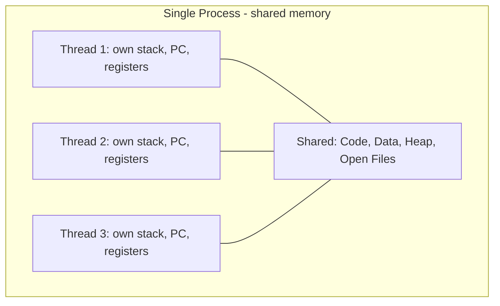
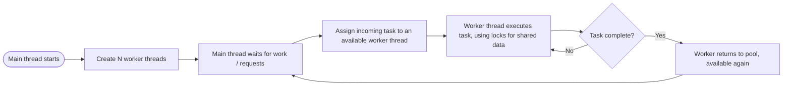

# Thread

> Part of [Phase 05 — Operating Systems](./README.md)

---

## What is it?

A thread is a **lightweight unit of execution within a process**, sharing that process's memory and resources with any other threads in the same process, but maintaining its own program counter, register set, and stack. A single process can contain multiple threads, all running (conceptually) at the same time, all reading and writing the SAME shared memory.

## Why do we need it?

Creating a whole new process for every small concurrent task is expensive (a new memory space, a new PCB) — but many concurrent tasks genuinely need to share data closely and frequently (e.g., a web server handling many requests against the same in-memory cache). Threads give us concurrency WITHOUT the overhead and isolation of separate processes, at the cost of needing careful synchronization since threads can freely (and dangerously) touch each other's data.

## Real-world analogy

Think of a process like an entire restaurant kitchen (with its own ingredients, equipment, and space), and threads like multiple COOKS working in that SAME kitchen simultaneously. They share the same ingredients, the same stove, and the same counter space (shared memory) — which makes collaboration fast and easy, but also means two cooks reaching for the same pan at the same moment can cause a collision (a **race condition**) unless they coordinate carefully.

```text
Process (one kitchen):
  Thread 1 (Cook A) --\
  Thread 2 (Cook B) ---> all share the SAME ingredients, stove, counter (memory)
  Thread 3 (Cook C) --/
```

## Historical background

- Early operating systems (1960s–70s) had no concept of threads — the process WAS the only unit of execution.
- **Threads emerged in the 1980s–90s** as researchers and OS designers recognized that many concurrent tasks (e.g., serving multiple network clients) didn't need full process isolation, just genuine concurrency with shared state.
- The **POSIX Threads (Pthreads) standard**, finalized in the mid-1990s, provided a portable threading API that became foundational across Unix-like systems.
- Modern languages have since built increasingly high-level concurrency abstractions a top OS threads (Java's `Thread`/`ExecutorService`, Python's `threading` module, Go's goroutines — though goroutines are actually a different, lighter-weight model built ON TOP of OS threads).

## Mathematical foundation

**Level 1 — Explain it to a 15-year-old:**

Imagine you're playing a video game while also chatting with a friend in a side window — both feel like they're happening "at the same time," within the SAME application, sharing the same game state and chat history. Under the hood, these might be two separate THREADS within one process (the game app), each handling a different task but able to see and use shared information instantly, without needing to "send a message" to another completely separate program.

**Level 2 — Engineering Level:**

Each thread has its own **program counter**, **register set**, and **stack** — but ALL threads within a process share the same **code (text) segment**, **data segment**, **heap**, and **open file descriptors**. This shared memory is exactly what makes threads lightweight (no new address space needed) and exactly what makes synchronization necessary (uncoordinated access to shared data causes race conditions).

**Level 3 — Industry Level:**

Real-world server software carefully chooses threading models: a **thread pool** (a fixed set of reusable worker threads) avoids the overhead of constantly creating/destroying threads per request. **User-level threads** (managed entirely in application/library code, not the OS kernel) can be extremely lightweight but can't leverage multiple CPU cores without OS support; **kernel-level threads** are scheduled directly by the OS and can run in true parallel on multi-core hardware, but have higher creation/switching overhead.

**Level 4 — Research Level:**

Research into **user-level "green threads"** and cooperative scheduling (as seen in Go's goroutines, Erlang's lightweight processes) explores how to achieve MASSIVE concurrency (millions of concurrent "threads") by avoiding expensive OS-level thread overhead entirely, using application-level schedulers instead — directly relevant to modern high-concurrency server design (handling hundreds of thousands of simultaneous network connections).

## Formal definition

A thread is represented by a **Thread Control Block (TCB)**, containing a thread ID, program counter, register set, and stack pointer — a strict SUBSET of what a full PCB tracks, since memory management info, open files, and other resources are inherited/shared from the owning process rather than duplicated per thread.

## Core concepts

- **Thread Control Block (TCB)** — the per-thread state the OS/runtime tracks
- **Shared Resources** — code, data, heap, and open files, shared among all threads of a process
- **Private Resources** — program counter, registers, and stack, unique to each thread
- **User-Level Threads** — managed by a user-space library, not directly visible to the OS kernel
- **Kernel-Level Threads** — managed and scheduled directly by the OS kernel
- **Multithreading Models** — Many-to-One, One-to-One, Many-to-Many (mapping user threads to kernel threads)
- **Race Condition** — incorrect behavior arising when multiple threads access shared data without proper synchronization

## Internal working

When the OS schedules a kernel-level thread, it performs a context switch much like between processes, but LIGHTER — since the memory mappings (page tables) don't need to change (all threads of a process already share the same address space), only the register set, program counter, and stack pointer need saving/restoring.

## Step-by-step explanation

**How a multithreaded program divides work, step by step (e.g., a web server):**

1. The main thread starts and creates a pool of WORKER threads at startup (avoiding the overhead of creating a new thread per request).
2. When a client request arrives, the main thread hands it off to an available worker thread from the pool.
3. The worker thread processes the request, potentially reading/writing SHARED data (e.g., an in-memory cache) — using appropriate synchronization (locks, see [`Synchronization.md`](./Synchronization.md)) to avoid corrupting shared state.
4. Once done, the worker thread sends the response and returns to the pool, ready for the next request.
5. Multiple worker threads handle multiple requests genuinely concurrently (in true parallel on a multi-core machine), all sharing the same underlying application state.

## Visual diagram



## Architecture diagram

```text
Process memory layout WITH multiple threads:

+---------------------------------------------------+
|  Code (Text) - SHARED by all threads                |
+---------------------------------------------------+
|  Data (globals) - SHARED by all threads              |
+---------------------------------------------------+
|  Heap - SHARED by all threads                        |
+---------------------------------------------------+
|  Thread 1 Stack  |  Thread 2 Stack  |  Thread 3 Stack |   <- PRIVATE per thread
+---------------------------------------------------+

Each thread has its OWN stack and register set (including program counter),
but everything else is genuinely shared - this is both the power
and the danger of multithreading.
```

## Flowchart



## Example

Illustrate a race condition with two threads both incrementing a shared counter WITHOUT synchronization:

```
Shared variable: counter = 0

Thread A:                      Thread B:
read counter (0)
                                 read counter (0)
counter = 0 + 1 = 1
write counter (1)
                                 counter = 0 + 1 = 1   <- using STALE value read earlier!
                                 write counter (1)

Expected final value: 2  (two increments)
Actual final value:   1  (one increment was LOST due to the race condition)
```

This exact scenario is why shared-memory concurrency requires synchronization — see [`Synchronization.md`](./Synchronization.md) for the fix (locks/mutexes).

## Dry run

Trace a thread pool of 2 workers processing 4 incoming tasks:

| Step | Event               | Worker 1     | Worker 2                 |
| ---- | ------------------- | ------------ | ------------------------ |
| 1    | Task A arrives      | processing A | idle                     |
| 2    | Task B arrives      | processing A | processing B             |
| 3    | Task C arrives      | processing A | processing B (queued: C) |
| 4    | Worker 2 finishes B | processing A | processing C             |
| 5    | Task D arrives      | processing A | processing C (queued: D) |
| 6    | Worker 1 finishes A | processing D | processing C             |

This shows how a fixed-size thread pool handles MORE tasks than threads by queuing excess work — avoiding the cost of creating a new thread per task while still achieving real concurrency.

## Multiple examples

**Example 1 — Responsive UI applications:** one thread handles user interface events (keeping the app responsive) while a SEPARATE thread performs slow work (loading a file, network request) in the background — a classic and extremely common threading pattern.

**Example 2 — Parallel computation:** splitting a large array sum across 4 threads, each summing a quarter of the array, then combining the 4 partial sums — genuine CPU parallelism on a multi-core machine.

**Example 3 — Web server thread pool:** a fixed pool of worker threads handles incoming HTTP requests, sharing an in-memory cache/database connection pool, coordinated via locks.

## Advantages

- Much LIGHTER weight than processes — thread creation and context switching are significantly cheaper (no new address space needed).
- Shared memory makes communication between threads fast and simple (no explicit inter-process communication mechanism needed).
- Enables genuine parallelism on multi-core hardware, directly improving performance for CPU-bound tasks.

## Disadvantages

- Shared memory is a double-edged sword — it directly causes race conditions, requiring careful, error-prone synchronization.
- A bug in ONE thread (e.g., corrupting shared memory, or an unhandled crash) can bring down the ENTIRE process, unlike the isolation processes provide.
- Debugging multithreaded programs is notoriously difficult — race conditions can be intermittent, timing-dependent, and hard to reproduce.

## Complexity

| Operation                                        | Relative Cost                                                                                                   |
| ------------------------------------------------ | --------------------------------------------------------------------------------------------------------------- |
| Thread creation                                  | Cheaper than process creation (no new address space)                                                            |
| Context switch (same process, different threads) | Cheaper than a process context switch (no page table change)                                                    |
| User-level thread creation/switch                | Even cheaper (no kernel involvement), but cannot leverage multiple cores without OS support (Many-to-One model) |

## Memory usage

Threads share the vast majority of their owning process's memory (code, data, heap) — each thread ADDS only its own stack and a small TCB, making threads far more memory-efficient than spawning equivalent separate processes.

## Time complexity

The core engineering trade-off: **threads are significantly cheaper to create and switch between than processes, at the direct cost of losing memory isolation** — this is precisely why concurrent programming within a single process REQUIRES the synchronization mechanisms covered in the next chapter.

## Best practices

- Use a thread pool (fixed, reusable set of worker threads) rather than creating a new thread per task, especially for high-frequency, short-lived work (e.g., web requests).
- Minimize shared mutable state between threads wherever possible — the less shared data, the less synchronization complexity.
- Always protect shared data with appropriate synchronization primitives (locks, semaphores) — never assume "it'll probably be fine" with concurrent access.
- Prefer higher-level concurrency abstractions (thread pools, concurrent data structures, async/await) over manually managing raw threads and locks when available.

## Common mistakes

- Forgetting that ALL threads in a process share memory — accidentally introducing race conditions by not synchronizing access to shared variables.
- Creating an unbounded number of threads (e.g., one per incoming request under heavy load), leading to excessive context-switching overhead and memory exhaustion.
- Confusing user-level and kernel-level threads — user-level threads (Many-to-One model) cannot achieve TRUE parallelism on multiple cores, a common point of confusion.
- Holding a lock for longer than necessary, unnecessarily reducing concurrency (see [`Synchronization.md`](./Synchronization.md)).

## Interview questions

1. What is the difference between a process and a thread?
2. What is shared between threads of the same process, and what is private to each thread?
3. Explain the Many-to-One, One-to-One, and Many-to-Many threading models.
4. What is a race condition, and how can it occur even with simple operations like incrementing a counter?
5. Why might a thread pool be preferred over creating a new thread for every task?

## University questions

1. Compare processes and threads in terms of memory usage, creation cost, and isolation.
2. Explain the three multithreading models (Many-to-One, One-to-One, Many-to-Many) with diagrams.
3. Describe a race condition scenario and explain how synchronization prevents it.
4. What is the difference between user-level and kernel-level threads?

## Coding examples

### Pseudocode

```text
FUNCTION workerThread(taskQueue):
    WHILE true:
        task = taskQueue.dequeue()   // blocks if empty
        result = process(task)
        reportResult(result)

FUNCTION main():
    taskQueue = new Queue()
    FOR i FROM 1 TO NUM_WORKERS:
        spawnThread(workerThread, taskQueue)
    FOR each incoming task:
        taskQueue.enqueue(task)
```

### Python implementation

```python
import threading

counter = 0
lock = threading.Lock()

def increment_safely(times):
    global counter
    for _ in range(times):
        with lock:              # synchronized - prevents race condition
            counter += 1

threads = [threading.Thread(target=increment_safely, args=(100000,)) for _ in range(4)]
for t in threads: t.start()
for t in threads: t.join()

print(f"Final counter (with lock): {counter}")  # correctly 400000
```

### C implementation

```c
#include <stdio.h>
#include <pthread.h>

long counter = 0;
pthread_mutex_t lock;

void* incrementSafely(void* arg) {
    int times = *(int*)arg;
    for (int i = 0; i < times; i++) {
        pthread_mutex_lock(&lock);
        counter++;
        pthread_mutex_unlock(&lock);
    }
    return NULL;
}

int main() {
    pthread_t threads[4];
    int times = 100000;
    pthread_mutex_init(&lock, NULL);

    for (int i = 0; i < 4; i++)
        pthread_create(&threads[i], NULL, incrementSafely, &times);
    for (int i = 0; i < 4; i++)
        pthread_join(threads[i], NULL);

    printf("Final counter (with lock): %ld\n", counter);  // 400000
    pthread_mutex_destroy(&lock);
    return 0;
}
```

### C++ implementation

```cpp
#include <iostream>
#include <thread>
#include <mutex>
#include <vector>
using namespace std;

long counter = 0;
mutex mtx;

void incrementSafely(int times) {
    for (int i = 0; i < times; i++) {
        lock_guard<mutex> lock(mtx);   // automatically unlocked when scope ends
        counter++;
    }
}

int main() {
    vector<thread> threads;
    for (int i = 0; i < 4; i++)
        threads.emplace_back(incrementSafely, 100000);
    for (auto& t : threads)
        t.join();

    cout << "Final counter (with lock): " << counter << endl;  // 400000
}
```

### Java implementation

```java
import java.util.ArrayList;
import java.util.List;

public class ThreadDemo {
    static long counter = 0;
    static final Object lock = new Object();

    static void incrementSafely(int times) {
        for (int i = 0; i < times; i++) {
            synchronized (lock) {
                counter++;
            }
        }
    }

    public static void main(String[] args) throws InterruptedException {
        List<Thread> threads = new ArrayList<>();
        for (int i = 0; i < 4; i++) {
            Thread t = new Thread(() -> incrementSafely(100000));
            threads.add(t);
            t.start();
        }
        for (Thread t : threads) t.join();

        System.out.println("Final counter (with lock): " + counter);  // 400000
    }
}
```

## Visualization

```text
Race condition WITHOUT a lock vs. correct result WITH a lock (4 threads x 100,000 increments each):

WITHOUT lock:  Final counter = unpredictable value LESS than 400,000
               (lost updates due to unsynchronized concurrent read-modify-write)

WITH lock:     Final counter = exactly 400,000, every single time
               (each increment is now atomic - fully completed before the next begins)
```

## Industry use

- **Web servers** (Apache with worker MPM, many Java application servers) use thread pools to handle concurrent client connections efficiently.
- **Desktop/mobile applications**: UI frameworks universally use a dedicated "main/UI thread" plus background worker threads to stay responsive during slow operations.
- **Game engines**: use multiple threads for physics, rendering, and AI, running genuinely in parallel on multi-core CPUs.
- **Scientific/numerical computing**: libraries like NumPy and multi-threaded BLAS implementations use threads to parallelize large matrix computations across CPU cores.

## Research relevance

Research into **lightweight concurrency models** (Go's goroutines, Erlang's actor-based lightweight processes, async/await-based coroutines) explores achieving far greater concurrency scale (potentially millions of "logical threads") than traditional OS threads allow, by moving scheduling into user-space runtimes — directly relevant to building today's highly concurrent network services and real-time systems.

## Related concepts

- Process (the heavier-weight container threads live within — see [`Process.md`](./Process.md))
- Synchronization (the essential toolkit for safely coordinating threads sharing memory — see [`Synchronization.md`](./Synchronization.md))
- CPU Scheduling (kernel-level threads, like processes, must be scheduled onto CPU cores — see [`CPU-Scheduling.md`](./CPU-Scheduling.md))
- Queue, Phase 2 (thread pools commonly use a task queue internally)

## Practice problems

1. Explain, with a concrete trace, how a race condition can occur even with a "simple" operation like `counter++`.
2. Compare the memory and creation-time cost of spawning 100 threads versus 100 processes performing the same work.
3. Design a thread pool architecture for a web server handling image resizing requests.
4. Research and explain the Global Interpreter Lock (GIL) in Python and its impact on true multithreaded parallelism.

## Advanced concepts

- **Thread-Local Storage (TLS)** — a mechanism allowing each thread to have its OWN private copy of a variable that would otherwise be shared, useful for per-thread caches or context.
- **Green Threads / Coroutines** — user-space, cooperatively-scheduled lightweight threads that avoid OS thread overhead entirely, enabling massive concurrency (as in Go, Erlang, and Python's `asyncio`).
- **Work-Stealing Schedulers** — an advanced thread pool design where idle worker threads "steal" queued tasks from busy threads' queues, improving load balancing (used in Java's `ForkJoinPool` and many modern parallel runtime libraries).

## Summary

Threads provide lightweight concurrency by sharing a process's memory and resources, at the cost of requiring careful synchronization to avoid race conditions. Understanding the trade-offs between processes (isolated, heavier) and threads (shared, lighter) — and the models connecting user-level and kernel-level threads — is essential for building any real concurrent or parallel system.

## Key takeaways

- Threads share a process's code, data, heap, and open files, but each has its own stack, program counter, and registers.
- Thread creation and context switching are significantly cheaper than for full processes.
- Shared memory makes threads fast to communicate through, but also directly causes race conditions if not properly synchronized.
- Thread pools avoid the overhead of constantly creating/destroying threads for short-lived, high-frequency tasks.
- User-level threads are cheap but limited (can't use multiple cores without OS support in the Many-to-One model); kernel-level threads enable true parallelism at higher overhead.

## References

- Silberschatz, A., Galvin, P., Gagne, G. _Operating System Concepts_, Chapter 4.
- IEEE POSIX 1003.1c (Pthreads standard, 1995).
- Arpaci-Dusseau, R., Arpaci-Dusseau, A. _Operating Systems: Three Easy Pieces_, "Concurrency" chapters.

---

⬅ Back to [Phase 05 — Operating Systems README](./README.md)
