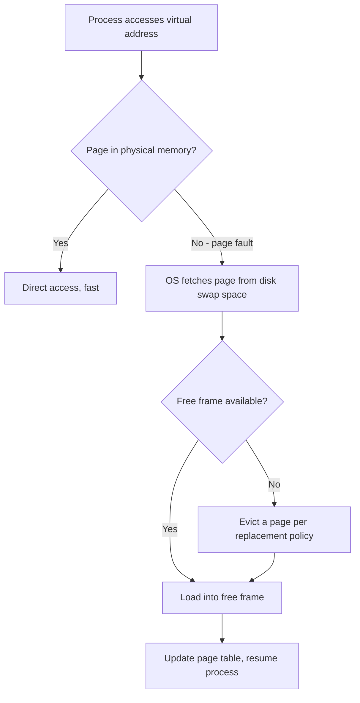
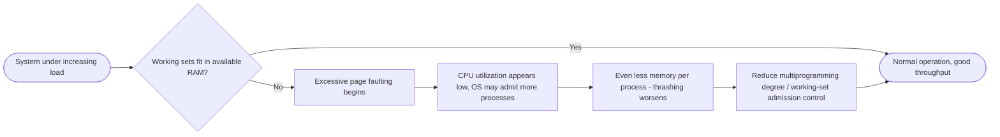

# Virtual Memory

> Part of [Phase 05 — Operating Systems](./README.md)

---

## What is it?

Virtual Memory is an OS technique that gives every process the illusion of having a **large, private, contiguous address space**, even though physical RAM is smaller, shared, and fragmented — by keeping only the ACTIVELY needed portions of a process in RAM at any moment, and transparently fetching the rest from disk on demand.

## Why do we need it?

Without virtual memory, every program would need to fit ENTIRELY in physical RAM, and programmers would need to manually manage which parts of their program are in memory at any time — a huge burden, and a hard limit on how large any single program could be. Virtual memory removes this burden entirely: programs can be larger than physical RAM, multiple programs can be isolated from each other, and the OS handles all the complexity transparently.

## Real-world analogy

Think of virtual memory like a hotel that BOOKS every guest a room number, even though the hotel doesn't have a physical room ready and prepared for every guest at every moment — most guests' "rooms" are just held in reserve (on disk) until they actually need to check in (be accessed), at which point the hotel quickly furnishes an actual room (a physical frame) just in time.

```text
Process's Virtual Address Space (large, "infinite" from its perspective):
[Page 0][Page 1][Page 2][Page 3][Page 4][Page 5] ... [Page N]
    |       |                       |
    v       v                       v
 (in RAM) (in RAM)              (on disk, not yet needed)
```

## Historical background

- Virtual memory was pioneered by the **Atlas computer** at the University of Manchester (**1959–1962**), the first system to implement true demand-paged virtual memory.
- Through the 1960s–70s, virtual memory became a standard feature of mainframe operating systems (IBM's OS/360 family, Multics), driven by the practical need to run programs larger than the (very expensive, very limited) physical memory of the era.
- Virtual memory reached personal computers more gradually — early PC operating systems (like early MS-DOS) had NO virtual memory at all, and it only became standard with 32-bit protected-mode operating systems (Windows NT, Linux) in the 1990s.

## Mathematical foundation

**Level 1 — Explain it to a 15-year-old:**

Imagine you're reading a 1,000-page book, but your desk can only hold 10 pages at a time. Virtual memory is like having an assistant who keeps the FULL book nearby (on a bookshelf, representing disk), and instantly swaps pages onto your desk (RAM) the moment you need to read them — you never notice the swapping happening, you just experience "having the whole book" available whenever you need any part of it.

**Level 2 — Engineering Level:**

Virtual memory is implemented via **demand paging**: pages are loaded into physical memory ONLY when actually referenced (not preemptively), using the page fault mechanism (see [`Memory-Management.md`](./Memory-Management.md)). This means a process can have a virtual address space FAR larger than physical RAM, as long as its actual ACTIVE working set (the pages it's currently using) fits in RAM.

**Level 3 — Industry Level:**

Modern operating systems combine demand paging with **swap space** (a dedicated disk area for pages evicted from RAM) and use sophisticated page replacement policies (LRU approximations, see [`Memory-Management.md`](./Memory-Management.md)) to decide what stays resident. Techniques like **Copy-on-Write** (used by `fork()`, see [`Process.md`](./Process.md)) and **memory-mapped files** (`mmap`) build directly on the virtual memory subsystem to enable efficient process creation and file access.

**Level 4 — Research Level:**

Research into virtual memory for modern hardware explores **huge pages** (using larger page sizes to reduce TLB miss rates for memory-intensive applications like databases and ML training), and virtual memory management for **heterogeneous and disaggregated memory** systems in datacenters, where "memory" might span local RAM, remote RAM over a network, and persistent memory with very different latency characteristics.

## Formal definition

A process's **virtual address space** is a range of addresses `[0, V)` that the process's code references, independent of physical memory layout. The OS maintains a mapping (via the page table) from virtual addresses to physical addresses, loading pages into physical frames only as needed (**lazy/demand loading**), and evicting pages back to disk (**swapping out**) when physical memory is full, using a page replacement algorithm.

## Core concepts

- **Demand Paging** — loading a page into memory only when it is actually referenced, not in advance
- **Swap Space** — a reserved area of disk used to store pages evicted from physical memory
- **Working Set** — the set of pages a process is ACTIVELY using during a given time window
- **Thrashing** — a severe performance collapse that occurs when a system spends more time paging (swapping) than doing actual useful work, because the working set doesn't fit in available RAM
- **Copy-on-Write (COW)** — an optimization where two processes initially SHARE the same physical pages, only actually copying a page when either process writes to it
- **Memory-Mapped Files** — treating a file's contents as if they were part of a process's address space, using the same demand-paging machinery

## Internal working

When a process accesses a virtual address whose page is NOT currently in physical memory, a page fault occurs (see [`Memory-Management.md`](./Memory-Management.md) for the detailed page fault handling steps). Virtual memory relies entirely on this mechanism: pages are lazily brought in only when actually touched, and — crucially — the process itself is completely unaware this is happening; it simply experiences a (relatively) brief pause during the fault, then continues as if the memory had "always" been there.

## Step-by-step explanation

**How thrashing develops and is detected, step by step:**

1. As more processes are added to the system (increasing multiprogramming), each process is allocated fewer physical frames.
2. If a process's allocated frames become smaller than its actual WORKING SET (the pages it genuinely needs to make progress), it begins page-faulting very frequently.
3. Each page fault requires a slow disk access, during which the CPU is essentially idle (or busy handling the fault) rather than doing useful work.
4. The OS may respond to this apparent "low CPU utilization" by admitting even MORE processes (mistakenly thinking the CPU is underutilized) — which makes the problem WORSE, since even less memory is now available per process.
5. This vicious cycle is **thrashing**: system throughput collapses even though the CPU appears "busy" (busy paging, not computing) — the fix is typically to REDUCE the degree of multiprogramming (fewer processes) or use working-set-based admission control to prevent this spiral in the first place.

## Visual diagram



## Architecture diagram

```text
Virtual Memory system overview:

Process Virtual Address Space         Physical RAM              Swap Space (disk)
+---------------------+           +----------------+       +-------------------+
| Page 0 [in RAM]      | -------> | Frame 3         |       |                   |
| Page 1 [in RAM]      | -------> | Frame 7         |       |                   |
| Page 2 [on disk]     | ------------------------------->  | (stored here)     |
| Page 3 [in RAM]      | -------> | Frame 1         |       |                   |
| Page 4 [on disk]     | ------------------------------->  | (stored here)     |
+---------------------+           +----------------+       +-------------------+

Only ACTIVELY used pages occupy scarce physical frames;
everything else waits safely on disk until actually needed.
```

## Flowchart



## Example

Illustrate the working set concept with a simple trace:

```
Process accesses pages in this order over a short time window:
1, 2, 1, 3, 1, 2, 4, 1, 2

Working set (window size = 5, looking at the last 5 references at each point):
At reference 9 (page 2), the last 5 references were: 1, 2, 4, 1, 2
Working set = {1, 2, 4}  (the DISTINCT pages referenced in this recent window)

If the process is allocated FEWER than 3 frames, it cannot hold its
entire working set in memory simultaneously -> frequent, thrash-prone faulting.
If allocated >= 3 frames, its working set fits -> efficient execution.
```

## Dry run

Trace a simplified thrashing scenario as more processes are added:

| Step | Processes Running | Frames per Process | Working Set Size | Result                                 |
| ---- | ----------------- | ------------------ | ---------------- | -------------------------------------- |
| 1    | 2                 | 20 frames each     | ~15 pages        | Fits comfortably, fast execution       |
| 2    | 5                 | 8 frames each      | ~15 pages        | Doesn't fit, frequent faulting begins  |
| 3    | 10                | 4 frames each      | ~15 pages        | Severe thrashing, throughput collapses |

This clearly shows: adding MORE processes doesn't help overall throughput once available frames per process drop below each process's actual working set size — it actively makes things worse.

## Multiple examples

**Example 1 — Running a program larger than RAM:** a video editing application with a 16 GB project file can run on an 8 GB RAM machine, as long as it doesn't need to actively touch more than 8 GB worth of pages at any given moment — virtual memory transparently handles the rest via disk.

**Example 2 — Copy-on-Write in `fork()`:** immediately after `fork()`, parent and child share ALL physical pages (no copying yet); only when one process WRITES to a page does the OS actually copy it — dramatically speeding up process creation (see [`Process.md`](./Process.md)).

**Example 3 — Memory-mapped file access:** a database can `mmap()` a large file and access it as if it were a normal in-memory array, letting the OS's existing virtual memory/paging machinery handle loading the relevant portions from disk automatically.

## Advantages

- Allows programs to use MORE memory than physically exists, dramatically simplifying application development.
- Provides strong memory isolation between processes (each has its own independent virtual address space).
- Enables powerful optimizations like Copy-on-Write and memory-mapped files, built directly on the same underlying mechanism.

## Disadvantages

- Page faults requiring disk access are extremely slow (roughly 100,000x slower than a RAM access, as established in [`Memory-Management.md`](./Memory-Management.md)).
- Thrashing can cause catastrophic performance collapse if the system is overcommitted relative to available RAM.
- Address translation overhead (even with TLB caching) adds some cost to every memory access.

## Complexity

| Scenario                                         | Performance Characteristic                                 |
| ------------------------------------------------ | ---------------------------------------------------------- |
| Working set fits in RAM                          | Near-native memory access speed                            |
| Occasional page faults                           | Manageable overhead, amortized over program execution      |
| Thrashing (working set exceeds available frames) | Catastrophic — system throughput can collapse to near zero |

## Memory usage

Virtual memory allows a process's LOGICAL memory usage (virtual address space) to far exceed its PHYSICAL memory footprint at any given instant — the whole point of the system is decoupling these two numbers, backed by disk swap space as the "overflow" capacity.

## Time complexity

The single most important number from this entire phase, repeated because it's the crux of virtual memory's central trade-off: **a page fault costs roughly 100,000x longer than a normal RAM access** — virtual memory's entire performance model depends on page faults being RARE (working sets fitting comfortably in RAM most of the time), not the norm.

## Best practices

- Size physical RAM (and the degree of multiprogramming) to keep the AGGREGATE working set of all active processes comfortably within available RAM.
- Use memory-mapped files for large, sequentially or randomly accessed datasets rather than manually managing file I/O — let the virtual memory system's existing machinery do the work.
- Monitor for signs of thrashing (high page fault rate combined with low CPU utilization on useful work) as an early warning sign of memory overcommitment.

## Common mistakes

- Assuming ADDING more processes always improves system utilization — beyond a certain point (when working sets no longer fit), it actively causes thrashing and REDUCES useful throughput.
- Confusing virtual memory (the overall system enabling programs to use more memory than physically exists) with paging (the specific mechanism, covered in [`Memory-Management.md`](./Memory-Management.md), that implements it).
- Forgetting that Copy-on-Write means memory ISN'T actually duplicated at `fork()` time — a common misconception when reasoning about `fork()`'s real-world cost.

## Interview questions

1. What is virtual memory, and how does demand paging enable it?
2. Explain thrashing and how it can occur even when the CPU appears "busy."
3. What is the working set model, and how does it relate to thrashing prevention?
4. Explain Copy-on-Write and why it makes `fork()` efficient.
5. Why does a page fault cost so much more than a normal memory access?

## University questions

1. Explain demand paging and derive its performance impact using an "effective access time" formula.
2. Describe the working set model and its role in preventing thrashing.
3. Explain Copy-on-Write and its application in process creation.
4. Compare virtual memory systems with and without swap space.

## Coding examples

### Pseudocode

```text
FUNCTION effectiveAccessTime(memoryAccessTime, pageFaultRate, pageFaultServiceTime):
    RETURN (1 - pageFaultRate) * memoryAccessTime + pageFaultRate * pageFaultServiceTime

// Worked example:
// memoryAccessTime = 100 ns, pageFaultRate = 0.001 (0.1%), pageFaultServiceTime = 8 ms = 8,000,000 ns
// EAT = (0.999 * 100) + (0.001 * 8,000,000) = 99.9 + 8000 = 8099.9 ns
// -> even a TINY page fault rate (0.1%) dominates the effective access time!
```

### Python implementation

```python
def effective_access_time(memory_access_time_ns, page_fault_rate, page_fault_service_time_ns):
    return (1 - page_fault_rate) * memory_access_time_ns + page_fault_rate * page_fault_service_time_ns

# Worked example: 100ns memory access, 0.1% fault rate, 8ms (8,000,000ns) fault service time
eat = effective_access_time(100, 0.001, 8_000_000)
print(f"Effective Access Time: {eat} ns")  # 8099.9 ns - dominated by the rare but costly page faults

# Demonstrate the impact of reducing the fault rate:
for rate in [0.01, 0.001, 0.0001, 0.00001]:
    eat = effective_access_time(100, rate, 8_000_000)
    print(f"Fault rate {rate}: EAT = {eat:.2f} ns")
```

### C implementation

```c
#include <stdio.h>

double effectiveAccessTime(double memAccessTime, double faultRate, double faultServiceTime) {
    return (1 - faultRate) * memAccessTime + faultRate * faultServiceTime;
}

int main() {
    double memAccessTime = 100;          // ns
    double faultServiceTime = 8000000;   // 8ms in ns
    double rates[] = {0.01, 0.001, 0.0001, 0.00001};

    for (int i = 0; i < 4; i++) {
        double eat = effectiveAccessTime(memAccessTime, rates[i], faultServiceTime);
        printf("Fault rate %.5f: EAT = %.2f ns\n", rates[i], eat);
    }
    return 0;
}
```

### C++ implementation

```cpp
#include <iostream>
#include <vector>
using namespace std;

double effectiveAccessTime(double memAccessTime, double faultRate, double faultServiceTime) {
    return (1 - faultRate) * memAccessTime + faultRate * faultServiceTime;
}

int main() {
    double memAccessTime = 100, faultServiceTime = 8000000;
    vector<double> rates = {0.01, 0.001, 0.0001, 0.00001};

    for (double rate : rates) {
        double eat = effectiveAccessTime(memAccessTime, rate, faultServiceTime);
        cout << "Fault rate " << rate << ": EAT = " << eat << " ns" << endl;
    }
}
```

### Java implementation

```java
public class VirtualMemoryDemo {
    static double effectiveAccessTime(double memAccessTime, double faultRate, double faultServiceTime) {
        return (1 - faultRate) * memAccessTime + faultRate * faultServiceTime;
    }

    public static void main(String[] args) {
        double memAccessTime = 100, faultServiceTime = 8_000_000;
        double[] rates = {0.01, 0.001, 0.0001, 0.00001};

        for (double rate : rates) {
            double eat = effectiveAccessTime(memAccessTime, rate, faultServiceTime);
            System.out.printf("Fault rate %.5f: EAT = %.2f ns%n", rate, eat);
        }
    }
}
```

## Visualization

```text
Effective Access Time vs. Page Fault Rate (memAccess=100ns, faultService=8,000,000ns):

Fault Rate 1%:      EAT ≈ 80,099 ns   (800x slower than pure RAM access!)
Fault Rate 0.1%:    EAT ≈ 8,099 ns    (80x slower)
Fault Rate 0.01%:   EAT ≈ 899 ns      (9x slower)
Fault Rate 0.001%:  EAT ≈ 179 ns      (1.8x slower)

Even VERY small page fault rates dominate performance -
this is why minimizing faults (via good replacement algorithms
and adequate RAM) matters so disproportionately.
```

## Industry use

- **Every modern general-purpose OS** (Linux, Windows, macOS) implements demand-paged virtual memory as a foundational subsystem.
- **Databases** use memory-mapped files (`mmap`) extensively to let the OS's virtual memory system manage caching of large datasets.
- **Cloud/VM platforms** overcommit physical RAM across multiple virtual machines, relying on virtual memory and swap mechanisms (plus techniques like memory ballooning) to handle the resulting pressure gracefully.
- **Big data / ML training systems** carefully manage working sets and use huge pages to minimize page-fault and TLB-miss overhead for very large in-memory datasets.

## Research relevance

Research into virtual memory for **heterogeneous and disaggregated memory** (combining local RAM, remote/networked memory, and persistent memory in datacenters) is actively reshaping how operating systems reason about "distance" and latency in memory management, extending the classical single-machine virtual memory model to much more complex, distributed memory hierarchies.

## Related concepts

- Memory Management (paging, page replacement algorithms, page table calculations — see [`Memory-Management.md`](./Memory-Management.md))
- Process (each process has its own independent virtual address space — see [`Process.md`](./Process.md))
- CPU Scheduling (thrashing directly interacts with scheduling decisions about how many processes to admit — see [`CPU-Scheduling.md`](./CPU-Scheduling.md))

## Practice problems

1. Compute the effective access time for a system with 90% memory access time of 200 ns, a page fault rate of 0.5%, and a page fault service time of 10 ms.
2. Explain why increasing the degree of multiprogramming can sometimes DECREASE overall system throughput.
3. Trace a working set example with a different window size and reference string, and determine the minimum frames needed to avoid thrashing.
4. Research and explain how Copy-on-Write specifically speeds up `fork()` compared to a naive full-memory-copy implementation.

## Advanced concepts

- **Working Set Model** (Denning, 1968) — a formal model for determining how many frames a process needs based on its recent reference pattern, directly informing admission control to prevent thrashing.
- **Page Fault Frequency (PFF) algorithm** — a practical thrashing-prevention technique that dynamically adjusts a process's frame allocation based on its OBSERVED page fault rate.
- **Huge Pages** — using much larger page sizes (e.g., 2 MB or 1 GB instead of 4 KB) to dramatically reduce the number of page table entries and TLB misses for memory-intensive applications.

## Summary

Virtual memory gives every process the illusion of large, private, contiguous memory by loading pages on demand and transparently handling the gap between limited physical RAM and much larger virtual address spaces. Its performance model hinges entirely on page faults being rare — the effective access time calculations show how even a small fault rate can dominate overall performance, and thrashing (when working sets no longer fit in available RAM) can cause catastrophic throughput collapse.

## Key takeaways

- Virtual memory decouples a process's LOGICAL memory usage from physical RAM, using demand paging and swap space.
- Even a small page fault rate dramatically increases effective access time, since disk access is ~100,000x slower than RAM access.
- Thrashing occurs when the aggregate working set of running processes exceeds available physical RAM — the fix is reducing multiprogramming, not adding more processes.
- Copy-on-Write and memory-mapped files are powerful, widely-used optimizations built directly on the virtual memory subsystem.

## References

- Silberschatz, A., Galvin, P., Gagne, G. _Operating System Concepts_, Chapter 10.
- Denning, P. (1968). _The Working Set Model for Program Behavior_.
- Kilburn, T. et al. (1962). _One-Level Storage System_ (the Atlas computer's virtual memory design).
- Arpaci-Dusseau, R., Arpaci-Dusseau, A. _Operating Systems: Three Easy Pieces_, "Virtualization: Memory" chapters.

---

⬅ Back to [Phase 05 — Operating Systems README](./README.md)
