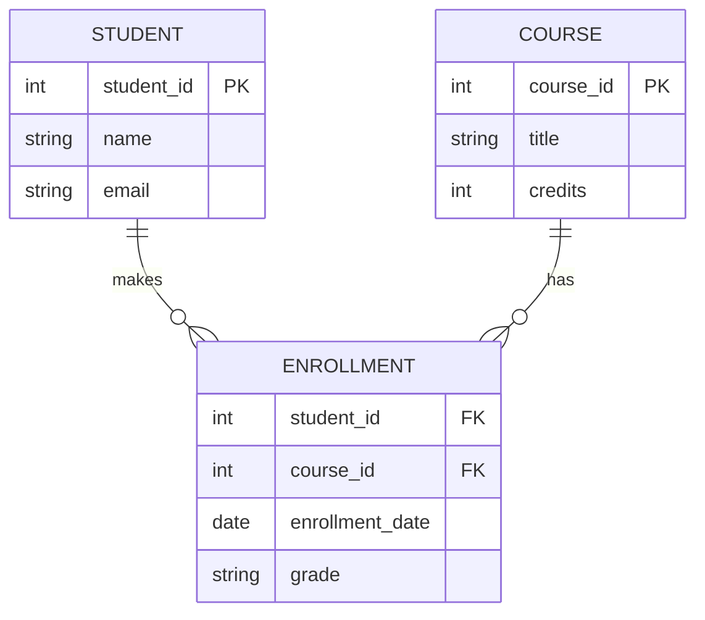
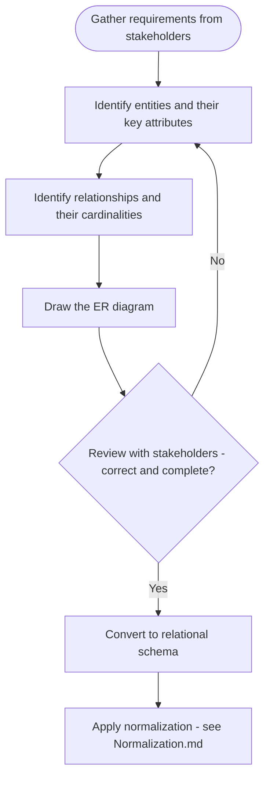

# Entity-Relationship (ER) Diagrams

> Part of [Phase 06 — Database Management Systems](./README.md)

---

## What is it?

An Entity-Relationship (ER) Diagram is a visual modeling technique for designing a database's structure BEFORE writing any code — identifying the real-world "things" (entities) a system needs to track, their properties (attributes), and how they relate to each other (relationships).

## Why do we need it?

Jumping straight into writing SQL `CREATE TABLE` statements without first modeling the problem tends to produce messy, inconsistent, hard-to-change schemas. ER diagrams give us a structured, visual way to think through a database's design at the CONCEPTUAL level — closer to how humans naturally think about the problem ("a customer places orders," "a book has an author") — before translating that model into the more rigid, technical relational schema.

## Real-world analogy

Think of an ER diagram like an architect's blueprint for a house, drawn BEFORE any construction begins. The blueprint shows rooms (entities), their sizes and features (attributes), and how they connect via doors and hallways (relationships) — letting the architect (and client) catch design problems on paper, where they're cheap to fix, rather than after the walls are already built.

```text
[Customer] ----places----> [Order] ----contains----> [Product]
   |                                                      |
 name, email                                          name, price
```

## Historical background

- The Entity-Relationship model was introduced by **Peter Chen** in his landmark **1976 paper**, _"The Entity-Relationship Model — Toward a Unified View of Data,"_ providing a graphical, implementation-independent way to model data that quickly became the industry standard for database design.
- ER modeling emerged directly alongside Codd's relational model (1970) as the natural CONCEPTUAL design step preceding the more formal, technical relational schema — separating "what does the data mean" from "how is it technically stored."
- Extended notations (Crow's Foot notation, UML class diagrams) later emerged as popular alternative visual styles for the same underlying ideas.

## Mathematical foundation

**Level 1 — Explain it to a 15-year-old:**

Imagine you're designing a system to track a school: there are STUDENTS, there are COURSES, and students TAKE courses. An ER diagram is just a structured way to draw this out — boxes for "Student" and "Course," a line connecting them labeled "Takes" — before you worry about any of the technical database details.

**Level 2 — Engineering Level:**

An ER diagram formally consists of **entities** (real-world objects, becoming tables), **attributes** (properties of entities, becoming columns), and **relationships** (associations between entities, with a defined **cardinality** — one-to-one, one-to-many, or many-to-many — determining how the relationship gets implemented in the final relational schema).

**Level 3 — Industry Level:**

Real-world database design begins with ER modeling (or an equivalent conceptual model) precisely because SCHEMA CHANGES become increasingly expensive once a system is in production with live data — catching a missing relationship or an incorrect cardinality assumption at the ER diagram stage costs minutes; catching it after millions of rows have been inserted with the wrong structure can cost days of migration work and real business risk.

**Level 4 — Research Level:**

Research into automated schema design and "schema-on-read" approaches (common in modern data lakes) explores how much of this traditionally UPFRONT, human-driven ER modeling process can be inferred or deferred using tools and flexible storage formats — though the underlying conceptual questions ER modeling addresses (what are the entities, what are their relationships) remain fundamentally unavoidable for any well-designed data system.

## Formal definition

An ER model is formally a tuple `(E, A, R)` where `E` is a set of entity types, `A` is a set of attributes (each associated with an entity type or a relationship), and `R` is a set of relationship types, each associating two or more entity types with an associated **cardinality constraint** describing how many instances of each entity can participate in the relationship.

## Core concepts

- **Entity** — a real-world object or concept the database needs to track (e.g., Student, Order, Product)
- **Attribute** — a property of an entity (e.g., a Student's name, email) — can be simple, composite, derived, or multi-valued
- **Primary Key** — the attribute(s) uniquely identifying each entity instance
- **Relationship** — an association between two or more entities (e.g., a Student ENROLLS IN a Course)
- **Cardinality** — how many instances of one entity can relate to instances of another: one-to-one (1:1), one-to-many (1:N), many-to-many (M:N)
- **Weak Entity** — an entity that cannot be uniquely identified by its own attributes alone, and depends on a relationship with another ("owner") entity for identification

## Internal working

An ER diagram doesn't itself "run" — its purpose is entirely as a DESIGN and COMMUNICATION tool. The real "internal working" is the systematic TRANSLATION process: each strong entity becomes a table, each attribute becomes a column, each one-to-many relationship becomes a foreign key, and each many-to-many relationship becomes an entirely NEW junction/bridge table (since relational tables cannot directly represent M:N relationships).

## Step-by-step explanation

**How to convert an ER diagram into a relational schema, step by step:**

1. For each STRONG entity, create a table with its attributes as columns, and its identified primary key as the table's PRIMARY KEY.
2. For each WEAK entity, create a table including the owner entity's primary key as part of its own primary key (a "partial key" plus the owner's key).
3. For each ONE-TO-MANY relationship, add a FOREIGN KEY column to the table on the "many" side, referencing the primary key of the table on the "one" side.
4. For each ONE-TO-ONE relationship, add a foreign key to EITHER table (commonly with a UNIQUE constraint to enforce the 1:1 cardinality).
5. For each MANY-TO-MANY relationship, create a NEW junction table containing foreign keys to BOTH related entities' primary keys (together forming the junction table's own composite primary key).
6. Add any relationship-specific attributes (e.g., "enrollment date" on a Student-Course relationship) as columns on the appropriate table (directly on the "many" side for 1:N, or on the junction table for M:N).

## Visual diagram



## Architecture diagram

```text
Cardinality notation reference:

ONE-TO-ONE (1:1):        [Person] ----1----1---- [Passport]
ONE-TO-MANY (1:N):       [Department] ----1----N---- [Employee]
MANY-TO-MANY (M:N):      [Student] ----N----N---- [Course]
                                    (requires a junction table!)

Weak entity notation (double-bordered box, e.g., "Room" depends on "Building"):
[Building] ----1----N==== [Room]   (Room's key = building_id + room_number)
```

## Flowchart



## Example

Design an ER model for a simple library system: Members BORROW Books.

```
Entities:
  Member(member_id [PK], name, email)
  Book(isbn [PK], title, author)

Relationship: Member BORROWS Book (Many-to-Many: a member can borrow many
books over time, and a book - across its copies/history - can be borrowed
by many members)

Relationship attributes: borrow_date, return_date (these belong to the
RELATIONSHIP itself, not to Member or Book alone)

Resulting relational schema:
  Member(member_id PK, name, email)
  Book(isbn PK, title, author)
  Borrow(member_id FK, isbn FK, borrow_date, return_date)
        -- composite primary key: (member_id, isbn, borrow_date)
        -- to allow the same member borrowing the same book multiple times
```

## Dry run

Trace converting a small ER model (Department 1:N Employee, with Employee also having a 1:1 relationship to Passport) into tables:

| Step | ER Element              | Resulting Table Structure                  |
| ---- | ----------------------- | ------------------------------------------ |
| 1    | Department entity       | `Department(dept_id PK, name)`             |
| 2    | Employee entity         | `Employee(emp_id PK, name)`                |
| 3    | Department 1:N Employee | Add `dept_id FK` to `Employee` table       |
| 4    | Passport entity         | `Passport(passport_id PK, number)`         |
| 5    | Employee 1:1 Passport   | Add `emp_id FK UNIQUE` to `Passport` table |

## Multiple examples

**Example 1 — One-to-Many:** a `Customer` places many `Orders`, but each `Order` belongs to exactly one `Customer` — the foreign key `customer_id` goes on the `Orders` table.

**Example 2 — Many-to-Many:** `Students` enroll in many `Courses`, and each `Course` has many `Students` — requires a junction table `Enrollment(student_id, course_id, ...)`.

**Example 3 — Weak entity:** a `Room` only makes sense in the context of a specific `Building` (room numbers might repeat across different buildings) — `Room`'s true identity is `(building_id, room_number)`, making it a weak entity dependent on `Building`.

## Advantages

- Provides a clear, visual, stakeholder-friendly way to design and communicate database structure before implementation.
- Catches design flaws (missing relationships, wrong cardinalities) early, when they're cheap to fix.
- Directly and mechanically translates into a relational schema, providing a smooth design-to-implementation pipeline.

## Disadvantages

- Can become visually cluttered for large, complex systems with many entities and relationships.
- Doesn't capture every implementation detail (indexes, specific data types, constraints) — additional design work is needed after the ER stage.
- Different ER notations (Chen's original notation, Crow's Foot, UML) can cause confusion when teams aren't aligned on conventions.

## Complexity

_(ER diagrams are a design artifact, not an algorithm — "complexity" here refers to conceptual/schema complexity, not computational complexity.)_

| Design Complexity                           | Typical Symptom                                                                       |
| ------------------------------------------- | ------------------------------------------------------------------------------------- |
| Too few entities                            | Overloaded tables mixing unrelated concepts, likely to need normalization fixes later |
| Too many weak entities                      | May indicate missing natural keys or an overly fragmented design                      |
| Excessive M:N relationships with attributes | May indicate a missing entity that should be modeled explicitly                       |

## Memory usage

_(Not directly applicable — an ER diagram is a design-time artifact.)_ However, cardinality choices made here DIRECTLY affect the eventual table sizes and foreign key overhead in the implemented schema.

## Time complexity

_(Not directly applicable in the algorithmic sense.)_ The practical "cost" consideration is that fixing a WRONG cardinality assumption after a schema is live in production (with real data) is vastly more expensive than fixing it during ER design — this is the central practical argument for doing ER modeling carefully, upfront.

## Best practices

- Always validate cardinalities against REAL business rules, not assumptions (e.g., "can a customer really have only one order? probably not").
- Identify weak entities explicitly — they signal that a natural, independent primary key doesn't exist for that entity.
- Model relationship ATTRIBUTES (like an enrollment date) carefully — they usually indicate the relationship itself needs to become its own table (especially for M:N relationships).
- Review the ER diagram with actual domain experts/stakeholders before finalizing — technical correctness doesn't guarantee business correctness.

## Common mistakes

- Modeling a Many-to-Many relationship as if it were a simple foreign key (impossible in a purely relational model without a junction table).
- Forgetting to give weak entities a properly composed key (owner's key + partial key).
- Conflating an ATTRIBUTE with an ENTITY (e.g., treating "Address" as just a text attribute when the system actually needs to query/relate addresses independently — in which case, Address should be its own entity).
- Not distinguishing between a relationship's cardinality from the CUSTOMER's/business's perspective versus a purely technical possibility (e.g., "can a customer place zero orders?" affects participation constraints, not just cardinality).

## Interview questions

1. What is the difference between an entity and an attribute?
2. How do you represent a many-to-many relationship in a relational schema?
3. What is a weak entity, and how is its primary key determined?
4. Walk through converting a simple ER diagram into SQL `CREATE TABLE` statements.
5. When would a relationship need its own attributes, and how does that affect the resulting schema?

## University questions

1. Draw an ER diagram for a hospital management system (Patients, Doctors, Appointments) with appropriate cardinalities.
2. Convert a given ER diagram (including one weak entity and one M:N relationship) into a relational schema.
3. Explain the difference between total and partial participation constraints in ER modeling.
4. Compare Chen's notation and Crow's Foot notation for representing cardinality.

## Coding examples

_(ER Diagrams are a design artifact; the "coding examples" here show the mechanical translation from ER model into schema-defining SQL.)_

### Pseudocode

```text
FUNCTION convertERtoSchema(entities, relationships):
    FOR entity IN entities:
        createTable(entity.name, entity.attributes, primaryKey=entity.key)

    FOR rel IN relationships:
        IF rel.cardinality == "1:N":
            addForeignKey(table=rel.manySide, references=rel.oneSide)
        ELSE IF rel.cardinality == "1:1":
            addForeignKey(table=rel.eitherSide, references=rel.otherSide, unique=True)
        ELSE IF rel.cardinality == "M:N":
            createJunctionTable(rel.entity1, rel.entity2, rel.attributes)
```

### Python implementation

```python
# A simplified "ER model -> SQL DDL" generator, illustrating the translation logic
def generate_schema(entities, relationships):
    statements = []

    for name, attrs, pk in entities:
        cols = ", ".join(f"{a} {t}" for a, t in attrs)
        statements.append(f"CREATE TABLE {name} ({cols}, PRIMARY KEY ({pk}));")

    for rel in relationships:
        if rel["cardinality"] == "1:N":
            statements.append(
                f"ALTER TABLE {rel['many']} ADD COLUMN {rel['one']}_id INT REFERENCES {rel['one']}(id);"
            )
        elif rel["cardinality"] == "M:N":
            statements.append(
                f"CREATE TABLE {rel['entity1']}_{rel['entity2']} ("
                f"{rel['entity1']}_id INT REFERENCES {rel['entity1']}(id), "
                f"{rel['entity2']}_id INT REFERENCES {rel['entity2']}(id), "
                f"PRIMARY KEY ({rel['entity1']}_id, {rel['entity2']}_id));"
            )
    return statements

entities = [
    ("Student", [("id", "INT"), ("name", "VARCHAR(100)")], "id"),
    ("Course", [("id", "INT"), ("title", "VARCHAR(100)")], "id"),
]
relationships = [{"cardinality": "M:N", "entity1": "Student", "entity2": "Course"}]

for stmt in generate_schema(entities, relationships):
    print(stmt)
```

### C implementation

```c
#include <stdio.h>

// Illustrative: printing DDL for a 1:N relationship translation (Department -> Employee)
int main() {
    printf("CREATE TABLE Department (dept_id INT PRIMARY KEY, name VARCHAR(100));\n");
    printf("CREATE TABLE Employee (\n");
    printf("    emp_id INT PRIMARY KEY,\n");
    printf("    name VARCHAR(100),\n");
    printf("    dept_id INT REFERENCES Department(dept_id)\n");
    printf(");\n");
    return 0;
}
```

### C++ implementation

```cpp
#include <iostream>
#include <string>
#include <vector>
using namespace std;

void printManyToManyJunction(string entity1, string entity2) {
    cout << "CREATE TABLE " << entity1 << "_" << entity2 << " (\n"
         << "    " << entity1 << "_id INT REFERENCES " << entity1 << "(id),\n"
         << "    " << entity2 << "_id INT REFERENCES " << entity2 << "(id),\n"
         << "    PRIMARY KEY (" << entity1 << "_id, " << entity2 << "_id)\n"
         << ");" << endl;
}

int main() {
    printManyToManyJunction("Student", "Course");
}
```

### Java implementation

```java
public class ERDiagramDemo {
    static void printManyToManyJunction(String entity1, String entity2) {
        System.out.println("CREATE TABLE " + entity1 + "_" + entity2 + " (");
        System.out.println("    " + entity1 + "_id INT REFERENCES " + entity1 + "(id),");
        System.out.println("    " + entity2 + "_id INT REFERENCES " + entity2 + "(id),");
        System.out.println("    PRIMARY KEY (" + entity1 + "_id, " + entity2 + "_id)");
        System.out.println(");");
    }

    public static void main(String[] args) {
        printManyToManyJunction("Student", "Course");
    }
}
```

## Visualization

```text
ER Diagram to Relational Schema translation, visualized:

ER Model:
[Student] --N----N-- [Course]  (Enrollment date, Grade on the relationship)

Relational Schema:
Student(student_id PK, name)
Course(course_id PK, title)
Enrollment(student_id FK, course_id FK, enrollment_date, grade)
    PRIMARY KEY (student_id, course_id)
```

## Industry use

- **Every new application's database design process** begins, in some form, with entity-relationship style modeling — whether drawn formally or discussed informally.
- **Database design tools** (dbdiagram.io, MySQL Workbench, ERDPlus, Lucidchart) are built specifically around ER (or ER-derived) modeling.
- **Data warehousing**: dimensional modeling (star/snowflake schemas) in analytics systems is a specialized descendant of ER modeling principles.

## Research relevance

Research into **automated schema inference** (inferring likely entities and relationships from unstructured or semi-structured data) and **schema evolution** (safely modifying a live production schema as requirements change) both directly build on the foundational concepts of entity and relationship modeling introduced in this chapter.

## Related concepts

- Normalization (the NEXT design step after ER modeling, refining the resulting schema — see [`Normalization.md`](./Normalization.md))
- SQL (the language used to actually implement the resulting schema — see [`SQL.md`](./SQL.md))
- Graphs, Phase 2 (an ER diagram is, structurally, a graph — entities as nodes, relationships as edges)

## Practice problems

1. Design an ER diagram for an online food delivery system (Customers, Restaurants, Orders, Delivery Drivers).
2. Convert your ER diagram from problem 1 into a full relational schema with appropriate primary and foreign keys.
3. Identify at least one weak entity in a real-world system of your choosing, and justify why it's weak.
4. Model a scenario where a relationship needs to become its own entity (hint: consider a relationship with its own relationships to other entities).

## Advanced concepts

- **Extended ER (EER) Model** — adds generalization/specialization (a form of inheritance, e.g., "Vehicle" generalizing "Car" and "Truck") and aggregation (treating a relationship itself as a higher-level entity) to the basic ER model.
- **Participation Constraints** — specifying whether EVERY instance of an entity must participate in a relationship (total participation) or only some may (partial participation), a subtlety often missed in basic ER modeling.
- **UML Class Diagrams** — a widely-used alternative (or complementary) notation to ER diagrams, especially common in object-oriented system design, capturing similar structural information.

## Summary

ER Diagrams provide a visual, conceptual way to model a database's structure — entities, attributes, and relationships with cardinalities — before committing to an implementation. This conceptual model translates mechanically into a relational schema, forming the essential first step of sound database design, directly preceding normalization and SQL implementation.

## Key takeaways

- Entities become tables, attributes become columns, and relationships become foreign keys (1:1, 1:N) or junction tables (M:N).
- Weak entities require a composite key combining their own partial key with their owner entity's key.
- Relationship attributes (like an enrollment date) usually indicate the relationship itself needs to be modeled as its own table.
- Careful, validated ER modeling upfront is vastly cheaper than fixing schema design mistakes after a system is live in production.

## References

- Chen, P. (1976). _The Entity-Relationship Model — Toward a Unified View of Data_.
- Silberschatz, A., Korth, H., Sudarshan, S. _Database System Concepts_, Chapter 6.
- Elmasri, R., Navathe, S. _Fundamentals of Database Systems_, Chapters 3–4.

---

⬅ Back to [Phase 06 — Database Management Systems README](./README.md)
