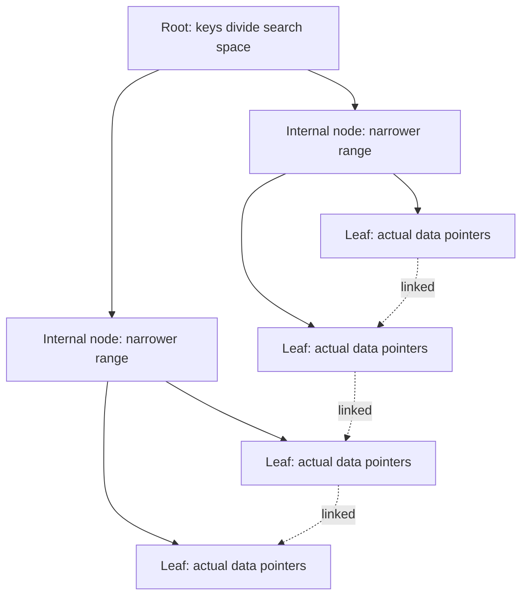

# Indexing

> Part of [Phase 06 — Database Management Systems](./README.md)

---

## What is it?

An index is an auxiliary data structure — separate from the actual table data — that lets a database find rows matching a search condition MUCH faster than scanning every row, in exchange for extra storage space and slightly slower writes.

## Why do we need it?

Without an index, finding a specific row (e.g., `WHERE customer_id = 5000`) requires scanning EVERY row in the table — a full table scan, costing `O(n)`. For a table with a billion rows, this is catastrophically slow for what should be an instant lookup. Indexes give us the same speedup that a book's index gives a reader: instead of reading every page to find a topic, you jump directly to the right page.

## Real-world analogy

Think of an index exactly like the index at the back of a textbook. Without it, finding every mention of "photosynthesis" means reading the ENTIRE book page by page. WITH the index, you look up "photosynthesis," see "pages 45, 112, 230," and jump directly there — dramatically faster, at the small cost of the index itself taking up a few extra pages.

```text
Without index: scan ALL rows          -->  O(n)
With index:    jump directly to match -->  O(log n) or O(1)
```

## Historical background

- The **B-Tree**, the data structure underlying the vast majority of database indexes, was invented by **Rudolf Bayer and Edward McCreight at Boeing in 1971–72**, specifically designed to minimize expensive disk reads for large, disk-resident datasets.
- Early database systems of the 1970s-80s adopted B-Trees (and the closely related B+ Tree variant) almost universally for indexing, and this remains true — over 50 years later — in essentially every relational database in production today.
- **Hash indexes**, offering O(1) average lookup for exact-match queries (but no support for range queries), became a standard COMPLEMENTARY index type alongside B-Trees through the same era.

## Mathematical foundation

**Level 1 — Explain it to a 15-year-old:**

Imagine looking for a specific word in a giant dictionary. You don't start on page 1 — you flip to roughly where it should be alphabetically, narrow down, and find it in a handful of steps. That's exactly the intuition behind a B-Tree index: repeatedly narrowing down a huge search space in just a few steps, instead of checking every single entry one by one.

**Level 2 — Engineering Level:**

A B-Tree index is a self-balancing, MULTI-WAY (not just binary) tree, specifically designed so that even VERY large tables can be searched in very few disk reads — because each node can hold MANY keys (often hundreds), the tree stays extremely SHALLOW (low height) even for billions of rows, and each level of the tree corresponds to roughly one disk read.

**Level 3 — Industry Level:**

Real databases distinguish between a **clustered index** (determines the PHYSICAL storage order of the table's rows — a table can have at most ONE) and **non-clustered/secondary indexes** (separate structures pointing BACK to the actual row location, a table can have MANY). Choosing which columns to index is a genuine engineering trade-off: every index speeds up READS matching that column, but slows down WRITES (every `INSERT`/`UPDATE`/`DELETE` must also update every relevant index) and consumes additional storage.

**Level 4 — Research Level:**

Research into **learned indexes** (Kraska et al., 2018) explores replacing traditional B-Tree structures with machine learning models that PREDICT a key's approximate location, potentially achieving both smaller memory footprint and faster lookups than traditional tree-based indexes for certain data distributions — an active, genuinely novel intersection of machine learning and classical database systems research.

## Formal definition

A B-Tree of **order `m`** is a tree where every node has AT MOST `m` children and AT LEAST `⌈m/2⌉` children (except the root), all leaves appear at the SAME depth (perfectly balanced), and keys within each node are kept in sorted order — guaranteeing `O(log n)` search, insert, and delete, with a very SHALLOW height due to the high branching factor.

## Core concepts

- **Clustered Index** — determines the physical storage order of table rows (at most one per table)
- **Non-Clustered (Secondary) Index** — a separate structure pointing to row locations, doesn't affect physical order (many allowed per table)
- **B-Tree / B+ Tree Index** — the default index type in nearly all relational databases, supporting both equality AND range queries efficiently
- **Hash Index** — O(1) average lookup for EXACT match queries only; cannot support range queries (`<`, `>`, `BETWEEN`)
- **Composite Index** — an index spanning MULTIPLE columns, useful for queries filtering on that specific combination
- **Covering Index** — an index that contains ALL columns a query needs, letting the database answer the query directly from the index without touching the actual table

## Internal working

A B+ Tree index (the most common variant used in practice) stores ALL actual data pointers only in the LEAF nodes, with internal nodes purely serving as a navigational "roadmap" — additionally, leaf nodes are typically linked together in a chain, making RANGE queries (`WHERE age BETWEEN 20 AND 30`) very efficient: find the starting point via tree traversal, then simply walk the linked leaves forward.

## Step-by-step explanation

**How a B-Tree index search works, step by step:**

1. Start at the root node, which contains a small number of KEYS dividing the search space into ranges.
2. Compare the search value against the root's keys to determine which CHILD subtree could contain it.
3. Follow the pointer to that child node (this typically corresponds to one disk read).
4. Repeat steps 2–3 at each level, narrowing the search space, until reaching a LEAF node.
5. Within the leaf node, find the exact matching key (or determine it doesn't exist), and follow its pointer to the actual row's physical location.

---

## Worked Examples: B-Tree Height and Index Sizing

This is a very common numeric question type in GATE and UGC NET DBMS papers.

### Worked Example 1 — Basic B-Tree height calculation

**Given:** a B-Tree index of order `m = 101` (i.e., each node can hold up to 100 keys and have up to 101 children), indexing a table with `N = 1,000,000` rows.

```
For a B-Tree of order m, each node (except root) has AT LEAST ceil(m/2) children.
Minimum branching factor = ceil(101/2) = 51

Worst-case height (fewest keys per node, tallest possible tree):
N <= (branching_factor)^height - roughly
height >= log_51(1,000,000)
        = ln(1,000,000) / ln(51)
        ≈ 13.8 / 3.93
        ≈ 3.5 -> round up to 4

So the tree has a height of AT MOST about 4 levels
-> a search requires AT MOST about 4 disk reads to find any row among 1 MILLION,
   even in the worst case. This dramatic shallowness (versus a plain binary
   search tree's ~20 levels for the same N) is EXACTLY why B-Trees (with their
   high branching factor) are used for disk-based indexes instead of
   simple binary search trees.
```

### Worked Example 2 — Computing B-Tree order from block size

**Given:** disk block size = 4096 bytes, key size = 12 bytes, pointer (block reference) size = 8 bytes. Find the order `m` of the B-Tree (maximum children per node).

```
Each node stores: (m-1) keys and m pointers, fitting within one disk block.

Space needed = (m-1) * keySize + m * pointerSize <= blockSize
(m-1)*12 + m*8 <= 4096
12m - 12 + 8m <= 4096
20m <= 4108
m <= 205.4

So m = 205 (round down - must fit within the block)

This means each node can have UP TO 205 children -
a very high branching factor, confirming why B-Tree indexes
stay so shallow even for enormous tables.
```

### Worked Example 3 — Comparing index vs. full table scan cost

**Given:** a table with 10,000,000 rows, stored 100 rows per disk block (so 100,000 total blocks). Compare the cost of a full table scan versus a B-Tree index lookup (order 205, as computed above) for finding ONE specific row.

```
FULL TABLE SCAN cost = number of BLOCKS to read (worst case, no early exit)
                      = 100,000 disk block reads

B-TREE INDEX LOOKUP cost = tree height (disk reads to navigate) + 1 (to fetch the row)
Using order m=205 (branching factor ~205):
height ≈ log_205(10,000,000) = ln(10,000,000)/ln(205) ≈ 16.1/5.32 ≈ 3.03 -> height ~4
Total index lookup cost ≈ 4 + 1 = 5 disk reads

Speedup factor = 100,000 / 5 = 20,000x faster using the index!

This dramatic, realistic gap is EXACTLY why indexing matters so much
in practice - the difference between an instant query and one that
times out, at real-world table sizes.
```

### Worked Example 4 — Index storage overhead calculation

**Given:** a table with 5,000,000 rows. An index on one column uses a key of 20 bytes plus an 8-byte row pointer per entry, with typical B-Tree overhead meaning the index uses roughly 1.5x the raw key+pointer data size (accounting for internal node overhead and partial page fill). Estimate the index's total storage size.

```
Raw data per entry = 20 (key) + 8 (pointer) = 28 bytes
Total raw data = 5,000,000 * 28 bytes = 140,000,000 bytes ≈ 133.6 MB
With 1.5x overhead: 133.6 MB * 1.5 ≈ 200.4 MB

So this single index costs roughly 200 MB of extra storage -
a concrete illustration of indexing's real storage trade-off,
which is why databases don't simply index EVERY column by default.
```

---

## Visual diagram



## Architecture diagram

```text
B+ Tree structure (order 4, illustrative):

                  [ 50 | 90 ]                          <- root (internal node)
                 /      |      \
         [20|35]    [60|75]    [95|120]                <- internal nodes
        /   |   \   /   |   \   /    |    \
     [..] [..] [..][..][..][..][..] [..] [..]          <- leaf nodes (data pointers)
       <----------- linked list of leaves ----------->
       (enables fast, sequential RANGE query scanning)
```

## Flowchart

```mermaid
flowchart LR
    Start([Query with WHERE clause on column X]) --> Check{Index exists on X?}
    Check -->|Yes| UseIndex[Use index: traverse B-Tree to find matching rows]
    Check -->|No| FullScan[Full table scan: check every row]
    UseIndex --> Fast([Fast: O log n]))
    FullScan --> Slow([Slow: O n]))
```

## Example

Illustrate the clustered vs. non-clustered index distinction:

```
Table: Employees(emp_id PK, name, department, salary)

CLUSTERED INDEX on emp_id:
  -> The table's actual rows are PHYSICALLY stored in emp_id order on disk.
  -> Only ONE clustered index is possible per table (rows can only be
     physically sorted ONE way).

NON-CLUSTERED (secondary) INDEX on department:
  -> A SEPARATE structure exists, sorted by department, where each entry
     points BACK to the actual row's location (which is physically sorted
     by emp_id, not department).
  -> Looking up "department = Sales" first searches this secondary
     structure, THEN follows a pointer to fetch the actual row -
     one extra "hop" compared to a clustered index lookup.
```

## Dry run

Trace a range query `WHERE age BETWEEN 25 AND 30` using a B+ Tree index on `age`:

| Step | Action                                            | Result                                 |
| ---- | ------------------------------------------------- | -------------------------------------- |
| 1    | Traverse tree from root, searching for `age = 25` | Reach the leaf node containing key 25  |
| 2    | Found starting point                              | Leaf entry for age=25                  |
| 3    | Follow the LEAF-LEVEL linked list forward         | age=26, age=27, age=28, age=29, age=30 |
| 4    | Stop when a key exceeds 30                        | Collected all matching rows            |

This shows exactly why B+ Trees (with linked leaves) are ideal for RANGE queries — after one tree traversal to find the start, the rest is a fast, sequential scan of the leaf chain, unlike a hash index which cannot support ranges at all.

## Multiple examples

**Example 1 — Composite index:** an index on `(last_name, first_name)` speeds up queries filtering on `last_name` alone, OR on both `last_name` AND `first_name` together — but does NOT efficiently help a query filtering on `first_name` alone (composite indexes are only useful as a LEFT-TO-RIGHT prefix).

**Example 2 — Covering index:** an index on `(customer_id, order_date, amount)` can fully answer `SELECT order_date, amount FROM orders WHERE customer_id = 5` directly from the index itself, without ever touching the actual table — a significant performance win.

**Example 3 — Hash index limitation:** a hash index on `price` can instantly answer `WHERE price = 100`, but CANNOT help at all with `WHERE price > 100` — for that, a B-Tree index is required.

## Advantages

- Dramatically speeds up equality and range queries — often by many orders of magnitude, as shown in Worked Example 3.
- B+ Trees remain balanced automatically, guaranteeing consistent `O(log n)` performance even as data grows.
- Covering indexes can eliminate the need to touch the actual table data at all for certain queries.

## Disadvantages

- Every index adds storage overhead (as computed in Worked Example 4) and slows down `INSERT`/`UPDATE`/`DELETE` operations (since indexes must be kept up to date).
- Too many indexes on a heavily-written table can significantly hurt write throughput.
- Indexes only help if the QUERY actually uses them effectively — a poorly written query (e.g., applying a function to an indexed column in the `WHERE` clause) can accidentally prevent the database from using an otherwise-perfect index.

## Complexity

| Operation       | B-Tree Index            | Hash Index    | No Index (full scan)   |
| --------------- | ----------------------- | ------------- | ---------------------- |
| Equality search | O(log n)                | O(1) average  | O(n)                   |
| Range search    | O(log n + k), k=results | Not supported | O(n)                   |
| Insert          | O(log n)                | O(1) average  | O(1) (append)          |
| Delete          | O(log n)                | O(1) average  | O(n) (must find first) |

## Memory usage

As demonstrated in Worked Example 4, index storage overhead is real and must be budgeted for — a common rule of thumb is that indexes collectively can add anywhere from 10% to 100%+ of a table's raw data size, depending on how many columns are indexed.

## Time complexity

The critical practical lesson, tying back to Worked Example 3: **a B-Tree index's logarithmic height means even billion-row tables can be searched in just a handful of disk reads** — this dramatic gap between O(n) and O(log n) at real-world scale is precisely why indexing is one of the single most impactful things a database engineer can do for query performance.

## Best practices

- Index columns frequently used in `WHERE`, `JOIN`, and `ORDER BY` clauses — but avoid indexing EVERY column, given the real write-performance and storage costs.
- Use composite indexes thoughtfully, remembering the "leftmost prefix" rule — column ORDER in a composite index matters.
- Regularly review query execution plans (`EXPLAIN`) to verify indexes are actually being used as expected.
- Consider covering indexes for extremely hot, performance-critical queries.

## Common mistakes

- Assuming MORE indexes always means BETTER performance — ignoring the real write-throughput and storage costs.
- Creating a composite index in the WRONG column order relative to actual query patterns, making it far less useful than intended.
- Applying a function to an indexed column in a `WHERE` clause (e.g., `WHERE YEAR(order_date) = 2024`), which often prevents the database from using the index at all.
- Forgetting that a hash index cannot support range queries — a common point of confusion when choosing an index type.

## Interview questions

1. What is the difference between a clustered and a non-clustered index?
2. Why do databases use B-Trees (not binary search trees) for indexing?
3. When would a hash index be preferable to a B-Tree index, and when would it not work at all?
4. What is a covering index, and why can it be significantly faster?
5. Explain the "leftmost prefix" rule for composite indexes.

## University questions

1. Given a block size, key size, and pointer size, compute the order of a B-Tree index.
2. Given a B-Tree order and number of records, compute the maximum height of the tree.
3. Compare the cost (in disk accesses) of a full table scan versus an indexed lookup for a given table size.
4. Explain the structural difference between a B-Tree and a B+ Tree, and why B+ Trees are preferred for database indexing.

## Coding examples

### Pseudocode

```text
FUNCTION bTreeSearch(node, key):
    i = 0
    WHILE i < node.numKeys AND key > node.keys[i]:
        i += 1
    IF i < node.numKeys AND key == node.keys[i]:
        RETURN node.pointers[i]   // found
    IF node.isLeaf:
        RETURN NOT_FOUND
    RETURN bTreeSearch(node.children[i], key)   // recurse into the correct subtree
```

### Python implementation

```python
class BTreeNode:
    def __init__(self, leaf=True):
        self.keys = []
        self.children = []
        self.leaf = leaf

def search(node, key):
    i = 0
    while i < len(node.keys) and key > node.keys[i]:
        i += 1
    if i < len(node.keys) and key == node.keys[i]:
        return f"Found at node, position {i}"
    if node.leaf:
        return "Not found"
    return search(node.children[i], key)

# Build a tiny illustrative 2-level tree
root = BTreeNode(leaf=False)
root.keys = [50]
left = BTreeNode(); left.keys = [10, 20, 30]
right = BTreeNode(); right.keys = [60, 70, 80]
root.children = [left, right]

print(search(root, 70))  # Found at node, position 1
print(search(root, 25))  # Not found
```

### C implementation

```c
#include <stdio.h>

// Simplified B-Tree height estimation calculator
#include <math.h>

int estimateHeight(long n, int minBranchingFactor) {
    return (int)ceil(log((double)n) / log((double)minBranchingFactor));
}

int main() {
    long n = 1000000;
    int minBranch = 51;  // ceil(101/2) for order-101 B-Tree
    printf("Estimated max height for %ld rows: %d\n", n, estimateHeight(n, minBranch));
    return 0;
}
```

### C++ implementation

```cpp
#include <iostream>
#include <cmath>
using namespace std;

int estimateOrder(int blockSize, int keySize, int pointerSize) {
    // (m-1)*keySize + m*pointerSize <= blockSize  ->  solve for m
    return (blockSize + keySize) / (keySize + pointerSize);
}

int main() {
    int order = estimateOrder(4096, 12, 8);
    cout << "Estimated B-Tree order: " << order << endl;  // ~205

    long n = 10000000;
    int minBranch = (order + 1) / 2;
    int height = (int)ceil(log((double)n) / log((double)minBranch));
    cout << "Estimated height for " << n << " rows: " << height << endl;
}
```

### Java implementation

```java
public class IndexingDemo {
    static int estimateOrder(int blockSize, int keySize, int pointerSize) {
        return (blockSize + keySize) / (keySize + pointerSize);
    }

    static int estimateHeight(long n, int minBranchingFactor) {
        return (int) Math.ceil(Math.log(n) / Math.log(minBranchingFactor));
    }

    public static void main(String[] args) {
        int order = estimateOrder(4096, 12, 8);
        System.out.println("Estimated B-Tree order: " + order);  // ~205

        int height = estimateHeight(10_000_000, (order + 1) / 2);
        System.out.println("Estimated height for 10M rows: " + height);
    }
}
```

## Visualization

```text
Disk reads comparison: full scan vs. B-Tree index, 10 million rows:

Full Table Scan:  ████████████████████████████████████████  100,000 block reads
B-Tree Index:      (essentially invisible at this scale)      ~5 block reads

The B-Tree bar isn't a rendering error - it genuinely IS
about 20,000 times fewer disk reads, exactly as computed
in Worked Example 3.
```

## Industry use

- **Every production relational database** (PostgreSQL, MySQL, Oracle, SQL Server) uses B+ Tree indexes as its default, primary indexing structure.
- **Search engines and full-text search systems** (Elasticsearch) use INVERTED indexes, a conceptually related but structurally different indexing approach optimized for text search.
- **Database administrators (DBAs)** spend significant professional effort specifically on index design and tuning, since it's one of the highest-leverage levers for real-world query performance.

## Research relevance

Research into **learned indexes** (replacing B-Trees with trained machine learning models predicting key locations) explores whether data-distribution-aware models can outperform traditional, distribution-agnostic tree structures for both speed and memory footprint — an active area bridging classical database systems and modern machine learning research.

## Related concepts

- Trees, Phase 2 (B-Trees are a direct, real-world application of the tree data structures studied there)
- SQL (whether and how an index gets USED depends directly on how a query is written — see [`SQL.md`](./SQL.md))
- Query Optimization (the optimizer decides WHETHER to use an available index for a given query — see [`Query-Optimization.md`](./Query-Optimization.md))

## Practice problems

1. Given a block size of 8192 bytes, key size of 16 bytes, and pointer size of 8 bytes, compute the B-Tree order.
2. Given a B-Tree of order 101, compute the maximum height for a table of 50,000,000 rows.
3. Explain why a composite index on `(country, city)` helps a query filtering on `country` alone, but a composite index on `(city, country)` does NOT efficiently help the same query.
4. Estimate the storage overhead of adding an index with a 30-byte key and 8-byte pointer to a 20,000,000-row table (assume 1.5x B-Tree overhead).

## Advanced concepts

- **Covering Indexes** — indexes containing every column a query needs, avoiding a trip to the actual table entirely.
- **Partial Indexes** — indexes covering only a SUBSET of rows matching a condition (e.g., `WHERE active = true`), saving space when most queries only care about that subset.
- **Learned Indexes** — a research-driven, ML-based alternative to traditional B-Trees, predicting key locations using trained models instead of a fixed tree structure.

## Summary

Indexes are auxiliary structures — almost always B+ Trees in practice — that trade extra storage and write overhead for dramatically faster reads, turning `O(n)` full table scans into `O(log n)` (or `O(1)` for hash indexes) lookups. The worked examples in this chapter show precisely why this matters at real-world scale: a B-Tree can reduce a 100,000-block scan down to about 5 block reads, a difference that routinely separates a usable application from an unusable one.

## Key takeaways

- Indexes turn O(n) full table scans into O(log n) B-Tree lookups (or O(1) for hash indexes on exact matches).
- A table can have at most ONE clustered index, but MANY non-clustered (secondary) indexes.
- B+ Trees (with linked leaf nodes) efficiently support BOTH equality and range queries; hash indexes support only equality.
- Every index has real costs: storage overhead and slower writes — indexing every column is not automatically beneficial.
- Composite indexes follow a "leftmost prefix" rule — column order matters for which queries they can help.

## References

- Bayer, R., McCreight, E. (1972). _Organization and Maintenance of Large Ordered Indices_.
- Comer, D. (1979). _The Ubiquitous B-Tree_.
- Kraska, T. et al. (2018). _The Case for Learned Index Structures_.
- Silberschatz, A., Korth, H., Sudarshan, S. _Database System Concepts_, Chapter 11.

---

⬅ Back to [Phase 06 — Database Management Systems README](./README.md)
