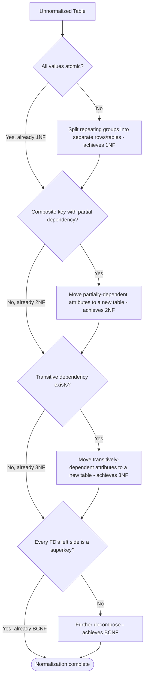
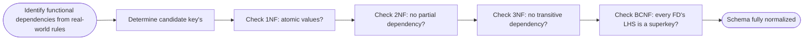

# Normalization

> Part of [Phase 06 — Database Management Systems](./README.md)

---

## What is it?

Normalization is a systematic process for organizing a database schema to **eliminate redundancy and prevent data anomalies**, by progressively decomposing tables according to a series of well-defined rules called "normal forms" — each stricter than the last.

## Why do we need it?

A poorly organized schema — storing the same information in multiple places — leads directly to THREE dangerous problems: **update anomalies** (changing one fact requires updating many rows, and forgetting even one leaves inconsistent data), **insertion anomalies** (you can't add certain information without also having unrelated information you don't yet have), and **deletion anomalies** (deleting one thing accidentally destroys other, unrelated information). Normalization is the formal, provable methodology for eliminating these problems.

## Real-world analogy

Imagine a spreadsheet listing every order, where EACH ROW repeats the full customer's name, address, AND phone number, over and over, for every single order they've ever placed. If a customer moves, you'd need to find and update EVERY row mentioning them — miss one, and now your spreadsheet contradicts itself about where that customer lives. Normalization is the disciplined process of separating "customer info" into its own table, so each fact is stored EXACTLY ONCE.

```text
BEFORE (unnormalized):                    AFTER (normalized):
OrderID CustName  CustAddress  Product    Customer: CustID, Name, Address
1       Alice     123 Main St  Book       Order: OrderID, CustID, Product
2       Alice     123 Main St  Pen        (Alice's address now stored ONCE)
3       Bob       456 Oak Ave  Laptop
```

## Historical background

- Normalization was introduced by **Edgar F. Codd**, the inventor of the relational model, starting with **First Normal Form (1NF)** in his original 1970 paper.
- Codd introduced **Second and Third Normal Forms (2NF, 3NF)** in a follow-up paper in **1971**, formalizing the idea of eliminating anomalies caused by functional dependencies.
- **Boyce-Codd Normal Form (BCNF)**, a stricter refinement of 3NF, was introduced by **Raymond Boyce and Edgar Codd** in **1974**, closing a subtle gap that 3NF alone didn't fully address.
- Higher normal forms (4NF, 5NF) were developed through the mid-to-late 1970s to address more exotic types of redundancy (multi-valued and join dependencies) beyond what BCNF covers.

## Mathematical foundation

**Level 1 — Explain it to a 15-year-old:**

Imagine a class roster spreadsheet where each row lists a student AND their teacher's phone number. If the SAME teacher teaches many students, their phone number is repeated over and over. If that teacher gets a new phone number, you'd have to change it in a dozen different rows — and if you missed even one, your spreadsheet would now have TWO different "correct" phone numbers for the same teacher, which is obviously wrong. Normalization is the rule-based process of splitting this into separate "Students" and "Teachers" tables so each fact lives in exactly one place.

**Level 2 — Engineering Level:**

Normalization is defined in terms of **functional dependencies**: `X → Y` means that knowing the value of attribute(s) `X` uniquely determines the value of attribute(s) `Y`. Each normal form (1NF, 2NF, 3NF, BCNF) prohibits a specific PATTERN of functional dependency that causes redundancy — for example, 2NF prohibits "partial dependency" (a non-key attribute depending on only PART of a composite primary key), and 3NF/BCNF prohibit "transitive dependency" (a non-key attribute depending on another non-key attribute, rather than directly on the key).

**Level 3 — Industry Level:**

In practice, database designers often DELIBERATELY **denormalize** portions of a schema (reintroducing some redundancy) for READ-heavy workloads — trading some risk of anomalies for significantly faster queries, since a fully normalized schema might require many expensive JOINs to reconstruct commonly-needed information. This is a genuine, constant engineering trade-off: normalize for write-safety and storage efficiency; denormalize (selectively) for read performance.

**Level 4 — Research Level:**

Research into **automatic schema normalization** explores algorithms that can, given a set of sample data or declared functional dependencies, automatically decompose a schema into BCNF (or a specified target normal form) while PRESERVING both all original functional dependencies (dependency preservation) and the ability to reconstruct the original data via joins (lossless join) — a genuinely non-trivial algorithmic problem, since achieving BCNF is NOT always possible while also preserving all dependencies simultaneously.

## Formal definition

A **functional dependency** `X → Y` holds on relation `R` if, for any two tuples `t1, t2 ∈ R`, `t1[X] = t2[X]` implies `t1[Y] = t2[Y]`. A **candidate key** is a minimal set of attributes that functionally determines all other attributes in the relation.

```
1NF : all attribute values are atomic (no repeating groups or nested tables)
2NF : 1NF, AND no partial dependency (no non-key attribute depends on only
      PART of a composite candidate key)
3NF : 2NF, AND no transitive dependency (no non-key attribute depends on
      another non-key attribute)
BCNF: for every non-trivial functional dependency X → Y, X must be a
      SUPERKEY (a stricter version of 3NF, closing 3NF's remaining gap)
```

## Core concepts

- **Functional Dependency (FD)** — a constraint stating that one attribute (or set) determines another
- **Candidate Key** — a minimal set of attributes uniquely identifying each row
- **Partial Dependency** — a non-key attribute depending on only PART of a composite key (violates 2NF)
- **Transitive Dependency** — a non-key attribute depending on ANOTHER non-key attribute rather than the key directly (violates 3NF)
- **Update / Insertion / Deletion Anomalies** — the three concrete problems normalization eliminates
- **Lossless Join Decomposition** — splitting a table into smaller tables such that joining them back together recovers EXACTLY the original data, with no spurious rows
- **Dependency Preservation** — ensuring a decomposition doesn't lose the ability to enforce the ORIGINAL functional dependencies without needing to join tables back together

## Internal working

Normalization works by systematically DECOMPOSING (splitting) a table whenever a functional dependency is found that violates the target normal form's rule — each split moves the "dependent" attributes into a NEW table, keyed by whatever they actually depend on, leaving the dependency correctly and directly expressed (as a key relationship) in the new, smaller table.

## Step-by-step explanation

**How to normalize a table up to 3NF, step by step:**

1. Identify all functional dependencies in the table, based on the real-world meaning of the data.
2. **Achieve 1NF**: ensure every column holds a single, atomic value (no lists, no repeating groups); if a column has multiple values, split it into a separate table.
3. **Achieve 2NF**: for tables with a COMPOSITE primary key, check for partial dependencies (a non-key attribute depending on only part of the key); move any such attribute into a new table keyed by just that part.
4. **Achieve 3NF**: check for transitive dependencies (a non-key attribute depending on another non-key attribute); move any such attribute into a new table keyed by the attribute it actually depends on.
5. (Optional, stricter) **Achieve BCNF**: check that EVERY functional dependency's left-hand side is a superkey; if not, further decompose.

---

## Worked Example: Normalizing from 1NF through BCNF

**Starting table** — `StudentCourse` (unnormalized, tracking student course enrollments with instructor info):

| StudentID | StudentName | CourseID | CourseName | InstructorID | InstructorOffice |
| --------- | ----------- | -------- | ---------- | ------------ | ---------------- |
| S1        | Alice       | C1       | DBMS       | I1           | Room 101         |
| S1        | Alice       | C2       | OS         | I2           | Room 102         |
| S2        | Bob         | C1       | DBMS       | I1           | Room 101         |

**Identified functional dependencies:**

```
StudentID -> StudentName
CourseID -> CourseName, InstructorID
InstructorID -> InstructorOffice
(StudentID, CourseID) -> everything (the full composite candidate key)
```

### Step 1 — Check 1NF

All values above are already atomic (no repeating groups/lists in a single cell) — **the table IS already in 1NF.**

### Step 2 — Check 2NF (no partial dependency on part of the composite key)

The composite primary key is `(StudentID, CourseID)`. Check each non-key attribute:

```
StudentName depends on StudentID ALONE (not CourseID) -> PARTIAL DEPENDENCY -> violates 2NF!
CourseName depends on CourseID ALONE (not StudentID) -> PARTIAL DEPENDENCY -> violates 2NF!
InstructorID depends on CourseID ALONE -> PARTIAL DEPENDENCY -> violates 2NF!
InstructorOffice depends on CourseID (via InstructorID) ALONE -> PARTIAL DEPENDENCY -> violates 2NF!
```

**Decompose to achieve 2NF:**

```
Student(StudentID PK, StudentName)
Course(CourseID PK, CourseName, InstructorID, InstructorOffice)
Enrollment(StudentID FK, CourseID FK)   -- PK: (StudentID, CourseID)
```

### Step 3 — Check 3NF (no transitive dependency)

Look at the new `Course` table: `CourseID -> InstructorID -> InstructorOffice`.

```
InstructorOffice depends on InstructorID, and InstructorID depends on CourseID
-> InstructorOffice depends TRANSITIVELY on CourseID (through InstructorID, a non-key attribute)
-> violates 3NF!
```

**Decompose further to achieve 3NF:**

```
Student(StudentID PK, StudentName)
Course(CourseID PK, CourseName, InstructorID FK)
Instructor(InstructorID PK, InstructorOffice)
Enrollment(StudentID FK, CourseID FK)   -- PK: (StudentID, CourseID)
```

### Step 4 — Check BCNF

For EVERY functional dependency `X → Y` in each table, is `X` a superkey of that table?

```
Student:      StudentID -> StudentName.       StudentID IS the primary key (superkey). OK.
Course:       CourseID -> CourseName, InstructorID.  CourseID IS the primary key. OK.
Instructor:   InstructorID -> InstructorOffice.      InstructorID IS the primary key. OK.
Enrollment:   no non-trivial FDs beyond the full composite key itself. OK.
```

**All four tables satisfy BCNF — the decomposition is complete.**

### Final normalized schema

```
Student(StudentID PK, StudentName)
Course(CourseID PK, CourseName, InstructorID FK -> Instructor)
Instructor(InstructorID PK, InstructorOffice)
Enrollment(StudentID FK -> Student, CourseID FK -> Course)
    PRIMARY KEY (StudentID, CourseID)
```

---

## Visual diagram



## Architecture diagram

```text
The Normal Form hierarchy (each level is STRICTER, a subset of the one before):

1NF  ⊃  2NF  ⊃  3NF  ⊃  BCNF  ⊃  4NF  ⊃  5NF
(atomic)  (no partial     (no transitive   (every FD's left
 values)   dependency)     dependency)      side is a superkey)

Every table in BCNF is automatically also in 3NF, 2NF, and 1NF -
but NOT every table in 3NF is automatically in BCNF (a subtle,
frequently-tested exception case).
```

## Flowchart



## Example

Illustrate the classic 3NF-but-NOT-BCNF exception case (a frequently tested exam trap):

```
Table: Booking(Student, Course, Instructor)
Functional Dependencies:
  (Student, Course) -> Instructor      (each student-course pair has one instructor)
  Instructor -> Course                  (each instructor teaches only ONE course)

Candidate keys: (Student, Course) AND (Student, Instructor)  -- BOTH are candidate keys!

Check 3NF: Instructor -> Course. Is "Course" a PRIME attribute (part of some candidate key)?
  YES, Course is part of the candidate key (Student, Course).
  Since the dependent attribute (Course) IS prime, this does NOT violate 3NF
  (3NF has a special exception allowing dependencies onto PRIME attributes).
  -> This table IS in 3NF.

Check BCNF: Instructor -> Course. Is "Instructor" (the LHS) a superkey?
  NO - Instructor alone is NOT a superkey (you need Student+Instructor, or Student+Course).
  -> This table VIOLATES BCNF, even though it satisfies 3NF!

This is the exact, famous gap between 3NF and BCNF that Boyce and Codd's 1974 refinement closed.
```

## Dry run

Trace identifying anomalies in the UNNORMALIZED `StudentCourse` table from the worked example above:

| Anomaly Type      | Concrete Problem in the Unnormalized Table                                                                                |
| ----------------- | ------------------------------------------------------------------------------------------------------------------------- |
| Update anomaly    | If Instructor I1 moves offices, EVERY row mentioning I1 must be updated — miss one, and data contradicts itself           |
| Insertion anomaly | Can't record a new Course's instructor until at least one student has enrolled in it (no student = no row to store it in) |
| Deletion anomaly  | If the last student enrolled in a course drops it, that course's instructor/office info is ACCIDENTALLY deleted too       |

## Multiple examples

**Example 1 — 1NF violation:** a table with a column `PhoneNumbers` containing `"555-1234, 555-5678"` (multiple values in one cell) — violates 1NF; requires splitting into a separate table or one row per phone number.

**Example 2 — 2NF violation:** an `OrderDetails(OrderID, ProductID, ProductName, Quantity)` table where `ProductName` depends only on `ProductID` (not the full composite key `OrderID+ProductID`) — a partial dependency, violating 2NF.

**Example 3 — Deliberate denormalization:** an analytics dashboard table might intentionally store a customer's name directly on each order row (denormalized) to avoid an expensive JOIN on every single dashboard load, accepting some redundancy risk in exchange for read speed.

## Advantages

- Eliminates update, insertion, and deletion anomalies, ensuring each fact is stored in exactly one place.
- Reduces storage redundancy, potentially saving significant space on large tables.
- Provides a rigorous, mathematically well-defined methodology (functional dependencies) rather than ad-hoc schema design.

## Disadvantages

- Highly normalized schemas often require MORE joins to reconstruct commonly-needed views of the data, which can hurt READ performance.
- Over-normalization can make a schema harder to understand and query for non-expert users.
- Achieving BCNF is not always possible while ALSO preserving all original functional dependencies without needing joins (a genuine theoretical limitation).

## Complexity

| Task                                                  | Complexity Consideration                                                                                         |
| ----------------------------------------------------- | ---------------------------------------------------------------------------------------------------------------- |
| Checking if an FD set implies a normal form violation | Depends on the number of FDs and candidate keys; manageable by hand for small schemas                            |
| Finding ALL candidate keys of a relation              | Can be computationally expensive for relations with many attributes and FDs (related to the closure computation) |
| Lossless join decomposition                           | Must be verified per decomposition — not automatically guaranteed by naively splitting tables                    |

## Memory usage

Fully normalized schemas typically use LESS total storage than denormalized ones (each fact stored once, not repeated) — though the difference in practice depends heavily on the specific data's redundancy patterns and the overhead of foreign keys/joins.

## Time complexity

The core engineering trade-off, worth repeating: **normalization optimizes for write correctness and storage efficiency; denormalization optimizes for read speed** — real systems often normalize the "source of truth" tables fully, while maintaining SEPARATE, deliberately denormalized read-optimized views or caches for performance-critical queries.

## Best practices

- Always derive functional dependencies from the REAL-WORLD business rules, not just from example data (example data can accidentally satisfy a dependency that doesn't actually hold in general).
- Normalize to at least 3NF (commonly BCNF) as the DEFAULT starting point for a new schema; denormalize DELIBERATELY and selectively afterward, only where performance profiling justifies it.
- Always verify that a decomposition is BOTH lossless (joining back reconstructs the original data exactly) AND dependency-preserving (where possible) — not just that it happens to eliminate one specific anomaly.

## Common mistakes

- Confusing 3NF's exception for PRIME attributes (attributes that are part of SOME candidate key) with BCNF, which has NO such exception — this is precisely the classic 3NF-but-not-BCNF trap shown above.
- Assuming normalization is always the goal — real systems intentionally trade some normalization for query performance (denormalization), and knowing when to do so is itself an important skill.
- Forgetting to verify LOSSLESS JOIN after decomposing a table — a careless decomposition can introduce spurious rows when tables are joined back together.
- Treating "atomic value" (1NF) as obvious — some cases (like a JSON blob in one column) are genuinely debatable and require judgment about the application's actual query needs.

## Interview questions

1. What are update, insertion, and deletion anomalies, and how does normalization address each?
2. Explain the difference between a partial dependency and a transitive dependency.
3. Why can a table be in 3NF but not in BCNF? Give an example.
4. When might you intentionally denormalize a database schema?
5. What is a lossless join decomposition, and why does it matter?

## University questions

1. Given a table and a set of functional dependencies, normalize it step by step from 1NF to BCNF.
2. Prove, using functional dependencies, that a given decomposition is lossless.
3. Explain the exception 3NF makes for prime attributes, and why BCNF does not share this exception.
4. Define functional dependency, candidate key, and superkey formally.

## Coding examples

### Pseudocode

```text
FUNCTION isInBCNF(table, functionalDependencies, candidateKeys):
    FOR each FD (X -> Y) IN functionalDependencies:
        IF X is NOT a superkey of table:
            RETURN false   // violates BCNF
    RETURN true

FUNCTION decomposeToBCNF(table, functionalDependencies):
    IF isInBCNF(table, functionalDependencies, findCandidateKeys(table)):
        RETURN [table]
    // find a violating FD X -> Y, split into two tables
    violatingFD = findViolatingFD(table, functionalDependencies)
    table1 = attributes in violatingFD.X UNION violatingFD.Y
    table2 = (table.attributes - violatingFD.Y) UNION violatingFD.X
    RETURN decomposeToBCNF(table1, ...) + decomposeToBCNF(table2, ...)
```

### Python implementation

```python
def is_superkey(attrs, all_attrs, fds):
    """Check if 'attrs' functionally determines all attributes (closure test)."""
    closure = set(attrs)
    changed = True
    while changed:
        changed = False
        for x, y in fds:
            if set(x).issubset(closure) and not set(y).issubset(closure):
                closure |= set(y)
                changed = True
    return closure == set(all_attrs)

def check_bcnf(all_attrs, fds):
    violations = []
    for x, y in fds:
        if not is_superkey(x, all_attrs, fds):
            violations.append((x, y))
    return violations

all_attrs = {"Student", "Course", "Instructor"}
fds = [
    (("Student", "Course"), ("Instructor",)),
    (("Instructor",), ("Course",)),
]

violations = check_bcnf(all_attrs, fds)
print("BCNF violations:", violations)  # [(('Instructor',), ('Course',))] - the classic gap!
```

### C implementation

```c
#include <stdio.h>
#include <string.h>

// Simplified: check if "Instructor" alone determines everything (superkey test)
// for the classic Student-Course-Instructor 3NF-but-not-BCNF example
int main() {
    // Hardcoded illustration of the closure computation
    // Instructor -> Course (given), but Instructor alone does NOT determine Student
    printf("Testing if {Instructor} is a superkey...\n");
    printf("Closure of {Instructor} = {Instructor, Course}\n");
    printf("All attributes = {Student, Course, Instructor}\n");
    printf("Is closure == all attributes? NO\n");
    printf("Conclusion: {Instructor} is NOT a superkey -> BCNF VIOLATED\n");
    return 0;
}
```

### C++ implementation

```cpp
#include <iostream>
#include <set>
#include <vector>
#include <string>
using namespace std;

set<string> computeClosure(set<string> attrs, vector<pair<set<string>, set<string>>>& fds) {
    set<string> closure = attrs;
    bool changed = true;
    while (changed) {
        changed = false;
        for (auto& [x, y] : fds) {
            bool xSubset = true;
            for (auto& a : x) if (!closure.count(a)) xSubset = false;
            if (xSubset) {
                for (auto& a : y) {
                    if (!closure.count(a)) { closure.insert(a); changed = true; }
                }
            }
        }
    }
    return closure;
}

int main() {
    set<string> allAttrs = {"Student", "Course", "Instructor"};
    vector<pair<set<string>, set<string>>> fds = {
        {{"Student", "Course"}, {"Instructor"}},
        {{"Instructor"}, {"Course"}},
    };

    set<string> closure = computeClosure({"Instructor"}, fds);
    cout << "Closure of {Instructor}: ";
    for (auto& a : closure) cout << a << " ";
    cout << endl;
    cout << "Is superkey? " << (closure == allAttrs ? "YES" : "NO") << endl;  // NO
}
```

### Java implementation

```java
import java.util.*;

public class NormalizationDemo {
    static Set<String> computeClosure(Set<String> attrs, List<Map.Entry<Set<String>, Set<String>>> fds) {
        Set<String> closure = new HashSet<>(attrs);
        boolean changed = true;
        while (changed) {
            changed = false;
            for (var fd : fds) {
                if (closure.containsAll(fd.getKey())) {
                    for (String a : fd.getValue()) {
                        if (closure.add(a)) changed = true;
                    }
                }
            }
        }
        return closure;
    }

    public static void main(String[] args) {
        Set<String> allAttrs = Set.of("Student", "Course", "Instructor");
        List<Map.Entry<Set<String>, Set<String>>> fds = List.of(
            Map.entry(Set.of("Student", "Course"), Set.of("Instructor")),
            Map.entry(Set.of("Instructor"), Set.of("Course"))
        );

        Set<String> closure = computeClosure(Set.of("Instructor"), fds);
        System.out.println("Closure of {Instructor}: " + closure);
        System.out.println("Is superkey? " + closure.equals(allAttrs));  // false
    }
}
```

## Visualization

```text
Decomposition tree for the worked StudentCourse example:

StudentCourse(StudentID, StudentName, CourseID, CourseName, InstructorID, InstructorOffice)
              |
              | (2NF: remove partial dependencies)
              v
    +----------------+------------------+
    |                |                  |
Student(SID,Name) Course(CID,CName,IID,IOffice) Enrollment(SID,CID)
                       |
                       | (3NF: remove transitive dependency IID -> IOffice)
                       v
              +-----------------+-------------------+
              |                 |
       Course(CID,CName,IID) Instructor(IID, IOffice)

Final: 4 tables, all in BCNF, zero redundancy, zero anomalies.
```

## Industry use

- **OLTP (Online Transaction Processing) systems** (banking, e-commerce order processing) are typically normalized to 3NF/BCNF, prioritizing write correctness and consistency for financial and inventory data.
- **OLAP/Analytics systems and data warehouses** commonly use DELIBERATELY denormalized star/snowflake schemas, prioritizing fast read/aggregate query performance over storage efficiency.
- **Database design tools and ORMs** (Object-Relational Mappers) often generate schemas that are normalized by default, requiring developers to consciously denormalize where performance demands it.

## Research relevance

Research into **automated normalization and schema refactoring tools** explores algorithmically discovering functional dependencies from existing data (rather than requiring them to be manually specified) and automatically suggesting or performing lossless, dependency-preserving decompositions — directly relevant to legacy database modernization and automated database design assistance.

## Related concepts

- ER Diagrams (the conceptual design step that PRECEDES normalization — see [`ER-Diagrams.md`](./ER-Diagrams.md))
- SQL (the language used to implement the resulting normalized schema — see [`SQL.md`](./SQL.md))
- Query Optimization (denormalization is often a direct response to query performance concerns — see [`Query-Optimization.md`](./Query-Optimization.md))

## Practice problems

1. Given a table `Enrollment(StudentID, StudentName, CourseID, CourseName, Grade)` with the obvious functional dependencies, normalize it to BCNF.
2. Determine whether a given decomposition of a specific table is lossless, using the standard lossless-join test.
3. Find all candidate keys for a relation given a specific set of functional dependencies.
4. Explain, with a concrete example, a real-world scenario where deliberate denormalization would be a reasonable engineering choice.

## Advanced concepts

- **Fourth Normal Form (4NF)** — eliminates redundancy caused by MULTI-VALUED dependencies (independent, repeating facts about the same key that shouldn't be combined in one table).
- **Fifth Normal Form (5NF)** — addresses redundancy from JOIN dependencies that aren't implied by simpler functional or multi-valued dependencies.
- **Armstrong's Axioms** — a set of inference rules (reflexivity, augmentation, transitivity) for formally deriving ALL functional dependencies implied by a given set, essential for rigorously computing attribute closures and candidate keys.

## Summary

Normalization systematically eliminates redundancy and anomalies by decomposing tables according to functional dependencies, progressing through 1NF, 2NF, 3NF, and BCNF — each level closing a specific gap the previous level left open. While full normalization is the sound DEFAULT for schema design, real-world systems often deliberately denormalize specific tables to optimize for read-heavy query performance, making normalization a foundational tool to be applied thoughtfully, not dogmatically.

## Key takeaways

- 1NF requires atomic values; 2NF eliminates partial dependencies; 3NF eliminates transitive dependencies; BCNF requires every FD's left side to be a superkey.
- A table can be in 3NF but NOT BCNF — specifically when a non-superkey determines a PRIME attribute (part of some other candidate key).
- Normalization eliminates update, insertion, and deletion anomalies by ensuring each fact is stored in exactly one place.
- Real systems balance normalization (write correctness, storage efficiency) against denormalization (read performance) as a deliberate, ongoing engineering trade-off.

## References

- Codd, E.F. (1970, 1971). _A Relational Model of Data..._ and the follow-up paper introducing 2NF/3NF.
- Boyce, R., Codd, E.F. (1974). _Recovery Semantics for a DB/DC System_ (origin of BCNF's refinement).
- Silberschatz, A., Korth, H., Sudarshan, S. _Database System Concepts_, Chapter 7.
- Elmasri, R., Navathe, S. _Fundamentals of Database Systems_, Chapters 14–15.

---

⬅ Back to [Phase 06 — Database Management Systems README](./README.md)
