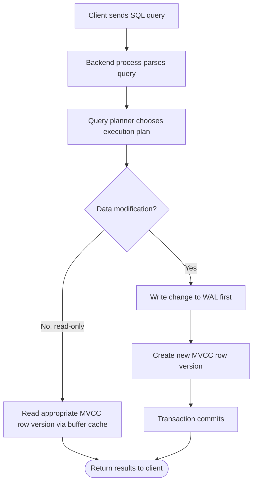
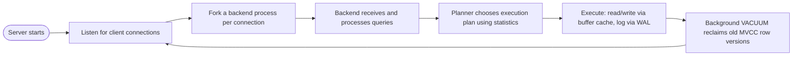

# PostgreSQL

> Part of [Phase 06 — Database Management Systems](./README.md)

---

## What is it?

PostgreSQL is a free, open-source, production-grade **Object-Relational Database Management System (ORDBMS)**, originally developed at UC Berkeley and continuously developed by a global open-source community since. This chapter is the **capstone** of Phase 6 — not a new abstract concept, but a demonstration of how every idea covered in this phase (ER modeling, normalization, SQL, indexing, transactions, query optimization) is implemented and directly observable in one real, massively-used production database system.

## Why do we need it?

Just as [`Linux.md`](../05-Operating-Systems/Linux.md) closed the loop for Operating Systems theory, this chapter closes the loop for Database theory — showing that everything from this phase isn't academic abstraction, but the actual, inspectable engineering behind a database trusted by some of the world's largest companies (including as the foundation for Amazon RDS Aurora PostgreSQL, Apple, Instagram's early infrastructure, and countless startups and enterprises).

## Real-world analogy

If ER Diagrams, Normalization, SQL, Indexing, Transactions, and Query Optimization were each individual engineering blueprints and principles, PostgreSQL is the actual, fully-built skyscraper — where you can point at a real support beam and say "THIS is the B-Tree index we discussed," or watch a real elevator (a transaction) enforce exactly the "everyone in or everyone out" guarantee described in theory.

## Historical background

- PostgreSQL traces its roots to **POSTGRES**, a research project begun in **1986** at UC Berkeley by **Michael Stonebraker** (who later won the **2014 Turing Award**, partly for this work), explicitly designed as a successor to Stonebraker's earlier, highly influential **INGRES** database project.
- POSTGRES pioneered many advanced concepts — including sophisticated support for complex data types and extensibility — well ahead of most commercial databases of its era.
- The project added SQL support and was renamed **Postgres95**, then finally **PostgreSQL** in **1996**, reflecting its evolution into a full, standards-compliant SQL database while retaining its research-driven, extensible architecture.
- PostgreSQL has been continuously developed as a fully open-source project for over 25 years, now widely regarded as one of the most advanced and standards-compliant open-source relational databases in the world.

## Mathematical foundation

**Level 1 — Explain it to a 15-year-old:**

Every abstract idea in this phase — normalized tables, SQL queries, indexes, ACID transactions — isn't just textbook theory. PostgreSQL is a REAL, working, free database implementing ALL of it, currently running behind countless apps and websites you've personally used. This chapter is where "textbook DBMS" meets "actual database you can install and query on your own laptop right now."

**Level 2 — Engineering Level:**

PostgreSQL implements: the full relational model with **strict SQL standards compliance** (see [`SQL.md`](./SQL.md)), **B-Tree, Hash, GiST, and GIN indexes** (see [`Indexing.md`](./Indexing.md)), **Multi-Version Concurrency Control (MVCC)** for transaction isolation (see [`Transactions.md`](./Transactions.md)), and a sophisticated **cost-based query planner** (see [`Query-Optimization.md`](./Query-Optimization.md)) — all as real, inspectable, open-source code.

**Level 3 — Industry Level:**

PostgreSQL's **extensibility** is a key differentiator in industry: it supports custom data types, custom index types, and extensions like **PostGIS** (geographic/spatial data) and **pgvector** (vector similarity search for AI/ML embeddings) — letting PostgreSQL adapt to entirely new workloads (like modern AI applications) without abandoning its rock-solid relational and transactional foundations.

**Level 4 — Research Level:**

PostgreSQL remains an active platform for database systems research: new indexing structures, query optimization techniques, and concurrency control improvements are frequently prototyped as PostgreSQL extensions or patches, given its combination of a clean, well-documented, extensible architecture and massive real-world production deployment — providing researchers both a rigorous testbed and a path to real-world impact.

## Formal definition

PostgreSQL is implemented as a **client-server** system: a `postgres` server process manages shared memory (including the **shared buffer cache**, caching frequently accessed data pages), coordinates multiple backend worker processes (one per client connection), and enforces ACID transactional guarantees using **Write-Ahead Logging (WAL)** and **MVCC** for concurrency control.

## Core concepts

- **MVCC (Multi-Version Concurrency Control)** — PostgreSQL's mechanism for transaction isolation, maintaining multiple row versions so readers never block writers (see [`Transactions.md`](./Transactions.md))
- **WAL (Write-Ahead Log)** — the durability and crash-recovery mechanism, directly paralleling file system journaling (see [`File-System.md`](../05-Operating-Systems/File-System.md))
- **`VACUUM`** — PostgreSQL's process for cleaning up old, no-longer-needed row versions created by MVCC, reclaiming storage space
- **`EXPLAIN` / `EXPLAIN ANALYZE`** — PostgreSQL's tools for inspecting the query optimizer's chosen execution plan (see [`Query-Optimization.md`](./Query-Optimization.md))
- **Extensions** — PostgreSQL's plugin architecture, allowing new data types, functions, and index types (like PostGIS, pgvector) to be added without modifying the core database
- **`pg_catalog`** — PostgreSQL's internal system catalog, itself stored as regular tables, describing the database's own schema, indexes, and statistics

## Internal working

When a client sends a query to PostgreSQL, a dedicated BACKEND PROCESS (spawned per connection) parses the SQL, consults the query PLANNER/OPTIMIZER (using statistics gathered by `ANALYZE`) to choose an execution plan, executes it (potentially reading data from the shared buffer cache, or from disk if not cached), and — for any data-modifying operation — first writes the change to the WAL before applying it to the actual data pages, guaranteeing durability even if the server crashes immediately afterward.

## Step-by-step explanation

**How a `BEGIN ... COMMIT` transaction executes in PostgreSQL, tying together this entire phase, step by step:**

1. The client issues `BEGIN`, starting a new transaction; PostgreSQL assigns it a unique transaction ID.
2. The client issues an `UPDATE` statement; PostgreSQL's planner (see [`Query-Optimization.md`](./Query-Optimization.md)) chooses how to locate the target rows — commonly via a **B-Tree index** (see [`Indexing.md`](./Indexing.md)) if a suitable one exists.
3. Rather than modifying the row IN PLACE, PostgreSQL's **MVCC** creates a NEW VERSION of the row, marked with the current transaction's ID — the OLD version remains visible to any OTHER transaction that started before this one commits (see [`Transactions.md`](./Transactions.md)).
4. This change is first recorded in the **WAL**, guaranteeing it can be recovered even if the server crashes right now.
5. The client issues `COMMIT`; PostgreSQL marks the transaction as officially committed, making the new row version visible to subsequently-starting transactions.
6. Later, PostgreSQL's background `VACUUM` process reclaims the space used by the now-obsolete OLD row version, once no active transaction could still need to see it.

## Visual diagram



## Architecture diagram

```text
PostgreSQL Architecture:

+----------------------------------------------------------------+
|  Client Applications (psql, application code via drivers)         |
+----------------------------------------------------------------+
                          |  connections  |
+----------------------------------------------------------------+
|  postgres server process                                          |
|   +-----------+  +-----------+  +-----------+  +---------------+ |
|   | Backend   |  | Query     |  | Shared    |  | WAL Writer    | |
|   | Processes |  | Planner/  |  | Buffer    |  | (durability)  | |
|   | (1/client)|  | Optimizer |  | Cache     |  |               | |
|   +-----------+  +-----------+  +-----------+  +---------------+ |
+----------------------------------------------------------------+
                          |
+----------------------------------------------------------------+
|  Disk: Table data (heap files), Indexes (B-Tree, etc.), WAL files |
+----------------------------------------------------------------+
```

## Flowchart



## Example

Trace observing indexing and query planning directly in PostgreSQL:

```sql
-- Create a table and populate it
CREATE TABLE orders (id SERIAL PRIMARY KEY, customer_id INT, amount NUMERIC);
-- (imagine 1,000,000 rows inserted here)

-- Without an index on customer_id:
EXPLAIN SELECT * FROM orders WHERE customer_id = 42;
-- Output: "Seq Scan on orders  (cost=0.00..18334.00 rows=5 width=12)"
--   -> PostgreSQL must scan EVERY row - directly matching the "no index"
--      worst case discussed in Indexing.md's Worked Example 3

-- Now add an index:
CREATE INDEX idx_orders_customer_id ON orders(customer_id);
EXPLAIN SELECT * FROM orders WHERE customer_id = 42;
-- Output: "Index Scan using idx_orders_customer_id on orders
--           (cost=0.42..8.44 rows=5 width=12)"
--   -> dramatically lower estimated cost - the SAME query, in the SAME database,
--      running vastly more efficiently purely because of the new index.
```

## Dry run

Trace `VACUUM` reclaiming space after several `UPDATE`s, directly illustrating MVCC:

| Step | Action                                                                   | Row Versions Present                                                                     |
| ---- | ------------------------------------------------------------------------ | ---------------------------------------------------------------------------------------- |
| 1    | `UPDATE orders SET amount=200 WHERE id=1` (inside T1, not yet committed) | v1 (old, amount=100) VISIBLE to others; v2 (new, amount=200) only visible to T1          |
| 2    | T1 commits                                                               | v2 becomes visible to new transactions; v1 becomes OBSOLETE but still physically present |
| 3    | Another `UPDATE` on the same row                                         | v3 created; v1 and v2 are now both obsolete                                              |
| 4    | `VACUUM` runs                                                            | v1 and v2 are physically reclaimed (assuming no other transaction still needs them)      |

## Multiple examples

**Example 1 — Observing normalization in practice:** PostgreSQL's `\d tablename` command in `psql` shows a table's actual columns, types, and foreign key constraints — a live view of a normalized schema's implementation (see [`Normalization.md`](./Normalization.md)).

**Example 2 — Observing transactions:** running two `psql` sessions side by side, starting a transaction in one (without committing) and querying the same row from the other, directly demonstrates MVCC's isolation guarantee — the second session sees the ORIGINAL, unmodified data.

**Example 3 — Observing extensibility:** installing the `pgvector` extension (`CREATE EXTENSION vector;`) adds an entirely new data type and specialized index type for storing and searching AI/ML embeddings — directly demonstrating PostgreSQL's extensible architecture applied to a cutting-edge, modern use case.

## Advantages

- Fully open-source and free, with an exceptionally active, long-running development community and extensive documentation.
- Strong standards compliance and advanced feature set (window functions, CTEs, JSON support, full-text search) rival or exceed many commercial databases.
- Highly extensible architecture (custom types, extensions like PostGIS and pgvector) lets it adapt to specialized, modern workloads.

## Disadvantages

- Historically, PostgreSQL's default configuration is conservative and requires manual TUNING (shared memory, work memory, autovacuum settings) for optimal performance at scale.
- Horizontal scaling (sharding across multiple machines) is not as natively built-in as in some NoSQL or NewSQL systems, though extensions and managed services (e.g., Citus) address this.
- MVCC's row versioning requires diligent `VACUUM` maintenance — a poorly-tuned or neglected autovacuum process can lead to significant performance degradation ("table bloat") over time.

## Complexity

| PostgreSQL Feature                    | Corresponding Phase 6 Chapter                                                  |
| ------------------------------------- | ------------------------------------------------------------------------------ |
| Table/schema design, foreign keys     | [`ER-Diagrams.md`](./ER-Diagrams.md), [`Normalization.md`](./Normalization.md) |
| Full SQL implementation (DDL/DML/DQL) | [`SQL.md`](./SQL.md)                                                           |
| B-Tree, Hash, GiST, GIN indexes       | [`Indexing.md`](./Indexing.md)                                                 |
| MVCC, WAL, isolation levels           | [`Transactions.md`](./Transactions.md)                                         |
| Cost-based query planner, `EXPLAIN`   | [`Query-Optimization.md`](./Query-Optimization.md)                             |

## Memory usage

PostgreSQL's `shared_buffers` configuration parameter directly controls how much memory is dedicated to caching frequently-accessed data pages (paralleling the OS page cache concepts from [`Memory-Management.md`](../05-Operating-Systems/Memory-Management.md) and [`Virtual-Memory.md`](../05-Operating-Systems/Virtual-Memory.md)) — a real, commonly-tuned production parameter with direct, measurable performance impact.

## Time complexity

PostgreSQL's query planner directly applies the dynamic-programming-based join order optimization discussed in [`Query-Optimization.md`](./Query-Optimization.md), and its B-Tree indexes directly deliver the `O(log n)` search guarantees discussed in [`Indexing.md`](./Indexing.md) — every complexity claim made earlier in this phase is a claim about REAL, currently-running PostgreSQL code, not just abstract theory.

## Best practices

- Run `ANALYZE` regularly (or rely on PostgreSQL's autovacuum daemon, which handles this automatically by default) to keep query planner statistics accurate.
- Use `EXPLAIN ANALYZE` routinely when diagnosing slow queries in a real PostgreSQL application.
- Choose an appropriate isolation level (`READ COMMITTED` is PostgreSQL's default) deliberately, upgrading to `SERIALIZABLE` only where the application genuinely requires it.
- Monitor and tune `autovacuum` settings for write-heavy tables to prevent table bloat from accumulating MVCC row versions.

## Common mistakes

- Forgetting that PostgreSQL's default isolation level is `READ COMMITTED`, not `SERIALIZABLE` — application code must explicitly opt into stricter isolation if needed.
- Neglecting `VACUUM`/autovacuum tuning on heavily-updated tables, leading to significant, sometimes confusing performance degradation over time.
- Assuming schema changes are always instant — some `ALTER TABLE` operations in PostgreSQL can require significant locking/rewriting for large, live production tables, requiring careful migration planning.
- Not using `EXPLAIN ANALYZE` before assuming a query is "just slow" — often a missing index or stale statistics is the identifiable, fixable root cause.

## Interview questions

1. What is MVCC, and how does PostgreSQL use it to avoid readers blocking writers?
2. What does PostgreSQL's `VACUUM` process do, and why is it necessary?
3. How would you diagnose a slow PostgreSQL query in production?
4. What is the Write-Ahead Log, and what guarantee does it provide?
5. Name a PostgreSQL extension and explain what capability it adds.

## University questions

1. Describe PostgreSQL's process architecture (backend processes, shared buffers, WAL writer).
2. Explain how PostgreSQL's MVCC implementation relates to the general concurrency control theory covered in Transactions.md.
3. Compare PostgreSQL's default isolation level to the SQL standard's four isolation levels.
4. Explain the purpose and function of PostgreSQL's `EXPLAIN` and `EXPLAIN ANALYZE` commands.

## Coding examples

### Pseudocode

```text
// Conceptual illustration of what happens for a real PostgreSQL transaction,
// tying every subsystem in this phase together
FUNCTION executeTransaction(queries):
    beginTransaction()                              // Transactions.md
    FOR query IN queries:
        plan = queryPlanner.optimize(query)          // Query-Optimization.md
        IF plan.usesIndex:
            rows = bTreeIndex.search(plan.condition)  // Indexing.md
        ELSE:
            rows = sequentialScan(table)
        IF query.isWrite:
            writeAheadLog.append(query)               // Transactions.md (durability)
            mvcc.createNewRowVersion(rows, query)      // Transactions.md (isolation)
    commitTransaction()
```

### Python implementation

```python
import psycopg2

# Connect and demonstrate transaction + indexing concepts directly against PostgreSQL
conn = psycopg2.connect("dbname=testdb user=postgres")
conn.autocommit = False  # explicit transaction control
cur = conn.cursor()

try:
    cur.execute("BEGIN")
    cur.execute("UPDATE accounts SET balance = balance - 100 WHERE id = 1")
    cur.execute("UPDATE accounts SET balance = balance + 100 WHERE id = 2")
    conn.commit()  # both updates become permanent together (Atomicity)
    print("Transfer committed successfully")
except Exception as e:
    conn.rollback()  # EITHER both updates happen, or NEITHER does
    print(f"Transfer failed, rolled back: {e}")

# Inspect the query plan directly
cur.execute("EXPLAIN SELECT * FROM accounts WHERE id = 1")
for row in cur.fetchall():
    print(row)

conn.close()
```

### C implementation

```c
#include <stdio.h>
#include <libpq-fe.h>

int main() {
    PGconn* conn = PQconnectdb("dbname=testdb user=postgres");

    if (PQstatus(conn) != CONNECTION_OK) {
        fprintf(stderr, "Connection failed: %s\n", PQerrorMessage(conn));
        return 1;
    }

    // Demonstrate a transaction directly via libpq
    PQexec(conn, "BEGIN");
    PQexec(conn, "UPDATE accounts SET balance = balance - 100 WHERE id = 1");
    PQexec(conn, "UPDATE accounts SET balance = balance + 100 WHERE id = 2");
    PGresult* res = PQexec(conn, "COMMIT");

    if (PQresultStatus(res) == PGRES_COMMAND_OK) {
        printf("Transfer committed successfully\n");
    }

    PQclear(res);
    PQfinish(conn);
    return 0;
}
```

### C++ implementation

```cpp
#include <iostream>
#include <pqxx/pqxx>
using namespace std;

int main() {
    try {
        pqxx::connection conn("dbname=testdb user=postgres");
        pqxx::work txn(conn);   // begins a transaction

        txn.exec("UPDATE accounts SET balance = balance - 100 WHERE id = 1");
        txn.exec("UPDATE accounts SET balance = balance + 100 WHERE id = 2");

        txn.commit();  // atomically commits both updates together
        cout << "Transfer committed successfully" << endl;

        pqxx::work readTxn(conn);
        pqxx::result r = readTxn.exec("EXPLAIN SELECT * FROM accounts WHERE id = 1");
        for (auto row : r) cout << row[0].c_str() << endl;

    } catch (const exception& e) {
        cerr << "Transfer failed, rolled back: " << e.what() << endl;
    }
}
```

### Java implementation

```java
import java.sql.*;

public class PostgreSQLDemo {
    public static void main(String[] args) {
        String url = "jdbc:postgresql://localhost/testdb";
        try (Connection conn = DriverManager.getConnection(url, "postgres", "")) {
            conn.setAutoCommit(false);  // explicit transaction control

            try (Statement stmt = conn.createStatement()) {
                stmt.executeUpdate("UPDATE accounts SET balance = balance - 100 WHERE id = 1");
                stmt.executeUpdate("UPDATE accounts SET balance = balance + 100 WHERE id = 2");
                conn.commit();
                System.out.println("Transfer committed successfully");
            } catch (SQLException e) {
                conn.rollback();
                System.out.println("Transfer failed, rolled back: " + e.getMessage());
            }

            try (Statement stmt = conn.createStatement();
                 ResultSet rs = stmt.executeQuery("EXPLAIN SELECT * FROM accounts WHERE id = 1")) {
                while (rs.next()) {
                    System.out.println(rs.getString(1));
                }
            }
        } catch (SQLException e) {
            e.printStackTrace();
        }
    }
}
```

## Visualization

```text
PostgreSQL's psql command-line tool: a live window into every concept in this phase

\d accounts          -> view table schema (ER-Diagrams.md, Normalization.md, made real)
\di                  -> list all indexes (Indexing.md, made real)
EXPLAIN ANALYZE ...  -> view real query execution plan and cost (Query-Optimization.md, made real)
SELECT * FROM pg_stat_activity;  -> view currently running transactions (Transactions.md, made real)

Every abstract concept in this phase has a LIVE, directly-queryable
counterpart in any running PostgreSQL instance.
```

## Industry use

- **Widely adopted across the industry**: used directly or as the foundation for managed services at Amazon (RDS/Aurora PostgreSQL), Google Cloud SQL, Microsoft Azure Database for PostgreSQL, and countless independent companies.
- **AI/ML infrastructure**: the `pgvector` extension has made PostgreSQL a popular choice for storing and searching vector embeddings in modern AI applications, directly alongside traditional relational data.
- **Geographic/spatial applications**: the `PostGIS` extension makes PostgreSQL a leading choice for geographic information systems (GIS) and location-based applications.
- **Startups to enterprises**: PostgreSQL's combination of being free, standards-compliant, and highly capable makes it a default choice across companies of every size.

## Research relevance

PostgreSQL remains a leading platform for practical database systems research, given its combination of open-source transparency, clean extensible architecture, and massive real-world deployment — new indexing structures, concurrency control refinements, and query optimization techniques are routinely prototyped as PostgreSQL extensions, allowing research ideas to be evaluated (and sometimes directly adopted into the core project) at genuinely significant real-world scale.

## Related concepts

- Every other file in this phase — this chapter is explicitly the "show, don't just tell" capstone tying ER-Diagrams, Normalization, SQL, Indexing, Transactions, and Query-Optimization together in one real system
- Linux, Phase 5 (PostgreSQL commonly runs ON Linux in production, and its process model directly builds on OS process/memory concepts from that phase)
- File Systems, Phase 5 (PostgreSQL's WAL directly parallels file system journaling)

## Practice problems

1. Install PostgreSQL locally (or use a free cloud instance) and run `EXPLAIN` on a query against a table with and without an index, comparing the output.
2. Open two `psql` sessions, start a transaction in one without committing, and observe MVCC isolation from the second session.
3. Research and explain what PostgreSQL's `autovacuum` process does and why it's necessary, connecting it back to the general MVCC theory from [`Transactions.md`](./Transactions.md).
4. Explore PostgreSQL's `pg_stat_user_tables` system view and explain what at least three of its columns reveal about a table's usage patterns.

## Advanced concepts

- **Logical Replication** — PostgreSQL's mechanism for streaming committed changes to other databases in near real-time, used for read replicas, zero-downtime migrations, and data synchronization.
- **Partitioning** — splitting a very large table into smaller physical pieces (by range, list, or hash), improving query performance and maintenance operations for massive tables.
- **`pgvector` and AI-native features** — PostgreSQL's growing role as a unified store for both traditional relational data and vector embeddings used in modern AI/ML applications (semantic search, retrieval-augmented generation).

## Summary

PostgreSQL is where every concept in this phase — ER modeling, normalization, SQL, indexing, transactions, and query optimization — stops being abstract theory and becomes directly observable, running code, powering a significant share of the world's production applications. Understanding PostgreSQL's real implementation of these ideas is both the capstone of this phase and one of the most practically valuable, directly employable skills in all of computer science.

## Key takeaways

- PostgreSQL is a free, open-source, highly standards-compliant relational database implementing every concept covered in this phase as real, inspectable code.
- MVCC provides strong transaction isolation without readers blocking writers, at the cost of requiring `VACUUM` maintenance to reclaim old row versions.
- The Write-Ahead Log (WAL) guarantees durability and crash recovery, directly paralleling file system journaling from Phase 5.
- `EXPLAIN`/`EXPLAIN ANALYZE` are essential, practical tools for connecting query optimization theory to real, observable query performance.
- PostgreSQL's extensibility (PostGIS, pgvector) demonstrates how a decades-old relational foundation can adapt to entirely new, modern workloads.

## References

- Stonebraker, M., Rowe, L. (1986). _The Design of POSTGRES_.
- PostgreSQL Global Development Group. _PostgreSQL Official Documentation_.
- Silberschatz, A., Korth, H., Sudarshan, S. _Database System Concepts_ (Chapter 20+, real-world systems case studies).
- Momjian, B. _PostgreSQL: Introduction and Concepts_.

---

⬅ Back to [Phase 06 — Database Management Systems README](./README.md)

---
