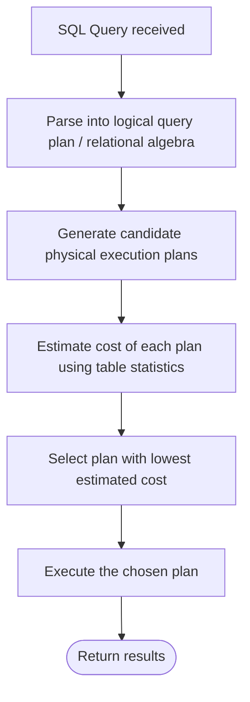
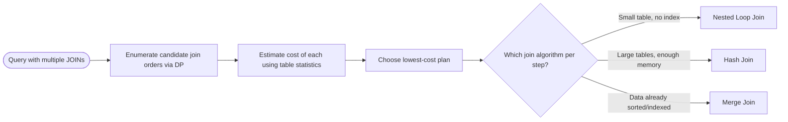

# Query Optimization

> Part of [Phase 06 — Database Management Systems](./README.md)

---

## What is it?

Query Optimization is the process by which a database automatically transforms a DECLARATIVE SQL query (which describes WHAT data is wanted) into an efficient EXECUTION PLAN (which specifies HOW to actually retrieve it — which indexes to use, which join order and algorithm to apply) — without the person writing the SQL needing to specify any of this manually.

## Why do we need it?

The exact same SQL query can be executed in wildly different ways — scan the whole table or use an index; join tables in this order or that order; use a nested loop, hash, or merge join — and these choices can mean the difference between a query taking milliseconds or hours. Since SQL is declarative (see [`SQL.md`](./SQL.md)), something has to automatically decide the best HOW — that's the query optimizer's entire job.

## Real-world analogy

Think of query optimization like a GPS navigation app. You declare your destination ("get me from A to B"), and the app automatically considers multiple possible routes, estimates the TIME COST of each (using real-time traffic data), and picks the best one — without you needing to manually plan turn-by-turn directions yourself. A query optimizer does exactly this for data retrieval "routes."

```text
Query: "Find all orders from customers in California, joined with product details"

Possible "routes" (execution plans) the optimizer considers:
  Route A: scan ALL orders, THEN filter California, THEN join products
  Route B: use an index to find California customers FIRST, THEN join orders, THEN products
  Route C: join products and orders FIRST, THEN filter California

The optimizer estimates the COST of each and picks the cheapest.
```

## Historical background

- Query optimization was pioneered by IBM's **System R** project in the late 1970s; the foundational paper, **Selinger et al. (1979), _"Access Path Selection in a Relational Database Management System,"_** introduced cost-based optimization techniques that remain the conceptual basis for query optimizers in virtually every relational database today.
- This System R work introduced the idea of using STATISTICS about the data (table sizes, value distributions) to ESTIMATE the cost of different execution strategies, rather than relying on fixed, hardcoded rules.
- Through the 1980s-2000s, query optimization grew into one of the most sophisticated and heavily-researched areas of database systems, as query complexity (many joins, subqueries) made the space of possible execution plans grow explosively.

## Mathematical foundation

**Level 1 — Explain it to a 15-year-old:**

If I ask you to find a specific person's name in a phone book, you wouldn't read every single page from the start — you'd flip to roughly the right letter first. A query optimizer does this kind of "smart planning" automatically, for potentially very complex questions involving many different tables, choosing the fastest reasonable strategy without you telling it how.

**Level 2 — Engineering Level:**

**Cost-based optimization** works by: enumerating multiple CANDIDATE execution plans (different join orders, join algorithms, index usage decisions), ESTIMATING the cost of each (typically based on estimated number of disk I/Os, using table statistics like row counts and value distributions), and selecting the plan with the LOWEST estimated cost. Because the number of possible join orders grows FACTORIALLY with the number of tables, optimizers use techniques like **dynamic programming** to avoid exhaustively considering every possibility.

**Level 3 — Industry Level:**

Production databases (PostgreSQL, MySQL, Oracle) expose their chosen execution plan via the `EXPLAIN` (and `EXPLAIN ANALYZE`) command, letting engineers directly INSPECT and diagnose why a query is slow — commonly revealing issues like a missing index causing an unexpected full table scan, or an inefficient join order the optimizer chose due to stale or missing statistics.

**Level 4 — Research Level:**

Research into **learned query optimizers** explores using machine learning models — trained on a database's actual historical query performance — to make BETTER cost estimates and plan choices than traditional, hand-tuned cost models, particularly for complex queries where classical statistical assumptions (like independence between column values) break down. This connects to the same "learned systems" research direction as learned indexes (see [`Indexing.md`](./Indexing.md)).

## Formal definition

Given a SQL query, its equivalent relational algebra expression can be represented by MULTIPLE different, logically-equivalent execution plans (differing in join order, join algorithm, and access paths). A **cost model** `C(plan)` estimates each plan's execution cost (typically in terms of estimated disk I/O and CPU operations), and the optimizer's job is to find `argmin C(plan)` over the space of valid plans, typically using dynamic programming over subsets of tables to avoid exhaustive enumeration.

## Core concepts

- **Logical Query Plan** — the relational algebra representation of what a query computes, independent of execution strategy
- **Physical Query Plan (Execution Plan)** — a specific, concrete strategy for computing the query (index scan vs. table scan, nested loop vs. hash join)
- **Cost-Based Optimization** — choosing a plan by estimating and comparing costs using table statistics
- **Join Order** — the sequence in which multiple tables are joined together, which can dramatically affect performance
- **Join Algorithms** — Nested Loop Join, Hash Join, Merge Join — each with different performance characteristics depending on data size and available indexes/sorting
- **`EXPLAIN` / `EXPLAIN ANALYZE`** — database commands revealing the actual chosen execution plan (and, for `ANALYZE`, real measured execution statistics)

## Internal working

A cost-based optimizer internally works by using table STATISTICS (row counts, distinct value counts, data distribution histograms) maintained by the database (updated periodically, e.g., via PostgreSQL's `ANALYZE` command) to ESTIMATE how many rows each step of a candidate plan will produce, and from that, estimates the total I/O and CPU cost — critically, if these statistics become STALE (out of date relative to the actual data), the optimizer's cost estimates — and therefore its plan choices — can become badly wrong.

## Step-by-step explanation

**How a cost-based optimizer chooses a join order using dynamic programming, step by step:**

1. For each individual table involved in the query, estimate the cost of accessing it alone (full scan vs. available index).
2. For each PAIR of tables, compute the cost of joining them (trying each applicable join algorithm), building on the single-table cost estimates.
3. For each set of THREE tables, compute the cost of joining them by considering all ways to combine a smaller, already-optimized SUBSET with one additional table — reusing the already-computed OPTIMAL costs for smaller subsets (this reuse of overlapping subproblems is exactly the Dynamic Programming principle from Phase 2).
4. Continue this process up to the FULL set of all tables in the query.
5. The final result is the single lowest-cost complete execution plan, built up from optimally-solved smaller subproblems — avoiding the need to explore every one of the (factorially many) possible join orders from scratch.

## Visual diagram



## Architecture diagram

```text
Join algorithm comparison for joining table R (large, unsorted) and S (small):

NESTED LOOP JOIN:
  FOR each row in R:
      FOR each row in S:
          IF join condition matches: output combined row
  Cost: O(|R| * |S|) - fine if S is SMALL (e.g., fits in memory), bad otherwise

HASH JOIN:
  Build a hash table from the SMALLER table (S) on the join key
  FOR each row in R: probe the hash table for matches
  Cost: O(|R| + |S|) - much better for large tables, requires enough memory
  for the hash table

MERGE JOIN:
  IF both R and S are already SORTED on the join key (or can be cheaply sorted):
      merge them in a single synchronized pass, like merging two sorted lists
  Cost: O(|R| + |S|) after sorting - excellent IF data is already sorted
  (e.g., via an index)
```

## Flowchart



## Example

Compare two possible plans for the query `SELECT * FROM Orders o JOIN Customers c ON o.cust_id = c.id WHERE c.country = 'USA'`:

```
PLAN A (filter AFTER join):
  1. Join ALL Orders with ALL Customers (expensive: full cross-matching)
  2. THEN filter for country = 'USA'
  Estimated cost: HIGH (joins far more rows than necessary)

PLAN B (filter BEFORE join, "pushing down" the predicate):
  1. First filter Customers WHERE country = 'USA' (using an index on country,
     if available - dramatically reduces row count)
  2. THEN join only THESE filtered customers with Orders
  Estimated cost: MUCH LOWER (joins far fewer rows)

A good optimizer automatically chooses (or transforms the query into) PLAN B -
this specific transformation is called "predicate pushdown," one of the
most common and impactful optimizations applied automatically.
```

## Dry run

Trace `EXPLAIN` output interpretation for a simple query (illustrative, PostgreSQL-style):

```sql
EXPLAIN SELECT * FROM orders WHERE customer_id = 42;
```

| Plan Line (illustrative)                  | Meaning                                                                        |
| ----------------------------------------- | ------------------------------------------------------------------------------ |
| `Index Scan using orders_customer_id_idx` | The optimizer chose to use an existing index — GOOD sign                       |
| `cost=0.29..8.31 rows=1 width=64`         | Estimated cost range and row count — low cost here indicates an efficient plan |

Compare to a MISSING index scenario:

| Plan Line (illustrative)              | Meaning                                                                        |
| ------------------------------------- | ------------------------------------------------------------------------------ |
| `Seq Scan on orders`                  | The optimizer had to fall back to a FULL TABLE SCAN — likely a missing index   |
| `cost=0.00..18334.00 rows=1 width=64` | Much higher cost — a clear signal to consider adding an index on `customer_id` |

## Multiple examples

**Example 1 — Predicate pushdown:** filtering rows as EARLY as possible (before an expensive join), rather than joining everything first and filtering afterward — as shown in the worked Example above.

**Example 2 — Join order matters:** joining a small, heavily-filtered table FIRST (producing few intermediate rows) before joining a large table is typically far cheaper than the reverse order.

**Example 3 — Index vs. full scan trade-off:** for a query matching a LARGE fraction of a table's rows (e.g., `WHERE active = true` when 90% of rows are active), a full table scan can actually be CHEAPER than using an index — the optimizer's cost estimates should correctly detect this "low selectivity" case and avoid the index.

## Advantages

- Frees SQL authors from needing to manually specify low-level execution details — write WHAT you want, let the optimizer figure out HOW.
- Cost-based optimization adapts automatically to changing data (via updated statistics), unlike a fixed, hand-written execution strategy.
- Dynamic programming for join ordering avoids the factorial blowup of naively considering every possible join order.

## Disadvantages

- Cost estimates rely on STATISTICS that can become stale, leading to genuinely poor plan choices if not kept up to date.
- For queries with MANY tables, even dynamic programming can become too slow, forcing optimizers to fall back to heuristics (potentially suboptimal plans) beyond some join count.
- Complex queries (correlated subqueries, certain aggregate patterns) can sometimes "confuse" the optimizer into choosing surprisingly inefficient plans, requiring manual query rewriting.

## Complexity

| Task                                               | Complexity                                                                                            |
| -------------------------------------------------- | ----------------------------------------------------------------------------------------------------- |
| Exhaustive enumeration of join orders for n tables | O(n!) — factorial, infeasible for many tables                                                         |
| Dynamic programming join order optimization        | O(3^n) or O(n \* 2^n) depending on the DP formulation — still expensive but far better than factorial |
| Nested Loop Join                                   | O(\|R\| × \|S\|)                                                                                      |
| Hash Join                                          | O(\|R\| + \|S\|) average                                                                              |
| Merge Join (pre-sorted inputs)                     | O(\|R\| + \|S\|)                                                                                      |

## Memory usage

Hash joins require enough memory to build a hash table from the smaller relation — if this doesn't fit in available memory, the database must fall back to a slower "disk-based" hash join (partitioning data to disk), a real, measurable performance cliff that cost estimation tries to account for.

## Time complexity

The critical practical lesson: **the SAME query's actual execution time can vary by orders of magnitude depending purely on the chosen execution plan** — this is exactly why understanding and reading `EXPLAIN` output is one of the highest-leverage skills for diagnosing and fixing real-world database performance problems.

## Best practices

- Regularly update table statistics (`ANALYZE` in PostgreSQL) so the optimizer's cost estimates remain accurate as data changes.
- Use `EXPLAIN ANALYZE` (which actually RUNS the query and compares estimated vs. actual row counts) to diagnose cases where the optimizer's estimates are significantly wrong.
- Add indexes to support your most common and expensive query patterns, giving the optimizer better options to choose from (see [`Indexing.md`](./Indexing.md)).
- Be cautious with very complex queries (many nested subqueries) that can sometimes prevent the optimizer from finding the best plan — consider rewriting as explicit joins or CTEs.

## Common mistakes

- Assuming the optimizer will ALWAYS find the best possible plan — it makes estimates based on statistics, and can be wrong, especially with stale statistics or unusual data distributions.
- Writing queries that inadvertently PREVENT the optimizer from pushing down filters or using indexes (e.g., applying a function to a column in a `WHERE` clause).
- Not distinguishing between the ESTIMATED plan (`EXPLAIN`) and the ACTUAL measured performance (`EXPLAIN ANALYZE`) when diagnosing a slow query.
- Over-indexing in an attempt to "help" the optimizer, without considering the resulting write performance cost (see [`Indexing.md`](./Indexing.md)).

## Interview questions

1. What is the difference between a logical and a physical query plan?
2. Explain the difference between Nested Loop, Hash, and Merge joins, and when each is preferable.
3. What is predicate pushdown, and why is it beneficial?
4. Why might a query optimizer choose a full table scan over an available index?
5. How does dynamic programming help avoid the factorial cost of join order enumeration?

## University questions

1. Compare the cost formulas for Nested Loop Join, Hash Join, and Merge Join.
2. Explain how a cost-based optimizer uses table statistics to estimate query cost.
3. Given a multi-table query, explain how dynamic programming is used to find an efficient join order.
4. Explain the concept of predicate pushdown with a concrete SQL example.

## Coding examples

### Pseudocode

```text
FUNCTION optimizeJoinOrder(tables, costEstimates):
    // Dynamic programming over subsets of tables (Phase 2 DP principle applied here)
    bestPlan = {}
    FOR each single table t IN tables:
        bestPlan[{t}] = (cost: accessCost(t), plan: t)

    FOR subsetSize FROM 2 TO length(tables):
        FOR each subset S of size subsetSize:
            FOR each way to split S into S1 and S2:
                candidateCost = bestPlan[S1].cost + bestPlan[S2].cost + joinCost(S1, S2)
                IF candidateCost < bestPlan[S].cost:
                    bestPlan[S] = (cost: candidateCost, plan: join(S1, S2))

    RETURN bestPlan[allTables]
```

### Python implementation

```python
from itertools import combinations

def estimate_join_cost(size1, size2, algorithm="hash"):
    if algorithm == "hash":
        return size1 + size2
    return size1 * size2  # nested loop, worst case

def optimize_join_order(table_sizes):
    # table_sizes: dict of {table_name: row_count}
    tables = list(table_sizes.keys())
    best = {frozenset([t]): (table_sizes[t], t) for t in tables}

    for subset_size in range(2, len(tables) + 1):
        for subset in combinations(tables, subset_size):
            subset_set = frozenset(subset)
            best_cost = float('inf')
            best_plan = None
            for i in range(1, len(subset)):
                for left in combinations(subset, i):
                    left_set = frozenset(left)
                    right_set = subset_set - left_set
                    if left_set in best and right_set in best:
                        left_cost, left_plan = best[left_set]
                        right_cost, right_plan = best[right_set]
                        join_cost = estimate_join_cost(left_cost, right_cost)
                        total = left_cost + right_cost + join_cost
                        if total < best_cost:
                            best_cost = total
                            best_plan = (left_plan, right_plan)
            best[subset_set] = (best_cost, best_plan)

    full_set = frozenset(tables)
    return best[full_set]

sizes = {"Orders": 1_000_000, "Customers": 10_000, "Products": 5_000}
cost, plan = optimize_join_order(sizes)
print(f"Best estimated cost: {cost}")
print(f"Join plan: {plan}")
```

### C implementation

```c
#include <stdio.h>

// Simplified cost comparison for choosing a join algorithm
long nestedLoopCost(long sizeR, long sizeS) { return sizeR * sizeS; }
long hashJoinCost(long sizeR, long sizeS) { return sizeR + sizeS; }

int main() {
    long ordersSize = 1000000, customersSize = 10000;

    long nlCost = nestedLoopCost(ordersSize, customersSize);
    long hjCost = hashJoinCost(ordersSize, customersSize);

    printf("Nested Loop cost estimate: %ld\n", nlCost);
    printf("Hash Join cost estimate: %ld\n", hjCost);
    printf("Optimizer would choose: %s\n", (hjCost < nlCost) ? "Hash Join" : "Nested Loop");
    return 0;
}
```

### C++ implementation

```cpp
#include <iostream>
#include <algorithm>
using namespace std;

long long nestedLoopCost(long long sizeR, long long sizeS) { return sizeR * sizeS; }
long long hashJoinCost(long long sizeR, long long sizeS) { return sizeR + sizeS; }
long long mergeJoinCost(long long sizeR, long long sizeS, bool preSorted) {
    if (preSorted) return sizeR + sizeS;
    return sizeR * log2(sizeR) + sizeS * log2(sizeS) + sizeR + sizeS;  // sort + merge
}

int main() {
    long long ordersSize = 1000000, customersSize = 10000;

    long long costs[] = {
        nestedLoopCost(ordersSize, customersSize),
        hashJoinCost(ordersSize, customersSize),
        mergeJoinCost(ordersSize, customersSize, false)
    };
    string names[] = {"Nested Loop", "Hash Join", "Merge Join (unsorted)"};

    int best = min_element(costs, costs + 3) - costs;
    cout << "Optimizer chooses: " << names[best] << " with cost " << costs[best] << endl;
}
```

### Java implementation

```java
public class QueryOptimizationDemo {
    static long nestedLoopCost(long sizeR, long sizeS) { return sizeR * sizeS; }
    static long hashJoinCost(long sizeR, long sizeS) { return sizeR + sizeS; }

    public static void main(String[] args) {
        long ordersSize = 1_000_000, customersSize = 10_000;

        long nlCost = nestedLoopCost(ordersSize, customersSize);
        long hjCost = hashJoinCost(ordersSize, customersSize);

        System.out.println("Nested Loop cost estimate: " + nlCost);
        System.out.println("Hash Join cost estimate: " + hjCost);
        System.out.println("Optimizer would choose: " + (hjCost < nlCost ? "Hash Join" : "Nested Loop"));
    }
}
```

## Visualization

```text
Cost comparison, joining Orders (1,000,000 rows) with Customers (10,000 rows):

Nested Loop Join:  ~10,000,000,000 operations (1M * 10K)  <- catastrophically slow
Hash Join:                1,010,000 operations (1M + 10K)  <- practical, fast

This roughly 10,000x difference, for exactly the SAME logical query,
is entirely due to the query optimizer's algorithm/plan CHOICE -
illustrating exactly why query optimization matters so much.
```

## Industry use

- **Every production relational database** (PostgreSQL, MySQL, Oracle, SQL Server) implements sophisticated cost-based query optimizers, refined over decades of real-world use.
- **Database administrators and backend engineers** routinely use `EXPLAIN`/`EXPLAIN ANALYZE` as a primary diagnostic tool for fixing slow queries in production.
- **Data warehouse and analytics engines** (Snowflake, BigQuery, Redshift) apply similarly sophisticated (often even more advanced, given massive data scale) query optimization techniques.

## Research relevance

Research into **learned query optimizers** explores training machine learning models on a database's actual historical execution data to make better cost estimates and plan choices than traditional statistical cost models — particularly valuable for complex, correlated queries where classical assumptions (like column independence) break down, an active area bridging database systems and machine learning research.

## Related concepts

- SQL (the declarative language whose queries get optimized — see [`SQL.md`](./SQL.md))
- Indexing (provides the access paths the optimizer chooses between — see [`Indexing.md`](./Indexing.md))
- Dynamic Programming, Phase 2 (directly used for efficient join order optimization)
- Sorting algorithms, Phase 2 (Merge Join directly builds on merge sort's core idea)

## Practice problems

1. Given table sizes for a 3-table join, manually work through the dynamic programming approach to find the optimal join order.
2. Explain why a query's `WHERE` clause using a function on an indexed column (e.g., `WHERE UPPER(name) = 'ALICE'`) might prevent index usage, and how to rewrite it to allow index usage.
3. Given `EXPLAIN` output showing a sequential scan where you expected an index scan, list possible reasons and how to investigate them.
4. Compare the expected performance of a Hash Join versus a Merge Join when both input tables are already sorted on the join key.

## Advanced concepts

- **Materialized Views** — precomputing and storing the result of an expensive query, trading storage and update complexity for dramatically faster reads of that specific query pattern.
- **Adaptive Query Execution** — modern database features that can adjust a query's execution plan MID-EXECUTION based on actual observed data characteristics, rather than committing entirely to an upfront estimate.
- **Query Rewriting** — transforming a query into a logically equivalent but more efficiently optimizable form BEFORE cost-based optimization even begins (e.g., automatically converting certain correlated subqueries into joins).

## Summary

Query optimization is what makes SQL's declarative promise practically achievable — automatically transforming a WHAT-focused query into an efficient HOW-focused execution plan, using cost estimation (based on table statistics) and dynamic programming to navigate an enormous space of possible join orders and algorithms. Understanding this process — and tools like `EXPLAIN` that expose it — is essential for diagnosing and fixing real-world database performance problems.

## Key takeaways

- Query optimization is the automatic translation from declarative SQL into an efficient execution plan.
- Cost-based optimization estimates plan costs using table statistics — stale statistics can lead to poor plan choices.
- Nested Loop, Hash, and Merge joins have different performance characteristics depending on data size, sorting, and available memory.
- Dynamic programming avoids the factorial cost of exhaustively enumerating all possible join orders.
- `EXPLAIN`/`EXPLAIN ANALYZE` are essential tools for diagnosing why a specific query is slow in practice.

## References

- Selinger, P. et al. (1979). _Access Path Selection in a Relational Database Management System_.
- Silberschatz, A., Korth, H., Sudarshan, S. _Database System Concepts_, Chapter 16.
- Winand, M. _SQL Performance Explained_.
- PostgreSQL Official Documentation, "Query Planning" chapter.

---

⬅ Back to [Phase 06 — Database Management Systems README](./README.md)
