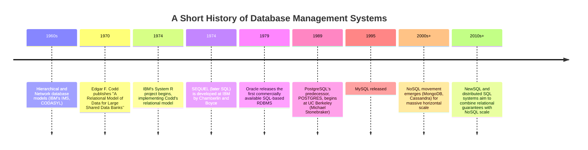
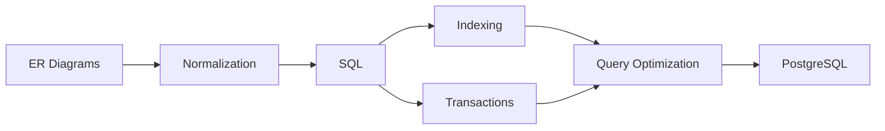

# Phase 06 — Database Management Systems

> "A database's whole job is to remember things perfectly, forever, even if the power goes out mid-sentence — and to let a thousand people ask it questions at once without ever giving two of them contradictory answers." — a professor's honest confession, day one of DBMS.

This is **Phase 6** of the `msc-computer-science` repository. Where Phase 5 (Operating Systems) taught how a single machine safely shares its resources, Phase 6 teaches how we **model, store, query, and guarantee the correctness of data** — reliably, efficiently, and at scale, even under concurrent access and unexpected failures.

---

## Table of Contents

- [Introduction](#introduction)
- [Why This Subject Exists](#why-this-subject-exists)
- [Historical Background](#historical-background)
- [Importance](#importance)
- [Applications](#applications)
- [Industries Using It](#industries-using-it)
- [Career Relevance](#career-relevance)
- [Prerequisites](#prerequisites)
- [Roadmap](#roadmap)
- [Complete Syllabus](#complete-syllabus)
- [Learning Objectives](#learning-objectives)
- [How This Connects to Previous Phases](#how-this-connects-to-previous-phases)
- [How This Connects to Later Phases](#how-this-connects-to-later-phases)
- [Recommended Study Order](#recommended-study-order)
- [Estimated Study Time](#estimated-study-time)
- [Books](#books)
- [Research Papers](#research-papers)
- [Reference Websites](#reference-websites)
- [Practice Resources](#practice-resources)
- [Projects](#projects)
- [Interview Importance](#interview-importance)
- [University Exam Importance](#university-exam-importance)
- [Common Mistakes](#common-mistakes)
- [Cheat Sheet](#cheat-sheet)
- [Summary](#summary)
- [Next Steps](#next-steps)

---

## Introduction

Every app you've ever used — a bank, a social network, an online store — is, underneath its interface, mostly a very elaborate way of asking a database to remember things and answer questions about them correctly. A Database Management System (DBMS) is software specifically engineered to store enormous amounts of structured data, answer complex questions about it in milliseconds, guarantee that data survives crashes and power failures, and let thousands of people read and write simultaneously without ever corrupting anything or seeing contradictory results.

This phase covers eight files:

| File                    | Topic                        | One-line description                                                     |
| ----------------------- | ---------------------------- | ------------------------------------------------------------------------ |
| `README.md`             | Phase overview               | This file                                                                |
| `ER-Diagrams.md`        | Entity-Relationship Modeling | Designing a database's structure from real-world requirements            |
| `Normalization.md`      | Normalization                | Eliminating redundancy and anomalies from a database design              |
| `SQL.md`                | SQL                          | The standard language for querying and manipulating relational data      |
| `Indexing.md`           | Indexing                     | Making queries fast using auxiliary data structures                      |
| `Transactions.md`       | Transactions                 | Guaranteeing correctness under concurrency and failure (ACID)            |
| `Query-Optimization.md` | Query Optimization           | How a DBMS automatically finds an efficient way to execute a query       |
| `PostgreSQL.md`         | PostgreSQL                   | A real-world case study tying every concept to an actual production DBMS |

---

## Why This Subject Exists

Data outlives programs. A program can crash and restart, but the DATA it manages — bank balances, medical records, purchase histories — must never simply vanish or become corrupted. DBMSs exist to solve a genuinely hard combination of problems simultaneously: correctness (data is never lost or corrupted, even under crashes or concurrent access), performance (answering queries over billions of rows in milliseconds), and usability (letting people describe WHAT they want, in a language like SQL, without manually writing low-level retrieval code).

---

## Historical Background

Notice the pattern: Edgar Codd's 1970 paper — pure mathematics, based on set theory and predicate logic — is STILL the direct theoretical foundation of every SQL database running today, over 50 years later.

---

## Importance

Database systems matter because they determine:

1. **Data integrity** — whether your bank balance, medical record, or order history can be trusted to be accurate.
2. **Performance at scale** — the difference between a query taking 2 milliseconds or 2 minutes as data grows to billions of rows.
3. **Concurrent correctness** — ensuring thousands of simultaneous users never see corrupted, inconsistent, or lost data.
4. **Durability** — guaranteeing that once data is confirmed saved, it survives crashes, power loss, and hardware failures.

---

## Applications

| DBMS Concept       | Real Application                                                                           |
| ------------------ | ------------------------------------------------------------------------------------------ |
| ER Modeling        | Designing the schema for any new application — e-commerce, banking, social networks        |
| Normalization      | Preventing data anomalies (update, insert, delete) in a growing database                   |
| SQL                | The universal language for querying virtually every relational database in production      |
| Indexing           | Making search, filtering, and sorting fast on huge tables                                  |
| Transactions       | Bank transfers, e-commerce checkouts, any operation requiring "all-or-nothing" correctness |
| Query Optimization | Making a written-in-seconds SQL query actually execute efficiently over huge data          |

---

## Industries Using It

- **Finance/Banking** — transaction correctness (ACID) is existentially important; a single lost or duplicated transaction is unacceptable.
- **E-commerce** — inventory management, order processing, and payment systems all depend on transactional correctness at scale.
- **Healthcare** — patient records require both strict integrity and strict access control.
- **Social media/Tech** — massive-scale read/write workloads drive both relational and NoSQL database innovation.
- **Every software company, essentially** — nearly all software with persistent state uses a database somewhere.

---

## Career Relevance

| Role                         | DBMS Relevance                                                      |
| ---------------------------- | ------------------------------------------------------------------- |
| Backend/Full-Stack Engineer  | SQL and schema design are daily, foundational skills                |
| Data Engineer                | Deep expertise in indexing, query optimization, and data modeling   |
| Database Administrator (DBA) | Direct expertise in a specific DBMS (PostgreSQL, MySQL, Oracle)     |
| Data Scientist/Analyst       | SQL is often the primary tool for data extraction and analysis      |
| Interview Candidate          | SQL queries and schema design are extremely common interview topics |

---

## Prerequisites

- Phase 2 (Data Structures and Algorithms) — B-Trees (indexing), hashing, and complexity analysis are used throughout.
- Phase 5 (Operating Systems) — transactions and concurrency control directly reuse synchronization and deadlock theory.
- Basic set theory and logic are helpful for understanding the relational model formally, though not strictly required.

---

## Roadmap

---

## Complete Syllabus

1. **ER Diagrams** — entities, attributes, relationships, cardinality, converting ER models to relational schemas
2. **Normalization** — functional dependencies, 1NF through BCNF, anomalies, decomposition
3. **SQL** — DDL, DML, DQL, joins, subqueries, aggregation, views
4. **Indexing** — B-Tree and hash indexes, clustered vs. non-clustered, composite indexes
5. **Transactions** — ACID properties, concurrency control, isolation levels, schedules and serializability
6. **Query Optimization** — query execution plans, cost estimation, join algorithms
7. **PostgreSQL** — a real-world production DBMS tying every concept together

---

## Learning Objectives

By the end of this phase, you will be able to:

- Design a database schema from real-world requirements using ER diagrams.
- Normalize a schema to eliminate redundancy and anomalies, up to BCNF.
- Write correct, efficient SQL queries involving joins, subqueries, and aggregation.
- Explain how indexes speed up queries, and design appropriate indexes for a given workload.
- Explain the ACID properties and how isolation levels trade off correctness and performance.
- Determine whether a transaction schedule is serializable.
- Read and reason about a query execution plan.
- Relate every concept in this phase to a real, production-grade database system (PostgreSQL).

---

## How This Connects to Previous Phases

- **Phase 2 (DSA)**: B-Trees directly implement indexes; hashing implements hash indexes and hash joins; graphs model foreign-key relationships and query execution plans.
- **Phase 5 (Operating Systems)**: transactions and concurrency control are OS synchronization theory (locks, deadlocks) applied specifically to data consistency; the WAL (Write-Ahead Log) in transactions directly parallels file system journaling.
- **Phase 3 (Theory of Computation)**: relational algebra and SQL query optimization draw on formal logic and set theory foundations.

## How This Connects to Later Phases

- **Distributed Systems** — distributed databases extend this phase's transaction and consistency theory across multiple machines (the CAP theorem, distributed consensus).
- **Data Engineering / Big Data** — data warehousing, ETL pipelines, and large-scale analytics all build directly on relational modeling and query optimization concepts.
- **Machine Learning / Data Science** — nearly all ML pipelines begin with SQL-based data extraction and cleaning.

---

## Recommended Study Order

1. ER Diagrams (model the real world first)
2. Normalization (refine that model to be redundancy-free)
3. SQL (learn to actually query and manipulate the resulting schema)
4. Indexing (make those queries fast)
5. Transactions (guarantee correctness under concurrency and failure)
6. Query Optimization (understand how the DBMS achieves speed automatically)
7. PostgreSQL (capstone — see it all in a real system)

---

## Estimated Study Time

| Topic              | Beginner Pace     | Fast Pace      |
| ------------------ | ----------------- | -------------- |
| ER Diagrams        | 4 days            | 1 day          |
| Normalization      | 1 week            | 2 days         |
| SQL                | 2 weeks           | 4 days         |
| Indexing           | 1 week            | 2 days         |
| Transactions       | 1.5 weeks         | 3 days         |
| Query Optimization | 1 week            | 2 days         |
| PostgreSQL         | ongoing, hands-on | ongoing        |
| **Total**          | **~8 weeks**      | **~2.5 weeks** |

---

## Books

- _Database System Concepts_ — Silberschatz, Korth, Sudarshan
- _Designing Data-Intensive Applications_ — Martin Kleppmann
- _SQL Performance Explained_ — Markus Winand
- _Fundamentals of Database Systems_ — Elmasri, Navathe

## Research Papers

- Codd, E.F. (1970). _A Relational Model of Data for Large Shared Data Banks_.
- Gray, J. (1981). _The Transaction Concept: Virtues and Limitations_.
- Bayer, R., McCreight, E. (1972). _Organization and Maintenance of Large Ordered Indices_ (the B-Tree).
- Selinger, P. et al. (1979). _Access Path Selection in a Relational Database Management System_ (foundational query optimization paper, from IBM's System R).

## Reference Websites

- [PostgreSQL official documentation](https://www.postgresql.org/docs/)
- [Use The Index, Luke! (indexing deep dive)](https://use-the-index-luke.com)
- [GeeksforGeeks — DBMS section](https://www.geeksforgeeks.org)
- [SQLZoo / LeetCode Database section (practice)](https://sqlzoo.net)

## Practice Resources

- GATE previous year papers (DBMS section — normalization and SQL are heavily tested)
- LeetCode / HackerRank SQL problem sets
- Building and querying a small PostgreSQL database locally

## Projects

1. Design an ER diagram and normalized schema for a library management system, then implement it in SQL.
2. Write a set of SQL queries (joins, subqueries, aggregation) against a sample e-commerce dataset.
3. Benchmark query performance with and without an index on a large table, and explain the difference.
4. Simulate a bank transfer transaction, demonstrating atomicity and isolation.
5. Analyze a query's `EXPLAIN` output in PostgreSQL and optimize it.

## Interview Importance

(Very High)

SQL query writing and schema design are among the most common interview topics for nearly any software engineering role, not just backend-specific ones.

## University Exam Importance

(Very High)

DBMS is a core, heavily-weighted subject in every BSc/MSc Computer Science curriculum, and normalization/SQL/transaction questions are consistently tested in GATE and UGC NET.

## Common Mistakes

- Treating normalization as a purely academic exercise — real schema design constantly balances normalization against query performance.
- Writing SQL queries without considering whether appropriate indexes exist, leading to accidentally slow full-table scans.
- Assuming "transaction" and "ACID" are automatic — application code must correctly use transaction boundaries (`BEGIN`/`COMMIT`/`ROLLBACK`) for these guarantees to actually apply.
- Confusing isolation levels — "Serializable" and "Read Committed" provide very different guarantees, with very different performance costs.

## Cheat Sheet

| Concept         | One-Line Meaning                                                                                    |
| --------------- | --------------------------------------------------------------------------------------------------- |
| Entity          | A real-world object or concept represented in the database                                          |
| Primary Key     | A column (or set of columns) uniquely identifying each row                                          |
| Foreign Key     | A column referencing another table's primary key, enforcing referential integrity                   |
| Normalization   | Organizing a schema to eliminate redundancy and anomalies                                           |
| Index           | An auxiliary structure (usually a B-Tree) speeding up lookups on a column                           |
| ACID            | Atomicity, Consistency, Isolation, Durability — the transaction correctness guarantees              |
| Isolation Level | How strictly the DBMS prevents transactions from seeing each other's uncommitted/concurrent effects |
| Query Plan      | The DBMS's chosen strategy (join order, index use) for executing a query                            |

## Summary

Database Management Systems teach how to model real-world data correctly, store it redundancy-free, query it expressively via SQL, retrieve it efficiently via indexing, guarantee its correctness under concurrency and failure via transactions, and understand how the system automatically optimizes queries for performance — culminating in a real, production-grade system (PostgreSQL) where every concept becomes concrete.

## Next Steps

Proceed in this order:

1. [`ER-Diagrams.md`](./ER-Diagrams.md)
2. [`Normalization.md`](./Normalization.md)
3. [`SQL.md`](./SQL.md)
4. [`Indexing.md`](./Indexing.md)
5. [`Transactions.md`](./Transactions.md)
6. [`Query-Optimization.md`](./Query-Optimization.md)
7. [`PostgreSQL.md`](./PostgreSQL.md)

After finishing this phase, proceed to **Phase 7 — (next phase in your roadmap, e.g., Computer Networks, Distributed Systems, or Software Engineering)**.
