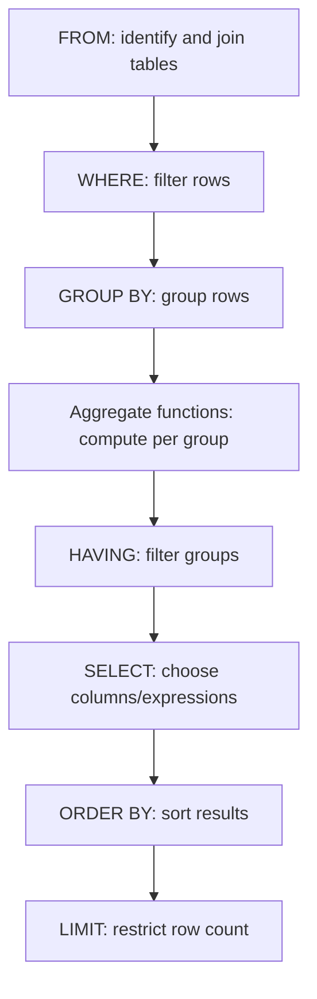
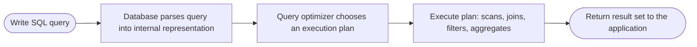

# SQL (Structured Query Language)

> Part of [Phase 06 — Database Management Systems](./README.md)

---

## What is it?

SQL (Structured Query Language) is the standard, declarative language for defining, querying, and manipulating data in a relational database — you describe WHAT data you want, not the step-by-step procedure for retrieving it, and the database's query optimizer (see [`Query-Optimization.md`](./Query-Optimization.md)) figures out HOW to get it efficiently.

## Why do we need it?

Without a standard query language, every application would need custom, low-level code to navigate a database's physical storage structures directly — extremely tedious and error-prone. SQL provides a powerful, standardized, DECLARATIVE way to express complex data retrieval and manipulation ("give me all customers who spent over $1000 last month, sorted by total spend") without the programmer needing to write the retrieval algorithm themselves.

## Real-world analogy

Think of SQL like ordering food at a restaurant by describing what you WANT ("a medium-rare steak with a side of vegetables"), rather than walking into the kitchen and personally directing the chef's every knife movement. You declare the desired OUTCOME; the kitchen (the database engine) figures out the best way to actually produce it.

```sql
-- Declarative: describe WHAT you want
SELECT name, total_spent FROM customers WHERE total_spent > 1000 ORDER BY total_spent DESC;
-- You never specify HOW to search, sort, or filter — the database decides that.
```

## Historical background

- SQL originated as **SEQUEL** (Structured English Query Language), developed by **Donald Chamberlin and Raymond Boyce** at IBM in **1974**, as part of the System R project implementing Codd's relational model.
- The name was later shortened to SQL due to a trademark conflict with an unrelated company already using "SEQUEL."
- SQL became an **ANSI standard in 1986** and an **ISO standard in 1987**, and has been revised many times since (SQL-92, SQL:1999 introducing recursive queries, SQL:2003 adding XML support, and so on).
- Despite the rise of NoSQL databases in the 2000s-2010s, SQL has remained (and in many ways strengthened its position as) the dominant language for structured data — even many NoSQL and "NewSQL" systems have since added SQL-compatible query interfaces.

## Mathematical foundation

**Level 1 — Explain it to a 15-year-old:**

Imagine you have a giant spreadsheet of every student in a school, and you want to ask: "show me all students in Grade 10 with a grade above 90, sorted by name." SQL is the standardized way to ask EXACTLY this kind of question to a database, using a small set of English-like keywords (`SELECT`, `WHERE`, `ORDER BY`) instead of writing custom code to loop through every row yourself.

**Level 2 — Engineering Level:**

SQL is formally grounded in **relational algebra**: `SELECT` corresponds to projection (choosing columns), `WHERE` corresponds to selection (filtering rows), `JOIN` corresponds to the relational join operation (combining rows from multiple tables based on a condition), and `GROUP BY`/aggregate functions correspond to grouping and aggregation operations. Every SQL query is, underneath, translated by the database into an equivalent relational algebra expression, which the query optimizer then further transforms into an efficient execution plan.

**Level 3 — Industry Level:**

Real-world SQL usage spans **DDL** (Data Definition Language: `CREATE`, `ALTER`, `DROP` — defining schema structure), **DML** (Data Manipulation Language: `INSERT`, `UPDATE`, `DELETE` — modifying data), and **DQL** (Data Query Language: `SELECT` — retrieving data). Production systems also rely heavily on **views** (saved, reusable queries presented as virtual tables), **stored procedures** (precompiled SQL logic executed on the database server), and carefully tuned **indexes** (see [`Indexing.md`](./Indexing.md)) to keep complex queries fast at scale.

**Level 4 — Research Level:**

Research into **query language design** continues to explore extensions to SQL (recursive Common Table Expressions for graph-like queries, window functions for advanced analytics, JSON/semi-structured data support) as the boundary between traditional relational data and more flexible, semi-structured data models continues to blur — as well as research into automatically translating natural language questions into correct, efficient SQL queries (a popular modern application of large language models).

## Formal definition

A SQL `SELECT` query is formally equivalent to a relational algebra expression: `π(columns)(σ(condition)(R1 ⋈ R2 ⋈ ... ⋈ Rn))`, where `π` is projection (SELECT), `σ` is selection (WHERE), and `⋈` is join — the database's query optimizer is responsible for choosing an efficient physical execution strategy for evaluating this logical expression.

## Core concepts

- **DDL (Data Definition Language)** — `CREATE`, `ALTER`, `DROP`: defines and modifies schema structure
- **DML (Data Manipulation Language)** — `INSERT`, `UPDATE`, `DELETE`: modifies data
- **DQL (Data Query Language)** — `SELECT`: retrieves data
- **JOIN** — combining rows from two or more tables based on a related column (INNER, LEFT, RIGHT, FULL)
- **Aggregate Functions** — `COUNT`, `SUM`, `AVG`, `MIN`, `MAX`, typically used with `GROUP BY`
- **Subquery** — a query nested inside another query
- **View** — a saved, named query presented as a virtual, reusable table

## Internal working

When the database receives a SQL query, it first PARSES the query into an internal representation, then the query OPTIMIZER (see [`Query-Optimization.md`](./Query-Optimization.md)) considers multiple possible EXECUTION PLANS (different join orders, whether to use an index or scan the full table) and estimates their relative COST, ultimately choosing and executing the plan it believes will be fastest.

## Step-by-step explanation

**How a SQL query with a JOIN and WHERE clause is logically processed, step by step:**

1. Identify the tables involved (the `FROM` clause) and combine them according to the specified `JOIN` conditions.
2. Apply the `WHERE` clause, filtering out rows that don't satisfy the condition.
3. If a `GROUP BY` clause is present, group the remaining rows by the specified column(s).
4. If aggregate functions are used, compute them per group.
5. If a `HAVING` clause is present, filter GROUPS (not individual rows) based on aggregate conditions.
6. Apply the `SELECT` clause, choosing which columns (or computed expressions) to output.
7. Apply `ORDER BY` to sort the final result set, and `LIMIT` to restrict the number of rows returned.

_(Note: this is the LOGICAL processing order — the actual PHYSICAL execution order chosen by the optimizer can differ significantly for performance, as covered in [`Query-Optimization.md`](./Query-Optimization.md).)_

## Visual diagram



## Architecture diagram

```text
JOIN types, visualized (Table A and Table B):

INNER JOIN:  only rows matching in BOTH tables
   A: [1,2,3]   B: [2,3,4]   -> Result: [2,3]

LEFT JOIN:   all rows from A, matched B data where available (NULL if not)
   A: [1,2,3]   B: [2,3,4]   -> Result: [1(NULL),2,3]

RIGHT JOIN:  all rows from B, matched A data where available (NULL if not)
   A: [1,2,3]   B: [2,3,4]   -> Result: [2,3,4(NULL)]

FULL OUTER JOIN: all rows from BOTH, NULL where no match on either side
   A: [1,2,3]   B: [2,3,4]   -> Result: [1(NULL),2,3,4(NULL)]
```

## Flowchart



## Example

A realistic multi-clause query: find each customer's total spending, only for customers who've spent over $500, sorted highest first.

```sql
SELECT
    c.customer_id,
    c.name,
    SUM(o.amount) AS total_spent
FROM customers c
JOIN orders o ON c.customer_id = o.customer_id
GROUP BY c.customer_id, c.name
HAVING SUM(o.amount) > 500
ORDER BY total_spent DESC;
```

```text
Logical processing:
1. JOIN customers and orders on customer_id
2. GROUP BY each customer
3. Compute SUM(amount) per group
4. HAVING filters OUT groups with total <= 500 (note: HAVING filters GROUPS, not rows -
   this is why we can't use WHERE for this condition, since WHERE runs BEFORE grouping)
5. SELECT the desired columns
6. ORDER BY total_spent, descending
```

## Dry run

Trace a simple query step by step against small sample data:

**Tables:**

```
Customers: (1, "Alice"), (2, "Bob")
Orders: (101, cust=1, amount=300), (102, cust=1, amount=250), (103, cust=2, amount=100)
```

**Query:** `SELECT c.name, SUM(o.amount) FROM Customers c JOIN Orders o ON c.id=o.cust GROUP BY c.name HAVING SUM(o.amount) > 200`

| Step | Operation     | Intermediate Result                 |
| ---- | ------------- | ----------------------------------- |
| 1    | JOIN          | (Alice,300), (Alice,250), (Bob,100) |
| 2    | GROUP BY name | {Alice: [300,250]}, {Bob: [100]}    |
| 3    | SUM per group | Alice: 550, Bob: 100                |
| 4    | HAVING > 200  | Alice: 550 (Bob excluded)           |
| 5    | Final SELECT  | `("Alice", 550)`                    |

## Multiple examples

**Example 1 — Subquery:** find customers who've never placed an order:

```sql
SELECT name FROM customers
WHERE customer_id NOT IN (SELECT customer_id FROM orders);
```

**Example 2 — Window function (a modern SQL feature):** rank customers by spending WITHOUT collapsing rows via GROUP BY:

```sql
SELECT name, amount, RANK() OVER (ORDER BY amount DESC) AS spend_rank
FROM orders;
```

**Example 3 — View:** save a commonly-used query as a reusable virtual table:

```sql
CREATE VIEW high_value_customers AS
SELECT customer_id, name FROM customers WHERE total_spent > 1000;
-- Now query it just like a regular table:
SELECT * FROM high_value_customers WHERE name LIKE 'A%';
```

## Advantages

- Declarative: express WHAT data you want without writing retrieval algorithms yourself.
- Extremely widely supported and standardized across virtually every relational database system.
- Powerful built-in support for joins, aggregation, and subqueries handles complex data relationships expressively.

## Disadvantages

- Poorly written queries (missing indexes, unnecessary subqueries, `SELECT *`) can be accidentally very slow, and the declarative nature can hide WHY without using tools like `EXPLAIN` (see [`Query-Optimization.md`](./Query-Optimization.md)).
- Complex queries involving many joins and subqueries can become difficult to read and maintain.
- SQL dialects differ subtly between database systems (PostgreSQL, MySQL, SQL Server), reducing perfect portability despite the ANSI standard.

## Complexity

| Operation                                              | Typical Complexity (with appropriate indexes) |
| ------------------------------------------------------ | --------------------------------------------- |
| Equality lookup on an indexed column                   | O(log n)                                      |
| Full table scan (no usable index)                      | O(n)                                          |
| JOIN of two tables (using an index on the join column) | O(n log m) or better                          |
| JOIN of two tables (nested loop, no index)             | O(n × m)                                      |
| Sorting (`ORDER BY`, no index support)                 | O(n log n)                                    |

## Memory usage

Large intermediate result sets (e.g., from a big join before filtering) can consume significant memory during query execution — this is a major reason the query optimizer tries to apply filtering (`WHERE`) and use indexes as EARLY as possible in the physical execution plan, even though `WHERE` is logically processed relatively early already.

## Time complexity

The single most important practical lesson: **the SAME logical query can execute in wildly different actual time depending on available indexes and the chosen execution plan** — this is precisely why understanding indexing ([`Indexing.md`](./Indexing.md)) and query optimization ([`Query-Optimization.md`](./Query-Optimization.md)) is essential alongside SQL syntax itself.

## Best practices

- Avoid `SELECT *` in production code — explicitly list only the columns you actually need, reducing data transfer and potentially enabling more efficient index-only scans.
- Use `EXPLAIN`/`EXPLAIN ANALYZE` to inspect a query's actual execution plan before assuming it's efficient.
- Prefer `JOIN`s over correlated subqueries where possible — they are often (though not always) easier for the optimizer to execute efficiently.
- Always use parameterized queries (not raw string concatenation) in application code to prevent SQL injection vulnerabilities.

## Common mistakes

- Using `WHERE` when you actually mean `HAVING` (or vice versa) — `WHERE` filters rows BEFORE grouping; `HAVING` filters GROUPS after aggregation.
- Forgetting `GROUP BY` must include every non-aggregated column in the `SELECT` list (in strict SQL implementations).
- Writing a correlated subquery that re-executes for every outer row, causing severe (and non-obvious) performance problems.
- SQL injection: building queries via raw string concatenation of user input, instead of parameterized queries — a serious, common security vulnerability.

## Interview questions

1. What is the difference between `WHERE` and `HAVING`?
2. Explain the difference between `INNER JOIN`, `LEFT JOIN`, and `FULL OUTER JOIN`.
3. Write a SQL query to find the second-highest salary in an `Employees` table.
4. What is a correlated subquery, and why can it be slow?
5. What is SQL injection, and how do parameterized queries prevent it?

## University questions

1. Write SQL DDL statements to create two related tables with a foreign key constraint.
2. Given sample tables, write a query using `GROUP BY` and `HAVING` to answer a specific aggregate question.
3. Explain the logical order of SQL clause evaluation (`FROM`, `WHERE`, `GROUP BY`, `HAVING`, `SELECT`, `ORDER BY`).
4. Compare the four types of JOINs with examples.

## Coding examples

_(SQL itself is the primary "code" for this topic — shown first — followed by how each general-purpose language connects to and executes SQL against a real database.)_

### Pseudocode (core SQL patterns)

```sql
-- DDL: define schema
CREATE TABLE customers (customer_id INT PRIMARY KEY, name VARCHAR(100));
CREATE TABLE orders (order_id INT PRIMARY KEY, customer_id INT, amount DECIMAL,
                      FOREIGN KEY (customer_id) REFERENCES customers(customer_id));

-- DML: modify data
INSERT INTO customers VALUES (1, 'Alice');
UPDATE customers SET name = 'Alice Smith' WHERE customer_id = 1;
DELETE FROM orders WHERE order_id = 999;

-- DQL: query data
SELECT c.name, SUM(o.amount) AS total
FROM customers c JOIN orders o ON c.customer_id = o.customer_id
GROUP BY c.name
HAVING SUM(o.amount) > 500
ORDER BY total DESC;
```

### Python implementation

```python
import sqlite3

conn = sqlite3.connect(":memory:")
cur = conn.cursor()

cur.execute("CREATE TABLE customers (id INTEGER PRIMARY KEY, name TEXT)")
cur.execute("CREATE TABLE orders (id INTEGER PRIMARY KEY, customer_id INTEGER, amount REAL)")

cur.executemany("INSERT INTO customers VALUES (?, ?)", [(1, "Alice"), (2, "Bob")])
cur.executemany("INSERT INTO orders VALUES (?, ?, ?)", [
    (101, 1, 300), (102, 1, 250), (103, 2, 100)
])

cur.execute("""
    SELECT c.name, SUM(o.amount) AS total
    FROM customers c JOIN orders o ON c.id = o.customer_id
    GROUP BY c.name
    HAVING SUM(o.amount) > 200
    ORDER BY total DESC
""")

for row in cur.fetchall():
    print(row)  # ('Alice', 550.0)

conn.close()
```

### C implementation

```c
#include <stdio.h>
#include <sqlite3.h>

int callback(void* unused, int argc, char** argv, char** colNames) {
    for (int i = 0; i < argc; i++) {
        printf("%s = %s  ", colNames[i], argv[i] ? argv[i] : "NULL");
    }
    printf("\n");
    return 0;
}

int main() {
    sqlite3* db;
    sqlite3_open(":memory:", &db);

    sqlite3_exec(db, "CREATE TABLE customers (id INTEGER, name TEXT)", 0, 0, 0);
    sqlite3_exec(db, "INSERT INTO customers VALUES (1, 'Alice'), (2, 'Bob')", 0, 0, 0);

    char* err = 0;
    sqlite3_exec(db, "SELECT * FROM customers WHERE name LIKE 'A%'", callback, 0, &err);

    sqlite3_close(db);
    return 0;
}
```

### C++ implementation

```cpp
#include <iostream>
#include <sqlite3.h>
using namespace std;

int main() {
    sqlite3* db;
    sqlite3_open(":memory:", &db);

    sqlite3_exec(db, "CREATE TABLE customers (id INTEGER, name TEXT)", nullptr, nullptr, nullptr);
    sqlite3_exec(db, "INSERT INTO customers VALUES (1, 'Alice'), (2, 'Bob')", nullptr, nullptr, nullptr);

    sqlite3_stmt* stmt;
    sqlite3_prepare_v2(db, "SELECT name FROM customers WHERE id = ?", -1, &stmt, nullptr);
    sqlite3_bind_int(stmt, 1, 1);

    if (sqlite3_step(stmt) == SQLITE_ROW) {
        cout << "Found: " << sqlite3_column_text(stmt, 0) << endl;  // Found: Alice
    }

    sqlite3_finalize(stmt);
    sqlite3_close(db);
}
```

### Java implementation

```java
import java.sql.*;

public class SQLDemo {
    public static void main(String[] args) throws SQLException {
        Connection conn = DriverManager.getConnection("jdbc:sqlite::memory:");
        Statement stmt = conn.createStatement();

        stmt.execute("CREATE TABLE customers (id INTEGER, name TEXT)");
        stmt.execute("INSERT INTO customers VALUES (1, 'Alice'), (2, 'Bob')");

        // Parameterized query - always prefer this over string concatenation
        PreparedStatement ps = conn.prepareStatement("SELECT name FROM customers WHERE id = ?");
        ps.setInt(1, 1);
        ResultSet rs = ps.executeQuery();

        if (rs.next()) {
            System.out.println("Found: " + rs.getString("name"));  // Found: Alice
        }

        conn.close();
    }
}
```

## Visualization

```text
Query execution, conceptually, for a JOIN + GROUP BY + HAVING query:

customers      orders                    JOIN result
+--+-----+     +---+----+------+        +-----+------+
|id|name |     |id |cust|amount|   -->  |name |amount|
+--+-----+     +---+----+------+        +-----+------+
|1 |Alice|     |101|1   |300   |        |Alice|300   |
|2 |Bob  |     |102|1   |250   |        |Alice|250   |
+--+-----+     |103|2   |100   |        |Bob  |100   |
               +---+----+------+        +-----+------+
                                              |
                                    GROUP BY name, SUM(amount)
                                              v
                                        Alice: 550
                                        Bob: 100
                                              |
                                     HAVING SUM > 200
                                              v
                                        Alice: 550   <- final result
```

## Industry use

- **Virtually every backend application** with persistent, structured data uses SQL as its primary data access language, whether directly or through an ORM (Object-Relational Mapper).
- **Business intelligence and analytics tools** (Tableau, Power BI, Looker) generate and execute SQL queries against data warehouses continuously.
- **Data engineering pipelines** (dbt, Airflow) are frequently built around chains of SQL transformations.
- **Natural-language-to-SQL tools**, increasingly powered by large language models, let non-technical users query databases using plain English, translated automatically into SQL.

## Research relevance

Research into **query language extensions** (recursive queries for graph traversal, window functions for advanced analytics, native JSON support for semi-structured data) continues to expand SQL's expressive power. Research into **natural language to SQL translation** (a popular modern LLM application) explores how accurately and reliably plain-English questions can be automatically converted into correct, efficient SQL.

## Related concepts

- ER Diagrams and Normalization (SQL implements the schema THESE processes design — see [`ER-Diagrams.md`](./ER-Diagrams.md) and [`Normalization.md`](./Normalization.md))
- Indexing (directly determines how fast a given SQL query actually executes — see [`Indexing.md`](./Indexing.md))
- Query Optimization (how the database decides HOW to execute a given SQL query — see [`Query-Optimization.md`](./Query-Optimization.md))
- Transactions (SQL statements are typically grouped into transactions for correctness — see [`Transactions.md`](./Transactions.md))

## Practice problems

1. Write a query to find the top 3 highest-spending customers using `ORDER BY` and `LIMIT`.
2. Write a query using a subquery to find products that have never been ordered.
3. Write a query using a `LEFT JOIN` to find customers who have placed zero orders (a different approach from problem 2's subquery).
4. Explain the output difference between `INNER JOIN` and `LEFT JOIN` for a specific small example dataset.

## Advanced concepts

- **Window Functions** (`RANK()`, `ROW_NUMBER()`, `LAG()`/`LEAD()`) — perform calculations across a set of rows related to the current row, WITHOUT collapsing them via `GROUP BY`, essential for advanced analytics queries.
- **Common Table Expressions (CTEs)**, including **Recursive CTEs** — named, reusable subqueries that can reference themselves, enabling elegant graph-traversal-style queries (e.g., finding all descendants in an organizational hierarchy) directly in SQL.
- **Stored Procedures and Triggers** — precompiled SQL logic stored and executed directly on the database server, sometimes automatically in response to data changes (triggers).

## Summary

SQL is the declarative standard language for defining, querying, and manipulating relational data — grounded formally in relational algebra, and universally supported across the relational database ecosystem. Mastering its core clauses (`SELECT`, `WHERE`, `JOIN`, `GROUP BY`, `HAVING`) and understanding their logical processing order is essential, but real-world SQL mastery also requires understanding indexing and query optimization to ensure declarative queries actually execute efficiently.

## Key takeaways

- SQL is declarative: you describe WHAT you want, and the database's optimizer determines HOW to retrieve it efficiently.
- `WHERE` filters rows BEFORE grouping; `HAVING` filters GROUPS after aggregation — a frequently confused distinction.
- JOINs combine data from multiple tables; the choice of INNER/LEFT/RIGHT/FULL JOIN determines how unmatched rows are handled.
- Always use parameterized queries, never raw string concatenation, to prevent SQL injection.
- The same logical query can have wildly different actual performance depending on indexes and the chosen execution plan.

## References

- Chamberlin, D., Boyce, R. (1974). _SEQUEL: A Structured English Query Language_.
- ISO/IEC 9075 (the SQL standard).
- Silberschatz, A., Korth, H., Sudarshan, S. _Database System Concepts_, Chapters 3–5.
- PostgreSQL Official Documentation, "SQL Language" section.

---

⬅ Back to [Phase 06 — Database Management Systems README](./README.md)
