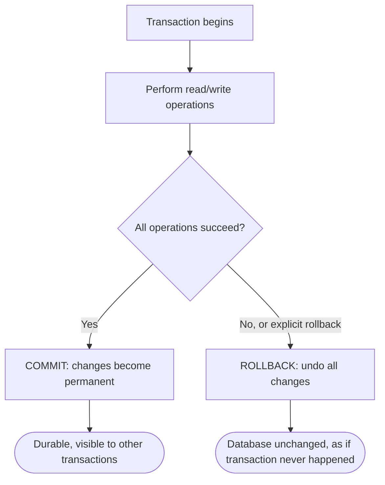
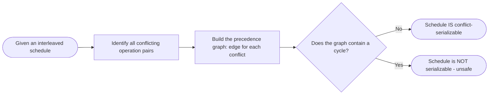

# Transactions

> Part of [Phase 06 — Database Management Systems](./README.md)

---

## What is it?

A transaction is a **sequence of one or more database operations treated as a single, indivisible unit of work** — either ALL of its operations succeed and are permanently saved, or NONE of them take effect at all, even if the system crashes partway through.

## Why do we need it?

Consider a bank transfer: money must be subtracted from one account AND added to another. If a system crash happens after the subtraction but before the addition, money would simply vanish — a catastrophic bug. Transactions exist to make exactly this kind of "all-or-nothing" guarantee possible, no matter what failures or concurrent activity occurs.

## Real-world analogy

Think of a transaction like a formal contract signing between two parties, using a "both sign or neither signs" escrow process. If Party A signs but Party B backs out before signing, the ENTIRE contract is voided — there's no in-between, partially-valid state where only A's signature counts. A transaction gives a database this same "both or neither" guarantee for a group of operations.

```text
Bank Transfer Transaction:
BEGIN TRANSACTION
    subtract $100 from Account A
    add $100 to Account B
COMMIT   -- both changes become permanent together, or...
ROLLBACK -- ...neither happens at all (e.g., if Account B doesn't exist)
```

## Historical background

- The formal transaction concept was developed through the 1970s, closely tied to early database research including IBM's System R project.
- **Jim Gray**, a foundational figure in transaction processing research, published the influential 1981 paper _"The Transaction Concept: Virtues and Limitations,"_ which helped crystallize the ACID properties as the standard framework for reasoning about transactional correctness — work that later contributed to his **1998 Turing Award**.
- **Serializability theory** (formalizing exactly when concurrent transaction execution is "correct") was developed through the late 1970s, providing the rigorous mathematical foundation for modern concurrency control.

## Mathematical foundation

**Level 1 — Explain it to a 15-year-old:**

Imagine you're playing a video game that saves your progress. If the game crashes DURING a save, you don't want a half-saved, corrupted game file — you want EITHER your old save (unchanged) or your fully completed new save, never something broken in between. A transaction gives a database exactly this same "complete success or complete rollback" guarantee.

**Level 2 — Engineering Level:**

Transactions are formally guaranteed by the **ACID properties**: Atomicity (all-or-nothing), Consistency (the database moves from one valid state to another, respecting all constraints), Isolation (concurrent transactions don't interfere with each other's intermediate states), and Durability (once committed, changes survive any subsequent crash). A **schedule** is an interleaving of operations from multiple concurrent transactions, and it is **serializable** if its effect is equivalent to SOME serial (one-at-a-time) execution of those same transactions.

**Level 3 — Industry Level:**

Real databases implement Isolation using **concurrency control** mechanisms: **locking** (two-phase locking, preventing conflicting concurrent access) or **Multi-Version Concurrency Control (MVCC)**, used by PostgreSQL and many modern databases, which lets readers see a consistent SNAPSHOT of the data without blocking writers. Databases also offer multiple **isolation levels** (Read Uncommitted, Read Committed, Repeatable Read, Serializable), each trading strictness for performance.

**Level 4 — Research Level:**

Research into **distributed transactions** (spanning multiple machines or database shards) explores protocols like Two-Phase Commit and Paxos-based consensus to achieve atomicity and durability across an entire distributed system, despite network partitions and individual node failures — a genuinely much harder problem than single-machine transaction processing, directly connecting to the CAP theorem studied in distributed systems.

## Formal definition

A transaction `T` is a sequence of read/write operations, beginning with `BEGIN` and ending with either `COMMIT` (making all changes permanent) or `ABORT`/`ROLLBACK` (undoing all changes). A **schedule** `S` involving multiple transactions is **conflict-serializable** if its **precedence graph** (a directed graph where an edge `Ti → Tj` exists whenever `Ti`'s operation conflicts with, and precedes, `Tj`'s operation on the same data item) contains NO CYCLE.

## Core concepts

- **ACID Properties** — Atomicity, Consistency, Isolation, Durability
- **Schedule** — an interleaving of operations from multiple concurrent transactions
- **Conflict-Serializability** — a schedule is "correct" if it's equivalent to some serial execution, checkable via the precedence graph's acyclicity
- **Two-Phase Locking (2PL)** — a concurrency control protocol guaranteeing serializability by separating a transaction's execution into a "growing phase" (acquiring locks) and a "shrinking phase" (releasing locks)
- **Isolation Levels** — Read Uncommitted, Read Committed, Repeatable Read, Serializable, each preventing a different subset of anomalies
- **Write-Ahead Logging (WAL)** — logging intended changes before applying them, guaranteeing Durability and Atomicity even after a crash (directly paralleling file system journaling from [`File-System.md`](../05-Operating-Systems/File-System.md))

## Internal working

A database using Write-Ahead Logging internally guarantees Atomicity and Durability by writing a description of every change to a sequential LOG FIRST, before modifying the actual data — and only marking a transaction as truly "committed" once its complete log entries are safely, durably written to disk; if a crash occurs, the log is replayed (or rolled back) on restart to restore a consistent state, exactly as covered for file system journaling in the Operating Systems phase.

## Step-by-step explanation

**How Two-Phase Locking (2PL) guarantees serializability, step by step:**

1. During the **growing phase**, a transaction may ACQUIRE locks on data items it needs (shared locks for reads, exclusive locks for writes), but may NOT release any locks yet.
2. Once the transaction releases its FIRST lock, it enters the **shrinking phase**, during which it may only RELEASE locks — it can never acquire any new ones.
3. This strict "acquire everything first, release everything after" discipline provably guarantees the resulting schedule is conflict-serializable (a foundational theorem in concurrency control theory).
4. A common STRICTER variant, **Strict 2PL**, holds ALL locks until the transaction actually COMMITS or ABORTS (rather than releasing incrementally during a shrinking phase) — this additionally avoids cascading rollbacks, and is what most real databases actually implement.

---

## Worked Example: Checking Serializability

**Given schedule** `S` involving two transactions `T1` and `T2`:

```
T1: Read(A), Write(A), Read(B), Write(B)
T2: Read(A), Write(A), Read(B), Write(B)

Interleaved schedule S:
Time:  1        2        3        4        5        6        7        8
Op:    R1(A)   W1(A)   R2(A)   W2(A)   R1(B)   W1(B)   R2(B)   W2(B)
```

**Step 1 — Identify conflicting operation pairs** (same data item, at least one is a WRITE, from DIFFERENT transactions):

```
W1(A) at time 2, R2(A) at time 3  -> conflict, T1 before T2 on A  -> edge T1 -> T2
R1(B) at time 5, W2(B)... wait, check order: W2(B) at time 8 comes AFTER R1(B) at time 5
  -> T1 reads B before T2 writes B -> edge T1 -> T2 (again, consistent)
W1(B) at time 6, W2(B) at time 8 -> both writes to B, T1 before T2 -> edge T1 -> T2
W2(A) at time 4, (any T1 operation on A after time 4?) -> none -> no additional edge here
```

**Step 2 — Build the precedence graph:**

```
All conflicts point the SAME direction: T1 -> T2
Precedence graph: T1 -> T2  (a single edge, no cycle)
```

**Step 3 — Check for cycles:**

```
No cycle exists (just one directed edge) -> the schedule IS conflict-serializable.
Equivalent serial order: T1 followed by T2 (matches the direction of every edge).
```

**Interpretation:** even though `T1` and `T2`'s operations were INTERLEAVED in execution (for potential performance benefits, e.g., overlapping I/O), the RESULT is guaranteed equivalent to simply running `T1` completely, then `T2` completely — this is exactly what "correct" concurrent execution means.

### A contrasting NON-serializable example

```
Schedule S2:
Time:  1        2        3        4
Op:    R1(A)   R2(B)   W2(A)   W1(B)

Conflicts:
  R1(A) before W2(A) -> T1 -> T2  (T1 reads A before T2 writes A)
  R2(B) before W1(B) -> T2 -> T1  (T2 reads B before T1 writes B)

Precedence graph: T1 -> T2  AND  T2 -> T1
This is a CYCLE! (T1 -> T2 -> T1)

Conclusion: Schedule S2 is NOT conflict-serializable -
no equivalent serial order exists that would produce the same result.
Allowing this schedule to run would risk producing INCORRECT,
inconsistent results.
```

---

## Visual diagram



## Architecture diagram

```text
Precedence Graph example (from the worked NON-serializable case):

    T1 -------> T2
    ^            |
    |            |
    '------------'
   (a CYCLE - schedule is NOT serializable)

Compare to the FIRST worked example (serializable):

    T1 -------> T2
   (no cycle - schedule IS serializable, equivalent to running T1 then T2)
```

## Flowchart



## Example

Illustrate the four ACID properties using the classic bank transfer:

```
Transaction: Transfer $100 from Account A to Account B

ATOMICITY:    Either BOTH the debit from A and credit to B happen, or NEITHER does.
              (No state where money vanishes or is duplicated.)

CONSISTENCY:  Before AND after the transaction, total money across A+B is unchanged
              (a database CONSTRAINT/invariant that must always hold).

ISOLATION:    While this transfer is in progress, another transaction checking
              Account A's balance sees EITHER the pre-transfer OR post-transfer
              balance - never a "half-transferred" intermediate state.

DURABILITY:   Once the transfer is COMMITTED (confirmed to the user), it survives
              even an immediate subsequent power failure - it will NOT be lost.
```

## Dry run

Trace the Strict 2PL locking protocol for the bank transfer transaction:

| Step | Action                                  | Lock State                               |
| ---- | --------------------------------------- | ---------------------------------------- |
| 1    | T1 requests exclusive lock on Account A | Granted (no conflict)                    |
| 2    | T1 debits Account A                     | —                                        |
| 3    | T1 requests exclusive lock on Account B | Granted (no conflict)                    |
| 4    | T1 credits Account B                    | —                                        |
| 5    | T1 COMMITs                              | All locks released together (Strict 2PL) |

If another transaction `T2` had requested a lock on Account A between steps 1–5, it would have been forced to WAIT until T1 released its lock at commit time — this is EXACTLY how 2PL prevents T2 from ever seeing an inconsistent, half-completed transfer.

## Multiple examples

**Example 1 — Isolation levels comparison:** `READ COMMITTED` prevents "dirty reads" (seeing another transaction's UNCOMMITTED changes) but still allows "non-repeatable reads" (re-reading the same row twice within one transaction can yield different results if another transaction commits in between); `SERIALIZABLE` prevents all such anomalies, at the cost of reduced concurrency.

**Example 2 — Deadlock during transactions:** two transactions each holding a lock the other needs (directly connecting to [`Deadlocks.md`](../05-Operating-Systems/Deadlocks.md) from the OS phase) — most databases detect this and automatically abort one transaction to break the cycle.

**Example 3 — MVCC (Multi-Version Concurrency Control):** PostgreSQL lets a `SELECT` see a consistent SNAPSHOT of data as of when its transaction started, WITHOUT blocking concurrent writers — achieving strong read isolation without the performance cost of read locks.

## Advantages

- Guarantees data correctness even under concurrent access and unexpected system failures.
- ACID properties provide a clear, well-understood contract that application developers can rely on without needing to personally reason about every possible interleaving or crash scenario.
- Serializability theory provides a RIGOROUS, checkable definition of "correct" concurrent execution, not just an intuitive one.

## Disadvantages

- Strict isolation (true Serializable level, heavy locking) can significantly reduce concurrency and throughput.
- Distributed transactions (across multiple machines) are considerably harder and slower to implement correctly than single-machine transactions.
- Deadlocks can occur when transactions acquire locks in inconsistent orders, requiring detection and recovery (see [`Deadlocks.md`](../05-Operating-Systems/Deadlocks.md)).

## Complexity

| Task                                                   | Complexity Consideration                                                                         |
| ------------------------------------------------------ | ------------------------------------------------------------------------------------------------ |
| Checking conflict-serializability via precedence graph | O(V + E) — standard cycle detection (see Phase 2, Graphs)                                        |
| Two-Phase Locking overhead                             | Proportional to the number of data items accessed                                                |
| MVCC snapshot maintenance                              | Requires storing multiple row VERSIONS, adding storage/cleanup overhead ("vacuum" in PostgreSQL) |

## Memory usage

MVCC-based systems (like PostgreSQL) must retain MULTIPLE VERSIONS of rows to serve consistent snapshots to different concurrent transactions — this requires periodic cleanup (PostgreSQL's `VACUUM` process) to reclaim space from old, no-longer-needed row versions.

## Time complexity

The core practical trade-off, worth internalizing: **stricter isolation levels (Serializable) provide stronger correctness guarantees but reduce achievable concurrency; weaker isolation levels (Read Committed) allow more concurrent throughput but expose applications to specific, well-defined anomalies** — choosing the right isolation level for a given workload is a genuine, consequential engineering decision.

## Best practices

- Choose the WEAKEST isolation level that's still safe for your specific application logic — don't default to `SERIALIZABLE` everywhere if it's not actually needed, given its performance cost.
- Keep transactions as SHORT as possible, minimizing the time locks are held (directly paralleling the synchronization best practices from [`Synchronization.md`](../05-Operating-Systems/Synchronization.md)).
- Always handle potential deadlock/serialization failure errors in application code by retrying the transaction, since databases may legitimately abort transactions to maintain correctness.
- Use `EXPLAIN` and monitoring tools to identify long-running or lock-contending transactions in production.

## Common mistakes

- Assuming ALL isolation levels prevent ALL anomalies — only `SERIALIZABLE` does; weaker levels deliberately trade some correctness guarantees for performance.
- Holding a transaction open across a slow external operation (e.g., a network call), unnecessarily extending lock hold times and blocking other transactions.
- Confusing conflict-serializability (a specific, checkable, sufficient condition) with the broader, harder-to-verify notion of view-serializability.
- Forgetting that a `SELECT` query might STILL need to participate in a transaction's isolation guarantees, not just `INSERT`/`UPDATE`/`DELETE`.

## Interview questions

1. Explain the four ACID properties with a concrete example.
2. What is a conflict-serializable schedule, and how do you check for one?
3. Explain the difference between the four standard SQL isolation levels.
4. How does Two-Phase Locking guarantee serializability?
5. What is MVCC, and how does it differ from lock-based concurrency control?

## University questions

1. Given a schedule of interleaved transaction operations, construct the precedence graph and determine if it is conflict-serializable.
2. Explain Two-Phase Locking, including the growing and shrinking phases, and prove (informally) why it guarantees serializability.
3. Compare the four SQL isolation levels and the anomalies each one prevents or allows.
4. Explain how Write-Ahead Logging guarantees Atomicity and Durability.

## Coding examples

### Pseudocode

```text
FUNCTION isConflictSerializable(schedule):
    graph = empty directed graph
    FOR each pair of operations (op1 from T1, op2 from T2), T1 != T2:
        IF op1 and op2 access the SAME data item AND at least one is a WRITE:
            IF op1 occurs BEFORE op2 in the schedule:
                addEdge(graph, T1, T2)
    RETURN NOT hasCycle(graph)
```

### Python implementation

```python
from collections import defaultdict

def build_precedence_graph(operations):
    # operations: list of (transaction, action, data_item, time)
    graph = defaultdict(set)
    for i in range(len(operations)):
        t1, a1, d1, time1 = operations[i]
        for j in range(i + 1, len(operations)):
            t2, a2, d2, time2 = operations[j]
            if t1 != t2 and d1 == d2 and ('W' in (a1, a2)):
                graph[t1].add(t2)
    return graph

def has_cycle(graph):
    visited, rec_stack = set(), set()
    def dfs(node):
        visited.add(node); rec_stack.add(node)
        for neighbor in graph[node]:
            if neighbor not in visited:
                if dfs(neighbor): return True
            elif neighbor in rec_stack:
                return True
        rec_stack.remove(node)
        return False
    return any(dfs(n) for n in list(graph) if n not in visited)

# Serializable example schedule
ops = [("T1","R","A",1), ("T1","W","A",2), ("T2","R","A",3), ("T2","W","A",4),
       ("T1","R","B",5), ("T1","W","B",6), ("T2","R","B",7), ("T2","W","B",8)]
graph = build_precedence_graph(ops)
print("Is serializable:", not has_cycle(graph))  # True
```

### C implementation

```c
#include <stdio.h>

// Simplified: check if a 2-transaction schedule's precedence graph has a cycle
// (illustrating the CONCEPT with a hardcoded example)
int main() {
    // Edges found: T1->T2 (from example 1) - no cycle
    int edgeT1toT2 = 1, edgeT2toT1 = 0;

    if (edgeT1toT2 && edgeT2toT1) {
        printf("CYCLE detected -> NOT serializable\n");
    } else {
        printf("No cycle -> Schedule IS serializable\n");
    }
    return 0;
}
```

### C++ implementation

```cpp
#include <iostream>
#include <map>
#include <set>
using namespace std;

bool dfs(string node, map<string, set<string>>& graph, set<string>& visited, set<string>& recStack) {
    visited.insert(node);
    recStack.insert(node);
    for (auto& neighbor : graph[node]) {
        if (!visited.count(neighbor)) {
            if (dfs(neighbor, graph, visited, recStack)) return true;
        } else if (recStack.count(neighbor)) {
            return true;
        }
    }
    recStack.erase(node);
    return false;
}

bool hasCycle(map<string, set<string>>& graph) {
    set<string> visited, recStack;
    for (auto& [node, _] : graph) {
        if (!visited.count(node)) {
            if (dfs(node, graph, visited, recStack)) return true;
        }
    }
    return false;
}

int main() {
    map<string, set<string>> serializableGraph = {{"T1", {"T2"}}};
    map<string, set<string>> nonSerializableGraph = {{"T1", {"T2"}}, {"T2", {"T1"}}};

    cout << "Schedule 1 serializable: " << !hasCycle(serializableGraph) << endl;      // 1 (true)
    cout << "Schedule 2 serializable: " << !hasCycle(nonSerializableGraph) << endl;   // 0 (false)
}
```

### Java implementation

```java
import java.util.*;

public class TransactionsDemo {
    static boolean hasCycle(Map<String, Set<String>> graph) {
        Set<String> visited = new HashSet<>(), recStack = new HashSet<>();
        for (String node : graph.keySet()) {
            if (!visited.contains(node) && dfs(node, graph, visited, recStack)) return true;
        }
        return false;
    }

    static boolean dfs(String node, Map<String, Set<String>> graph, Set<String> visited, Set<String> recStack) {
        visited.add(node);
        recStack.add(node);
        for (String neighbor : graph.getOrDefault(node, Set.of())) {
            if (!visited.contains(neighbor)) {
                if (dfs(neighbor, graph, visited, recStack)) return true;
            } else if (recStack.contains(neighbor)) {
                return true;
            }
        }
        recStack.remove(node);
        return false;
    }

    public static void main(String[] args) {
        Map<String, Set<String>> serializable = Map.of("T1", Set.of("T2"));
        Map<String, Set<String>> notSerializable = Map.of("T1", Set.of("T2"), "T2", Set.of("T1"));

        System.out.println("Schedule 1 serializable: " + !hasCycle(serializable));       // true
        System.out.println("Schedule 2 serializable: " + !hasCycle(notSerializable));    // false
    }
}
```

## Visualization

```text
Isolation levels and the anomalies each PREVENTS (checkmark) or ALLOWS (x):

Isolation Level    | Dirty Read | Non-Repeatable Read | Phantom Read
--------------------|-----------|----------------------|---------------
Read Uncommitted    |    x      |          x           |      x
Read Committed      |    ✓      |          x           |      x
Repeatable Read     |    ✓      |          ✓           |      x
Serializable        |    ✓      |          ✓           |      ✓

Stricter levels (moving down) trade concurrency/performance
for stronger correctness guarantees.
```

## Industry use

- **Banking and financial systems**: transactions are the non-negotiable backbone of correct money movement — every transfer, payment, and balance update relies on ACID guarantees.
- **E-commerce checkout systems**: reserving inventory, charging payment, and creating an order must happen atomically to avoid overselling or charging without fulfilling.
- **PostgreSQL, MySQL (InnoDB), Oracle**: all implement MVCC or lock-based concurrency control to provide configurable isolation levels in production.
- **Distributed databases** (Google Spanner, CockroachDB): extend transaction guarantees ACROSS multiple machines using distributed consensus protocols, a significant engineering achievement.

## Research relevance

Research into **distributed transactions** explores how to maintain ACID-like guarantees across multiple machines despite network partitions and failures (connecting directly to the CAP theorem), using protocols like Two-Phase Commit, Paxos, and Raft. Research into **high-performance concurrency control** (optimistic concurrency control, deterministic databases) explores alternatives to traditional locking that can achieve better throughput under high contention.

## Related concepts

- Synchronization and Deadlocks, Phase 5 (transaction concurrency control directly reuses this theory — see [`Synchronization.md`](../05-Operating-Systems/Synchronization.md) and [`Deadlocks.md`](../05-Operating-Systems/Deadlocks.md))
- Graphs, Phase 2 (the precedence graph and cycle detection directly reuse graph algorithms)
- File Systems, Phase 5 (Write-Ahead Logging directly parallels file system journaling — see [`File-System.md`](../05-Operating-Systems/File-System.md))

## Practice problems

1. Given a new interleaved schedule of three transactions, construct the precedence graph and determine serializability.
2. Explain, with an example, the difference between a "dirty read" and a "non-repeatable read."
3. Trace how Strict Two-Phase Locking would handle two transactions both wanting to update the same row.
4. Research and explain, at a high level, how the Two-Phase Commit protocol achieves atomicity across multiple distributed database nodes.

## Advanced concepts

- **Multi-Version Concurrency Control (MVCC)** — maintaining multiple versions of each row to let readers see a consistent snapshot without blocking writers, used by PostgreSQL and many modern databases.
- **Optimistic Concurrency Control** — assuming conflicts are rare, letting transactions proceed without locking, and only checking for conflicts at COMMIT time (aborting and retrying if one occurred).
- **Distributed Consensus (Two-Phase Commit, Paxos, Raft)** — protocols for achieving atomic, durable commitment across multiple machines in a distributed database.

## Summary

Transactions guarantee that a group of database operations behaves as a single, indivisible unit — all-or-nothing (Atomicity), always valid (Consistency), unaffected by concurrent activity (Isolation), and permanent once confirmed (Durability). Serializability theory, checkable via a schedule's precedence graph, provides the rigorous mathematical foundation for exactly WHEN concurrent execution is correct, and concurrency control mechanisms (locking, MVCC) are how real databases enforce it in practice.

## Key takeaways

- ACID = Atomicity, Consistency, Isolation, Durability — the four correctness guarantees a transaction provides.
- A schedule is conflict-serializable if and only if its precedence graph contains no cycle — memorize this exact check.
- Two-Phase Locking guarantees serializability via a strict "acquire-then-release" locking discipline.
- Isolation levels trade correctness guarantees for concurrency/performance — Serializable is strictest and slowest; Read Uncommitted is loosest and fastest.
- Write-Ahead Logging guarantees Atomicity and Durability, directly paralleling file system journaling.

## References

- Gray, J. (1981). _The Transaction Concept: Virtues and Limitations_.
- Bernstein, P., Hadzilacos, V., Goodman, N. _Concurrency Control and Recovery in Database Systems_.
- Silberschatz, A., Korth, H., Sudarshan, S. _Database System Concepts_, Chapters 17–18.
- PostgreSQL Official Documentation, "Concurrency Control" chapter.

---

⬅ Back to [Phase 06 — Database Management Systems README](./README.md)
