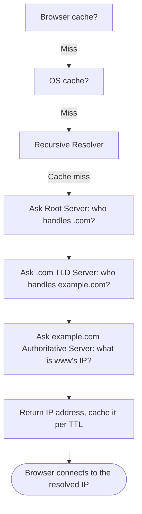
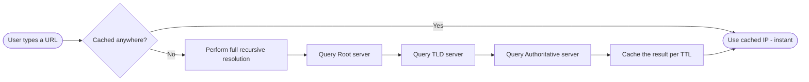

# DNS (Domain Name System)

> Part of [Phase 07 — Computer Networks](./README.md)

---

## What is it?

DNS (Domain Name System) is the internet's distributed, hierarchical "phone book" — translating human-friendly domain names (like `www.example.com`) into the numerical IP addresses (like `93.184.216.34`) that computers and routers actually use to communicate (see [`TCP-IP.md`](./TCP-IP.md)).

## Why do we need it?

Humans are terrible at remembering long strings of numbers, but computers need EXACT numerical IP addresses to route traffic. Without DNS, using the internet would mean memorizing and typing IP addresses for every single website — DNS provides the essential translation layer that lets humans use memorable NAMES while the network underneath still runs entirely on numbers.

## Real-world analogy

Think of DNS exactly like a phone book (or a modern contacts app). You don't memorize your friend's actual phone number — you look up their NAME, and the phone book (or your phone) translates it into the number needed to actually place the call. DNS does this same translation, automatically and near-instantly, every time you type a website name.

```text
You type:      "www.example.com"
DNS translates this to:  93.184.216.34
Your browser then connects to THAT numerical address
```

## Historical background

- Before DNS, the ARPANET used a single, centrally-maintained text file called `HOSTS.TXT`, manually updated and distributed to every machine — a system that clearly could not scale as the network grew.
- **Paul Mockapetris** designed DNS in **1983**, introducing a DISTRIBUTED, HIERARCHICAL naming system specifically to solve `HOSTS.TXT`'s scalability problem — a design so effective it remains, in its core structure, unchanged over 40 years later.
- DNS's hierarchical structure (root, top-level domains, second-level domains) directly mirrors the organizational structure needed to let MILLIONS of independent organizations manage their own portion of the naming system without needing central coordination for every single lookup.

## Mathematical foundation

**Level 1 — Explain it to a 15-year-old:**

Imagine a library's filing system organized hierarchically: first by SECTION (Fiction), then by AUTHOR'S LAST NAME (letters M-P), then by the SPECIFIC book. DNS names work the same way, but read RIGHT TO LEFT: `www.example.com` means "start at the global root, find `.com`, then within `.com` find `example`, then within `example` find `www`" — each step narrowing down, handled by a DIFFERENT, independently-managed server.

**Level 2 — Engineering Level:**

DNS is a distributed, hierarchical database organized as a TREE (see Phase 2, Trees): the ROOT (represented by an implicit trailing dot), then **Top-Level Domains (TLDs)** like `.com`, `.org`, `.edu`, then **second-level domains** (like `example` in `example.com`), and so on for subdomains. Resolution happens through a chain of queries, potentially involving Root servers, TLD servers, and Authoritative servers for the specific domain.

**Level 3 — Industry Level:**

Real-world DNS resolution relies heavily on CACHING at multiple levels (browser, OS, ISP resolver) to avoid repeating the full resolution chain for every single request — governed by a **TTL (Time To Live)** value set by the domain's administrator, controlling how long a given answer may be cached before it must be re-verified. This caching is also EXACTLY why DNS changes (like moving a website to a new server) can take time to "propagate" globally — cached, stale answers persist until their TTL expires.

**Level 4 — Research Level:**

Research into **DNS security** addresses DNS's historically UNENCRYPTED and largely UNAUTHENTICATED design, which enables attacks like DNS spoofing/cache poisoning (tricking a resolver into caching a FALSE answer). This has driven the development and increasing deployment of **DNSSEC** (cryptographically signing DNS responses) and **DNS over HTTPS/TLS (DoH/DoT)**, which encrypts DNS QUERIES themselves to prevent eavesdropping and tampering by intermediate networks.

## Formal definition

The DNS namespace is a TREE structure, with each node representing a **domain**, and a full domain name (a Fully Qualified Domain Name, FQDN) representing the PATH from a specific node up to the root. Each node's data is stored as one or more **resource records**, and resolution is the process of walking DOWN this tree, one label at a time, querying the appropriate server at each level, to find the final record.

## Core concepts

- **Domain Name Hierarchy** — the tree structure: Root → TLD (.com, .org) → Second-Level Domain (example) → Subdomains (www)
- **Resource Record** — a specific piece of DNS data, most commonly an **A record** (maps a name to an IPv4 address), **AAAA record** (IPv6), **CNAME** (an alias to another name), **MX** (mail server), or **NS** (nameserver delegation)
- **Recursive Resolver** — typically run by your ISP or a public service (like Google's `8.8.8.8`), performs the FULL resolution chain on behalf of your device
- **Authoritative Nameserver** — the server that holds the actual, definitive DNS records for a specific domain
- **TTL (Time To Live)** — how long a DNS answer may be cached before it must be re-queried
- **Caching** — storing previous DNS answers at multiple levels (browser, OS, resolver) to speed up repeated lookups

## Internal working

When your device needs to resolve a domain name, it typically asks a configured RECURSIVE RESOLVER (rather than performing every step itself). That resolver, if it doesn't already have a cached answer, performs an ITERATIVE chain of queries: first asking a ROOT server "who handles `.com`?", then asking that TLD server "who handles `example.com`?", then finally asking `example.com`'s AUTHORITATIVE server for the actual IP address — caching the final answer (respecting its TTL) so future requests for the same domain are instant.

## Step-by-step explanation

**How a DNS lookup for `www.example.com` works, step by step:**

1. Your browser checks its OWN cache first — if it recently resolved this domain, use that cached answer immediately (fastest path).
2. If not cached, the OS checks ITS cache; if not found, it asks the configured RECURSIVE RESOLVER (e.g., your ISP's DNS server, or a public one like `8.8.8.8`).
3. The recursive resolver checks ITS OWN cache; if empty, it begins the FULL resolution chain: it asks a ROOT server, which doesn't know the answer but knows WHO handles `.com`, and refers the resolver there.
4. The resolver asks the `.com` TLD server, which doesn't know the final IP either, but knows WHO is authoritative for `example.com`, and refers the resolver there.
5. The resolver asks `example.com`'s AUTHORITATIVE nameserver directly, which FINALLY returns the actual A record: the IP address for `www.example.com`.
6. The resolver caches this answer (for its specified TTL) and returns it to your device, which also caches it, and your browser can now connect to that IP address.

## Visual diagram



## Architecture diagram

```text
DNS Hierarchy (a tree, read right-to-left in a domain name):

                    . (root)
                 /    |    \
             .com   .org   .edu          <- Top-Level Domains (TLDs)
              |
          example.com                     <- Second-Level Domain
           /        \
        www       mail                    <- Subdomains
     (A record)  (MX record)

Full resolution for "www.example.com":
root -> .com TLD server -> example.com's authoritative server -> "www" A record
```

## Flowchart



## Example

Trace the resource records involved in setting up a simple domain:

```
example.com.        A       93.184.216.34        (the main website's IP)
www.example.com.    CNAME   example.com.          (www is just an alias for the main domain)
example.com.        MX      10 mail.example.com.  (mail server, priority 10)
mail.example.com.   A       93.184.216.50         (the actual mail server's IP)
example.com.        NS      ns1.examplehost.com.  (delegates authority to this nameserver)
```

## Dry run

Trace a DNS lookup's caching behavior across repeated requests:

| Step | Request                                  | Cache State        | Result                                                  |
| ---- | ---------------------------------------- | ------------------ | ------------------------------------------------------- |
| 1    | First visit to example.com               | Nothing cached     | Full recursive resolution performed (slower, ~50-200ms) |
| 2    | Second visit, 1 minute later (TTL=3600s) | Cached from step 1 | Instant — served directly from cache                    |
| 3    | Visit after TTL (3600s) expires          | Cache expired      | Full resolution performed again, cache refreshed        |

## Multiple examples

**Example 1 — CDN using DNS:** a Content Delivery Network can return DIFFERENT IP addresses for the SAME domain name depending on the REQUESTER's geographic location, directing users to the nearest server automatically — DNS as a load-balancing/routing tool, not just a lookup.

**Example 2 — DNS-based domain migration:** when moving a website to new hosting, administrators typically LOWER the TTL well in advance, so the eventual IP address change propagates quickly once actually made (since caches expire sooner).

**Example 3 — DNS cache poisoning attack:** an attacker tricks a recursive resolver into caching a FALSE A record (pointing a legitimate domain name to a malicious IP address) — directly motivating the need for DNSSEC's cryptographic verification, discussed further in [`Security.md`](./Security.md).

## Advantages

- Provides a scalable, distributed, hierarchical naming system that has grown from a handful of hosts to billions of domains without a fundamental redesign.
- Caching at multiple levels makes repeated lookups extremely fast, minimizing the real-world cost of the underlying multi-step resolution process.
- Its hierarchical delegation model lets millions of independent organizations manage their own domains without needing central coordination for every lookup.

## Disadvantages

- Traditional DNS is largely UNENCRYPTED, making queries visible to intermediate networks (a privacy concern) and vulnerable to spoofing/tampering (a security concern).
- DNS propagation delays (caused by TTL-respecting caches) can cause confusing, inconsistent behavior during domain migrations.
- A misconfigured or compromised DNS record can silently redirect traffic to the WRONG (or malicious) destination.

## Complexity

| Task                                         | Complexity Consideration                                                                                           |
| -------------------------------------------- | ------------------------------------------------------------------------------------------------------------------ |
| Cached DNS lookup                            | O(1) — direct cache hit                                                                                            |
| Full recursive resolution (cache miss)       | O(depth of domain hierarchy) — typically 3-4 round trips (root, TLD, authoritative, plus any subdomain delegation) |
| DNS record lookup at an authoritative server | O(1) to O(log n) depending on the server's internal data structure                                                 |

## Memory usage

DNS caching consumes memory proportional to the number of DISTINCT domains recently resolved, at every caching layer (browser, OS, recursive resolver) — recursive resolvers operated by large ISPs or public services (like Google's `8.8.8.8`) cache enormous numbers of entries to serve millions of users efficiently.

## Time complexity

The critical practical lesson: **DNS's layered caching turns an inherently multi-step, potentially slow resolution process into something that's usually nearly instant in practice** — the FIRST lookup for a given domain pays the full resolution cost, but essentially every SUBSEQUENT lookup (until the TTL expires) is served from a fast, local cache.

## Best practices

- Set DNS record TTLs thoughtfully: LOWER TTLs before planned changes (faster propagation, more DNS traffic); HIGHER TTLs for stable records (less DNS traffic, slower to update if ever needed).
- Use DNSSEC where possible to cryptographically protect against DNS spoofing/cache poisoning.
- Consider DNS over HTTPS/TLS (DoH/DoT) for privacy-sensitive applications, encrypting DNS queries themselves.
- Monitor DNS resolution times as part of overall application performance monitoring — DNS issues can silently degrade user experience.

## Common mistakes

- Assuming DNS changes take effect INSTANTLY everywhere — cached, stale answers can persist until their TTL expires, sometimes causing confusing, inconsistent behavior during migrations.
- Confusing a CNAME record (an alias to ANOTHER NAME) with an A record (a direct mapping to an IP ADDRESS) — a CNAME requires an additional resolution step.
- Assuming DNS is inherently secure — traditional DNS has NO built-in authentication, a real, historically-exploited vulnerability.
- Forgetting that lowering a TTL for a planned migration must be done WELL IN ADVANCE — the OLD (higher) TTL is still in effect for currently-cached records until it naturally expires.

## Interview questions

1. Explain the full process of resolving a domain name to an IP address, from browser cache to authoritative server.
2. What is the difference between an A record, a CNAME record, and an MX record?
3. What is a TTL, and how does it affect DNS propagation during a migration?
4. What is DNS cache poisoning, and how does DNSSEC help prevent it?
5. Why might a CDN return different IP addresses for the same domain name to different users?

## University questions

1. Draw and explain the DNS hierarchy (root, TLD, second-level domain) with an example.
2. Trace the full iterative resolution process for a given domain name, from a recursive resolver's perspective.
3. Explain the purpose of at least four different DNS resource record types.
4. Explain how caching and TTL values affect DNS performance and propagation behavior.

## Coding examples

### Pseudocode

```text
FUNCTION resolveDNS(domain, cache):
    IF domain IN cache AND NOT expired(cache[domain]):
        RETURN cache[domain].ip

    rootServer = getRootServer()
    tldServer = query(rootServer, getTLD(domain))
    authServer = query(tldServer, domain)
    ip = query(authServer, domain)

    cache[domain] = (ip: ip, expiresAt: now() + ttl)
    RETURN ip
```

### Python implementation

```python
import socket
import time

def resolve_with_cache(domain, cache):
    now = time.time()
    if domain in cache and cache[domain]["expires"] > now:
        print(f"Cache hit for {domain}")
        return cache[domain]["ip"]

    print(f"Cache miss for {domain}, performing resolution")
    ip = socket.gethostbyname(domain)  # in reality, this triggers the OS resolver
    cache[domain] = {"ip": ip, "expires": now + 3600}  # simulate a 1-hour TTL
    return ip

cache = {}
print(resolve_with_cache("example.com", cache))  # cache miss, full resolution
print(resolve_with_cache("example.com", cache))  # cache hit, instant
```

### C implementation

```c
#include <stdio.h>
#include <netdb.h>
#include <arpa/inet.h>

int main() {
    struct hostent* host = gethostbyname("example.com");
    if (host == NULL) {
        printf("DNS resolution failed\n");
        return 1;
    }

    struct in_addr addr;
    memcpy(&addr, host->h_addr_list[0], sizeof(addr));
    printf("Resolved IP: %s\n", inet_ntoa(addr));
    return 0;
}
```

### C++ implementation

```cpp
#include <iostream>
#include <netdb.h>
#include <arpa/inet.h>
using namespace std;

int main() {
    struct hostent* host = gethostbyname("example.com");
    if (host == nullptr) {
        cout << "DNS resolution failed" << endl;
        return 1;
    }

    struct in_addr addr;
    memcpy(&addr, host->h_addr_list[0], sizeof(addr));
    cout << "Resolved IP: " << inet_ntoa(addr) << endl;
}
```

### Java implementation

```java
import java.net.InetAddress;

public class DNSDemo {
    public static void main(String[] args) throws Exception {
        InetAddress address = InetAddress.getByName("example.com");
        System.out.println("Resolved IP: " + address.getHostAddress());

        // Demonstrate that repeated lookups may benefit from JVM/OS-level caching
        long start = System.nanoTime();
        InetAddress.getByName("example.com");
        long elapsed = System.nanoTime() - start;
        System.out.println("Second lookup took: " + elapsed + " ns (likely cached)");
    }
}
```

## Visualization

```text
DNS resolution timeline, first lookup vs. cached lookup:

First lookup (cache miss):
[Root: ~10ms][TLD: ~10ms][Authoritative: ~10ms] = ~30ms total

Cached lookup (within TTL):
[Cache check: <1ms] = nearly instant

This dramatic speedup, repeated across billions of requests per day,
is exactly why DNS caching (and thoughtful TTL configuration)
matters so much for real-world internet performance.
```

## Industry use

- **Every website and internet service** relies on DNS as the fundamental name-to-address translation layer.
- **CDNs and cloud load balancers** use DNS creatively (returning different IPs based on requester location or server health) as a core traffic-routing mechanism.
- **Public DNS resolvers** (Google's `8.8.8.8`, Cloudflare's `1.1.1.1`) serve billions of queries daily, often emphasizing both speed and, increasingly, privacy (via DoH/DoT support).
- **Security products** (DNS filtering services) block access to known-malicious domains by intercepting and refusing to resolve them.

## Research relevance

Research into **DNS privacy and security** continues to drive adoption of DNSSEC (cryptographic authentication of DNS records) and DNS over HTTPS/TLS (encrypting the query itself), addressing DNS's historically open, unauthenticated design — directly relevant given DNS's role as a frequently-exploited attack surface (cache poisoning, DNS-based censorship, traffic interception).

## Related concepts

- TCP/IP (DNS ultimately resolves to the IP addresses TCP/IP uses — see [`TCP-IP.md`](./TCP-IP.md))
- Trees, Phase 2 (the DNS namespace is fundamentally a tree structure)
- Hashing, Phase 2 (DNS caches are typically implemented using hash tables for O(1) average lookup)
- Security (DNS spoofing, cache poisoning, and DNSSEC are direct network security topics — see [`Security.md`](./Security.md))

## Practice problems

1. Trace the full resolution chain for a hypothetical domain `blog.mysite.io`, including root, TLD, and authoritative server queries.
2. Explain why lowering a domain's TTL BEFORE a planned server migration helps ensure faster, smoother propagation.
3. Compare an A record and a CNAME record's resolution process, including the extra step CNAME requires.
4. Research and explain, at a high level, how DNSSEC uses digital signatures to prevent DNS spoofing.

## Advanced concepts

- **DNSSEC (DNS Security Extensions)** — cryptographically signs DNS records, letting resolvers VERIFY a response genuinely came from the legitimate authoritative source, preventing spoofing.
- **DNS over HTTPS (DoH) / DNS over TLS (DoT)** — encrypts the DNS QUERY itself (not just the eventual answer's authenticity), preventing eavesdropping and tampering by intermediate networks.
- **Anycast DNS** — announcing the SAME IP address for a DNS server (like a root server) from many physical locations worldwide, letting routing (see [`Routing.md`](./Routing.md)) naturally direct queries to the nearest instance.

## Summary

DNS is the internet's distributed, hierarchical, heavily-cached naming system, translating human-friendly domain names into the numerical IP addresses the network actually uses — a design, dating to 1983, that has scaled from a handful of hosts to billions of domains without fundamental change, while modern security extensions (DNSSEC, DoH/DoT) continue to address its historically open, unauthenticated design.

## Key takeaways

- DNS translates domain names into IP addresses using a distributed, hierarchical tree of servers (root, TLD, authoritative).
- Caching at multiple levels (browser, OS, resolver), governed by each record's TTL, makes repeated lookups fast and reduces load on authoritative servers.
- Different record types (A, AAAA, CNAME, MX, NS) serve different purposes within the same naming system.
- Traditional DNS is largely unencrypted and unauthenticated — DNSSEC and DoH/DoT are modern responses to this security/privacy gap.
- DNS changes propagate only as fast as caches expire — plan TTL adjustments well ahead of any planned migration.

## References

- Mockapetris, P. (1983). _RFC 882 / RFC 883 — Domain Names_ (the original DNS design).
- Mockapetris, P. (1987). _RFC 1034 / RFC 1035 — Domain Names, Concepts and Facilities / Implementation and Specification_.
- Kurose, J., Ross, K. _Computer Networking: A Top-Down Approach_, Chapter 2.

---

⬅ Back to [Phase 07 — Computer Networks README](./README.md)
