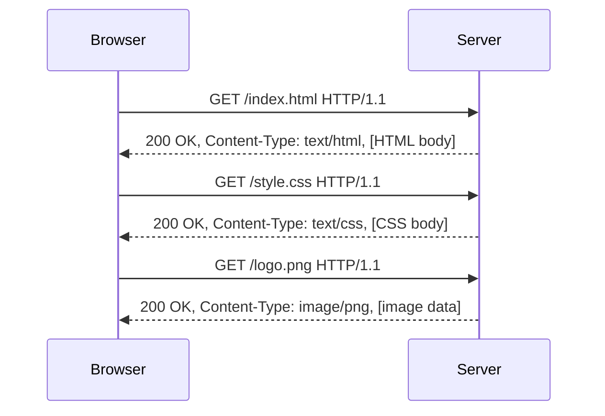
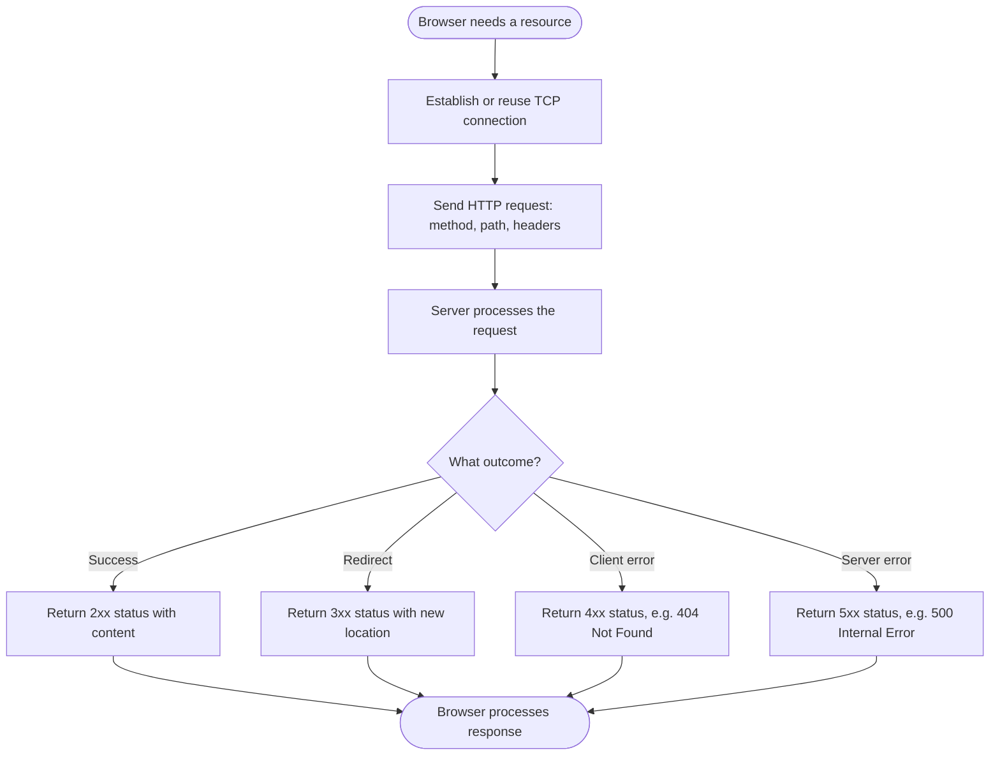

# HTTP (Hypertext Transfer Protocol)

> Part of [Phase 07 — Computer Networks](./README.md)

---

## What is it?

HTTP (Hypertext Transfer Protocol) is the **application-layer protocol** that powers the World Wide Web — a simple, text-based (in its original form) request-response protocol that lets a client (typically a browser) ask a server for a resource (a webpage, an image, an API response), and lets the server respond with that resource plus a status describing what happened.

## Why do we need it?

Below HTTP, TCP/IP (see [`TCP-IP.md`](./TCP-IP.md)) gives us reliable byte delivery between two machines — but it says nothing about what those bytes MEAN. HTTP defines exactly that meaning for web communication: a standard vocabulary of REQUESTS (what does the client want?) and RESPONSES (what did the server do, and here's the result), letting browsers, servers, and countless other tools built by entirely different organizations all understand each other perfectly.

## Real-world analogy

Think of HTTP like a standardized form used at a government office. You (the client) fill out a request form specifying exactly what you want ("GET my tax record," "POST this new application"), hand it to the clerk (the server), and the clerk responds with a standardized response form — either the requested document plus a "200 OK" stamp, or an explanation of what went wrong ("404 — Record Not Found," "403 — Not Authorized").

```text
CLIENT REQUEST:                       SERVER RESPONSE:
GET /index.html HTTP/1.1              HTTP/1.1 200 OK
Host: www.example.com                 Content-Type: text/html
                                       Content-Length: 1234

                                       <html>...</html>
```

## Historical background

- HTTP was developed by **Tim Berners-Lee** at CERN, alongside HTML and the first web browser, as part of his **1989 proposal** for the World Wide Web.
- **HTTP/0.9** (1991) was extremely minimal — supporting only `GET` requests, with no headers, status codes, or even a version number.
- **HTTP/1.0** (1996) added headers, status codes, and support for content types other than plain HTML.
- **HTTP/1.1** (1997) added persistent connections (reusing one TCP connection for multiple requests, avoiding repeated handshake overhead) and became the dominant version for over two decades.
- **HTTP/2** (2015) introduced multiplexing (multiple requests over a SINGLE connection simultaneously) and header compression, addressing HTTP/1.1's performance limitations.
- **HTTP/3** (2022) moved the transport layer from TCP to QUIC (built on UDP), directly addressing TCP's head-of-line blocking problem (see [`TCP-IP.md`](./TCP-IP.md)).

## Mathematical foundation

**Level 1 — Explain it to a 15-year-old:**

Imagine ordering food using a standardized menu system: you say "I'd like item #4" (a GET request), and the kitchen responds either with your food and a "here you go" (200 OK), or an apology like "sorry, we're out of that" (404 Not Found) or "you need to be a member to order that" (403 Forbidden). HTTP is exactly this kind of standardized "ask and respond" system, but for web content instead of food.

**Level 2 — Engineering Level:**

An HTTP message consists of a START LINE (method + path + version for requests; version + status code + reason phrase for responses), HEADERS (key-value metadata), and an optional BODY. HTTP is fundamentally **stateless** — each request is processed independently, with NO memory of previous requests, unless the application explicitly adds state-tracking mechanisms like cookies.

**Level 3 — Industry Level:**

Modern web applications rely heavily on HTTP's METHODS (`GET` for reading, `POST` for creating, `PUT`/`PATCH` for updating, `DELETE` for removing) to build RESTful APIs — a widely-adopted architectural convention (not a strict protocol requirement) mapping application operations onto HTTP's built-in vocabulary. Statelessness is deliberately preserved at the protocol level, with session/authentication state managed via COOKIES or tokens sent in headers on each request.

**Level 4 — Research Level:**

Research into web performance continues to refine HTTP itself: HTTP/2's multiplexing and HTTP/3's QUIC-based transport both directly address measured, real-world performance bottlenecks in how browsers load the dozens (sometimes hundreds) of resources a typical modern webpage requires — an active area bridging protocol design and empirical web performance measurement.

## Formal definition

An HTTP request is defined by a **method** (an action verb), a **target** (typically a URL path), a **version**, a set of **headers**, and an optional **body**. An HTTP response is defined by a **status code** (a 3-digit number indicating the outcome), a **reason phrase**, headers, and an optional body. HTTP is a **stateless, request-response protocol**, typically layered on top of TCP (or, in HTTP/3, QUIC/UDP).

## Core concepts

- **HTTP Methods** — `GET` (retrieve), `POST` (create/submit), `PUT` (replace), `PATCH` (partial update), `DELETE` (remove), `HEAD` (like GET but headers only), `OPTIONS` (query allowed methods)
- **Status Codes** — 3-digit codes grouped by category: 1xx (informational), 2xx (success), 3xx (redirection), 4xx (client error), 5xx (server error)
- **Headers** — key-value metadata sent with requests/responses (e.g., `Content-Type`, `Authorization`, `Cache-Control`)
- **Statelessness** — each HTTP request is independent; the protocol itself retains no memory between requests
- **Cookies** — a mechanism for maintaining state ACROSS otherwise-stateless requests, by having the client store and resend a small piece of server-issued data
- **Persistent Connections / Multiplexing** — HTTP/1.1's connection reuse and HTTP/2's true simultaneous multiplexing, both addressing the overhead of repeated TCP handshakes

## Internal working

When a browser needs to display a webpage, it sends an HTTP `GET` request (over an established TCP connection — see [`TCP-IP.md`](./TCP-IP.md)) for the HTML document; upon receiving and PARSING that HTML, it discovers references to additional resources (images, stylesheets, scripts), triggering ADDITIONAL HTTP requests for each — HTTP/1.1's persistent connections and HTTP/2's multiplexing exist specifically to make fetching these many additional resources efficient.

## Step-by-step explanation

**How an HTTP request-response cycle works, step by step:**

1. The client establishes a TCP connection to the server (typically port 80 for HTTP, port 443 for HTTPS — see [`HTTPS.md`](./HTTPS.md)).
2. The client sends an HTTP REQUEST: a method, a target path, headers (like `Host`, `User-Agent`, `Accept`), and an optional body (for `POST`/`PUT` requests).
3. The server processes the request — this might involve looking up a database record, running application logic, or simply reading a static file.
4. The server sends back an HTTP RESPONSE: a status code, headers (like `Content-Type`, `Content-Length`), and the response body (the actual requested content, or an error description).
5. Depending on the HTTP version and headers (`Connection: keep-alive`), the TCP connection may be REUSED for subsequent requests, avoiding the overhead of establishing a new connection each time.

## Visual diagram



## Architecture diagram

```text
Anatomy of an HTTP request:

GET /search?q=networking HTTP/1.1        <- Method, Path+Query, Version
Host: www.example.com                     <- Header
User-Agent: Mozilla/5.0                   <- Header
Accept: text/html                          <- Header
                                            <- blank line separates headers from body
(no body for a GET request)

Anatomy of an HTTP response:

HTTP/1.1 200 OK                            <- Version, Status Code, Reason Phrase
Content-Type: text/html; charset=utf-8    <- Header
Content-Length: 4523                       <- Header
                                            <- blank line separates headers from body
<html>...</html>                           <- Body
```

## Flowchart



## Example

Trace a realistic RESTful API interaction:

```
Request:  POST /api/orders HTTP/1.1
          Host: api.example.com
          Content-Type: application/json
          Authorization: Bearer eyJhbGc...

          {"product_id": 42, "quantity": 2}

Response: HTTP/1.1 201 Created
          Content-Type: application/json
          Location: /api/orders/9876

          {"order_id": 9876, "status": "confirmed"}
```

```text
201 Created (not 200 OK) specifically signals "a NEW resource was created" -
a subtle but meaningful distinction in status code semantics, and the
Location header tells the client exactly WHERE to find the new resource.
```

## Dry run

Trace a `GET` request encountering a redirect:

| Step | Request/Response                                        | Meaning                                             |
| ---- | ------------------------------------------------------- | --------------------------------------------------- |
| 1    | `GET /old-page HTTP/1.1`                                | Client requests a page that has moved               |
| 2    | `HTTP/1.1 301 Moved Permanently`, `Location: /new-page` | Server tells the client where the content NOW lives |
| 3    | `GET /new-page HTTP/1.1`                                | Browser AUTOMATICALLY follows the redirect          |
| 4    | `HTTP/1.1 200 OK`, [content]                            | Server returns the actual requested content         |

## Multiple examples

**Example 1 — Caching headers:** `Cache-Control: max-age=3600` tells the browser it can reuse this response for up to an hour WITHOUT re-requesting it, directly improving performance for static assets.

**Example 2 — Cookies maintaining session state:** after a successful login, the server sends `Set-Cookie: session_id=abc123`; the browser automatically includes `Cookie: session_id=abc123` on EVERY subsequent request to that domain, letting the otherwise-stateless server "remember" the logged-in user.

**Example 3 — Content negotiation:** a client's `Accept: application/json` header tells the server "I prefer a JSON response," while `Accept-Language: fr` requests French content — HTTP headers let clients express PREFERENCES the server can (optionally) honor.

## Advantages

- Simple, text-based, human-readable format (in HTTP/1.x) makes debugging and manual testing straightforward.
- Statelessness simplifies server design and scaling — any server can handle any request, since no request depends on server-side memory of previous ones.
- Universally supported, standardized vocabulary (methods, status codes, headers) enables massive interoperability across independently-built clients and servers.

## Disadvantages

- Statelessness means applications needing to REMEMBER something (like a logged-in user) must build additional mechanisms (cookies, tokens) on top of HTTP itself.
- HTTP/1.1's connection-per-request-queue model (without full multiplexing) can cause "head-of-line blocking" at the application level for pages needing many resources.
- Plain HTTP (without TLS — see [`HTTPS.md`](./HTTPS.md)) transmits everything, including potentially sensitive data, in PLAINTEXT, visible to anyone able to observe the network traffic.

## Complexity

| Aspect                                  | Consideration                                                                                                   |
| --------------------------------------- | --------------------------------------------------------------------------------------------------------------- |
| HTTP/1.1 without persistent connections | New TCP handshake PER request — significant overhead for pages with many resources                              |
| HTTP/1.1 with persistent connections    | Requests over one connection, but processed largely IN ORDER (head-of-line blocking risk)                       |
| HTTP/2 multiplexing                     | Multiple requests truly SIMULTANEOUSLY over one connection, eliminating application-level head-of-line blocking |
| HTTP/3 (QUIC-based)                     | Also eliminates TRANSPORT-level head-of-line blocking, unlike HTTP/2 (which still runs over TCP)                |

## Memory usage

Servers handling many concurrent HTTP connections must manage memory for each connection's state (buffers, headers being parsed) — this is a major reason modern web servers use efficient, often event-driven or asynchronous I/O models (rather than one OS thread per connection) to handle large numbers of simultaneous clients (directly connecting to Thread/Process trade-offs from Phase 5).

## Time complexity

The critical practical lesson, tracing HTTP's own evolution: **each major HTTP version has directly targeted a specific, measured REAL-WORLD performance bottleneck** — HTTP/1.1 addressed repeated handshake overhead; HTTP/2 addressed application-level head-of-line blocking via multiplexing; HTTP/3 addressed the REMAINING transport-level head-of-line blocking by moving off TCP entirely.

## Best practices

- Use HTTP methods semantically correctly (`GET` for safe, read-only operations; `POST`/`PUT`/`DELETE` for state-changing operations) — this convention (central to REST) makes APIs far more predictable and cacheable.
- Set appropriate caching headers (`Cache-Control`, `ETag`) for static or infrequently-changing resources to reduce unnecessary requests.
- Always use HTTPS (see [`HTTPS.md`](./HTTPS.md)) rather than plain HTTP for anything involving sensitive data.
- Return semantically appropriate status codes — don't return `200 OK` for an error condition just because the RESPONSE itself was successfully delivered.

## Common mistakes

- Using `GET` requests for operations that change server state (violating HTTP's "safe methods" convention, which can cause unexpected behavior with caching, prefetching, or browser back-button navigation).
- Confusing `401 Unauthorized` (authentication is missing or invalid) with `403 Forbidden` (authentication succeeded, but the user lacks permission) — a commonly confused pair of status codes.
- Forgetting that HTTP is stateless by DEFAULT — assuming the server "remembers" a previous request without explicitly implementing session/cookie-based state.
- Not setting `Content-Type` correctly, causing clients to misinterpret the response body's format.

## Interview questions

1. Explain the difference between `GET`, `POST`, `PUT`, and `DELETE`.
2. What does it mean that HTTP is "stateless," and how do cookies address this limitation?
3. Explain the difference between `401 Unauthorized` and `403 Forbidden`.
4. What problem does HTTP/2's multiplexing solve compared to HTTP/1.1?
5. Walk through what happens, at the HTTP level, when a browser loads a webpage with several images.

## University questions

1. Draw the structure of an HTTP request and response, labeling each component.
2. Explain the five major status code categories (1xx-5xx) with an example code from each.
3. Compare HTTP/1.1, HTTP/2, and HTTP/3 in terms of connection handling and performance.
4. Explain how cookies allow a stateless protocol to support stateful sessions.

## Coding examples

### Pseudocode

```text
FUNCTION handleRequest(request):
    IF request.method == "GET":
        resource = findResource(request.path)
        IF resource exists:
            RETURN Response(200, "OK", resource)
        ELSE:
            RETURN Response(404, "Not Found")
    ELSE IF request.method == "POST":
        newResource = createResource(request.body)
        RETURN Response(201, "Created", newResource, headers={"Location": newResource.url})
```

### Python implementation

```python
import http.server
import json

class SimpleHandler(http.server.BaseHTTPRequestHandler):
    def do_GET(self):
        if self.path == "/hello":
            self.send_response(200)
            self.send_header("Content-Type", "application/json")
            self.end_headers()
            self.wfile.write(json.dumps({"message": "Hello, World!"}).encode())
        else:
            self.send_response(404)
            self.end_headers()
            self.wfile.write(b"Not Found")

# Illustrative client-side request (using requests library conceptually)
# import requests
# response = requests.get("http://localhost:8000/hello")
# print(response.status_code, response.json())
```

### C implementation

```c
#include <stdio.h>
#include <string.h>

// Illustrative: constructing a raw HTTP request string
int main() {
    char request[512];
    snprintf(request, sizeof(request),
        "GET /index.html HTTP/1.1\r\n"
        "Host: www.example.com\r\n"
        "Connection: close\r\n"
        "\r\n");

    printf("Raw HTTP request to be sent over a TCP socket:\n%s", request);
    // In a real program, this string would be sent via send()/write() over
    // a TCP socket connected to port 80.
    return 0;
}
```

### C++ implementation

```cpp
#include <iostream>
#include <string>
using namespace std;

string buildGetRequest(const string& path, const string& host) {
    return "GET " + path + " HTTP/1.1\r\n"
           "Host: " + host + "\r\n"
           "Connection: close\r\n"
           "\r\n";
}

int main() {
    string request = buildGetRequest("/index.html", "www.example.com");
    cout << "Raw HTTP request:\n" << request;
    // This string would then be sent over a TCP socket connection.
}
```

### Java implementation

```java
import java.net.URI;
import java.net.http.*;

public class HTTPDemo {
    public static void main(String[] args) throws Exception {
        HttpClient client = HttpClient.newHttpClient();
        HttpRequest request = HttpRequest.newBuilder()
                .uri(URI.create("https://example.com"))
                .GET()
                .build();

        HttpResponse<String> response = client.send(request, HttpResponse.BodyHandlers.ofString());
        System.out.println("Status code: " + response.statusCode());
        System.out.println("Content-Type: " + response.headers().firstValue("Content-Type").orElse("unknown"));
    }
}
```

## Visualization

```text
HTTP/1.1 (sequential-ish) vs HTTP/2 (multiplexed) loading 3 resources:

HTTP/1.1 (without full pipelining):
[--- Request 1 + Response 1 ---][--- Request 2 + Response 2 ---][--- Request 3 + Response 3 ---]

HTTP/2 (multiplexed over ONE connection):
[--- Request 1 ---]
[--- Request 2 ---]     <- all sent together, responses interleaved as ready
[--- Request 3 ---]

HTTP/2 can complete all 3 resource fetches in roughly the time
HTTP/1.1 takes for ONE, when connections/round-trips are the bottleneck.
```

## Industry use

- **Every website and web-based API** on the internet uses HTTP (or its secured form, HTTPS) as its application-layer protocol.
- **RESTful API design**, the dominant convention for web APIs, is built directly on HTTP's methods and status codes.
- **CDNs and caching layers** rely heavily on HTTP's `Cache-Control` and related headers to serve content efficiently without hitting origin servers repeatedly.
- **Browser DevTools' Network tab** is a universally-used tool for developers to directly inspect real HTTP requests and responses during development and debugging.

## Research relevance

Ongoing protocol research (HTTP/3 and beyond) continues to refine web performance by addressing measured real-world bottlenecks — connection establishment latency, head-of-line blocking, and the overhead of the sheer NUMBER of resources modern webpages require, an active, empirically-driven area of networking and web performance research.

## Related concepts

- TCP/IP (HTTP traditionally runs over TCP; HTTP/3 runs over QUIC/UDP — see [`TCP-IP.md`](./TCP-IP.md))
- HTTPS (HTTP secured with TLS encryption and authentication — see [`HTTPS.md`](./HTTPS.md))
- DNS (resolving the domain name in a URL is the FIRST step before any HTTP request can be sent — see [`DNS.md`](./DNS.md))

## Practice problems

1. Write out the raw HTTP request and response for a `POST` request creating a new user account, including realistic headers.
2. Explain the difference between a `301 Moved Permanently` and a `302 Found` redirect, and when each should be used.
3. Design a simple RESTful API (methods and paths) for a basic blog application (posts, comments).
4. Explain how `ETag` headers can be used alongside `Cache-Control` for more precise cache validation.

## Advanced concepts

- **HTTP/2 Server Push** — a (now largely deprecated in practice) feature allowing a server to proactively send resources a client hasn't yet requested, anticipating future needs.
- **WebSockets** — a protocol (initiated via a special HTTP "upgrade" request) providing full-duplex, persistent communication, used for real-time applications HTTP's request-response model doesn't naturally support.
- **GraphQL** — an alternative to traditional REST APIs, using a SINGLE HTTP endpoint with a flexible query language, addressing REST's tendency toward either over-fetching or under-fetching data.

## Summary

HTTP is the application-layer protocol underlying the entire web — a simple, stateless, request-response system with a standardized vocabulary of methods and status codes that has evolved (HTTP/1.1 → HTTP/2 → HTTP/3) specifically to address measured, real-world performance bottlenecks, while its core request-response semantics have remained remarkably stable since Tim Berners-Lee's original 1989 design.

## Key takeaways

- HTTP is a stateless, text-based (originally) request-response protocol; state (like login sessions) must be added via cookies or tokens.
- HTTP methods (`GET`, `POST`, `PUT`, `DELETE`) express INTENT; status codes (2xx, 3xx, 4xx, 5xx) express OUTCOME.
- HTTP/2's multiplexing and HTTP/3's QUIC-based transport directly address head-of-line blocking issues present in HTTP/1.1.
- Caching headers (`Cache-Control`, `ETag`) are essential for real-world web performance.
- HTTP transmits data in plaintext by default — HTTPS (TLS-secured HTTP) is essential for any sensitive data.

## References

- Berners-Lee, T., Fielding, R., Frystyk, H. (1996). _RFC 1945 — Hypertext Transfer Protocol -- HTTP/1.0_.
- Fielding, R. et al. (1999). _RFC 2616 — Hypertext Transfer Protocol -- HTTP/1.1_.
- Belshe, M., Peon, R., Thomson, M. (2015). _RFC 7540 — Hypertext Transfer Protocol Version 2 (HTTP/2)_.
- Kurose, J., Ross, K. _Computer Networking: A Top-Down Approach_, Chapter 2.

---

⬅ Back to [Phase 07 — Computer Networks README](./README.md)
