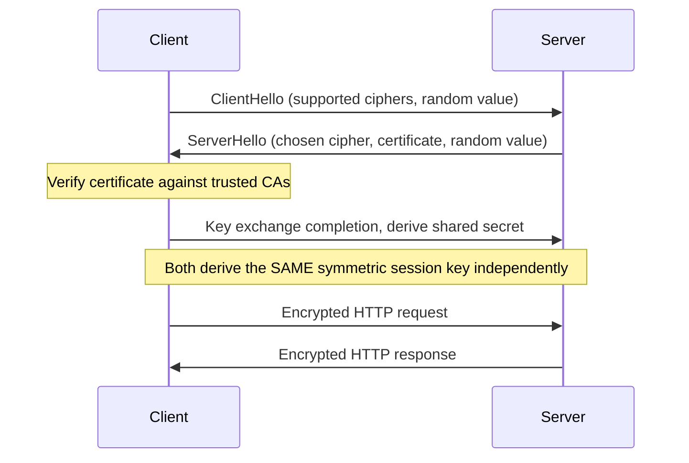
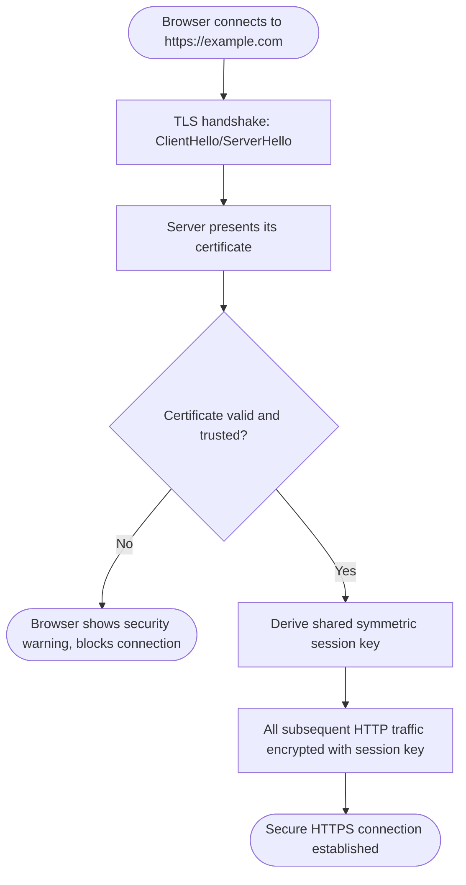

# HTTPS (HTTP Secure)

> Part of [Phase 07 — Computer Networks](./README.md)

---

## What is it?

HTTPS is HTTP (see [`HTTP.md`](./HTTP.md)) layered on top of **TLS (Transport Layer Security)**, adding three critical guarantees plain HTTP lacks: **encryption** (no one else can read the data in transit), **integrity** (no one can undetectably tamper with the data), and **authentication** (you can cryptographically verify you're actually talking to the server you think you are, not an impostor).

## Why do we need it?

Plain HTTP sends everything — passwords, credit card numbers, private messages — in PLAINTEXT, readable by anyone able to observe the traffic (your ISP, a coffee shop's WiFi network, a compromised router along the path). HTTPS exists to close this gap, making it computationally infeasible for an eavesdropper to read intercepted traffic, and for an attacker to silently impersonate a legitimate server.

## Real-world analogy

Think of plain HTTP like shouting your message across a crowded room — anyone nearby can hear it, and anyone could shout back pretending to be your intended recipient. HTTPS is like handing someone a LOCKED box (encryption) that only the intended recipient has the key to open, AND first checking their government-issued ID (a certificate) to confirm they really are who they claim to be, before handing over the box at all.

```text
HTTP:  "My password is hunter2"           <- anyone listening can read this
HTTPS: "x7$kL9#mQ2..."  (encrypted)        <- unreadable without the correct key,
                                               AND you've verified WHO you're
                                               sending it to first
```

## Historical background

- **SSL (Secure Sockets Layer)**, HTTPS's ancestor, was developed by **Netscape**, with **SSL 2.0 released in 1995** (SSL 1.0 was never publicly released due to security flaws).
- SSL was standardized and renamed **TLS (Transport Layer Security)** by the IETF, with **TLS 1.0 released in 1999**.
- Over the following two decades, multiple SSL/TLS versions were found to have serious vulnerabilities (POODLE, Heartbleed, and others), driving continuous protocol refinement.
- **TLS 1.3**, finalized in **2018**, represents a major redesign — removing support for many older, vulnerable cryptographic options, and reducing the handshake to fewer round trips for better performance alongside stronger security.
- Industry-wide efforts (like the free, automated **Let's Encrypt** certificate authority, launched in 2015) have driven HTTPS adoption from a minority of websites to the overwhelming majority of web traffic today.

## Mathematical foundation

**Level 1 — Explain it to a 15-year-old:**

Imagine you want to send a secret note to a friend, but you're worried someone might intercept it along the way. HTTPS is like having a special lockbox where your friend gives you a padlock (but keeps the KEY to themselves) — you lock your note in the box using their padlock, and now ONLY your friend, with their private key, can unlock and read it, even though anyone could see the box being passed along.

**Level 2 — Engineering Level:**

TLS uses a HYBRID cryptographic approach: **asymmetric (public-key) cryptography** is used briefly, during the handshake, to securely establish a SHARED SECRET between client and server — then this shared secret is used with much faster **symmetric encryption** for the actual data transfer (asymmetric crypto is far too computationally expensive for encrypting large amounts of data continuously). The server's identity is verified using a **digital certificate**, issued and signed by a trusted **Certificate Authority (CA)**.

**Level 3 — Industry Level:**

Real-world HTTPS deployment relies on the **Public Key Infrastructure (PKI)**: browsers ship with a built-in list of trusted CAs; when a server presents its certificate, the browser verifies it was signed by one of these trusted CAs (or a chain leading back to one), confirming the server's claimed identity. Modern practices like **HSTS (HTTP Strict Transport Security)** headers instruct browsers to NEVER attempt an insecure HTTP connection to a given domain again, closing a specific downgrade-attack window.

**Level 4 — Research Level:**

Research into **post-quantum cryptography** explores replacing TLS's current asymmetric algorithms (RSA, elliptic curve cryptography) with alternatives believed to remain secure even against a sufficiently powerful future QUANTUM computer, which could otherwise break today's widely-deployed public-key algorithms — an active, urgent area of applied cryptography research given the long lifespan of some encrypted, currently-intercepted data ("harvest now, decrypt later" threats).

## Formal definition

TLS establishes a secure channel through a **handshake protocol**: the client and server AGREE on cryptographic parameters, the server AUTHENTICATES itself via a certificate (verified against a chain of trust back to a known CA), and both parties derive a SHARED SESSION KEY (via asymmetric key exchange) used for fast SYMMETRIC encryption of all subsequent application data.

## Core concepts

- **TLS (Transport Layer Security)** — the cryptographic protocol securing HTTPS (and other protocols)
- **Asymmetric (Public-Key) Cryptography** — uses a mathematically-linked public/private key pair; data encrypted with the public key can only be decrypted with the corresponding private key
- **Symmetric Encryption** — uses the SAME key for both encryption and decryption, much faster than asymmetric methods, used for the actual bulk data transfer
- **Digital Certificate** — a document binding a public key to an identity (like a domain name), digitally signed by a Certificate Authority
- **Certificate Authority (CA)** — a trusted organization that verifies identities and issues signed certificates
- **TLS Handshake** — the initial exchange establishing agreed cryptographic parameters and a shared session key before any application data is sent

## Internal working

During the TLS handshake, the client and server use ASYMMETRIC cryptography (or a related key-exchange algorithm like Diffie-Hellman) to securely agree on a SHARED SECRET, even over an otherwise-insecure network — critically, this shared secret is NEVER transmitted directly, but derived independently by both sides through mathematical properties of the exchange, such that an eavesdropper observing the ENTIRE handshake still cannot compute the same secret.

## Step-by-step explanation

**How the TLS 1.3 handshake establishes a secure connection, step by step (simplified):**

1. The CLIENT sends a `ClientHello` message: proposed TLS version, supported cipher suites (encryption algorithm combinations), and a random value plus key-exchange parameters.
2. The SERVER responds with a `ServerHello`: its chosen cipher suite, its own random value and key-exchange parameters, its DIGITAL CERTIFICATE (containing its public key, signed by a CA), and a signature proving it possesses the corresponding PRIVATE key.
3. The CLIENT verifies the server's certificate chain leads back to a CA it trusts (built into the browser/OS), and verifies the server's signature — confirming the server's identity.
4. Both sides INDEPENDENTLY compute the SAME shared secret using the exchanged key-exchange parameters (via a Diffie-Hellman-style key exchange), WITHOUT ever transmitting the secret itself.
5. Both sides derive SYMMETRIC session keys from this shared secret, and all subsequent application data (the actual HTTP request/response) is encrypted using fast symmetric encryption with these keys.

## Visual diagram



## Architecture diagram

```text
Certificate Chain of Trust:

Root CA (built into browser/OS, e.g., "DigiCert Global Root")
    |
    | signs
    v
Intermediate CA
    |
    | signs
    v
example.com's Certificate (contains example.com's public key)

Browser verifies: does this certificate chain lead back to a
ROOT CA it already trusts? If yes, and the domain name matches,
the server's identity is considered VERIFIED.
```

## Flowchart



## Example

Illustrate what a browser checks when validating a certificate:

```
Certificate presented for "www.example.com":
  Subject: CN=www.example.com
  Issuer: Signed by "Trusted CA Inc."
  Valid From: 2024-01-01   Valid To: 2025-01-01
  Public Key: [RSA 2048-bit key]

Browser checks:
  1. Is "Trusted CA Inc." in my built-in list of trusted root CAs
     (or chained to one)?                                    -> YES
  2. Is today's date within the Valid From/To range?          -> YES
  3. Does the certificate's Subject match the domain I'm
     actually connecting to (www.example.com)?                -> YES
  4. Has this certificate been REVOKED (checked via OCSP/CRL)? -> NO

ALL checks pass -> proceed with the secure connection, padlock icon shown.
```

## Dry run

Trace what happens when ONE certificate check fails (a self-signed certificate, not from a trusted CA):

| Step | Check                      | Result                                                                                  |
| ---- | -------------------------- | --------------------------------------------------------------------------------------- |
| 1    | Certificate presented      | Self-signed, NOT chained to any trusted root CA                                         |
| 2    | Browser checks trust chain | FAILS — no path to a trusted root                                                       |
| 3    | Browser response           | Displays a prominent security warning ("Your connection is not private")                |
| 4    | User's options             | Proceed anyway (dangerous, bypassing protection) or abort the connection (safe default) |

## Multiple examples

**Example 1 — Let's Encrypt:** a free, automated Certificate Authority that dramatically lowered the barrier to HTTPS adoption, issuing short-lived (90-day) certificates renewed automatically via software, removing the historical cost and manual-renewal friction of obtaining certificates.

**Example 2 — HSTS (HTTP Strict Transport Security):** a response header (`Strict-Transport-Security: max-age=31536000`) telling the browser "always use HTTPS for this domain, even if the user types plain `http://`," closing a specific downgrade-attack window.

**Example 3 — Man-in-the-Middle (MITM) attack scenario:** without certificate validation, an attacker on the same network could intercept traffic and present THEIR OWN certificate, pretending to be the real server — TLS's certificate verification is EXACTLY the mechanism that makes this attack detectable and blockable (directly connecting to [`Security.md`](./Security.md)).

## Advantages

- Provides strong, well-vetted cryptographic guarantees: encryption (confidentiality), integrity (tamper detection), and authentication (identity verification).
- Modern TLS 1.3 reduces handshake round trips, improving connection establishment SPEED alongside stronger security compared to older TLS versions.
- Widespread free certificate availability (Let's Encrypt) has made HTTPS the practical, low-cost DEFAULT for virtually all websites.

## Disadvantages

- The TLS handshake adds at least one additional round-trip of LATENCY before any application data can be sent (though TLS 1.3 minimizes this compared to earlier versions).
- Certificate management (issuance, renewal, revocation) adds real operational complexity, even with automation tools like Let's Encrypt.
- HTTPS alone does NOT protect against attacks that occur AFTER data is decrypted at the endpoints (e.g., a compromised server, or malware on the client device) — it only secures the network TRANSIT.

## Complexity

| Operation                                 | Complexity/Cost Consideration                                                                          |
| ----------------------------------------- | ------------------------------------------------------------------------------------------------------ |
| Asymmetric key operations (handshake)     | Computationally expensive relative to symmetric operations — used only briefly, during setup           |
| Symmetric encryption (bulk data transfer) | Very fast, negligible overhead relative to asymmetric operations, used for ALL actual application data |
| Certificate chain validation              | O(chain length) — typically just 2-3 certificates to verify                                            |
| TLS 1.3 handshake (compared to TLS 1.2)   | Fewer round trips required, reducing connection establishment latency                                  |

## Memory usage

TLS session state (negotiated cipher suite, session keys) must be maintained for the DURATION of each connection — servers handling many concurrent HTTPS connections must budget memory accordingly, though **session resumption** mechanisms (reusing previously-negotiated parameters for a RETURNING client) reduce the overhead of repeated full handshakes.

## Time complexity

The critical practical lesson: **TLS deliberately uses SLOW, expensive asymmetric cryptography only BRIEFLY (during the handshake) to bootstrap a FAST, cheap symmetric encryption scheme for the actual bulk data** — this hybrid design is exactly what makes HTTPS practical for high-throughput, real-time web traffic, rather than being computationally prohibitive.

## Best practices

- Always use HTTPS (never plain HTTP) for any site handling sensitive data — increasingly, for ALL sites, given the availability of free certificates and search engines' growing preference for HTTPS.
- Enable HSTS to prevent downgrade attacks and accidental insecure connections.
- Keep TLS configurations updated — disable outdated, vulnerable protocol versions (SSL 2.0/3.0, TLS 1.0/1.1) in favor of TLS 1.2+ (ideally 1.3).
- Automate certificate renewal (e.g., via Let's Encrypt's tooling) to avoid embarrassing, disruptive certificate EXPIRATION incidents.

## Common mistakes

- Assuming "HTTPS" alone guarantees a site is trustworthy or safe — it only guarantees the CONNECTION is encrypted and the SERVER's identity is verified; the site's actual content or intentions could still be malicious.
- Ignoring browser certificate warnings — these exist precisely to flag potential Man-in-the-Middle attacks or misconfigurations, and bypassing them defeats HTTPS's core protection.
- Letting certificates EXPIRE unnoticed, causing sudden, disruptive "connection not secure" errors for all users.
- Confusing encryption (confidentiality) with authentication (identity verification) — TLS provides BOTH, but they address different threats.

## Interview questions

1. Explain the TLS handshake process at a high level.
2. What is the difference between symmetric and asymmetric encryption, and why does TLS use both?
3. What is a Certificate Authority, and how does certificate validation work?
4. What is HSTS, and what specific attack does it prevent?
5. How does TLS protect against a Man-in-the-Middle attack?

## University questions

1. Draw and explain the TLS handshake sequence, including certificate exchange and key derivation.
2. Explain the difference between symmetric and asymmetric cryptography, with an example algorithm for each.
3. Describe the role of a Certificate Authority and the "chain of trust" in HTTPS.
4. Explain why TLS uses asymmetric cryptography only during the handshake, not for the entire session.

## Coding examples

### Pseudocode

```text
FUNCTION tlsHandshake(client, server):
    clientHello = client.proposeParameters()
    serverHello = server.chooseParameters(clientHello)
    certificate = server.getCertificate()

    IF NOT client.verifyCertificateChain(certificate, trustedCAs):
        ABORT "Certificate not trusted"

    sharedSecret = performKeyExchange(client, server)
    sessionKey = deriveSessionKey(sharedSecret)

    RETURN sessionKey   // used for all subsequent symmetric encryption
```

### Python implementation

```python
import ssl
import socket

# Demonstrate a real TLS handshake and certificate inspection
context = ssl.create_default_context()

with socket.create_connection(("example.com", 443)) as sock:
    with context.wrap_socket(sock, server_hostname="example.com") as tls_sock:
        print("TLS version negotiated:", tls_sock.version())
        cert = tls_sock.getpeercert()
        print("Certificate subject:", cert.get("subject"))
        print("Certificate issuer:", cert.get("issuer"))

        # Send an HTTPS request over the now-encrypted connection
        tls_sock.send(b"GET / HTTP/1.1\r\nHost: example.com\r\nConnection: close\r\n\r\n")
        response = tls_sock.recv(200)
        print(response[:50])
```

### C implementation

```c
#include <stdio.h>
#include <openssl/ssl.h>
#include <openssl/err.h>

int main() {
    SSL_library_init();
    SSL_CTX* ctx = SSL_CTX_new(TLS_client_method());

    // (In a full program: create a TCP socket, connect it, then wrap with SSL)
    SSL* ssl = SSL_new(ctx);
    printf("SSL context created. In a real program, this would be attached\n");
    printf("to a connected TCP socket, then SSL_connect() would perform\n");
    printf("the full TLS handshake shown conceptually in this chapter.\n");

    SSL_free(ssl);
    SSL_CTX_free(ctx);
    return 0;
}
```

### C++ implementation

```cpp
#include <iostream>
// Illustrative: real TLS handling in C++ typically uses OpenSSL or a wrapper library
using namespace std;

struct TLSHandshakeResult {
    bool success;
    string negotiatedCipher;
    string serverCertificateSubject;
};

TLSHandshakeResult performHandshake(const string& hostname) {
    // In a real implementation, this would use OpenSSL's SSL_connect(),
    // verify the certificate chain, and derive session keys.
    return {true, "TLS_AES_256_GCM_SHA384", "CN=" + hostname};
}

int main() {
    auto result = performHandshake("example.com");
    cout << "Handshake success: " << result.success << endl;
    cout << "Cipher: " << result.negotiatedCipher << endl;
    cout << "Certificate subject: " << result.serverCertificateSubject << endl;
}
```

### Java implementation

```java
import javax.net.ssl.*;
import java.io.*;
import java.security.cert.Certificate;

public class HTTPSDemo {
    public static void main(String[] args) throws Exception {
        SSLSocketFactory factory = (SSLSocketFactory) SSLSocketFactory.getDefault();
        try (SSLSocket socket = (SSLSocket) factory.createSocket("example.com", 443)) {
            socket.startHandshake();

            SSLSession session = socket.getSession();
            System.out.println("Protocol: " + session.getProtocol());
            System.out.println("Cipher suite: " + session.getCipherSuite());

            for (Certificate cert : session.getPeerCertificates()) {
                System.out.println("Certificate: " + cert.getType());
            }
        }
    }
}
```

## Visualization

```text
TLS 1.2 vs TLS 1.3 handshake round trips:

TLS 1.2:
Client -> Server: ClientHello
Server -> Client: ServerHello, Certificate, ServerKeyExchange, ServerHelloDone
Client -> Server: ClientKeyExchange, ChangeCipherSpec, Finished
Server -> Client: ChangeCipherSpec, Finished
[2 full round trips before application data]

TLS 1.3:
Client -> Server: ClientHello (includes key share)
Server -> Client: ServerHello, Certificate, Finished (includes key share)
Client -> Server: Finished
[1 round trip before application data - roughly HALF the latency]
```

## Industry use

- **Virtually every modern website** uses HTTPS by default, driven by browser warnings for insecure sites, free certificate availability, and search engine ranking preferences.
- **E-commerce and banking** rely on HTTPS as an absolute baseline requirement for handling payment and personal information.
- **API providers** universally require HTTPS for programmatic access, protecting authentication tokens and sensitive request/response data.
- **Let's Encrypt**, a nonprofit Certificate Authority, has issued billions of free certificates, fundamentally reshaping HTTPS adoption economics industry-wide.

## Research relevance

Research into **post-quantum cryptography** is actively working to replace TLS's current asymmetric algorithms with quantum-resistant alternatives, motivated by the long-term threat that a future quantum computer could retroactively decrypt TODAY's intercepted, currently-unbreakable encrypted traffic — an urgent, actively standardizing area (NIST's post-quantum cryptography standardization process) given the long shelf life of some sensitive data.

## Related concepts

- HTTP (the protocol HTTPS secures — see [`HTTP.md`](./HTTP.md))
- TCP/IP (TLS operates on top of a TCP connection — see [`TCP-IP.md`](./TCP-IP.md))
- Security (Man-in-the-Middle attacks, and the broader cryptographic concepts underlying TLS — see [`Security.md`](./Security.md))
- Mathematics, Phase 1 (asymmetric cryptography is built directly on number theory)

## Practice problems

1. Explain, step by step, how a browser detects and responds to an invalid or expired certificate.
2. Compare the number of round trips required in a TLS 1.2 versus TLS 1.3 handshake, and explain the practical performance implication.
3. Research and explain, at a high level, how the Diffie-Hellman key exchange allows two parties to derive a shared secret without ever transmitting it directly.
4. Explain what HSTS prevents, and why simply "always using HTTPS" isn't sufficient without it.

## Advanced concepts

- **Perfect Forward Secrecy (PFS)** — a property (standard in TLS 1.3) ensuring that even if a server's long-term private key is later compromised, PAST recorded encrypted sessions cannot be retroactively decrypted, since each session used a unique, ephemeral key.
- **Certificate Transparency** — a system of public, auditable logs of all issued certificates, helping detect fraudulently or mistakenly issued certificates for a domain.
- **Post-Quantum Cryptography** — cryptographic algorithms designed to remain secure even against a sufficiently powerful quantum computer, an active area of standardization for future-proofing TLS.

## Summary

HTTPS secures HTTP using TLS, providing encryption, integrity, and authentication through a hybrid cryptographic handshake — briefly using asymmetric cryptography to establish a shared secret, then fast symmetric encryption for the actual data. Certificate-based identity verification, backed by a chain of trust to known Certificate Authorities, is what makes it possible to detect and block Man-in-the-Middle impersonation attempts, making HTTPS the essential, now near-universal baseline for secure web communication.

## Key takeaways

- TLS provides encryption (confidentiality), integrity (tamper detection), and authentication (identity verification) — three distinct guarantees plain HTTP lacks.
- Asymmetric cryptography is used briefly during the handshake; fast symmetric encryption handles the actual bulk data transfer.
- Certificate validation against a chain of trust to a known Certificate Authority is what makes server impersonation detectable.
- TLS 1.3 reduces handshake round trips compared to TLS 1.2, improving both security and performance.
- HTTPS secures the network TRANSIT only — it does not protect against compromised endpoints or malicious but "secure" websites.

## References

- Rescorla, E. (2018). _RFC 8446 — The Transport Layer Security (TLS) Protocol Version 1.3_.
- Dierks, T., Rescorla, E. (2008). _RFC 5246 — The Transport Layer Security (TLS) Protocol Version 1.2_.
- Kurose, J., Ross, K. _Computer Networking: A Top-Down Approach_, Chapter 8 (Security).
- Let's Encrypt / Internet Security Research Group, official documentation.

---

⬅ Back to [Phase 07 — Computer Networks README](./README.md)
