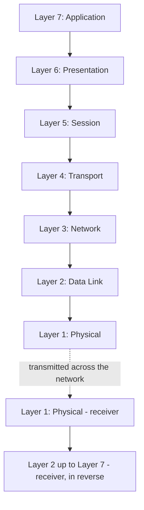

# The OSI Model

> Part of [Phase 07 — Computer Networks](./README.md)

---

## What is it?

The OSI (Open Systems Interconnection) Model is a **conceptual framework** dividing network communication into **seven distinct layers**, each responsible for a specific, well-defined job — from raw electrical signals at the bottom, up to the actual application data at the top.

## Why do we need it?

Networking involves an enormous number of concerns simultaneously: physical signal transmission, addressing, reliability, routing, and application-level meaning. Trying to solve all of these at once, in one giant undifferentiated system, would be unmanageable. The OSI model gives us a shared VOCABULARY and mental structure for reasoning about networking — letting us discuss "layer 3 problems" (routing) separately from "layer 7 problems" (application logic), even if real-world protocols don't always cleanly separate this way.

## Real-world analogy

Think of the OSI model like the process of mailing a letter through a postal system. You (the Application layer) write a letter. It gets put in an envelope with an address (Network layer). It's carried by a specific truck route (Data Link layer) over actual roads (Physical layer). At no point does the truck driver need to understand the LETTER's content — they only care about the envelope's address. Each "layer" of the postal system does its job independently, trusting the layers around it to do theirs.

```text
Layer 7 (Application): "Dear Alice, ..."          <- the actual message
Layer 3 (Network):      "To: 123 Main St"          <- addressing
Layer 2 (Data Link):    "Via Truck Route 5"         <- local delivery mechanism
Layer 1 (Physical):     the actual road and truck   <- physical transmission
```

## Historical background

- The OSI Model was developed by the **International Organization for Standardization (ISO)**, with a draft published in **1978** and the formal standard finalized in **1984**, as an attempt to create a universal, vendor-neutral standard for network communication.
- Notably, the OSI model was designed to be an ACTUAL protocol suite competing with the already-emerging TCP/IP — but by the time OSI's full protocol suite was ready, **TCP/IP had already become the de facto standard** (helped enormously by its adoption on ARPANET and early Unix systems).
- The OSI model SURVIVED, not as an implemented protocol suite, but as an enormously influential CONCEPTUAL teaching and reference framework — which is precisely how it's used today, including throughout the rest of this phase.

## Mathematical foundation

**Level 1 — Explain it to a 15-year-old:**

Imagine building a giant machine as a team, where each person only worries about ONE specific job — one person handles wiring, another handles the on/off switch, another handles the display screen — and none of them need to fully understand what the others are doing, as long as everyone agrees on how to pass their work along to the next person. The OSI model organizes networking exactly this way: seven "jobs," each handled by a different layer.

**Level 2 — Engineering Level:**

Each OSI layer communicates ONLY with the layer directly above and below it, through a well-defined INTERFACE, and adds its own header (metadata) to the data as it passes DOWN the stack on the sending side — a process called **encapsulation**. On the receiving side, each layer strips off (and acts on) its corresponding header as data moves back UP the stack — **decapsulation**.

**Level 3 — Industry Level:**

Real-world networking professionals use OSI layer TERMINOLOGY constantly, even when the actual protocols in use are TCP/IP-based (which doesn't map perfectly onto all 7 OSI layers) — phrases like "Layer 2 switch," "Layer 3 routing," and "Layer 7 firewall" are industry-standard shorthand, DIRECTLY inherited from the OSI model, for describing which part of the stack a piece of hardware or software operates on.

**Level 4 — Research Level:**

Research and ongoing debate in network architecture continues to explore whether strict layering (as OSI idealizes) is always the right design, versus "cross-layer" designs that deliberately share information between layers for performance gains (common in wireless and mobile network research) — a genuine, unresolved tension between clean abstraction and practical optimization.

## Formal definition

The OSI Model defines seven layers, each providing services to the layer above and using services from the layer below, communicating via well-defined **Protocol Data Units (PDUs)** at each layer (e.g., "segments" at the Transport layer, "packets" at the Network layer, "frames" at the Data Link layer).

## Core concepts

- **Layer 1 — Physical** — raw bit transmission over a physical medium (cables, radio waves, voltages)
- **Layer 2 — Data Link** — reliable transmission between DIRECTLY connected devices, using MAC addresses (see [`Switching.md`](./Switching.md))
- **Layer 3 — Network** — addressing and ROUTING across multiple interconnected networks, using IP addresses (see [`Routing.md`](./Routing.md))
- **Layer 4 — Transport** — end-to-end reliability, ordering, and flow control (TCP) or fast, unreliable delivery (UDP) — see [`TCP-IP.md`](./TCP-IP.md)
- **Layer 5 — Session** — establishing, managing, and terminating communication sessions between applications
- **Layer 6 — Presentation** — data format translation, encryption/decryption, compression
- **Layer 7 — Application** — the actual protocols applications use directly (HTTP, DNS, etc.)
- **Encapsulation / Decapsulation** — the process of wrapping data with layer-specific headers on send, and unwrapping on receive

## Internal working

As data descends the OSI stack on the SENDING side, each layer wraps the data it receives from the layer above with its OWN header (and sometimes trailer) — the Transport layer adds port numbers, the Network layer adds IP addresses, the Data Link layer adds MAC addresses — resulting in a fully "encapsulated" unit ready for physical transmission. The RECEIVING side reverses this process exactly, each layer reading and stripping off its corresponding header before passing the remainder up to the next layer.

## Step-by-step explanation

**How data travels down and up the OSI stack, step by step, when Alice's browser sends an HTTP request to a server:**

1. **Application (L7):** Alice's browser constructs an HTTP request.
2. **Presentation (L6):** if needed, data is encoded/encrypted (e.g., TLS for HTTPS — see [`HTTPS.md`](./HTTPS.md)).
3. **Session (L5):** a logical session between browser and server is tracked.
4. **Transport (L4):** TCP adds a header with source/destination PORT numbers, sequence numbers for ordering, forming a "segment."
5. **Network (L3):** IP adds a header with source/destination IP ADDRESSES, forming a "packet."
6. **Data Link (L2):** the packet is wrapped with source/destination MAC ADDRESSES for the next physical hop, forming a "frame."
7. **Physical (L1):** the frame is converted into actual electrical signals, light pulses, or radio waves and transmitted.
8. At the receiving end (and at every intermediate router/switch), this process runs in REVERSE, layer by layer, up to whatever layer that device needs to process (a switch only needs Layer 2; a router needs Layer 3; the final destination server processes all the way up to Layer 7).

## Visual diagram



## Architecture diagram

```text
Encapsulation as data descends the stack (sending side):

L7 Data:                              [ HTTP Request Data ]
L4 adds header:            [TCP Header][ HTTP Request Data ]
L3 adds header:   [IP Header][TCP Header][ HTTP Request Data ]
L2 adds header/trailer: [MAC Header][IP Header][TCP Header][ HTTP Data ][MAC Trailer]
L1: converted to raw electrical/optical/radio signal for transmission

Each layer only "understands" and touches ITS OWN header -
this is the essence of the OSI model's layered isolation.
```

## Flowchart

```mermaid
flowchart LR
    Start([Application generates data]) --> L4[Transport: add port info, segment data]
    L4 --> L3[Network: add IP addresses, form packet]
    L3 --> L2[Data Link: add MAC addresses, form frame]
    L2 --> L1[Physical: transmit as raw signal]
    L1 --> Network([Travels across physical medium])
    Network --> L1r[Physical: receive raw signal]
    L1r --> L2r[Data Link: strip MAC header]
    L2r --> L3r[Network: strip IP header, or forward if this is a router]
    L3r --> L4r[Transport: strip TCP/UDP header]
    L4r --> AppR([Application: process actual data])
```



## Example

Trace which OSI layer is responsible for a series of realistic actions:

```
"The browser knows to send data to port 443"          -> Layer 4 (Transport)
"A router decides which next network to forward
 the packet to"                                          -> Layer 3 (Network)
"An ethernet switch forwards a frame based on
 a MAC address"                                           -> Layer 2 (Data Link)
"An HTTP GET request is formatted"                        -> Layer 7 (Application)
"Data is encrypted before being sent (TLS)"                -> Layer 6 (Presentation)
 (in practice, TLS spans Layers 4-6 conceptually,
  showing real protocols don't always fit neatly into ONE layer)
"Voltage levels represent 1s and 0s on a copper wire"       -> Layer 1 (Physical)
```

## Dry run

Trace a packet's journey through OSI layers at each network "hop":

| Location            | Layers Actually Processed                      |
| ------------------- | ---------------------------------------------- |
| Sending computer    | All 7 layers (Application down to Physical)    |
| Intermediate switch | Layers 1–2 only (Physical, Data Link)          |
| Intermediate router | Layers 1–3 only (Physical, Data Link, Network) |
| Receiving computer  | All 7 layers (Physical up to Application)      |

This table is a critical, frequently-tested insight: **intermediate devices only process as many layers as they NEED to do their job** — a switch never looks at IP addresses; a router never looks at TCP ports or HTTP content (unless it's a specialized "Layer 7" device, like some firewalls/load balancers).

## Multiple examples

**Example 1 — A "Layer 2 switch"** operates purely using MAC addresses (Data Link layer), completely unaware of IP addresses or application data.

**Example 2 — A "Layer 3 switch"** (a hybrid device) can ALSO make basic IP-based (Network layer) forwarding decisions, blurring the line between a traditional switch and router.

**Example 3 — A "Layer 7 load balancer"** inspects actual HTTP request content (URLs, headers) to make routing decisions — operating all the way up at the Application layer, unlike a simpler Layer 4 load balancer that only looks at IP/port information.

## Advantages

- Provides a universal, standardized VOCABULARY for discussing networking concepts, hardware, and problems.
- Encourages modular design — each layer can be understood, implemented, and even replaced somewhat independently.
- Excellent as a TEACHING and diagnostic framework ("is this a Layer 2 or Layer 3 problem?") even when real protocols don't map perfectly onto it.

## Disadvantages

- The OSI model itself was never widely adopted as an ACTUAL protocol suite — TCP/IP won that competition.
- Real protocols often don't cleanly fit into exactly one OSI layer (TLS spans several conceptually; some protocols combine session/presentation/application functions).
- Strict layering can sometimes prevent performance optimizations that would require "peeking" across layers (a genuine, ongoing design tension).

## Complexity

_(The OSI model is a conceptual framework, not an algorithm — "complexity" here refers to conceptual mapping, not computational complexity.)_

| Layer             | Real-World Protocol Examples                                                |
| ----------------- | --------------------------------------------------------------------------- |
| Application (L7)  | HTTP, DNS, FTP, SMTP                                                        |
| Presentation (L6) | TLS/SSL encryption, data compression                                        |
| Session (L5)      | Session establishment (often merged into Transport/Application in practice) |
| Transport (L4)    | TCP, UDP                                                                    |
| Network (L3)      | IP, ICMP                                                                    |
| Data Link (L2)    | Ethernet, WiFi (802.11), ARP                                                |
| Physical (L1)     | Ethernet cables, fiber optics, radio frequencies                            |

## Memory usage

_(Not directly applicable — a conceptual framework.)_ However, each layer's ADDED header (during encapsulation) does consume real bandwidth/overhead — this cumulative header overhead is a genuine, measurable cost in real network communication, especially for many small packets.

## Time complexity

_(Not directly applicable in the algorithmic sense.)_ The practical performance implication is that EACH layer of processing (encapsulation/decapsulation) adds some latency — this is part of why "Layer 7" devices (inspecting full application content) are generally slower than simpler "Layer 2/3" devices that only look at lower-layer headers.

## Best practices

- Use OSI layer terminology precisely when discussing or diagnosing network issues — it dramatically improves communication clarity with other engineers.
- When troubleshooting connectivity issues, work through the layers systematically (physical link up? IP address correct? port reachable? application responding correctly?) rather than guessing randomly.
- Understand that the REAL internet runs on TCP/IP (see [`TCP-IP.md`](./TCP-IP.md)), and use the OSI model as a complementary CONCEPTUAL reference, not a literal implementation description.

## Common mistakes

- Assuming the OSI model IS how the internet actually works — the internet runs on TCP/IP, which has a simpler, 4-layer model that doesn't map perfectly onto OSI's 7 layers.
- Forgetting that intermediate devices (switches, routers) only process the layers relevant to their job, not the full stack.
- Trying to force every real protocol into exactly ONE OSI layer, when many (like TLS) genuinely span or blur multiple layers.

## Interview questions

1. Name and briefly describe the seven OSI layers.
2. What is encapsulation, and how does it relate to the OSI model?
3. Why do switches only need to process up to Layer 2, while routers need Layer 3?
4. How does the OSI model relate to (and differ from) the TCP/IP model?
5. Which OSI layer is responsible for reliable, ordered delivery, and which protocol implements it?

## University questions

1. Draw and label the seven OSI layers with an example protocol for each.
2. Explain the encapsulation and decapsulation process as data moves through the OSI stack.
3. Compare the OSI model's 7 layers to the TCP/IP model's 4 layers.
4. Explain why the OSI model, despite not being widely adopted as an actual protocol suite, remains an important teaching tool.

## Coding examples

_(The OSI model is conceptual; the "coding examples" here illustrate encapsulation/decapsulation logic.)_

### Pseudocode

```text
FUNCTION encapsulate(applicationData):
    transportSegment = addTransportHeader(applicationData, sourcePort, destPort)
    networkPacket = addNetworkHeader(transportSegment, sourceIP, destIP)
    dataLinkFrame = addDataLinkHeader(networkPacket, sourceMAC, destMAC)
    RETURN transmitAsPhysicalSignal(dataLinkFrame)

FUNCTION decapsulate(physicalSignal):
    dataLinkFrame = receiveFromPhysical(physicalSignal)
    networkPacket = stripDataLinkHeader(dataLinkFrame)
    transportSegment = stripNetworkHeader(networkPacket)
    applicationData = stripTransportHeader(transportSegment)
    RETURN applicationData
```

### Python implementation

```python
def encapsulate(app_data, src_port, dst_port, src_ip, dst_ip, src_mac, dst_mac):
    transport_segment = {"src_port": src_port, "dst_port": dst_port, "payload": app_data}
    network_packet = {"src_ip": src_ip, "dst_ip": dst_ip, "payload": transport_segment}
    data_link_frame = {"src_mac": src_mac, "dst_mac": dst_mac, "payload": network_packet}
    return data_link_frame

def decapsulate(frame):
    packet = frame["payload"]
    segment = packet["payload"]
    app_data = segment["payload"]
    return app_data

frame = encapsulate("GET /index.html", 51000, 80, "192.168.1.5", "93.184.216.34",
                     "AA:BB:CC:DD:EE:FF", "11:22:33:44:55:66")
print(frame)
print("Decapsulated:", decapsulate(frame))  # GET /index.html
```

### C implementation

```c
#include <stdio.h>
#include <string.h>

struct Frame {
    char srcMac[18], dstMac[18];
    struct {
        char srcIp[16], dstIp[16];
        struct {
            int srcPort, dstPort;
            char payload[256];
        } segment;
    } packet;
};

void encapsulate(struct Frame* f, const char* data) {
    strcpy(f->srcMac, "AA:BB:CC:DD:EE:FF");
    strcpy(f->dstMac, "11:22:33:44:55:66");
    strcpy(f->packet.srcIp, "192.168.1.5");
    strcpy(f->packet.dstIp, "93.184.216.34");
    f->packet.segment.srcPort = 51000;
    f->packet.segment.dstPort = 80;
    strcpy(f->packet.segment.payload, data);
}

int main() {
    struct Frame f;
    encapsulate(&f, "GET /index.html");
    printf("Decapsulated payload: %s\n", f.packet.segment.payload);
    return 0;
}
```

### C++ implementation

```cpp
#include <iostream>
#include <string>
using namespace std;

struct TransportSegment { int srcPort, dstPort; string payload; };
struct NetworkPacket { string srcIp, dstIp; TransportSegment segment; };
struct DataLinkFrame { string srcMac, dstMac; NetworkPacket packet; };

DataLinkFrame encapsulate(const string& data) {
    TransportSegment seg{51000, 80, data};
    NetworkPacket pkt{"192.168.1.5", "93.184.216.34", seg};
    DataLinkFrame frame{"AA:BB:CC:DD:EE:FF", "11:22:33:44:55:66", pkt};
    return frame;
}

int main() {
    DataLinkFrame frame = encapsulate("GET /index.html");
    cout << "Decapsulated payload: " << frame.packet.segment.payload << endl;
}
```

### Java implementation

```java
import java.util.*;

public class OSIModelDemo {
    static Map<String, Object> encapsulate(String appData) {
        Map<String, Object> segment = new HashMap<>();
        segment.put("srcPort", 51000);
        segment.put("dstPort", 80);
        segment.put("payload", appData);

        Map<String, Object> packet = new HashMap<>();
        packet.put("srcIp", "192.168.1.5");
        packet.put("dstIp", "93.184.216.34");
        packet.put("payload", segment);

        Map<String, Object> frame = new HashMap<>();
        frame.put("srcMac", "AA:BB:CC:DD:EE:FF");
        frame.put("dstMac", "11:22:33:44:55:66");
        frame.put("payload", packet);
        return frame;
    }

    public static void main(String[] args) {
        Map<String, Object> frame = encapsulate("GET /index.html");
        Map<String, Object> packet = (Map<String, Object>) frame.get("payload");
        Map<String, Object> segment = (Map<String, Object>) packet.get("payload");
        System.out.println("Decapsulated payload: " + segment.get("payload"));
    }
}
```

## Visualization

```text
Which layers does each device process?

              L7 L6 L5 L4 L3 L2 L1
Sender PC:    X  X  X  X  X  X  X
Switch:       .  .  .  .  .  X  X
Router:       .  .  .  .  X  X  X
Receiver PC:  X  X  X  X  X  X  X

(X = processed, . = not touched)
```

## Industry use

- **Networking hardware classification**: switches, routers, load balancers, and firewalls are routinely described by which OSI layer they primarily operate at.
- **Troubleshooting methodology**: network engineers systematically work "up the stack" (check physical link, then IP connectivity, then port/service availability, then application behavior) when diagnosing issues.
- **Job interviews and certifications** (CompTIA Network+, Cisco CCNA): OSI model knowledge is explicitly tested as foundational networking literacy.

## Research relevance

Ongoing research and engineering debate around **cross-layer design** (particularly in wireless and mobile networking) explores when and how deliberately violating strict OSI layering can improve performance — directly relevant to modern 5G network design and battery-constrained IoT devices, where layer isolation's overhead can be a genuine cost worth optimizing away.

## Related concepts

- TCP/IP (the actual protocol suite used in practice — see [`TCP-IP.md`](./TCP-IP.md))
- Switching and Routing (Layer 2 and Layer 3 concepts respectively — see [`Switching.md`](./Switching.md) and [`Routing.md`](./Routing.md))
- HTTPS (spans Presentation-layer encryption concepts — see [`HTTPS.md`](./HTTPS.md))

## Practice problems

1. For a list of given real-world networking scenarios, identify the primary OSI layer involved.
2. Explain, step by step, the encapsulation process for a DNS query (UDP-based) traveling from a client to a DNS server.
3. Compare a "Layer 4 load balancer" and a "Layer 7 load balancer" in terms of what information each can use for routing decisions.
4. Explain why TLS is sometimes described as spanning multiple OSI layers rather than fitting cleanly into just Layer 6.

## Advanced concepts

- **The TCP/IP Model** — a simpler, 4-layer model (Link, Internet, Transport, Application) that more accurately reflects how the real internet is actually built and often used as a practical alternative to OSI's 7 layers.
- **Cross-Layer Design** — deliberately allowing information sharing between non-adjacent layers for performance optimization, common in wireless network research.
- **Middleboxes** — devices like NAT gateways, firewalls, and proxies that inspect or modify traffic at layers beyond their "official" classification, complicating strict layering in real deployments.

## Summary

The OSI Model provides a conceptual, 7-layer framework for understanding network communication — from raw physical signals up to application data — even though the real internet runs on the related but distinct TCP/IP suite. Its lasting value is as a shared vocabulary and diagnostic framework, letting engineers precisely describe which "layer" of the stack a given protocol, device, or problem belongs to.

## Key takeaways

- The seven OSI layers, bottom to top: Physical, Data Link, Network, Transport, Session, Presentation, Application.
- Encapsulation adds a header at each layer going down the stack; decapsulation strips it going up.
- Intermediate devices (switches, routers) only process the layers relevant to their function — not the full stack.
- The OSI model was never adopted as an actual protocol suite (TCP/IP won that role), but remains hugely influential as a teaching and diagnostic tool.

## References

- ISO/IEC 7498-1 (the OSI Reference Model standard).
- Tanenbaum, A., Wetherall, D. _Computer Networks_, Chapter 1.
- Kurose, J., Ross, K. _Computer Networking: A Top-Down Approach_, Chapter 1.

---

⬅ Back to [Phase 07 — Computer Networks README](./README.md)
