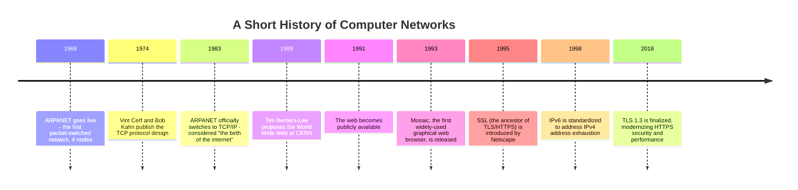
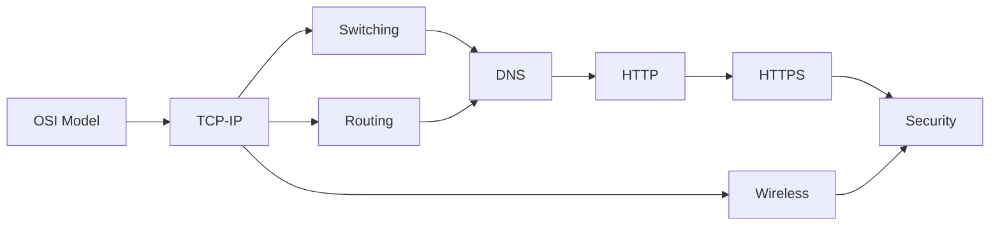

# Phase 07 — Computer Networks

> "The internet is not one machine, or even one network — it's millions of independent networks that all agreed, decades ago, to speak the same small set of languages to each other." — a professor's honest confession, day one of Computer Networks.

This is **Phase 7** of the `msc-computer-science` repository. Where Phase 6 (Database Management Systems) taught how a single system stores and retrieves data reliably, Phase 7 teaches how data **travels** — from one machine, across cables, radio waves, routers, and continents, to another machine, arriving intact, in order, and (increasingly) securely, in a matter of milliseconds.

---

## Table of Contents

- [Introduction](#introduction)
- [Why This Subject Exists](#why-this-subject-exists)
- [Historical Background](#historical-background)
- [Importance](#importance)
- [Applications](#applications)
- [Industries Using It](#industries-using-it)
- [Career Relevance](#career-relevance)
- [Prerequisites](#prerequisites)
- [Roadmap](#roadmap)
- [Complete Syllabus](#complete-syllabus)
- [Learning Objectives](#learning-objectives)
- [How This Connects to Previous Phases](#how-this-connects-to-previous-phases)
- [How This Connects to Later Phases](#how-this-connects-to-later-phases)
- [Recommended Study Order](#recommended-study-order)
- [Estimated Study Time](#estimated-study-time)
- [Books](#books)
- [Research Papers](#research-papers)
- [Reference Websites](#reference-websites)
- [Practice Resources](#practice-resources)
- [Projects](#projects)
- [Interview Importance](#interview-importance)
- [University Exam Importance](#university-exam-importance)
- [Common Mistakes](#common-mistakes)
- [Cheat Sheet](#cheat-sheet)
- [Summary](#summary)
- [Next Steps](#next-steps)

---

## Introduction

Every time you load a webpage, send a message, or stream a video, an extraordinary amount of coordinated engineering happens in milliseconds: your device's request is broken into small pieces, addressed, routed through a chain of intermediate machines it has never met, reassembled correctly at the destination — and, for anything sensitive, encrypted so no one along the way can read or tamper with it. None of this coordination is centrally controlled. It works because every participating device agrees to follow the same **layered set of protocols** — the subject of this entire phase.

This phase covers ten files:

| File           | Topic             | One-line description                                          |
| -------------- | ----------------- | ------------------------------------------------------------- |
| `README.md`    | Phase overview    | This file                                                     |
| `OSI-Model.md` | The OSI Model     | The conceptual 7-layer framework for understanding networking |
| `TCP-IP.md`    | TCP/IP            | The actual protocol suite the real internet runs on           |
| `Switching.md` | Switching         | How data moves within a local network, link by link           |
| `Routing.md`   | Routing           | How data finds its way across many interconnected networks    |
| `DNS.md`       | DNS               | The internet's "phone book," translating names to addresses   |
| `HTTP.md`      | HTTP              | The application-layer protocol underlying the web             |
| `HTTPS.md`     | HTTPS             | HTTP, secured with encryption and authentication              |
| `Wireless.md`  | Wireless Networks | How networking works without physical cables                  |
| `Security.md`  | Network Security  | Threats, defenses, and cryptography applied to networks       |

---

## Why This Subject Exists

No single network could ever span the entire globe alone — the internet is fundamentally a **network of networks**, owned and operated by thousands of independent organizations, that only functions because everyone agrees to speak the same layered protocols. Computer Networks exists to study exactly these protocols: how they're designed, why they're layered, and how they achieve reliable, addressable, and (with modern additions) secure communication across infrastructure no single party fully controls.

---

## Historical Background

Notice the pattern: the internet's foundational protocols (TCP/IP, 1974/1983) were designed to be simple, robust, and decentralized specifically because no single organization could be trusted to control the whole network — a design philosophy that remains the reason the internet has scaled from 4 machines to billions without a fundamental redesign.

---

## Importance

Computer Networks matter because they determine:

1. **Reachability** — whether any two devices, anywhere on Earth, can actually exchange data.
2. **Reliability** — whether data arrives complete, in order, and uncorrupted despite unreliable underlying hardware and links.
3. **Performance** — the difference between a webpage loading instantly or timing out.
4. **Security** — whether your data can be intercepted, read, or tampered with while in transit.

---

## Applications

| Networking Concept | Real Application                                                             |
| ------------------ | ---------------------------------------------------------------------------- |
| OSI Model / TCP-IP | The conceptual and practical foundation for all internet communication       |
| Switching          | Local area networks (offices, homes, data centers)                           |
| Routing            | Connecting separate networks together — the literal backbone of the internet |
| DNS                | Every time you type a website name instead of a raw IP address               |
| HTTP/HTTPS         | Every web page, API call, and web app you've ever used                       |
| Wireless           | WiFi, mobile data (4G/5G), Bluetooth                                         |
| Security           | VPNs, firewalls, encrypted messaging, secure banking                         |

---

## Industries Using It

- **Internet Service Providers (ISPs) and telecom companies** — build and operate the physical routing/switching infrastructure of the internet.
- **Cloud providers** (AWS, Google Cloud, Azure) — design massive internal data center networks and global content delivery networks.
- **Cybersecurity** — network security is a dedicated, high-demand specialization built directly on this phase.
- **Every software company** — nearly all modern software communicates over a network at some point (APIs, databases, microservices).

---

## Career Relevance

| Role                                     | Networking Relevance                                                                                                                           |
| ---------------------------------------- | ---------------------------------------------------------------------------------------------------------------------------------------------- |
| Backend/Full-Stack Engineer              | HTTP, DNS, and basic TCP/IP knowledge are constantly used                                                                                      |
| Network Engineer                         | Deep, specialized expertise in routing, switching, and network hardware                                                                        |
| Site Reliability Engineer (SRE) / DevOps | Diagnosing network issues (latency, DNS failures, TLS errors) is a core skill                                                                  |
| Security Engineer                        | Network security, encryption, and attack/defense techniques are foundational                                                                   |
| Interview Candidate                      | "Explain what happens when you type a URL into a browser" is one of the most common systems interview questions — this ENTIRE phase answers it |

---

## Prerequisites

- Phase 2 (Data Structures and Algorithms) — graphs directly model network topology; routing algorithms are graph algorithms.
- Phase 5 (Operating Systems) — sockets and processes are the OS-level interface to networking.
- Phase 6 (Database Management Systems) — helpful context, though not strictly required.

---

## Roadmap

---

## Complete Syllabus

1. **OSI Model** — the 7-layer conceptual framework, encapsulation, and its relationship to real protocols
2. **TCP/IP** — the actual internet protocol suite, TCP vs. UDP, the three-way handshake, IP addressing
3. **Switching** — MAC addresses, switches, VLANs, the Spanning Tree Protocol
4. **Routing** — IP routing, routing tables, distance-vector and link-state algorithms
5. **DNS** — the domain name hierarchy, resolution process, record types
6. **HTTP** — requests/responses, methods, status codes, statelessness, cookies
7. **HTTPS** — TLS/SSL, the TLS handshake, certificates, public-key infrastructure
8. **Wireless Networks** — WiFi (802.11), cellular networks, wireless-specific challenges
9. **Network Security** — common attacks, firewalls, VPNs, encryption fundamentals applied to networking

---

## Learning Objectives

By the end of this phase, you will be able to:

- Explain the OSI model's seven layers and map real protocols to each layer.
- Explain the difference between TCP and UDP, and when to use each.
- Trace exactly what happens, network-wise, when you type a URL into a browser and press Enter.
- Explain how routers decide where to forward a packet, and how routing tables are built.
- Explain how DNS resolves a domain name into an IP address.
- Read and construct HTTP requests and responses, and explain common status codes.
- Explain how HTTPS establishes a secure, authenticated, encrypted connection.
- Explain common network attacks (DoS, MITM, spoofing) and their standard defenses.

---

## How This Connects to Previous Phases

- **Phase 2 (DSA)**: routing algorithms (Dijkstra's, distance-vector) are direct applications of graph algorithms; routing tables use tree/hash structures for fast lookup.
- **Phase 5 (Operating Systems)**: sockets, the OS abstraction for network communication, are built on process/file abstractions; network I/O interacts directly with process scheduling and blocking I/O concepts.
- **Phase 6 (DBMS)**: distributed databases and replication rely directly on network communication and its associated failure modes (partitions, latency).
- **Phase 1 (Mathematics)**: cryptography (used throughout HTTPS and Security) is built on number theory and probability.

## How This Connects to Later Phases

- **Distributed Systems** — directly extends this phase's networking foundation into consensus, replication, and fault tolerance across networked machines.
- **Cybersecurity** (deeper dive) — this phase's Security chapter is a foundation; dedicated security phases go far deeper into cryptography and attack techniques.
- **Cloud Computing** — cloud networking (VPCs, load balancers, CDNs) is a direct, large-scale application of this phase's concepts.

---

## Recommended Study Order

1. OSI Model (the conceptual map for everything that follows)
2. TCP/IP (the real protocols implementing that map)
3. Switching → Routing (how data actually physically moves, locally then globally)
4. DNS (how destinations are found by name)
5. HTTP → HTTPS (the application layer most people interact with daily, then its secured version)
6. Wireless (a specialized, increasingly dominant physical/link layer)
7. Security (capstone — synthesizing attacks and defenses across everything above)

---

## Estimated Study Time

| Topic     | Beginner Pace | Fast Pace      |
| --------- | ------------- | -------------- |
| OSI Model | 3 days        | 1 day          |
| TCP/IP    | 1.5 weeks     | 3 days         |
| Switching | 4 days        | 1 day          |
| Routing   | 1 week        | 2 days         |
| DNS       | 3 days        | 1 day          |
| HTTP      | 1 week        | 2 days         |
| HTTPS     | 1 week        | 2 days         |
| Wireless  | 4 days        | 1 day          |
| Security  | 1.5 weeks     | 3 days         |
| **Total** | **~8 weeks**  | **~2.5 weeks** |

---

## Books

- _Computer Networking: A Top-Down Approach_ — Kurose & Ross
- _Computer Networks_ — Andrew Tanenbaum
- _TCP/IP Illustrated, Volume 1_ — W. Richard Stevens
- _High Performance Browser Networking_ — Ilya Grigorik (free online)

## Research Papers

- Cerf, V., Kahn, R. (1974). _A Protocol for Packet Network Intercommunication_ (the original TCP design).
- Postel, J. (1981). _RFC 791 — Internet Protocol_.
- Berners-Lee, T. et al. (1996). _RFC 1945 — Hypertext Transfer Protocol (HTTP/1.0)_.
- Rescorla, E. (2018). _RFC 8446 — The Transport Layer Security (TLS) Protocol Version 1.3_.

## Reference Websites

- [Kurose & Ross companion site](https://gaia.cs.umass.edu/kurose_ross/)
- [MDN Web Docs — HTTP](https://developer.mozilla.org/en-US/docs/Web/HTTP)
- [Cloudflare Learning Center](https://www.cloudflare.com/learning/)
- [High Performance Browser Networking (free book)](https://hpbn.co)

## Practice Resources

- GATE previous year papers (Computer Networks section)
- Wireshark (free packet capture/analysis tool) for hands-on protocol inspection
- `curl -v` and browser DevTools' Network tab for observing real HTTP/HTTPS traffic

## Projects

1. Use Wireshark to capture and analyze the TCP three-way handshake and a full HTTP request/response cycle.
2. Build a simple TCP client-server chat application using sockets.
3. Implement a basic DNS resolver that manually performs iterative queries.
4. Set up a local HTTPS server with a self-signed certificate and inspect the TLS handshake.
5. Simulate a distance-vector routing algorithm (Bellman-Ford-based) on a small sample network.

## Interview Importance

⭐⭐⭐⭐☆ (High)

"What happens when you type a URL into a browser?" is one of the most iconic systems design interview questions, directly testing this entire phase's material.

## University Exam Importance

⭐⭐⭐⭐⭐ (Very High)

Computer Networks is a core, heavily-weighted subject in every BSc/MSc Computer Science curriculum, and a major, consistently-tested component of GATE and UGC NET.

## Common Mistakes

- Confusing the OSI model's LAYERS with real protocols — the OSI model is a CONCEPTUAL framework; TCP/IP is the ACTUAL suite used in practice, and doesn't map perfectly onto all 7 OSI layers.
- Treating TCP and UDP as interchangeable — their reliability/ordering guarantees (or lack thereof) make them suited for very different applications.
- Assuming HTTPS "encryption" alone means a connection is fully trustworthy — certificate validation (confirming WHO you're actually talking to) is equally essential.
- Forgetting that DNS results are cached at multiple layers, which can cause confusing, delayed propagation of DNS changes.

## Cheat Sheet

| Concept     | One-Line Meaning                                                                                          |
| ----------- | --------------------------------------------------------------------------------------------------------- |
| OSI Model   | 7-layer conceptual framework: Physical, Data Link, Network, Transport, Session, Presentation, Application |
| TCP         | Reliable, ordered, connection-oriented transport protocol                                                 |
| UDP         | Fast, unreliable, connectionless transport protocol                                                       |
| IP Address  | A unique numerical address identifying a device on a network                                              |
| MAC Address | A unique hardware address identifying a device on a LOCAL network                                         |
| DNS         | Translates human-readable domain names into IP addresses                                                  |
| HTTP        | The application-layer protocol for transferring web content                                               |
| TLS/SSL     | The cryptographic protocol securing HTTPS connections                                                     |
| Router      | A device that forwards packets between different networks                                                 |
| Switch      | A device that forwards frames within the same local network                                               |

## Summary

Computer Networks teaches how data physically and logically travels across the internet's layered protocol stack — from local switching, to global routing, to name resolution, to the application-layer protocols (HTTP/HTTPS) that power the web, secured by cryptography and defended against a wide range of real-world attacks.

## Next Steps

Proceed in this order:

1. [`OSI-Model.md`](./OSI-Model.md)
2. [`TCP-IP.md`](./TCP-IP.md)
3. [`Switching.md`](./Switching.md)
4. [`Routing.md`](./Routing.md)
5. [`DNS.md`](./DNS.md)
6. [`HTTP.md`](./HTTP.md)
7. [`HTTPS.md`](./HTTPS.md)
8. [`Wireless.md`](./Wireless.md)
9. [`Security.md`](./Security.md)

After finishing this phase, proceed to **Phase 8 — (next phase in your roadmap, e.g., Distributed Systems, Software Engineering, or Computer Architecture)**.
