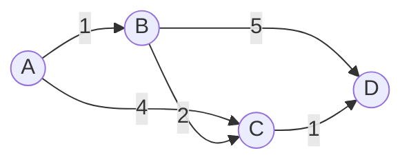
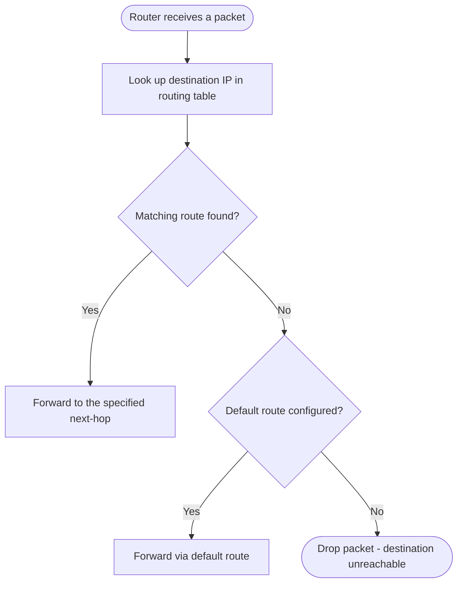

# Routing

> Part of [Phase 07 — Computer Networks](./README.md)

---

## What is it?

Routing is the process of determining the best PATH for a packet to travel **across multiple interconnected networks**, based on its destination IP address — the Network-layer counterpart to switching's local, MAC-address-based forwarding.

## Why do we need it?

Switching (see [`Switching.md`](./Switching.md)) only works WITHIN a single local network. The internet is a vast, decentralized "network of networks," and getting a packet from a device in Mumbai to a server in California requires passing through many independently-operated networks, each making its OWN forwarding decision. Routing is the set of algorithms and protocols that let this happen automatically, adaptively, and (mostly) efficiently, despite no single entity controlling the whole path.

## Real-world analogy

Think of routing like a road trip planned by consulting a chain of local tour guides, each of whom only knows their OWN city well. You ask the first guide "how do I get to California?" — they don't know the whole route, but they know "head toward the highway, then ask the next guide." Each guide passes you a little closer, using their LOCAL knowledge, until you reach the destination — no single guide ever needed the complete global map.

```text
Packet destined for a server in California, starting in Mumbai:
Home Router -> ISP Router -> Regional Router -> ... -> Destination's ISP -> Destination Server

Each router only decides "which NEXT hop gets this packet closer,"
using its own local routing table.
```

## Historical background

- Early routing algorithms were developed alongside ARPANET in the 1970s, using **distance-vector** approaches inspired by the **Bellman-Ford algorithm** (originally developed for general shortest-path problems in the 1950s — see Phase 2, Graphs).
- **Link-state routing** (using an approach based on Dijkstra's algorithm — also from Phase 2) emerged later as an alternative, addressing some of distance-vector routing's slow-convergence and "counting to infinity" problems.
- **Border Gateway Protocol (BGP)**, standardized starting in 1989, became the protocol that connects the internet's many independently-operated networks ("Autonomous Systems") together — effectively the routing protocol that makes the GLOBAL internet, as opposed to individual private networks, actually function.

## Mathematical foundation

**Level 1 — Explain it to a 15-year-old:**

Imagine a big city where every intersection has a small sign showing "if you want to get to the airport, turn left here." No single sign knows the ENTIRE route to the airport — but if EVERY intersection's sign is correct, following them one at a time will always get you there. Routing tables work exactly like this: each router only needs to know the "next turn," not the whole path.

**Level 2 — Engineering Level:**

Routing is formally a **shortest-path problem** on a graph, where routers are NODES and network links are EDGES (often weighted by cost, latency, or hop count). **Distance-vector routing** (Bellman-Ford-based) has each router share its ENTIRE routing table with its direct neighbors periodically, iteratively converging on shortest paths. **Link-state routing** (Dijkstra-based) has each router broadcast information about its DIRECT links to the ENTIRE network, letting every router independently compute the full shortest-path tree.

**Level 3 — Industry Level:**

The real internet uses a TWO-TIER routing approach: **Interior Gateway Protocols** (like OSPF, using link-state routing) manage routing WITHIN a single organization's network (an "Autonomous System"), while **BGP** (Border Gateway Protocol) manages routing BETWEEN different Autonomous Systems — incorporating not just shortest-path logic, but also business/policy considerations (which ISP has a paid peering agreement with which other ISP), making BGP as much a POLICY protocol as a pure shortest-path algorithm.

**Level 4 — Research Level:**

Research into **BGP security** addresses a long-standing, serious real-world vulnerability: because BGP is fundamentally based on TRUST between networks (a network can, technically, falsely announce it has a route to any IP range it wants), "BGP hijacking" incidents have repeatedly caused real-world internet outages and traffic misdirection — driving research and deployment efforts around cryptographic route validation (like RPKI, Resource Public Key Infrastructure) to make BGP announcements verifiable.

## Formal definition

Given a network graph `G = (V, E)` with routers as vertices and links as (possibly weighted) edges, routing computes, for each router, a **routing table** mapping destination network prefixes to the appropriate NEXT-HOP router — effectively a distributed, incremental computation of shortest paths (or policy-influenced paths, in BGP's case) across the entire graph.

## Core concepts

- **Routing Table** — a router's local mapping of destination networks to next-hop routers/interfaces
- **Distance-Vector Routing** — routers share their full routing table with neighbors, iteratively converging (e.g., RIP protocol)
- **Link-State Routing** — routers broadcast their direct link information network-wide, each independently computing shortest paths (e.g., OSPF protocol)
- **Autonomous System (AS)** — a network (or group of networks) under a single administrative control, identified by a unique AS number
- **BGP (Border Gateway Protocol)** — the protocol connecting different Autonomous Systems, incorporating policy alongside path length
- **Hop Count / Metric** — the "cost" associated with a path, used to determine the "best" route

## Internal working

A distance-vector router internally works by maintaining a table of `(destination, cost, next-hop)` triples, periodically exchanging this ENTIRE table with its direct neighbors; upon receiving a neighbor's table, it checks whether reaching any destination VIA that neighbor would be CHEAPER than its current known route, updating its own table if so — this process repeats until no further updates occur (**convergence**).

## Step-by-step explanation

**How distance-vector routing converges, step by step (the core of the Bellman-Ford-based approach):**

1. Each router starts knowing only the cost to its DIRECTLY connected neighbors (cost to itself = 0; unknown destinations = infinity).
2. Each router periodically sends its ENTIRE routing table to each of its direct neighbors.
3. Upon receiving a neighbor's table, a router checks, for EVERY destination: "is `cost_to_neighbor + neighbor's_cost_to_destination` LESS than my current known cost to that destination?"
4. If yes, the router UPDATES its table: new cost = the cheaper value, and the next-hop becomes that neighbor.
5. This process repeats, with updated tables propagating outward, until no router's table changes anymore — the network has CONVERGED on a consistent, shortest-path view.

---

## Worked Example: Distance-Vector Routing Convergence

**Given network** (routers A, B, C, D with link costs):

```
A --1-- B
A --4-- C
B --2-- C
B --5-- D
C --1-- D
```

**Step 1 — Initial routing tables** (each router knows only direct neighbors):

```
Router A: {A:0, B:1, C:4, D:infinity}
Router B: {A:1, B:0, C:2, D:5}
Router C: {A:4, B:2, C:0, D:1}
Router D: {B:5, C:1, D:0, A:infinity}
```

**Step 2 — A receives B's table, checks for improvements:**

```
A's cost to B is 1. B's table says B's cost to C is 2.
Route via B: 1 + 2 = 3, compare to A's current direct cost to C (4).
3 < 4 -> UPDATE! A's new cost to C = 3, next-hop = B (not direct anymore!)

A's cost to B is 1. B's table says B's cost to D is 5.
Route via B: 1 + 5 = 6, compare to A's current cost to D (infinity).
6 < infinity -> UPDATE! A's new cost to D = 6, next-hop = B
```

**Step 3 — A receives C's table (after C has also updated from B), checks again:**

```
A's cost to C is now 3 (from step 2). C's table says C's cost to D is 1.
Route via C: 3 + 1 = 4, compare to A's CURRENT cost to D (6, from step 2).
4 < 6 -> UPDATE AGAIN! A's new cost to D = 4, next-hop = C
```

**Final converged routing table for A:**

```
Destination | Cost | Next-Hop
A           | 0    | -
B           | 1    | B (direct)
C           | 3    | B  (A->B->C = 1+2 = 3, cheaper than direct A->C = 4)
D           | 4    | C  (A->B->C->D = 1+2+1 = 4, cheaper than the earlier A->B->D = 6)
```

**Interpretation:** this iterative process — each router improving its table based on neighbors' REPORTED costs — is exactly how distance-vector routing (used by protocols like RIP) discovers globally shortest paths using only LOCAL, neighbor-to-neighbor information exchange, with NO router ever needing the complete network map.

---

## Visual diagram



## Architecture diagram

```text
Link-State vs Distance-Vector, compared:

DISTANCE-VECTOR (e.g., RIP):
  Each router knows ONLY: "cost to each destination, via which neighbor"
  Shares: ENTIRE routing table, with DIRECT NEIGHBORS only
  Computation: distributed, iterative (Bellman-Ford style)

LINK-STATE (e.g., OSPF):
  Each router knows: the FULL network topology (after broadcast)
  Shares: ONLY its own direct link costs, but to the ENTIRE network
  Computation: each router independently runs Dijkstra's algorithm
               on the full topology it has learned
```

## Flowchart



## Example

Illustrate BGP's POLICY-based routing (distinct from pure shortest-path routing):

```
Scenario: ISP X has two possible paths to reach Network Z:
  Path 1: via ISP Y (a PAID transit provider) - technically shorter
  Path 2: via ISP W (a settlement-free PEERING partner) - technically longer

BUSINESS POLICY consideration: ISP X might prefer Path 2 (via peering
partner W) even though it's technically longer, because peering
is FREE while transit via Y costs money per byte transferred.

This is exactly why BGP is NOT purely a "shortest path" protocol -
real-world business relationships between Autonomous Systems
directly influence routing decisions across the actual internet.
```

## Dry run

Trace a packet's routing table lookups hop by hop:

| Hop | Router                     | Destination Match                 | Next Hop                            |
| --- | -------------------------- | --------------------------------- | ----------------------------------- |
| 1   | Home router                | Default route (no specific match) | ISP router                          |
| 2   | ISP router                 | Matches a broader IP range        | Regional backbone router            |
| 3   | Regional router            | Matches destination's AS via BGP  | Peering router to destination's ISP |
| 4   | Destination's ISP router   | Matches specific subnet           | Destination server's local router   |
| 5   | Destination's local router | Direct match                      | Destination server (delivered)      |

## Multiple examples

**Example 1 — OSPF (link-state) within a company:** a company's internal network uses OSPF so every internal router has a COMPLETE map of the internal network topology, computing optimal internal routes independently via Dijkstra's algorithm.

**Example 2 — BGP between ISPs:** the global internet backbone relies on BGP for different ISPs (Autonomous Systems) to advertise "I can reach these IP ranges" to each other, forming the routing fabric of the actual internet.

**Example 3 — Counting to infinity (a classic distance-vector problem):** if a link fails, distance-vector routers can, in certain topologies, slowly increment their believed cost to a now-unreachable destination through a series of incorrect mutual updates, before finally recognizing it's unreachable — a well-known weakness partially addressed by techniques like "split horizon."

## Advantages

- Enables the internet to function as a genuinely decentralized "network of networks," with no single point of control or failure.
- Distance-vector routing requires minimal per-router computation and memory (only neighbor information).
- Link-state routing converges faster and avoids the "counting to infinity" problem, at the cost of requiring more information per router.

## Disadvantages

- Distance-vector routing can suffer from slow convergence and the "counting to infinity" problem after link failures.
- Link-state routing requires more memory (full topology) and computation (running Dijkstra's algorithm) per router.
- BGP's trust-based design has real, demonstrated security vulnerabilities (BGP hijacking), since any AS can technically announce false routes.

## Complexity

| Algorithm                            | Time Complexity                                     | Information Required         |
| ------------------------------------ | --------------------------------------------------- | ---------------------------- |
| Distance-Vector (Bellman-Ford based) | O(V × E) to converge                                | Only direct neighbor tables  |
| Link-State (Dijkstra based)          | O((V + E) log V) per router, using a min-heap       | Full network topology        |
| BGP path selection                   | Varies — involves both path length AND policy rules | AS-level path advertisements |

## Memory usage

Link-state routing requires each router to store the ENTIRE network topology (all links, not just its own), while distance-vector routing requires only a table of destinations and costs — a genuine memory-vs-convergence-speed trade-off between the two approaches.

## Time complexity

The core practical distinction, worth internalizing: **distance-vector routing (like RIP) is simple and lightweight but converges more slowly and can have correctness issues after failures; link-state routing (like OSPF) converges faster and more reliably but requires more memory and computation per router** — real large-scale networks (and the internet's backbone via BGP) blend and extend these classical approaches with additional policy and security considerations.

## Best practices

- Use link-state protocols (OSPF) within a single organization's network where memory/computation resources support maintaining a full topology view.
- Use distance-vector protocols (RIP) only for very small, simple networks, given their convergence limitations at scale.
- Implement BGP route validation mechanisms (like RPKI) to help defend against BGP hijacking incidents.
- Design network topologies with REDUNDANT paths for fault tolerance, but be aware this requires careful protocol configuration (paralleling Spanning Tree Protocol's role in switched networks).

## Common mistakes

- Confusing distance-vector and link-state routing's INFORMATION SHARING patterns (full table to neighbors only, vs. own links to everyone) — a frequently tested distinction.
- Assuming routing always finds the objectively "shortest" path — BGP explicitly incorporates business POLICY, not just path length.
- Underestimating the real-world security fragility of BGP's trust-based design — BGP hijacking incidents have caused significant real internet outages.
- Forgetting that routing (Layer 3, IP-based, across networks) and switching (Layer 2, MAC-based, within a network) are fundamentally different functions.

## Interview questions

1. What is the difference between distance-vector and link-state routing?
2. Explain the "counting to infinity" problem in distance-vector routing.
3. What is BGP, and why is it described as a policy-based protocol rather than a pure shortest-path protocol?
4. How does a router decide where to forward a packet when it doesn't have an exact match in its routing table?
5. What is BGP hijacking, and why is it possible given BGP's design?

## University questions

1. Given a small network topology and link costs, trace distance-vector routing table convergence at each router.
2. Explain how link-state routing uses Dijkstra's algorithm, and compare it to the distance-vector approach.
3. Describe the role of Autonomous Systems and BGP in connecting the global internet.
4. Explain the "counting to infinity" problem and at least one technique used to mitigate it.

## Coding examples

### Pseudocode

```text
FUNCTION distanceVectorUpdate(router, neighborTable, neighborCost):
    updated = false
    FOR each destination IN neighborTable:
        newCost = neighborCost + neighborTable[destination]
        IF newCost < router.table[destination].cost:
            router.table[destination] = (cost: newCost, nextHop: neighbor)
            updated = true
    RETURN updated
```

### Python implementation

```python
import heapq

def bellman_ford_routing(graph, source):
    # graph: {node: [(neighbor, cost), ...]}
    dist = {node: float('inf') for node in graph}
    dist[source] = 0
    next_hop = {source: None}

    for _ in range(len(graph) - 1):
        for node in graph:
            for neighbor, cost in graph[node]:
                if dist[node] + cost < dist[neighbor]:
                    dist[neighbor] = dist[node] + cost
                    next_hop[neighbor] = node

    return dist, next_hop

graph = {
    'A': [('B', 1), ('C', 4)],
    'B': [('A', 1), ('C', 2), ('D', 5)],
    'C': [('A', 4), ('B', 2), ('D', 1)],
    'D': [('B', 5), ('C', 1)],
}

dist, next_hop = bellman_ford_routing(graph, 'A')
print("Shortest costs from A:", dist)  # {'A':0, 'B':1, 'C':3, 'D':4}
```

### C implementation

```c
#include <stdio.h>
#define INF 999999
#define V 4  // A=0, B=1, C=2, D=3

void bellmanFord(int graph[V][V], int source) {
    int dist[V];
    for (int i = 0; i < V; i++) dist[i] = INF;
    dist[source] = 0;

    for (int i = 0; i < V - 1; i++) {
        for (int u = 0; u < V; u++) {
            for (int v = 0; v < V; v++) {
                if (graph[u][v] != 0 && dist[u] + graph[u][v] < dist[v]) {
                    dist[v] = dist[u] + graph[u][v];
                }
            }
        }
    }

    for (int i = 0; i < V; i++) printf("Distance to node %d: %d\n", i, dist[i]);
}

int main() {
    int graph[V][V] = {
        {0, 1, 4, 0},
        {1, 0, 2, 5},
        {4, 2, 0, 1},
        {0, 5, 1, 0}
    };
    bellmanFord(graph, 0);  // A -> B=1, C=3, D=4
    return 0;
}
```

### C++ implementation

```cpp
#include <iostream>
#include <vector>
#include <map>
#include <limits>
using namespace std;

map<string, int> bellmanFord(map<string, vector<pair<string,int>>>& graph, string source) {
    map<string, int> dist;
    for (auto& [node, _] : graph) dist[node] = numeric_limits<int>::max();
    dist[source] = 0;

    for (int i = 0; i < (int)graph.size() - 1; i++) {
        for (auto& [node, edges] : graph) {
            if (dist[node] == numeric_limits<int>::max()) continue;
            for (auto& [neighbor, cost] : edges) {
                if (dist[node] + cost < dist[neighbor]) {
                    dist[neighbor] = dist[node] + cost;
                }
            }
        }
    }
    return dist;
}

int main() {
    map<string, vector<pair<string,int>>> graph = {
        {"A", {{"B",1},{"C",4}}},
        {"B", {{"A",1},{"C",2},{"D",5}}},
        {"C", {{"A",4},{"B",2},{"D",1}}},
        {"D", {{"B",5},{"C",1}}},
    };

    auto dist = bellmanFord(graph, "A");
    for (auto& [node, d] : dist) cout << "Distance to " << node << ": " << d << endl;
}
```

### Java implementation

```java
import java.util.*;

public class RoutingDemo {
    static Map<String, Integer> bellmanFord(Map<String, List<int[]>> graph, String source,
                                              List<String> nodes, Map<String, Integer> nodeIndex) {
        Map<String, Integer> dist = new HashMap<>();
        for (String node : nodes) dist.put(node, Integer.MAX_VALUE);
        dist.put(source, 0);

        for (int i = 0; i < nodes.size() - 1; i++) {
            for (String node : nodes) {
                if (dist.get(node) == Integer.MAX_VALUE) continue;
                for (int[] edge : graph.getOrDefault(node, List.of())) {
                    String neighbor = nodes.get(edge[0]);
                    int cost = edge[1];
                    if (dist.get(node) + cost < dist.get(neighbor)) {
                        dist.put(neighbor, dist.get(node) + cost);
                    }
                }
            }
        }
        return dist;
    }

    public static void main(String[] args) {
        // Simplified illustrative setup
        List<String> nodes = List.of("A", "B", "C", "D");
        Map<String, Integer> nodeIndex = Map.of("A",0,"B",1,"C",2,"D",3);
        Map<String, List<int[]>> graph = new HashMap<>();
        graph.put("A", List.of(new int[]{1,1}, new int[]{2,4}));
        graph.put("B", List.of(new int[]{0,1}, new int[]{2,2}, new int[]{3,5}));
        graph.put("C", List.of(new int[]{0,4}, new int[]{1,2}, new int[]{3,1}));
        graph.put("D", List.of(new int[]{1,5}, new int[]{2,1}));

        Map<String, Integer> dist = bellmanFord(graph, "A", nodes, nodeIndex);
        System.out.println("Distances from A: " + dist);  // {A=0, B=1, C=3, D=4}
    }
}
```

## Visualization

```text
Distance-vector convergence for router A, over successive rounds:

Round 0 (initial):    A:0  B:1  C:4  D:inf
Round 1 (via B):      A:0  B:1  C:3  D:6
Round 2 (via C, updated): A:0  B:1  C:3  D:4   <- converged

Each round, A's knowledge improves using its neighbors'
reported costs - exactly matching the Worked Example above.
```

## Industry use

- **ISPs and telecom backbone networks** run BGP to interconnect their independently-operated networks, forming the literal routing fabric of the internet.
- **Enterprise networks** commonly use OSPF (link-state) for internal routing, given its faster convergence and reliability at moderate scale.
- **Cloud provider networks** (AWS, Google Cloud) use sophisticated internal routing (often SDN-based) to manage massive, dynamically-changing internal topologies.
- **Content Delivery Networks (CDNs)** use routing-aware techniques (like anycast) to direct users to the geographically/topologically NEAREST server automatically.

## Research relevance

Research into **BGP security** (RPKI, BGPsec) addresses the internet's long-standing routing trust vulnerability, aiming to make route announcements cryptographically verifiable and prevent BGP hijacking. Research into **Software-Defined Networking** explores centralizing routing decisions (rather than fully distributed protocols) for more flexible, rapidly adaptable large-scale network management.

## Related concepts

- Graphs, Phase 2 (routing algorithms are DIRECT applications of Bellman-Ford and Dijkstra's shortest-path algorithms)
- Switching (the Layer 2 counterpart for LOCAL forwarding — see [`Switching.md`](./Switching.md))
- TCP/IP (routing decisions are based on the IP addresses TCP/IP defines — see [`TCP-IP.md`](./TCP-IP.md))
- Security (BGP hijacking and route validation are direct network security concerns — see [`Security.md`](./Security.md))

## Practice problems

1. Given a small network topology with link costs, manually trace distance-vector routing convergence at every router.
2. Implement Dijkstra's algorithm (from Phase 2) to compute link-state routing tables for a given network topology.
3. Explain, with a concrete scenario, the "counting to infinity" problem and how "split horizon" helps mitigate it.
4. Research a real-world BGP hijacking incident and explain how it happened and what could have prevented it.

## Advanced concepts

- **Split Horizon / Poison Reverse** — techniques mitigating (though not completely eliminating) the "counting to infinity" problem in distance-vector routing.
- **RPKI (Resource Public Key Infrastructure)** — a cryptographic system for validating that a given AS is actually authorized to announce a specific IP range, directly addressing BGP's trust vulnerability.
- **Anycast Routing** — announcing the SAME IP address from multiple physical locations, letting routing naturally direct users to the topologically nearest instance (widely used by CDNs and DNS root servers).

## Summary

Routing determines how packets travel across the internet's vast, decentralized network of independently-operated networks — using distance-vector (Bellman-Ford-based) or link-state (Dijkstra-based) algorithms within a single organization, and BGP (blending shortest-path logic with business policy) to connect separate Autonomous Systems into the global internet. Its foundations are directly, provably the graph algorithms studied in Phase 2, applied at a scale spanning the entire planet.

## Key takeaways

- Routing (Layer 3, across networks) is fundamentally different from switching (Layer 2, within a network).
- Distance-vector routing shares full tables with direct neighbors; link-state routing shares own links with the entire network.
- Distance-vector directly implements Bellman-Ford; link-state directly implements Dijkstra's algorithm.
- BGP connects the internet's independent Autonomous Systems, incorporating business policy alongside path length.
- BGP's trust-based design has real security vulnerabilities (hijacking), motivating cryptographic validation efforts like RPKI.

## References

- Bellman, R. (1958). _On a Routing Problem_.
- Dijkstra, E.W. (1959). _A Note on Two Problems in Connexion with Graphs_.
- Rekhter, Y., Li, T. (1994). _RFC 1654 — A Border Gateway Protocol 4 (BGP-4)_.
- Kurose, J., Ross, K. _Computer Networking: A Top-Down Approach_, Chapter 5.

---

⬅ Back to [Phase 07 — Computer Networks README](./README.md)
