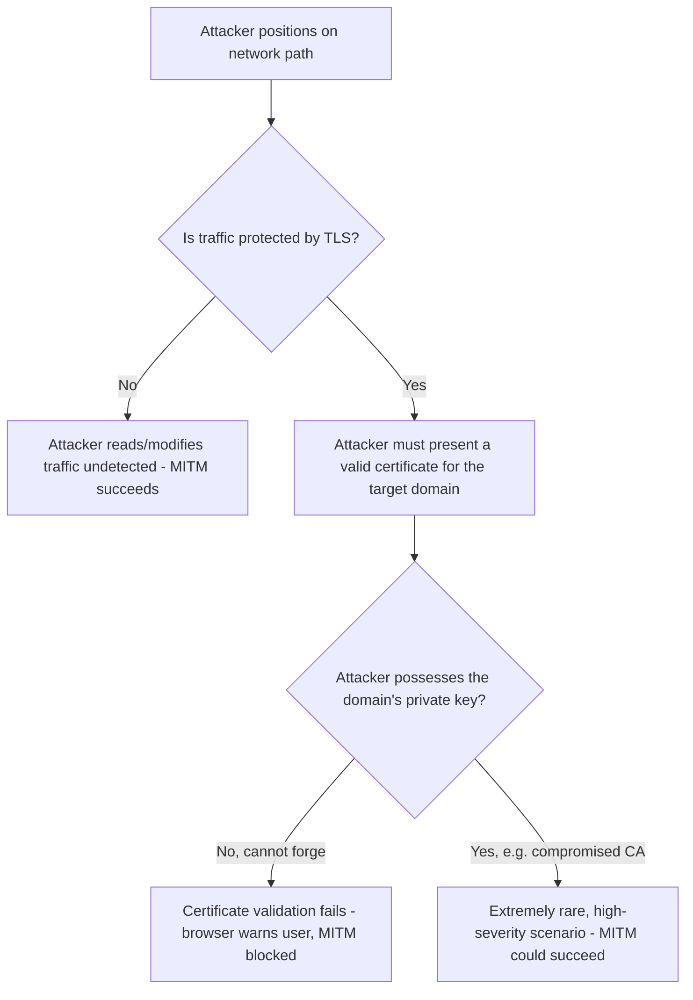
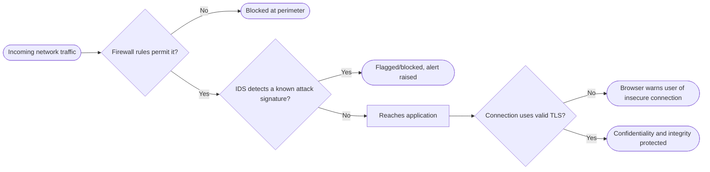

# Network Security

> Part of [Phase 07 — Computer Networks](./README.md)

---

## What is it?

Network Security is the **capstone** of Phase 7 — not a new layer of the stack, but the discipline of protecting every layer covered so far (switching, routing, DNS, HTTP/HTTPS, wireless) against attackers who deliberately try to intercept, corrupt, impersonate, or overwhelm network communication.

## Why do we need it?

Every protocol in this phase was originally designed assuming GOOD-FAITH participants — early internet protocols (IP, DNS, HTTP) had essentially NO built-in defense against a deliberately malicious participant. As the internet grew from a small, trusted research network into critical global infrastructure carrying banking, healthcare, and government communication, the gap between "designed for cooperation" and "must survive active attack" became one of computer science's most consequential, ongoing engineering challenges.

## Real-world analogy

Think of the protocols covered in this phase like a city's original road and postal systems, designed decades ago assuming everyone follows the rules. Network Security is like the layer of locks, security cameras, ID checks, and tamper-evident seals added LATER, once it became clear that some participants would deliberately try to steal mail, impersonate the postal worker, or block the roads entirely — without redesigning the whole city from scratch.

```text
Original protocol design: "assume good faith"
Network Security's job:   "assume an active, capable adversary,
                            and defend anyway, without breaking
                            everything that already works"
```

## Historical background

- Early security incidents — like the **Morris Worm (1988)**, one of the first major internet-wide security incidents, exploiting software vulnerabilities to self-replicate across thousands of connected machines — served as an early wake-up call about the internet's fundamental vulnerability.
- **Firewalls** emerged in the late 1980s-early 1990s as one of the first practical network defense mechanisms, filtering traffic based on rules.
- The rise of e-commerce in the mid-to-late 1990s directly drove the development and adoption of SSL/TLS (see [`HTTPS.md`](./HTTPS.md)), since online payments demanded real cryptographic protection.
- Modern network security has expanded dramatically in scope, driven by increasingly sophisticated threats: state-sponsored attacks, ransomware, large-scale DDoS attacks, and supply-chain compromises — turning network security into a massive, dedicated professional discipline.

## Mathematical foundation

**Level 1 — Explain it to a 15-year-old:**

Imagine a school hallway where anyone can technically walk up to any locker and try the handle. Network security is like adding locks (encryption), ID badges (authentication), hallway monitors (firewalls/intrusion detection), and rules about how many times you're allowed to try a locked door before someone gets suspicious (rate limiting) — layered defenses, since no single measure alone stops every possible bad actor.

**Level 2 — Engineering Level:**

Network attacks generally target one (or more) of the classic security properties: **Confidentiality** (an eavesdropper reads data they shouldn't — addressed by encryption), **Integrity** (data is tampered with in transit — addressed by cryptographic hashing/signatures), and **Availability** (a service is made unusable — addressed by defenses against Denial-of-Service attacks). Understanding WHICH property an attack targets directly clarifies which defense category applies.

**Level 3 — Industry Level:**

Real-world network security is implemented in LAYERS ("defense in depth"): firewalls filter traffic at the network perimeter; TLS/HTTPS protects data in transit; VPNs create encrypted tunnels over untrusted networks; Intrusion Detection/Prevention Systems (IDS/IPS) monitor for known attack PATTERNS; and rate limiting/traffic scrubbing services defend against large-scale Denial-of-Service attacks — no single layer is assumed sufficient alone.

**Level 4 — Research Level:**

Research into **DDoS mitigation at internet scale** explores how to distinguish LEGITIMATE traffic surges (a viral news story) from malicious, distributed attack traffic (potentially from millions of compromised devices in a botnet) in real time, at massive scale. Research into **zero-trust network architecture** explores abandoning the traditional assumption that "inside the corporate network perimeter = trusted," instead requiring continuous verification for every request regardless of its network origin — a significant, actively-adopted architectural shift.

## Formal definition

Network security is typically framed around the **CIA triad**: **Confidentiality** (only authorized parties can read data), **Integrity** (data cannot be undetectably modified), and **Availability** (systems remain accessible to legitimate users despite attempts to disrupt them) — every specific attack and defense in this chapter can be mapped onto which of these three properties it threatens or protects.

## Core concepts

- **CIA Triad** — Confidentiality, Integrity, Availability — the three core properties network security aims to protect
- **Firewall** — filters network traffic based on rules (source/destination address, port, sometimes application content)
- **VPN (Virtual Private Network)** — creates an encrypted tunnel over an untrusted network, protecting traffic confidentiality and often masking the user's true network origin
- **DoS / DDoS (Denial of Service / Distributed Denial of Service)** — overwhelming a target with traffic or requests to make it unavailable to legitimate users
- **Man-in-the-Middle (MITM) Attack** — an attacker secretly intercepts (and potentially alters) communication between two parties who believe they're communicating directly
- **Spoofing** — falsifying identity information (IP address, MAC address, DNS response) to impersonate a trusted entity
- **Intrusion Detection/Prevention System (IDS/IPS)** — monitors network traffic for known attack signatures or anomalous patterns

## Internal working

A firewall internally works by inspecting each packet (or, for more advanced "stateful" firewalls, tracking entire CONNECTIONS) against a configured RULE SET — comparing source/destination IP addresses, ports, and protocol types, and either ALLOWING or BLOCKING the traffic based on whether it matches a permitted pattern; more advanced "next-generation" firewalls also inspect actual application-layer content (Layer 7, connecting back to [`OSI-Model.md`](./OSI-Model.md)) for known malicious patterns.

## Step-by-step explanation

**How a Man-in-the-Middle attack works (and how TLS prevents it), step by step:**

1. Alice wants to communicate securely with Bob's server.
2. An attacker, Mallory, positions themselves on the network PATH between Alice and Bob (e.g., a compromised WiFi router, or ARP spoofing on a local network).
3. WITHOUT TLS: Mallory can simply read (or even modify) all traffic passing through, completely undetected by either Alice or Bob.
4. WITH TLS: when Alice's browser connects, Mallory would need to present a VALID certificate for Bob's domain to intercept the connection transparently — but Mallory doesn't possess Bob's private key, and any certificate Mallory presents instead will FAIL Alice's browser's trust-chain verification (see [`HTTPS.md`](./HTTPS.md)), triggering a prominent security warning.
5. This is EXACTLY why certificate validation (not just encryption alone) is essential — encryption alone would protect against PASSIVE eavesdropping, but only AUTHENTICATED encryption (TLS's actual design) protects against an ACTIVE Man-in-the-Middle attacker.

## Visual diagram



## Architecture diagram

```text
Defense in Depth, layered across the OSI stack:

Layer 7 (Application):  HTTPS/TLS, application-layer firewalls, input validation
Layer 4 (Transport):    Firewalls (port-based rules), rate limiting
Layer 3 (Network):      IP-based firewall rules, VPNs, BGP route validation (RPKI)
Layer 2 (Data Link):    Port security, protection against MAC flooding/ARP spoofing
Physical:               Physical access control to network hardware

NO SINGLE layer is assumed sufficient - this is the essence
of "defense in depth."
```

## Flowchart



## Example

Trace a Distributed Denial-of-Service (DDoS) attack and a standard mitigation approach:

```
ATTACK: An attacker controls a "botnet" of thousands of compromised devices
        (often IoT devices with weak default security). All devices
        simultaneously send massive traffic volumes to a single target
        server, overwhelming its capacity to respond to LEGITIMATE requests.

MITIGATION (typical approach):
  1. Traffic is routed through a specialized DDoS-scrubbing service
     BEFORE reaching the actual target server.
  2. This service analyzes traffic patterns, distinguishing likely-malicious
     traffic (unusual volume from suspicious sources, patterns matching
     known attack signatures) from legitimate user traffic.
  3. Malicious traffic is DROPPED or rate-limited at the scrubbing layer;
     only traffic judged legitimate is forwarded to the actual target.
  4. This effectively "absorbs" the attack's traffic volume using
     infrastructure specifically built for this purpose, protecting
     the actual target server's limited capacity.
```

## Dry run

Trace ARP spoofing (a Layer 2 attack) and its consequence:

| Step | Action                                                                                       | Result                                                                    |
| ---- | -------------------------------------------------------------------------------------------- | ------------------------------------------------------------------------- |
| 1    | Attacker sends forged ARP replies claiming "I am the router's IP address"                    | Other devices on the local network update their ARP tables incorrectly    |
| 2    | Victim devices now send traffic INTENDED for the router to the attacker instead              | Attacker intercepts all victim traffic                                    |
| 3    | Attacker forwards traffic to the REAL router (to avoid detection) after reading/modifying it | Victim's connection appears to work normally, unaware of the interception |
| 4    | Any traffic NOT protected by TLS is now fully readable by the attacker                       | Confidentiality violated for unencrypted traffic                          |

This exact scenario is precisely why relying SOLELY on "being on a trusted local network" is insufficient — TLS's end-to-end protection remains essential even on networks you'd otherwise assume are safe.

## Multiple examples

**Example 1 — SQL Injection (an application-layer attack, connecting back to [`SQL.md`](../06-Database-Management-System/SQL.md)):** an attacker submits malicious input designed to manipulate a poorly-constructed SQL query, potentially extracting or corrupting database contents — defended against via parameterized queries, not network-layer defenses alone.

**Example 2 — DNS Spoofing/Cache Poisoning:** an attacker tricks a DNS resolver into caching a FALSE record, redirecting users of a legitimate domain name to a malicious server — defended against via DNSSEC (see [`DNS.md`](./DNS.md)).

**Example 3 — VPN for remote work security:** an employee working from a coffee shop's public WiFi uses a company VPN to create an encrypted tunnel to the corporate network, protecting sensitive traffic from anyone else on that same public, potentially hostile WiFi network.

## Advantages

_(of implementing strong network security practices)_

- Protects sensitive data (financial, personal, medical) from interception and misuse.
- Maintains service availability against increasingly common and sophisticated Denial-of-Service attacks.
- Builds and preserves user trust — a single serious security breach can cause lasting reputational and financial damage.

## Disadvantages

- Security measures (encryption overhead, firewall rule processing, IDS inspection) introduce real performance costs.
- Overly restrictive security policies can hinder legitimate usage and productivity, requiring careful balance.
- No security measure is perfect or permanent — attackers continuously adapt, requiring ONGOING investment and vigilance, not a one-time fix.

## Complexity

| Defense Mechanism              | Complexity/Performance Consideration                                                         |
| ------------------------------ | -------------------------------------------------------------------------------------------- |
| Firewall packet filtering      | O(1) to O(rules) per packet, depending on rule matching implementation                       |
| TLS encryption/decryption      | Real but manageable overhead, mitigated by hardware acceleration on modern CPUs              |
| IDS/IPS deep packet inspection | Higher computational cost, since it examines actual payload content                          |
| DDoS traffic scrubbing         | Requires massive, dedicated infrastructure capable of absorbing attack-scale traffic volumes |

## Memory usage

Stateful firewalls and IDS systems must track CONNECTION STATE across potentially millions of simultaneous connections, requiring careful memory management — this is exactly the kind of resource-exhaustion vector some DDoS attacks specifically target (e.g., SYN flood attacks exploiting TCP's connection-state tracking, see [`TCP-IP.md`](./TCP-IP.md)).

## Time complexity

The core practical lesson tying this whole phase together: **every performance optimization covered earlier in this phase (fast switching, efficient routing, cached DNS, multiplexed HTTP) has a security ANALOG that must be considered together, not as an afterthought** — a system optimized purely for speed, without security considerations, is a system with an easier-to-exploit attack surface.

## Best practices

- Apply "defense in depth" — layer multiple, INDEPENDENT security measures (firewall, TLS, IDS, application-level validation) rather than relying on any single defense.
- Adopt a "zero trust" mindset — never assume traffic is safe simply because it originates from "inside" a corporate network perimeter.
- Keep all software (operating systems, libraries, firmware) UPDATED — a large fraction of real-world breaches exploit already-known, already-PATCHED vulnerabilities that simply weren't applied in time.
- Use VPNs on untrusted networks (public WiFi), and always verify TLS certificate validity rather than dismissing browser security warnings.

## Common mistakes

- Assuming a firewall alone provides complete protection — it's ONE layer among several necessary defenses, not a complete solution.
- Treating "inside the corporate network" as automatically trustworthy — a compromised internal device can attack other internal systems just as effectively as an external attacker.
- Ignoring or habitually dismissing TLS certificate warnings, defeating one of HTTPS's core protections against Man-in-the-Middle attacks.
- Underestimating IoT device security — many DDoS botnets are built specifically from poorly-secured, rarely-updated consumer IoT devices.

## Interview questions

1. Explain the CIA triad and give an example attack targeting each property.
2. What is a Man-in-the-Middle attack, and how does TLS certificate validation prevent it?
3. Explain the difference between DoS and DDoS attacks, and describe a standard mitigation approach.
4. What is "defense in depth," and why is no single security measure considered sufficient?
5. What is ARP spoofing, and why does it work even on networks assumed to be "trusted"?

## University questions

1. Define the CIA triad and classify at least four different attack types by which property they primarily threaten.
2. Explain how TLS's certificate-based authentication specifically defeats a Man-in-the-Middle attack.
3. Describe the difference between a firewall and an Intrusion Detection System.
4. Explain a DDoS attack scenario and at least two distinct mitigation strategies.

## Coding examples

### Pseudocode

```text
FUNCTION firewallCheck(packet, rules):
    FOR rule IN rules:
        IF packet.matches(rule):
            RETURN rule.action   // ALLOW or DENY
    RETURN defaultPolicy   // typically DENY (deny-by-default is best practice)

FUNCTION detectSynFlood(connectionAttempts, threshold, timeWindow):
    recentAttempts = countAttemptsInWindow(connectionAttempts, timeWindow)
    IF recentAttempts > threshold:
        RETURN "POSSIBLE SYN FLOOD DETECTED"
    RETURN "Normal traffic levels"
```

### Python implementation

```python
class FirewallRule:
    def __init__(self, src_ip=None, dst_port=None, action="DENY"):
        self.src_ip = src_ip
        self.dst_port = dst_port
        self.action = action

def check_firewall(packet, rules, default_policy="DENY"):
    for rule in rules:
        src_match = rule.src_ip is None or rule.src_ip == packet["src_ip"]
        port_match = rule.dst_port is None or rule.dst_port == packet["dst_port"]
        if src_match and port_match:
            return rule.action
    return default_policy

rules = [
    FirewallRule(dst_port=443, action="ALLOW"),   # allow HTTPS
    FirewallRule(dst_port=80, action="ALLOW"),    # allow HTTP
    FirewallRule(src_ip="10.0.0.99", action="DENY"),  # block a known-bad IP
]

packet1 = {"src_ip": "8.8.8.8", "dst_port": 443}
packet2 = {"src_ip": "10.0.0.99", "dst_port": 443}
packet3 = {"src_ip": "8.8.8.8", "dst_port": 23}  # telnet, not explicitly allowed

print(check_firewall(packet1, rules))  # ALLOW
print(check_firewall(packet2, rules))  # DENY (blocked source, checked first-match... adjust order matters!)
print(check_firewall(packet3, rules))  # DENY (default policy, no matching rule)
```

### C implementation

```c
#include <stdio.h>
#include <string.h>

struct FirewallRule {
    char srcIp[16];
    int dstPort;
    int allow;  // 1 = ALLOW, 0 = DENY
};

int checkFirewall(const char* srcIp, int dstPort, struct FirewallRule rules[], int numRules) {
    for (int i = 0; i < numRules; i++) {
        int srcMatch = (strlen(rules[i].srcIp) == 0) || (strcmp(rules[i].srcIp, srcIp) == 0);
        int portMatch = (rules[i].dstPort == 0) || (rules[i].dstPort == dstPort);
        if (srcMatch && portMatch) return rules[i].allow;
    }
    return 0;  // default deny
}

int main() {
    struct FirewallRule rules[] = {
        {"", 443, 1},          // allow HTTPS from anywhere
        {"10.0.0.99", 0, 0},   // deny this specific IP on any port
    };

    printf("Packet 1: %s\n", checkFirewall("8.8.8.8", 443, rules, 2) ? "ALLOW" : "DENY");
    printf("Packet 2: %s\n", checkFirewall("8.8.8.8", 23, rules, 2) ? "ALLOW" : "DENY");
    return 0;
}
```

### C++ implementation

```cpp
#include <iostream>
#include <vector>
#include <string>
using namespace std;

struct FirewallRule {
    string srcIp;   // empty means "any"
    int dstPort;    // 0 means "any"
    bool allow;
};

bool checkFirewall(const string& srcIp, int dstPort, vector<FirewallRule>& rules) {
    for (auto& rule : rules) {
        bool srcMatch = rule.srcIp.empty() || rule.srcIp == srcIp;
        bool portMatch = rule.dstPort == 0 || rule.dstPort == dstPort;
        if (srcMatch && portMatch) return rule.allow;
    }
    return false;  // default deny
}

int main() {
    vector<FirewallRule> rules = {
        {"", 443, true},
        {"10.0.0.99", 0, false},
    };

    cout << "Packet 1: " << (checkFirewall("8.8.8.8", 443, rules) ? "ALLOW" : "DENY") << endl;
    cout << "Packet 2: " << (checkFirewall("8.8.8.8", 23, rules) ? "ALLOW" : "DENY") << endl;
}
```

### Java implementation

```java
import java.util.*;

public class NetworkSecurityDemo {
    static class FirewallRule {
        String srcIp; int dstPort; boolean allow;
        FirewallRule(String srcIp, int dstPort, boolean allow) {
            this.srcIp = srcIp; this.dstPort = dstPort; this.allow = allow;
        }
    }

    static boolean checkFirewall(String srcIp, int dstPort, List<FirewallRule> rules) {
        for (FirewallRule rule : rules) {
            boolean srcMatch = rule.srcIp.isEmpty() || rule.srcIp.equals(srcIp);
            boolean portMatch = rule.dstPort == 0 || rule.dstPort == dstPort;
            if (srcMatch && portMatch) return rule.allow;
        }
        return false;  // default deny
    }

    public static void main(String[] args) {
        List<FirewallRule> rules = List.of(
            new FirewallRule("", 443, true),
            new FirewallRule("10.0.0.99", 0, false)
        );

        System.out.println("Packet 1: " + (checkFirewall("8.8.8.8", 443, rules) ? "ALLOW" : "DENY"));
        System.out.println("Packet 2: " + (checkFirewall("8.8.8.8", 23, rules) ? "ALLOW" : "DENY"));
    }
}
```

## Visualization

```text
Defense in Depth, tying every chapter in this phase together:

Attacker attempts to compromise a web application:

  [Wireless encryption WPA3]     <- Wireless.md: protects the radio link
         |
  [Firewall filtering]           <- Security.md: blocks unauthorized ports/IPs
         |
  [BGP route validation]         <- Routing.md + Security.md: prevents traffic hijacking
         |
  [DNSSEC-verified DNS]          <- DNS.md + Security.md: prevents DNS spoofing
         |
  [TLS/HTTPS encryption+auth]    <- HTTPS.md: protects data in transit, verifies identity
         |
  [Application input validation] <- prevents injection attacks at the application layer

Each layer independently blocks a DIFFERENT class of attack -
this is "defense in depth" in action, spanning this ENTIRE phase.
```

## Industry use

- **Every organization with an internet-facing presence** invests in network security: firewalls, TLS certificates, DDoS protection services, and increasingly, zero-trust architectures.
- **Dedicated DDoS mitigation providers** (Cloudflare, Akamai) operate massive global infrastructure specifically to absorb and filter attack traffic before it reaches customer origin servers.
- **Financial services and healthcare** face some of the strictest regulatory security requirements, given the sensitivity of the data they handle.
- **Bug bounty programs** at major tech companies pay security researchers to responsibly find and report vulnerabilities before malicious actors can exploit them.

## Research relevance

Research into **zero-trust network architecture** continues to reshape how organizations design internal network security, abandoning the traditional "trusted perimeter" model. Research into **AI-driven anomaly detection** explores using machine learning to identify novel attack patterns that signature-based IDS/IPS systems would miss. Research into **post-quantum cryptography** (see [`HTTPS.md`](./HTTPS.md)) addresses long-term cryptographic resilience against future quantum computing threats.

## Related concepts

- Every other file in this phase — Security is explicitly the synthesizing capstone, showing how attacks and defenses apply across switching, routing, DNS, HTTP/HTTPS, and wireless networking
- Deadlocks and Synchronization, Phase 5 (resource-exhaustion attacks conceptually parallel resource contention problems studied there)
- Transactions, Phase 6 (the CIA triad's "Integrity" property directly parallels transactional consistency guarantees)

## Practice problems

1. Classify five different network attacks (SQL injection, DDoS, ARP spoofing, DNS cache poisoning, MITM) by which CIA triad property each primarily threatens.
2. Design a layered "defense in depth" strategy for a small e-commerce website, specifying at least four distinct security measures.
3. Explain why a firewall alone would NOT have prevented a SQL injection attack, and what layer of defense actually addresses it.
4. Research a real-world, publicly-documented DDoS attack and explain how it was ultimately mitigated.

## Advanced concepts

- **Zero-Trust Architecture** — a security model requiring continuous verification for every request, regardless of whether it originates from inside or outside the traditional network perimeter.
- **Intrusion Detection vs. Prevention Systems (IDS vs. IPS)** — IDS passively monitors and alerts; IPS actively blocks detected threats in real time, a meaningful operational distinction.
- **Bug Bounty Programs and Responsible Disclosure** — structured processes for security researchers to report vulnerabilities to organizations before public disclosure, balancing rapid fixes against premature exploit disclosure.

## Summary

Network Security applies the CIA triad (Confidentiality, Integrity, Availability) as a lens for understanding threats across every layer and protocol covered in this phase — from wireless encryption, to routing validation, to DNS security, to HTTPS's certificate-based authentication — using layered, "defense in depth" strategies since no single measure is ever assumed sufficient alone. It is the essential, ongoing discipline of adapting protocols originally designed for good-faith cooperation to survive in a world with active, capable, and continuously evolving adversaries.

## Key takeaways

- The CIA triad (Confidentiality, Integrity, Availability) provides a framework for classifying both attacks and defenses.
- Defense in depth layers multiple, independent security measures — no single layer is assumed sufficient alone.
- TLS's certificate validation, not encryption alone, is what specifically defeats active Man-in-the-Middle attacks.
- DDoS attacks target Availability at massive scale, typically mitigated via dedicated traffic-scrubbing infrastructure.
- Zero-trust architecture abandons the assumption that "inside the network perimeter" implies "trustworthy."

## References

- Stallings, W. _Network Security Essentials_.
- Kurose, J., Ross, K. _Computer Networking: A Top-Down Approach_, Chapter 8.
- Anderson, R. _Security Engineering_.
- NIST Special Publication 800-207, _Zero Trust Architecture_.

---

⬅ Back to [Phase 07 — Computer Networks README](./README.md)

---
