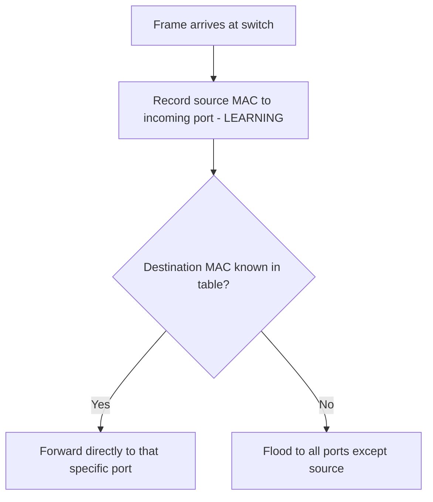
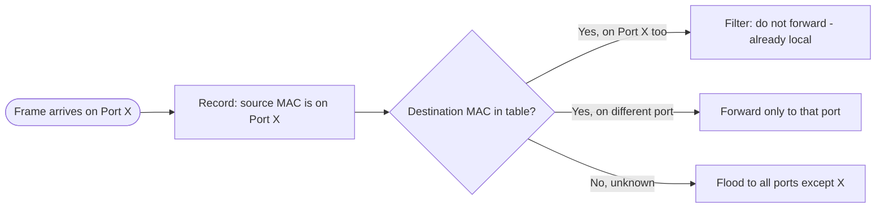

# Switching

> Part of [Phase 07 — Computer Networks](./README.md)

---

## What is it?

Switching is the process of forwarding data (as **frames**, at the Data Link layer) between devices **within the same local network**, based on their **MAC (Media Access Control) addresses** — the hardware-level identifiers built into every network interface.

## Why do we need it?

Within a single building or office, dozens or hundreds of devices need to communicate directly with each other, quickly and efficiently, without every single message needing to be broadcast to every device (wasteful) or routed through the full complexity of internet-scale IP routing (unnecessary). Switches solve this specific, local problem: learn where each device is, and forward traffic ONLY to where it needs to go.

## Real-world analogy

Think of a switch like a smart office receptionist who has LEARNED, over time, which employee sits at which desk. When a call comes in for "Alice," the receptionist doesn't page the entire building — they directly transfer the call to Alice's specific desk, because they've learned her exact location. A "dumb" alternative (a hub) would instead announce every call to EVERY desk in the building, letting only the intended recipient respond.

```text
Switch's learned MAC address table:
AA:BB:CC:DD:EE:01 -> Port 1 (Alice's computer)
AA:BB:CC:DD:EE:02 -> Port 2 (Bob's computer)
AA:BB:CC:DD:EE:03 -> Port 3 (Printer)

Frame arrives destined for AA:BB:CC:DD:EE:02 -> switch forwards ONLY to Port 2
```

## Historical background

- Early local networks used **hubs**, simple devices that BROADCAST every incoming signal to every connected port — functional, but wasteful and prone to collisions as networks grew.
- **Ethernet switching** emerged in the early-to-mid 1990s as a direct improvement, using LEARNED MAC address tables to forward frames intelligently rather than broadcasting everything.
- The **Spanning Tree Protocol (STP)**, standardized by the IEEE as **802.1D in 1990** (based on Radia Perlman's foundational 1985 algorithm), solved a critical problem: preventing infinite loops when a network has REDUNDANT physical connections between switches (for reliability), while still using that redundancy as a backup path if the primary fails.

## Mathematical foundation

**Level 1 — Explain it to a 15-year-old:**

Imagine a smart mail room in an office building that, over time, LEARNS which mail slot number corresponds to which employee's actual desk, simply by watching who picks up mail from where. Once it's learned, delivering mail becomes instant and direct — no need to announce every piece of mail to the whole building.

**Level 2 — Engineering Level:**

A switch maintains a **MAC address table** (sometimes called a "forwarding table" or "CAM table"), mapping MAC addresses to the PHYSICAL PORT they were last seen on. This table is built through **MAC address learning**: whenever a frame arrives on a port, the switch records "this source MAC address is reachable via this port" — over time, the switch learns the location of every device on the network.

**Level 3 — Industry Level:**

Real enterprise networks use **VLANs (Virtual LANs)** to logically SEGMENT a single physical switch infrastructure into multiple separate broadcast domains (e.g., separating "Finance" and "Engineering" traffic even though they share the same physical switches) — improving both security (isolating sensitive traffic) and performance (reducing broadcast traffic scope). Redundant physical links between switches (for fault tolerance) require the **Spanning Tree Protocol** to prevent catastrophic broadcast loops.

**Level 4 — Research Level:**

Research into **Software-Defined Networking (SDN)** explores centralizing and programmatically controlling switching/forwarding decisions (rather than each switch independently learning and deciding), enabling far more flexible, centrally-managed, and rapidly reconfigurable network behavior — a significant architectural shift actively being adopted in large data center networks.

## Formal definition

A switch operates by maintaining a **forwarding table** `T: MAC_address → port`, updated via **MAC learning** as frames pass through, and for each incoming frame, either **forwards** it to the specific port associated with its destination MAC address (if known), or **floods** it to all ports except the one it arrived on (if the destination is unknown), while also **filtering** frames destined for a MAC address already known to be on the SAME port they arrived from (no need to forward back out the way it came).

## Core concepts

- **MAC Address** — a globally unique, hardware-assigned identifier for a network interface (unlike an IP address, which can change)
- **MAC Address Table (Forwarding Table)** — the switch's learned mapping of MAC addresses to physical ports
- **Learning** — the process of building this table by observing SOURCE MAC addresses of incoming frames
- **Flooding** — forwarding a frame out ALL ports (except the source) when the destination MAC is not yet known
- **Broadcast Domain** — the set of devices that receive a broadcast frame; VLANs create SEPARATE broadcast domains on the same physical switch infrastructure
- **Spanning Tree Protocol (STP)** — prevents broadcast loops in networks with redundant physical switch connections

## Internal working

When a switch receives a frame, it looks at the frame's SOURCE MAC address and records "this MAC is on this port" in its forwarding table (learning). It then looks at the DESTINATION MAC address: if that address is already known in the table, it forwards the frame ONLY to that specific port; if unknown, it FLOODS the frame out every other port, relying on the true recipient to respond (at which point the switch will learn ITS location too, from that response's source address).

## Step-by-step explanation

**How a switch learns and forwards frames, step by step, tracing a small example network:**

1. A switch starts with an EMPTY forwarding table.
2. Alice (on Port 1) sends a frame to Bob (unknown location). The switch records "Alice's MAC → Port 1" and, since Bob's location is unknown, FLOODS the frame to all other ports (Port 2, Port 3, ...).
3. Bob (on Port 2) receives the flooded frame and replies. The switch now records "Bob's MAC → Port 2" from this reply's source address.
4. Since the switch NOW knows Bob's location (from step 3), it forwards this reply directly and ONLY to Port 1 (Alice's port) — no flooding needed this time.
5. From this point forward, ANY frame between Alice and Bob is forwarded DIRECTLY, port-to-port, without flooding — the switch has "learned" the network.

## Visual diagram



## Architecture diagram

```text
Switch forwarding table evolution:

Initial state (empty):
+------------+------+
| MAC        | Port |
+------------+------+

After Alice (Port 1) sends a frame:
+------------+------+
| Alice's MAC| 1    |
+------------+------+

After Bob (Port 2) replies:
+------------+------+
| Alice's MAC| 1    |
| Bob's MAC  | 2    |
+------------+------+

Now ALL future Alice<->Bob traffic is forwarded DIRECTLY,
port-to-port, with zero flooding.
```

## Flowchart



## Example

Trace a small network with a redundant link and the Spanning Tree Protocol preventing a loop:

```
Topology: Switch A -- Switch B -- Switch C -- Switch A  (a physical LOOP,
          often intentionally added for redundancy/fault tolerance)

WITHOUT Spanning Tree Protocol:
  A broadcast frame would circulate FOREVER around this loop, being
  endlessly re-flooded by each switch - a "broadcast storm" that can
  bring down an entire network.

WITH Spanning Tree Protocol:
  STP elects a "root" switch and calculates the shortest path from every
  other switch to the root, then DISABLES (blocks) exactly the ONE
  redundant link needed to eliminate the loop - leaving a loop-free
  logical topology, while keeping the physical redundant link
  ready as an automatic BACKUP if the primary path ever fails.
```

## Dry run

Trace MAC address table learning across several frame exchanges:

| Step | Event                                 | Table After                                                         |
| ---- | ------------------------------------- | ------------------------------------------------------------------- |
| 1    | Alice (Port 1) sends to Bob (unknown) | {Alice: 1} — frame flooded                                          |
| 2    | Bob (Port 2) replies to Alice         | {Alice: 1, Bob: 2} — forwarded directly to Port 1                   |
| 3    | Carol (Port 3) sends to Alice         | {Alice: 1, Bob: 2, Carol: 3} — forwarded directly to Port 1         |
| 4    | Bob sends to Carol                    | table unchanged — forwarded directly to Port 3 (both already known) |

## Multiple examples

**Example 1 — VLAN segmentation:** a company's single physical switch infrastructure is divided into "VLAN 10" (Finance) and "VLAN 20" (Engineering) — devices in different VLANs cannot see each other's broadcast traffic at all, even though they share the same physical cables and switches.

**Example 2 — Switch vs. hub performance:** a hub with 10 connected devices creates ONE shared collision domain (only one device can transmit at a time without collision); a switch with 10 connected devices creates 10 SEPARATE collision domains, letting multiple pairs of devices communicate simultaneously without interference.

**Example 3 — MAC address spoofing (a security concern):** since MAC addresses can be SOFTWARE-changed on most devices (unlike their supposed "hardware-permanent" nature), an attacker can spoof another device's MAC address to intercept traffic meant for it — directly relevant to [`Security.md`](./Security.md).

## Advantages

- Dramatically more efficient than hub-based broadcasting — traffic is forwarded only where it needs to go.
- Each switch port operates as its OWN collision domain, allowing many simultaneous, non-interfering conversations.
- VLANs provide flexible logical network segmentation without requiring separate physical infrastructure.

## Disadvantages

- MAC address tables have finite size — a switch flooded with an enormous number of distinct fake source MAC addresses (a "MAC flooding attack") can exhaust table space, forcing the switch into a hub-like, insecure broadcast-everything fallback mode.
- Switching operates only WITHIN a single local network/broadcast domain — connecting SEPARATE networks requires routing (see [`Routing.md`](./Routing.md)), a fundamentally different function.
- Redundant physical links (for fault tolerance) require careful protocols like STP to avoid catastrophic broadcast loops.

## Complexity

| Operation                                            | Time Complexity                                         |
| ---------------------------------------------------- | ------------------------------------------------------- |
| MAC address table lookup (hash table implementation) | O(1) average                                            |
| Learning a new MAC address                           | O(1) — simple table insertion                           |
| Flooding (destination unknown)                       | O(n), n = number of ports                               |
| Spanning Tree Protocol convergence                   | Depends on network size and topology; typically seconds |

## Memory usage

A switch's MAC address table size is FINITE (a real, physical hardware limit, often tens of thousands of entries on enterprise switches) — this is precisely the vulnerability exploited by MAC flooding attacks, which deliberately try to exhaust this limited table space.

## Time complexity

The core practical insight: **switches achieve their efficiency by trading a small amount of UPFRONT learning overhead (flooding while addresses are unknown) for extremely fast, direct O(1) forwarding once the network topology has been learned** — this is why a switch's performance actually IMPROVES over time as it learns more of the network.

## Best practices

- Use VLANs to logically segment traffic for both security and performance reasons, even on shared physical switch infrastructure.
- Enable Spanning Tree Protocol (or its faster modern variants, like Rapid STP) whenever redundant physical links exist between switches.
- Monitor for unusually rapid MAC address table growth or churn, which can indicate a MAC flooding attack in progress.

## Common mistakes

- Confusing switching (Layer 2, MAC-address-based, LOCAL network only) with routing (Layer 3, IP-address-based, ACROSS networks) — a very common and important distinction.
- Creating redundant physical links between switches WITHOUT enabling Spanning Tree Protocol, risking a catastrophic broadcast storm.
- Assuming MAC addresses are immutable/unspoofable — they can be changed in software, a real security consideration.

## Interview questions

1. How does a switch learn which MAC addresses are on which ports?
2. What is the difference between a hub and a switch?
3. Why is the Spanning Tree Protocol necessary in networks with redundant links?
4. What is a VLAN, and why would an organization use one?
5. What is a MAC flooding attack, and how does it exploit switch behavior?

## University questions

1. Explain the process of MAC address learning and frame forwarding/flooding in a switch.
2. Describe the purpose and high-level operation of the Spanning Tree Protocol.
3. Compare the collision domain and broadcast domain characteristics of a hub versus a switch.
4. Explain how VLANs achieve logical network segmentation on shared physical infrastructure.

## Coding examples

### Pseudocode

```text
STRUCTURE Switch:
    forwardingTable = empty map (MAC -> port)

FUNCTION handleFrame(switch, incomingPort, sourceMAC, destMAC, frameData):
    switch.forwardingTable[sourceMAC] = incomingPort   // learning

    IF destMAC IN switch.forwardingTable:
        outPort = switch.forwardingTable[destMAC]
        IF outPort != incomingPort:
            forwardFrame(outPort, frameData)
        // else: destination is on the SAME port, no need to forward
    ELSE:
        FOR each port != incomingPort:
            forwardFrame(port, frameData)   // flooding
```

### Python implementation

```python
class Switch:
    def __init__(self):
        self.forwarding_table = {}  # MAC -> port

    def handle_frame(self, incoming_port, source_mac, dest_mac, all_ports):
        self.forwarding_table[source_mac] = incoming_port  # learning

        if dest_mac in self.forwarding_table:
            out_port = self.forwarding_table[dest_mac]
            if out_port != incoming_port:
                return [out_port]  # direct forward
            return []  # already local, filter (don't forward)
        else:
            return [p for p in all_ports if p != incoming_port]  # flood

switch = Switch()
ports = [1, 2, 3]

print(switch.handle_frame(1, "AA:MAC1", "BB:MAC2", ports))  # [2, 3] - flood (Bob unknown)
print(switch.handle_frame(2, "BB:MAC2", "AA:MAC1", ports))  # [1] - direct (Alice now known)
print(switch.handle_frame(1, "AA:MAC1", "BB:MAC2", ports))  # [2] - direct (Bob now known too)
```

### C implementation

```c
#include <stdio.h>
#include <string.h>

#define MAX_ENTRIES 100
struct Entry { char mac[20]; int port; };
struct Entry table[MAX_ENTRIES];
int tableSize = 0;

int findPort(const char* mac) {
    for (int i = 0; i < tableSize; i++)
        if (strcmp(table[i].mac, mac) == 0) return table[i].port;
    return -1;  // unknown
}

void learn(const char* mac, int port) {
    int existing = findPort(mac);
    if (existing == -1) {
        strcpy(table[tableSize].mac, mac);
        table[tableSize].port = port;
        tableSize++;
    }
}

int main() {
    learn("AA:MAC1", 1);
    learn("BB:MAC2", 2);

    int destPort = findPort("BB:MAC2");
    printf("Forward to port: %d\n", destPort);  // 2
    return 0;
}
```

### C++ implementation

```cpp
#include <iostream>
#include <unordered_map>
#include <vector>
using namespace std;

class SwitchDevice {
    unordered_map<string, int> forwardingTable;
public:
    vector<int> handleFrame(int incomingPort, string sourceMac, string destMac, vector<int> allPorts) {
        forwardingTable[sourceMac] = incomingPort;  // learning

        if (forwardingTable.count(destMac)) {
            int outPort = forwardingTable[destMac];
            if (outPort != incomingPort) return {outPort};
            return {};
        } else {
            vector<int> flood;
            for (int p : allPorts) if (p != incomingPort) flood.push_back(p);
            return flood;
        }
    }
};

int main() {
    SwitchDevice sw;
    vector<int> ports = {1, 2, 3};

    auto result1 = sw.handleFrame(1, "AA:MAC1", "BB:MAC2", ports);
    cout << "Flood to: "; for (int p : result1) cout << p << " "; cout << endl;

    auto result2 = sw.handleFrame(2, "BB:MAC2", "AA:MAC1", ports);
    cout << "Direct forward to: "; for (int p : result2) cout << p << " "; cout << endl;
}
```

### Java implementation

```java
import java.util.*;

public class SwitchDemo {
    Map<String, Integer> forwardingTable = new HashMap<>();

    List<Integer> handleFrame(int incomingPort, String sourceMac, String destMac, List<Integer> allPorts) {
        forwardingTable.put(sourceMac, incomingPort);  // learning

        if (forwardingTable.containsKey(destMac)) {
            int outPort = forwardingTable.get(destMac);
            if (outPort != incomingPort) return List.of(outPort);
            return List.of();
        } else {
            List<Integer> flood = new ArrayList<>();
            for (int p : allPorts) if (p != incomingPort) flood.add(p);
            return flood;
        }
    }

    public static void main(String[] args) {
        SwitchDemo sw = new SwitchDemo();
        List<Integer> ports = List.of(1, 2, 3);

        System.out.println("Flood: " + sw.handleFrame(1, "AA:MAC1", "BB:MAC2", ports));
        System.out.println("Direct: " + sw.handleFrame(2, "BB:MAC2", "AA:MAC1", ports));
    }
}
```

## Visualization

```text
Collision domains: Hub vs Switch, both with 4 connected devices:

HUB:     [Device A]--\
         [Device B]---+---(ONE shared collision domain)
         [Device C]---+
         [Device D]--/

SWITCH:  [Device A]--[Port 1]--\
         [Device B]--[Port 2]---+--(4 SEPARATE collision domains)
         [Device C]--[Port 3]---+
         [Device D]--[Port 4]--/
```

## Industry use

- **Every office, campus, and data center network** uses Ethernet switches as the fundamental building block of local connectivity.
- **Data center networks** use large-scale, high-speed switching fabrics (often with VLANs and advanced protocols) to interconnect thousands of servers.
- **Software-Defined Networking (SDN)** platforms centralize switching/forwarding decisions across many physical switches, popular in modern large-scale data centers (e.g., Google's internal network infrastructure).

## Research relevance

Research into **Software-Defined Networking (SDN)** and protocols like OpenFlow explores separating the switch's CONTROL logic (deciding forwarding rules) from its DATA PLANE (actually forwarding frames), enabling centralized, programmable network management at massive scale — a significant, actively-deployed shift from traditional, independently-learning switch behavior.

## Related concepts

- OSI Model (switching is fundamentally a Layer 2 / Data Link function — see [`OSI-Model.md`](./OSI-Model.md))
- Routing (the Layer 3 counterpart, connecting SEPARATE networks — see [`Routing.md`](./Routing.md))
- Graphs, Phase 2 (Spanning Tree Protocol directly computes a graph-theoretic spanning tree to eliminate loops)
- Security (MAC flooding and spoofing attacks directly target switching mechanisms — see [`Security.md`](./Security.md))

## Practice problems

1. Trace the MAC address table state after a sequence of 5 frame exchanges between 3 devices on a switch.
2. Explain why a network with a physical loop between switches, WITHOUT Spanning Tree Protocol enabled, can suffer catastrophic failure.
3. Design a VLAN scheme for a small company with Sales, Engineering, and Finance departments sharing physical switch infrastructure.
4. Research and explain how a MAC flooding attack works and how switches/network administrators can defend against it.

## Advanced concepts

- **Rapid Spanning Tree Protocol (RSTP)** — a faster-converging successor to the original STP, reducing network recovery time after a topology change.
- **Link Aggregation** — combining multiple physical links between switches into one logical, higher-bandwidth connection, improving both throughput and redundancy.
- **Software-Defined Networking (SDN) / OpenFlow** — centralizing forwarding decisions across many switches under a single programmable controller.

## Summary

Switching handles LOCAL network communication using MAC addresses, learning device locations dynamically and forwarding frames efficiently — from flooding (when a destination is unknown) to direct, O(1) forwarding (once learned). VLANs provide logical segmentation, and the Spanning Tree Protocol safely handles the redundant physical links that make local networks fault-tolerant.

## Key takeaways

- Switches forward frames based on LEARNED MAC address tables, operating at the Data Link layer (Layer 2).
- Unknown destinations are FLOODED; known destinations are forwarded DIRECTLY — switch performance improves as it learns the network.
- Each switch port is its own collision domain, a major efficiency advantage over hubs.
- VLANs logically segment a shared physical switch infrastructure into separate broadcast domains.
- Spanning Tree Protocol prevents catastrophic broadcast loops in networks with redundant physical links.

## References

- IEEE 802.1D (Spanning Tree Protocol standard).
- Perlman, R. (1985). _An Algorithm for Distributed Computation of a Spanning Tree in an Extended LAN_.
- Kurose, J., Ross, K. _Computer Networking: A Top-Down Approach_, Chapter 6.
- Tanenbaum, A., Wetherall, D. _Computer Networks_, Chapter 4.

---

⬅ Back to [Phase 07 — Computer Networks README](./README.md)
