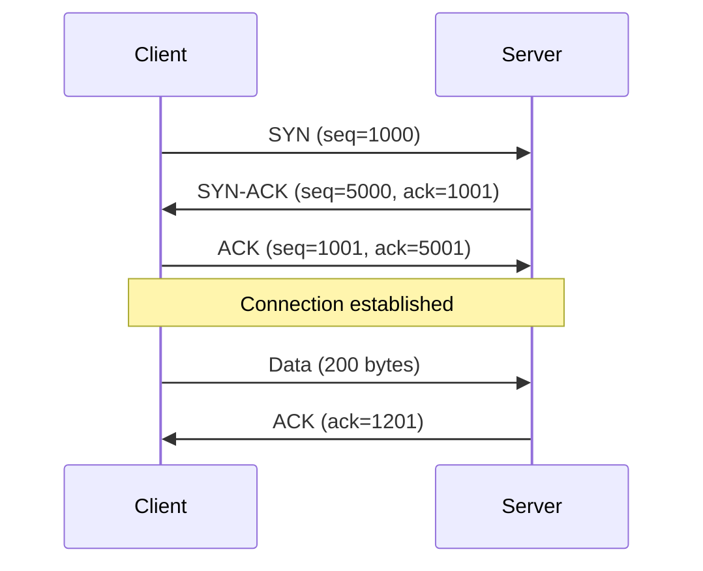
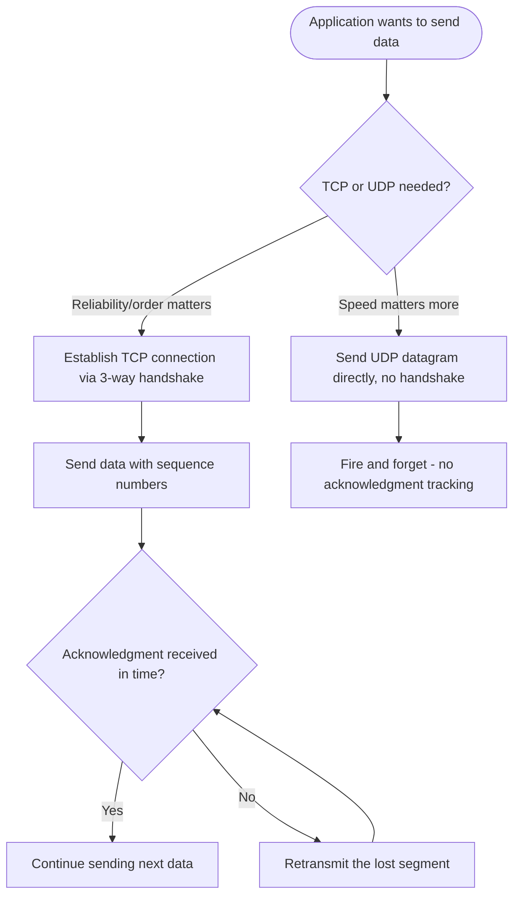

# TCP/IP

> Part of [Phase 07 — Computer Networks](./README.md)

---

## What is it?

TCP/IP (Transmission Control Protocol / Internet Protocol) is the actual protocol suite the real internet is built on — a simpler, 4-layer alternative to the OSI model's 7 layers, providing ADDRESSING (IP) and, depending on the application's needs, either RELIABLE, ordered delivery (TCP) or fast, unreliable delivery (UDP).

## Why do we need it?

The OSI model (see [`OSI-Model.md`](./OSI-Model.md)) is a conceptual teaching framework, but something had to actually be BUILT and DEPLOYED to make the internet work. TCP/IP is that real, practical protocol suite — designed specifically to let independent, unreliable networks interconnect and communicate reliably, without requiring any single point of central control.

## Real-world analogy

Think of IP like the postal system's ADDRESSING scheme — it gets an envelope from a source address to a destination address, but makes NO promise about order or guaranteed delivery (a letter might get lost, or two letters might arrive out of order). TCP is like adding a RECEIPT-CONFIRMATION and NUMBERING system on top of that postal service — numbering each envelope, requiring the recipient to confirm receipt, and re-sending anything that goes missing — turning an unreliable base service into a reliable one.

```text
IP:  "Get this packet from A to B, best effort, no guarantees"
TCP: "...AND make sure every packet arrives, in the right order,
      resending anything that's lost"
```

## Historical background

- TCP was designed by **Vint Cerf and Bob Kahn**, published in their landmark **1974 paper**, _"A Protocol for Packet Network Intercommunication."_
- The original design combined what we now know as TCP and IP into a single protocol; they were formally SPLIT into two separate protocols (TCP for reliability, IP for addressing/routing) around 1978, recognizing that not all applications need TCP's reliability overhead.
- **ARPANET officially switched to TCP/IP on January 1, 1983** — an event often informally called "the birth of the internet," since it standardized the protocol that would allow ARPANET to interconnect with other emerging networks.
- **IPv6** was standardized in 1998 specifically to address IPv4's fundamental limitation: only about 4.3 billion possible addresses, which the explosively growing internet was on track to exhaust.

## Mathematical foundation

**Level 1 — Explain it to a 15-year-old:**

Imagine mailing a 500-page book by tearing it into individual pages, numbering each page, and mailing them separately (possibly via different trucks, arriving in any order). IP is the part that gets each individual page to the right address. TCP is the part that numbers the pages, waits for confirmation each page arrived, resends any lost pages, and reassembles them in the CORRECT order at the destination — giving you back the complete, correctly-ordered book.

**Level 2 — Engineering Level:**

**TCP** establishes a CONNECTION via a **three-way handshake** (`SYN`, `SYN-ACK`, `ACK`), then guarantees reliable, ordered delivery using sequence numbers, acknowledgments, and retransmission of lost segments. **UDP** is CONNECTIONLESS — it simply sends packets ("datagrams") with no guarantee of delivery, ordering, or duplicate protection, trading reliability for significantly lower overhead and latency.

**Level 3 — Industry Level:**

Real-world protocol choice directly reflects this trade-off: web browsing, file transfer, and email use TCP (correctness matters more than raw speed); live video calls, online gaming, and DNS queries typically use UDP (a slightly late or lost frame/packet is preferable to the DELAY that TCP's retransmission-and-reordering guarantee would introduce). **IP addressing and subnetting** let organizations efficiently partition and route traffic within their own networks, a core skill for network engineers.

**Level 4 — Research Level:**

Research into **QUIC** (which underlies HTTP/3) explores building TCP-like reliability GUARANTEES on top of UDP instead of TCP itself, specifically to avoid a phenomenon called "head-of-line blocking" (where TCP's strict in-order delivery requirement can stall an entire connection waiting for a single lost packet) — an active, practically significant redesign of transport-layer assumptions that have held since the 1970s.

## Formal definition

An **IP address** (IPv4) is a 32-bit number, conventionally written as four decimal octets (e.g., `192.168.1.1`), divided into a NETWORK portion and a HOST portion, determined by a **subnet mask**. A **TCP connection** is uniquely identified by the 4-tuple `(source IP, source port, destination IP, destination port)`, and guarantees **in-order, reliable, exactly-once delivery** of a byte stream between two endpoints.

## Core concepts

- **IP (Internet Protocol)** — provides addressing and best-effort, connectionless packet delivery
- **TCP (Transmission Control Protocol)** — provides reliable, ordered, connection-oriented delivery on top of IP
- **UDP (User Datagram Protocol)** — provides fast, connectionless, unordered, unreliable delivery on top of IP
- **Port Number** — identifies a specific application/service on a given host (e.g., port 80 for HTTP)
- **Three-Way Handshake** — the `SYN`/`SYN-ACK`/`ACK` exchange establishing a TCP connection
- **Subnetting** — dividing an IP address range into smaller sub-networks using a subnet mask
- **NAT (Network Address Translation)** — allowing many devices on a private network to share a single public IP address

## Internal working

TCP guarantees reliability internally by assigning a SEQUENCE NUMBER to every byte sent; the receiver sends back ACKNOWLEDGMENTS confirming which bytes it has successfully received, and if the sender doesn't receive an acknowledgment within an expected time window, it RETRANSMITS the presumed-lost data — this sequence-number-and-acknowledgment mechanism is the entire foundation of TCP's reliability guarantee.

## Step-by-step explanation

**How the TCP three-way handshake establishes a connection, step by step:**

1. The CLIENT sends a `SYN` (synchronize) packet to the server, proposing an initial sequence number, and requesting a connection.
2. The SERVER responds with a `SYN-ACK` packet — acknowledging the client's sequence number AND proposing its own initial sequence number.
3. The CLIENT responds with an `ACK` packet, acknowledging the server's sequence number.
4. The connection is now ESTABLISHED, and both sides can begin reliably exchanging data, tracked via their agreed-upon sequence numbers.
5. (Connection termination is a separate, similar exchange, typically using `FIN`/`ACK` packets from each side — a "four-way" close, since either side can close its half of the connection independently.)

---

## Worked Examples: Subnetting and Addressing

Subnetting calculations are a classic, heavily-tested GATE/UGC NET numeric question type.

### Worked Example 1 — Basic subnet mask and host count

**Given:** an IP address `192.168.1.0` with subnet mask `255.255.255.0` (commonly written as `/24`). Find the number of usable host addresses.

```
/24 means the first 24 bits are the NETWORK portion, leaving 32-24 = 8 bits for HOSTS.

Total addresses in this subnet = 2^8 = 256
Usable host addresses = 2^8 - 2 = 254
  (subtract 2: one address is reserved for the NETWORK address itself,
   0.0.0.0-suffixed within the subnet - here, 192.168.1.0 -
   and one for the BROADCAST address, all-1s in the host portion -
   here, 192.168.1.255)

So this /24 subnet supports 254 usable host addresses.
```

### Worked Example 2 — Custom subnet mask, more host bits needed

**Given:** you need a subnet supporting AT LEAST 500 usable hosts. Find the appropriate subnet mask.

```
Need: 2^h - 2 >= 500, where h = number of host bits
Try h=9: 2^9 - 2 = 512 - 2 = 510 >= 500 -> WORKS
Try h=8: 2^8 - 2 = 256 - 2 = 254 < 500 -> NOT enough

So we need h=9 host bits, meaning the network portion = 32 - 9 = 23 bits
Subnet mask = /23 = 255.255.254.0

Verification: 255.255.254.0 in binary for the 3rd octet: 11111110
              -> 7 network bits + 1 host bit in that octet, plus 8 more host
                 bits in the last octet = 9 total host bits. Correct.
```

### Worked Example 3 — Dividing a network into multiple subnets

**Given:** you have the network `192.168.10.0/24` and need to divide it into 4 EQUAL-sized subnets. Find each subnet's range.

```
Need 4 subnets -> need 2 extra bits borrowed from the host portion (2^2 = 4)
New subnet mask: /24 + 2 = /26  (255.255.255.192)

Each subnet size = 2^(32-26) = 2^6 = 64 addresses (62 usable hosts each)

Subnet 1: 192.168.10.0   - 192.168.10.63   (usable: .1 to .62)
Subnet 2: 192.168.10.64  - 192.168.10.127  (usable: .65 to .126)
Subnet 3: 192.168.10.128 - 192.168.10.191  (usable: .129 to .190)
Subnet 4: 192.168.10.192 - 192.168.10.255  (usable: .193 to .254)

Each block of 64 addresses reserves its FIRST (network) and LAST (broadcast)
address, exactly as in Worked Example 1's logic, just applied 4 times.
```

### Worked Example 4 — TCP sequence number tracking (a handshake trace)

**Given:** trace a TCP handshake and initial data transfer where the client's initial sequence number (ISN) is 1000, and the server's ISN is 5000.

```
Step 1: Client -> Server: SYN, seq=1000
Step 2: Server -> Client: SYN-ACK, seq=5000, ack=1001 (client's seq + 1)
Step 3: Client -> Server: ACK, seq=1001, ack=5001 (server's seq + 1)
Step 4: Client sends 200 bytes of data: seq=1001, ack=5001
Step 5: Server acknowledges: ack=1201 (1001 + 200 bytes received)

The "ack" number always represents "the NEXT byte I expect to receive" -
this is exactly how TCP tracks exactly which bytes have been
successfully delivered, byte by byte.
```

### Worked Example 5 — Given an IP + subnet mask, find network address, broadcast address, and valid host range

This is the single most common numeric question TYPE in GATE/UGC NET networking papers — going in the REVERSE direction from Worked Examples 1–3 (there we started from a requirement and derived a mask; here we start from an IP+mask and derive everything else).

**Given:** IP address `172.16.85.100` with subnet mask `255.255.192.0`.

```
Step 1: Convert the mask to prefix length.
255.255.192.0 in binary:  11111111.11111111.11000000.00000000
Count the 1-bits: 8 + 8 + 2 + 0 = 18   -> this is a /18 network

Step 2: Find the "interesting octet" (the one where the mask isn't all-1s or all-0s).
Mask's 3rd octet = 192 = 11000000
Block size in that octet = 256 - 192 = 64
So subnet boundaries in the 3rd octet fall at: 0, 64, 128, 192, 256(wrap)

Step 3: Find which block the given IP's 3rd octet (85) falls into.
Blocks: [0-63], [64-127], [128-191], [192-255]
85 falls in the [64-127] block

Step 4: Network address = first address of that block, with host bits zeroed.
Network Address = 172.16.64.0

Step 5: Broadcast address = last address of that block (all host bits = 1).
Broadcast Address = 172.16.127.255

Step 6: Valid host range = everything strictly between network and broadcast.
Valid Host Range = 172.16.64.1  to  172.16.127.254

Verification: the ORIGINAL IP, 172.16.85.100, does fall inside
64-127 for the 3rd octet, and well within the host range -> consistent.
```

**A second, faster worked instance** (same method, different numbers) — **Given:** IP `10.20.35.200` with mask `255.255.255.224` (a /27):

```
Step 1: /27 -> host bits = 32-27 = 5 -> block size = 2^5 = 32

Step 2: "Interesting octet" is the 4th octet (mask = 224 = 11100000).
Blocks of size 32 in the 4th octet: [0-31],[32-63],...,[192-223],[224-255]

Step 3: Given host octet = 200 -> falls in block [192-223]

Step 4: Network Address    = 10.20.35.192
Step 5: Broadcast Address  = 10.20.35.223
Step 6: Valid Host Range   = 10.20.35.193  to  10.20.35.222

(223 - 192 + 1 = 32 total addresses; 30 usable hosts after
subtracting network + broadcast, matching the 2^h - 2 formula
from Worked Example 1.)
```

**The reusable shortcut, worth memorizing for exams:**

```
1. Prefix length /n  ->  block size = 2^(32-n), applied to whichever
   octet the mask stops being all-1s or all-0s.
2. Divide that octet's value by the block size (integer division),
   then multiply back down to find the block's START (network address).
3. Block's start + block size - 1 (in that octet) = broadcast address.
4. Valid hosts = network address + 1  through  broadcast address - 1.
```

---

## TCP vs UDP: Which Protocols Use Which

Knowing WHICH real-world application-layer protocols ride on TCP versus UDP — and WHY — is a distinct, frequently-tested question type, separate from just knowing that "TCP is reliable, UDP is fast."

### The decision rule

```
Choose TCP when:            Choose UDP when:
- Data must arrive complete  - Occasional loss is tolerable
  and correct (no missing      (a skipped video frame, a
  bytes)                       stale sensor reading)
- Order matters              - Low latency matters MORE than
- The application has no       perfect reliability
  easy way to recover from   - The application can implement
  loss on its own               its own lightweight recovery
                                if it actually needs any
```

### Protocol-to-transport mapping table

| Application Protocol                           | Transport Used                                                         | Why                                                                                                                                                      |
| ---------------------------------------------- | ---------------------------------------------------------------------- | -------------------------------------------------------------------------------------------------------------------------------------------------------- |
| **HTTP / HTTPS** (web browsing)                | TCP (HTTP/3 uses QUIC over UDP)                                        | A webpage with missing/reordered bytes is broken — correctness matters more than the handshake's latency cost                                            |
| **FTP** (File Transfer Protocol)               | TCP                                                                    | A corrupted or incomplete file transfer defeats the entire purpose                                                                                       |
| **SMTP** (email sending)                       | TCP                                                                    | Emails must arrive complete and intact — partial/corrupted mail is unacceptable                                                                          |
| **Telnet / SSH** (remote terminal access)      | TCP                                                                    | Every keystroke and character of output must arrive, in order, without loss                                                                              |
| **DNS** (name resolution)                      | UDP (falls back to TCP only for large responses, e.g., zone transfers) | A single small query/response round trip; if it's lost, just retry — TCP's handshake overhead isn't worth it for such a tiny, latency-sensitive exchange |
| **DHCP** (automatic IP address assignment)     | UDP                                                                    | Happens before a device even has a full network configuration; needs to be lightweight and connectionless                                                |
| **SNMP** (network monitoring)                  | UDP                                                                    | Frequent, small polling messages where an occasional lost reading is harmless                                                                            |
| **VoIP / Video Conferencing**                  | UDP (often via RTP)                                                    | A late packet is USELESS for real-time audio/video — better to drop it and move on than delay everything waiting for a retransmission                    |
| **Online gaming** (real-time position updates) | UDP                                                                    | The next update will arrive shortly anyway — retransmitting a stale position update would make lag worse, not better                                     |
| **TFTP** (Trivial File Transfer Protocol)      | UDP                                                                    | Deliberately minimal/lightweight, with any needed reliability built into the application itself, not delegated to the transport layer                    |

### Worked example — reasoning through an unfamiliar protocol

**Given:** A new IoT sensor protocol sends a temperature reading once per second; if one reading is lost, the next one (one second later) makes the lost one irrelevant. Should it use TCP or UDP?

```
Question to ask: "If this specific piece of data is LOST, does the
application have something better to do than wait for a retransmission?"

Here: YES - a fresh, more current reading is only 1 second away.
Retransmitting a 1-second-STALE temperature reading provides no real value,
and TCP's overhead (handshake, ACK tracking) is wasted cost for a
tiny, disposable, frequently-superseded payload.

Conclusion: UDP is the correct choice - exactly the same reasoning
that puts DNS, VoIP, and online gaming on UDP.
```

---

## Well-Known Port Numbers

Every TCP or UDP connection is identified in part by a PORT NUMBER, which tells the receiving device WHICH application/service the traffic is intended for (see Core Concepts above). Ports 0–1023 are the **"well-known ports,"** reserved by IANA for standard, universally-recognized services — memorizing the most common ones is a near-guaranteed exam and interview topic.

| Port Number | Protocol/Service                     | Transport                                    |
| ----------- | ------------------------------------ | -------------------------------------------- |
| 20          | FTP (data transfer)                  | TCP                                          |
| 21          | FTP (control/commands)               | TCP                                          |
| 22          | SSH (Secure Shell)                   | TCP                                          |
| 23          | Telnet                               | TCP                                          |
| 25          | SMTP (Simple Mail Transfer Protocol) | TCP                                          |
| 53          | DNS (Domain Name System)             | UDP (TCP for large responses/zone transfers) |
| 67 / 68     | DHCP (server / client)               | UDP                                          |
| 80          | HTTP                                 | TCP                                          |
| 110         | POP3 (mail retrieval)                | TCP                                          |
| 143         | IMAP (mail retrieval)                | TCP                                          |
| 443         | HTTPS                                | TCP (HTTP/3 variant uses UDP via QUIC)       |
| 161         | SNMP                                 | UDP                                          |

**Memory aid, grouping by "family":** file-related services cluster in the low 20s (FTP: 20/21, SSH: 22, Telnet: 23); mail-related services cluster around 25/110/143 (SMTP/POP3/IMAP); and the two most common WEB ports are exactly 80 apart in significance but NOT in number — HTTP is 80, HTTPS is 443 (not simply "80 + something round"), which is precisely why this pairing is worth memorizing by rote rather than trying to derive a pattern.

### Worked example — identifying a service from a packet capture

**Given:** a Wireshark capture shows a TCP packet with destination port 25, and another with destination port 53 over UDP. Identify each.

```
Destination port 25, TCP  -> SMTP (an email being SENT to a mail server)
Destination port 53, UDP  -> DNS  (a domain name being resolved)

This exact reasoning - "look at the port number to identify the
service, and the transport protocol to confirm it matches the
expected TCP/UDP choice for that service" - is a standard technique
in real network traffic analysis and a common exam/interview task.
```

---

## Visual diagram



## Architecture diagram

```text
TCP/IP 4-layer model, compared to OSI's 7 layers:

TCP/IP Model              OSI Model (approximate mapping)
+-----------------+       +----------------------+
| Application      |  <-  | Application (7)       |
|                   |  <-  | Presentation (6)      |
|                   |  <-  | Session (5)           |
+-----------------+       +----------------------+
| Transport (TCP/UDP)| <-  | Transport (4)          |
+-----------------+       +----------------------+
| Internet (IP)      | <-  | Network (3)            |
+-----------------+       +----------------------+
| Link              |  <-  | Data Link (2)          |
|                   |  <-  | Physical (1)           |
+-----------------+       +----------------------+
```

## Flowchart



## Example

Compare TCP and UDP for two different applications:

```
APPLICATION: Loading a webpage (HTML, images, etc.)
CHOICE: TCP
REASON: A corrupted or missing image byte would visibly break the page -
        reliability matters more than the small extra latency of
        handshakes and retransmission.

APPLICATION: A live video call
CHOICE: UDP
REASON: If one video frame's packet is lost, RETRANSMITTING it (as TCP
        would) means it arrives too late to be useful anyway - it's
        better to just skip that frame and keep the call moving in
        real time, accepting a brief visual glitch over a frozen call.
```

## Dry run

Trace what happens when a TCP segment is LOST and must be retransmitted:

| Step | Event                                                           | TCP's Response                            |
| ---- | --------------------------------------------------------------- | ----------------------------------------- |
| 1    | Client sends segment with seq=1001 (200 bytes)                  | —                                         |
| 2    | Segment is LOST in transit (never reaches server)               | —                                         |
| 3    | Client's retransmission timer expires (no ACK received in time) | Client retransmits seq=1001               |
| 4    | Server receives the retransmitted segment successfully          | Server sends ack=1201                     |
| 5    | Client receives the ACK                                         | Considers the data successfully delivered |

## Multiple examples

**Example 1 — NAT in home networks:** your home router has ONE public IP address from your ISP, but assigns private IP addresses (like `192.168.1.x`) to each of your devices, using NAT to translate between them transparently.

**Example 2 — Port numbers distinguishing services:** a single server with ONE IP address can run a web server (port 80/443), an SSH server (port 22), and a database (port 5432) simultaneously — the PORT number is what distinguishes which service a given connection is for.

**Example 3 — IPv6 addressing:** unlike IPv4's 32-bit (≈4.3 billion) address space, IPv6 uses 128 bits, providing an astronomically larger address space (approximately 3.4 × 10^38 addresses) specifically to accommodate the ever-growing number of internet-connected devices.

## Advantages

- TCP's reliability guarantees make application-level error handling for lost/corrupted/reordered data largely unnecessary.
- UDP's low overhead makes it ideal for latency-sensitive, loss-tolerant applications.
- IP's simple, layered addressing scheme has scaled from a handful of research machines to billions of devices without a fundamental redesign (aside from the IPv4→IPv6 transition).

## Disadvantages

- TCP's reliability comes at the cost of higher latency (handshake overhead, retransmission delays, head-of-line blocking).
- UDP provides no built-in protection against packet loss, duplication, or reordering — applications using UDP must handle these themselves if needed.
- IPv4 address exhaustion required the complex, still-ongoing global transition to IPv6, alongside widespread reliance on NAT as a stopgap measure.

## Complexity

| Task                         | Complexity/Overhead Consideration                                |
| ---------------------------- | ---------------------------------------------------------------- |
| TCP connection establishment | Minimum of 1 round-trip (handshake) before any data can be sent  |
| TCP reliable delivery        | Requires sequence number/ACK bookkeeping per connection          |
| UDP delivery                 | Effectively O(1) overhead — send and forget, no connection state |
| Subnet mask computation      | O(1) — direct bitwise arithmetic on 32-bit addresses             |

## Memory usage

Each active TCP connection requires the OS to maintain CONNECTION STATE (sequence numbers, buffers for unacknowledged data, timers) — this is why servers handling millions of concurrent connections must carefully manage memory, and why UDP (which is stateless) can sometimes handle far higher connection COUNTS with less overhead.

## Time complexity

The core practical trade-off, worth internalizing: **TCP trades latency (handshake, retransmission delays) for correctness guarantees; UDP trades correctness guarantees for minimal latency** — real-world protocol design (like QUIC/HTTP3) increasingly tries to get the best of both by building smarter reliability mechanisms directly on top of UDP.

## Best practices

- Choose TCP by default for anything requiring correctness (file transfer, financial transactions, general web traffic); choose UDP specifically when low latency matters more than occasional loss (live streaming, gaming, DNS).
- When designing network address plans, leave room for growth in subnet sizing — Worked Example 2's `2^h - 2 >= needed_hosts` calculation should include a reasonable buffer for future expansion.
- Understand NAT's implications for services that need to be reachable FROM the internet (requiring port forwarding or similar configuration).

## Common mistakes

- Forgetting to subtract 2 (network and broadcast addresses) when computing usable host counts in a subnet.
- Assuming UDP is always "worse" than TCP — for genuinely latency-sensitive, loss-tolerant applications, UDP is the objectively BETTER choice.
- Confusing a device's IP address (Network layer, can change) with its MAC address (Data Link layer, tied to hardware — see [`Switching.md`](./Switching.md)).
- Miscalculating subnet boundaries — always verify using the correct power-of-2 block size for the chosen prefix length.

## Interview questions

1. Explain the TCP three-way handshake and why it's necessary.
2. What is the difference between TCP and UDP, and when would you choose each?
3. Given an IP address and subnet mask, calculate the network address, broadcast address, and usable host range.
4. What is NAT, and why was it necessary given IPv4's address space limitations?
5. Why does IPv6 use 128-bit addresses instead of extending IPv4's 32-bit scheme?

## University questions

1. Given a network address and a required number of subnets, calculate the appropriate subnet mask and list each subnet's range.
2. Draw and explain the TCP three-way handshake and four-way connection termination.
3. Compare TCP and UDP header structures and explain the purpose of each field.
4. Explain how NAT translates between private and public IP addresses.

## Coding examples

### Pseudocode

```text
FUNCTION calculateSubnetInfo(ipAddress, prefixLength):
    hostBits = 32 - prefixLength
    totalAddresses = 2^hostBits
    usableHosts = totalAddresses - 2
    networkAddress = ipAddress AND subnetMask(prefixLength)
    broadcastAddress = networkAddress OR (NOT subnetMask(prefixLength))
    RETURN (networkAddress, broadcastAddress, usableHosts)
```

### Python implementation

```python
import ipaddress

def subnet_info(cidr):
    network = ipaddress.ip_network(cidr, strict=False)
    return {
        "network_address": str(network.network_address),
        "broadcast_address": str(network.broadcast_address),
        "usable_hosts": network.num_addresses - 2 if network.num_addresses > 2 else 0,
    }

print(subnet_info("192.168.1.0/24"))
# {'network_address': '192.168.1.0', 'broadcast_address': '192.168.1.255', 'usable_hosts': 254}

print(subnet_info("192.168.10.64/26"))
# {'network_address': '192.168.10.64', 'broadcast_address': '192.168.10.127', 'usable_hosts': 62}
```

### C implementation

```c
#include <stdio.h>
#include <math.h>

void subnetInfo(int prefixLength) {
    int hostBits = 32 - prefixLength;
    long totalAddresses = (long)pow(2, hostBits);
    long usableHosts = totalAddresses - 2;
    printf("Prefix /%d: %ld total addresses, %ld usable hosts\n",
           prefixLength, totalAddresses, usableHosts);
}

int main() {
    subnetInfo(24);  // 256 total, 254 usable
    subnetInfo(26);  // 64 total, 62 usable
    return 0;
}
```

### C++ implementation

```cpp
#include <iostream>
#include <cmath>
using namespace std;

struct SubnetInfo {
    long totalAddresses, usableHosts;
};

SubnetInfo calculateSubnet(int prefixLength) {
    int hostBits = 32 - prefixLength;
    long total = (long)pow(2, hostBits);
    return {total, total - 2};
}

int main() {
    for (int prefix : {24, 26, 23}) {
        SubnetInfo info = calculateSubnet(prefix);
        cout << "/" << prefix << ": " << info.totalAddresses
             << " total, " << info.usableHosts << " usable" << endl;
    }
}
```

### Java implementation

```java
public class TCPIPDemo {
    static long[] calculateSubnet(int prefixLength) {
        int hostBits = 32 - prefixLength;
        long total = (long) Math.pow(2, hostBits);
        return new long[]{total, total - 2};
    }

    public static void main(String[] args) {
        for (int prefix : new int[]{24, 26, 23}) {
            long[] info = calculateSubnet(prefix);
            System.out.println("/" + prefix + ": " + info[0] + " total, " + info[1] + " usable");
        }
    }
}
```

## Visualization

```text
Dividing 192.168.10.0/24 into 4 subnets of /26 each:

/24: [------------------- 256 addresses -------------------]

/26 x4: [--64--][--64--][--64--][--64--]
        Sub1    Sub2    Sub3    Sub4
        .0-.63  .64-.127 .128-.191 .192-.255
```

## Industry use

- **Every internet-connected device** uses TCP/IP as its fundamental communication protocol — this is, without exaggeration, the single most universally deployed technology stack in computing.
- **Network engineers** perform subnetting calculations constantly when designing corporate, campus, and data center networks.
- **Cloud infrastructure** (VPCs in AWS/GCP/Azure) is built directly on IP subnetting concepts for organizing and isolating virtual network segments.
- **Streaming and gaming companies** deliberately choose UDP-based protocols (or UDP-based custom protocols) for latency-critical real-time data.

## Research relevance

Research into **QUIC** (Google-originated, now an IETF standard, underlying HTTP/3) explores rebuilding TCP-like reliability on top of UDP to solve TCP's head-of-line blocking problem and enable faster connection establishment — a significant, actively-deployed reimagining of decades-old transport-layer assumptions. Research into **IPv6 adoption** continues to study the ongoing global transition away from IPv4's limited address space.

## Related concepts

- OSI Model (TCP/IP is the REAL protocol suite; OSI is the conceptual framework — see [`OSI-Model.md`](./OSI-Model.md))
- Routing (IP addresses are exactly what routers use to make forwarding decisions — see [`Routing.md`](./Routing.md))
- HTTP/HTTPS (application-layer protocols that run ON TOP of TCP — see [`HTTP.md`](./HTTP.md) and [`HTTPS.md`](./HTTPS.md))

## Practice problems

1. Given the network `10.0.0.0/16`, divide it into 8 equal-sized subnets and list each subnet's address range.
2. Calculate the minimum subnet size (prefix length) needed to support 1000 usable hosts.
3. Trace a TCP handshake and the first two data exchanges, tracking sequence and acknowledgment numbers.
4. Explain, with a concrete example, why DNS typically uses UDP (with a fallback to TCP for large responses).

## Advanced concepts

- **QUIC / HTTP3** — a modern transport protocol built on UDP, providing TCP-like reliability while avoiding head-of-line blocking and reducing connection establishment latency.
- **CIDR (Classless Inter-Domain Routing)** — the modern, flexible IP addressing scheme (replacing older, rigid "Class A/B/C" addressing) that enables the arbitrary-prefix-length subnetting shown in this chapter's worked examples.
- **TCP Congestion Control** — algorithms (like TCP Reno, Cubic, BBR) that dynamically adjust sending rate to avoid overwhelming the network, a sophisticated and actively researched area beyond basic reliability.

## Summary

TCP/IP is the real, deployed protocol suite underlying the entire internet — IP providing addressing and best-effort delivery, and TCP/UDP providing the transport-layer choice between reliable, ordered delivery and fast, unreliable delivery. Subnetting lets this addressing scheme scale flexibly across organizations, and the fundamental TCP-vs-UDP trade-off (correctness vs. latency) remains one of the most consequential protocol design decisions in all of networking.

## Key takeaways

- TCP provides reliable, ordered, connection-oriented delivery via the three-way handshake and sequence number tracking; UDP provides fast, connectionless, best-effort delivery.
- Usable hosts in a subnet = 2^(host bits) - 2, subtracting the network and broadcast addresses.
- Port numbers distinguish services on the same IP address; IP addresses distinguish devices on a network.
- NAT lets many private devices share one public IP address, a critical stopgap for IPv4 address exhaustion.
- Modern protocols like QUIC are actively reimagining the classic TCP-vs-UDP trade-off for better real-world performance.

## References

- Cerf, V., Kahn, R. (1974). _A Protocol for Packet Network Intercommunication_.
- Postel, J. (1981). _RFC 793 — Transmission Control Protocol_.
- Postel, J. (1980). _RFC 768 — User Datagram Protocol_.
- Kurose, J., Ross, K. _Computer Networking: A Top-Down Approach_, Chapters 3–4.

---

⬅ Back to [Phase 07 — Computer Networks README](./README.md)
